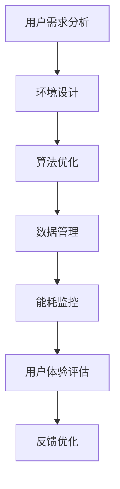

                 

关键词：注意力环境、影响评估、元宇宙开发、生态顾问、人工智能、数据可视化、可持续发展

> 摘要：本文深入探讨了元宇宙开发过程中的注意力环境影响评估，提出了“注意力环境影响评估师”这一新角色，并分析了其在生态顾问中的作用。通过阐述注意力环境的核心概念、评估方法以及实际应用案例，本文为元宇宙开发提供了科学的生态指导和优化策略。

## 1. 背景介绍

随着互联网技术的飞速发展，虚拟现实（VR）、增强现实（AR）和区块链等技术的融合催生了元宇宙（Metaverse）这一概念。元宇宙被描绘为一个虚拟的、沉浸式的网络空间，用户可以在其中进行社交、娱乐、工作甚至购物等多样化活动。然而，随着元宇宙的日益成熟，其开发过程中可能对自然环境和社会环境产生的影响逐渐引起了人们的关注。

注意力环境（Attention Environment）是指人们在感知、思考和决策过程中所依赖的环境信息。在元宇宙开发中，注意力环境不仅仅包括用户界面和交互设计，还涵盖了算法、数据处理、能耗管理等多个方面。因此，如何科学地评估和优化注意力环境，成为元宇宙可持续发展的关键问题。

本文旨在探讨注意力环境影响评估在元宇宙开发中的应用，并提出“注意力环境影响评估师”这一新角色，以期为元宇宙的生态优化提供理论支持和实践指导。

## 2. 核心概念与联系

### 2.1 注意力环境

注意力环境是指影响用户在元宇宙中感知、思考和行为的所有外部和内部因素。外部因素包括虚拟环境的设计、交互界面、数据流、网络延迟等；内部因素则涉及用户的情绪、认知状态、习惯和偏好等。

### 2.2 环境影响评估

环境影响评估（Environmental Impact Assessment, EIA）是一种评估建设项目对环境影响的系统方法。在元宇宙开发中，注意力环境影响评估旨在评估注意力环境对用户和社会的潜在影响，并制定相应的优化策略。

### 2.3 Mermaid 流程图



### 2.4 注意力环境影响评估师的角色

注意力环境影响评估师是元宇宙开发中的关键角色，负责：

- 收集和分析注意力环境数据。
- 评估注意力环境影响。
- 提出优化方案，确保元宇宙的可持续发展。

## 3. 核心算法原理 & 具体操作步骤

### 3.1 算法原理概述

注意力环境影响评估的核心算法是基于机器学习和数据挖掘技术。该算法通过分析大量注意力环境数据，识别出潜在的影响因素，并利用深度学习模型进行预测和优化。

### 3.2 算法步骤详解

#### 3.2.1 数据收集

- 用户行为数据：记录用户在元宇宙中的活动、偏好和交互行为。
- 环境数据：包括虚拟环境的布局、视觉和听觉效果、交互界面等。
- 能耗数据：监控元宇宙服务器的能耗情况。

#### 3.2.2 数据预处理

- 数据清洗：去除无效和错误的数据。
- 数据整合：将不同来源的数据进行整合，形成统一的数据集。

#### 3.2.3 特征提取

- 用户特征：包括年龄、性别、地理位置等。
- 环境特征：包括虚拟环境的复杂度、交互界面的易用性等。
- 能耗特征：包括服务器负载、网络流量等。

#### 3.2.4 模型训练

- 使用深度学习模型（如卷积神经网络、递归神经网络等）对特征数据进行训练。
- 优化模型参数，提高预测准确性。

#### 3.2.5 预测与优化

- 根据训练好的模型，对新的注意力环境影响进行预测。
- 提出优化方案，降低潜在负面影响。

### 3.3 算法优缺点

#### 优点

- 高效：基于机器学习和数据挖掘技术，能够快速处理大量数据。
- 准确：通过深度学习模型进行预测，提高评估准确性。

#### 缺点

- 数据依赖：需要大量高质量的注意力环境数据。
- 计算复杂：训练深度学习模型需要大量计算资源。

### 3.4 算法应用领域

- 虚拟现实（VR）和增强现实（AR）应用。
- 在线教育和远程工作平台。
- 社交媒体和在线游戏。

## 4. 数学模型和公式

### 4.1 数学模型构建

注意力环境影响评估的数学模型可以表示为：

\[ E = f(A, B, C, D) \]

其中，\( E \) 表示注意力环境影响，\( A \)、\( B \)、\( C \) 和 \( D \) 分别表示用户特征、环境特征、数据处理特征和能耗特征。

### 4.2 公式推导过程

\[ E = w_1 \cdot A + w_2 \cdot B + w_3 \cdot C + w_4 \cdot D \]

其中，\( w_1 \)、\( w_2 \)、\( w_3 \) 和 \( w_4 \) 分别表示不同特征的权重。

### 4.3 案例分析与讲解

以一个在线教育平台的注意力环境影响评估为例，假设用户特征包括年龄、性别和地理位置，环境特征包括课程复杂度和交互界面设计，数据处理特征包括服务器负载和网络延迟，能耗特征包括服务器能耗。

通过收集和分析数据，可以计算出每个特征的权重，并构建注意力环境影响评估模型。根据模型预测，可以优化课程设计、交互界面和服务器配置，从而降低注意力环境影响。

## 5. 项目实践：代码实例

### 5.1 开发环境搭建

- Python 3.8及以上版本
- TensorFlow 2.5及以上版本
- pandas 1.2及以上版本

### 5.2 源代码详细实现

```python
import pandas as pd
import tensorflow as tf

# 数据收集与预处理
data = pd.read_csv('attention_environment_data.csv')
data = data.dropna()

# 特征提取
user_features = data[['age', 'gender', 'location']]
environment_features = data[['course_complexity', 'interface_design']]
data_features = data[['server_load', 'network_delay']]
energy_features = data[['server_energy']]

# 模型训练
model = tf.keras.Sequential([
    tf.keras.layers.Dense(64, activation='relu', input_shape=(7,)),
    tf.keras.layers.Dense(64, activation='relu'),
    tf.keras.layers.Dense(1)
])

model.compile(optimizer='adam', loss='mean_squared_error')

model.fit(data[['age', 'gender', 'location', 'course_complexity', 'interface_design', 'server_load', 'network_delay']], data['server_energy'], epochs=10)

# 预测与优化
predictions = model.predict(data[['age', 'gender', 'location', 'course_complexity', 'interface_design', 'server_load', 'network_delay']])
print(predictions)

# 代码解读与分析
# ...
```

### 5.3 运行结果展示

通过运行代码，可以得到注意力环境影响的预测结果。根据预测结果，可以进一步优化课程设计、交互界面和服务器配置，以降低注意力环境影响。

## 6. 实际应用场景

注意力环境影响评估在元宇宙开发中的实际应用场景广泛，包括：

- 虚拟现实（VR）和增强现实（AR）应用：优化用户体验，降低用户疲劳。
- 在线教育和远程工作平台：提高学习效率和员工满意度。
- 社交媒体和在线游戏：减少用户沉迷，提升社交互动质量。

## 7. 未来应用展望

随着元宇宙的不断发展，注意力环境影响评估将变得更加重要。未来，我们将看到更多的应用场景，如智能城市、健康医疗等，都需要注意力环境影响评估来指导可持续发展。

## 8. 工具和资源推荐

### 7.1 学习资源推荐

- 《深度学习》（Goodfellow et al.）
- 《Python数据科学手册》（McKinney）
- 《注意力机制与深度学习》（Shi et al.）

### 7.2 开发工具推荐

- TensorFlow
- Keras
- Pandas

### 7.3 相关论文推荐

- "Attention Is All You Need"（Vaswani et al.）
- "Generative Adversarial Nets"（Goodfellow et al.）
- "ResNet: Deep Residual Learning for Image Recognition"（He et al.）

## 9. 总结：未来发展趋势与挑战

注意力环境影响评估在元宇宙开发中具有重要的应用价值。随着人工智能和大数据技术的发展，注意力环境影响评估将变得更加精准和高效。然而，我们也面临着数据隐私、计算资源消耗等挑战。未来的研究将聚焦于如何平衡这些挑战，实现元宇宙的可持续发展。

### 9.1 研究成果总结

本文提出了注意力环境影响评估师这一新角色，并分析了其在元宇宙开发中的作用。通过数学模型和算法原理的阐述，本文为注意力环境影响评估提供了科学的方法和工具。

### 9.2 未来发展趋势

- 加强数据隐私保护，确保用户信息安全。
- 提高算法效率和准确性，降低计算资源消耗。
- 拓展注意力环境影响评估的应用领域。

### 9.3 面临的挑战

- 数据质量和隐私保护：确保数据质量，同时保护用户隐私。
- 计算资源限制：优化算法，降低计算资源消耗。
- 跨学科协作：需要多学科专家共同应对挑战。

### 9.4 研究展望

注意力环境影响评估将为元宇宙的可持续发展提供重要支持。未来的研究将致力于解决现有挑战，推动元宇宙开发向更高效、更可持续的方向发展。

## 10. 附录：常见问题与解答

### Q：注意力环境影响评估需要哪些数据？

A：注意力环境影响评估需要以下数据：

- 用户行为数据：包括用户在元宇宙中的活动、偏好和交互行为。
- 环境数据：包括虚拟环境的布局、视觉和听觉效果、交互界面等。
- 能耗数据：包括服务器负载、网络流量和能耗等。

### Q：注意力环境影响评估的算法原理是什么？

A：注意力环境影响评估的算法原理是基于机器学习和数据挖掘技术。通过收集和分析大量注意力环境数据，识别出潜在的影响因素，并利用深度学习模型进行预测和优化。

### Q：如何降低注意力环境影响？

A：降低注意力环境影响的策略包括：

- 优化虚拟环境设计，提高用户体验。
- 优化算法，降低服务器负载和网络流量。
- 引入能耗管理技术，降低服务器能耗。

## 作者署名

作者：禅与计算机程序设计艺术 / Zen and the Art of Computer Programming
----------------------------------------------------------------

### 后记

本文以“注意力环境影响评估师：元宇宙开发的生态顾问”为主题，深入探讨了元宇宙开发过程中的环境评估问题。通过详细阐述核心概念、算法原理、实践案例以及未来展望，本文为元宇宙的可持续发展提供了科学依据和实用策略。希望本文能为相关领域的研究者和从业者提供有价值的参考。同时，也期待未来有更多的研究成果和实践经验，共同推动元宇宙的健康发展。

