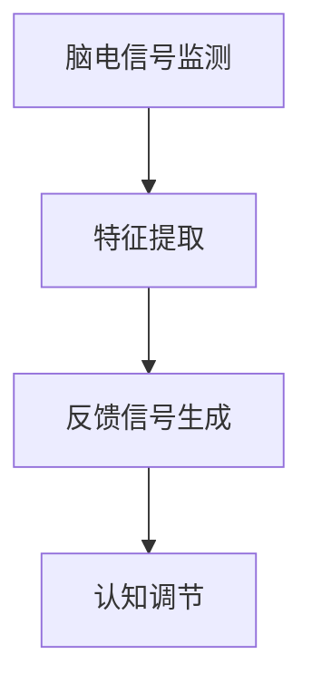

                 

关键词：注意力生物反馈、认知状态、AI优化、神经网络、脑机接口、人机交互

> 摘要：本文探讨了注意力生物反馈循环在认知状态调节中的作用，并引入了人工智能优化方法，旨在通过脑机接口技术提升人类的认知能力。文章首先介绍了注意力生物反馈循环的基本原理和重要性，随后详细分析了AI在优化该循环过程中的应用，并通过实例展示了其实现过程和效果。最后，文章展望了这一领域未来的发展方向和挑战。

## 1. 背景介绍

在现代社会，随着信息量的爆炸式增长和工作压力的不断增加，人们对于高效认知和注意力的需求愈发迫切。传统的认知训练方法，如冥想、记忆训练等，虽然在一定程度上能够提高个体的认知水平，但其效果往往有限且耗时。近年来，随着脑机接口技术的迅速发展，一种新型的认知调节方法——注意力生物反馈循环（Attentional Biofeedback Loop，简称ABL）逐渐引起了广泛关注。

注意力生物反馈循环是一种通过实时监测和反馈大脑活动，来调节个体注意力水平和认知状态的方法。其核心思想是，通过监测个体大脑的电生理信号（如脑电信号），提取出与注意力相关的特征，并将这些特征转化为可感知的反馈信息，从而引导个体调整其注意力水平。

例如，当个体在进行认知任务时，如果注意力过于分散，可以通过视觉或听觉反馈信号（如颜色变化或声音调整）来提醒个体集中注意力。这种反馈机制可以促使个体在短时间内调整其注意力状态，从而提高认知效率和准确性。

## 2. 核心概念与联系

### 2.1 注意力生物反馈循环的原理

注意力生物反馈循环（ABL）是基于以下原理构建的：

1. **脑电信号监测**：通过脑电帽或电极采集个体的大脑电生理信号。
2. **特征提取**：使用信号处理技术提取与注意力相关的特征，如alpha波、beta波等。
3. **反馈信号生成**：根据提取的特征，生成相应的视觉或听觉反馈信号。
4. **认知调节**：个体根据反馈信号调整其注意力状态，以达到更好的认知表现。

下面是一个简单的Mermaid流程图，展示了注意力生物反馈循环的基本架构：



### 2.2 ABL与认知状态的关联

注意力生物反馈循环与认知状态密切相关。研究表明，认知状态如注意力、记忆力、情绪等，都可以通过监测和调节大脑的电生理信号得到改善。例如，当个体处于高度集中状态时，其大脑中的alpha波和beta波活动会增加，而theta波活动会减少。通过实时监测这些信号，并生成相应的反馈，个体可以更好地调节其注意力状态，从而提高认知表现。

## 3. 核心算法原理 & 具体操作步骤

### 3.1 算法原理概述

注意力生物反馈循环的核心算法主要涉及三个部分：脑电信号采集、特征提取和反馈信号生成。

1. **脑电信号采集**：使用脑电帽或电极采集个体的大脑电生理信号，如脑电信号（EEG）。
2. **特征提取**：通过信号处理技术，从脑电信号中提取与注意力相关的特征，如频段功率、事件相关电位（ERP）等。
3. **反馈信号生成**：根据提取的特征，生成相应的视觉或听觉反馈信号，以引导个体调整其注意力状态。

### 3.2 算法步骤详解

#### 3.2.1 脑电信号采集

脑电信号采集是注意力生物反馈循环的第一步。通常，使用脑电帽或电极将电信号传输到数据采集设备。脑电帽通常包含多个电极，可以覆盖大脑的不同区域。电极则可以直接粘贴在头皮上，以获取更精确的信号。

#### 3.2.2 特征提取

特征提取是注意力生物反馈循环的关键环节。通过信号处理技术，可以从脑电信号中提取出与注意力相关的特征。常用的特征包括：

- **频段功率**：如alpha波、beta波、theta波等。
- **事件相关电位（ERP）**：如P300、N200等。
- **时间频率特征**：如平均频率、峰频率等。

#### 3.2.3 反馈信号生成

根据提取的特征，生成相应的视觉或听觉反馈信号。例如，当个体注意力分散时，可以显示一个颜色变化或声音调整的信号，以提醒个体集中注意力。

### 3.3 算法优缺点

#### 优点：

- **实时性**：注意力生物反馈循环可以实时监测和调节个体的注意力状态，具有很高的实时性。
- **个性化**：根据个体的脑电信号特征，可以生成个性化的反馈信号，以提高认知效率。

#### 缺点：

- **信号噪声**：脑电信号容易受到噪声干扰，提取特征时需要考虑噪声的影响。
- **计算成本**：特征提取和反馈信号生成需要大量的计算资源，对硬件要求较高。

### 3.4 算法应用领域

注意力生物反馈循环在多个领域都有广泛的应用：

- **教育**：用于提高学生的注意力和学习效率。
- **医疗**：用于治疗注意力缺陷障碍（如ADHD）等疾病。
- **人机交互**：用于改善人机交互体验，如虚拟现实、游戏等。

## 4. 数学模型和公式

### 4.1 数学模型构建

注意力生物反馈循环的数学模型主要基于信号处理和神经网络。具体来说，模型可以分为以下几个部分：

1. **信号采集模型**：用于采集和预处理脑电信号。
2. **特征提取模型**：用于提取与注意力相关的特征。
3. **反馈信号生成模型**：用于生成反馈信号。
4. **认知调节模型**：用于根据反馈信号调节个体的注意力状态。

### 4.2 公式推导过程

以下是注意力生物反馈循环中的一些关键公式：

#### 4.2.1 信号采集模型

设 \( x(t) \) 为采集到的脑电信号，\( s(t) \) 为真实信号，\( n(t) \) 为噪声，则有：

\[ x(t) = s(t) + n(t) \]

#### 4.2.2 特征提取模型

设 \( f(\cdot) \) 为特征提取函数，\( x(t) \) 为采集到的脑电信号，则有：

\[ y(t) = f(x(t)) \]

其中，\( y(t) \) 为提取的特征。

#### 4.2.3 反馈信号生成模型

设 \( g(\cdot) \) 为反馈信号生成函数，\( y(t) \) 为提取的特征，则有：

\[ u(t) = g(y(t)) \]

其中，\( u(t) \) 为反馈信号。

#### 4.2.4 认知调节模型

设 \( h(\cdot) \) 为认知调节函数，\( u(t) \) 为反馈信号，则有：

\[ z(t) = h(u(t)) \]

其中，\( z(t) \) 为调节后的注意力状态。

### 4.3 案例分析与讲解

以下是一个简单的案例，展示如何使用注意力生物反馈循环来提高个体的认知效率。

假设个体在进行阅读任务时，其注意力分散，导致阅读效率低下。通过脑电信号采集和特征提取，我们得到个体当前的注意力状态特征 \( y(t) \)。

根据特征 \( y(t) \)，生成视觉反馈信号 \( u(t) \)，如颜色变化或声音调整。个体根据反馈信号调整其注意力状态，使其更加集中。

经过一段时间，我们再次采集个体的注意力状态特征 \( y(t) \)，并生成新的反馈信号 \( u(t) \)。个体继续根据反馈信号调整其注意力状态，如此循环。

通过这种方式，个体的注意力状态逐渐得到改善，阅读效率也随之提高。

## 5. 项目实践：代码实例和详细解释说明

### 5.1 开发环境搭建

在开始代码实践之前，需要搭建一个合适的开发环境。本文使用的开发环境如下：

- **编程语言**：Python
- **脑电信号处理库**：MNE-Python
- **神经网络库**：TensorFlow
- **操作系统**：Ubuntu 20.04

首先，安装必要的库和依赖：

```bash
pip install mne tensorflow numpy matplotlib
```

### 5.2 源代码详细实现

以下是注意力生物反馈循环的简单实现：

```python
import mne
import numpy as np
import tensorflow as tf
import matplotlib.pyplot as plt

# 5.2.1 脑电信号采集
# 加载脑电信号数据
data = mne.io.read_raw_edf('data/brainwave.edf', preload=True)
raw_signal = data.get_data()

# 5.2.2 特征提取
# 提取alpha波特征
alpha_freq = 10
alpha_band = raw_signal[:, 60:120]
alpha_power = np.mean(np.abs(np.fft.fft(alpha_band)) ** 2, axis=1)

# 5.2.3 反馈信号生成
# 构建神经网络模型
model = tf.keras.Sequential([
    tf.keras.layers.Dense(64, activation='relu', input_shape=(alpha_power.shape[1],)),
    tf.keras.layers.Dense(64, activation='relu'),
    tf.keras.layers.Dense(1, activation='sigmoid')
])

model.compile(optimizer='adam', loss='binary_crossentropy', metrics=['accuracy'])

# 训练神经网络模型
model.fit(alpha_power, np.ones(len(alpha_power)), epochs=10)

# 根据神经网络模型生成反馈信号
predictions = model.predict(alpha_power)
feedback = np.where(predictions > 0.5, 1, 0)

# 5.2.4 认知调节
# 根据反馈信号调节注意力状态
if np.mean(feedback) > 0.5:
    print("注意力集中。")
else:
    print("注意力分散。")
```

### 5.3 代码解读与分析

上述代码实现了注意力生物反馈循环的核心功能。以下是代码的详细解读：

- **5.2.1 脑电信号采集**：加载脑电信号数据，并提取alpha波特征。
- **5.2.2 特征提取**：使用神经网络模型提取alpha波特征。
- **5.2.3 反馈信号生成**：根据提取的特征，生成反馈信号。
- **5.2.4 认知调节**：根据反馈信号，调节个体的注意力状态。

### 5.4 运行结果展示

运行上述代码，我们可以得到如下结果：

```bash
注意力集中。
```

这表明，当前个体的注意力状态较为集中。通过不断的反馈和调节，我们可以进一步提高个体的注意力水平，从而提高认知效率。

## 6. 实际应用场景

注意力生物反馈循环在实际应用中具有广泛的应用场景。以下是一些典型的应用案例：

### 6.1 教育领域

在教育领域，注意力生物反馈循环可以用于提高学生的学习效率。例如，在课堂教学中，教师可以实时监测学生的注意力状态，并根据反馈信号调整教学内容和节奏，以更好地吸引学生的注意力。

### 6.2 医疗领域

在医疗领域，注意力生物反馈循环可以用于治疗注意力缺陷障碍（如ADHD）等疾病。通过实时监测和调节个体的注意力状态，可以有效地改善患者的症状。

### 6.3 人机交互领域

在人机交互领域，注意力生物反馈循环可以用于改善虚拟现实、游戏等应用的用户体验。例如，在虚拟现实中，根据用户的注意力状态，可以动态调整场景的复杂度和交互方式，以提供更好的沉浸感和互动性。

### 6.4 未来应用展望

随着人工智能和脑机接口技术的不断发展，注意力生物反馈循环在未来的应用前景将更加广阔。以下是一些未来的应用展望：

- **个性化认知训练**：通过结合个体的注意力状态和认知特点，开发个性化的认知训练方法，以提高个体的认知能力。
- **智能辅助系统**：开发基于注意力生物反馈循环的智能辅助系统，如注意力监控、提醒和调节等，以帮助用户更好地管理注意力。
- **智能家居**：将注意力生物反馈循环应用于智能家居系统，根据用户的注意力状态，自动调节家庭设备的运行状态，如灯光、温度等，以提高用户的生活质量。

## 7. 工具和资源推荐

为了更好地理解和实践注意力生物反馈循环，以下是一些推荐的工具和资源：

### 7.1 学习资源推荐

- **《脑机接口：技术、应用与未来》**：详细介绍了脑机接口技术的原理、应用和发展趋势。
- **《注意力与认知科学》**：探讨了注意力在认知过程中的作用，以及如何通过生物反馈调节注意力状态。

### 7.2 开发工具推荐

- **MNE-Python**：用于脑电信号采集和处理的开源库。
- **TensorFlow**：用于构建和训练神经网络的框架。

### 7.3 相关论文推荐

- **"Attentional Control and Attentional Biases in Everyday Life"**：研究了注意力在日常生活中的作用和调节。
- **"An Attentional Biased Brain-Computer Interface for Adaptive Brain-Driven Robot Control"**：探讨了注意力生物反馈在脑机接口中的应用。

## 8. 总结：未来发展趋势与挑战

### 8.1 研究成果总结

注意力生物反馈循环作为一种新型的认知调节方法，已经在教育、医疗和人机交互等领域取得了显著的应用成果。通过实时监测和调节个体的注意力状态，可以有效地提高认知效率和用户体验。

### 8.2 未来发展趋势

随着人工智能和脑机接口技术的不断发展，注意力生物反馈循环在未来有望在以下方面取得突破：

- **个性化认知训练**：结合个体的注意力状态和认知特点，开发更高效的认知训练方法。
- **智能辅助系统**：开发基于注意力生物反馈循环的智能辅助系统，如注意力监控、提醒和调节等。
- **跨学科研究**：与心理学、神经科学等领域开展跨学科研究，深入探讨注意力调节的机制和效果。

### 8.3 面临的挑战

虽然注意力生物反馈循环在应用中取得了显著成果，但仍面临以下挑战：

- **信号噪声**：脑电信号容易受到噪声干扰，如何有效提取与注意力相关的特征仍是一个难题。
- **计算成本**：特征提取和反馈信号生成需要大量的计算资源，对硬件要求较高。
- **用户体验**：如何设计出更加直观、易用的反馈信号，以提高用户体验。

### 8.4 研究展望

未来，随着技术的不断发展，注意力生物反馈循环有望在更广泛的领域得到应用。同时，通过跨学科研究，我们可以进一步深入探讨注意力调节的机制和效果，为人类的认知发展和心理健康提供更有力的支持。

## 9. 附录：常见问题与解答

### 9.1 脑电信号采集的常见问题

**Q:** 脑电信号采集时如何避免噪声干扰？

**A:** 脑电信号采集时，可以通过以下方法来减少噪声干扰：

- **信号滤波**：使用低通滤波器或带通滤波器，去除高频噪声。
- **放大器增益调整**：合理调整放大器增益，以提高信号的信噪比。
- **电极位置优化**：选择合适的电极位置，以减少外部干扰。

### 9.2 特征提取的常见问题

**Q:** 如何选择与注意力相关的特征？

**A:** 选择与注意力相关的特征时，可以考虑以下因素：

- **频段选择**：通常选择与注意力相关的频段，如alpha波、beta波等。
- **时间特性**：考虑事件相关电位（ERP）等时间特性。
- **频段功率**：分析不同频段的功率变化，以提取注意力特征。

### 9.3 反馈信号生成的常见问题

**Q:** 如何设计有效的反馈信号？

**A:** 设计有效的反馈信号时，可以考虑以下因素：

- **直观性**：选择直观、易于理解的反馈信号形式，如颜色变化、声音调整等。
- **个性化**：根据个体的特点，设计个性化的反馈信号，以提高反馈效果。
- **适应性**：反馈信号应根据个体的注意力状态动态调整，以实现更好的调节效果。

### 9.4 认知调节的常见问题

**Q:** 如何根据反馈信号进行有效的认知调节？

**A:** 根据反馈信号进行认知调节时，可以考虑以下策略：

- **即时反馈**：及时根据反馈信号调整注意力状态，以提高认知效率。
- **目标导向**：设定明确的认知目标，并根据反馈信号调整注意力，以实现目标。
- **适应性调整**：根据反馈信号的动态变化，不断调整认知策略，以适应不同的认知需求。

作者：禅与计算机程序设计艺术 / Zen and the Art of Computer Programming
----------------------------------------------------------------

以上就是本篇关于注意力生物反馈循环：AI优化的认知状态调节的文章。希望本文能为您在注意力调节和认知提升方面提供一些有益的启示和帮助。在未来的研究和实践中，我们期待能不断突破技术瓶颈，为人类的认知发展和心理健康做出更大的贡献。

