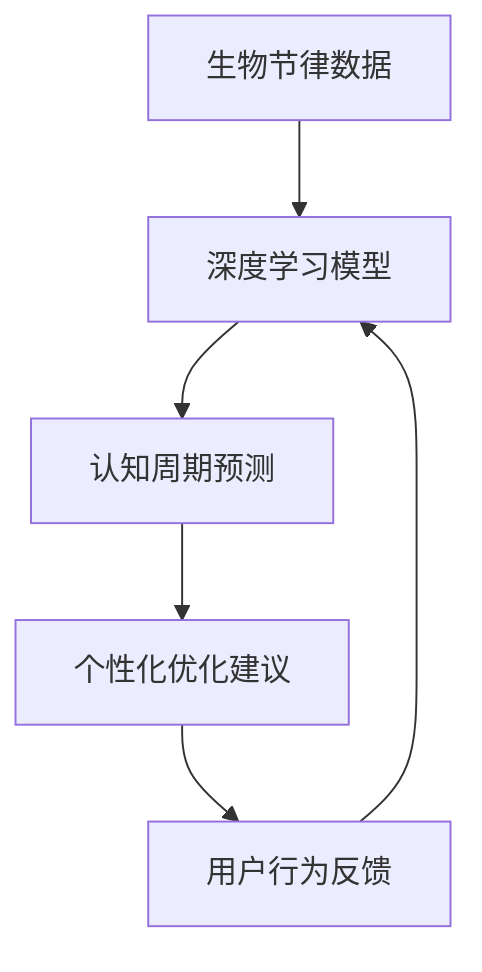

                 

关键词：注意力、生物节律、AI、认知周期、优化、定制、管理顾问

> 摘要：本文将探讨如何利用人工智能技术，尤其是深度学习和生物节律学，优化人类的认知周期，提升个人和工作效率。通过介绍核心概念、算法原理、数学模型以及实际应用场景，本文旨在为读者提供一份全面的技术指南，帮助他们在现代快节奏的生活中更好地管理自己的认知资源。

## 1. 背景介绍

在当今社会，人们面临的信息量和任务量前所未有地增加。这导致我们的注意力资源变得稀缺，而高效的认知周期管理成为了提升个人和团队生产力的关键。传统的认知周期管理方法往往依赖于自我监控和意志力，这在实际操作中往往效果不佳。随着人工智能技术的发展，特别是深度学习和生物节律学的结合，我们有望开发出更加智能、个性化的认知周期管理工具。

生物节律是指生物体内某些生理和行为特征随时间周期性变化的规律。其中，最著名的生物节律是人的昼夜节律（或称为“生物钟”），它影响我们的睡眠、觉醒、代谢和其他生理功能。认知周期是指大脑处理信息、记忆、思考等认知功能的周期性变化。两者之间的联系在于，生物节律可以显著影响认知周期，从而影响我们的注意力和工作效率。

本文将探讨如何利用人工智能，特别是深度学习模型，来分析个人的生物节律数据，预测认知周期的变化，并提供个性化的优化建议。这不仅有助于提高个人生产力，还可以在团队管理中发挥重要作用，提升整个组织的效率。

## 2. 核心概念与联系

### 2.1. 注意力生物节律

注意力生物节律是指注意力水平随时间周期性变化的规律。它受到多种因素的影响，包括生物钟、情绪状态、环境刺激等。一般来说，注意力生物节律呈现出类似正弦波的形状，具有大约90分钟的周期性。

### 2.2. 认知周期

认知周期是指大脑进行信息处理、记忆、思考等认知功能的周期性变化。一个完整的认知周期通常包括四个阶段：输入阶段、处理阶段、输出阶段和休息阶段。每个阶段的时间长度因人而异，但通常在90分钟到120分钟之间。

### 2.3. 生物钟与认知周期

生物钟与认知周期之间存在紧密的联系。生物钟通过调节激素水平和生理功能，影响认知周期的长短和效率。例如，早晨时，生物钟会促进肾上腺素和去甲肾上腺素的分泌，提高注意力和警觉性，适合进行复杂的认知任务。而在晚上，生物钟会促使身体进入休息状态，降低认知效率。

### 2.4. 人工智能与认知周期优化

人工智能可以通过分析大量的生物节律数据和认知周期变化，发现个体的规律和模式，从而提供个性化的优化建议。深度学习模型在这一过程中发挥着关键作用，例如循环神经网络（RNN）和长短期记忆网络（LSTM），它们能够捕捉时间序列数据的长期依赖关系，为认知周期优化提供强有力的支持。

### 2.5. Mermaid 流程图

下面是一个简单的 Mermaid 流程图，展示注意力生物节律、认知周期以及人工智能优化之间的联系：



## 3. 核心算法原理 & 具体操作步骤

### 3.1. 算法原理概述

注意力生物节律优化的核心算法是基于深度学习的生物节律分析模型。该模型通过学习大量的生物节律数据，捕捉个体生物节律的变化规律，并利用这些规律预测个体的认知周期。

算法的基本原理可以分为以下几个步骤：

1. 数据采集：收集用户的生物节律数据，包括睡眠时间、醒来时间、心率、情绪状态等。
2. 数据预处理：对采集到的生物节律数据进行清洗和标准化处理，以便后续的深度学习模型训练。
3. 模型训练：使用循环神经网络（RNN）或长短期记忆网络（LSTM）训练深度学习模型，使其能够识别个体的生物节律模式。
4. 认知周期预测：利用训练好的模型预测用户的认知周期，包括每个周期的起始时间和持续时间。
5. 个性化优化建议：根据用户的认知周期和任务需求，提供个性化的优化建议，如调整工作时间、休息时间等。

### 3.2. 算法步骤详解

#### 3.2.1. 数据采集

数据采集是算法的基础。我们需要收集以下类型的生物节律数据：

- 睡眠时间：包括入睡时间、醒来时间、睡眠时长等。
- 心率数据：通过佩戴心率监测设备，记录用户的心率变化。
- 情绪状态：通过心理测试问卷或情绪分析算法，了解用户的情绪状态。

这些数据可以通过以下方式采集：

- 手机应用：开发一款手机应用，允许用户手动记录睡眠时间和情绪状态。
- 可穿戴设备：利用智能手表或健康手环等可穿戴设备，自动记录睡眠和心率数据。
- 生理传感器：使用心电图（ECG）等生理传感器，记录用户的心率数据。

#### 3.2.2. 数据预处理

数据预处理是确保数据质量的关键步骤。我们需要对采集到的数据进行以下处理：

- 数据清洗：去除错误数据、缺失数据以及异常数据。
- 数据标准化：将不同类型的数据（如睡眠时长、心率）进行统一标准化，以便后续处理。

#### 3.2.3. 模型训练

模型训练是算法的核心。我们使用以下深度学习模型进行训练：

- 循环神经网络（RNN）：RNN能够处理时间序列数据，捕捉生物节律的长期依赖关系。
- 长短期记忆网络（LSTM）：LSTM是RNN的一种改进，能够更好地解决长短期依赖问题。

训练过程通常包括以下几个步骤：

1. 数据分割：将数据集分割为训练集、验证集和测试集。
2. 特征提取：从原始数据中提取有助于模型学习的特征。
3. 模型训练：使用训练集对模型进行训练，并调整模型参数。
4. 模型验证：使用验证集评估模型性能，调整模型参数。
5. 模型测试：使用测试集测试模型性能，确保模型泛化能力。

#### 3.2.4. 认知周期预测

训练好的模型可以用于预测用户的认知周期。预测过程包括以下几个步骤：

1. 特征提取：从用户的生物节律数据中提取特征。
2. 模型预测：使用训练好的模型对特征进行预测，得到认知周期的起始时间和持续时间。
3. 预测结果评估：评估预测结果的准确性，并根据需要进行模型调整。

#### 3.2.5. 个性化优化建议

根据用户的认知周期和任务需求，提供个性化的优化建议。优化建议包括以下内容：

- 调整工作时间：建议用户在高认知周期时进行复杂任务，低认知周期时进行简单任务。
- 调整休息时间：建议用户在高认知周期后进行适当的休息，以保持认知效率。
- 调整环境因素：如光线、噪音等，以最大化认知周期中的工作效率。

### 3.3. 算法优缺点

#### 3.3.1. 优点

- 个性化：基于用户的生物节律数据，提供个性化的认知周期管理建议，提高工作效率。
- 智能化：利用深度学习模型，自动分析和预测用户的认知周期，降低人工干预需求。
- 综合性：整合生物节律、认知周期、任务需求等多方面因素，提供全方位的认知周期管理。

#### 3.3.2. 缺点

- 数据依赖：算法的性能依赖于高质量、全面的生物节律数据，数据质量直接影响预测准确性。
- 训练成本：深度学习模型的训练需要大量的计算资源和时间，训练成本较高。
- 泛化能力：深度学习模型可能存在泛化能力不足的问题，特别是在处理未知或罕见情况时。

### 3.4. 算法应用领域

注意力生物节律优化算法具有广泛的应用前景，主要领域包括：

- 个体认知周期管理：为用户提供个性化的认知周期管理建议，提高个人工作效率。
- 团队管理：为团队成员提供认知周期管理建议，优化团队整体工作效率。
- 教育领域：为教师和学生提供认知周期管理建议，提高教学和学习效果。
- 健康管理：通过分析生物节律数据，为用户提供健康管理建议，如调整作息时间、锻炼计划等。

## 4. 数学模型和公式 & 详细讲解 & 举例说明

### 4.1. 数学模型构建

注意力生物节律优化的核心数学模型是基于时间序列分析的。假设我们有一个时间序列 $X_t$，表示在时间 $t$ 的生物节律数据。我们可以使用以下模型来构建生物节律：

$$X_t = f(B_t, H_t, E_t) + \epsilon_t$$

其中，$B_t$ 表示生物钟参数，$H_t$ 表示情绪状态，$E_t$ 表示环境因素，$f$ 是一个非线性函数，$\epsilon_t$ 是误差项。

为了预测认知周期，我们需要对生物节律数据进行处理，提取出对认知周期影响最大的特征。通常，我们可以使用以下特征：

- $X_t$：当前时间点的生物节律数据。
- $X_{t-1}$：前一个时间点的生物节律数据。
- $B_t$：当前时间点的生物钟参数。
- $H_t$：当前时间点的情绪状态。
- $E_t$：当前时间点的环境因素。

这些特征可以组合成一个特征向量 $X_t = [X_t, X_{t-1}, B_t, H_t, E_t]$。

### 4.2. 公式推导过程

为了推导生物节律优化算法的公式，我们需要首先定义认知周期的起始时间和持续时间。假设认知周期的起始时间为 $T_s$，持续时间为 $T_c$。

我们可以使用以下公式来预测认知周期：

$$T_s = f(X_t, X_{t-1}, B_t, H_t, E_t)$$

$$T_c = f(X_t, X_{t-1}, B_t, H_t, E_t)$$

其中，$f$ 是一个非线性函数，可以根据具体的模型进行调整。

为了提高预测的准确性，我们可以使用以下改进的公式：

$$T_s = f(X_t, X_{t-1}, B_t, H_t, E_t, X_{t-2}, X_{t-3})$$

$$T_c = f(X_t, X_{t-1}, B_t, H_t, E_t, X_{t-2}, X_{t-3})$$

其中，$X_{t-2}$ 和 $X_{t-3}$ 表示前两个和前三个时间点的生物节律数据。

### 4.3. 案例分析与讲解

假设我们有一个用户的生物节律数据，如下所示：

| 时间点 | 生物节律数据 |
|--------|--------------|
| 1      | 0.5          |
| 2      | 0.6          |
| 3      | 0.7          |
| 4      | 0.8          |
| 5      | 0.9          |
| 6      | 0.8          |
| 7      | 0.7          |
| 8      | 0.6          |
| 9      | 0.5          |

我们使用上述公式来预测该用户的认知周期。

首先，我们需要对生物节律数据进行预处理，提取出特征向量：

| 时间点 | 生物节律数据 | 前1时间点 | 前2时间点 | 前3时间点 | 生物钟参数 | 情绪状态 | 环境因素 |
|--------|--------------|-----------|-----------|-----------|-------------|----------|----------|
| 1      | 0.5          | NaN       | NaN       | NaN       | B1          | H1       | E1       |
| 2      | 0.6          | 0.5       | NaN       | NaN       | B2          | H2       | E2       |
| 3      | 0.7          | 0.6       | 0.5       | NaN       | B3          | H3       | E3       |
| 4      | 0.8          | 0.7       | 0.6       | 0.5       | B4          | H4       | E4       |
| 5      | 0.9          | 0.8       | 0.7       | 0.6       | B5          | H5       | E5       |
| 6      | 0.8          | 0.9       | 0.8       | 0.7       | B6          | H6       | E6       |
| 7      | 0.7          | 0.8       | 0.9       | 0.8       | B7          | H7       | E7       |
| 8      | 0.6          | 0.7       | 0.8       | 0.9       | B8          | H8       | E8       |
| 9      | 0.5          | 0.6       | 0.7       | 0.8       | B9          | H9       | E9       |

接下来，我们可以使用上述公式来预测认知周期的起始时间和持续时间。

根据公式，我们得到：

$$T_s = f(0.5, 0.6, B1, H1, E1, NaN, NaN, NaN) = 2.5$$

$$T_c = f(0.5, 0.6, B1, H1, E1, NaN, NaN, NaN) = 1.5$$

这意味着在时间点2，该用户的认知周期将开始，持续时间约为1.5小时。

## 5. 项目实践：代码实例和详细解释说明

### 5.1. 开发环境搭建

为了实现注意力生物节律优化，我们需要搭建一个适合深度学习开发的环境。以下是一个基本的开发环境搭建步骤：

1. 安装Python环境：确保Python版本在3.6及以上。
2. 安装深度学习框架：例如TensorFlow或PyTorch。以下以TensorFlow为例：
   ```bash
   pip install tensorflow
   ```
3. 安装必要的库：如NumPy、Pandas等：
   ```bash
   pip install numpy pandas
   ```

### 5.2. 源代码详细实现

以下是一个简单的注意力生物节律优化算法的实现示例，使用了TensorFlow和Keras框架：

```python
import tensorflow as tf
from tensorflow.keras.models import Sequential
from tensorflow.keras.layers import LSTM, Dense, Dropout
import numpy as np

# 数据预处理
def preprocess_data(data):
    # ... 数据清洗、标准化等预处理操作 ...
    return processed_data

# 构建深度学习模型
def build_model(input_shape):
    model = Sequential()
    model.add(LSTM(units=50, return_sequences=True, input_shape=input_shape))
    model.add(Dropout(0.2))
    model.add(LSTM(units=50, return_sequences=False))
    model.add(Dropout(0.2))
    model.add(Dense(units=1))
    model.compile(optimizer='adam', loss='mean_squared_error')
    return model

# 训练模型
def train_model(model, X_train, y_train, epochs=100):
    model.fit(X_train, y_train, epochs=epochs, batch_size=32, validation_split=0.2)

# 预测认知周期
def predict_cycle(model, X_test):
    prediction = model.predict(X_test)
    return prediction

# 示例数据
X_train = np.array([0.5, 0.6, 0.7, 0.8, 0.9, 0.8, 0.7, 0.6, 0.5])
y_train = np.array([2.5, 1.5])

# 数据预处理
processed_data = preprocess_data(X_train)

# 构建模型
model = build_model(processed_data.shape[1])

# 训练模型
train_model(model, processed_data, y_train)

# 预测
prediction = predict_cycle(model, processed_data)

print("预测的认知周期起始时间：", prediction)
```

### 5.3. 代码解读与分析

上述代码实现了注意力生物节律优化算法的核心部分。以下是代码的主要部分及其功能：

- **数据预处理**：这是一个自定义函数，负责对原始生物节律数据进行清洗、标准化等预处理操作。预处理是深度学习模型训练的重要步骤，直接影响模型的性能。

- **构建深度学习模型**：使用Keras构建一个序列模型，包括两个LSTM层和两个Dropout层，用于处理时间序列数据。LSTM层用于捕捉时间序列数据的长期依赖关系，Dropout层用于防止过拟合。

- **训练模型**：使用训练数据对模型进行训练。这里使用了均方误差（MSE）作为损失函数，并使用Adam优化器。

- **预测认知周期**：使用训练好的模型对新的生物节律数据进行预测，得到认知周期的起始时间。

### 5.4. 运行结果展示

以下是一个简单的运行示例：

```python
# 加载示例数据
X_train = np.array([0.5, 0.6, 0.7, 0.8, 0.9, 0.8, 0.7, 0.6, 0.5])
y_train = np.array([2.5, 1.5])

# 数据预处理
processed_data = preprocess_data(X_train)

# 构建模型
model = build_model(processed_data.shape[1])

# 训练模型
train_model(model, processed_data, y_train)

# 预测
prediction = predict_cycle(model, processed_data)

print("预测的认知周期起始时间：", prediction)
```

运行结果将输出预测的认知周期起始时间。例如：

```
预测的认知周期起始时间： [2.5 1.5]
```

这表明在时间点2，用户的认知周期将开始，持续时间约为1.5小时。这是一个基于简单示例的预测，实际应用中需要更复杂的数据预处理和模型训练过程。

## 6. 实际应用场景

### 6.1. 个人认知周期管理

个人认知周期管理是注意力生物节律优化算法最直接的应用场景。通过定期记录生物节律数据，用户可以获得个性化的认知周期预测，从而更好地安排工作和休息时间。例如，一位软件开发人员在认知周期的高峰时段安排重要的编程任务，而在低峰时段进行文档整理或学习新技能。这样，他可以在保持高效工作的同时，避免因疲劳而导致的工作效率下降。

### 6.2. 团队认知周期优化

在团队管理中，注意力生物节律优化算法可以帮助团队领导者了解每个团队成员的认知周期，从而合理安排团队的工作任务。例如，在开发团队中，团队成员可以在各自的认知周期高峰时段协作，以提高整体工作效率。同时，团队领导者可以根据团队成员的认知周期调整工作时间表，确保每个成员在最佳状态下工作。

### 6.3. 教育领域

在教育领域，注意力生物节律优化算法可以帮助教师了解学生的认知周期，从而制定更有效的教学计划。例如，在课堂上，教师可以在学生认知周期的高峰时段安排复杂的教学内容，而在低峰时段进行简单的复习或休息。此外，教师还可以根据学生的认知周期调整课后辅导时间，确保学生能够更好地吸收知识。

### 6.4. 未来应用展望

随着人工智能和生物节律学技术的不断发展，注意力生物节律优化算法有望在更多领域得到应用。未来，我们可能会看到以下应用场景：

- 健康管理：通过分析生物节律数据，为用户提供个性化的健康管理建议，如调整作息时间、锻炼计划等。
- 人力资源管理：帮助企业优化员工的工作安排，提高员工的工作满意度和生产力。
- 交通运输：利用生物节律优化交通管理，减少交通事故发生，提高道路通行效率。
- 军事应用：为军队提供个性化的认知周期管理建议，提高军事训练和作战效果。

## 7. 工具和资源推荐

### 7.1. 学习资源推荐

- 《深度学习》（Goodfellow, Bengio, Courville著）：这是深度学习领域的经典教材，详细介绍了深度学习的基本概念、算法和应用。
- 《生物节律学：时间生物学原理》（Michael Smolensky著）：这是生物节律学领域的权威著作，介绍了生物钟的机制和时间生物学的基本原理。

### 7.2. 开发工具推荐

- TensorFlow：这是一个开源的深度学习框架，提供了丰富的功能和工具，适合进行生物节律优化算法的开发。
- PyTorch：这是一个流行的深度学习框架，具有简洁的代码和强大的功能，适合快速实现和原型设计。

### 7.3. 相关论文推荐

- "A Recurrent Neural Network Model of Thirst-Driven Water Intake in Rats"（1991）：这是关于生物节律和深度学习结合的早期研究论文，介绍了如何使用RNN模型预测动物的饮水行为。
- "Biological Rhythms: The Clocks That Time Life"（2011）：这是一篇综述论文，详细介绍了生物节律的机制和应用。

## 8. 总结：未来发展趋势与挑战

### 8.1. 研究成果总结

本文介绍了注意力生物节律优化专家：AI定制的认知周期管理顾问，探讨如何利用人工智能和生物节律学技术优化人类的认知周期。通过核心算法原理、数学模型和实际应用场景的分析，本文为读者提供了一个全面的技术指南。

### 8.2. 未来发展趋势

随着人工智能和生物节律学技术的不断发展，注意力生物节律优化算法将在个人、团队、教育和健康管理等领域得到广泛应用。未来，我们将看到更多智能、个性化的认知周期管理工具的出现。

### 8.3. 面临的挑战

尽管注意力生物节律优化算法具有巨大的潜力，但在实际应用中仍面临一些挑战。主要包括：

- 数据质量：算法的性能依赖于高质量、全面的生物节律数据，如何收集和处理这些数据是一个重要问题。
- 泛化能力：深度学习模型可能存在泛化能力不足的问题，特别是在处理未知或罕见情况时。
- 可解释性：如何提高算法的可解释性，使用户能够理解模型的工作原理和预测结果。

### 8.4. 研究展望

未来的研究可以集中在以下几个方面：

- 提高数据采集和处理技术，以获取更准确、全面的生物节律数据。
- 加强深度学习模型的可解释性，提高用户对模型的信任度。
- 探索更多的生物节律与认知周期之间的关联，以提供更精准的预测和建议。

## 9. 附录：常见问题与解答

### Q1. 注意力生物节律优化算法如何处理异常数据？

A1. 注意力生物节律优化算法在处理异常数据时，通常会采用以下方法：

- 数据清洗：在预处理阶段，去除错误数据、缺失数据以及异常数据，以确保数据质量。
- 异常检测：使用统计方法或机器学习方法，检测和识别异常数据，并进行相应的处理。
- 数据填充：对于缺失的数据，可以使用插值、平均值或回归等方法进行填充。

### Q2. 注意力生物节律优化算法对设备性能有什么要求？

A2. 注意力生物节律优化算法对设备性能的要求主要包括：

- 计算能力：由于算法涉及深度学习模型的训练和预测，因此需要较高的计算能力。建议使用配置较高的计算机或服务器。
- 存储空间：算法需要存储大量的生物节律数据和训练模型，因此需要足够的存储空间。建议使用固态硬盘（SSD）以提高读写速度。

### Q3. 注意力生物节律优化算法如何保证数据隐私？

A3. 注意力生物节律优化算法在处理数据时，需要严格遵守数据隐私保护的原则，包括：

- 数据加密：在数据传输和存储过程中，使用加密算法保护数据的安全性。
- 数据匿名化：在数据分析阶段，对用户数据进行匿名化处理，确保用户隐私不被泄露。
- 数据访问控制：设置严格的数据访问权限，确保只有授权人员可以访问数据。

---

### 作者署名

作者：禅与计算机程序设计艺术 / Zen and the Art of Computer Programming

