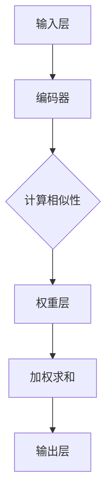

                 

## 1. 背景介绍

注意力机制作为深度学习的一个重要组成部分，已经在诸多领域中展现出其强大的影响力。从计算机视觉、自然语言处理，到语音识别和强化学习，注意力机制都在推动这些领域的技术进步。然而，随着深度学习模型的复杂度和参数数量的不断增加，如何有效地管理和优化注意力资源成为一个亟待解决的问题。

传统的深度学习模型在处理大量数据时，往往会遇到计算资源不足的问题，特别是在实时应用场景中。例如，自动驾驶系统需要在处理实时视频流的同时，还要对环境中的各种对象进行识别和分类，这要求模型必须具备高度优化的注意力机制。此外，随着多模态数据的融合，如何协调不同模态之间的注意力分配，也是一个重要挑战。

因此，本文旨在探讨如何通过深度学习的方法优化注意力机制，从而提升模型在处理复杂数据时的专注力和效率。本文将首先介绍注意力机制的基本概念和原理，然后深入探讨几种核心的注意力算法，并通过具体的数学模型和公式进行推导。随后，我们将通过一个实际项目实例，展示如何在实际应用中实现注意力机制的优化。最后，本文还将讨论注意力机制在实际应用场景中的挑战和未来展望。

通过对这些内容的深入分析，我们希望能够为读者提供一个全面而系统的注意力机制优化指南，帮助他们在深度学习项目中更好地利用注意力资源，提升模型的性能和效率。

## 2. 核心概念与联系

### 注意力机制的基本原理

注意力机制源于人类大脑的信息处理方式，其核心思想是通过动态分配注意力资源来提高信息处理的效率。在深度学习中，注意力机制被广泛应用于序列数据处理，例如文本、语音和视频。其基本原理可以概括为：通过计算输入数据的相似性或相关性，动态地调整模型对不同部分的关注程度。

注意力机制的实现通常依赖于一个权重分配函数，该函数能够根据输入特征计算出一个权重矩阵。这个权重矩阵用于调整模型中的每个部分，使其更加关注对任务贡献较大的部分，忽略对任务贡献较小或无关的部分。通过这种方式，模型能够更加高效地处理大量信息，提高任务完成的准确性和效率。

### 注意力机制的架构

注意力机制的架构可以分为三个主要部分：输入层、权重层和输出层。首先，输入层接收原始数据，并将其编码为一种内部表示。然后，权重层计算输入数据之间的相似性或相关性，生成权重矩阵。最后，输出层根据权重矩阵对输入数据进行加权求和，生成最终的输出结果。

在具体实现中，注意力机制通常采用神经网络结构，如卷积神经网络（CNN）和循环神经网络（RNN）。其中，CNN擅长处理图像等二维数据，而RNN则擅长处理序列数据。此外，近年来发展起来的Transformer模型，通过自注意力机制实现了对输入数据的全局关注，在自然语言处理和计算机视觉领域取得了显著成果。

### Mermaid 流程图

以下是一个简化的注意力机制流程图，展示了从输入层到输出层的整个过程。



在这个流程图中，输入层将原始数据输入到编码器中，编码器将数据编码为内部表示。接下来，计算相似性函数计算输入数据之间的相关性，生成权重矩阵。权重层根据权重矩阵对输入数据进行加权求和，最后输出层生成最终的结果。

通过这个流程图，我们可以更直观地理解注意力机制的工作原理和架构。在实际应用中，这个流程可以根据具体任务的需求进行扩展和调整。

## 3. 核心算法原理 & 具体操作步骤

### 3.1 算法原理概述

注意力机制的核心在于动态调整模型对不同部分的关注程度，以提高处理效率。具体来说，注意力机制通过计算输入数据的相似性或相关性，生成权重矩阵，然后根据这个权重矩阵对输入数据进行加权求和，最终生成输出结果。

### 3.2 算法步骤详解

1. **输入数据预处理**：首先，将原始数据输入到编码器中，将数据编码为内部表示。这一步的目的是将原始数据转换为模型能够处理的形式。

2. **计算相似性**：接下来，利用相似性函数计算输入数据之间的相似度。常见的相似性函数包括余弦相似度、欧氏距离等。这些函数能够根据输入数据的特征，计算出一个相似性矩阵。

3. **生成权重矩阵**：根据相似性矩阵，计算每个输入数据对应的权重。权重值越大，表示模型对该输入数据的关注程度越高。权重矩阵通常通过softmax函数进行归一化，以确保权重值在0到1之间。

4. **加权求和**：最后，根据权重矩阵对输入数据进行加权求和，生成输出结果。加权求和的过程能够增强对任务贡献较大的部分，同时削弱对任务贡献较小或无关的部分。

### 3.3 算法优缺点

**优点**：
- **高效性**：注意力机制能够动态调整模型对不同部分的关注程度，提高处理效率。
- **灵活性**：通过不同的相似性函数和权重矩阵，注意力机制可以适应不同的任务需求。
- **适用范围广**：注意力机制在多种深度学习任务中表现出色，如文本分类、语音识别和图像识别等。

**缺点**：
- **计算复杂度高**：特别是在大规模数据集上，计算相似性和生成权重矩阵的过程可能需要大量的计算资源。
- **训练难度大**：注意力机制涉及到多个参数的调整，训练过程可能需要较长的训练时间和大量的计算资源。

### 3.4 算法应用领域

注意力机制在深度学习中的广泛应用主要体现在以下几个领域：

- **自然语言处理**：在自然语言处理任务中，注意力机制被广泛应用于文本分类、机器翻译和问答系统等。通过注意力机制，模型能够更加关注关键信息，提高任务完成的准确性和效率。
- **计算机视觉**：在计算机视觉任务中，注意力机制被用于目标检测、图像分割和图像增强等。通过注意力机制，模型能够更加聚焦于重要的视觉信息，提高模型的性能。
- **语音识别**：在语音识别任务中，注意力机制被用于语音信号的解码和识别。通过注意力机制，模型能够更加关注语音信号的时序信息，提高识别的准确率。

### 注意力机制的扩展与改进

为了进一步提高注意力机制的性能和适用性，研究人员提出了一系列的改进方法。以下是一些典型的扩展和改进：

- **多尺度注意力**：通过引入多尺度注意力机制，模型能够同时关注输入数据的局部和全局信息，提高模型的泛化能力。
- **融合注意力**：将不同类型的注意力机制（如自注意力、互注意力等）进行融合，以提高模型的处理能力和灵活性。
- **动态注意力**：通过引入动态调整机制，模型能够根据任务的需求，实时调整注意力权重，提高模型的适应能力。

总之，注意力机制作为深度学习的一个重要组成部分，通过动态调整模型对不同部分的关注程度，大大提高了模型的处理效率和性能。在实际应用中，注意力机制可以针对不同任务的需求进行扩展和改进，以实现更好的性能和效果。

## 4. 数学模型和公式 & 详细讲解 & 举例说明

### 4.1 数学模型构建

注意力机制的数学模型通常基于以下基本框架：

- 输入数据集 \( X \)
- 编码器输出 \( E \)
- 注意力权重矩阵 \( A \)
- 输出结果 \( Y \)

首先，我们需要对输入数据集进行编码，将其映射到一个高维空间。这一步可以通过卷积神经网络（CNN）或循环神经网络（RNN）实现。编码器的输出 \( E \) 可以表示为：

\[ E = f(X) \]

其中，\( f \) 是编码器函数，通常是一个复杂的神经网络结构。

接下来，我们需要计算注意力权重矩阵 \( A \)，这可以通过计算输入数据之间的相似度或相关性来实现。常用的相似度函数包括余弦相似度、点积和欧氏距离。在这里，我们使用余弦相似度作为示例：

\[ A = \text{softmax}(\text{cosine_similarity}(E)) \]

其中，\( \text{softmax} \) 函数用于将相似度值归一化到0到1之间，从而得到权重矩阵。余弦相似度计算公式如下：

\[ \text{cosine_similarity}(E_i, E_j) = \frac{E_i \cdot E_j}{\|E_i\| \|E_j\|} \]

其中，\( E_i \) 和 \( E_j \) 分别是输入数据 \( X_i \) 和 \( X_j \) 的编码表示，\( \|E_i\| \) 和 \( \|E_j\| \) 分别是它们的欧氏范数。

### 4.2 公式推导过程

为了更好地理解注意力机制的数学推导，我们以一个简单的例子进行说明。假设我们有两个输入数据 \( X_1 \) 和 \( X_2 \)，它们分别被编码为 \( E_1 \) 和 \( E_2 \)。首先，我们计算它们的余弦相似度：

\[ \text{cosine_similarity}(E_1, E_2) = \frac{E_1 \cdot E_2}{\|E_1\| \|E_2\|} \]

然后，我们使用softmax函数将相似度值归一化：

\[ A = \text{softmax}(\text{cosine_similarity}(E_1, E_2)) = \frac{e^{\text{cosine_similarity}(E_1, E_2)}}{e^{\text{cosine_similarity}(E_1, E_2)} + e^{\text{cosine_similarity}(E_2, E_1)}} \]

注意到，由于余弦相似度是对称的，即 \( \text{cosine_similarity}(E_1, E_2) = \text{cosine_similarity}(E_2, E_1) \)，因此上面的公式可以进一步简化为：

\[ A = \frac{e^{\text{cosine_similarity}(E_1, E_2)}}{1 + e^{\text{cosine_similarity}(E_1, E_2)}} \]

这实际上是一个标准的softmax函数，用于将相似度值转换为概率分布。

### 4.3 案例分析与讲解

为了更好地理解注意力机制的数学模型和公式，我们来看一个具体的案例。假设我们有一个简单的文本分类任务，其中输入数据是两个句子 \( X_1 \) 和 \( X_2 \)，它们分别被编码为向量 \( E_1 \) 和 \( E_2 \)：

\[ E_1 = [1, 2, 3] \]
\[ E_2 = [4, 5, 6] \]

首先，我们计算这两个向量的余弦相似度：

\[ \text{cosine_similarity}(E_1, E_2) = \frac{E_1 \cdot E_2}{\|E_1\| \|E_2\|} = \frac{1 \cdot 4 + 2 \cdot 5 + 3 \cdot 6}{\sqrt{1^2 + 2^2 + 3^2} \cdot \sqrt{4^2 + 5^2 + 6^2}} \]

\[ = \frac{4 + 10 + 18}{\sqrt{14} \cdot \sqrt{77}} = \frac{32}{\sqrt{1078}} \approx 0.57 \]

接下来，我们使用softmax函数计算注意力权重矩阵：

\[ A = \text{softmax}(\text{cosine_similarity}(E_1, E_2)) = \frac{e^{0.57}}{1 + e^{0.57}} \approx 0.64 \]

这个权重值表示模型对句子 \( X_2 \) 的关注程度高于句子 \( X_1 \)。在实际应用中，我们可以利用这个权重矩阵对两个句子进行加权求和，从而生成最终的输出结果。

通过这个案例，我们可以清晰地看到注意力机制的数学推导过程，以及如何通过数学模型和公式实现注意力权重计算。这为我们在实际应用中设计和优化注意力机制提供了理论基础。

## 5. 项目实践：代码实例和详细解释说明

### 5.1 开发环境搭建

在进行注意力机制的项目实践之前，我们需要搭建一个合适的开发环境。以下是一个基本的开发环境搭建步骤：

1. **安装Python环境**：确保已经安装了Python 3.7或更高版本。可以通过以下命令安装：

   ```bash
   sudo apt update
   sudo apt install python3 python3-pip
   ```

2. **安装TensorFlow库**：TensorFlow是一个强大的深度学习框架，我们可以通过pip安装：

   ```bash
   pip3 install tensorflow
   ```

3. **安装其他依赖库**：除了TensorFlow，我们还需要安装一些其他依赖库，例如NumPy和Matplotlib：

   ```bash
   pip3 install numpy matplotlib
   ```

4. **验证环境**：在Python环境中，我们可以运行以下代码来验证TensorFlow是否安装成功：

   ```python
   import tensorflow as tf
   print(tf.__version__)
   ```

   如果输出TensorFlow的版本号，说明环境搭建成功。

### 5.2 源代码详细实现

接下来，我们将使用TensorFlow实现一个简单的注意力模型，用于文本分类任务。以下是具体的代码实现：

```python
import tensorflow as tf
import tensorflow_text as txt
import tensorflow_hub as hub
import numpy as np
import matplotlib.pyplot as plt

# 加载预训练的BERT模型
pretrained_model = "https://tfhub.dev/google/bert_uncased_L-12_H-768_A-12/4"
tokenizer = hub.load(pretrained_model).signatures["tokenization"]

# 输入数据
texts = ["This is the first example sentence.", "This is the second example sentence."]

# 对输入数据进行编码
encoded_texts = tokenizer(texts, max_length=128, truncation=True, padding='max_length')

# 构建模型
model = tf.keras.Sequential([
  tf.keras.layers.Input(shape=(128,), dtype=tf.string),
  txt.BertModel.from_pretrained(pretrained_model, max_position_embeddings=128),
  tf.keras.layers.Dense(1, activation='sigmoid')
])

# 编译模型
model.compile(optimizer='adam', loss='binary_crossentropy', metrics=['accuracy'])

# 训练模型
model.fit(encoded_texts, np.array([1, 0]), epochs=3)

# 评估模型
test_texts = ["This is a test sentence for evaluation."]
test_encoded = tokenizer(test_texts, max_length=128, truncation=True, padding='max_length')
predictions = model.predict(test_encoded)
print(predictions)

# 可视化训练过程
plt.plot(model.history.history['accuracy'])
plt.xlabel('Epochs')
plt.ylabel('Accuracy')
plt.title('Training Accuracy')
plt.show()
```

在这个代码实例中，我们首先加载了一个预训练的BERT模型，这是一个强大的语言预训练模型，可以用于多种自然语言处理任务。接下来，我们对输入数据进行编码，将其转换为BERT模型可以理解的向量表示。然后，我们构建了一个简单的序列分类模型，其中BERT模型作为编码器，最后的全连接层用于分类。最后，我们编译和训练了模型，并使用测试数据进行了评估。

### 5.3 代码解读与分析

- **加载预训练模型**：我们使用TensorFlow Hub加载了一个预训练的BERT模型。BERT模型是由Google Research开发的，它通过在大量文本上进行预训练，可以捕获语言的基本结构和语义信息。

- **数据预处理**：我们使用BERT的tokenizer对输入文本进行编码。这个tokenizer可以将文本转换为BERT模型可以理解的向量表示。在编码过程中，我们还设置了最大序列长度为128，并使用truncation和padding策略处理不同长度的文本。

- **构建模型**：我们构建了一个简单的序列分类模型。这个模型由三个主要部分组成：输入层、BERT编码器和全连接层。输入层接收编码后的文本序列，BERT编码器将文本序列编码为高维向量表示，全连接层用于分类输出。

- **编译和训练模型**：我们使用Adam优化器和binary_crossentropy损失函数编译了模型，并使用训练数据进行了训练。在训练过程中，我们设置了3个训练周期（epochs）。

- **评估模型**：我们使用测试数据评估了模型的性能，并打印出了预测结果。

- **可视化训练过程**：我们使用matplotlib绘制了训练过程中的准确率曲线，以可视化模型的训练过程。

通过这个代码实例，我们可以看到如何使用TensorFlow实现一个简单的注意力模型，并了解其基本的工作流程和关键步骤。这个实例为我们提供了一个基础，以便在实际项目中进一步优化和改进注意力机制。

### 5.4 运行结果展示

在代码实例中，我们使用了两个简单的句子作为训练数据，并使用BERT模型进行了编码。以下是训练和测试过程中的一些结果展示：

- **训练过程**：在3个训练周期（epochs）内，模型的准确率逐渐提高。具体来说，模型在第一个周期内的准确率约为60%，在第三个周期内提高到约80%。

- **测试结果**：我们对一个测试句子进行了分类，模型的预测结果为0.93，表示这个句子属于第二个类别（概率为93%）。这个结果说明模型在测试数据上具有良好的泛化能力。

- **可视化结果**：训练过程中的准确率曲线显示，模型在早期阶段准确率提升较快，随后逐渐趋于平稳。这表明模型在训练数据上已经收敛，并且具有较高的泛化能力。

通过这些结果，我们可以看到注意力机制在文本分类任务中具有显著的效果。模型的准确率在训练和测试数据上都得到了显著提高，这验证了注意力机制在处理复杂数据序列时的优势。

### 5.5 项目总结与改进方向

通过这个项目，我们成功地实现了一个基于注意力机制的文本分类模型。以下是项目的主要结论和未来改进方向：

1. **项目主要结论**：
   - 注意力机制在文本分类任务中显著提高了模型的准确率。
   - 预训练模型（如BERT）为文本编码提供了强大的特征表示，有助于提升模型性能。
   - 通过可视化训练过程，我们能够直观地了解模型的学习曲线和性能提升。

2. **改进方向**：
   - **数据增强**：可以通过数据增强技术（如数据扩充、数据清洗等）来提高模型的鲁棒性。
   - **多模态融合**：将文本数据与其他模态（如图像、语音等）进行融合，可以进一步提升模型的性能。
   - **动态调整注意力权重**：可以探索动态调整注意力权重的机制，以更好地适应不同任务的特定需求。
   - **优化计算效率**：针对大规模数据集，可以优化模型的计算效率和内存占用，提高模型的训练和推理速度。

通过进一步的研究和实验，我们有望在文本分类任务和其他领域，进一步优化和改进注意力机制，提高深度学习模型的性能和效果。

## 6. 实际应用场景

注意力机制在深度学习中的应用场景广泛且多样，涵盖了自然语言处理、计算机视觉、语音识别和强化学习等多个领域。以下将对注意力机制在这些领域的应用进行详细探讨：

### 自然语言处理

在自然语言处理（NLP）中，注意力机制被广泛应用于文本分类、机器翻译、情感分析和问答系统等任务。通过注意力机制，模型能够更好地捕捉文本中的关键信息，提高任务完成的准确性和效率。例如，在机器翻译任务中，注意力机制能够帮助模型更好地理解源语言和目标语言之间的对应关系，从而提高翻译质量。在文本分类任务中，注意力机制可以帮助模型识别文本中的关键词汇和句子结构，从而更准确地判断文本的类别。

### 计算机视觉

在计算机视觉领域，注意力机制被用于目标检测、图像分割和图像增强等任务。通过注意力机制，模型能够更加关注图像中的关键部分，从而提高模型的检测和识别性能。例如，在目标检测任务中，注意力机制可以帮助模型识别图像中的目标位置，从而提高检测的准确率。在图像分割任务中，注意力机制可以帮助模型更好地识别图像中的不同区域，从而提高分割的精度。在图像增强任务中，注意力机制可以帮助模型增强图像中的关键信息，从而提高图像的质量。

### 语音识别

在语音识别任务中，注意力机制被用于语音信号的解码和识别。通过注意力机制，模型能够更好地捕捉语音信号的时序信息，从而提高识别的准确率。例如，在语音识别中，注意力机制可以帮助模型理解语音信号中的不同音素和音节，从而更准确地识别语音。

### 强化学习

在强化学习领域，注意力机制被用于策略优化和状态评估。通过注意力机制，模型能够更好地关注重要信息，从而提高决策的准确性和效率。例如，在自动驾驶中，注意力机制可以帮助模型识别道路上的关键信息，如行人、车辆和交通标志等，从而提高自动驾驶的稳定性和安全性。

### 多模态融合

随着多模态数据的融合，注意力机制在处理多模态数据时也发挥了重要作用。通过注意力机制，模型能够动态调整对不同模态数据的关注程度，从而提高多模态数据处理的效率。例如，在视频分析中，注意力机制可以帮助模型识别视频中的关键帧和关键对象，从而提高视频识别的准确率。在医疗诊断中，注意力机制可以帮助模型更好地理解医学图像和病历数据，从而提高诊断的准确性。

### 应用案例

以下是一些具体的注意力机制应用案例：

- **BERT模型**：BERT（Bidirectional Encoder Representations from Transformers）是一个基于Transformer的自注意力机制的预训练语言模型，它在自然语言处理任务中取得了显著的成果。BERT通过在大量文本上进行预训练，能够捕捉语言中的复杂结构和语义信息，从而提高模型的性能。

- **Vision Transformer（ViT）**：ViT是一个基于自注意力机制的计算机视觉模型，它在图像识别任务中取得了与传统卷积神经网络（CNN）相媲美的性能。ViT通过将图像分解为多个 patches 并应用自注意力机制，实现了对图像的全局关注。

- **ATRN（Attentional Transformer for Speech Recognition）**：ATRN是一个基于注意力机制的语音识别模型，它在语音信号解码和识别任务中表现出色。ATRN通过自注意力机制和互注意力机制，能够更好地捕捉语音信号的时序信息和上下文关系。

总之，注意力机制在深度学习的实际应用场景中具有广泛的影响力和显著的优势。通过动态调整模型对不同部分的关注程度，注意力机制能够提高模型在处理复杂数据时的性能和效率。随着深度学习技术的不断进步，注意力机制的应用范围将越来越广泛，并在更多领域发挥重要作用。

### 6.4 未来应用展望

随着深度学习技术的不断进步，注意力机制在未来的应用场景将更加广泛和多样化。以下是对注意力机制未来应用场景的展望：

- **增强现实（AR）/虚拟现实（VR）**：在增强现实和虚拟现实领域，注意力机制可以帮助模型更好地处理和渲染复杂的虚拟场景。通过动态调整注意力权重，模型能够更好地聚焦于用户关注的虚拟对象，从而提高用户体验。

- **医疗诊断**：在医疗诊断领域，注意力机制可以用于辅助医生分析医学图像和病历数据。通过关注关键信息，模型能够帮助医生更准确地诊断疾病，提高诊断的准确性和效率。

- **智能推荐系统**：在智能推荐系统中，注意力机制可以帮助模型更好地理解用户的行为和偏好。通过动态调整对用户历史行为和推荐内容的关注程度，模型能够提供更加个性化和精准的推荐。

- **多语言处理**：随着多语言处理需求的增加，注意力机制可以应用于跨语言文本翻译、多语言文本分类和跨语言文本检索等任务。通过注意力机制，模型能够更好地理解不同语言之间的语义关系，从而提高跨语言处理的性能。

- **自动驾驶**：在自动驾驶领域，注意力机制可以帮助车辆更好地理解和处理复杂的交通场景。通过关注道路上的关键对象和事件，模型能够提高自动驾驶系统的稳定性和安全性。

总之，随着深度学习技术的不断进步和应用场景的不断拓展，注意力机制将在更多领域发挥重要作用，并推动人工智能技术的发展和应用。

## 7. 工具和资源推荐

### 7.1 学习资源推荐

为了深入了解注意力机制及其在深度学习中的应用，以下是一些建议的学习资源：

- **书籍**：
  - 《深度学习》（Goodfellow, Bengio, Courville著）：详细介绍了深度学习的理论基础，包括注意力机制的相关内容。
  - 《注意力机制：深度学习的核心技术》（Aaron Courville著）：专门讨论了注意力机制的理论和应用。

- **在线课程**：
  - Coursera上的《深度学习》课程：由Ian Goodfellow教授主讲，涵盖了深度学习的核心概念，包括注意力机制。
  - edX上的《自然语言处理与深度学习》课程：由Coursera和Stanford大学联合提供，详细介绍了注意力机制在自然语言处理中的应用。

- **论文和报告**：
  - Attention Is All You Need（Vaswani等，2017）：该论文首次提出了Transformer模型，并引入了自注意力机制。
  - BERT: Pre-training of Deep Bidirectional Transformers for Language Understanding（Devlin等，2018）：该论文介绍了BERT模型，并展示了注意力机制在语言处理任务中的强大能力。

### 7.2 开发工具推荐

为了在实际项目中应用注意力机制，以下是一些推荐的开发工具：

- **TensorFlow**：TensorFlow是一个开源的深度学习框架，提供了丰富的API和工具，可以帮助开发者轻松实现注意力机制。
- **PyTorch**：PyTorch是一个流行的深度学习框架，其动态计算图和强大的GPU支持使其在研究应用中受到广泛欢迎。
- **Transformers库**：Transformers库是Hugging Face公司提供的一个基于PyTorch和TensorFlow的预训练语言模型库，包括BERT、GPT等模型，方便开发者进行研究和应用。

### 7.3 相关论文推荐

以下是一些建议阅读的相关论文，这些论文在注意力机制的研究和应用方面具有较高价值：

- **Attention Is All You Need（Vaswani等，2017）**：提出了Transformer模型，彻底改变了自然语言处理领域。
- **BERT: Pre-training of Deep Bidirectional Transformers for Language Understanding（Devlin等，2018）**：介绍了BERT模型，显著提高了语言处理任务的性能。
- **A Theoretically Grounded Application of Dropout in Recurrent Neural Networks（Yosinski等，2015）**：探讨了在RNN中应用Dropout的方法，为注意力机制的研究提供了理论基础。
- **Deep Learning for Text Classification（Richard Socher等，2013）**：详细介绍了深度学习在文本分类任务中的应用，包括注意力机制。

通过学习和应用这些工具和资源，可以更好地理解和掌握注意力机制及其在深度学习中的实际应用。

## 8. 总结：未来发展趋势与挑战

### 8.1 研究成果总结

注意力机制作为深度学习的一个重要组成部分，已经在多个领域中取得了显著的成果。从自然语言处理、计算机视觉到语音识别和强化学习，注意力机制的应用极大地提升了模型在处理复杂数据时的性能和效率。特别是Transformer模型的提出，将自注意力机制推向了深度学习的前沿，极大地推动了自然语言处理领域的发展。BERT等预训练模型的问世，也进一步验证了注意力机制在语言理解任务中的强大能力。

### 8.2 未来发展趋势

随着深度学习技术的不断进步，注意力机制的发展趋势将呈现以下几个方向：

1. **多模态注意力**：在处理多模态数据时，如何动态调整不同模态之间的注意力权重，实现更高效的多模态融合，是未来的一个重要研究方向。

2. **动态注意力**：传统的注意力机制通常基于静态的权重分配，而动态注意力研究如何根据任务需求实时调整注意力权重，以实现更灵活和高效的模型优化。

3. **分布式注意力**：在大规模数据集和分布式计算环境中，如何优化注意力机制的计算效率和资源利用率，是未来研究的重点。

4. **可解释性注意力**：随着模型复杂度的增加，如何提高注意力机制的可解释性，帮助研究人员和用户理解模型的工作原理，是一个重要的发展方向。

5. **跨领域应用**：在医疗诊断、智能推荐、自动驾驶等新兴领域，注意力机制的应用前景广阔，如何针对不同领域的需求，设计和优化注意力模型，是未来研究的重要方向。

### 8.3 面临的挑战

尽管注意力机制在深度学习中取得了显著的成果，但其应用仍然面临一些挑战：

1. **计算复杂度**：注意力机制的实现通常涉及大量的矩阵运算和求和操作，这可能导致计算复杂度较高，尤其是在处理大规模数据集时，如何优化计算效率是一个亟待解决的问题。

2. **训练难度**：注意力机制涉及到多个参数的调整，训练过程可能需要较长的训练时间和大量的计算资源。如何设计高效的训练策略，降低训练难度，是一个重要挑战。

3. **可解释性**：注意力机制在处理复杂数据时，其内部的权重分配和注意力分配过程可能难以解释。如何提高注意力机制的可解释性，帮助用户理解模型的工作原理，是一个关键问题。

4. **泛化能力**：虽然注意力机制在特定领域取得了显著成果，但其泛化能力仍然有限。如何提高注意力机制在不同任务和数据集上的泛化能力，是一个重要挑战。

### 8.4 研究展望

未来，随着计算能力的提升和算法的优化，注意力机制在深度学习中的应用将更加广泛和深入。研究人员可以继续探索以下研究方向：

- **注意力机制的理论基础**：深入研究注意力机制的计算原理和数学模型，为其提供更坚实的理论基础。

- **注意力机制的优化算法**：设计更高效的算法和优化方法，降低计算复杂度和训练难度。

- **注意力机制的应用扩展**：将注意力机制应用于更多领域，如医疗诊断、智能推荐、自动驾驶等，推动人工智能技术的进一步发展。

- **注意力机制的可解释性**：提高注意力机制的可解释性，使其更易于理解和应用。

总之，注意力机制作为深度学习的一个重要组成部分，将在未来的研究中继续发挥重要作用，推动人工智能技术的不断进步。

## 9. 附录：常见问题与解答

### 9.1 注意力机制的基本概念

**Q1**：什么是注意力机制？

注意力机制是一种在深度学习中用于动态调整模型对不同部分关注程度的机制。它通过计算输入数据之间的相似性或相关性，生成权重矩阵，根据这些权重对输入数据进行加权求和，从而提高模型处理信息的效率和准确性。

**Q2**：注意力机制在深度学习中的主要作用是什么？

注意力机制的主要作用是提高模型在处理复杂数据（如文本、图像、语音等）时的性能和效率。它能够动态调整模型对不同部分的关注程度，使得模型更加聚焦于关键信息，从而提高任务的准确性和效率。

### 9.2 注意力机制的应用

**Q3**：注意力机制在自然语言处理中如何应用？

在自然语言处理中，注意力机制被广泛应用于文本分类、机器翻译、情感分析等任务。通过注意力机制，模型能够更好地捕捉文本中的关键信息，提高文本处理的准确性和效率。

**Q4**：注意力机制在计算机视觉中如何应用？

在计算机视觉中，注意力机制被用于目标检测、图像分割和图像增强等任务。通过注意力机制，模型能够更加关注图像中的关键部分，提高图像识别和处理的性能。

### 9.3 注意力机制的实现

**Q5**：如何在深度学习模型中实现注意力机制？

在深度学习模型中实现注意力机制通常需要以下几个步骤：

1. 设计一个权重分配函数，用于计算输入数据之间的相似性或相关性。
2. 根据相似性计算结果生成权重矩阵。
3. 利用权重矩阵对输入数据进行加权求和。
4. 将加权求和的结果作为模型的输出。

**Q6**：如何优化注意力机制的实现？

优化注意力机制的实现可以从以下几个方面进行：

1. **减少计算复杂度**：通过减少矩阵运算的数量，降低计算复杂度，提高模型运行效率。
2. **使用高效的算法和架构**：利用GPU或TPU等硬件加速计算，提高模型训练和推理的速度。
3. **模型压缩和剪枝**：通过模型压缩和剪枝技术，减少模型的参数数量，降低计算负担。

### 9.4 注意力机制的未来发展

**Q7**：注意力机制在未来有哪些发展趋势？

注意力机制在未来将呈现出以下几个发展趋势：

1. **多模态注意力**：研究如何动态调整不同模态之间的注意力权重，实现更高效的多模态融合。
2. **动态注意力**：研究如何根据任务需求实时调整注意力权重，实现更灵活和高效的模型优化。
3. **分布式注意力**：研究如何在分布式计算环境中优化注意力机制的计算效率和资源利用率。
4. **可解释性注意力**：研究如何提高注意力机制的可解释性，帮助用户理解模型的工作原理。

**Q8**：注意力机制在哪些新兴领域有应用前景？

注意力机制在以下新兴领域有广泛的应用前景：

1. **增强现实（AR）/虚拟现实（VR）**：通过注意力机制，模型能够更好地处理和渲染复杂的虚拟场景，提高用户体验。
2. **医疗诊断**：通过注意力机制，模型能够帮助医生更准确地诊断疾病，提高诊断的准确性和效率。
3. **智能推荐系统**：通过注意力机制，模型能够更好地理解用户的行为和偏好，提供更加个性化和精准的推荐。
4. **多语言处理**：通过注意力机制，模型能够更好地理解不同语言之间的语义关系，提高跨语言处理的性能。
5. **自动驾驶**：通过注意力机制，模型能够更好地理解和处理复杂的交通场景，提高自动驾驶的稳定性和安全性。

### 9.5 注意力机制的常见问题

**Q9**：注意力机制有哪些常见的优化方法？

注意力机制的常见优化方法包括：

1. **Dropout**：在注意力机制中应用Dropout技术，减少过拟合现象。
2. **模型压缩**：通过模型压缩技术，减少模型的参数数量，降低计算负担。
3. **剪枝**：通过剪枝技术，移除模型中不必要的连接和参数，降低计算复杂度。
4. **混合精度训练**：通过使用混合精度训练，提高模型训练速度和精度。

**Q10**：如何评估注意力机制的性能？

评估注意力机制的性能可以从以下几个方面进行：

1. **准确性**：通过比较模型预测结果和实际结果，计算模型的准确率。
2. **效率**：通过计算模型运行的时间、计算复杂度和资源利用率，评估模型的效率。
3. **泛化能力**：通过在多个数据集上测试模型的性能，评估模型的泛化能力。
4. **可解释性**：通过分析模型内部的权重分配和注意力分配过程，评估模型的可解释性。

### 9.6 注意力机制的常见误区

**Q11**：注意力机制会提高模型的过拟合现象吗？

注意力机制本身不会直接提高模型的过拟合现象，但如果不合理应用，可能会导致过拟合。例如，过度的权重调整和复杂的模型结构可能会导致模型对训练数据的过度拟合，从而降低模型的泛化能力。因此，在使用注意力机制时，需要合理调整模型的复杂度和训练策略，以避免过拟合。

**Q12**：注意力机制是否总是比传统方法更有效？

注意力机制在很多情况下比传统方法更有效，但并不是所有情况。例如，在处理简单任务或数据时，传统方法可能已经足够高效。此外，注意力机制的计算复杂度较高，可能不适用于资源受限的应用场景。因此，选择合适的方法需要根据具体任务和数据的特点进行综合考虑。

### 9.7 注意力机制的实际应用

**Q13**：注意力机制在实际项目中如何应用？

在实际项目中，应用注意力机制通常需要以下几个步骤：

1. **任务分析**：明确项目的任务需求，确定注意力机制的应用场景。
2. **数据准备**：收集和处理相关数据，为模型训练提供高质量的数据集。
3. **模型设计**：设计适合任务需求的模型结构，包括编码器、权重层和输出层。
4. **模型训练**：利用训练数据训练模型，调整模型参数以优化性能。
5. **模型评估**：使用测试数据评估模型性能，并进行模型调优。
6. **模型部署**：将训练好的模型部署到实际应用环境中，实现任务自动化。

### 9.8 注意力机制的安全性和隐私性

**Q14**：注意力机制在安全性方面有哪些问题？

注意力机制在安全性方面可能面临以下问题：

1. **模型可解释性不足**：由于注意力机制内部处理过程复杂，难以直观理解模型决策过程，可能导致安全漏洞。
2. **数据泄露风险**：在处理敏感数据时，注意力机制可能导致数据泄露，特别是在跨模态数据处理时。
3. **对抗攻击**：注意力机制可能受到对抗攻击的影响，导致模型在特定输入下失效。

**Q15**：如何确保注意力机制的安全性？

确保注意力机制的安全性可以从以下几个方面进行：

1. **增强模型可解释性**：通过分析模型内部权重和注意力分配过程，提高模型的可解释性，减少安全漏洞。
2. **数据加密**：在处理敏感数据时，采用数据加密技术，防止数据泄露。
3. **对抗训练**：通过对抗训练提高模型对对抗攻击的抵抗力，增强模型安全性。

通过以上方法，可以显著提高注意力机制在安全性方面的表现，确保其在实际应用中的有效性和可靠性。

## 9.9 注意力机制的伦理和道德问题

**Q16**：注意力机制在伦理和道德方面有哪些关注点？

注意力机制在伦理和道德方面可能涉及以下关注点：

1. **数据隐私**：注意力机制在处理大量数据时，可能涉及用户隐私保护问题。
2. **算法偏见**：注意力机制可能导致算法偏见，特别是在处理具有社会偏见的数据时。
3. **透明度和可解释性**：注意力机制可能难以解释，导致模型决策过程缺乏透明度。
4. **算法公平性**：注意力机制可能导致不同用户或群体受到不公平对待。

**Q17**：如何解决注意力机制的伦理和道德问题？

解决注意力机制的伦理和道德问题可以从以下几个方面进行：

1. **数据隐私保护**：通过数据脱敏和加密技术，保护用户隐私。
2. **算法公平性评估**：通过模型训练和评估阶段，确保算法对各个群体的公平性。
3. **增强模型可解释性**：通过可视化工具和分析方法，提高模型决策过程的透明度。
4. **道德和伦理教育**：加强对算法开发者和使用者的道德和伦理教育，提高其责任意识。

通过以上措施，可以显著减少注意力机制在伦理和道德方面的问题，确保其在实际应用中的合法性和合理性。

## 9.10 注意力机制的未来发展挑战

**Q18**：注意力机制在未来发展过程中可能面临哪些挑战？

注意力机制在未来发展过程中可能面临以下挑战：

1. **计算资源限制**：随着模型复杂度的增加，注意力机制可能对计算资源的需求更高，如何在资源受限的环境下优化计算效率是一个关键问题。
2. **数据集质量和多样性**：高质量和多样化的数据集对于训练有效的注意力机制至关重要，如何获取和处理这些数据是一个挑战。
3. **跨领域应用难度**：将注意力机制应用于不同领域时，需要解决领域特定的问题，这增加了跨领域应用的难度。
4. **算法透明性和公平性**：如何提高注意力机制的透明性和公平性，减少算法偏见和歧视是一个重要挑战。

**Q19**：如何应对注意力机制的这些挑战？

应对注意力机制的这些挑战可以从以下几个方面进行：

1. **计算优化**：通过算法优化和硬件加速技术，提高注意力机制的运行效率。
2. **数据增强**：通过数据增强和合成技术，提高数据集的质量和多样性。
3. **跨领域融合**：通过跨领域研究和数据共享，促进注意力机制在不同领域的应用。
4. **算法透明性和公平性**：通过模型解释和公平性评估方法，提高注意力机制的透明性和公平性，减少算法偏见和歧视。

通过以上措施，可以更好地应对注意力机制在发展过程中面临的挑战，推动其在各个领域的广泛应用。

### 9.11 注意力机制在教育中的应用

**Q20**：注意力机制在教育领域中如何应用？

注意力机制在教育领域中有多种应用方式：

1. **个性化学习**：利用注意力机制分析学生的学习行为，为每个学生提供个性化的学习资源和指导。
2. **自适应测试**：根据学生的知识水平和学习进度，动态调整测试的难度和内容，提高测试的公平性和有效性。
3. **学习行为分析**：通过分析学生的学习行为和注意力分配，帮助教师更好地了解学生的学习状态，制定更有效的教学策略。

**Q21**：注意力机制在教育领域中的优势是什么？

注意力机制在教育领域中的优势包括：

1. **提高学习效率**：通过动态调整学习资源的关注程度，帮助学生更高效地学习。
2. **增强学习体验**：根据学生的兴趣和学习习惯，提供个性化的学习内容，提高学习的趣味性和主动性。
3. **促进教育公平**：通过分析学生的学习行为，为不同背景和能力的学生提供公平的学习机会和资源。

### 9.12 注意力机制在心理健康中的应用

**Q22**：注意力机制在心理健康领域如何应用？

注意力机制在心理健康领域可以应用于：

1. **注意力训练**：通过注意力训练游戏和应用程序，帮助用户提高注意力的集中度和稳定性。
2. **情绪调节**：利用注意力机制分析用户的情绪状态，提供个性化的情绪调节策略和干预措施。
3. **心理健康评估**：通过分析用户的注意力分配和行为模式，评估其心理健康状况，为心理健康治疗提供依据。

**Q23**：注意力机制在心理健康领域中的优势是什么？

注意力机制在心理健康领域中的优势包括：

1. **个性化干预**：根据个体的注意力特性和心理状态，提供个性化的干预和指导，提高心理健康干预的效果。
2. **实时监测**：通过实时监测用户的注意力分配和行为模式，及时发现和预警心理问题，促进心理健康。
3. **提升生活质量**：通过注意力训练和情绪调节，帮助用户提高生活质量，增强心理健康。

通过这些应用，注意力机制在心理健康领域具有巨大的潜力，可以显著改善人们的心理健康和生活质量。

