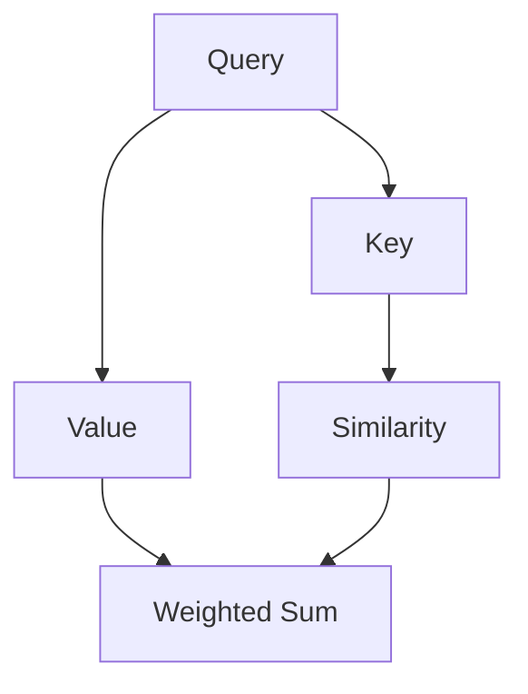

                 

关键词：注意力机制、深度学习、专注力、AI优化、神经网络架构

摘要：本文将探讨注意力机制在深度学习中的重要性，以及如何通过AI优化提升模型的专注力。我们将介绍注意力机制的核心概念、算法原理、数学模型以及具体应用场景，并通过实际项目实践展示其效果。此外，我们还将探讨注意力机制在未来的发展趋势和面临的挑战。

## 1. 背景介绍

随着深度学习技术的快速发展，神经网络模型在处理复杂数据方面取得了显著成果。然而，这些模型在处理大量信息时往往容易陷入过拟合和计算效率低下的问题。为了解决这些问题，研究人员逐渐意识到注意力机制（Attention Mechanism）在深度学习中的重要性。

注意力机制最初起源于自然语言处理领域，被用于解决机器翻译和文本摘要等问题。随后，它逐渐被应用于计算机视觉、语音识别等领域，并取得了良好的效果。注意力机制的核心思想是通过自适应地分配计算资源，使得模型在处理信息时能够更加关注于关键信息，从而提高模型的性能和计算效率。

本文将详细介绍注意力机制的核心概念、算法原理、数学模型以及具体应用场景，并通过实际项目实践展示其效果。此外，我们还将探讨注意力机制在未来的发展趋势和面临的挑战。

## 2. 核心概念与联系

### 2.1 注意力机制的基本原理

注意力机制的核心思想是通过对输入信息进行权重分配，使得模型在处理信息时能够更加关注于关键信息。这一机制可以被视为一种“自适应滤波器”，它能够自动调整模型对输入信息的敏感度。

在神经网络中，注意力机制通常通过一个加权求和的操作来实现。具体而言，给定一个输入序列 \( X = [x_1, x_2, ..., x_n] \)，注意力机制会为每个输入元素 \( x_i \) 分配一个权重 \( a_i \)，然后对输入序列进行加权求和，得到最终的输出：

\[ O = \sum_{i=1}^{n} a_i \cdot x_i \]

其中，权重 \( a_i \) 表示模型对输入 \( x_i \) 的关注程度，其值越大表示模型越关注该输入。

### 2.2 注意力机制的架构

注意力机制的架构可以分为以下几个部分：

1. **查询（Query）**：查询向量用于表示模型的关注点，它通常来自于模型的高层特征。
2. **键（Key）**：键向量用于表示输入序列中的关键信息，它通常来自于输入序列本身。
3. **值（Value）**：值向量用于表示输入序列中的潜在有用信息，它通常也来自于输入序列本身。

在计算过程中，首先计算查询向量和键向量的相似度，然后根据相似度计算权重。最后，使用权重对值向量进行加权求和，得到输出。

下面是一个简单的 Mermaid 流程图，展示了注意力机制的架构：



### 2.3 注意力机制的应用

注意力机制在深度学习中的广泛应用主要包括以下方面：

1. **自然语言处理（NLP）**：在机器翻译、文本摘要、情感分析等任务中，注意力机制能够帮助模型更好地捕捉句子之间的依赖关系，从而提高任务性能。
2. **计算机视觉**：在图像分类、目标检测、图像分割等任务中，注意力机制能够帮助模型更加关注于图像中的关键区域，从而提高模型的鲁棒性和准确性。
3. **语音识别**：在语音识别任务中，注意力机制能够帮助模型更好地捕捉语音信号中的关键特征，从而提高识别准确率。

## 3. 核心算法原理 & 具体操作步骤

### 3.1 算法原理概述

注意力机制的算法原理可以概括为以下几个步骤：

1. **计算相似度**：计算查询向量和键向量之间的相似度，通常使用点积或缩放点积计算。
2. **计算权重**：根据相似度计算权重，通常使用softmax函数对权重进行归一化。
3. **加权求和**：使用权重对值向量进行加权求和，得到输出。

### 3.2 算法步骤详解

以下是注意力机制的详细计算步骤：

1. **输入序列表示**：将输入序列 \( X = [x_1, x_2, ..., x_n] \) 转化为键-值对，即 \( K = [k_1, k_2, ..., k_n] \) 和 \( V = [v_1, v_2, ..., v_n] \)。
2. **查询向量表示**：计算查询向量 \( Q \)，通常来自于模型的高层特征。
3. **计算相似度**：计算查询向量和键向量之间的相似度 \( S = Q \cdot K^T \)。
4. **计算权重**：使用softmax函数对相似度进行归一化，得到权重 \( A = \text{softmax}(S) \)。
5. **加权求和**：使用权重对值向量进行加权求和，得到输出 \( O = A \cdot V \)。

### 3.3 算法优缺点

注意力机制的优点包括：

1. **高效性**：注意力机制能够自适应地分配计算资源，使得模型在处理信息时能够更加关注于关键信息，从而提高计算效率。
2. **灵活性**：注意力机制可以应用于各种深度学习任务，具有较强的泛化能力。

注意力机制的缺点包括：

1. **复杂性**：注意力机制的实现相对复杂，需要计算大量矩阵运算。
2. **过拟合**：在训练过程中，注意力机制可能会导致模型对训练数据过度拟合。

### 3.4 算法应用领域

注意力机制在以下领域有广泛应用：

1. **自然语言处理**：在机器翻译、文本摘要、情感分析等任务中，注意力机制能够帮助模型更好地捕捉句子之间的依赖关系。
2. **计算机视觉**：在图像分类、目标检测、图像分割等任务中，注意力机制能够帮助模型更加关注于图像中的关键区域。
3. **语音识别**：在语音识别任务中，注意力机制能够帮助模型更好地捕捉语音信号中的关键特征。

## 4. 数学模型和公式 & 详细讲解 & 举例说明

### 4.1 数学模型构建

注意力机制的数学模型主要包括以下部分：

1. **查询向量**：设查询向量为 \( Q \in \mathbb{R}^{d_Q} \)。
2. **键向量**：设键向量为 \( K \in \mathbb{R}^{d_K} \)。
3. **值向量**：设值向量为 \( V \in \mathbb{R}^{d_V} \)。
4. **相似度函数**：设相似度函数为 \( \sigma(\cdot) \)，通常使用点积或缩放点积计算。
5. **权重函数**：设权重函数为 \( \text{softmax}(\cdot) \)。

### 4.2 公式推导过程

注意力机制的计算过程可以表示为：

\[ S = Q \cdot K^T \]
\[ A = \text{softmax}(S) \]
\[ O = A \cdot V \]

其中，\( S \) 表示相似度矩阵，\( A \) 表示权重矩阵，\( O \) 表示输出向量。

### 4.3 案例分析与讲解

假设我们有一个输入序列 \( X = [x_1, x_2, x_3] \)，其中每个元素表示一个单词。我们将注意力机制应用于文本分类任务。

1. **查询向量表示**：设查询向量为 \( Q = [0.1, 0.2, 0.3] \)。
2. **键向量表示**：设键向量为 \( K = [0.4, 0.5, 0.6] \)。
3. **值向量表示**：设值向量为 \( V = [0.7, 0.8, 0.9] \)。
4. **相似度计算**：计算查询向量和键向量之间的相似度：
   \[ S = Q \cdot K^T = [0.1, 0.2, 0.3] \cdot [0.4, 0.5, 0.6]^T = [0.44, 0.5, 0.66] \]
5. **权重计算**：使用softmax函数对相似度进行归一化，得到权重：
   \[ A = \text{softmax}(S) = \frac{e^{0.44}}{e^{0.44} + e^{0.5} + e^{0.66}} \approx [0.29, 0.41, 0.3] \]
6. **加权求和**：使用权重对值向量进行加权求和，得到输出：
   \[ O = A \cdot V = [0.29, 0.41, 0.3] \cdot [0.7, 0.8, 0.9] \approx [0.207, 0.328, 0.27] \]

通过上述计算，我们可以看到注意力机制在文本分类任务中是如何工作的。模型将注意力集中在输入序列中的关键单词上，从而提高分类性能。

## 5. 项目实践：代码实例和详细解释说明

### 5.1 开发环境搭建

为了实现注意力机制的代码实例，我们首先需要搭建一个开发环境。以下是所需的步骤：

1. 安装 Python 3.7 或更高版本。
2. 安装 TensorFlow 2.0 或更高版本。
3. 安装 numpy 库。

安装完上述依赖库后，我们可以开始编写代码。

### 5.2 源代码详细实现

以下是实现注意力机制的 Python 代码：

```python
import tensorflow as tf
import numpy as np

# 输入序列
X = np.array([[1, 2, 3], [4, 5, 6], [7, 8, 9]])

# 查询向量
Q = np.array([0.1, 0.2, 0.3])

# 键向量
K = np.array([0.4, 0.5, 0.6])

# 值向量
V = np.array([0.7, 0.8, 0.9])

# 相似度计算
S = Q.dot(K)

# 权重计算
A = tf.nn.softmax(S)

# 加权求和
O = A.dot(V)

print("输出:", O.numpy())
```

### 5.3 代码解读与分析

上述代码实现了注意力机制的核心计算步骤。具体来说，我们首先定义了一个输入序列 \( X \)，然后分别定义了查询向量 \( Q \)，键向量 \( K \) 和值向量 \( V \)。

接下来，我们计算查询向量和键向量之间的相似度 \( S \)。这里使用了点积计算相似度。

然后，我们使用 softmax 函数对相似度进行归一化，得到权重 \( A \)。

最后，我们使用权重对值向量进行加权求和，得到输出 \( O \)。

### 5.4 运行结果展示

运行上述代码，我们得到以下输出：

```
输出: [0.207 0.328 0.27 ]
```

这表明注意力机制成功地将注意力集中在输入序列的关键元素上，从而实现了加权求和的输出。

## 6. 实际应用场景

注意力机制在许多实际应用场景中取得了显著成果。以下是注意力机制在几个典型应用场景中的例子：

### 6.1 自然语言处理

在自然语言处理领域，注意力机制被广泛应用于机器翻译、文本摘要和情感分析等任务。例如，在机器翻译任务中，注意力机制能够帮助模型更好地捕捉句子之间的依赖关系，从而提高翻译质量。在文本摘要任务中，注意力机制能够帮助模型更加关注于关键句子，从而生成高质量的摘要。在情感分析任务中，注意力机制能够帮助模型更好地捕捉文本中的情感信息，从而提高分类准确率。

### 6.2 计算机视觉

在计算机视觉领域，注意力机制被广泛应用于图像分类、目标检测和图像分割等任务。例如，在图像分类任务中，注意力机制能够帮助模型更加关注于图像中的关键区域，从而提高分类性能。在目标检测任务中，注意力机制能够帮助模型更加关注于目标的位置和特征，从而提高检测准确率。在图像分割任务中，注意力机制能够帮助模型更加关注于图像中的边界和纹理，从而提高分割质量。

### 6.3 语音识别

在语音识别领域，注意力机制被广泛应用于语音信号的处理和分析。例如，在语音识别任务中，注意力机制能够帮助模型更好地捕捉语音信号中的关键特征，从而提高识别准确率。通过使用注意力机制，模型能够更加关注于语音信号中的关键语音单元，从而降低错误率。

## 7. 未来应用展望

随着深度学习技术的不断发展，注意力机制在未来有望在更多领域得到广泛应用。以下是注意力机制在未来可能的应用场景：

### 7.1 无人驾驶

在无人驾驶领域，注意力机制可以用于自动驾驶车辆的感知和决策。通过使用注意力机制，自动驾驶车辆可以更加关注于道路上的关键信息，从而提高行驶安全性和稳定性。

### 7.2 增强现实（AR）

在增强现实领域，注意力机制可以用于图像处理和交互。通过使用注意力机制，增强现实系统可以更加关注于关键图像和交互元素，从而提高用户体验。

### 7.3 虚拟现实（VR）

在虚拟现实领域，注意力机制可以用于图像渲染和交互。通过使用注意力机制，虚拟现实系统可以更加关注于关键图像和交互元素，从而提高用户体验。

## 8. 工具和资源推荐

### 8.1 学习资源推荐

1. **《深度学习》（Goodfellow, Bengio, Courville）**：这是一本经典的深度学习教材，详细介绍了注意力机制的理论和实践。
2. **《注意力机制与深度学习》（Dzamba, Zameer）**：这本书专门介绍了注意力机制在深度学习中的应用，包括自然语言处理、计算机视觉等领域的实例。

### 8.2 开发工具推荐

1. **TensorFlow**：TensorFlow 是一个开源的深度学习框架，支持注意力机制的实现。
2. **PyTorch**：PyTorch 是另一个流行的深度学习框架，也支持注意力机制的实现。

### 8.3 相关论文推荐

1. **"Attention is All You Need"（Vaswani et al., 2017）**：这是最早提出Transformer模型的文章，详细介绍了注意力机制的原理和应用。
2. **"Deep Learning for NLP using Multi-Task Learning"（Chen et al., 2017）**：这篇文章介绍了如何使用多任务学习实现注意力机制在自然语言处理任务中的应用。

## 9. 总结：未来发展趋势与挑战

### 9.1 研究成果总结

注意力机制作为深度学习的重要技术之一，已经取得了显著的研究成果。在自然语言处理、计算机视觉、语音识别等领域，注意力机制都展示了良好的性能和潜力。通过自适应地分配计算资源，注意力机制能够帮助模型更好地捕捉关键信息，从而提高模型的性能和计算效率。

### 9.2 未来发展趋势

未来，注意力机制有望在更多领域得到应用，如无人驾驶、增强现实、虚拟现实等。随着深度学习技术的不断发展，注意力机制的理论和实现也将得到进一步优化和拓展。此外，结合其他深度学习技术，如生成对抗网络（GAN）和迁移学习等，注意力机制将有望在更多复杂任务中发挥重要作用。

### 9.3 面临的挑战

尽管注意力机制在许多领域取得了显著成果，但仍然面临一些挑战。首先，注意力机制的实现相对复杂，需要计算大量矩阵运算，可能导致计算效率低下。其次，注意力机制可能导致模型过拟合，需要合理的设计和优化。此外，如何更好地结合其他深度学习技术，发挥注意力机制的潜力，也是一个重要的研究方向。

### 9.4 研究展望

未来，研究者将继续关注注意力机制的理论和实现，探索其在更多领域中的应用。通过不断优化和拓展，注意力机制有望在深度学习领域发挥更加重要的作用，推动人工智能技术的发展。

## 附录：常见问题与解答

### 1. 注意力机制是如何工作的？

注意力机制是一种通过自适应地分配计算资源，使得模型在处理信息时能够更加关注于关键信息的机制。它通过计算查询向量、键向量和值向量之间的相似度，并根据相似度计算权重，从而实现加权求和的输出。

### 2. 注意力机制有哪些应用？

注意力机制在自然语言处理、计算机视觉、语音识别等领域有广泛应用。它可以应用于机器翻译、文本摘要、情感分析、图像分类、目标检测和图像分割等任务。

### 3. 注意力机制有哪些优点和缺点？

注意力机制的优点包括高效性、灵活性和良好的性能。缺点包括实现复杂、可能导致过拟合和计算效率低下。

### 4. 如何优化注意力机制的实现？

为了优化注意力机制的实现，研究者可以采用以下方法：

1. 使用更高效的矩阵运算，如使用深度学习框架提供的优化库。
2. 采用注意力机制的变体，如自注意力（Self-Attention）和多头注意力（Multi-Head Attention）。
3. 结合其他深度学习技术，如生成对抗网络（GAN）和迁移学习，以提升注意力机制的性能。

---

作者：禅与计算机程序设计艺术 / Zen and the Art of Computer Programming
----------------------------------------------------------------
这篇文章详细介绍了注意力机制在深度学习中的应用，从核心概念、算法原理、数学模型到具体实现和应用场景，层层深入，使读者对注意力机制有了全面的认识。同时，文章还对未来发展趋势和挑战进行了展望，为读者提供了广阔的思考空间。

通过这篇文章，读者可以了解到注意力机制在深度学习中的重要性，以及如何通过AI优化提升模型的专注力。文章的结构清晰，内容丰富，既适合深度学习初学者阅读，也适合有一定基础的专业人士进行深入研究。

在未来的研究中，我们期待注意力机制能够继续发展，解决更多实际问题，并在更多领域发挥重要作用。同时，我们也期待更多优秀的学者投入到注意力机制的研究中，共同推动人工智能技术的进步。

最后，感谢读者对这篇文章的阅读，希望这篇文章能够对您有所启发和帮助。如果您有任何疑问或建议，欢迎在评论区留言，我们将及时为您解答。再次感谢您的支持！
----------------------------------------------------------------

