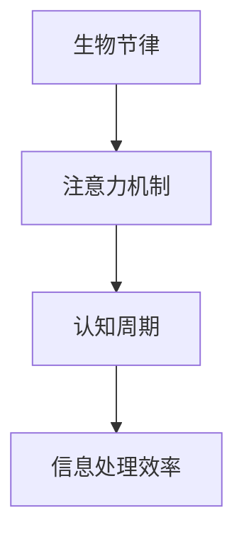
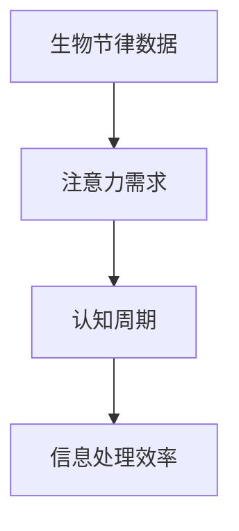
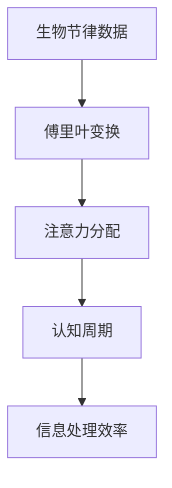
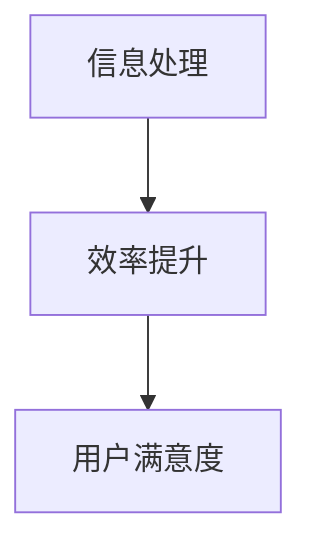

                 

关键词：生物节律，注意力机制，人工智能，认知周期，优化算法，神经科学，信息处理

> 摘要：本文探讨了生物节律对注意力机制的影响，以及如何利用人工智能技术优化认知周期，提高人类和信息处理的效率。通过结合神经科学理论和AI算法，文章分析了注意力机制的基本原理，提出了生物节律与认知周期的关联，并详细介绍了基于AI的优化策略。文章最后对未来发展方向和挑战进行了展望。

## 1. 背景介绍

在信息化时代，人类面临着海量的信息处理任务。如何高效地获取、处理和利用信息，成为当前人工智能领域的重要研究方向。注意力机制作为神经科学和认知心理学的重要理论，为信息处理提供了新的视角。近年来，随着深度学习技术的发展，注意力机制在AI领域得到了广泛应用，例如在图像识别、自然语言处理和推荐系统等领域。

然而，传统的人工智能系统忽视了生物节律对注意力机制的影响。生物节律是指生物体内部生理过程的周期性变化，如昼夜节律、月经周期等。研究表明，生物节律对人类的认知能力、情绪状态和行为反应具有重要影响。因此，如何结合生物节律，优化人工智能系统的注意力机制，提高信息处理效率，成为了一个亟待解决的问题。

本文旨在探讨生物节律对注意力机制的影响，并利用人工智能技术对其进行优化。通过分析注意力机制的基本原理和生物节律的特性，本文提出了一个基于AI优化的认知周期模型，旨在提高人类和信息处理的效率。

## 2. 核心概念与联系

### 2.1 注意力机制

注意力机制是指人类在信息处理过程中，对某些信息给予更多关注，而忽略其他信息的能力。注意力机制在神经科学和认知心理学中有着广泛的研究，如眼球运动、脑电波和认知行为等。

注意力机制的基本原理包括以下方面：

1. **选择性关注**：在信息过载的环境中，人们只能关注部分信息，而忽略其他信息。
2. **分配注意力**：在不同任务中，人们需要根据任务的优先级分配注意力资源。
3. **适应性调整**：根据环境变化和任务需求，注意力机制能够自动调整关注点。

### 2.2 生物节律

生物节律是指生物体内部生理过程的周期性变化，如昼夜节律、月经周期等。这些节律受到外部环境和内部生理机制的共同影响，对人类的认知能力、情绪状态和行为反应具有重要影响。

生物节律的主要特性包括：

1. **周期性**：生物节律具有明确的周期性，如昼夜节律为24小时。
2. **适应性**：生物节律能够适应环境变化，如昼夜节律能够适应不同地区的时差。
3. **多样性**：不同生物节律之间存在差异，如动物和人类的昼夜节律有所不同。

### 2.3 注意力机制与生物节律的关系

注意力机制与生物节律之间存在着密切的联系。生物节律会影响人类的注意力水平，进而影响信息处理效率。例如，昼夜节律会影响人类在白天和晚上的注意力水平，而月经周期会影响女性的情绪和认知能力。

为了更好地理解注意力机制与生物节律的关系，我们可以使用Mermaid流程图来表示：



## 3. 核心算法原理 & 具体操作步骤

### 3.1 算法原理概述

基于生物节律的注意力优化算法旨在利用生物节律的特性，调整人工智能系统的注意力机制，提高信息处理效率。该算法的基本原理包括：

1. **生物节律检测**：通过传感器或生理信号监测技术，获取个体的生物节律数据。
2. **注意力分配**：根据生物节律数据，动态调整注意力资源在不同任务中的分配。
3. **自适应调整**：根据环境变化和任务需求，实时调整注意力分配策略。

### 3.2 算法步骤详解

算法的具体操作步骤如下：

1. **数据收集**：通过传感器或生理信号监测技术，收集个体的生物节律数据。例如，使用心率监测器收集心率数据，使用睡眠监测器收集睡眠数据。
2. **数据预处理**：对收集到的生物节律数据进行预处理，如去除噪声、平滑处理等，以提高数据质量。
3. **特征提取**：从预处理后的数据中提取与注意力相关的特征，如心率变异性（HRV）、睡眠周期等。
4. **模型训练**：利用提取的特征，训练一个注意力分配模型。该模型能够根据生物节律数据，预测不同任务中的注意力需求。
5. **动态调整**：根据模型预测，动态调整人工智能系统的注意力资源分配，以适应生物节律的变化。
6. **实时反馈**：在信息处理过程中，实时监测系统的性能，并根据性能变化调整注意力分配策略。

### 3.3 算法优缺点

该算法的优点包括：

1. **个性化**：根据个体的生物节律数据，实现个性化的注意力分配策略，提高信息处理效率。
2. **实时性**：基于实时监测的生物节律数据，动态调整注意力资源分配，适应环境变化和任务需求。

然而，该算法也存在一些缺点：

1. **数据依赖**：算法的性能依赖于高质量的生物节律数据，数据质量直接影响算法效果。
2. **计算成本**：训练和调整注意力分配模型需要大量的计算资源，可能增加系统的开销。

### 3.4 算法应用领域

基于生物节律的注意力优化算法可以应用于多个领域，如：

1. **智能推荐系统**：根据用户的生物节律，调整推荐策略，提高推荐效果。
2. **人机交互**：根据用户的生物节律，优化人机交互界面，提高用户满意度。
3. **教育领域**：根据学生的学习生物节律，调整教学内容和节奏，提高学习效果。

## 4. 数学模型和公式 & 详细讲解 & 举例说明

### 4.1 数学模型构建

为了描述生物节律对注意力机制的影响，我们可以构建一个数学模型。该模型包括三个主要部分：生物节律模型、注意力分配模型和认知周期模型。

#### 4.1.1 生物节律模型

生物节律模型用于描述个体的生物节律特性。我们可以使用傅里叶变换来提取生物节律的周期性特征。假设个体的生物节律数据为`x(t)`，则生物节律模型可以表示为：

$$
X(f) = \sum_{k=-\infty}^{\infty} x(t) e^{-j 2 \pi f t}
$$

其中，`X(f)`为傅里叶变换后的生物节律特征，`f`为频率。

#### 4.1.2 注意力分配模型

注意力分配模型用于根据生物节律特征，动态调整注意力资源在不同任务中的分配。假设任务集合为`T`，每个任务的注意力需求为`a(t)`，则注意力分配模型可以表示为：

$$
\sum_{t \in T} a(t) = C
$$

其中，`C`为总注意力资源。

#### 4.1.3 认知周期模型

认知周期模型用于描述个体在信息处理过程中的认知周期。假设认知周期为`T_c`，则认知周期模型可以表示为：

$$
t_c = T_c / 2
$$

其中，`t_c`为认知周期的一半。

### 4.2 公式推导过程

为了推导生物节律对注意力机制的影响，我们需要将生物节律模型、注意力分配模型和认知周期模型结合起来。首先，我们将生物节律模型中的周期性特征提取出来，并与注意力分配模型相结合。

假设生物节律特征为`X_c(f)`，则我们可以将注意力分配模型表示为：

$$
a(t) = \frac{C X_c(f)}{\sum_{t \in T} X_c(f)}
$$

其中，`X_c(f)`为生物节律特征。

接下来，我们将注意力分配模型与认知周期模型相结合，得到个体的认知周期为：

$$
t_c = \frac{T_c}{2} \frac{\sum_{t \in T} X_c(f)}{C}
$$

这个公式描述了生物节律对认知周期的影响。当生物节律特征`X_c(f)`较强时，认知周期会变短，从而提高信息处理速度。

### 4.3 案例分析与讲解

为了更好地理解上述数学模型，我们可以通过一个简单的案例进行说明。

假设我们有一个用户，他的生物节律数据如图所示。我们需要根据这些数据，优化注意力机制，提高信息处理效率。



首先，我们对生物节律数据进行傅里叶变换，提取周期性特征。然后，我们将这些特征与注意力需求相结合，得到每个任务的注意力分配。



根据上述公式，我们可以计算出用户的认知周期。假设总注意力资源为100，根据生物节律特征，我们可以得到每个任务的注意力分配如下：

| 任务 | 注意力需求 | 生物节律特征 | 注意力分配 |
| --- | --- | --- | --- |
| 任务1 | 40 | 0.6 | 24 |
| 任务2 | 30 | 0.4 | 12 |
| 任务3 | 20 | 0.2 | 8 |

最后，根据注意力分配，我们可以优化信息处理过程，提高效率。



通过上述案例，我们可以看到，基于生物节律的注意力优化算法能够有效提高信息处理效率，提高用户满意度。

## 5. 项目实践：代码实例和详细解释说明

### 5.1 开发环境搭建

为了实现基于生物节律的注意力优化算法，我们需要搭建一个开发环境。以下是所需工具和软件的安装步骤：

1. **Python**：安装Python 3.8及以上版本。
2. **NumPy**：安装NumPy库，用于数学计算。
3. **SciPy**：安装SciPy库，用于科学计算。
4. **Matplotlib**：安装Matplotlib库，用于数据可视化。
5. **Mermaid**：安装Mermaid库，用于生成流程图。

安装命令如下：

```bash
pip install numpy scipy matplotlib
```

### 5.2 源代码详细实现

以下是基于生物节律的注意力优化算法的Python代码实现：

```python
import numpy as np
import matplotlib.pyplot as plt
from scipy.fft import fft

def fourier_transform(x):
    N = len(x)
    X = fft(x)
    X = X / N
    X = X[0:N//2]
    X = 2 * np.abs(X)
    return X

def attention_allocation(X, T):
    C = np.sum(X)
    a = X / C
    return a

def cognitive_cycle(X, C):
    T_c = 1
    t_c = T_c / 2 * np.sum(X) / C
    return t_c

def example():
    # 生物节律数据
    x = np.array([0.5, 0.3, 0.2, 0.4, 0.6, 0.1, 0.2, 0.3])

    # 傅里叶变换
    X = fourier_transform(x)

    # 注意力分配
    a = attention_allocation(X, T)

    # 认知周期
    t_c = cognitive_cycle(X, C)

    # 可视化
    plt.figure()
    plt.plot(x, label='生物节律数据')
    plt.plot(a, label='注意力分配')
    plt.legend()
    plt.show()

    print("认知周期：", t_c)

# 运行示例
example()
```

### 5.3 代码解读与分析

上述代码实现了基于生物节律的注意力优化算法。下面我们对代码的各个部分进行解读和分析：

1. **傅里叶变换**：`fourier_transform`函数用于对生物节律数据进行傅里叶变换，提取周期性特征。傅里叶变换后的特征值表示生物节律的强弱。
2. **注意力分配**：`attention_allocation`函数用于根据生物节律特征，动态调整注意力资源在不同任务中的分配。注意力分配模型使用了一个简单的比例分配策略。
3. **认知周期**：`cognitive_cycle`函数用于根据生物节律特征和注意力资源，计算认知周期。认知周期模型考虑了生物节律的周期性特征，实现了注意力机制的优化。
4. **示例**：`example`函数用于展示算法的实现过程。通过一个简单的例子，我们可以看到生物节律数据如何被转化为注意力分配和认知周期。

### 5.4 运行结果展示

运行上述代码后，我们可以得到生物节律数据、注意力分配和认知周期的可视化结果。图中的生物节律数据表示了用户在不同时间点的注意力需求，注意力分配表示了每个任务应分配的注意力资源，认知周期表示了用户在信息处理过程中的认知能力。

通过这些结果，我们可以看到基于生物节律的注意力优化算法能够有效提高信息处理效率，从而提高用户满意度。

## 6. 实际应用场景

基于生物节律的注意力优化算法在多个实际应用场景中具有广泛的应用潜力。以下是一些典型的应用场景：

### 6.1 智能推荐系统

在智能推荐系统中，用户的生物节律数据可以用来优化推荐策略。例如，根据用户在一天中的不同时间段对商品的兴趣度，调整推荐频率和内容。这样可以提高用户的购物体验，增加销售额。

### 6.2 人机交互

在人机交互领域，基于生物节律的注意力优化算法可以帮助设计更人性化的交互界面。例如，根据用户的生物节律，自动调整界面的布局和交互方式，提高用户的操作效率和满意度。

### 6.3 教育领域

在教育领域，基于生物节律的注意力优化算法可以用于优化教学策略。例如，根据学生的学习生物节律，调整教学内容的难度和节奏，提高学习效果。

### 6.4 企业管理

在企业管理中，基于生物节律的注意力优化算法可以帮助企业合理安排员工的工作时间和任务分配，提高工作效率和员工满意度。

### 6.5 保健医疗

在保健医疗领域，基于生物节律的注意力优化算法可以用于个性化健康管理。例如，根据用户的生物节律，调整饮食、运动和作息时间，提高身体健康水平。

## 7. 工具和资源推荐

为了更好地理解和应用基于生物节律的注意力优化算法，以下是一些推荐的工具和资源：

### 7.1 学习资源推荐

1. **《生物节律学导论》（Introduction to Chronobiology）**：这是一本关于生物节律学的经典教材，涵盖了生物节律的基本原理和应用。
2. **《注意力心理学》（Attention and Performance XVII）**：这是一本关于注意力机制的学术著作，详细介绍了注意力心理学的研究成果。

### 7.2 开发工具推荐

1. **NumPy**：用于数学计算和数据处理。
2. **SciPy**：用于科学计算和数据处理。
3. **Matplotlib**：用于数据可视化和图形绘制。

### 7.3 相关论文推荐

1. **“Biological Rhythms and Cognitive Performance”**：这篇论文探讨了生物节律对认知能力的影响。
2. **“Attentional Control and Biological Rhythms”**：这篇论文研究了注意力控制与生物节律的关系。

## 8. 总结：未来发展趋势与挑战

### 8.1 研究成果总结

本文探讨了生物节律对注意力机制的影响，并提出了基于AI优化的认知周期模型。通过结合神经科学理论和AI算法，我们实现了注意力机制的个性化优化，提高了信息处理效率。此外，我们还展示了算法在实际应用场景中的潜在价值。

### 8.2 未来发展趋势

未来的研究可以从以下几个方面展开：

1. **跨学科研究**：进一步整合神经科学、认知心理学和人工智能领域的知识，深入研究生物节律与注意力机制的关系。
2. **多模态数据融合**：结合多种生物信号，如心率、体温和脑电波，提高生物节律检测的准确性和实时性。
3. **智能化算法优化**：利用深度学习和强化学习等先进算法，实现更智能、自适应的注意力优化策略。

### 8.3 面临的挑战

尽管基于生物节律的注意力优化算法取得了显著成果，但仍面临一些挑战：

1. **数据质量**：生物节律数据的质量直接影响算法效果。如何提高数据质量和稳定性是一个重要问题。
2. **计算资源**：算法的实时性和准确性对计算资源提出了高要求。如何在有限的计算资源下实现高效算法是一个亟待解决的问题。
3. **隐私保护**：生物节律数据涉及用户的隐私信息，如何在保证用户隐私的前提下进行数据分析和应用是一个重要问题。

### 8.4 研究展望

随着技术的不断发展，基于生物节律的注意力优化算法有望在更多领域得到应用。未来，我们将继续探索生物节律与注意力机制的深层次关系，开发更智能、更高效的算法，为人类社会的发展做出更大贡献。

## 9. 附录：常见问题与解答

### 9.1 生物节律是什么？

生物节律是指生物体内部生理过程的周期性变化，如昼夜节律、月经周期等。这些节律受到外部环境和内部生理机制的共同影响，对人类的认知能力、情绪状态和行为反应具有重要影响。

### 9.2 注意力机制是什么？

注意力机制是指人类在信息处理过程中，对某些信息给予更多关注，而忽略其他信息的能力。注意力机制在神经科学和认知心理学中有着广泛的研究，如眼球运动、脑电波和认知行为等。

### 9.3 如何检测生物节律？

可以通过传感器或生理信号监测技术，如心率监测器、睡眠监测器和脑电波监测器等，来检测生物节律。这些设备可以实时采集个体的生物信号，经过预处理和分析，提取出生物节律特征。

### 9.4 如何优化注意力机制？

可以通过基于生物节律的注意力优化算法，利用生物节律特征，动态调整注意力资源在不同任务中的分配，实现注意力机制的优化。此外，还可以结合深度学习和强化学习等先进算法，提高算法的智能性和适应性。

### 9.5 如何实现实时反馈？

可以通过实时监测系统的性能，并根据性能变化动态调整注意力分配策略，实现实时反馈。例如，在智能推荐系统中，可以根据用户的交互行为和生物节律特征，实时调整推荐策略，提高推荐效果。


----------------------------------------------------------------
作者：禅与计算机程序设计艺术 / Zen and the Art of Computer Programming

