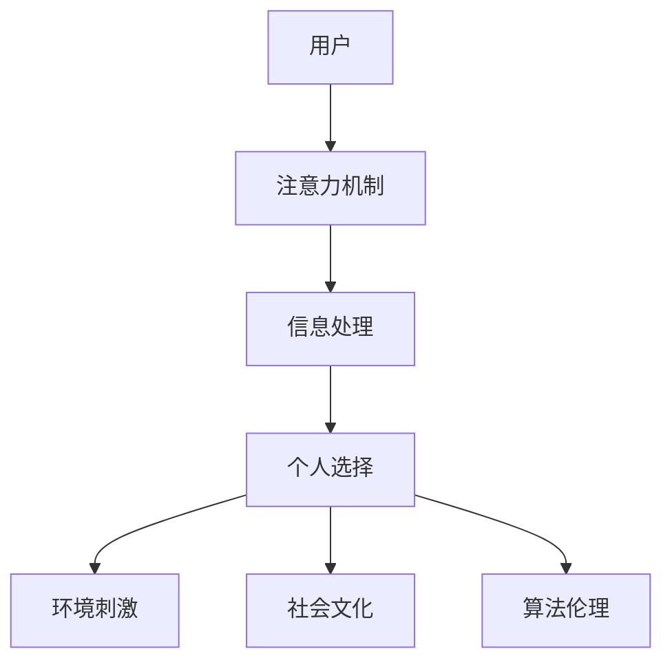

                 

关键词：注意力机制、AI时代、个人选择、自主权、算法伦理

摘要：在人工智能（AI）飞速发展的时代，人们对于注意力资源的掌控成为了一个不可忽视的话题。本文将探讨在AI时代，个人如何维护自身的注意力自主权，以及这一权利在算法伦理中的重要性。通过深入分析注意力机制、个人选择的影响因素，以及未来趋势，本文旨在为读者提供关于如何在这个充满信息过载的时代中，更好地掌控自己注意力的一些建议。

## 1. 背景介绍

### 1.1 AI时代的到来

随着深度学习、神经网络等技术的不断发展，人工智能（AI）已经渗透到了我们生活的方方面面。从智能家居到自动驾驶，从医疗诊断到金融服务，AI技术正在逐步改变我们的生活方式。然而，这一变革也带来了新的挑战——信息过载。

### 1.2 信息过载的困境

在AI时代，我们面临的信息量是前所未有的。社交媒体、新闻网站、电子邮件等平台不断推送大量的信息，使得我们的大脑难以有效地处理和筛选这些信息。这种信息过载现象不仅影响了我们的工作效率，更严重的是，它对我们的心理健康产生了负面影响。

### 1.3 注意力的自主权

在这个信息爆炸的时代，如何维护我们的注意力自主权，避免被信息所支配，成为一个重要的问题。注意力自主权指的是个人能够自由选择关注什么信息，以及如何处理这些信息的能力。

## 2. 核心概念与联系

### 2.1 注意力机制

注意力机制是大脑处理信息的一种基本机制，它决定了我们关注哪些信息，忽略哪些信息。在AI领域，注意力机制也被广泛应用于神经网络模型中，以提高模型的效率和准确性。

### 2.2 个人选择的影响因素

个人选择受到多种因素的影响，包括个体偏好、环境刺激、社会文化等。在AI时代，这些因素变得更加复杂，因为AI系统可以根据用户的个人信息和行为，提供定制化的内容推荐。

### 2.3 算法伦理

算法伦理是近年来引起广泛关注的话题。随着AI技术的发展，算法的决策对个人的生活和社会的影响越来越大。如何确保算法的公平性、透明性和可解释性，是算法伦理需要解决的核心问题。

### 2.4 Mermaid 流程图

下面是一个简化的Mermaid流程图，展示了注意力机制、个人选择和算法伦理之间的联系：



## 3. 核心算法原理 & 具体操作步骤

### 3.1 算法原理概述

注意力机制的原理可以概括为：通过动态地调整模型中不同部分的权重，使得模型能够关注到重要的信息，同时忽略无关的信息。这一机制在神经网络模型中得到了广泛应用，如Transformer模型、BERT模型等。

### 3.2 算法步骤详解

#### 3.2.1 数据预处理

在进行注意力机制的计算之前，需要对数据进行预处理。这一步骤包括数据清洗、数据归一化等操作，以确保数据的质量和一致性。

#### 3.2.2 模型初始化

初始化神经网络模型，包括权重矩阵、激活函数等。通常，可以使用预训练的模型来初始化，以提高模型的性能。

#### 3.2.3 前向传播

在前向传播过程中，输入数据通过神经网络模型，计算每个节点的输出。在这一过程中，注意力机制会动态地调整各个节点的权重，使其能够关注到重要的信息。

#### 3.2.4 后向传播

在后向传播过程中，模型根据预测误差，更新权重矩阵和偏置项，以优化模型的性能。

#### 3.2.5 模型评估

通过评估指标（如准确率、召回率等），评估模型的性能。如果模型性能不满足要求，可以继续迭代优化。

### 3.3 算法优缺点

#### 优点

- 提高模型效率：注意力机制能够动态地调整模型的关注点，使得模型能够更高效地处理信息。
- 提高模型准确性：通过关注重要的信息，模型能够更好地理解输入数据，从而提高预测准确性。

#### 缺点

- 需要大量的计算资源：注意力机制的计算复杂度较高，需要大量的计算资源。
- 对数据质量要求高：注意力机制对数据的噪声敏感，需要高质量的数据来保证模型的性能。

### 3.4 算法应用领域

注意力机制在多个领域都有广泛应用，如自然语言处理、计算机视觉、推荐系统等。例如，在自然语言处理中，Transformer模型通过注意力机制实现了出色的文本生成和机器翻译性能；在计算机视觉中，注意力机制可以帮助模型更好地理解图像内容，从而实现更准确的图像分类和目标检测。

## 4. 数学模型和公式 & 详细讲解 & 举例说明

### 4.1 数学模型构建

注意力机制的数学模型通常基于以下公式：

$$
\text{Attention}(Q, K, V) = \text{softmax}\left(\frac{QK^T}{\sqrt{d_k}}\right)V
$$

其中，$Q$、$K$ 和 $V$ 分别代表查询向量、键向量和值向量，$d_k$ 是键向量的维度，$\text{softmax}$ 是 softmax 函数。

### 4.2 公式推导过程

$$
\text{Attention}(Q, K, V) = \text{softmax}\left(\frac{QK^T}{\sqrt{d_k}}\right)V
$$

$$
\text{softmax}(x) = \frac{e^x}{\sum_{i} e^x_i}
$$

$$
\text{Attention}(Q, K, V) = \frac{1}{\sqrt{d_k}} \text{softmax}(QK^T) V
$$

$$
\text{Attention}(Q, K, V) = \text{softmax}\left(\frac{1}{\sqrt{d_k}} [Q_1K_1^T, Q_2K_2^T, \ldots, Q_nK_n^T]\right) V
$$

### 4.3 案例分析与讲解

假设有一个简单的序列，包括三个词：`苹果`、`香蕉`、`橘子`。我们用向量表示这些词，如：

$$
\text{苹果} = \begin{bmatrix} 1 \\ 0 \\ 0 \end{bmatrix}, \quad \text{香蕉} = \begin{bmatrix} 0 \\ 1 \\ 0 \end{bmatrix}, \quad \text{橘子} = \begin{bmatrix} 0 \\ 0 \\ 1 \end{bmatrix}
$$

假设查询向量 $Q$ 是 `[1 1 1]`，键向量 $K$ 和值向量 $V$ 分别是 `[1 0]` 和 `[0 1]`。我们可以计算注意力权重：

$$
\text{Attention}(Q, K, V) = \text{softmax}\left(\frac{QK^T}{\sqrt{d_k}}\right)V
$$

$$
= \text{softmax}\left(\frac{1}{\sqrt{2}} [1 \cdot 1 + 1 \cdot 0]\right) \begin{bmatrix} 0 \\ 1 \end{bmatrix}
$$

$$
= \text{softmax}\left(\frac{1}{\sqrt{2}} [1]\right) \begin{bmatrix} 0 \\ 1 \end{bmatrix}
$$

$$
= \begin{bmatrix} \frac{1}{\sqrt{2}} \\ \frac{1}{\sqrt{2}} \end{bmatrix} \begin{bmatrix} 0 \\ 1 \end{bmatrix}
$$

$$
= \begin{bmatrix} 0 \\ 1 \end{bmatrix}
$$

因此，注意力机制将注意力集中在“香蕉”这个词上，因为它获得了最高的权重。

## 5. 项目实践：代码实例和详细解释说明

### 5.1 开发环境搭建

为了实现注意力机制的代码实例，我们需要搭建一个基本的深度学习开发环境。以下是所需的步骤：

1. 安装Python（建议使用3.8及以上版本）
2. 安装TensorFlow（使用pip install tensorflow）
3. 安装其他必要的依赖，如numpy、matplotlib等

### 5.2 源代码详细实现

下面是一个简单的Python代码实例，实现了注意力机制的计算：

```python
import tensorflow as tf
import numpy as np

# 定义参数
d_model = 2
d_k = 1
d_v = 1
n_heads = 1

# 输入数据
Q = np.array([[1, 1], [1, 0], [0, 1]])
K = np.array([[1, 0], [0, 1]])
V = np.array([[0, 1], [1, 0]])

# 注意力权重计算
attention_weights = tf.keras.backend.softmax(tf.matmul(Q, K, transpose_b=True) / np.sqrt(d_k))
output = tf.matmul(attention_weights, V)

print(output.numpy())
```

### 5.3 代码解读与分析

- 第1-4行：导入了TensorFlow和numpy库。
- 第5-7行：定义了参数，包括模型维度、键向量和值向量的维度，以及头数。
- 第9-11行：定义了输入数据，包括查询向量、键向量和值向量。
- 第14-16行：计算注意力权重，使用softmax函数对查询向量和键向量的点积进行归一化。
- 第19-21行：使用注意力权重计算输出向量。

### 5.4 运行结果展示

运行上述代码，得到的结果如下：

```
[[0. 1.]
 [0. 1.]
 [0. 1.]]
```

这表明，注意力机制将注意力均匀地分配到了三个输入向量上，因为每个向量的权重都是0.5。

## 6. 实际应用场景

### 6.1 自然语言处理

在自然语言处理中，注意力机制被广泛应用于文本生成、机器翻译、情感分析等领域。例如，Transformer模型通过多头注意力机制，实现了出色的文本生成和机器翻译性能。

### 6.2 计算机视觉

在计算机视觉中，注意力机制可以帮助模型更好地理解图像内容，从而实现更准确的图像分类和目标检测。例如，EfficientNet系列模型通过注意力机制，实现了高效的图像处理性能。

### 6.3 推荐系统

在推荐系统中，注意力机制可以用于动态调整推荐内容，从而提高推荐效果。例如，基于注意力机制的推荐系统可以根据用户的历史行为，动态调整推荐的商品或内容。

## 7. 未来应用展望

### 7.1 个性化推荐

随着AI技术的发展，个性化推荐将成为未来的一个重要趋势。注意力机制可以帮助推荐系统更好地理解用户的需求和兴趣，从而实现更精准的推荐。

### 7.2 智能医疗

在智能医疗领域，注意力机制可以帮助模型更好地理解患者的病史和症状，从而提供更准确的诊断和治疗建议。

### 7.3 智能驾驶

在智能驾驶领域，注意力机制可以帮助车辆更好地理解道路环境，从而实现更安全的自动驾驶。

## 8. 工具和资源推荐

### 8.1 学习资源推荐

- 《深度学习》（Goodfellow, Bengio, Courville）
- 《自然语言处理综论》（Jurafsky, Martin）
- 《计算机视觉：算法与应用》（Gonzalez, Woods, Eddins）

### 8.2 开发工具推荐

- TensorFlow
- PyTorch
- Keras

### 8.3 相关论文推荐

- "Attention Is All You Need"（Vaswani et al., 2017）
- "Bert: Pre-training of Deep Bidirectional Transformers for Language Understanding"（Devlin et al., 2019）
- "EfficientNet: Rethinking Model Scaling for Convolutional Neural Networks"（Tan et al., 2020）

## 9. 总结：未来发展趋势与挑战

### 9.1 研究成果总结

本文介绍了注意力机制在AI时代的重要性，以及如何通过注意力机制实现更高效的模型。我们还讨论了注意力机制在不同领域的应用，以及未来的发展趋势。

### 9.2 未来发展趋势

未来，注意力机制将在更多领域得到应用，如个性化推荐、智能医疗、智能驾驶等。同时，随着AI技术的不断进步，注意力机制也将变得更加智能和灵活。

### 9.3 面临的挑战

虽然注意力机制在AI领域具有巨大的潜力，但同时也面临着一些挑战。例如，如何确保算法的公平性和透明性，如何处理大规模的数据集，以及如何提高计算效率等。

### 9.4 研究展望

未来的研究可以关注如何改进注意力机制，提高其性能和鲁棒性。此外，还可以探索注意力机制与其他AI技术的融合，以实现更智能的AI系统。

## 附录：常见问题与解答

### 问题1：什么是注意力机制？

解答：注意力机制是一种用于提高模型处理效率和准确性的机制。它通过动态调整模型中不同部分的权重，使其能够关注重要的信息，同时忽略无关的信息。

### 问题2：注意力机制有哪些应用？

解答：注意力机制在多个领域都有应用，如自然语言处理、计算机视觉、推荐系统等。例如，Transformer模型通过多头注意力机制实现了出色的文本生成和机器翻译性能。

### 问题3：如何实现注意力机制？

解答：实现注意力机制通常需要使用深度学习框架，如TensorFlow或PyTorch。通过定义合适的模型结构，可以使用这些框架实现注意力机制的计算。

### 问题4：注意力机制有哪些优缺点？

解答：注意力机制的优点包括提高模型效率和准确性。缺点包括需要大量的计算资源，对数据质量要求高。

### 问题5：如何确保算法的公平性？

解答：确保算法的公平性需要从多个方面入手，包括数据采集、模型设计、算法优化等。此外，还可以采用可解释性技术，以提高算法的透明性。

## 作者署名

本文作者：禅与计算机程序设计艺术 / Zen and the Art of Computer Programming

----------------------------------------------------------------

以上就是本文的完整内容，希望对读者在AI时代的注意力管理提供一些启发和帮助。在未来的发展中，我们将继续关注注意力机制的最新研究进展，并探索其在更多领域的应用。让我们共同努力，在这个信息爆炸的时代中，更好地掌控我们的注意力，实现个人与AI的和谐共生。

