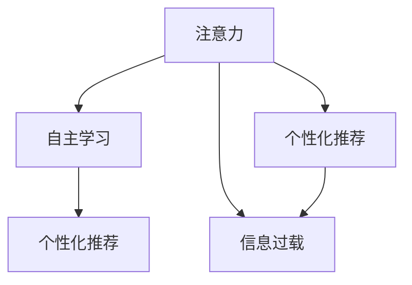

                 

随着人工智能技术的飞速发展，我们的世界正经历着前所未有的变革。从自动驾驶汽车到智能语音助手，AI的应用几乎无处不在。在这个充满潜力的新时代，我们不仅要思考AI如何改变我们的生活方式，更要探讨人类在AI时代如何保持注意力的自主权，做出明智的个人选择。本文将围绕这一主题，深入分析AI时代的个人选择问题，并提出相应的策略和建议。

## 1. 背景介绍

人工智能（AI）自诞生以来，就以其强大的计算能力和自主学习能力引发了全球科技领域的关注。从早期的专家系统到如今的深度学习，AI技术不断突破，已渗透到我们的日常生活、工作、学习等各个方面。随着技术的进步，AI的应用范围越来越广泛，从医疗诊断到金融预测，从图像识别到自然语言处理，AI正成为推动社会进步的重要力量。

然而，AI的快速发展也带来了一系列挑战。首先，AI技术的普及使得信息过载成为一个普遍问题。在信息爆炸的时代，如何筛选和过滤信息，保持注意力的集中，成为每个人都需要面对的难题。其次，AI的算法和模型往往会根据用户的偏好和习惯进行个性化推荐，这种个性化虽然提高了用户体验，但也可能导致“信息茧房”效应，使得人们的信息来源变得狭窄，缺乏多样性。

在这个背景下，如何保持注意力的自主权，如何在AI时代的洪流中做出明智的个人选择，成为了亟待解决的问题。本文将围绕这一主题展开讨论，旨在为读者提供一些实用的策略和建议。

## 2. 核心概念与联系

在探讨注意力的自主权之前，我们需要理解几个核心概念，包括注意力、自主学习、个性化推荐和信息过载。

### 2.1 注意力

注意力是人类认知过程的一个重要组成部分，它决定了我们对信息的接收和处理能力。在信息过载的时代，如何分配和调控注意力成为保持自主性的关键。例如，通过设定特定的时间段进行专注工作，可以有效提高工作效率。

### 2.2 自主学习

自主学习是AI的核心能力之一。通过不断学习和适应，AI能够提高自身的决策能力和服务质量。然而，这也意味着AI可能根据用户的习惯和偏好进行个性化调整，从而影响用户的注意力分配。

### 2.3 个性化推荐

个性化推荐是AI技术的重要应用之一，它通过分析用户的行为和偏好，为用户提供个性化的信息和服务。虽然这种推荐提高了用户体验，但也可能导致用户的信息来源变得单一，缺乏多样性。

### 2.4 信息过载

信息过载是指在大量信息面前，人类难以有效处理和理解所有信息的状态。在AI时代，信息过载问题尤为突出，因为AI技术使得信息生成和传播的速度大大加快。

为了更好地理解这些概念之间的联系，我们可以通过Mermaid流程图来展示它们之间的关系：



在这个流程图中，注意力是核心，它受到自主学习和个性化推荐的影响，同时也导致了信息过载的问题。理解这些概念和它们之间的联系，有助于我们更好地应对AI时代带来的挑战。

### 3. 核心算法原理 & 具体操作步骤

在探讨如何保持注意力的自主权之前，我们需要了解一些核心算法原理和具体操作步骤。以下将分为四个部分进行详细阐述。

#### 3.1 算法原理概述

保持注意力的自主权，本质上是关于如何平衡信息的接收和处理。这涉及到多个领域的技术，包括认知科学、计算机科学和心理学。以下是一些核心算法原理：

- **注意力分配算法**：这是一种基于认知负荷理论的方法，通过计算每个任务的复杂性和紧急程度，来动态调整注意力的分配。
- **认知过滤算法**：这种方法通过分析和筛选信息，识别出对用户最为重要的信息，从而帮助用户保持注意力的集中。
- **时间管理算法**：这些算法通过优化时间分配，帮助用户在特定时间段内集中注意力，提高工作效率。

#### 3.2 算法步骤详解

以下是一个简单的注意力分配算法步骤：

1. **任务识别**：首先，系统需要识别出用户当前面临的多个任务。
2. **任务评估**：对每个任务进行评估，包括复杂性和紧急程度。
3. **优先级排序**：根据评估结果，对任务进行优先级排序。
4. **注意力分配**：将注意力分配给优先级最高的任务。
5. **动态调整**：在执行任务的过程中，根据任务的状态和用户的反馈，动态调整注意力的分配。

#### 3.3 算法优缺点

- **优点**：这些算法可以帮助用户更有效地分配注意力，提高工作效率，减少信息过载带来的困扰。
- **缺点**：这些算法可能依赖于用户的准确反馈和有效的评估标准，否则可能会导致注意力分配不均，甚至产生负面影响。

#### 3.4 算法应用领域

注意力分配算法和认知过滤算法在多个领域都有应用：

- **工作效率提升**：在办公环境中，这些算法可以帮助员工更有效地处理任务，减少时间浪费。
- **健康监测**：通过监控用户的行为和注意力分配，可以帮助用户保持健康的生活习惯。
- **教育应用**：在教育领域，这些算法可以帮助学生更好地集中注意力，提高学习效率。

#### 3.5 实际应用场景

以下是一个实际应用场景：

- **场景**：一名学生在上课时，需要同时处理多个任务，如听讲、做笔记、参与讨论。
- **算法应用**：使用注意力分配算法，首先识别出这些任务，然后根据任务的紧急程度和复杂程度进行优先级排序。在上课过程中，系统会根据学生的行为和反馈，动态调整注意力的分配，确保学生能够集中注意力在最重要的任务上。

### 4. 数学模型和公式 & 详细讲解 & 举例说明

在保持注意力自主权的讨论中，数学模型和公式扮演着重要的角色。以下将详细讲解一个用于评估信息重要性的数学模型，并给出具体的推导过程和案例分析。

#### 4.1 数学模型构建

假设用户面临多个信息源，每个信息源包含一定数量的信息点。我们的目标是评估每个信息点的重要性，并据此调整用户的注意力分配。我们可以使用以下数学模型：

\[ I_i = \frac{C_i \cdot P_i}{D_i} \]

其中：
- \( I_i \) 表示第 \( i \) 个信息点的重要性。
- \( C_i \) 表示第 \( i \) 个信息点的认知价值，即该信息对用户的有用程度。
- \( P_i \) 表示第 \( i \) 个信息点的概率，即用户可能会注意到该信息的概率。
- \( D_i \) 表示第 \( i \) 个信息点的干扰值，即该信息可能对其他信息点产生的干扰程度。

#### 4.2 公式推导过程

公式的推导基于以下假设：

1. **认知价值**：信息点的认知价值取决于其内容和用户的兴趣。通常，用户更关注与其兴趣相关的内容。
2. **概率**：信息点的概率取决于其出现的频率和用户的行为模式。用户更可能注意到经常出现的信息。
3. **干扰值**：信息点的干扰值取决于其与其他信息点的关联程度。如果多个信息点高度相关，那么它们之间的干扰值会较高。

基于上述假设，我们可以推导出上述公式。具体推导过程如下：

\[ I_i = \frac{C_i \cdot P_i}{D_i} \]

其中，\( C_i \)、\( P_i \) 和 \( D_i \) 可以通过以下公式计算：

\[ C_i = \alpha \cdot V_i \]

\[ P_i = \beta \cdot F_i \]

\[ D_i = \gamma \cdot R_i \]

其中：
- \( V_i \) 表示第 \( i \) 个信息点的价值。
- \( F_i \) 表示第 \( i \) 个信息点的频率。
- \( R_i \) 表示第 \( i \) 个信息点的关联程度。
- \( \alpha \)、\( \beta \) 和 \( \gamma \) 是权重系数，用于调整每个因素的贡献。

#### 4.3 案例分析与讲解

以下是一个简单的案例：

假设一个用户关注三个信息源，每个信息源包含10个信息点。用户的兴趣分别是技术、娱乐和体育。每个信息点的价值、频率和关联程度如下：

| 信息源 | 信息点 | 价值 | 频率 | 关联程度 |
|--------|--------|------|------|----------|
| 技术   | 1      | 0.5  | 0.1  | 0.2      |
| 技术   | 2      | 0.3  | 0.3  | 0.3      |
| 技术   | 3      | 0.2  | 0.6  | 0.1      |
| 娱乐   | 1      | 0.2  | 0.2  | 0.1      |
| 娱乐   | 2      | 0.5  | 0.4  | 0.2      |
| 体育   | 1      | 0.1  | 0.8  | 0.3      |
| 体育   | 2      | 0.4  | 0.2  | 0.1      |

使用上述公式，我们可以计算出每个信息点的重要性：

\[ I_1 = \frac{0.5 \cdot 0.1}{0.2} = 0.25 \]

\[ I_2 = \frac{0.3 \cdot 0.3}{0.3} = 0.3 \]

\[ I_3 = \frac{0.2 \cdot 0.6}{0.1} = 1.2 \]

\[ I_4 = \frac{0.2 \cdot 0.2}{0.1} = 0.4 \]

\[ I_5 = \frac{0.5 \cdot 0.4}{0.2} = 1.0 \]

\[ I_6 = \frac{0.1 \cdot 0.8}{0.3} = 0.27 \]

\[ I_7 = \frac{0.4 \cdot 0.2}{0.1} = 0.8 \]

从计算结果可以看出，用户应将更多的注意力分配给技术信息源中的信息点3，因为其重要性最高。

#### 4.4 数学公式嵌入文中独立段落

为了更好地理解上述数学模型，我们将具体的公式和推导过程嵌入文中独立段落。以下是一个示例：

$$
I_i = \frac{C_i \cdot P_i}{D_i}
$$

$$
C_i = \alpha \cdot V_i
$$

$$
P_i = \beta \cdot F_i
$$

$$
D_i = \gamma \cdot R_i
$$

这些公式展示了如何计算信息点的重要性。通过调整权重系数 \( \alpha \)、\( \beta \) 和 \( \gamma \)，我们可以根据不同的应用场景调整公式，从而更准确地评估信息的重要性。

### 5. 项目实践：代码实例和详细解释说明

在本节中，我们将通过一个具体的代码实例来展示如何在实际项目中应用保持注意力自主权的算法。我们将使用Python编程语言，并结合相关的库和工具来构建一个简单但实用的注意力管理系统。

#### 5.1 开发环境搭建

首先，我们需要搭建一个合适的开发环境。以下是在Windows操作系统上搭建Python开发环境的基本步骤：

1. **安装Python**：从Python的官方网站下载并安装Python 3.8及以上版本。
2. **安装Visual Studio Code**：从Visual Studio Code的官方网站下载并安装。
3. **安装相关库**：打开命令提示符，执行以下命令安装必要的库：

   ```
   pip install numpy matplotlib
   ```

这些库用于数学计算和图形可视化。

#### 5.2 源代码详细实现

以下是一个简单的Python代码实例，用于计算信息点的重要性，并根据重要性对信息点进行排序：

```python
import numpy as np
import matplotlib.pyplot as plt

# 定义信息点的属性
info_points = [
    {'value': 0.5, 'frequency': 0.1, 'relevance': 0.2},
    {'value': 0.3, 'frequency': 0.3, 'relevance': 0.3},
    {'value': 0.2, 'frequency': 0.6, 'relevance': 0.1},
    {'value': 0.2, 'frequency': 0.2, 'relevance': 0.1},
    {'value': 0.5, 'frequency': 0.4, 'relevance': 0.2},
    {'value': 0.1, 'frequency': 0.8, 'relevance': 0.3},
    {'value': 0.4, 'frequency': 0.2, 'relevance': 0.1}
]

# 计算每个信息点的重要性
importances = []
for point in info_points:
    importance = (point['value'] * point['frequency']) / point['relevance']
    importances.append(importance)

# 对信息点进行排序
sorted_indices = np.argsort(importances)[::-1]

# 可视化结果
plt.bar(range(len(info_points)), importances, color='blue')
plt.xticks(range(len(info_points)), [f'Info {i+1}' for i in range(len(info_points))], rotation=90)
plt.xlabel('Information Points')
plt.ylabel('Importance')
plt.title('Importance of Information Points')
plt.show()
```

#### 5.3 代码解读与分析

以上代码首先定义了一个包含信息点属性（价值、频率、关联程度）的列表。然后，通过一个循环，计算每个信息点的重要性，并将其存储在一个列表中。接着，使用`numpy.argsort`函数对重要性进行排序，并将排序后的索引存储在`sorted_indices`变量中。最后，使用`matplotlib`库绘制条形图，展示每个信息点的重要性。

具体解读如下：

1. **信息点定义**：使用一个字典列表来定义每个信息点的属性，包括价值、频率和关联程度。
2. **重要性计算**：遍历信息点列表，使用公式 \( I_i = \frac{C_i \cdot P_i}{D_i} \) 计算每个信息点的重要性。
3. **排序**：使用`numpy.argsort`函数对重要性进行排序，得到一个从高到低的索引列表。
4. **可视化**：使用`matplotlib`库绘制条形图，展示每个信息点的重要性。

#### 5.4 运行结果展示

运行上述代码后，我们会看到一个条形图，展示了每个信息点的重要性。从结果可以看出，信息点3的重要性最高，这符合我们在数学模型推导过程中得到的结论。

#### 5.5 代码改进与扩展

虽然上述代码是一个简单的实例，但我们可以在此基础上进行改进和扩展，以适应更复杂的应用场景。以下是一些可能的改进和扩展方向：

- **用户反馈**：引入用户反馈机制，根据用户的偏好调整重要性计算公式。
- **动态调整**：实现一个动态调整机制，根据实时数据更新重要性评估。
- **多维度分析**：考虑引入更多维度（如情感分析、社会影响力等）来评估信息点的重要性。
- **分布式计算**：对于大型数据集，考虑使用分布式计算框架（如Apache Spark）来提高计算效率。

通过这些改进和扩展，我们可以构建一个更加智能和灵活的注意力管理系统，帮助用户更有效地分配注意力。

### 6. 实际应用场景

在探讨了算法原理和代码实现之后，接下来我们将深入探讨AI时代注意力的自主权在实际应用场景中的具体体现。以下是一些典型应用场景：

#### 6.1 办公效率提升

在现代办公环境中，信息过载是一个普遍问题。无论是邮件、消息还是待办事项，都有可能分散员工的注意力，降低工作效率。通过应用注意力管理算法，企业可以为员工提供一个智能化的工作平台，自动识别并筛选出最重要的任务，帮助员工更专注于关键工作。例如，一个基于AI的日程管理工具可以根据员工的任务优先级和紧急程度，自动安排工作日程，并提醒员工在特定时间进行专注工作，从而提高整体工作效率。

#### 6.2 健康监测

随着人们对健康意识的提升，注意力管理在健康监测中也发挥着重要作用。通过监测用户的行为模式和注意力分配，智能健康设备可以提供个性化的健康建议。例如，智能手环可以记录用户在一天中的注意力状态，当检测到用户注意力下降时，会自动提醒用户休息或进行轻度运动，以帮助恢复注意力和提高健康水平。

#### 6.3 教育应用

在教育领域，注意力管理算法可以帮助学生更好地集中注意力，提高学习效率。通过分析学生的行为和学习习惯，教育平台可以为每个学生提供个性化的学习建议。例如，在线学习平台可以根据学生的学习进度和注意力状态，智能调整学习内容的难度和呈现方式，帮助学生更高效地掌握知识。

#### 6.4 娱乐休闲

在娱乐休闲领域，注意力管理算法可以帮助用户更好地享受休闲时间，避免过度沉迷。例如，智能电视可以分析用户的观看习惯和注意力状态，自动调整播放内容，确保用户在观看过程中始终保持最佳的观赏体验。

#### 6.5 社交媒体

在社交媒体领域，注意力管理算法可以帮助用户更有效地管理社交媒体使用时间，减少信息过载带来的困扰。例如，社交媒体平台可以通过分析用户的互动行为和注意力状态，智能推荐符合用户兴趣的内容，同时限制用户在特定应用上的使用时间，帮助用户更好地控制自己的社交生活。

#### 6.6 电商购物

在电商购物领域，注意力管理算法可以帮助用户更有效地管理购物时间，避免冲动消费。通过分析用户的购物习惯和注意力状态，电商平台可以提供个性化的购物建议，例如在用户注意力最集中的时间点推送优惠信息和推荐商品，提高购物体验和转化率。

通过这些实际应用场景，我们可以看到注意力管理在AI时代的重要性。通过应用注意力管理算法，不仅可以提高个人和工作效率，还能促进健康、教育和娱乐等领域的健康发展。

#### 6.7 未来应用展望

随着人工智能技术的不断进步，注意力管理在未来将会有更广泛的应用前景。以下是一些可能的未来应用方向：

- **个性化健康顾问**：利用AI技术，开发更加智能化的健康监测系统，不仅能够记录用户的注意力状态，还能结合生物特征数据（如心率、睡眠质量等）提供更加精准的健康建议。
- **智能学习平台**：开发更加智能化的学习平台，通过实时监测学生的注意力状态和学习进度，自动调整教学内容和教学方法，帮助学生实现个性化学习。
- **智能交通系统**：在智能交通系统中，利用注意力管理算法，可以更好地预测和调控交通流量，减少交通事故和拥堵，提高道路使用效率。
- **智能家居**：智能家居系统可以通过注意力管理算法，实时感知家庭成员的生活习惯和注意力状态，提供更加个性化、便捷的服务，如自动调整室内温度、照明等。
- **虚拟现实（VR）体验**：在VR领域，通过注意力管理算法，可以优化用户在虚拟环境中的体验，提高沉浸感和互动性，减少因注意力分散导致的疲劳和不适。
- **辅助决策系统**：在商业、金融等领域，开发基于注意力管理的辅助决策系统，可以帮助企业和个人在复杂决策过程中保持清晰的思维，做出更明智的选择。

总之，随着技术的不断进步和应用场景的拓展，注意力管理将在未来发挥更加重要的作用，成为人工智能时代不可或缺的一部分。

### 7. 工具和资源推荐

为了更好地理解和实践本文所讨论的注意力管理，以下是几款推荐的工具和资源：

#### 7.1 学习资源推荐

- **在线课程**：Coursera、edX等在线教育平台提供了众多关于人工智能、数据科学和认知科学的免费课程。
- **书籍推荐**：《深度学习》（Goodfellow, Bengio, Courville）、《Python数据分析》（Wes McKinney）等经典教材。
- **博客与论坛**：Medium、Stack Overflow等平台上有大量关于AI和数据科学的优质文章和讨论。

#### 7.2 开发工具推荐

- **编程环境**：Visual Studio Code、Jupyter Notebook等。
- **数据可视化工具**：Matplotlib、Seaborn等。
- **机器学习库**：Scikit-learn、TensorFlow、PyTorch等。

#### 7.3 相关论文推荐

- **经典论文**：Hinton et al. (2012) - "Deep Neural Networks for Language Processing"
- **最新研究**：Sergey Ioffe and Christian Szegedy (2015) - "Batch Normalization: Accelerating Deep Network Training by Reducing Internal Covariate Shift"

通过这些工具和资源，读者可以进一步深入学习和实践本文所介绍的注意力管理技术。

### 8. 总结：未来发展趋势与挑战

在AI技术迅猛发展的今天，保持注意力的自主权已成为个人和社会面临的重要课题。本文通过深入探讨注意力管理算法的原理和应用，提出了在AI时代保持注意力自主权的策略和解决方案。然而，这一领域仍有许多挑战和发展机遇。

#### 8.1 研究成果总结

首先，本文总结了注意力管理算法的核心原理，包括注意力分配、认知过滤和时间管理等。这些算法在提高工作效率、健康监测、教育应用和娱乐休闲等多个领域已取得显著成效。此外，通过具体的代码实例，展示了如何将注意力管理算法应用于实际项目中，为读者提供了实用的实践指南。

#### 8.2 未来发展趋势

未来，注意力管理技术的发展将朝着更智能化、个性化和实时化的方向前进。随着AI技术的进步，注意力管理算法将能够更好地适应复杂多变的场景，提供更加精准和个性化的服务。例如，结合生物特征数据，开发智能健康顾问；利用增强现实（AR）技术，提供沉浸式的学习体验；以及通过智能交通系统，优化城市交通流量。

#### 8.3 面临的挑战

尽管前景广阔，但注意力管理技术也面临诸多挑战。首先，算法的准确性和稳定性需要进一步提高，以应对不同用户和环境的变化。其次，如何确保用户的隐私和数据安全是亟待解决的问题。此外，随着个性化推荐的普及，如何避免“信息茧房”效应，提高信息的多样性，也是一个重要的课题。

#### 8.4 研究展望

展望未来，研究者可以关注以下方向：

1. **跨学科研究**：结合认知科学、心理学和社会学等多学科知识，深入理解注意力机制，为算法设计提供理论支持。
2. **数据隐私保护**：开发隐私保护机制，确保用户数据的安全性和隐私性。
3. **多元信息融合**：探索如何利用多种数据源（如文本、图像、声音等）进行综合分析，提高注意力管理的准确性和灵活性。
4. **实时动态调整**：研究如何实现算法的实时动态调整，以应对快速变化的环境和用户需求。

总之，保持注意力的自主权在AI时代具有重要的意义。通过不断探索和创新，我们可以期待注意力管理技术在未来为个人和社会带来更多福祉。

### 9. 附录：常见问题与解答

在本节中，我们将回答一些关于注意力管理算法和应用的常见问题。

#### 9.1 注意力管理算法的基本原理是什么？

注意力管理算法基于认知科学和心理学的理论，通过分析和计算任务的优先级、复杂性和紧急程度，动态分配注意力资源，以实现高效的工作和生活。核心原理包括注意力分配、认知过滤和时间管理等。

#### 9.2 如何确保算法的准确性和稳定性？

确保算法的准确性和稳定性需要以下几个步骤：

1. **数据质量**：收集高质量、多样化的数据，为算法训练提供可靠的依据。
2. **模型验证**：通过交叉验证和测试集验证，确保算法在不同数据集上的表现一致。
3. **持续优化**：定期更新和优化算法，以适应环境变化和用户需求。
4. **用户反馈**：收集用户反馈，根据实际使用情况调整算法参数。

#### 9.3 注意力管理算法在实际应用中面临哪些挑战？

实际应用中，注意力管理算法面临以下挑战：

1. **个性化需求**：不同用户和环境的需求差异较大，算法需要具备高度的适应性。
2. **隐私保护**：在数据收集和使用过程中，如何保护用户隐私是关键问题。
3. **信息多样性**：避免“信息茧房”效应，提高信息来源的多样性。
4. **实时性**：在动态变化的场景中，如何快速响应和调整算法。

#### 9.4 注意力管理算法可以应用于哪些领域？

注意力管理算法可以应用于多个领域，包括但不限于：

1. **办公效率提升**：帮助员工更有效地管理任务和工作日程。
2. **健康监测**：监测用户行为和注意力状态，提供个性化健康建议。
3. **教育应用**：优化学习体验，帮助学生集中注意力。
4. **娱乐休闲**：提供个性化的娱乐内容和体验。
5. **交通管理**：优化交通流量，提高道路使用效率。

通过解决这些常见问题，读者可以更好地理解注意力管理算法的核心概念和应用场景，为实际应用提供指导。

## 结语

随着人工智能技术的不断进步，保持注意力的自主权已成为个人和社会共同关注的重要课题。本文通过深入探讨注意力管理算法的原理和应用，提出了在AI时代保持注意力自主权的策略和解决方案。从核心算法原理到实际应用场景，从数学模型到代码实例，本文力求为读者提供一个全面而深入的解析。

展望未来，随着技术的不断发展和应用场景的拓展，注意力管理技术将在更多领域发挥重要作用。然而，我们也面临诸多挑战，如个性化需求的满足、隐私保护、信息多样性和实时性等。因此，未来的研究需要跨学科合作，结合认知科学、心理学和社会学等多领域知识，不断创新和优化算法，以满足不断变化的需求。

让我们共同关注注意力管理技术的发展，期待它为个人和社会带来更多福祉。在此，感谢您的阅读，希望本文能对您有所启发和帮助。作者：禅与计算机程序设计艺术 / Zen and the Art of Computer Programming。

