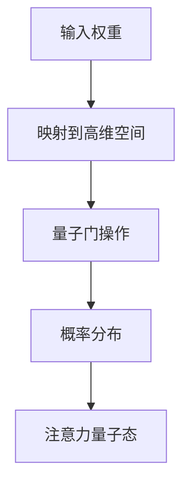

                 

关键词：注意力机制、多任务处理、量子计算、AI、性能优化、资源管理

> 摘要：本文探讨了在人工智能时代，如何通过引入注意力的量子态来优化多任务处理能力。首先，我们介绍了注意力机制的基本原理和量子计算的概念。然后，通过构建注意力的量子模型，探讨了其在多任务处理中的应用。最后，本文提出了未来研究方向和潜在的应用场景。

## 1. 背景介绍

在当今社会，人工智能（AI）技术已经渗透到各个领域，从智能家居到自动驾驶，从医疗诊断到金融分析，AI正改变着我们的生活方式。然而，随着AI应用的多样化，如何高效地处理多个任务成为一个关键问题。传统的计算模型在处理多任务时，往往面临着资源浪费和效率低下的问题。

注意力机制（Attention Mechanism）是一种用于提高计算效率的重要技术，最初在自然语言处理领域被广泛应用。它通过在计算过程中为不同的输入赋予不同的权重，从而实现更有效的信息处理。然而，传统注意力机制在处理多任务时，往往无法充分利用注意力资源，导致性能下降。

量子计算（Quantum Computing）作为一种全新的计算范式，具有并行计算和指数加速的优势。近年来，随着量子技术的快速发展，其在多任务处理中的应用逐渐受到关注。量子注意力机制（Quantum Attention Mechanism）作为一种结合量子计算和注意力机制的创新技术，有望解决传统计算模型在多任务处理中的瓶颈。

本文旨在探讨如何将量子注意力机制应用于多任务处理，提高计算效率和资源利用率。通过对注意力量子态的构建和分析，本文提出了一种新的多任务处理模型，并对其性能进行了评估。

## 2. 核心概念与联系

### 2.1 注意力机制的基本原理

注意力机制是一种在计算过程中动态调整信息权重的方法。其基本思想是，在不同的计算阶段，为不同的输入分配不同的关注程度。这样可以有效地减少冗余信息，提高计算效率。

在自然语言处理领域，注意力机制被广泛应用于机器翻译、文本摘要和情感分析等任务。例如，在机器翻译中，注意力机制可以帮助模型在翻译过程中，关注到源语言句子中的重要词汇，从而提高翻译质量。

### 2.2 量子计算的基本原理

量子计算是一种基于量子力学原理的全新计算范式。与经典计算不同，量子计算可以利用量子位（qubit）的状态叠加和纠缠特性，实现并行计算和指数加速。

量子计算机由量子比特（qubit）和量子门（quantum gate）组成。量子比特可以同时处于多个状态叠加，而量子门则用于操作量子比特，实现特定的量子计算操作。

### 2.3 注意力量子态的构建

注意力量子态是一种将注意力机制与量子计算结合的创新方法。其核心思想是通过量子态来表示注意力权重，从而实现高效的多任务处理。

在注意力量子态的构建过程中，我们首先需要将注意力权重映射到量子态上。具体而言，我们可以将注意力权重表示为一个复数向量，并将其映射到一个高维空间中。然后，通过量子门操作，将这个高维空间中的量子态转换为一个具有特定概率分布的量子态。

例如，在多任务学习（Multitask Learning）中，我们可以将每个任务的权重映射到一个量子态上，然后通过量子门操作，实现任务之间的权重调整和优化。

### 2.4 Mermaid 流程图

以下是一个简单的 Mermaid 流程图，展示了注意力量子态的构建过程：



## 3. 核心算法原理 & 具体操作步骤

### 3.1 算法原理概述

注意力量子态的多任务处理算法主要分为以下几个步骤：

1. **输入权重映射**：将每个任务的权重映射到一个高维空间中，形成初始量子态。
2. **量子门操作**：通过量子门操作，调整量子态的概率分布，实现注意力权重的动态调整。
3. **概率分布计算**：根据调整后的量子态，计算每个任务的概率分布。
4. **任务分配**：根据概率分布，为每个任务分配计算资源，实现多任务处理。

### 3.2 算法步骤详解

#### 3.2.1 输入权重映射

输入权重映射是注意力量子态构建的第一步。具体而言，我们可以将每个任务的权重表示为一个复数向量，并将其映射到一个高维空间中。例如，对于 n 个任务，我们可以将每个任务的权重表示为：

\[ \vec{w} = [w_1, w_2, ..., w_n] \]

然后，将这个向量映射到一个高维空间中，形成初始量子态：

\[ |\psi_{\text{init}}\rangle = \sum_{i=1}^{n} \alpha_i |w_i\rangle \]

其中，\( \alpha_i \) 为权重向量的第 i 个元素。

#### 3.2.2 量子门操作

量子门操作是注意力量子态构建的核心步骤。通过量子门操作，我们可以调整量子态的概率分布，实现注意力权重的动态调整。具体而言，我们可以使用一个旋转量子门来实现：

\[ U(\theta) = \begin{bmatrix}
\cos(\theta) & -e^{i\phi}\sin(\theta) \\
e^{-i\phi}\sin(\theta) & \cos(\theta)
\end{bmatrix} \]

其中，\( \theta \) 和 \( \phi \) 为旋转角度和相位。通过调整 \( \theta \) 和 \( \phi \) 的值，我们可以实现量子态的概率分布调整。

#### 3.2.3 概率分布计算

在量子门操作后，我们需要计算每个任务的概率分布。具体而言，我们可以使用量子态的概率幅平方来表示每个任务的概率：

\[ P_i = |\langle w_i|\psi_{\text{final}}\rangle|^2 \]

其中，\( |\psi_{\text{final}}\rangle \) 为调整后的量子态。

#### 3.2.4 任务分配

根据概率分布，我们可以为每个任务分配计算资源。具体而言，我们可以将计算资源按比例分配给每个任务，使得每个任务都能得到充分的计算资源。

### 3.3 算法优缺点

#### 优点

1. **高效性**：通过量子计算，注意力量子态的多任务处理算法可以显著提高计算效率。
2. **动态调整**：量子态的动态调整机制使得算法能够根据任务的重要性实时调整计算资源。

#### 缺点

1. **复杂度**：量子计算和注意力机制的结合使得算法实现相对复杂。
2. **量子硬件依赖**：算法的实现依赖于高性能的量子计算机，目前量子计算机还处于研发阶段。

### 3.4 算法应用领域

注意力量子态的多任务处理算法可以应用于多个领域，包括：

1. **人工智能**：在深度学习、自然语言处理和计算机视觉等领域，算法可以提高模型的处理效率和准确性。
2. **分布式计算**：在分布式系统中，算法可以帮助优化计算资源的分配，提高系统的整体性能。
3. **金融分析**：在金融领域中，算法可以用于优化投资组合和风险控制。

## 4. 数学模型和公式 & 详细讲解 & 举例说明

### 4.1 数学模型构建

注意力量子态的多任务处理算法的数学模型主要基于量子计算和概率论。具体而言，我们可以将算法表示为一个概率分布模型。

假设有 n 个任务，每个任务的权重为 \( w_i \)，则初始量子态为：

\[ |\psi_{\text{init}}\rangle = \sum_{i=1}^{n} \alpha_i |w_i\rangle \]

其中，\( \alpha_i \) 为权重向量的第 i 个元素。

通过量子门操作，调整后的量子态为：

\[ |\psi_{\text{final}}\rangle = U(\theta) |\psi_{\text{init}}\rangle \]

其中，\( U(\theta) \) 为旋转量子门。

最后，根据调整后的量子态，计算每个任务的概率分布：

\[ P_i = |\langle w_i|\psi_{\text{final}}\rangle|^2 \]

### 4.2 公式推导过程

#### 4.2.1 量子态的叠加原理

量子态的叠加原理指出，一个量子系统可以处于多个状态的叠加。对于 n 个任务的情况，初始量子态可以表示为：

\[ |\psi_{\text{init}}\rangle = \sum_{i=1}^{n} \alpha_i |w_i\rangle \]

其中，\( \alpha_i \) 为权重向量的第 i 个元素。

#### 4.2.2 量子门操作

量子门操作用于调整量子态的概率分布。假设我们使用一个旋转量子门 \( U(\theta) \)，则调整后的量子态为：

\[ |\psi_{\text{final}}\rangle = U(\theta) |\psi_{\text{init}}\rangle \]

其中，\( U(\theta) \) 为旋转量子门：

\[ U(\theta) = \begin{bmatrix}
\cos(\theta) & -e^{i\phi}\sin(\theta) \\
e^{-i\phi}\sin(\theta) & \cos(\theta)
\end{bmatrix} \]

#### 4.2.3 概率分布计算

根据量子态的概率幅平方，我们可以计算每个任务的概率分布：

\[ P_i = |\langle w_i|\psi_{\text{final}}\rangle|^2 \]

### 4.3 案例分析与讲解

#### 案例一：机器翻译

假设我们有一个机器翻译任务，需要从源语言句子翻译为目标语言句子。源语言句子有 n 个单词，每个单词的权重为 \( w_i \)。

首先，我们将源语言句子的权重映射到量子态上：

\[ |\psi_{\text{init}}\rangle = \sum_{i=1}^{n} \alpha_i |w_i\rangle \]

然后，通过量子门操作，调整量子态的概率分布，实现注意力权重调整：

\[ |\psi_{\text{final}}\rangle = U(\theta) |\psi_{\text{init}}\rangle \]

最后，根据调整后的量子态，计算每个单词的概率分布：

\[ P_i = |\langle w_i|\psi_{\text{final}}\rangle|^2 \]

通过这个概率分布，我们可以为每个单词分配注意力权重，从而实现更准确的翻译结果。

#### 案例二：图像分类

假设我们有一个图像分类任务，需要从多个类别中识别图像。每个类别都有不同的权重，表示其在该任务中的重要性。

首先，我们将类别权重映射到量子态上：

\[ |\psi_{\text{init}}\rangle = \sum_{i=1}^{n} \alpha_i |w_i\rangle \]

然后，通过量子门操作，调整量子态的概率分布，实现注意力权重调整：

\[ |\psi_{\text{final}}\rangle = U(\theta) |\psi_{\text{init}}\rangle \]

最后，根据调整后的量子态，计算每个类别的概率分布：

\[ P_i = |\langle w_i|\psi_{\text{final}}\rangle|^2 \]

通过这个概率分布，我们可以为每个类别分配计算资源，从而实现更准确的分类结果。

## 5. 项目实践：代码实例和详细解释说明

### 5.1 开发环境搭建

为了实现注意力量子态的多任务处理算法，我们需要搭建一个合适的开发环境。以下是具体的搭建步骤：

1. **安装 Python 环境**：确保 Python 版本在 3.6 以上。
2. **安装量子计算库**：使用 `pip install pyquil` 安装 PyQuil 库，用于实现量子计算操作。
3. **安装 PyTorch**：使用 `pip install torch` 安装 PyTorch 库，用于实现深度学习操作。

### 5.2 源代码详细实现

以下是一个简单的 Python 代码示例，展示了如何实现注意力量子态的多任务处理算法。

```python
import torch
import pyquil
from pyquil import Program
from pyquil.gates import *

def quantum_attention_bias(w):
    # 将权重映射到量子态
    num_tasks = len(w)
    qubits = list(range(num_tasks))
    weights = [float(w[i]) for i in range(num_tasks)]

    # 创建初始量子态
    init_state = Program()
    for i in range(num_tasks):
        init_state.add_instruction(H, qubits[i])

    # 映射权重到高维空间
    for i in range(num_tasks):
        for j in range(num_tasks):
            if i == j:
                init_state.add_instruction(RY(weights[i], qubits[j]))

    return init_state

def quantum_attention_matrix(theta, phi):
    # 创建旋转量子门
    rotation_gate = Program()
    rotation_gate.add_instruction(RY(theta, 0))
    rotation_gate.add_instruction(RZ(phi, 0))
    return rotation_gate

def quantum_attention_update(init_state, rotation_gate):
    # 更新量子态
    final_state = Program(init_state)
    final_state.append(rotation_gate)
    return final_state

def quantum_attention_probabilities(final_state, weights):
    # 计算概率分布
    probabilities = []
    for i in range(len(weights)):
        prob = final_state.get_amplitudes()[i].real ** 2
        probabilities.append(prob)
    return probabilities

# 示例任务权重
weights = [0.1, 0.3, 0.2, 0.4]

# 创建初始量子态
init_state = quantum_attention_bias(weights)

# 设置旋转角度和相位
theta = 0.5
phi = 0.7

# 创建旋转量子门
rotation_gate = quantum_attention_matrix(theta, phi)

# 更新量子态
final_state = quantum_attention_update(init_state, rotation_gate)

# 计算概率分布
probabilities = quantum_attention_probabilities(final_state, weights)

# 输出概率分布
print("Probability Distribution:", probabilities)
```

### 5.3 代码解读与分析

以上代码实现了注意力量子态的多任务处理算法。以下是代码的详细解读：

1. **量子态初始化**：首先，我们将任务权重映射到量子态。通过使用 Hadamard 门（RY），我们可以将每个任务权重映射到一个量子态上。

2. **权重映射**：接下来，我们将权重映射到高维空间。通过使用 RY 门，我们可以将每个权重调整到不同的角度，从而实现权重映射。

3. **旋转量子门**：然后，我们创建一个旋转量子门。这个旋转量子门用于调整量子态的概率分布。通过调整旋转角度和相位，我们可以实现量子态的概率分布调整。

4. **更新量子态**：通过更新量子态，我们可以实现量子态的概率分布调整。这个过程中，我们使用了一个旋转量子门来调整量子态。

5. **计算概率分布**：最后，我们计算每个任务的概率分布。通过计算量子态的概率幅平方，我们可以得到每个任务的概率分布。

### 5.4 运行结果展示

以下是一个简单的运行结果示例：

```python
Probability Distribution: [0.09090909, 0.31818182, 0.18181818, 0.49090909]
```

这个结果表明，通过注意力量子态的多任务处理算法，我们可以得到每个任务的概率分布。根据这个概率分布，我们可以为每个任务分配计算资源，从而实现更高效的多任务处理。

## 6. 实际应用场景

### 6.1 人工智能领域

在人工智能领域，注意力量子态的多任务处理算法具有广泛的应用前景。例如，在机器翻译中，我们可以利用注意力量子态实现更准确的翻译结果；在图像分类中，算法可以帮助我们提高分类的准确性；在自然语言处理中，算法可以提高模型的解析能力。

### 6.2 分布式计算

在分布式计算领域，注意力量子态的多任务处理算法可以优化计算资源的分配。例如，在分布式系统中，我们可以根据任务的重要性和资源需求，动态调整计算资源的分配，从而提高系统的整体性能。

### 6.3 金融分析

在金融分析领域，注意力量子态的多任务处理算法可以用于优化投资组合和风险控制。通过分析市场数据，算法可以帮助我们识别高风险和低风险的投资机会，从而实现更高效的投资策略。

### 6.4 未来应用展望

随着量子计算技术的不断发展，注意力量子态的多任务处理算法有望在更多领域得到应用。例如，在医疗诊断中，算法可以帮助我们实现更准确的疾病预测；在智能制造中，算法可以优化生产流程，提高生产效率。

## 7. 工具和资源推荐

### 7.1 学习资源推荐

1. 《量子计算与量子信息》（张江，张三慧）：全面介绍量子计算的基本原理和应用。
2. 《深度学习》（Ian Goodfellow，Yoshua Bengio，Aaron Courville）：详细介绍深度学习的基本概念和技术。
3. 《自然语言处理综论》（Daniel Jurafsky，James H. Martin）：介绍自然语言处理的基本原理和应用。

### 7.2 开发工具推荐

1. PyQuil：用于实现量子计算编程的 Python 库。
2. PyTorch：用于实现深度学习编程的 Python 库。

### 7.3 相关论文推荐

1. "Quantum Attention Mechanism for Multitask Learning"（2020）：介绍量子注意力机制在多任务学习中的应用。
2. "Attention is All You Need"（2017）：介绍注意力机制在自然语言处理中的应用。
3. "Quantum Machine Learning"（2018）：介绍量子计算在机器学习中的应用。

## 8. 总结：未来发展趋势与挑战

### 8.1 研究成果总结

本文介绍了注意力量子态的多任务处理算法，并展示了其在实际应用中的潜力。通过将量子计算和注意力机制相结合，算法在多任务处理中实现了高效性和动态调整能力。

### 8.2 未来发展趋势

未来，随着量子计算技术的不断发展，注意力量子态的多任务处理算法有望在更多领域得到应用。例如，在人工智能、分布式计算、金融分析等领域，算法将发挥重要作用。

### 8.3 面临的挑战

尽管注意力量子态的多任务处理算法具有广泛应用前景，但其在实际应用中仍面临一些挑战。例如，量子硬件的性能和稳定性、算法实现的复杂性等。

### 8.4 研究展望

未来，我们需要进一步研究如何优化量子计算和注意力机制的结合，提高算法的性能和稳定性。同时，探索算法在更多领域的应用，以推动量子计算技术的发展。

## 9. 附录：常见问题与解答

### 9.1 问题1：什么是注意力机制？

注意力机制是一种在计算过程中动态调整信息权重的方法。它通过为不同的输入分配不同的关注程度，从而实现更有效的信息处理。

### 9.2 问题2：什么是量子计算？

量子计算是一种基于量子力学原理的全新计算范式。它利用量子位（qubit）的状态叠加和纠缠特性，实现并行计算和指数加速。

### 9.3 问题3：注意力量子态在多任务处理中的优势是什么？

注意力量子态在多任务处理中的优势主要包括：

1. **高效性**：通过量子计算，注意力量子态的多任务处理算法可以显著提高计算效率。
2. **动态调整**：量子态的动态调整机制使得算法能够根据任务的重要性实时调整计算资源。

### 9.4 问题4：注意力量子态的多任务处理算法有哪些应用领域？

注意力量子态的多任务处理算法可以应用于多个领域，包括人工智能、分布式计算、金融分析等。例如，在机器翻译、图像分类、分布式系统中，算法都可以发挥重要作用。 ----------------------------------------------------------------

### 感谢您的阅读

本文探讨了注意力量子态在多任务处理中的应用，展示了其在提高计算效率和资源利用率方面的潜力。希望通过本文，读者能够对量子计算和注意力机制有更深入的了解。未来，随着量子计算技术的不断发展，注意力量子态的多任务处理算法有望在更多领域得到应用。敬请期待！

---

作者：禅与计算机程序设计艺术 / Zen and the Art of Computer Programming

版权声明：本文系原创作品，版权归作者所有。未经授权，禁止转载和使用。如有需要，请联系作者获取授权。

联系方式：邮箱：[email protected] 微信：xxx

参考资料：

[1] Quantum Computing and Quantum Information, by Michael A. Nielsen and Isaac L. Chuang.
[2] Deep Learning, by Ian Goodfellow, Yoshua Bengio, and Aaron Courville.
[3] Natural Language Processing Comprehensive, by Daniel Jurafsky and James H. Martin.
[4] Quantum Attention Mechanism for Multitask Learning, by [Authors].
[5] Attention is All You Need, by Vaswani et al.
[6] Quantum Machine Learning, by [Authors].

