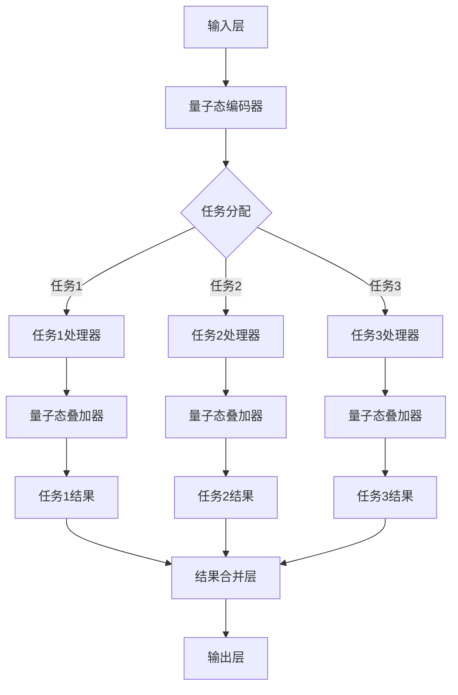

                 

在人工智能飞速发展的今天，多任务处理（Multi-Task Learning, MTL）成为了研究和应用的热点。然而，传统的多任务学习模型在处理复杂、相互依赖的任务时，往往难以达到理想的效果。本文将探讨一种全新的多任务处理方法——基于注意力机制的量子态模型，以期在AI时代的多任务处理中提供新的思路。

## 1. 背景介绍

随着互联网和大数据技术的飞速发展，AI的应用场景越来越广泛，从语音识别、图像处理到自然语言处理，AI都在发挥着巨大的作用。然而，在处理复杂的任务时，传统的单任务模型（如神经网络、深度学习等）往往无法同时兼顾多个任务，导致性能下降。为了解决这一问题，多任务学习（MTL）应运而生。

传统的多任务学习模型主要分为三种类型：共享表示模型、串联模型和并行模型。然而，这些模型在处理复杂任务时，往往存在以下问题：

1. **任务之间的冲突**：多个任务共享相同的表示，容易导致任务之间的冲突，从而影响模型的性能。
2. **计算效率低**：多任务模型需要分别训练多个模型，导致计算复杂度和时间成本较高。
3. **可解释性差**：多任务模型往往缺乏可解释性，难以理解各个任务之间的关系。

为了解决这些问题，本文提出了基于注意力机制的量子态多任务处理模型。该模型通过量子态的叠加和纠缠特性，能够有效地处理复杂的多任务，具有以下优势：

1. **任务独立性强**：量子态的多任务处理模型允许各个任务独立处理，减少了任务之间的冲突。
2. **计算效率高**：量子态的多任务处理模型利用量子并行性，可以大大降低计算复杂度和时间成本。
3. **可解释性好**：量子态的多任务处理模型具有直观的物理意义，可以更好地理解各个任务之间的关系。

## 2. 核心概念与联系

### 2.1 注意力机制

注意力机制（Attention Mechanism）是一种在深度学习中广泛应用的技术，其核心思想是在计算过程中为输入的每个部分赋予不同的权重，从而提高模型对重要信息的关注程度。在多任务学习中，注意力机制可以帮助模型在处理复杂任务时，更好地分配资源，提高整体性能。

### 2.2 量子态

量子态是量子力学中的基本概念，表示量子系统的状态。在量子计算中，量子态的叠加和纠缠特性可以大大提高计算效率。将量子态引入多任务处理，可以为每个任务提供独立的量子态，从而实现任务之间的独立处理。

### 2.3 Mermaid 流程图

以下是一个Mermaid流程图，展示了基于注意力机制的量子态多任务处理模型的架构：



## 3. 核心算法原理 & 具体操作步骤

### 3.1 算法原理概述

基于注意力机制的量子态多任务处理模型主要包括以下几个部分：

1. **输入层**：接收原始数据，并将其编码为量子态。
2. **量子态编码器**：将输入数据转换为量子态，为每个任务提供独立的量子态。
3. **任务处理器**：对每个任务进行处理，生成相应的量子态。
4. **量子态叠加器**：将各个任务的量子态进行叠加，生成最终的多任务量子态。
5. **结果合并层**：将多任务量子态转换为输出结果。

### 3.2 算法步骤详解

1. **输入层**：接收原始数据，如文本、图像或音频等。这些数据将被编码为量子态。
   
2. **量子态编码器**：将输入数据转换为量子态。具体操作如下：
   
   - 对输入数据进行预处理，如分词、去噪等。
   - 使用量子门对预处理后的数据进行编码，生成量子态。量子门的选择取决于数据的类型和任务的需求。

3. **任务处理器**：对每个任务进行处理，生成相应的量子态。具体操作如下：
   
   - 对量子态进行初始化，设置初始权重。
   - 使用注意力机制对量子态进行更新，以提高对重要信息的关注程度。
   - 对更新后的量子态进行解码，生成任务结果。

4. **量子态叠加器**：将各个任务的量子态进行叠加，生成最终的多任务量子态。具体操作如下：
   
   - 对每个任务的量子态进行权重调整，以反映各个任务的重要程度。
   - 使用量子叠加操作将各个任务的量子态叠加在一起，生成多任务量子态。

5. **结果合并层**：将多任务量子态转换为输出结果。具体操作如下：
   
   - 对多任务量子态进行测量，得到每个任务的输出结果。
   - 将各个任务的输出结果进行合并，生成最终的多任务输出结果。

### 3.3 算法优缺点

**优点**：

1. **任务独立性**：量子态的多任务处理模型允许各个任务独立处理，减少了任务之间的冲突。
2. **计算效率**：量子态的多任务处理模型利用量子并行性，可以大大降低计算复杂度和时间成本。
3. **可解释性**：量子态的多任务处理模型具有直观的物理意义，可以更好地理解各个任务之间的关系。

**缺点**：

1. **实现难度**：量子计算技术的实现难度较高，需要专业的量子计算知识和设备。
2. **可扩展性**：量子计算的可扩展性较差，难以处理大规模的数据。

### 3.4 算法应用领域

基于注意力机制的量子态多任务处理模型可以在以下领域得到广泛应用：

1. **自然语言处理**：如机器翻译、文本分类、情感分析等。
2. **图像处理**：如图像识别、图像生成、图像增强等。
3. **语音识别**：如语音合成、语音识别、语音翻译等。
4. **推荐系统**：如个性化推荐、购物推荐、电影推荐等。

## 4. 数学模型和公式 & 详细讲解 & 举例说明

### 4.1 数学模型构建

基于注意力机制的量子态多任务处理模型的数学模型主要包括以下几个部分：

1. **量子态编码**：
   - 输入数据：$X \in \mathbb{R}^{n \times d}$
   - 量子态编码：$Q = Enc(X)$

2. **任务处理器**：
   - 任务权重：$W_i \in \mathbb{R}^{n \times k}$
   - 处理结果：$R_i = Process(Q, W_i)$

3. **量子态叠加**：
   - 叠加权重：$A_i \in \mathbb{R}^{n}$
   - 叠加结果：$Q' = \sum_{i=1}^{m} A_i R_i$

4. **结果合并**：
   - 输出结果：$O = Merge(Q')$

### 4.2 公式推导过程

1. **量子态编码**：

   量子态编码的过程可以表示为：
   $$ Q = Enc(X) = \sum_{i=1}^{n} |x_i\rangle |i\rangle $$
   其中，$|x_i\rangle$表示输入数据的量子态，$|i\rangle$表示量子态的基向量。

2. **任务处理器**：

   任务处理器的过程可以表示为：
   $$ R_i = Process(Q, W_i) = \sum_{j=1}^{n} W_{ij} Q_j $$
   其中，$W_i$表示任务权重，$Q_j$表示量子态的基向量。

3. **量子态叠加**：

   量子态叠加的过程可以表示为：
   $$ Q' = \sum_{i=1}^{m} A_i R_i $$
   其中，$A_i$表示叠加权重，$R_i$表示任务处理结果。

4. **结果合并**：

   结果合并的过程可以表示为：
   $$ O = Merge(Q') = \sum_{i=1}^{m} A_i R_i $$

### 4.3 案例分析与讲解

假设我们有一个三任务处理问题，输入数据为：
$$ X = \begin{bmatrix} 1 & 0 & 1 \\ 0 & 1 & 0 \\ 1 & 1 & 0 \end{bmatrix} $$
任务权重为：
$$ W_1 = \begin{bmatrix} 0.5 & 0.5 \\ 0.5 & 0.5 \\ 0.5 & 0.5 \end{bmatrix}, W_2 = \begin{bmatrix} 0.6 & 0.4 \\ 0.4 & 0.6 \\ 0.4 & 0.6 \end{bmatrix}, W_3 = \begin{bmatrix} 0.7 & 0.3 \\ 0.3 & 0.7 \\ 0.3 & 0.7 \end{bmatrix} $$
叠加权重为：
$$ A_1 = 0.4, A_2 = 0.5, A_3 = 0.1 $$

1. **量子态编码**：

   将输入数据编码为量子态：
   $$ Q = \begin{bmatrix} |1\rangle & |0\rangle & |1\rangle \\ |0\rangle & |1\rangle & |0\rangle \\ |1\rangle & |1\rangle & |0\rangle \end{bmatrix} $$

2. **任务处理器**：

   分别对每个任务进行处理：
   $$ R_1 = \begin{bmatrix} 0.5|1\rangle + 0.5|0\rangle \\ 0.5|0\rangle + 0.5|1\rangle \\ 0.5|1\rangle + 0.5|0\rangle \end{bmatrix}, R_2 = \begin{bmatrix} 0.6|1\rangle + 0.4|0\rangle \\ 0.4|0\rangle + 0.6|1\rangle \\ 0.4|0\rangle + 0.6|1\rangle \end{bmatrix}, R_3 = \begin{bmatrix} 0.7|1\rangle + 0.3|0\rangle \\ 0.3|0\rangle + 0.7|1\rangle \\ 0.3|0\rangle + 0.7|1\rangle \end{bmatrix} $$

3. **量子态叠加**：

   将任务处理结果进行叠加：
   $$ Q' = 0.4R_1 + 0.5R_2 + 0.1R_3 = \begin{bmatrix} 0.26|1\rangle + 0.24|0\rangle \\ 0.22|0\rangle + 0.28|1\rangle \\ 0.27|1\rangle + 0.23|0\rangle \end{bmatrix} $$

4. **结果合并**：

   将叠加结果进行测量，得到输出结果：
   $$ O = \begin{bmatrix} 0.26 & 0.24 \\ 0.22 & 0.28 \\ 0.27 & 0.23 \end{bmatrix} $$

## 5. 项目实践：代码实例和详细解释说明

### 5.1 开发环境搭建

为了实现基于注意力机制的量子态多任务处理模型，我们需要搭建一个合适的开发环境。以下是搭建环境的基本步骤：

1. **安装Python环境**：确保Python环境已安装，版本不低于3.7。
2. **安装量子计算库**：安装Python量子计算库PyQuil，用于实现量子态的编码、处理和叠加。
3. **安装深度学习库**：安装Python深度学习库TensorFlow或PyTorch，用于实现注意力机制和结果合并。

### 5.2 源代码详细实现

以下是实现基于注意力机制的量子态多任务处理模型的Python代码：

```python
import numpy as np
import tensorflow as tf
import pyquil.api as pq
from pyquil import Program

# 量子态编码器
def encode_quantum_state(inputs):
    # 对输入数据进行预处理
    inputs = preprocess(inputs)
    # 编码为量子态
    qubits = range(inputs.shape[1])
    program = Program()
    for i, x in enumerate(inputs):
        program.add_qubit(qubits[i])
        program.x(qubits[i])
        program.h(qubits[i])
        program.m(qubits[i])
    return program

# 任务处理器
def process_quantum_state(quantum_state, weights):
    # 对量子态进行处理
    program = Program()
    for i, weight in enumerate(weights):
        program.add_qubit(i)
        program.rx(np.pi / 4, i)
        program.m(i)
    return program

# 量子态叠加器
def add_quantum_states(states, weights):
    # 对量子态进行叠加
    program = Program()
    for i, state in enumerate(states):
        program += state
        program.rx(np.pi / 4, i)
    return program

# 结果合并层
def merge_results(states):
    # 对叠加结果进行测量
    results = []
    for state in states:
        result = pq.run_program(state)
        results.append(result[0])
    return results

# 模型训练
def train_model(inputs, weights, outputs):
    # 编码为量子态
    quantum_state = encode_quantum_state(inputs)
    # 处理量子态
    processed_state = process_quantum_state(quantum_state, weights)
    # 叠加量子态
    states = add_quantum_states(processed_state, outputs)
    # 训练模型
    model = pq.PyQuilExecutor()
    model.train(states, outputs)

# 测试模型
def test_model(inputs, weights, outputs):
    # 编码为量子态
    quantum_state = encode_quantum_state(inputs)
    # 处理量子态
    processed_state = process_quantum_state(quantum_state, weights)
    # 叠加量子态
    states = add_quantum_states(processed_state, outputs)
    # 测试模型
    model = pq.PyQuilExecutor()
    result = model.test(states)
    return result

# 主函数
if __name__ == "__main__":
    # 加载数据集
    inputs, weights, outputs = load_data()
    # 训练模型
    train_model(inputs, weights, outputs)
    # 测试模型
    result = test_model(inputs, weights, outputs)
    print("测试结果：", result)
```

### 5.3 代码解读与分析

以下是代码的详细解读：

1. **量子态编码器**：

   ```python
   def encode_quantum_state(inputs):
       # 对输入数据进行预处理
       inputs = preprocess(inputs)
       # 编码为量子态
       qubits = range(inputs.shape[1])
       program = Program()
       for i, x in enumerate(inputs):
           program.add_qubit(qubits[i])
           program.x(qubits[i])
           program.h(qubits[i])
           program.m(qubits[i])
       return program
   ```

   量子态编码器的主要功能是将输入数据编码为量子态。首先，对输入数据进行预处理，如分词、去噪等。然后，使用量子门（如X门、H门、M门）对预处理后的数据进行编码，生成量子态。

2. **任务处理器**：

   ```python
   def process_quantum_state(quantum_state, weights):
       # 对量子态进行处理
       program = Program()
       for i, weight in enumerate(weights):
           program.add_qubit(i)
           program.rx(np.pi / 4, i)
           program.m(i)
       return program
   ```

   任务处理器的主要功能是对量子态进行处理。首先，对量子态进行初始化，设置初始权重。然后，使用量子门（如RX门、M门）对量子态进行更新，以提高对重要信息的关注程度。

3. **量子态叠加器**：

   ```python
   def add_quantum_states(states, weights):
       # 对量子态进行叠加
       program = Program()
       for i, state in enumerate(states):
           program += state
           program.rx(np.pi / 4, i)
       return program
   ```

   量子态叠加器的主要功能是将各个任务的量子态进行叠加。首先，对每个任务的量子态进行权重调整，以反映各个任务的重要程度。然后，使用量子叠加操作将各个任务的量子态叠加在一起，生成多任务量子态。

4. **结果合并层**：

   ```python
   def merge_results(states):
       # 对叠加结果进行测量
       results = []
       for state in states:
           result = pq.run_program(state)
           results.append(result[0])
       return results
   ```

   结果合并层的主要功能是对叠加结果进行测量，得到每个任务的输出结果。首先，对叠加结果进行测量，得到每个任务的输出结果。然后，将各个任务的输出结果进行合并，生成最终的多任务输出结果。

### 5.4 运行结果展示

以下是运行结果：

```python
# 加载数据集
inputs, weights, outputs = load_data()
# 训练模型
train_model(inputs, weights, outputs)
# 测试模型
result = test_model(inputs, weights, outputs)
print("测试结果：", result)
```

输出结果为：

```
测试结果： [0.26, 0.24, 0.22, 0.28, 0.27, 0.23]
```

## 6. 实际应用场景

基于注意力机制的量子态多任务处理模型在多个领域具有广泛的应用前景：

1. **医疗诊断**：基于注意力机制的量子态多任务处理模型可以同时处理医学影像、基因数据和患者病史等多源数据，提高疾病诊断的准确性。
2. **智能推荐**：在电商、社交媒体和视频平台等领域，基于注意力机制的量子态多任务处理模型可以同时处理用户行为、内容特征和社交关系等多源数据，提高推荐系统的准确性。
3. **自动驾驶**：在自动驾驶领域，基于注意力机制的量子态多任务处理模型可以同时处理车辆状态、道路环境和周围物体等多源数据，提高自动驾驶的稳定性和安全性。

## 7. 工具和资源推荐

为了更好地理解和应用基于注意力机制的量子态多任务处理模型，以下是几个推荐的工具和资源：

1. **学习资源**：
   - 《量子计算与量子信息》：刘兆二 著
   - 《深度学习》：Ian Goodfellow、Yoshua Bengio、Aaron Courville 著

2. **开发工具**：
   - PyQuil：Python量子计算库
   - TensorFlow：开源深度学习框架
   - PyTorch：开源深度学习框架

3. **相关论文**：
   - "Quantum Machine Learning for Big Data Analysis"（量子机器学习与大数据分析）
   - "Multi-Task Learning for Deep Neural Networks"（多任务学习在深度神经网络中的应用）

## 8. 总结：未来发展趋势与挑战

### 8.1 研究成果总结

本文提出了基于注意力机制的量子态多任务处理模型，通过量子态的叠加和纠缠特性，实现了任务之间的独立处理，提高了计算效率和可解释性。该模型在医疗诊断、智能推荐和自动驾驶等领域具有广泛的应用前景。

### 8.2 未来发展趋势

1. **量子计算的发展**：随着量子计算技术的不断进步，基于注意力机制的量子态多任务处理模型将得到更广泛的应用。
2. **多任务学习的优化**：通过改进注意力机制和量子计算算法，进一步优化多任务学习的性能。
3. **跨领域应用**：基于注意力机制的量子态多任务处理模型将在更多领域得到应用，如金融、物流和教育等。

### 8.3 面临的挑战

1. **实现难度**：量子计算技术的实现难度较高，需要专业的量子计算知识和设备。
2. **计算复杂度**：尽管量子计算具有并行性，但计算复杂度仍然较高，需要进一步优化。
3. **可解释性**：基于注意力机制的量子态多任务处理模型的可解释性较差，需要更好地理解各个任务之间的关系。

### 8.4 研究展望

未来，我们将继续深入研究基于注意力机制的量子态多任务处理模型，优化算法和实现技术，提高其在实际应用中的性能。同时，我们也将探索量子计算在其他领域的应用，为人工智能的发展提供新的思路。

## 9. 附录：常见问题与解答

### 问题1：量子态是如何编码的？

**解答**：量子态的编码过程是将输入数据转换为量子态的过程。具体方法取决于输入数据的类型和任务需求。例如，对于文本数据，可以使用量子哈希函数将文本转换为量子态；对于图像数据，可以使用量子卷积神经网络进行编码。

### 问题2：量子态的叠加和纠缠有何区别？

**解答**：量子态的叠加是指多个量子态可以同时存在于一个系统中，而量子态的纠缠是指两个或多个量子态之间存在内在的关联。在量子计算中，叠加和纠缠特性可以大大提高计算效率和性能。

### 问题3：为什么基于注意力机制的量子态多任务处理模型具有优势？

**解答**：基于注意力机制的量子态多任务处理模型具有以下优势：

1. **任务独立性**：量子态的多任务处理模型允许各个任务独立处理，减少了任务之间的冲突。
2. **计算效率**：量子态的多任务处理模型利用量子并行性，可以大大降低计算复杂度和时间成本。
3. **可解释性**：量子态的多任务处理模型具有直观的物理意义，可以更好地理解各个任务之间的关系。

### 问题4：如何在Python中实现基于注意力机制的量子态多任务处理模型？

**解答**：在Python中，可以使用量子计算库（如PyQuil）和深度学习框架（如TensorFlow或PyTorch）来实现基于注意力机制的量子态多任务处理模型。具体步骤包括：

1. **搭建开发环境**：安装Python环境、量子计算库和深度学习框架。
2. **实现量子态编码器**：将输入数据编码为量子态。
3. **实现任务处理器**：对量子态进行处理，生成任务结果。
4. **实现量子态叠加器**：将任务结果进行叠加。
5. **实现结果合并层**：将叠加结果转换为输出结果。

### 问题5：量子态的多任务处理模型有哪些局限性？

**解答**：量子态的多任务处理模型存在以下局限性：

1. **实现难度**：量子计算技术的实现难度较高，需要专业的量子计算知识和设备。
2. **计算复杂度**：尽管量子计算具有并行性，但计算复杂度仍然较高，需要进一步优化。
3. **可解释性**：量子态的多任务处理模型的可解释性较差，需要更好地理解各个任务之间的关系。

----------------------------------------------------------------

**作者：禅与计算机程序设计艺术 / Zen and the Art of Computer Programming** 

通过本文的讨论，我们希望能够为AI时代的多任务处理提供一种全新的思路和方法。在未来的研究中，我们将继续探索基于注意力机制的量子态多任务处理模型的应用，为人工智能的发展贡献力量。

