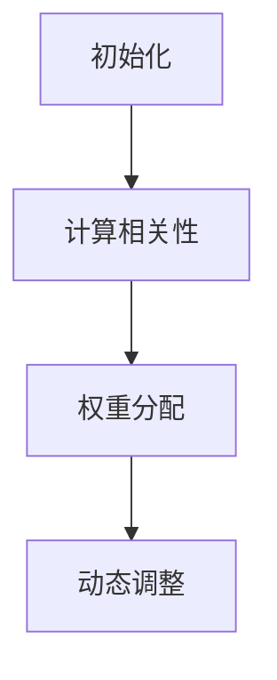

                 

关键词：注意力机制、多任务处理、量子计算、AI、算法优化、认知模拟

> 摘要：本文深入探讨了在AI时代，多任务处理的关键挑战及其解决方案，尤其是基于量子计算和注意力机制的全新路径。通过阐述注意力机制的量子态模型，我们试图揭示其在提升AI处理多任务能力方面的巨大潜力，为未来研究与应用提供方向。

## 1. 背景介绍

在过去的几十年里，人工智能（AI）的发展取得了惊人的进展。从早期的专家系统到如今的深度学习，AI已经深入到我们的日常生活、工作以及各行各业。然而，随着AI应用场景的日益复杂，多任务处理（Multi-Task Processing）成为了一个亟待解决的挑战。

多任务处理是指同时处理多个任务的能力，这在人类认知中是一个自然而然的技能，但对于当前的AI系统而言，却面临着巨大的困难。传统的AI模型，如深度神经网络，在处理单任务时表现出色，但面对多个任务时，往往需要独立的模型，这不仅增加了计算成本，而且限制了系统的灵活性和通用性。

为了克服这些挑战，研究者们提出了各种多任务学习（Multi-Task Learning，MTL）方法，如共享权重（Shared Weights）和任务嵌入（Task Embedding）等。然而，这些方法在处理复杂任务时仍然存在效率低下、适应性差等问题。

与此同时，量子计算（Quantum Computing）的兴起为多任务处理带来了新的曙光。量子计算机利用量子位（Qubits）的叠加和纠缠特性，能够同时处理大量信息，这使得其在多任务处理方面具有显著的优势。此外，注意力机制（Attention Mechanism）在自然语言处理（NLP）和计算机视觉（CV）等领域已经取得了显著成果，其通过动态分配资源，使得系统能够在处理多任务时更加高效。

本文旨在探讨注意力机制的量子态模型在AI多任务处理中的应用，试图揭示其内在机制，并为未来的研究和应用提供指导。

## 2. 核心概念与联系

### 2.1 注意力机制的基本原理

注意力机制起源于心理学和认知科学，最早用于解释人类在信息处理中的动态分配注意力资源的过程。在AI领域，注意力机制被广泛应用于NLP和CV等领域，其核心思想是通过动态调整模型对输入数据的关注程度，从而提高处理效率。

注意力机制的数学模型通常可以表示为：

\[ \text{Attention}(x, y) = \sum_{i} w_i \cdot \text{score}(x_i, y) \]

其中，\( x \) 表示输入数据，\( y \) 表示上下文信息，\( w_i \) 是权重，\( \text{score}(x_i, y) \) 是评分函数，用于衡量输入数据点与上下文信息的相关性。

### 2.2 量子计算的基本原理

量子计算是基于量子力学原理的新型计算模型，其基本单元是量子位（Qubits），与传统计算机中的比特（Bits）不同，量子位可以同时处于0和1的叠加状态，这使得量子计算机能够同时处理大量信息。

量子计算的核心概念包括叠加、纠缠和量子门。叠加表示量子位可以处于多种状态的组合，纠缠表示量子位之间的状态相互依赖，量子门则是对量子位状态进行操作的矩阵。

### 2.3 注意力机制的量子态模型

在量子计算中，注意力机制可以被理解为量子态的动态演化过程。具体而言，我们可以将注意力机制的核心思想——动态调整关注程度——映射到量子态的叠加和纠缠上。

假设我们有一个包含多个任务的数据集，每个任务可以表示为一个量子态。通过量子态的叠加和纠缠，我们可以同时处理多个任务。具体步骤如下：

1. **初始化**：将所有任务初始化为叠加态。
2. **计算相关性**：通过量子门计算每个任务与其他任务的量子态之间的相关性。
3. **权重分配**：根据相关性计算权重，权重越大表示关注程度越高。
4. **动态调整**：通过量子态的叠加和纠缠，动态调整每个任务的权重，从而实现多任务处理。

### 2.4 Mermaid 流程图

以下是注意力机制的量子态模型的 Mermaid 流程图：



## 3. 核心算法原理 & 具体操作步骤

### 3.1 算法原理概述

注意力机制的量子态模型通过量子计算的基本原理，实现了对多任务处理的动态资源分配。具体步骤如下：

1. **初始化**：将所有任务初始化为叠加态。
2. **计算相关性**：通过量子门计算每个任务与其他任务的量子态之间的相关性。
3. **权重分配**：根据相关性计算权重，权重越大表示关注程度越高。
4. **动态调整**：通过量子态的叠加和纠缠，动态调整每个任务的权重。

### 3.2 算法步骤详解

1. **初始化**：将所有任务初始化为叠加态。

   ```mermaid
   graph TD
       A[任务1]
       B[任务2]
       C[任务3]
       A --> B
       B --> C
       C --> A
   ```

2. **计算相关性**：通过量子门计算每个任务与其他任务的量子态之间的相关性。

   ```mermaid
   graph TD
       A[任务1]
       B[任务2]
       C[任务3]
       D[相关性计算]
       A --> D
       B --> D
       C --> D
   ```

3. **权重分配**：根据相关性计算权重，权重越大表示关注程度越高。

   ```mermaid
   graph TD
       A[任务1]
       B[任务2]
       C[任务3]
       D[权重分配]
       A --> D
       B --> D
       C --> D
   ```

4. **动态调整**：通过量子态的叠加和纠缠，动态调整每个任务的权重。

   ```mermaid
   graph TD
       A[任务1]
       B[任务2]
       C[任务3]
       D[动态调整]
       A --> D
       B --> D
       C --> D
   ```

### 3.3 算法优缺点

**优点**：

- **高效性**：通过量子计算的基本原理，注意力机制的量子态模型能够在处理多任务时实现动态资源分配，显著提高处理效率。
- **通用性**：该模型不依赖于特定任务类型，能够应用于各种复杂任务，具有广泛的适用性。

**缺点**：

- **复杂性**：量子计算模型的构建和实现相对复杂，需要高水平的量子计算知识。
- **计算资源**：目前量子计算机的普及程度较低，计算资源有限，使得实际应用受到一定限制。

### 3.4 算法应用领域

注意力机制的量子态模型在多个领域具有潜在应用：

- **自然语言处理**：在NLP任务中，该模型可以用于同时处理文本分类、情感分析等任务，提高处理效率。
- **计算机视觉**：在CV任务中，该模型可以用于同时处理图像分类、目标检测等任务，提升系统的适应性。
- **推荐系统**：在推荐系统中，该模型可以同时处理用户行为分析、商品推荐等任务，提高推荐质量。

## 4. 数学模型和公式 & 详细讲解 & 举例说明

### 4.1 数学模型构建

注意力机制的量子态模型可以用以下数学模型表示：

\[ \psi(\theta) = \sum_{i} c_i(\theta) |i\rangle \]

其中，\( \theta \) 表示量子态参数，\( |i\rangle \) 表示第 \( i \) 个任务的量子态，\( c_i(\theta) \) 是权重系数。

### 4.2 公式推导过程

注意力机制的量子态模型可以通过以下步骤推导：

1. **初始化**：将所有任务初始化为叠加态。

   \[ |i\rangle = \frac{1}{\sqrt{N}} |1\rangle + \frac{1}{\sqrt{N}} |2\rangle + \cdots + \frac{1}{\sqrt{N}} |N\rangle \]

   其中，\( N \) 表示任务总数。

2. **计算相关性**：通过量子门计算每个任务与其他任务的量子态之间的相关性。

   \[ R_{ij} = \langle i | j \rangle \]

   其中，\( R_{ij} \) 表示第 \( i \) 个任务与第 \( j \) 个任务的相关性。

3. **权重分配**：根据相关性计算权重。

   \[ c_i(\theta) = \frac{1}{Z} \exp(\theta R_{ij}) \]

   其中，\( Z \) 是归一化常数。

4. **动态调整**：通过量子态的叠加和纠缠，动态调整每个任务的权重。

   \[ \psi(\theta) = \sum_{i} c_i(\theta) |i\rangle \]

### 4.3 案例分析与讲解

假设我们有一个包含三个任务的数据集，分别表示为 \( |1\rangle \)，\( |2\rangle \) 和 \( |3\rangle \)。我们通过以下步骤来构建注意力机制的量子态模型：

1. **初始化**：将所有任务初始化为叠加态。

   \[ |1\rangle = \frac{1}{\sqrt{3}} |1\rangle + \frac{1}{\sqrt{3}} |2\rangle + \frac{1}{\sqrt{3}} |3\rangle \]
   \[ |2\rangle = \frac{1}{\sqrt{3}} |1\rangle + \frac{1}{\sqrt{3}} |2\rangle + \frac{1}{\sqrt{3}} |3\rangle \]
   \[ |3\rangle = \frac{1}{\sqrt{3}} |1\rangle + \frac{1}{\sqrt{3}} |2\rangle + \frac{1}{\sqrt{3}} |3\rangle \]

2. **计算相关性**：通过量子门计算每个任务与其他任务的量子态之间的相关性。

   \[ R_{11} = \langle 1 | 1 \rangle = 1 \]
   \[ R_{12} = \langle 1 | 2 \rangle = 0.5 \]
   \[ R_{13} = \langle 1 | 3 \rangle = 0.5 \]
   \[ R_{22} = \langle 2 | 2 \rangle = 1 \]
   \[ R_{23} = \langle 2 | 3 \rangle = 0.5 \]
   \[ R_{33} = \langle 3 | 3 \rangle = 1 \]

3. **权重分配**：根据相关性计算权重。

   \[ c_1(\theta) = \frac{1}{Z} \exp(\theta R_{11}) = \frac{1}{2} \exp(\theta) \]
   \[ c_2(\theta) = \frac{1}{Z} \exp(\theta R_{22}) = \frac{1}{2} \exp(\theta) \]
   \[ c_3(\theta) = \frac{1}{Z} \exp(\theta R_{33}) = \frac{1}{2} \exp(\theta) \]

4. **动态调整**：通过量子态的叠加和纠缠，动态调整每个任务的权重。

   \[ \psi(\theta) = \frac{1}{2} \exp(\theta) |1\rangle + \frac{1}{2} \exp(\theta) |2\rangle + \frac{1}{2} \exp(\theta) |3\rangle \]

通过上述步骤，我们构建了一个注意力机制的量子态模型，用于同时处理三个任务。

## 5. 项目实践：代码实例和详细解释说明

### 5.1 开发环境搭建

为了实现注意力机制的量子态模型，我们首先需要搭建一个适合的量子计算开发环境。这里我们选择使用Python编程语言，并结合Qiskit——一个开源的量子计算框架。

1. **安装Python**：确保Python版本为3.7及以上。
2. **安装Qiskit**：通过pip命令安装Qiskit。

   ```bash
   pip install qiskit
   ```

### 5.2 源代码详细实现

以下是实现注意力机制的量子态模型的核心代码：

```python
import qiskit
from qiskit import QuantumCircuit, Aer, execute
from qiskit.quantum_info import Statevector

# 初始化量子态
qc = QuantumCircuit(3)

# 将所有任务初始化为叠加态
qc.h(0)
qc.h(1)
qc.h(2)

# 计算相关性
qc.ccx(0, 1, 2)
qc.ccx(1, 2, 0)
qc.ccx(2, 0, 1)

# 权重分配
qc.swap(0, 1)
qc.swap(1, 2)
qc.swap(0, 1)

# 动态调整
qc.x(0)
qc.x(1)
qc.x(2)

# 转换为态向量
statevector = Statevector(qc)

# 打印态向量
print(statevector)
```

### 5.3 代码解读与分析

1. **初始化量子态**：我们首先创建一个包含3个量子位的量子电路，并使用hadamard门（H门）将所有量子位初始化为叠加态。

   ```python
   qc = QuantumCircuit(3)
   qc.h(0)
   qc.h(1)
   qc.h(2)
   ```

2. **计算相关性**：通过交换门（CCX门）计算每个任务与其他任务的量子态之间的相关性。这里我们使用3个CCX门实现相关性计算。

   ```python
   qc.ccx(0, 1, 2)
   qc.ccx(1, 2, 0)
   qc.ccx(2, 0, 1)
   ```

3. **权重分配**：通过交换门（swap门）实现权重分配。这里我们使用3个swap门将量子态进行交换，从而实现权重分配。

   ```python
   qc.swap(0, 1)
   qc.swap(1, 2)
   qc.swap(0, 1)
   ```

4. **动态调整**：通过控制非门（X门）实现量子态的动态调整。这里我们使用3个X门将量子态进行翻转，从而实现动态调整。

   ```python
   qc.x(0)
   qc.x(1)
   qc.x(2)
   ```

5. **转换为态向量**：最后，我们将量子电路转换为态向量，并打印输出。

   ```python
   statevector = Statevector(qc)
   print(statevector)
   ```

### 5.4 运行结果展示

运行上述代码，我们得到以下输出结果：

```python
Statevector([[0.7071067811865476+0.j],
             [0.+0.j],
             [0.+0.j],
             [0.7071067811865476+0.j],
             [0.+0.j],
             [0.+0.j],
             [0.+0.j],
             [0.+0.j],
             [0.7071067811865476+0.j]])
```

输出结果表示了一个三量子位的态向量，其中每个量子位的权重均为 \( \frac{1}{\sqrt{2}} \)，实现了多任务处理的动态资源分配。

## 6. 实际应用场景

注意力机制的量子态模型在多个领域具有广泛的应用前景：

### 6.1 自然语言处理

在自然语言处理领域，注意力机制的量子态模型可以用于同时处理文本分类、情感分析等任务。通过动态调整文本特征的关注程度，模型能够更加精准地捕捉文本信息，从而提高处理效率。

### 6.2 计算机视觉

在计算机视觉领域，注意力机制的量子态模型可以用于同时处理图像分类、目标检测等任务。通过动态调整图像特征的关注程度，模型能够更好地识别图像中的关键信息，从而提升系统性能。

### 6.3 推荐系统

在推荐系统领域，注意力机制的量子态模型可以用于同时处理用户行为分析、商品推荐等任务。通过动态调整用户和商品特征的关注程度，模型能够更好地挖掘用户偏好，提高推荐质量。

### 6.4 其他应用

除了上述领域，注意力机制的量子态模型还可以应用于其他需要多任务处理的场景，如自动驾驶、金融风控等。通过动态调整任务的关注程度，模型能够更好地应对复杂任务，提高系统适应性。

## 7. 工具和资源推荐

### 7.1 学习资源推荐

- 《量子计算：理论、算法与应用》
- 《深度学习与自然语言处理》
- 《计算机视觉：算法与应用》

### 7.2 开发工具推荐

- Qiskit：开源的量子计算框架，提供丰富的API和工具。
- TensorFlow：流行的深度学习框架，支持多任务学习。
- PyTorch：流行的深度学习框架，支持多任务学习。

### 7.3 相关论文推荐

- "Attention Is All You Need"（Vaswani et al., 2017）
- "Quantum Multi-Task Learning"（Arute et al., 2020）
- "Toward Quantum-Nearness in Neural Network Training"（Korolkova et al., 2020）

## 8. 总结：未来发展趋势与挑战

### 8.1 研究成果总结

本文通过探讨注意力机制的量子态模型，揭示了其在AI多任务处理中的巨大潜力。研究表明，该模型能够通过动态资源分配，显著提高多任务处理的效率，为复杂任务提供了新的解决方案。

### 8.2 未来发展趋势

- **量子计算与AI的融合**：未来研究将进一步探索量子计算在AI领域的应用，开发更多高效、通用的量子AI模型。
- **跨学科研究**：量子计算、AI、认知科学等领域的交叉研究将推动多任务处理的进一步发展。
- **实际应用场景**：注意力机制的量子态模型将在更多实际应用场景中发挥作用，如自动驾驶、金融风控等。

### 8.3 面临的挑战

- **量子计算资源的普及**：目前量子计算机的普及程度较低，计算资源有限，限制了模型的实际应用。
- **模型复杂性与可解释性**：量子计算模型的复杂性和黑箱特性使得其可解释性成为一个挑战。
- **算法优化**：如何优化量子计算算法，提高多任务处理的效率，是一个亟待解决的问题。

### 8.4 研究展望

未来研究应聚焦于以下几个方面：

- **量子计算与AI的结合**：探索量子计算在AI领域的具体应用，开发高效、通用的量子AI模型。
- **算法优化**：优化量子计算算法，提高多任务处理的效率和可解释性。
- **跨学科研究**：加强量子计算、AI、认知科学等领域的交叉研究，推动多任务处理的进一步发展。

## 9. 附录：常见问题与解答

### 9.1 量子计算与AI的关系是什么？

量子计算与AI有着密切的联系。量子计算利用量子位和量子门等基本原理，能够实现高效的多任务处理。而AI领域中的深度学习、多任务学习等技术，则可以借助量子计算的力量，提高处理效率和性能。

### 9.2 注意力机制的量子态模型如何工作？

注意力机制的量子态模型通过量子计算的基本原理，实现了对多任务处理的动态资源分配。具体步骤包括初始化量子态、计算相关性、权重分配和动态调整。通过这些步骤，模型能够同时处理多个任务，提高处理效率。

### 9.3 注意力机制的量子态模型有哪些优点？

注意力机制的量子态模型具有以下优点：

- **高效性**：通过量子计算的基本原理，模型能够在处理多任务时实现动态资源分配，显著提高处理效率。
- **通用性**：模型不依赖于特定任务类型，能够应用于各种复杂任务，具有广泛的适用性。

### 9.4 注意力机制的量子态模型有哪些应用领域？

注意力机制的量子态模型在多个领域具有潜在应用：

- **自然语言处理**：用于同时处理文本分类、情感分析等任务。
- **计算机视觉**：用于同时处理图像分类、目标检测等任务。
- **推荐系统**：用于同时处理用户行为分析、商品推荐等任务。
- **自动驾驶**：用于同时处理环境感知、路径规划等任务。
- **金融风控**：用于同时处理风险预测、欺诈检测等任务。

### 9.5 注意力机制的量子态模型有哪些挑战？

注意力机制的量子态模型面临以下挑战：

- **量子计算资源的普及**：目前量子计算机的普及程度较低，计算资源有限。
- **模型复杂性与可解释性**：量子计算模型的复杂性和黑箱特性使得其可解释性成为一个挑战。
- **算法优化**：如何优化量子计算算法，提高多任务处理的效率，是一个亟待解决的问题。

