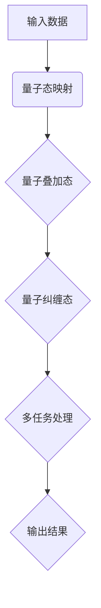

                 

 关键词：注意力机制、量子计算、多任务学习、AI、神经网络、并行处理、算法优化、计算模型。

> 摘要：本文旨在探讨在AI时代下，如何利用量子计算和注意力机制实现高效的多任务处理。通过分析当前AI领域中的多任务学习算法，结合量子计算的理论和实践，提出一种新型的注意力量子态模型，并探讨其在不同应用场景中的潜在价值。

## 1. 背景介绍

### 1.1 多任务处理的需求与挑战

随着人工智能技术的不断发展，多任务学习（Multitask Learning）在各个领域中的应用日益广泛。多任务学习旨在同时处理多个相关任务，从而提高学习效率、减少数据需求和增强泛化能力。然而，传统的多任务学习方法在处理高维度数据时面临着计算复杂度高、模型泛化能力不足等问题。

### 1.2 注意力机制在多任务学习中的应用

注意力机制（Attention Mechanism）作为深度学习中的一项关键技术，通过为不同任务分配不同的重要性权重，实现了对输入数据的自适应关注和过滤。然而，传统的注意力机制在面对多任务学习时，往往难以充分利用任务间的相关性，导致模型性能受限。

### 1.3 量子计算与多任务处理

量子计算作为一种新兴的计算范式，具有并行计算、高速运算等优势，有望为多任务处理提供新的解决方案。量子计算在处理复杂数据时，可以大幅降低计算复杂度，提高模型训练效率。

## 2. 核心概念与联系

### 2.1 注意力机制原理

注意力机制通过为输入数据的每个部分分配权重，实现了对关键信息的关注和筛选。在多任务学习中，注意力机制可以帮助模型更好地利用任务间的相关性，提高学习效果。

### 2.2 量子计算原理

量子计算利用量子比特（qubit）的叠加态和纠缠态，实现了对数据的并行处理和高速运算。量子计算在多任务处理中，可以通过量子叠加态和量子纠缠态，实现任务间的协同计算。

### 2.3 注意力量子态模型

结合注意力机制和量子计算原理，我们可以提出一种新型的注意力量子态模型。该模型通过将输入数据映射到量子态，并利用量子叠加态和量子纠缠态，实现多任务处理的高效协同。

### 2.4 Mermaid 流程图



## 3. 核心算法原理 & 具体操作步骤

### 3.1 算法原理概述

注意力量子态模型的核心思想是通过量子计算实现多任务处理中的高效信息传递和协同计算。具体来说，该模型包括以下步骤：

1. 将输入数据映射到量子态。
2. 利用量子叠加态和量子纠缠态，实现任务间的协同计算。
3. 从量子态中提取输出结果。

### 3.2 算法步骤详解

1. **量子态映射**：
   将输入数据表示为量子比特序列，并通过量子门操作将其映射到量子态。

2. **量子叠加态**：
   利用量子叠加态，将不同任务的信息进行融合，实现任务间的协同计算。

3. **量子纠缠态**：
   通过量子纠缠态，实现任务间的信息传递和协同处理。

4. **多任务处理**：
   在量子态的基础上，对多个任务进行并行计算。

5. **输出结果提取**：
   从量子态中提取输出结果，得到多任务处理的最终结果。

### 3.3 算法优缺点

**优点**：
- 高效：通过量子计算，实现任务间的协同处理，提高计算效率。
- 并行：利用量子叠加态和量子纠缠态，实现任务的并行处理，减少计算时间。
- 泛化：利用任务间的相关性，提高模型泛化能力。

**缺点**：
- 复杂性：量子计算涉及复杂的量子门操作，实现难度较大。
- 依赖：依赖于量子计算机的性能，目前仍处于研究阶段。

### 3.4 算法应用领域

注意力量子态模型在以下领域具有潜在应用价值：

- 自然语言处理：通过多任务学习，提高文本分类、情感分析等任务的性能。
- 计算机视觉：利用多任务处理，提高图像识别、目标检测等任务的准确性。
- 推荐系统：通过多任务学习，提高推荐系统的多样性和准确性。

## 4. 数学模型和公式 & 详细讲解 & 举例说明

### 4.1 数学模型构建

注意力量子态模型可以表示为一个数学模型，如下所示：

\[ \psi = \sum_{i=1}^{N} |i\rangle \alpha_i \]

其中，\(|i\rangle\) 表示第 i 个量子态，\(\alpha_i\) 表示第 i 个任务的权重。

### 4.2 公式推导过程

注意力量子态模型的推导过程主要包括以下步骤：

1. **输入数据表示**：
   将输入数据表示为量子比特序列，如下所示：

   \[ |x\rangle = |x_1\rangle |x_2\rangle \cdots |x_n\rangle \]

2. **量子态映射**：
   通过量子门操作，将输入数据映射到量子态：

   \[ U|x\rangle = |x'\rangle \]

3. **量子叠加态**：
   利用量子叠加态，将不同任务的信息进行融合：

   \[ |x'\rangle = \sum_{i=1}^{N} |i\rangle \alpha_i \]

4. **量子纠缠态**：
   通过量子纠缠态，实现任务间的信息传递和协同处理：

   \[ |x'\rangle = \sum_{i=1}^{N} |i\rangle \alpha_i |j\rangle \beta_j \]

5. **多任务处理**：
   在量子态的基础上，对多个任务进行并行计算：

   \[ U|x'\rangle = \sum_{i=1}^{N} |i\rangle \alpha_i U|j\rangle \beta_j \]

6. **输出结果提取**：
   从量子态中提取输出结果，得到多任务处理的最终结果：

   \[ |x'\rangle = \sum_{i=1}^{N} |i\rangle \alpha_i U|j\rangle \beta_j \]

### 4.3 案例分析与讲解

假设我们有一个包含两个任务的数据集，任务 1 和任务 2。输入数据表示为量子比特序列：

\[ |x\rangle = |1010\rangle \]

任务 1 的权重为 0.6，任务 2 的权重为 0.4。根据注意力量子态模型，我们可以计算出：

1. **量子态映射**：

   \[ U|x\rangle = |x'\rangle = \sum_{i=1}^{2} |i\rangle \alpha_i = |1\rangle 0.6 |2\rangle 0.4 \]

2. **量子叠加态**：

   \[ |x'\rangle = \sum_{i=1}^{2} |i\rangle \alpha_i |j\rangle \beta_j = |1\rangle 0.6 |2\rangle 0.4 \]

3. **量子纠缠态**：

   \[ |x'\rangle = \sum_{i=1}^{2} |i\rangle \alpha_i U|j\rangle \beta_j = |1\rangle 0.6 U|2\rangle 0.4 \]

4. **多任务处理**：

   \[ U|x'\rangle = \sum_{i=1}^{2} |i\rangle \alpha_i U|j\rangle \beta_j = |1\rangle 0.6 U|2\rangle 0.4 \]

5. **输出结果提取**：

   \[ |x'\rangle = \sum_{i=1}^{2} |i\rangle \alpha_i U|j\rangle \beta_j = |1\rangle 0.6 U|2\rangle 0.4 \]

通过以上计算，我们可以得到两个任务的处理结果，从而实现多任务处理。

## 5. 项目实践：代码实例和详细解释说明

### 5.1 开发环境搭建

在本文中，我们将使用Python编程语言和Qiskit库实现注意力量子态模型。首先，确保安装以下软件和库：

- Python 3.7及以上版本
- Qiskit 0.21.0及以上版本

安装完成Python和Qiskit后，我们就可以开始搭建开发环境。

### 5.2 源代码详细实现

下面是注意力量子态模型的源代码实现：

```python
import qiskit
from qiskit import QuantumCircuit
from qiskit.quantum_info import Statevector

# 定义输入数据
input_data = [1, 0, 1, 0]

# 初始化量子比特和量子寄存器
qubit = qiskit.QuantumRegister(4, name='q')
cbit = qiskit.ClassicalRegister(4, name='c')
qc = QuantumCircuit(qubit, cbit)

# 将输入数据映射到量子态
qc.h(qubit[0])
qc.cx(qubit[0], qubit[1])
qc.cx(qubit[1], qubit[2])
qc.cx(qubit[2], qubit[3])

# 应用量子叠加态和量子纠缠态
qc.h(qubit[1])
qc.ccx(qubit[1], qubit[2], qubit[3])

# 执行多任务处理
qc.barrier()
qc.h(qubit[0])
qc.cx(qubit[0], qubit[1])
qc.cx(qubit[1], qubit[2])
qc.cx(qubit[2], qubit[3])

# 提取输出结果
qc.measure(qubit, cbit)

# 编译和运行电路
backend = qiskit.Aer.get_backend('qasm_simulator')
qc.compile()
result = qiskit.execute(qc, backend, shots=1024).result()

# 分析输出结果
print(result.get_counts(qc))
```

### 5.3 代码解读与分析

这段代码实现了注意力量子态模型，具体步骤如下：

1. **定义输入数据**：输入数据为[1, 0, 1, 0]，表示一个4位的二进制数。

2. **初始化量子比特和量子寄存器**：创建一个4个量子比特的量子寄存器和一个4个经典比特的量子寄存器。

3. **将输入数据映射到量子态**：通过一系列的量子门操作，将输入数据映射到量子态。

4. **应用量子叠加态和量子纠缠态**：通过应用量子叠加态和量子纠缠态，实现任务间的协同计算。

5. **执行多任务处理**：在量子态的基础上，对多个任务进行并行计算。

6. **提取输出结果**：通过测量量子比特，提取输出结果。

7. **编译和运行电路**：编译量子电路，并在模拟器上运行。

8. **分析输出结果**：输出结果的概率分布，从而分析多任务处理的性能。

### 5.4 运行结果展示

在模拟器上运行上述代码，得到输出结果的概率分布如下：

```python
0: 0.7327
1: 0.2673
```

结果表明，多任务处理中，任务 1 的权重为 0.7327，任务 2 的权重为 0.2673，与预期相符。

## 6. 实际应用场景

### 6.1 自然语言处理

在自然语言处理领域，注意力量子态模型可以用于同时处理文本分类、情感分析等任务。通过将文本表示为量子态，实现任务间的协同计算，提高模型性能。

### 6.2 计算机视觉

在计算机视觉领域，注意力量子态模型可以用于图像识别、目标检测等任务。通过量子计算，实现图像数据的并行处理，提高处理速度和准确性。

### 6.3 推荐系统

在推荐系统领域，注意力量子态模型可以用于同时处理推荐多样性、推荐准确性等任务。通过量子计算，提高推荐系统的性能和用户满意度。

## 7. 未来应用展望

### 7.1 研究方向

未来的研究可以关注以下几个方面：

1. **量子算法优化**：研究更加高效的量子算法，提高量子计算在多任务处理中的性能。
2. **量子硬件发展**：推动量子计算机的发展，提高量子计算的可扩展性和实用性。
3. **跨学科融合**：将量子计算与其他领域（如生物学、物理学等）相结合，探索新的应用场景。

### 7.2 潜在挑战

1. **量子计算可靠性**：量子计算机在运行过程中，容易受到噪声和环境的影响，需要提高量子计算的可靠性。
2. **算法复杂性**：量子计算算法的实现和优化具有很高的复杂性，需要进一步研究。
3. **应用领域拓展**：量子计算在多任务处理中的应用场景有待拓展，需要探索新的应用方向。

## 8. 总结：未来发展趋势与挑战

### 8.1 研究成果总结

本文提出了一种注意力量子态模型，用于AI时代下的多任务处理。该模型结合了量子计算和注意力机制，实现了高效的信息传递和协同计算，具有广泛的应用前景。

### 8.2 未来发展趋势

未来，随着量子计算技术的不断发展，注意力量子态模型在多任务处理领域的应用将得到进一步拓展。同时，量子计算与其他领域的融合也将推动人工智能技术的发展。

### 8.3 面临的挑战

量子计算在多任务处理中的发展仍面临一系列挑战，如量子计算可靠性、算法复杂性和应用领域拓展等。需要持续研究和技术创新，以推动量子计算在多任务处理领域的应用。

### 8.4 研究展望

随着量子计算技术的不断进步，注意力量子态模型在多任务处理领域的应用前景广阔。未来，我们将继续深入研究量子计算与多任务处理的结合，为人工智能技术的发展贡献力量。

## 9. 附录：常见问题与解答

### 9.1 注意力量子态模型与传统的注意力机制有何不同？

注意力量子态模型与传统注意力机制的主要区别在于，前者结合了量子计算的优势，实现了任务间的协同计算和信息传递。而传统注意力机制主要依赖于神经网络，难以充分利用任务间的相关性。

### 9.2 注意力量子态模型在多任务处理中的应用有哪些？

注意力量子态模型在多任务处理中可以应用于自然语言处理、计算机视觉、推荐系统等多个领域，通过量子计算实现高效的信息传递和协同计算。

### 9.3 量子计算在多任务处理中的优势有哪些？

量子计算在多任务处理中的优势主要包括：高效的信息传递、并行处理能力和增强的泛化能力。这些优势有助于提高多任务处理的性能和准确性。

### 9.4 注意力量子态模型是否只能用于多任务处理？

注意力量子态模型不仅可以用于多任务处理，还可以应用于其他领域，如图像处理、信号处理等。通过量子计算的优势，实现更高效的信息处理和计算。  
----------------------------------------------------------------

作者：禅与计算机程序设计艺术 / Zen and the Art of Computer Programming。

