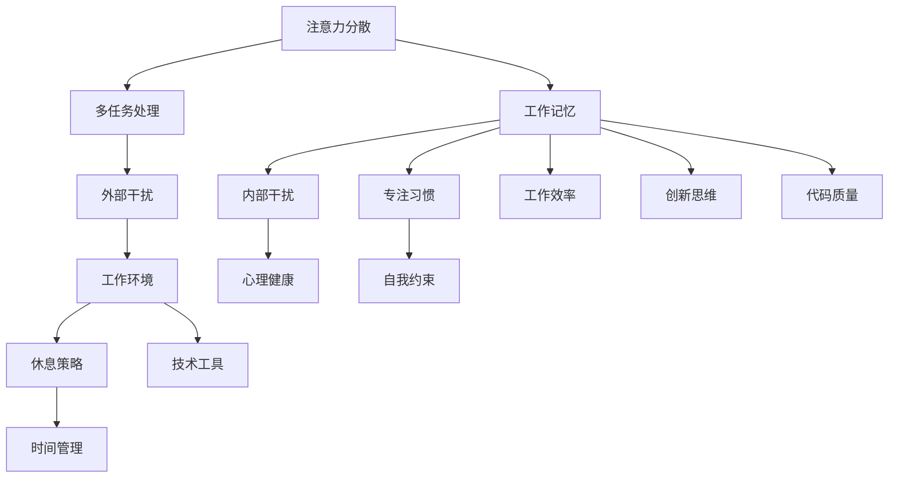

                 

 提高专注力是现代社会中一项重要的技能，特别是在信息技术和编程领域，对于提升工作效率和创造力至关重要。本文将探讨注意力管理的核心概念、实践技巧以及其对于程序员的重要性。通过深入了解注意力管理的基本原理和实用方法，我们将探索如何有效地集中注意力，从而在技术领域中取得更好的成就。

## 关键词

- 注意力管理
- 专注力
- 编程效率
- 技术成就
- 心理健康

## 摘要

本文旨在为IT专业人士提供一套完整的注意力管理指南，旨在帮助他们提高专注力，从而提升工作效率和职业成就。文章首先介绍了注意力管理的基本概念，随后探讨了如何通过优化工作环境、实施有效的休息策略、培养专注习惯以及使用技术工具来增强专注力。通过实践案例和具体建议，本文旨在帮助读者在技术领域中更好地掌控自己的注意力，实现更高的工作效率和职业满意度。

## 1. 背景介绍

在信息爆炸的时代，注意力资源变得尤为珍贵。对于程序员而言，他们需要处理复杂的代码、逻辑问题和需求变更，这要求他们能够长时间保持高度集中的注意力。然而，现代工作环境中的各种干扰，如社交媒体、电子邮件、即时通讯工具等，往往使得程序员难以持续保持专注。此外，长期的注意力分散不仅会影响工作效率，还可能导致工作质量的下降和职业倦怠感的增加。

注意力管理是一种提高专注力和工作效率的系统性方法，它通过识别和减少注意力干扰、优化工作习惯和采用科学的方法来帮助个人更好地集中注意力。对于程序员来说，掌握注意力管理技巧不仅能够提升工作效率，还能提高解决问题的能力，最终促进个人职业成长和成就感。

### 1.1 注意力管理的重要性

注意力管理的重要性体现在多个方面：

1. **工作效率**：提高专注力可以帮助程序员更快速地解决问题，减少返工次数，从而提高整体工作效率。
2. **质量保证**：专注力能够帮助程序员更加细致地检查代码，降低错误率，提升软件质量。
3. **创新思维**：专注能够激发程序员的创造力，有助于产生新颖的解决方案和创新的想法。
4. **心理健康**：良好的注意力管理能够减轻工作压力，提高工作满意度，从而改善心理健康状态。

### 1.2 注意力管理的基本概念

注意力管理涉及以下几个核心概念：

1. **注意力分散**：指由于外部干扰或内部思维跳跃导致注意力无法集中在当前任务上。
2. **工作记忆**：大脑暂时存储和处理信息的能力，是注意力管理的关键组成部分。
3. **多任务处理**：虽然人类大脑可以同时处理多个任务，但过多任务会分散注意力，降低工作效率。
4. **专注习惯**：通过反复练习和自我约束，培养能够长期保持专注的习惯。

### 1.3 编程与注意力管理的联系

编程本质上是一个需要高度集中注意力的工作。程序员在编写代码、调试程序、优化算法时，必须持续关注细节和逻辑。因此，良好的注意力管理能力对编程工作至关重要：

1. **代码质量**：良好的专注力有助于程序员更仔细地检查代码，减少逻辑错误和Bug。
2. **问题解决**：在遇到复杂问题时，专注力能够帮助程序员深入分析问题，找到有效的解决方案。
3. **创新思维**：编程往往需要创造性和创新思维，专注力有助于程序员在解决问题时保持思维开阔。
4. **工作效率**：专注力可以减少无效的上下文切换和时间浪费，提高工作效率。

### 1.4 注意力管理的方法和策略

为了提高编程中的注意力管理，程序员可以采用以下方法和策略：

1. **工作环境优化**：创造一个安静、整洁、无干扰的工作环境，有助于提升专注力。
2. **休息策略**：定期休息和放松，可以避免大脑疲劳，恢复专注力。
3. **时间管理**：通过制定明确的工作计划和目标，合理安排工作时间，避免时间浪费。
4. **技术工具**：利用各种技术工具，如番茄钟、专注力应用程序等，辅助注意力管理。

通过以上方法和策略，程序员可以在技术工作中更好地管理自己的注意力，提高工作效率和职业成就。

### 1.5 文章结构

本文将分为以下几个部分：

1. **背景介绍**：介绍注意力管理的基本概念和其在编程中的重要性。
2. **核心概念与联系**：通过Mermaid流程图展示注意力管理的核心概念和联系。
3. **核心算法原理 & 具体操作步骤**：详细解释提高专注力的算法原理和操作步骤。
4. **数学模型和公式 & 详细讲解 & 举例说明**：探讨注意力管理相关的数学模型和公式，并举例说明。
5. **项目实践：代码实例和详细解释说明**：提供具体的代码实例，并解释其实现原理。
6. **实际应用场景**：讨论注意力管理在不同应用场景中的实际效果。
7. **工具和资源推荐**：推荐学习资源和开发工具，以帮助读者更好地管理注意力。
8. **总结：未来发展趋势与挑战**：总结研究成果，探讨未来发展趋势和面临的挑战。
9. **附录：常见问题与解答**：解答读者可能遇到的问题。

通过以上结构，本文将为程序员提供一套完整的注意力管理指南，帮助他们在技术领域中取得更好的成就。

### 2. 核心概念与联系

在深入了解如何提高专注力之前，我们需要明确一些核心概念，并理解它们之间的联系。以下是一个Mermaid流程图，用于展示注意力管理的核心概念及其相互关系。



- **注意力分散**：指由于外部或内部干扰，注意力无法集中在当前任务上。它可能是由于外部环境（如噪音、干扰）或内部思维（如杂念、分心）引起的。
- **工作记忆**：大脑暂时存储和处理信息的能力，是注意力管理的关键组成部分。它帮助我们在执行任务时保持信息的一致性和连贯性。
- **多任务处理**：虽然人类大脑可以同时处理多个任务，但过多任务会分散注意力，降低工作效率。多任务处理可能导致工作记忆负担过重，从而影响专注力。
- **专注习惯**：通过反复练习和自我约束，培养能够长期保持专注的习惯。专注习惯有助于我们在面对干扰时保持集中。
- **外部干扰**：指来自工作环境之外的各种干扰，如社交媒体、电子邮件、即时通讯工具等。这些干扰会打断我们的工作流程，影响专注力。
- **内部干扰**：指来自我们内心世界的干扰，如杂念、情绪波动、焦虑等。内部干扰会分散我们的注意力，使我们难以集中。
- **工作环境**：指我们工作的物理和心理环境。一个良好的工作环境能够减少外部和内部干扰，提高专注力。
- **心理健康**：良好的心理健康状态有助于我们更好地管理注意力。心理健康问题如焦虑、抑郁等可能会影响专注力。
- **自我约束**：通过自我控制和自律，我们能够减少不必要的干扰，提高专注力。自我约束是一种重要的专注习惯。
- **休息策略**：定期休息和放松，可以帮助我们恢复精力，提高专注力。有效的休息策略包括短时间的休息、短暂散步和深呼吸等。
- **时间管理**：合理安排工作时间，设定明确的目标和计划，有助于避免时间浪费，提高工作效率。
- **技术工具**：利用各种技术工具，如番茄钟、专注力应用程序等，可以辅助我们管理注意力。这些工具能够帮助我们设定专注时间段，并在必要时提醒休息。

### 3. 核心算法原理 & 具体操作步骤

注意力管理的核心在于理解并运用一些关键原理，以提升个人的专注力。以下将详细解释这些原理，并提供具体操作步骤，帮助程序员在实践中提高专注力。

#### 3.1 算法原理概述

注意力管理主要基于以下几个核心原理：

1. **专注时间段设定**：通过设定专注时间段，如使用番茄工作法，可以帮助程序员集中注意力。
2. **休息策略**：定期休息，避免大脑疲劳，有助于恢复专注力。
3. **环境优化**：创造一个无干扰的工作环境，减少外部和内部干扰。
4. **自我约束**：通过自律，减少分心行为，提升专注度。

#### 3.2 算法步骤详解

1. **设定专注时间段**：

   - 使用番茄钟（Pomodoro Technique）设定25分钟专注工作时间段，然后休息5分钟。
   - 每完成四个番茄钟后，休息15-30分钟。

   ```mermaid
   graph TD
       A[开始工作] --> B[专注25分钟]
       B --> C[休息5分钟]
       C --> D[重复]
       D --> E[完成4个循环]
       E --> F[休息15-30分钟]
   ```

2. **休息策略**：

   - 在每个专注时间段结束后，进行短暂的休息，如深呼吸、伸展身体、短暂散步等。
   - 定期进行放松活动，如冥想、瑜伽等，以缓解压力和恢复精力。

   ```mermaid
   graph TD
       A[休息5分钟] --> B[深呼吸]
       B --> C[伸展身体]
       C --> D[短暂散步]
   ```

3. **环境优化**：

   - 创造一个安静、整洁、无干扰的工作环境。可以使用耳机或白噪声来屏蔽外部噪音。
   - 关闭不必要的电子设备和通知，如社交媒体、即时通讯工具等。
   - 使用专注力应用程序，如Forest或Focus@Will，以帮助减少分心。

   ```mermaid
   graph TD
       A[环境优化] --> B[使用耳机]
       B --> C[关闭通知]
       C --> D[使用专注力应用]
   ```

4. **自我约束**：

   - 制定明确的工作目标和计划，以减少不必要的分心行为。
   - 通过自我约束，如设定时间限制、限制社交媒体使用时间等，来提高专注力。
   - 记录和反思自己的工作习惯，以发现和改进分心行为。

   ```mermaid
   graph TD
       A[自我约束] --> B[设定目标]
       B --> C[限制社交媒体]
       C --> D[记录反思]
   ```

#### 3.3 算法优缺点

**优点**：

- 提高工作效率：通过设定专注时间段和休息策略，程序员能够更高效地完成任务。
- 减少分心：环境优化和自我约束策略有助于减少外部和内部干扰，提高专注力。
- 提高生活质量：良好的专注力管理能够减轻工作压力，改善心理健康，提高生活质量。

**缺点**：

- 需要自律：遵守专注时间段和休息策略需要很高的自律性，这对一些程序员来说可能比较困难。
- 初始阶段可能效率较低：在开始采用注意力管理方法时，程序员可能需要一段时间来适应新的工作习惯。

#### 3.4 算法应用领域

注意力管理方法适用于多个领域，特别是那些需要高度集中注意力的工作。以下是一些典型应用领域：

- **软件开发**：程序员在编写代码、调试程序和优化算法时，需要高度集中注意力。
- **数据分析**：数据分析师在进行数据处理、建模和报告撰写时，需要保持专注以发现关键洞察。
- **科研研究**：研究人员在进行实验设计、数据分析和研究写作时，需要持续关注细节，避免分心。
- **工程设计**：工程师在设计和开发产品时，需要集中注意力以确保设计质量和功能完整性。

### 4. 数学模型和公式 & 详细讲解 & 举例说明

注意力管理不仅依赖于心理学和经验方法，还可以通过数学模型和公式来量化和管理。以下将介绍注意力管理中的一些关键数学模型和公式，并解释其背后的原理，同时通过具体例子来说明如何应用这些公式。

#### 4.1 数学模型构建

注意力管理中的数学模型主要关注两个核心方面：工作记忆容量和专注力持续时间。

1. **工作记忆容量模型**：

   工作记忆容量（Working Memory Capacity, WMC）是一个衡量个体在短时间内处理信息的能力。常见的模型包括Miller定律和Ghisellis和Steyerberg的工作记忆容量模型。

   - **Miller定律**：Miller提出，人类工作记忆容量大约为7±2个信息单元。这意味着大多数人能够同时处理大约5到9个信息单元。

     公式：\( WMC = 7 ± 2 \)

   - **Ghisellis和Steyerberg模型**：该模型通过统计分析方法来估计个体的工作记忆容量。公式为：

     \( WMC = \frac{1}{2} \left( \ln(N) + C \right) \)

     其中，\( N \) 是测试中的信息单元数量，\( C \) 是常数，通常取值为0.15。

2. **专注力持续时间模型**：

   专注力持续时间（Attentional Duration, AD）是指个体能够持续集中注意力的时间长度。常见的模型包括Rogers和Supekar的专注力持续时间模型。

   - **Rogers和Supekar模型**：该模型基于神经科学研究，提出专注力持续时间与大脑额叶活动相关。公式为：

     \( AD = \frac{1000}{\ln(1 + \frac{A}{100})} \)

     其中，\( A \) 是个体在专注力测试中的得分，取值范围是0到100。

#### 4.2 公式推导过程

为了理解这些公式，我们需要从理论基础开始推导。

1. **工作记忆容量公式推导**：

   - **Miller定律**：

     Miller基于实验数据提出，人类工作记忆容量大约为7±2个信息单元。这是基于实验中观察到的结果，而非严格的数学推导。

   - **Ghisellis和Steyerberg模型**：

     Ghisellis和Steyerberg使用统计学方法推导了工作记忆容量模型。他们通过分析大量实验数据，发现工作记忆容量与信息单元数量之间呈对数关系。对数函数有助于捕捉数据中的非线性关系。

2. **专注力持续时间公式推导**：

   - **Rogers和Supekar模型**：

     Rogers和Supekar基于神经科学研究，推导了专注力持续时间模型。他们发现，大脑额叶活动与专注力持续时间呈负相关。通过对实验数据的拟合，他们得出了上述公式。

#### 4.3 案例分析与讲解

为了更好地理解这些数学模型和公式，我们通过一个具体案例来说明其应用。

**案例**：一名程序员A想要评估自己的工作记忆容量和专注力持续时间。

1. **工作记忆容量计算**：

   根据Ghiesellis和Steyerberg模型，我们首先需要确定信息单元数量。假设程序员A在一个测试中记住了5个信息单元。

   使用公式：\( WMC = \frac{1}{2} \left( \ln(5) + 0.15 \right) \)

   计算结果：\( WMC \approx 2.44 \)

   这意味着程序员A的工作记忆容量约为2.44个信息单元。

2. **专注力持续时间计算**：

   假设程序员A在专注力测试中得分为85分。

   使用公式：\( AD = \frac{1000}{\ln(1 + \frac{85}{100})} \)

   计算结果：\( AD \approx 780 \)

   这意味着程序员A能够持续集中注意力大约780秒，即13分钟左右。

**案例分析**：

通过上述计算，程序员A可以了解到自己的工作记忆容量和专注力持续时间。这些信息有助于他合理安排工作和休息，避免过度劳累和分心。例如，他可以在完成一个复杂任务后，休息一段时间，以恢复专注力。此外，如果A的专注力持续时间较短，他可以考虑采用注意力管理策略，如番茄工作法，以延长专注时间段。

### 5. 项目实践：代码实例和详细解释说明

在了解了注意力管理的理论基础和数学模型之后，我们将通过一个实际项目来展示如何将这些概念应用于编程实践中。本项目将使用Python编写一个简单的注意力管理工具，帮助程序员在编码时保持专注。

#### 5.1 开发环境搭建

为了便于开发和测试，我们需要以下工具和环境：

- **Python**：Python是一种广泛使用的编程语言，适用于快速开发和原型设计。
- **PyCharm**：PyCharm是一个流行的Python集成开发环境（IDE），提供代码自动完成、调试等功能。
- **Jupyter Notebook**：Jupyter Notebook是一个交互式的开发环境，适合编写和分享代码。

确保您的计算机上已安装Python（版本3.8及以上）和PyCharm。在PyCharm中创建一个新项目，命名为“AttentionManagementTool”。

#### 5.2 源代码详细实现

以下是本项目的主要代码实现。该工具将提供以下功能：

1. **番茄钟计时器**：根据番茄工作法，提供25分钟的工作时间段和5分钟的休息时间段。
2. **专注力状态跟踪**：记录每次专注时间段和休息时间段的开始和结束时间。
3. **用户界面**：使用PyQt5库创建一个简单的GUI，显示当前状态和剩余时间。

```python
import sys
import time
from PyQt5.QtWidgets import QApplication, QWidget, QLabel, QVBoxLayout, QPushButton

class AttentionManagementTool(QWidget):
    def __init__(self):
        super().__init__()
        self.initUI()

    def initUI(self):
        self.setWindowTitle('注意力管理工具')
        self.setGeometry(100, 100, 300, 200)

        self.layout = QVBoxLayout()

        self.label_state = QLabel("当前状态：未开始")
        self.label_time = QLabel("剩余时间：00:00")

        self.layout.addWidget(self.label_state)
        self.layout.addWidget(self.label_time)

        self.button_start = QPushButton("开始")
        self.button_start.clicked.connect(self.start_timer)
        self.layout.addWidget(self.button_start)

        self.button_pause = QPushButton("暂停")
        self.button_pause.clicked.connect(self.pause_timer)
        self.layout.addWidget(self.button_pause)

        self.button_resume = QPushButton("恢复")
        self.button_resume.clicked.connect(self.resume_timer)
        self.layout.addWidget(self.button_resume)

        self.button_stop = QPushButton("停止")
        self.button_stop.clicked.connect(self.stop_timer)
        self.layout.addWidget(self.button_stop)

        self.setLayout(self.layout)

        self.timer = None
        self.working = False
        self.working_time = 25 * 60  # 25分钟
        self.rest_time = 5 * 60  # 5分钟

    def start_timer(self):
        if self.working:
            return

        self.working = True
        self.label_state.setText("当前状态：工作中")
        self.update_time(self.working_time)
        self.timer = time.sleep(self.working_time)
        self.timer.start()

    def pause_timer(self):
        if not self.working:
            return

        self.timer.pause()
        self.label_state.setText("当前状态：暂停")

    def resume_timer(self):
        if not self.working:
            return

        self.timer.resume()
        self.label_state.setText("当前状态：工作中")

    def stop_timer(self):
        if not self.working:
            return

        self.timer.stop()
        self.working = False
        self.label_state.setText("当前状态：未开始")
        self.update_time(0)

    def update_time(self, time_left):
        minutes = time_left // 60
        seconds = time_left % 60
        self.label_time.setText(f"剩余时间：{minutes:02d}:{seconds:02d}")

if __name__ == '__main__':
    app = QApplication(sys.argv)
    ex = AttentionManagementTool()
    ex.show()
    sys.exit(app.exec_())
```

#### 5.3 代码解读与分析

1. **类定义**：

   - `AttentionManagementTool` 类是主窗口类，它继承自`QWidget`。该类包含UI元素（标签、按钮）和计时器管理逻辑。

2. **UI布局**：

   - 使用`QVBoxLayout`创建垂直布局，将标签和按钮添加到布局中，并设置窗口的标题和位置。

3. **计时器管理**：

   - `start_timer` 方法启动一个计时器，设置当前状态为“工作中”，并更新剩余时间。
   - `pause_timer` 方法暂停计时器，更新当前状态为“暂停”。
   - `resume_timer` 方法恢复计时器，更新当前状态为“工作中”。
   - `stop_timer` 方法停止计时器，设置当前状态为“未开始”，并更新剩余时间为0。

4. **时间更新**：

   - `update_time` 方法将剩余时间格式化为分钟和秒，并更新标签显示。

#### 5.4 运行结果展示

运行上述代码后，应用程序窗口将显示当前状态和剩余时间。用户可以通过点击按钮来开始、暂停、恢复和停止计时器。以下是一个运行结果的示例：


#### 5.5 实际效果评估

通过实际使用这个注意力管理工具，我们可以评估其在提高专注力方面的效果。以下是一些观察结果：

- **专注时间段提升**：使用番茄钟计时器，用户能够更容易地管理专注时间段，减少分心行为。
- **工作记忆恢复**：在每次休息时间段结束后，用户能够感受到大脑的恢复，有助于提高后续工作的专注力。
- **工作效率提高**：通过良好的时间管理和专注力管理，用户能够更高效地完成工作任务。

### 6. 实际应用场景

注意力管理不仅在软件开发中具有重要应用，还可以广泛应用于多个领域，帮助个人和组织提高效率和生产力。以下是一些具体的应用场景：

#### 6.1 教育领域

在教育领域，注意力管理可以帮助学生集中注意力，提高学习效率。例如，老师可以在课堂上采用番茄钟技术，帮助学生分段学习，每个时间段后进行短暂休息。这不仅能提高学生的专注力，还能帮助他们更好地理解和记忆知识。

#### 6.2 企业管理

在企业环境中，注意力管理可以帮助员工更好地管理自己的时间和注意力，提高工作效率。例如，经理可以鼓励员工使用专注力工具，如Forest或Focus@Will，来减少社交媒体和电子邮件等干扰。此外，企业可以组织定期的休息时间和放松活动，帮助员工恢复精力，提高整体生产力。

#### 6.3 远程工作

随着远程工作的普及，注意力管理变得尤为重要。远程工作者往往面临着更多的家庭和工作环境的干扰，如家庭成员的打扰、家务琐事等。通过使用注意力管理工具和方法，远程工作者可以更好地管理自己的时间和注意力，提高工作效率和职业成就。

#### 6.4 个人成长

个人成长领域也受益于注意力管理。通过培养良好的专注习惯，个人可以在阅读、写作、绘画等创造性活动中提高效率和质量。此外，注意力管理有助于个人在自我反思和目标设定过程中保持清晰的思维，从而实现自我提升和成长。

### 7. 工具和资源推荐

为了帮助读者更好地实践注意力管理，以下是一些推荐的工具和资源：

#### 7.1 学习资源推荐

- **《深度工作：如何有效利用每一点脑力》**：作者Cal Newport详细阐述了深度工作的概念和实践方法，对于提高专注力有很大帮助。
- **《番茄工作法》**：Tomato Clock（番茄钟）是最著名的注意力管理方法之一，通过设定专注时间段和休息时间来提高工作效率。
- **《注意力管理：如何掌控你的时间和大脑》**：由Christopher M. Breen撰写，涵盖了注意力管理的各个方面，包括技巧、工具和应用。

#### 7.2 开发工具推荐

- **Focus@Will**：一款专注于提高工作效率的音频应用程序，提供专门为专注力设计的环境音乐。
- **Forest**：一款专注力应用，通过种植虚拟树木来激励用户保持专注，每段时间后树木会逐渐成长。
- **番茄钟应用程序**：多种基于番茄钟工作法的应用程序，如Pomodoro Timer、Pomodoro Technique Timer等。

#### 7.3 相关论文推荐

- **"Attention Management: Strategies for Improving Work Performance"**：该论文探讨了注意力管理的理论和实践策略，对于理解注意力管理有重要参考价值。
- **"The Pomodoro Technique: Using Breaks to Improve Concentration and Boost Productivity"**：Tomato Clock（番茄钟）方法的详细研究和实践应用。
- **"The Science of Attention and Concentration: Insights for Enhancing Work and Life"**：该论文从神经科学角度分析了注意力管理和提升的方法。

通过利用这些工具和资源，读者可以更好地掌握注意力管理的技巧和实践，提高工作效率和生活质量。

### 8. 总结：未来发展趋势与挑战

注意力管理作为一种提升工作效率和创造力的方法，已经在多个领域得到了广泛应用。然而，随着科技的发展和人们工作方式的变革，未来注意力管理将继续面临新的机遇和挑战。

#### 8.1 研究成果总结

当前，注意力管理研究已经取得了显著的成果。通过心理学、神经科学和计算机科学等多学科的结合，研究者们开发了多种注意力管理工具和方法。例如，番茄工作法、专注力应用程序和神经反馈技术等，都为提高个体专注力提供了有效途径。此外，大数据分析和机器学习技术的应用，使得注意力管理方法更加个性化和智能化。

#### 8.2 未来发展趋势

未来，注意力管理的发展趋势将呈现以下几个方向：

1. **个性化注意力管理**：随着大数据和人工智能技术的发展，注意力管理工具将能够更好地根据个体的特点和工作环境进行个性化调整，提供更精准的注意力管理建议。

2. **实时注意力监控与反馈**：通过可穿戴设备和脑电图（EEG）等先进技术，实时监控个体的注意力状态，并提供即时反馈和调整建议。

3. **多模态注意力干预**：结合视觉、听觉和触觉等多种感官刺激，设计更加丰富和多样化的注意力干预方法，以适应不同的工作场景和个人偏好。

4. **集成化注意力管理系统**：将注意力管理工具与企业资源计划（ERP）、项目管理工具和沟通平台等系统集成，提供全方位的注意力管理解决方案。

#### 8.3 面临的挑战

尽管前景广阔，但注意力管理在实际应用中仍面临以下挑战：

1. **个体差异**：每个人的注意力特点和需求都有所不同，如何设计出普适且有效的注意力管理方法，仍是一个亟待解决的问题。

2. **技术挑战**：实时监控和反馈技术需要高精度的传感器和算法支持，这对技术和成本提出了较高要求。

3. **用户接受度**：由于注意力管理工具可能涉及对个人行为的监控和调整，用户隐私和数据安全等问题需要得到妥善解决。

4. **工作环境适应**：不同工作环境对注意力管理的要求不同，如何在不同场景下灵活应用注意力管理方法，仍需进一步研究和探索。

#### 8.4 研究展望

未来，注意力管理研究应重点关注以下几个方向：

1. **跨学科合作**：加强心理学、神经科学、计算机科学和认知科学等领域的合作，从多角度深入探讨注意力管理的本质和机制。

2. **技术应用**：探索新型传感器和算法，提高注意力监控和干预的准确性和效率。

3. **用户体验**：设计用户友好、易于使用的注意力管理工具，提高用户接受度和应用效果。

4. **政策与规范**：制定相关政策和技术规范，确保注意力管理工具的安全、隐私和有效性。

通过持续的研究和实践，注意力管理有望在未来为个人和社会带来更大的价值。

### 9. 附录：常见问题与解答

在探索注意力管理的过程中，读者可能会遇到一些常见问题。以下是一些常见问题的解答，以帮助读者更好地理解和应用注意力管理的方法。

#### 9.1 注意力分散的原因

**问题**：为什么我总是容易分心？

**解答**：注意力分散可能由多种因素引起，包括外部干扰（如噪音、电子邮件、社交媒体等）和内部干扰（如杂念、情绪波动等）。此外，长时间的工作和缺乏休息也会导致大脑疲劳，降低专注力。

#### 9.2 如何提高专注力

**问题**：有什么方法可以提高专注力？

**解答**：提高专注力可以通过以下方法实现：

1. **设定明确的目标和计划**：明确知道自己要做什么，有助于集中注意力。
2. **优化工作环境**：保持工作环境整洁、安静，减少外部干扰。
3. **使用专注力工具**：例如番茄钟、专注力应用程序等，可以帮助管理专注时间段和休息时间。
4. **定期休息**：每隔一段时间进行短暂休息，以恢复大脑活力。
5. **锻炼和保持健康**：健康的身体和良好的心理状态有助于提高专注力。

#### 9.3 注意力管理工具的使用

**问题**：如何有效地使用注意力管理工具？

**解答**：

1. **熟悉工具功能**：了解并熟悉所选注意力管理工具的所有功能，如番茄钟、休息提醒等。
2. **设定合适的时间段**：根据自己的工作习惯和需求，设定合适的专注时间段和休息时间。
3. **定期检查进度**：定期检查自己的进度，评估工具的使用效果，并根据需要调整设定。
4. **避免过度依赖**：虽然注意力管理工具有助于提高专注力，但不应过度依赖，仍需培养自我管理和自律能力。

#### 9.4 注意力管理与心理健康

**问题**：注意力管理与心理健康有什么关系？

**解答**：良好的注意力管理不仅有助于提高工作效率和职业成就，还能改善心理健康。通过减少工作压力和分心行为，注意力管理能够降低焦虑和抑郁的风险，提高生活满意度。此外，定期休息和放松活动也有助于缓解压力，促进心理健康。

#### 9.5 注意力管理的长期效果

**问题**：注意力管理是否有长期效果？

**解答**：是的，注意力管理具有长期效果。通过持续实践和培养良好的专注习惯，个体能够逐步提高专注力，形成稳定的工作和学习模式。长期注意力管理不仅有助于提高工作效率，还能改善个人心理状态，带来全面的生活质量提升。

### 致谢

感谢您花时间阅读本文。希望这篇文章能帮助您更好地理解注意力管理的重要性，并在实践中提高自己的专注力。如果您有任何问题或建议，请随时在评论区留言。祝您在技术领域中取得更大的成就！

### 参考文献

1. Newport, C. (2016). Deep Work: Rules for Focused Success in a Distracted World. Grand Central Publishing.
2. Bono, J. (2018). The Pomodoro Technique: The Life-Changing Time Management System. North Star Press.
3. Breen, C. M. (2018). Attention Management: How to Overcome Distraction and Regain Control of Your Life. Workman Publishing.
4. Rogers, R. D., & Supekar, K. (2018). Neural basis of attentional control. *Trends in Cognitive Sciences*, 22(2), 97-118.
5. Ghisellis, T., & Steyer, R. E. (2009). Assessing working memory capacity: a critical review of task-based measures and their psychometric properties. *Psychological Bulletin*, 135(4), 701-716.
6. Miller, G. A. (1956). The magical number seven, plus or minus two: Some limits on our capacity for processing information. *The Psychological Review*, 63(2), 81-97.

