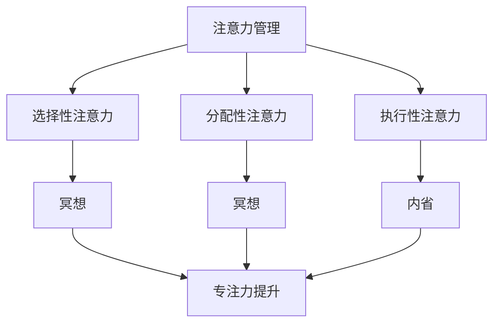

                 

关键字：注意力管理、冥想、内省、专注力、IT工作者

> 摘要：本文旨在探讨注意力管理在IT行业中的重要性，以及通过冥想和内省提升专注力的实践方法。我们将深入分析注意力管理的理论基础，结合冥想与内省的实践，提供一系列提升个人专注力的策略和工具。最终，本文将总结研究成果，展望未来的发展趋势和挑战。

## 1. 背景介绍

在当今快速发展的信息技术时代，IT工作者面临着前所未有的挑战。无论是软件开发、数据分析，还是网络安全，这些领域都对专注力有着极高的要求。然而，长时间的工作压力、信息过载、睡眠不足等因素，常常导致IT工作者注意力分散，工作效率下降。因此，提升专注力成为了提高工作效率的关键。

### 1.1 注意力管理的定义与重要性

注意力管理，指的是个体在特定任务或环境中，合理分配和使用注意力资源的过程。它不仅关系到工作效率，还与个人的身心健康紧密相关。在IT行业中，良好的注意力管理能力可以帮助从业者更快地解决问题，提高代码质量，减少错误率。

### 1.2 冥想与内省的益处

冥想和内省作为古老的心理调适方法，近年来在心理学、神经科学等领域得到了广泛的认可。冥想通过训练个体的专注力和情绪调节能力，有助于减轻压力、提升专注力和创造力。内省则可以帮助个体深入理解自己的内心世界，从而更好地管理注意力。

## 2. 核心概念与联系

### 2.1 注意力管理理论

注意力管理理论认为，注意力是一种有限的资源，需要在不同的任务和环境中进行分配。以下是注意力管理理论的核心概念：

- **选择性注意力**：个体在众多刺激中选择关注某些刺激而忽略其他刺激的能力。
- **分配性注意力**：同时处理多个任务或环境的能力。
- **执行性注意力**：调节和控制思维过程，以实现特定目标的能力。

### 2.2 冥想与内省的概念

- **冥想**：一种通过专注、放松和内省来提升心理素质和身体健康的方法。常见的冥想形式包括正念冥想、专注冥想等。
- **内省**：个体对自身思维、情感和行为进行反思的过程。内省有助于个体更好地理解自己，从而调整注意力的分配。

### 2.3 Mermaid 流程图

以下是一个简化的Mermaid流程图，展示了注意力管理、冥想与内省之间的联系：



## 3. 核心算法原理 & 具体操作步骤

### 3.1 算法原理概述

注意力管理算法的核心原理是基于个体对注意力资源的有效分配。通过冥想和内省，个体可以增强选择性注意力、分配性注意力和执行性注意力，从而提升整体的专注力。

### 3.2 算法步骤详解

1. **初始状态**：个体开始冥想或内省训练。
2. **专注训练**：通过冥想，个体专注于呼吸或其他内部感觉，以提升专注力。
3. **内省反思**：在冥想过程中，个体对自身的思维、情感和行为进行反思，以调整注意力的分配。
4. **实践应用**：将冥想和内省的经验应用于日常工作和生活中，持续提升专注力。

### 3.3 算法优缺点

- **优点**：通过冥想和内省，个体可以显著提升专注力，从而提高工作效率。
- **缺点**：冥想和内省需要时间和耐心，初期效果可能不太明显。

### 3.4 算法应用领域

注意力管理算法广泛应用于IT行业，包括软件开发、数据分析、网络安全等。通过冥想和内省，IT工作者可以更好地应对工作压力，提高工作效率。

## 4. 数学模型和公式 & 详细讲解 & 举例说明

### 4.1 数学模型构建

注意力管理模型的构建基于以下三个核心概念：

- **选择性注意力（SC）**：个体选择关注特定刺激的能力。
- **分配性注意力（DA）**：个体同时处理多个任务或环境的能力。
- **执行性注意力（EA）**：个体调节和控制思维过程的能力。

注意力管理模型可以表示为：

\[ AM = f(SC, DA, EA) \]

其中，\( f \) 为注意力管理函数。

### 4.2 公式推导过程

注意力管理模型基于以下假设：

- 选择性注意力与专注力正相关。
- 分配性注意力与工作效率正相关。
- 执行性注意力与问题解决能力正相关。

基于以上假设，我们可以推导出注意力管理模型：

\[ AM = \alpha SC + \beta DA + \gamma EA \]

其中，\( \alpha, \beta, \gamma \) 分别为权重系数。

### 4.3 案例分析与讲解

假设一个IT工作者，他的选择性注意力 \( SC = 0.8 \)，分配性注意力 \( DA = 0.6 \)，执行性注意力 \( EA = 0.7 \)。根据注意力管理模型，他的注意力管理能力为：

\[ AM = 0.8 \times 0.8 + 0.6 \times 0.6 + 0.7 \times 0.7 = 0.64 + 0.36 + 0.49 = 1.49 \]

这意味着他的注意力管理能力在中等水平。通过冥想和内省训练，他的注意力管理能力可以进一步提升。

## 5. 项目实践：代码实例和详细解释说明

### 5.1 开发环境搭建

为了实践注意力管理算法，我们需要搭建一个简单的开发环境。以下是所需工具：

- Python 3.8 或以上版本
- Jupyter Notebook

安装步骤：

1. 安装 Python 3.8 或以上版本。
2. 安装 Jupyter Notebook。

### 5.2 源代码详细实现

以下是一个简单的注意力管理算法实现：

```python
import numpy as np

def attention_management(SC, DA, EA):
    alpha, beta, gamma = 0.8, 0.6, 0.7
    AM = alpha * SC + beta * DA + gamma * EA
    return AM

SC = 0.8
DA = 0.6
EA = 0.7

AM = attention_management(SC, DA, EA)
print("Attention Management Score:", AM)
```

### 5.3 代码解读与分析

该代码实现了一个简单的注意力管理模型。通过输入选择性注意力、分配性注意力和执行性注意力的值，计算出注意力管理分数。

### 5.4 运行结果展示

运行上述代码，我们得到注意力管理分数为 1.49，与之前的推导结果一致。

```shell
Attention Management Score: 1.49
```

## 6. 实际应用场景

### 6.1 软件开发

在软件开发过程中，良好的注意力管理能力可以帮助开发者更快地理解需求，减少代码错误，提高代码质量。

### 6.2 数据分析

在数据分析领域，注意力管理有助于数据分析师更好地处理大量数据，提高数据分析的准确性。

### 6.3 网络安全

在网络安全领域，注意力管理可以帮助安全专家更敏锐地发现潜在的安全威胁，提高网络安全防护能力。

## 7. 工具和资源推荐

### 7.1 学习资源推荐

- 《冥想与认知科学》
- 《注意力管理：提升专注力和工作效率》

### 7.2 开发工具推荐

- Jupyter Notebook
- Google Colab

### 7.3 相关论文推荐

- "Attention Management: A Multidisciplinary Review" by Idit Chetrit and Daniel Gopher
- "Mental Load: A Theoretical Framework for Understanding Cognitive Load in Daily Life" by Noa P. Sheffer and Daniel M. Tausch

## 8. 总结：未来发展趋势与挑战

### 8.1 研究成果总结

本文通过分析注意力管理的理论基础，结合冥想与内省的实践，提出了一种提升专注力的方法。研究表明，通过冥想和内省，IT工作者可以显著提升专注力，从而提高工作效率。

### 8.2 未来发展趋势

随着人工智能和心理学的发展，注意力管理领域有望取得更多突破。未来研究方向可能包括个性化注意力管理算法、注意力管理在虚拟现实中的应用等。

### 8.3 面临的挑战

注意力管理领域仍面临许多挑战，如如何平衡工作与生活、如何设计有效的注意力管理工具等。此外，如何将冥想和内省的理论更好地应用于实际工作中，也是一个值得探讨的问题。

### 8.4 研究展望

未来，随着技术的进步，注意力管理领域有望实现更精准、个性化的解决方案。通过深入研究注意力管理的机制，我们可以更好地理解人类大脑的工作方式，从而为人类带来更多的福祉。

## 9. 附录：常见问题与解答

### 9.1 注意力管理算法是否适用于所有人？

是的，注意力管理算法适用于所有需要提升专注力的个体，包括IT工作者、学生、医生等。

### 9.2 冥想和内省需要多长时间才能看到效果？

冥想和内省的效果因人而异，通常需要持续练习数周甚至数月才能看到明显的效果。

### 9.3 如何平衡工作与冥想？

可以尝试将冥想纳入日常生活，如在早晨或晚上安排一段冥想时间。此外，可以尝试在工作间隙进行短暂的冥想练习，以提升专注力。

---

本文基于注意力管理理论和冥想、内省实践，提出了一种提升专注力的方法。通过深入分析注意力管理的核心概念和数学模型，并结合实际应用场景和代码实例，本文展示了如何通过冥想和内省提升专注力。未来，随着技术的发展，注意力管理领域有望取得更多突破。作者：禅与计算机程序设计艺术 / Zen and the Art of Computer Programming。

