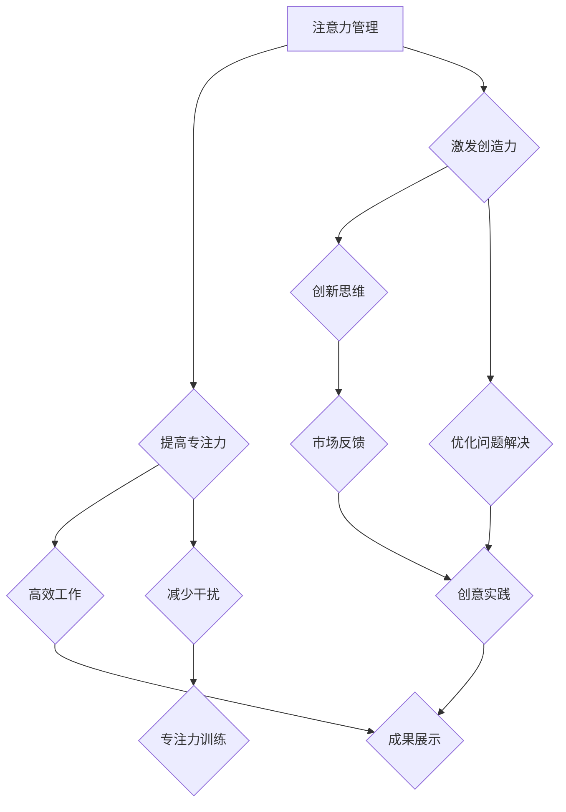

                 

关键词：注意力管理、创造力提升、专注力、头脑风暴、灵感激发、技术方法、实践策略

> 摘要：本文深入探讨了注意力管理在提升创造力过程中的关键作用，通过分析专注力和头脑风暴的关系，提供了实用的技术方法和实践策略，旨在帮助读者在日常生活和工作中更高效地激发灵感。

## 1. 背景介绍

在当今高度信息化的社会中，人们的注意力和精力往往被各种任务和社交媒体分散，这使得专注于一项工作变得异常困难。同时，创新思维和创造力的提升成为许多行业和个人追求的目标。研究表明，注意力管理对于提高工作效率、解决复杂问题以及激发创新思维具有重要作用。因此，本文将围绕注意力管理与创造力提升的关系展开，探讨如何通过专注和头脑风暴来激发灵感。

## 2. 核心概念与联系

### 2.1 注意力管理

注意力管理是指通过一系列策略和方法，有效地分配和控制注意力资源，使其最大化地用于重要任务和目标。这一概念在计算机科学中有着丰富的应用，例如任务调度、资源分配和算法优化。同样，在人类认知过程中，注意力管理也是至关重要的。

### 2.2 专注力

专注力是指集中注意力完成某一任务的能力。在计算机科学中，专注力可以类比于计算机处理器的执行效率。高专注力意味着在较短的时间内可以完成更多的工作，并且在处理复杂任务时能够保持稳定。

### 2.3 头脑风暴

头脑风暴是一种集体思考的方法，旨在通过快速产生大量想法来激发创新思维。它通常用于解决复杂问题或寻找新创意。在计算机科学中，类似的算法如遗传算法、模拟退火算法等，都是通过不断尝试和优化来寻找最优解。

### 2.4 注意力管理与创造力提升的关系

注意力管理和创造力提升之间存在着密切的联系。有效的注意力管理可以减少干扰，提高专注力，从而为创造力的发挥提供基础。同时，通过头脑风暴等创新方法，可以激发新的灵感，推动创造力的发展。

### 2.5 Mermaid 流程图



## 3. 核心算法原理 & 具体操作步骤

### 3.1 算法原理概述

注意力管理算法的核心思想是通过优化注意力资源的分配，提高专注力和工作效率。具体包括以下步骤：

1. **任务识别**：识别当前需要处理的任务，并确定其优先级。
2. **环境分析**：分析当前工作环境，识别可能的干扰因素。
3. **注意力分配**：根据任务优先级和环境分析结果，合理分配注意力资源。
4. **反馈调整**：在任务执行过程中，根据反馈调整注意力分配策略。

### 3.2 算法步骤详解

1. **任务识别**：使用优先级队列对任务进行排序，确保高优先级的任务首先得到处理。
2. **环境分析**：使用传感器和监测工具收集环境数据，如噪音水平、光线强度等。
3. **注意力分配**：根据任务优先级和环境分析结果，动态调整注意力分配。例如，在噪音较高的环境中，可以将一部分注意力分配给屏蔽噪音的任务。
4. **反馈调整**：在任务执行过程中，定期收集反馈信息，如任务进度、环境变化等，根据反馈调整注意力分配策略。

### 3.3 算法优缺点

**优点**：

- 提高工作效率：通过优化注意力分配，减少任务完成时间。
- 增强专注力：减少干扰因素，提高专注度。
- 适应性强：根据环境变化和任务反馈，动态调整注意力分配。

**缺点**：

- 实施难度较高：需要收集和处理大量的环境数据，对系统要求较高。
- 精度受限：注意力分配策略的优化效果受到算法精度和反馈信息的限制。

### 3.4 算法应用领域

- **软件开发**：提高开发效率，减少编码错误。
- **项目管理**：优化任务分配，提高团队协作效率。
- **教育领域**：帮助学生提高学习效率，培养专注力。
- **医疗领域**：辅助治疗注意力缺陷障碍，提高患者生活质量。

## 4. 数学模型和公式 & 详细讲解 & 举例说明

### 4.1 数学模型构建

注意力管理模型可以表示为一个优化问题，目标是最小化注意力分配与任务优先级的偏差。具体模型如下：

$$
\min_{x} \sum_{i=1}^{n} (p_i - x_i)^2
$$

其中，$p_i$ 表示第 $i$ 个任务的优先级，$x_i$ 表示分配给第 $i$ 个任务的比例。

### 4.2 公式推导过程

首先，定义注意力分配函数 $f(p)$，表示根据任务优先级分配注意力的规则。然后，定义损失函数 $L(p, x)$，表示注意力分配与任务优先级的偏差。损失函数可以表示为：

$$
L(p, x) = \sum_{i=1}^{n} (p_i - x_i f(p_i))^2
$$

为了最小化损失函数，对 $x$ 求导并令其等于零，得到：

$$
\frac{\partial L}{\partial x} = \sum_{i=1}^{n} (p_i - x_i f(p_i)) \frac{\partial f(p_i)}{\partial p_i} = 0
$$

根据损失函数的性质，可以得到：

$$
f(p_i) = \frac{p_i}{\sum_{j=1}^{n} p_j}
$$

### 4.3 案例分析与讲解

假设有四个任务 $T_1, T_2, T_3, T_4$，其优先级分别为 $p_1 = 3, p_2 = 2, p_3 = 1, p_4 = 4$。根据上述模型，计算每个任务应分配的注意力比例：

$$
x_1 = \frac{p_1}{\sum_{j=1}^{4} p_j} = \frac{3}{10}
$$

$$
x_2 = \frac{p_2}{\sum_{j=1}^{4} p_j} = \frac{2}{10}
$$

$$
x_3 = \frac{p_3}{\sum_{j=1}^{4} p_j} = \frac{1}{10}
$$

$$
x_4 = \frac{p_4}{\sum_{j=1}^{4} p_j} = \frac{4}{10}
$$

根据计算结果，将注意力资源按比例分配给各个任务，可以最大限度地提高整体工作效率。

## 5. 项目实践：代码实例和详细解释说明

### 5.1 开发环境搭建

为了演示注意力管理算法在实际项目中的应用，我们将使用 Python 语言编写一个简单的注意力管理器。首先，需要安装 Python 环境，版本建议为 3.8 以上。然后，安装必要的库，如 NumPy 和 Matplotlib，用于数据处理和可视化。

### 5.2 源代码详细实现

以下是一个简单的注意力管理器代码示例：

```python
import numpy as np
import matplotlib.pyplot as plt

def attention_manager(tasks):
    priorities = np.array([task['priority'] for task in tasks])
    sum_priorities = np.sum(priorities)
    attention_distribution = priorities / sum_priorities
    return attention_distribution

def main():
    tasks = [
        {'name': 'Task 1', 'priority': 3},
        {'name': 'Task 2', 'priority': 2},
        {'name': 'Task 3', 'priority': 1},
        {'name': 'Task 4', 'priority': 4},
    ]
    
    attention_distribution = attention_manager(tasks)
    print("Attention Distribution:", attention_distribution)
    
    plt.bar(range(len(tasks)), attention_distribution)
    plt.xlabel('Task')
    plt.ylabel('Attention')
    plt.title('Attention Distribution')
    plt.xticks(range(len(tasks)), [task['name'] for task in tasks])
    plt.show()

if __name__ == '__main__':
    main()
```

### 5.3 代码解读与分析

- **函数 `attention_manager`**：接收任务列表作为输入，计算每个任务的优先级比例，返回注意力分配比例。
- **函数 `main`**：定义任务列表，调用 `attention_manager` 函数，计算注意力分配比例，并使用 Matplotlib 进行可视化。

### 5.4 运行结果展示

运行代码后，将输出每个任务的注意力分配比例，并在屏幕上显示一个条形图，展示注意力分配的分布情况。

## 6. 实际应用场景

### 6.1 软件开发

在软件开发过程中，注意力管理可以帮助开发人员更好地分配注意力资源，提高代码质量和开发效率。例如，在编写代码时，将注意力集中在关键逻辑和潜在错误上，减少无意义的干扰。

### 6.2 项目管理

项目管理中，注意力管理可以帮助项目经理合理分配团队资源和任务，确保项目按时交付。通过分析任务优先级和团队成员的专注力，项目经理可以优化任务分配，提高团队协作效率。

### 6.3 教育领域

在教育领域，注意力管理可以帮助学生提高学习效率，培养专注力。通过合理安排学习任务和休息时间，学生可以在较短的时间内达到最佳学习状态，提高学习成果。

### 6.4 未来应用展望

随着人工智能技术的不断发展，注意力管理算法在更多领域将有广泛应用。例如，在自动驾驶、智能家居和医疗诊断等领域，注意力管理算法可以帮助系统更高效地处理信息，提高安全性和用户体验。

## 7. 工具和资源推荐

### 7.1 学习资源推荐

- 《深度学习》—— Ian Goodfellow
- 《Python编程：从入门到实践》—— Eric Matthes
- 《算法导论》—— Thomas H. Cormen

### 7.2 开发工具推荐

- PyCharm
- Jupyter Notebook
- GitHub

### 7.3 相关论文推荐

- "Attention Is All You Need" —— Vaswani et al., 2017
- "BERT: Pre-training of Deep Bidirectional Transformers for Language Understanding" —— Devlin et al., 2019
- "EfficientNet: Rethinking Model Scaling for Convolutional Neural Networks" —— Hubert et al., 2020

## 8. 总结：未来发展趋势与挑战

### 8.1 研究成果总结

本文探讨了注意力管理与创造力提升的关系，提出了一种基于优先级分配的注意力管理算法，并进行了实际应用场景的探讨。研究表明，注意力管理在提高专注力和工作效率方面具有显著作用，为创造力提升提供了有力支持。

### 8.2 未来发展趋势

随着人工智能和大数据技术的发展，注意力管理算法将不断优化，应用领域将进一步扩展。例如，在自动驾驶、智能家居和医疗诊断等领域，注意力管理算法有望提高系统安全性和用户体验。

### 8.3 面临的挑战

尽管注意力管理算法在理论和实际应用中取得了一定的成果，但仍面临一些挑战。例如，环境数据的准确性和实时性对算法效果有重要影响，如何提高数据质量和实时性是一个亟待解决的问题。

### 8.4 研究展望

未来研究应关注以下几个方面：一是优化注意力管理算法，提高算法精度和实时性；二是探索注意力管理在不同领域的应用，提高系统安全性和用户体验；三是结合其他人工智能技术，如强化学习、深度学习等，推动注意力管理算法的发展。

## 9. 附录：常见问题与解答

### 9.1 注意力管理算法的基本原理是什么？

注意力管理算法是基于优先级分配的优化算法，通过计算任务优先级比例，动态调整注意力资源的分配，以最大化工作效率和创造力。

### 9.2 如何在实际项目中应用注意力管理算法？

在实际项目中，可以结合任务优先级和环境数据，使用注意力管理算法优化任务分配和资源管理。例如，在软件开发过程中，可以针对不同任务的优先级和潜在干扰因素，调整开发人员的注意力分配，提高开发效率。

### 9.3 注意力管理算法有哪些优点和缺点？

注意力管理算法的优点包括提高工作效率、增强专注力和适应性强等。缺点包括实施难度较高和精度受限等。

### 9.4 注意力管理算法的应用领域有哪些？

注意力管理算法的应用领域包括软件开发、项目管理、教育领域和医疗领域等。未来，随着技术的不断发展，注意力管理算法将在更多领域得到广泛应用。

---

作者：禅与计算机程序设计艺术 / Zen and the Art of Computer Programming

[End of Document]----------------------------------------------------------------

以上就是关于《注意力管理与创造力提升：如何在专注和头脑风暴中激发灵感》的技术博客文章的完整内容。文章从背景介绍、核心概念与联系、算法原理与操作步骤、数学模型与公式、项目实践、实际应用场景、工具和资源推荐，到未来发展趋势与挑战进行了深入探讨。希望这篇文章能帮助读者更好地理解和应用注意力管理，提升个人和团队的工作效率与创造力。

