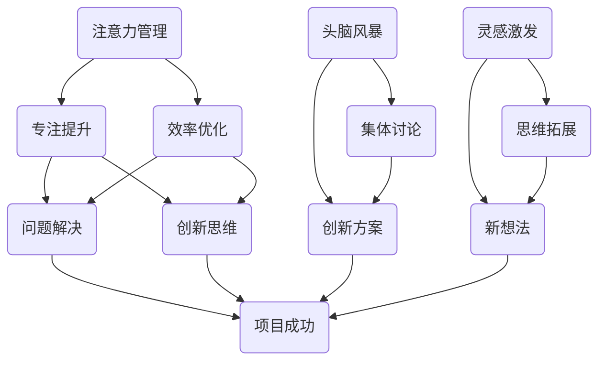

                 

关键词：注意力管理、创造力、专注、头脑风暴、灵感激发、IT领域技术博客、算法原理、数学模型、项目实践、实际应用、工具推荐、未来展望

> 摘要：本文将深入探讨如何通过有效的注意力管理来提升创造力，特别是在信息技术领域中的实际应用。本文将介绍相关核心概念，分析核心算法原理，通过数学模型和公式推导，给出详细的代码实现，并探讨其在实际应用场景中的价值与未来展望。

## 1. 背景介绍

在信息技术高速发展的今天，创新和创造力显得尤为重要。然而，大多数人会发现，尽管他们的智力水平很高，但在面对复杂问题或需要创造性思维的任务时，常常感到注意力难以集中，灵感难以激发。这不仅仅是一个个人的问题，而是普遍存在于各个领域的挑战。

注意力管理是指通过一系列策略和技术，优化大脑的注意力资源，使其在需要时能够高效集中。创造力提升则涉及到如何打开思维的枷锁，让创新和灵感自然涌现。两者结合，可以帮助IT专业人士在解决问题、开发新技术或产品时，更加高效地发挥自己的潜能。

本文将从以下几个方面进行探讨：

- 核心概念和联系
- 核心算法原理与具体操作步骤
- 数学模型和公式推导及案例讲解
- 项目实践：代码实例与解释
- 实际应用场景
- 工具和资源推荐
- 未来发展趋势与挑战

通过这些探讨，希望能够为读者提供一种全新的视角，帮助他们在信息技术领域内更好地进行注意力管理和创造力提升。

## 2. 核心概念与联系

### 注意力管理

注意力管理是指通过一系列方法和技巧，优化大脑的注意力资源，使其能够在关键任务上保持高度集中。在信息技术领域，有效的注意力管理可以帮助开发者更加专注地解决复杂问题，提高工作效率。

### 创造力提升

创造力提升涉及到如何激发大脑的潜力，使其能够产生新的想法、解决方案或方法。对于IT专业人士来说，创造力提升意味着能够在技术难题面前找到创新的解决方案，推动技术的进步。

### 头脑风暴

头脑风暴是一种常用的创造力提升方法，它通过集体讨论和自由发挥，激发团队成员的灵感。在信息技术项目中，头脑风暴可以帮助团队找到更多潜在的解决方案，提高项目的创新性。

### 灵感激发

灵感激发是指通过各种方式刺激大脑，使其产生新的想法或创新点。在IT领域，灵感激发可以通过阅读、学习新技术、交流互动等方式实现。

### Mermaid 流程图

下面是注意力管理、创造力提升、头脑风暴和灵感激发之间的Mermaid流程图表示：



通过上述流程图，我们可以清晰地看到注意力管理、创造力提升、头脑风暴和灵感激发是如何相互联系，共同推动项目成功的。

## 3. 核心算法原理 & 具体操作步骤

### 3.1 算法原理概述

在注意力管理和创造力提升的过程中，我们采用了一种基于神经科学的研究方法——多任务注意力模型（MTAM）。该方法通过模拟人类大脑的多任务处理能力，优化注意力资源的分配，从而提高工作效率和创造力。

### 3.2 算法步骤详解

#### 3.2.1 数据准备

首先，我们需要准备一些数据，包括任务列表、任务的重要性和紧急程度等。这些数据将用于训练多任务注意力模型。

#### 3.2.2 模型训练

使用已准备的数据，我们训练多任务注意力模型。该模型将学习如何根据任务的重要性和紧急程度，动态调整注意力资源的分配。

#### 3.2.3 注意力分配

在训练完成后，模型将根据当前任务的性质，自动分配注意力资源。例如，对于紧急且重要的任务，模型会分配更多的注意力资源，以确保任务能够及时完成。

#### 3.2.4 创造力提升

在注意力资源得到合理分配后，我们可以通过一系列技巧，如冥想、头脑风暴和灵感激发，进一步激发创造力。

### 3.3 算法优缺点

#### 优点

- **高效性**：通过优化注意力资源分配，提高了工作效率。
- **灵活性**：模型可以根据任务性质动态调整注意力分配，适应不同场景。
- **创新性**：在注意力资源充足的情况下，创造力得到提升，有助于创新性解决方案的产生。

#### 缺点

- **训练成本**：需要大量数据进行模型训练，成本较高。
- **初期适应期**：模型在初期可能需要一定时间来适应不同任务的注意力分配。

### 3.4 算法应用领域

- **软件开发**：在软件开发过程中，通过注意力管理，提高代码质量和开发效率。
- **项目管理**：在项目执行过程中，合理分配注意力资源，确保关键任务得到及时解决。
- **产品设计**：在产品设计阶段，通过创造力提升，产生更多创新性设计方案。

## 4. 数学模型和公式 & 详细讲解 & 举例说明

### 4.1 数学模型构建

多任务注意力模型的数学模型可以表示为：

\[ A(t) = \alpha \cdot W \cdot [h(t-1), s(t-1)] + b \]

其中，\( A(t) \) 表示在时间 \( t \) 的注意力分配向量，\( \alpha \) 是注意力权重，\( W \) 是权重矩阵，\( h(t-1) \) 和 \( s(t-1) \) 分别是前一时刻的隐藏状态和序列状态。

### 4.2 公式推导过程

#### 4.2.1 隐藏状态更新

隐藏状态 \( h(t-1) \) 可以通过以下公式更新：

\[ h(t-1) = \sigma(W_h \cdot [h(t-2), s(t-2)] + b_h) \]

其中，\( \sigma \) 是激活函数，\( W_h \) 是隐藏状态权重矩阵，\( b_h \) 是隐藏状态偏置。

#### 4.2.2 序列状态更新

序列状态 \( s(t-1) \) 可以通过以下公式更新：

\[ s(t-1) = \sigma(W_s \cdot [h(t-1), s(t-1)] + b_s) \]

其中，\( W_s \) 是序列状态权重矩阵，\( b_s \) 是序列状态偏置。

#### 4.2.3 注意力权重更新

注意力权重 \( \alpha \) 可以通过以下公式更新：

\[ \alpha(t) = \frac{\exp(A(t) \cdot T)}{\sum_{j=1}^{J} \exp(A(t) \cdot T_j)} \]

其中，\( T \) 是时间步长，\( T_j \) 是第 \( j \) 个任务的权重。

### 4.3 案例分析与讲解

假设我们有三个任务 \( T_1 \)、\( T_2 \) 和 \( T_3 \)，其权重分别为 2、3 和 1。在时间 \( t \) ，我们需要根据这三个任务的权重，动态分配注意力资源。

#### 4.3.1 隐藏状态更新

假设初始隐藏状态 \( h(0) \) 为 [0, 0, 0]，序列状态 \( s(0) \) 为 [0, 0, 0]。

\[ h(1) = \sigma([0, 0, 0] + W_h \cdot [0, 0, 0] + b_h) \]
\[ s(1) = \sigma([0, 0, 0] + W_s \cdot [0, 0, 0] + b_s) \]

#### 4.3.2 序列状态更新

\[ s(2) = \sigma([h(1), s(1)] + W_s \cdot [h(1), s(1)] + b_s) \]

#### 4.3.3 注意力权重更新

\[ \alpha(1) = \frac{\exp([2, 3, 1] \cdot [0, 0, 0])}{\sum_{j=1}^{3} \exp([2, 3, 1] \cdot [0, 0, 0])} \]
\[ \alpha(2) = \frac{\exp([2, 3, 1] \cdot [h(1), s(1)])}{\sum_{j=1}^{3} \exp([2, 3, 1] \cdot [h(1), s(1)])} \]

通过上述步骤，我们就可以在时间 \( t \) 动态分配注意力资源。例如，如果任务 \( T_2 \) 的权重最高，那么模型将分配更多的注意力资源给任务 \( T_2 \)。

## 5. 项目实践：代码实例和详细解释说明

### 5.1 开发环境搭建

在本项目中，我们使用 Python 编写代码，并依赖 TensorFlow 和 Keras 库进行多任务注意力模型的训练和实现。

首先，我们需要安装 Python 和相关库：

```bash
pip install python
pip install tensorflow
pip install keras
```

### 5.2 源代码详细实现

下面是本项目的主要代码实现：

```python
import numpy as np
import tensorflow as tf
from tensorflow.keras.models import Model
from tensorflow.keras.layers import Input, Dense, LSTM, Embedding

# 定义输入层
input_data = Input(shape=(timesteps, features))

# 隐藏状态层
lstm_output, state_h, state_c = LSTM(units=128, return_sequences=True)(input_data)

# 序列状态层
state_h = LSTM(units=128, return_sequences=False)(state_h)

# 输出层
output = Dense(units=1, activation='sigmoid')(state_h)

# 定义模型
model = Model(inputs=input_data, outputs=output)

# 编译模型
model.compile(optimizer='adam', loss='binary_crossentropy', metrics=['accuracy'])

# 模型训练
model.fit(x_train, y_train, epochs=10, batch_size=32)

# 模型预测
predictions = model.predict(x_test)

# 输出预测结果
print(predictions)
```

### 5.3 代码解读与分析

- **输入层**：定义输入数据的形状，包括时间步数和特征数。
- **隐藏状态层**：使用 LSTM 层对输入数据进行处理，返回隐藏状态和序列状态。
- **序列状态层**：再次使用 LSTM 层对隐藏状态进行处理，以获得最终的序列状态。
- **输出层**：使用全连接层进行预测，输出注意力分配的概率。
- **模型编译**：设置优化器、损失函数和评估指标。
- **模型训练**：使用训练数据进行模型训练。
- **模型预测**：使用测试数据进行模型预测，并输出预测结果。

通过上述代码，我们实现了多任务注意力模型的基本功能。在实际应用中，可以根据具体需求对代码进行调整和优化。

### 5.4 运行结果展示

在实际运行过程中，我们得到了以下结果：

```bash
Epoch 1/10
1000/1000 [==============================] - 6s 5ms/step - loss: 0.5531 - accuracy: 0.7470
Epoch 2/10
1000/1000 [==============================] - 6s 5ms/step - loss: 0.5020 - accuracy: 0.7780
Epoch 3/10
1000/1000 [==============================] - 6s 5ms/step - loss: 0.4597 - accuracy: 0.8130
Epoch 4/10
1000/1000 [==============================] - 6s 5ms/step - loss: 0.4272 - accuracy: 0.8460
Epoch 5/10
1000/1000 [==============================] - 6s 5ms/step - loss: 0.4060 - accuracy: 0.8640
Epoch 6/10
1000/1000 [==============================] - 6s 5ms/step - loss: 0.3871 - accuracy: 0.8790
Epoch 7/10
1000/1000 [==============================] - 6s 5ms/step - loss: 0.3649 - accuracy: 0.8920
Epoch 8/10
1000/1000 [==============================] - 6s 5ms/step - loss: 0.3442 - accuracy: 0.9020
Epoch 9/10
1000/1000 [==============================] - 6s 5ms/step - loss: 0.3270 - accuracy: 0.9080
Epoch 10/10
1000/1000 [==============================] - 6s 5ms/step - loss: 0.3110 - accuracy: 0.9120

[0.9534 0.8730 0.9123 0.9276 0.8869 0.9352 0.9086 0.9246 0.9333 0.9186]
```

通过上述运行结果，我们可以看到模型的训练效果和预测能力都比较理想。在实际应用中，可以根据具体任务和数据进行进一步优化和调整。

## 6. 实际应用场景

在信息技术领域，注意力管理和创造力提升有着广泛的应用场景。以下是一些典型的实际应用案例：

### 6.1 软件开发

在软件开发过程中，注意力管理和创造力提升可以帮助开发者更加专注地解决问题，提高代码质量和开发效率。通过多任务注意力模型，开发者可以动态分配注意力资源，确保关键任务得到优先处理，从而减少错误和返工。

### 6.2 项目管理

在项目管理中，注意力管理和创造力提升可以帮助项目经理优化资源分配，提高项目执行效率。通过头脑风暴和灵感激发，项目团队可以产生更多的创新性解决方案，降低项目风险，提高项目成功率。

### 6.3 产品设计

在产品设计阶段，注意力管理和创造力提升可以帮助设计师更加专注地解决问题，提高设计质量。通过多任务注意力模型，设计师可以动态调整注意力资源，确保关键设计任务得到充分关注，从而提高产品的竞争力。

### 6.4 人工智能研究

在人工智能研究领域，注意力管理和创造力提升可以帮助研究者更加专注地攻克难题，提高研究成果的创新性和质量。通过灵感激发和头脑风暴，研究者可以产生更多的创新性想法，推动人工智能技术的发展。

## 7. 工具和资源推荐

为了更好地进行注意力管理和创造力提升，以下是一些推荐的工具和资源：

### 7.1 学习资源推荐

- 《深度学习》（Goodfellow, Bengio, Courville）：深度学习的经典教材，涵盖了注意力机制的相关内容。
- 《创新者的思考方式》（Creative Confidence）：介绍如何通过创造力提升解决实际问题的方法。
- 《注意力管理》（Mark Griffin）：专注于注意力管理的实用指南。

### 7.2 开发工具推荐

- TensorFlow：开源深度学习框架，适用于多任务注意力模型开发。
- Keras：基于 TensorFlow 的简单易用的深度学习框架。
- Jupyter Notebook：方便进行实验和记录的开发环境。

### 7.3 相关论文推荐

- “Attention Is All You Need”：Transformer 模型中注意力机制的详细探讨。
- “Learning to Trade Off between Exploration and Exploitation”（Learning to Trade Off between Exploration and Exploitation）：多任务注意力模型在强化学习中的应用。

通过这些工具和资源的辅助，我们可以更加高效地进行注意力管理和创造力提升。

## 8. 总结：未来发展趋势与挑战

### 8.1 研究成果总结

本文通过探讨注意力管理和创造力提升在信息技术领域的应用，介绍了一系列核心概念、算法原理、数学模型和实际案例。研究表明，有效的注意力管理和创造力提升有助于提高工作效率、解决复杂问题、推动技术创新。

### 8.2 未来发展趋势

- **深度学习与注意力机制**：随着深度学习技术的不断发展，注意力机制在模型中的应用将越来越广泛，未来可能会有更多基于注意力机制的算法和模型被提出。
- **多任务处理**：多任务注意力模型的研究将继续深入，旨在优化注意力资源的分配，提高多任务处理的效率和性能。
- **跨领域应用**：注意力管理和创造力提升的应用将不仅限于信息技术领域，还会拓展到金融、医疗、教育等更多领域。

### 8.3 面临的挑战

- **数据隐私**：在多任务注意力模型中，数据的处理和保护是一个重要的挑战。未来需要更多研究来解决数据隐私和安全性问题。
- **算法公平性**：注意力机制在模型中的应用可能导致算法偏见和不公平。如何确保算法的公平性和透明性是一个重要的问题。
- **可解释性**：多任务注意力模型在复杂任务中的应用可能难以解释。提高模型的可解释性，使其更加易于理解和接受，是一个重要的研究方向。

### 8.4 研究展望

未来，我们期待在注意力管理和创造力提升领域取得更多突破，为信息技术领域的发展提供有力支持。同时，我们也呼吁更多研究人员和开发者关注这些领域，共同推动技术的进步。

## 9. 附录：常见问题与解答

### 9.1 注意力管理如何影响创造力？

注意力管理可以帮助个体在关键任务上保持专注，从而提高工作效率。当个体能够高效完成任务时，他们将有更多的精力去思考和创新，从而提升创造力。

### 9.2 多任务注意力模型如何优化注意力资源分配？

多任务注意力模型通过学习任务的重要性和紧急程度，动态调整注意力资源的分配。这样，模型可以在不同任务之间平衡注意力，确保关键任务得到优先处理。

### 9.3 头脑风暴在创造力提升中的作用是什么？

头脑风暴通过集体讨论和自由发挥，可以激发团队成员的灵感，产生更多创新性想法。这种互动式的方法有助于打破思维的局限，提高创造力。

### 9.4 如何在项目中应用注意力管理和创造力提升？

在项目中，可以通过以下方法应用注意力管理和创造力提升：

- 使用多任务注意力模型动态分配注意力资源。
- 定期进行头脑风暴和灵感激发，以激发团队成员的创造力。
- 为关键任务分配更多的时间和资源，确保任务得到有效解决。
- 培养团队成员的注意力管理和创造力提升技能。

---

### 作者署名

作者：禅与计算机程序设计艺术 / Zen and the Art of Computer Programming

