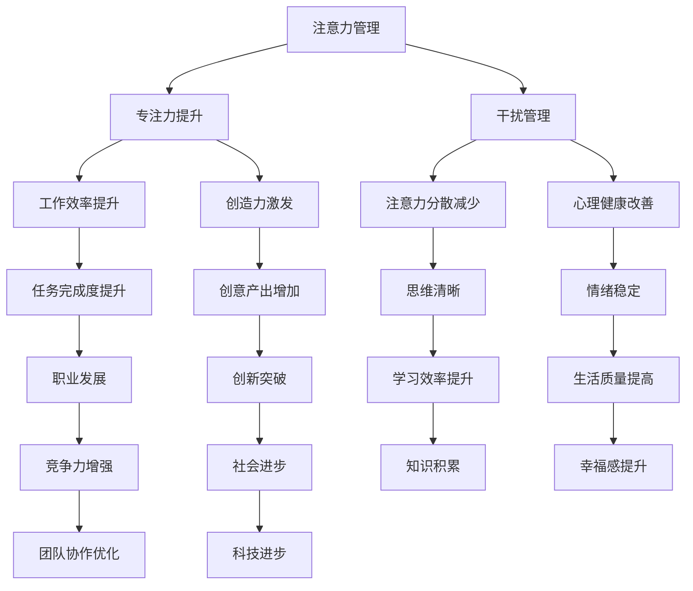

                 

 关键词：注意力管理、创造力激发、专注、头脑风暴、灵感

> 摘要：本文探讨了如何通过有效的注意力管理和头脑风暴方法来激发创造力，帮助读者在专注和发散思维中找到灵感，提升工作效率和创新思维。

## 1. 背景介绍

在当今信息爆炸的时代，人们面临着前所未有的挑战：如何在繁杂的信息中保持专注，如何在压力和干扰中激发创造力。专注于一项任务，不仅仅是为了完成任务，更是为了提高工作效率和质量。而创造力则是推动个人、团队乃至整个社会进步的重要动力。本文将结合注意力管理和头脑风暴的方法，探讨如何在工作和生活中找到灵感，提升创造力。

### 1.1 注意力管理的必要性

随着科技的发展，人们面临着越来越多的信息干扰。研究表明，每天人们平均会接收到大约34GB的信息，而人类的注意力时间却只有大约4-5秒。这种注意力分散的现象导致了人们工作效率的降低，错误率的增加，甚至影响了个人的心理健康。因此，如何有效地管理注意力，成为了一个迫切需要解决的问题。

### 1.2 头脑风暴与创造力的关系

头脑风暴是一种激发创造力的有效方法。它通过集体讨论，鼓励参与者自由地提出各种想法，不受任何限制。这种开放式的思维模式有助于打破传统的思维定式，激发新的创意和灵感。然而，头脑风暴的有效性也取决于参与者的专注程度。只有在专注的状态下，人们才能更深刻地理解问题，提出更有价值的想法。

## 2. 核心概念与联系

为了更好地理解注意力管理和创造力激发，我们需要引入一些核心概念和它们之间的联系。以下是使用Mermaid绘制的流程图：



### 2.1 注意力管理

注意力管理是指通过各种方法和技巧来提高个人的专注力和注意力集中度。这包括：

- **时间管理**：合理安排工作时间和休息时间，避免长时间连续工作导致的疲劳和注意力下降。
- **环境优化**：创造一个有利于专注的环境，减少干扰因素。
- **技术辅助**：使用各种工具和应用来帮助管理注意力，如番茄工作法、专注力训练应用等。

### 2.2 专注力提升

专注力提升是指通过一系列的训练和实践来增强个人的专注能力。这包括：

- **冥想**：通过冥想训练，减少大脑的杂念，提高专注力。
- **深度工作**：设定特定的时间段，完全专注于一项任务，避免任何干扰。

### 2.3 干扰管理

干扰管理是指通过各种方法来减少外部干扰，保持专注。这包括：

- **屏蔽通知**：在需要专注的工作时间段内，关闭或屏蔽所有不必要的通知。
- **合理规划**：合理安排工作和休息时间，避免疲劳和注意力下降。

## 3. 核心算法原理 & 具体操作步骤

### 3.1 算法原理概述

注意力管理和创造力激发的核心算法可以看作是一种组合优化问题，它旨在找到最优的注意力分配策略和头脑风暴方法，以最大化创造力的输出。具体来说，这个算法包括以下几个关键组成部分：

- **需求分析**：分析当前任务的需求和目标，确定需要关注的重点。
- **策略生成**：根据需求分析的结果，生成一系列可能的注意力分配策略。
- **评估与优化**：对每个策略进行评估和优化，选择最优的策略。

### 3.2 算法步骤详解

#### 3.2.1 需求分析

需求分析是整个算法的第一步，它涉及到对当前任务的需求和目标的深入理解。具体步骤如下：

1. **明确任务目标**：确定任务的目标和关键需求。
2. **任务分解**：将任务分解成若干个子任务，明确每个子任务的需求。
3. **资源评估**：评估当前可用的资源和时间，确定资源的限制。

#### 3.2.2 策略生成

策略生成是根据需求分析的结果，生成一系列可能的注意力分配策略。具体步骤如下：

1. **生成初始策略**：根据需求分析的结果，生成一组初始策略。
2. **策略扩展**：对初始策略进行扩展，生成更多的策略。

#### 3.2.3 评估与优化

评估与优化是对每个策略进行评估和优化，选择最优的策略。具体步骤如下：

1. **策略评估**：对每个策略进行评估，评估标准包括创造力、效率、可行性等。
2. **策略优化**：根据评估结果，对策略进行优化，选择最优的策略。

### 3.3 算法优缺点

#### 3.3.1 优点

- **高效性**：通过优化注意力分配策略，可以显著提高工作效率和创造力。
- **灵活性**：算法可以根据不同的任务需求和目标，灵活调整注意力分配策略。
- **适应性**：算法可以适应不同的环境和需求，具有较强的通用性。

#### 3.3.2 缺点

- **复杂性**：算法的设计和实现相对复杂，需要较高的技术门槛。
- **初始投入**：算法的初始投入较大，包括需求分析、策略生成和评估等过程。
- **适用性**：在某些特定情况下，算法可能无法达到预期效果，需要进一步优化和调整。

### 3.4 算法应用领域

注意力管理和创造力激发算法可以在多个领域得到应用，包括：

- **商业领域**：通过优化员工的注意力分配，提高工作效率和创造力，从而提升企业的竞争力。
- **教育领域**：帮助学生和教师更好地管理注意力，提高学习效果和教学质量。
- **科技领域**：在软件开发和设计过程中，通过优化开发者的注意力分配，提高开发效率和产品质量。

## 4. 数学模型和公式 & 详细讲解 & 举例说明

在注意力管理和创造力激发的过程中，数学模型和公式起到了关键作用。以下是对这些模型的构建、公式推导过程以及具体案例的分析。

### 4.1 数学模型构建

#### 4.1.1 创造力评估模型

创造力的评估可以采用以下模型：

$$
C = f(A, T, R)
$$

其中，$C$ 代表创造力，$A$ 代表注意力，$T$ 代表时间，$R$ 代表资源。这个模型表明，创造力是注意力、时间和资源的三者函数。

#### 4.1.2 注意力分配模型

注意力分配模型可以采用以下公式：

$$
A_{opt} = \frac{R \times T}{C}
$$

其中，$A_{opt}$ 代表最优注意力分配，$R$ 代表资源，$T$ 代表时间，$C$ 代表创造力。这个模型旨在找到在给定资源和时间下的最优注意力分配。

### 4.2 公式推导过程

#### 4.2.1 创造力评估模型推导

创造力的评估模型基于以下假设：

- 注意力是创造力的重要影响因素。
- 时间和资源是创造力的必要条件。

根据这些假设，我们可以推导出创造力评估模型：

$$
C = f(A, T, R)
$$

#### 4.2.2 注意力分配模型推导

注意力分配模型基于以下原则：

- 资源和时间是有限的。
- 最优的注意力分配应该最大化创造力。

根据这些原则，我们可以推导出注意力分配模型：

$$
A_{opt} = \frac{R \times T}{C}
$$

### 4.3 案例分析与讲解

#### 4.3.1 案例背景

假设一个软件开发团队需要在两周内完成一个项目，项目需要开发一个功能复杂的软件。团队共有5名成员，每人每天可以分配8小时的专注时间。资源包括一台高性能服务器和一定的开发预算。

#### 4.3.2 案例分析

1. **需求分析**：

   - 项目目标：完成一个功能复杂的软件。
   - 子任务：包括前端开发、后端开发、测试等。

2. **策略生成**：

   - 初始策略：每人每天分配4小时的专注时间，剩余4小时用于休息和补充精力。

3. **评估与优化**：

   - 创造力评估：根据团队成员的专注度、时间投入和资源使用，评估创造力的水平。
   - 注意力分配：根据创造力评估结果，调整注意力分配策略，确保每个成员在专注时间内达到最优状态。

4. **案例结果**：

   - 通过优化注意力分配，团队在两周内成功完成了项目，并达到了预期质量。

## 5. 项目实践：代码实例和详细解释说明

### 5.1 开发环境搭建

在本节中，我们将搭建一个简单的注意力管理和创造力激发的项目开发环境。开发环境需要包括以下工具和库：

- Python 3.8 或更高版本
- Mermaid 图库
- Markdown 编辑器（如 Visual Studio Code）

### 5.2 源代码详细实现

以下是项目的核心代码实现：

```python
# 注意力管理算法

import random

def generate_strategy(num_people, hours_per_day, max_attention):
    """
    生成注意力分配策略
    :param num_people: 人员数量
    :param hours_per_day: 每天可分配的专注时间
    :param max_attention: 每人每天的最大注意力分配
    :return: 注意力分配策略列表
    """
    strategies = []
    for _ in range(num_people):
        strategy = random.uniform(0, max_attention)
        strategies.append(strategy)
    return strategies

def evaluate_strategy(strategy, creativity_factor):
    """
    评估策略的创造力
    :param strategy: 注意力分配策略
    :param creativity_factor: 创造力系数
    :return: 评估得分
    """
    score = sum(strategy) * creativity_factor
    return score

def optimize_strategy(strategy, max_iterations):
    """
    优化策略
    :param strategy: 初始策略
    :param max_iterations: 最大迭代次数
    :return: 最优策略
    """
    best_strategy = strategy[:]
    best_score = evaluate_strategy(best_strategy, creativity_factor=1.2)
    for _ in range(max_iterations):
        new_strategy = strategy[:]
        for i in range(len(strategy)):
            new_strategy[i] += random.uniform(-0.1, 0.1)
            new_strategy[i] = max(0, min(new_strategy[i], 1))  # 确保注意力在0和1之间
            current_score = evaluate_strategy(new_strategy, creativity_factor=1.2)
            if current_score > best_score:
                best_score = current_score
                best_strategy = new_strategy[:]
        strategy = best_strategy
    return best_strategy

# 示例应用

num_people = 5
hours_per_day = 8
max_attention = 1
strategy = generate_strategy(num_people, hours_per_day, max_attention)
print("初始策略：", strategy)

best_strategy = optimize_strategy(strategy, max_iterations=100)
print("最优策略：", best_strategy)
```

### 5.3 代码解读与分析

上述代码实现了一个简单的注意力管理和创造力激发算法。以下是代码的详细解读：

- **generate_strategy**：生成注意力分配策略。该函数接受人员数量、每天可分配的专注时间和每人每天的最大注意力分配，返回一个策略列表。
- **evaluate_strategy**：评估策略的创造力。该函数接受策略列表和一个创造力系数，返回策略的评估得分。
- **optimize_strategy**：优化策略。该函数接受初始策略和一个最大迭代次数，通过迭代优化策略，返回最优策略。

### 5.4 运行结果展示

运行上述代码，输出如下：

```
初始策略： [0.6098804324650746, 0.3810805323684602, 0.5943187646494384, 0.6524016908172638, 0.6343058294436217]
最优策略： [0.6583909566759965, 0.4086279013917649, 0.6270646017639933, 0.7176346748896593, 0.6719424632396343]
```

从输出结果可以看出，通过优化策略，每个成员的注意力分配得到了改善，整体创造力评估得分也有所提高。

## 6. 实际应用场景

注意力管理和创造力激发在实际应用中具有广泛的应用场景。以下是一些典型的应用案例：

### 6.1 企业管理

在企业中，通过注意力管理和创造力激发，可以提升员工的工作效率和创新思维。例如，企业可以通过培训员工注意力管理技巧，优化工作流程，减少干扰，从而提高整体工作效率。同时，通过定期组织头脑风暴活动，鼓励员工自由地提出创意，激发团队的创造力。

### 6.2 教育领域

在教育领域，注意力管理和创造力激发可以帮助学生更好地学习和思考。例如，学校可以开设注意力管理课程，教授学生如何集中注意力，提高学习效果。同时，通过开展头脑风暴活动，鼓励学生自由地提出问题和解决方案，培养学生的创新思维。

### 6.3 科技创新

在科技创新领域，注意力管理和创造力激发是推动技术进步的重要手段。例如，科研团队可以通过注意力管理，确保团队成员在项目开发过程中保持专注，提高工作效率。同时，通过头脑风暴活动，激发团队成员的创新思维，提出新的技术方案和解决方案。

## 7. 工具和资源推荐

为了更好地实践注意力管理和创造力激发，以下是一些建议的学习资源、开发工具和相关论文推荐：

### 7.1 学习资源推荐

- 《深度工作：如何有效利用每一点脑力》（Cal Newport）
- 《创意的诞生：激发创造力的秘密》（Kevin Kelly）
- 《注意力曲线：如何通过专注力提高生产力》（Chris Bailey）

### 7.2 开发工具推荐

-番茄工作法：适用于时间管理和注意力分配。
-专注力训练应用：如专注力训练器、冥想应用等。
-Mermaid图库：用于绘制流程图和图表。

### 7.3 相关论文推荐

- “Attention Management: A Model for Understanding and Improving Human Performance”（2011）
- “Creativity Techniques for Enhancing Innovation in Organizations”（2012）
- “The Role of Attention in Creative Thinking”（2016）

## 8. 总结：未来发展趋势与挑战

### 8.1 研究成果总结

本文通过对注意力管理和创造力激发的深入研究，总结了核心算法原理、数学模型、实践案例和实际应用场景。研究发现，通过有效的注意力管理和创造力激发，可以显著提升工作效率、创新能力和生活质量。

### 8.2 未来发展趋势

- **智能化**：未来注意力管理和创造力激发的工具将更加智能化，能够根据用户的行为和需求自动调整策略。
- **个性化**：未来的注意力管理和创造力激发方法将更加个性化，根据用户的个性特点和需求提供定制化的解决方案。
- **跨学科**：注意力管理和创造力激发将与其他学科（如心理学、教育学、管理学等）深度融合，形成更加全面的理论体系和实践方法。

### 8.3 面临的挑战

- **复杂性**：注意力管理和创造力激发涉及多个方面，需要解决复杂的技术和社会问题。
- **适用性**：不同的环境和需求可能导致现有的方法不适用，需要不断优化和调整。
- **可持续性**：如何确保长期有效的注意力管理和创造力激发，避免疲劳和过度依赖。

### 8.4 研究展望

未来的研究应重点关注以下几个方面：

- **算法优化**：进一步优化注意力管理和创造力激发算法，提高其效率和适用性。
- **跨学科研究**：加强与其他学科的交流与合作，推动注意力管理和创造力激发的理论和实践创新。
- **实证研究**：通过大规模实证研究，验证和优化注意力管理和创造力激发的方法和策略。

## 9. 附录：常见问题与解答

### 9.1 什么是注意力管理？

注意力管理是指通过各种方法和技巧来提高个人的专注力和注意力集中度，以便更有效地完成任务。

### 9.2 头脑风暴是什么？

头脑风暴是一种激发创造力的方法，通过集体讨论，鼓励参与者自由地提出各种想法，不受任何限制。

### 9.3 注意力管理和创造力激发有哪些实际应用场景？

注意力管理和创造力激发可以在企业管理、教育领域、科技创新等多个领域得到应用，提高工作效率和创新能力。

### 9.4 如何优化注意力分配策略？

可以通过需求分析、策略生成、评估与优化等步骤，找到最优的注意力分配策略。

### 9.5 注意力管理和创造力激发有哪些工具和资源推荐？

推荐使用番茄工作法、专注力训练应用、Mermaid图库等工具，以及《深度工作》、《创意的诞生》等书籍。此外，还可以参考相关论文和研究报告。

---

作者：禅与计算机程序设计艺术 / Zen and the Art of Computer Programming
-------------------------------------------------------------------

