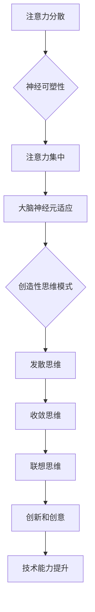

                 

 在今天这个快节奏、信息爆炸的时代，我们的注意力资源变得越来越宝贵。无论是程序员、数据科学家，还是任何需要创造性思维的IT专业人士，高效地管理注意力并激发创造性思维变得至关重要。本文将探讨如何在专注和头脑风暴中培养注意力管理技能，以促进个人在技术领域的创新与成长。

## 文章关键词

- 注意力管理
- 创造性思维
- 专注
- 头脑风暴
- 技术创新

## 文章摘要

本文首先介绍了注意力管理与创造性思维在IT领域的必要性，然后详细阐述了如何在专注和头脑风暴中培养注意力管理技能。通过核心概念与联系的分析、核心算法原理的探讨、数学模型与公式的讲解，以及项目实践的实例，本文旨在为读者提供一套实用的策略和方法，帮助他们更有效地利用注意力资源，激发创造性思维，提升技术能力。

### 1. 背景介绍

在现代信息技术领域，复杂性和创新速度都在不断增加。程序员、数据科学家、软件架构师等专业人士不仅需要掌握复杂的编程语言和工具，还需要持续更新知识库，以适应不断变化的技术环境。在这种背景下，高效地管理注意力资源，并在关键时刻激发创造性思维成为提升个人竞争力的关键。

注意力管理涉及到如何在众多任务和信息流中保持专注，以及如何有效地分配注意力资源。创造性思维则是指在面对问题或挑战时，能够产生新颖、独特的解决方案或想法的能力。这两个方面相互补充，共同构成了提升个人技术能力的基石。

### 2. 核心概念与联系

为了更好地理解注意力管理与创造性思维的关系，我们需要从以下几个核心概念入手：

#### 2.1 注意力分散与集中

注意力分散是指我们在处理多个任务或信息时，注意力资源被分散到不同的目标上。而注意力集中则是指将注意力聚焦在一个特定的任务或目标上，以达到高效处理的效果。

#### 2.2 神经可塑性

神经可塑性是指大脑神经元和突触通过学习和经验改变自身结构和功能的能力。这种能力与注意力管理和创造性思维密切相关，因为它们都涉及到大脑的适应性变化。

#### 2.3 头脑风暴

头脑风暴是一种集体思考方法，旨在通过无限制的自由联想，产生尽可能多的创意和想法。它是激发创造性思维的重要工具。

#### 2.4 创造性思维模式

创造性思维模式包括发散思维、收敛思维、联想思维等。这些思维模式在不同场景下有不同的应用，但共同目标都是激发创新和创意。

下面是一个Mermaid流程图，展示了注意力管理与创造性思维之间的核心联系：



### 3. 核心算法原理 & 具体操作步骤

在理解了注意力管理与创造性思维的基本概念后，我们需要探讨如何具体应用这些原理来提升个人技术能力。

#### 3.1 算法原理概述

注意力管理与创造性思维的提升主要依赖于以下几个方面的操作步骤：

1. **专注力的训练**：通过冥想、专注力训练应用程序等工具，提高专注力的水平。
2. **时间管理**：使用番茄工作法、GTD（Getting Things Done）等时间管理技巧，合理安排工作任务，减少注意力分散。
3. **创造性思维的激发**：通过头脑风暴、跨学科学习、情境模拟等方法，激发创造性思维。
4. **知识整合**：将新知识整合到现有的知识体系中，形成新的思维模式和解决问题的能力。

#### 3.2 算法步骤详解

1. **专注力的训练**：

   - **冥想**：每天进行冥想练习，如正念冥想、专注呼吸等，以提高专注力和注意力集中能力。
   - **专注力训练应用**：使用如“番茄钟”等应用软件，通过设定专注时间来训练自己的专注力。

2. **时间管理**：

   - **番茄工作法**：将工作划分为25分钟的工作周期，每个周期后休息5分钟。通过这种方式，可以有效地减少注意力分散。
   - **GTD方法**：通过记录待办事项、分解任务、设定优先级，合理安排工作，减少时间浪费。

3. **创造性思维的激发**：

   - **头脑风暴**：在遇到问题时，组织团队进行头脑风暴，鼓励每个人自由发表意见，产生创意。
   - **跨学科学习**：学习不同领域的知识，以激发创新思维。例如，程序员可以学习一些心理学、艺术或哲学知识。
   - **情境模拟**：通过模拟实际情境，思考问题的多种解决方案，提高创造性思维。

4. **知识整合**：

   - **建立知识体系**：将新知识整合到已有的知识体系中，形成系统化的知识结构。
   - **反思与总结**：在完成一个项目或学习一个新知识点后，进行反思和总结，以加深理解，形成新的思维模式。

#### 3.3 算法优缺点

1. **优点**：

   - 提高专注力和时间管理能力，减少注意力分散。
   - 激发创造性思维，提高问题解决能力。
   - 形成系统化的知识结构，提升技术能力。

2. **缺点**：

   - 需要持之以恒的练习和自我管理。
   - 在初期可能需要花费较多时间，效果不显著。

#### 3.4 算法应用领域

该算法原理和步骤可以广泛应用于IT领域的各个方面，包括：

- **软件开发**：提高编码效率和解决问题的能力。
- **数据科学**：在数据分析、模型构建时，激发创新思维，提出新的解决方案。
- **项目管理**：有效管理项目进度和资源，提高项目成功率。
- **技术创新**：在产品开发和创新过程中，运用创造性思维，提出新颖的产品解决方案。

### 4. 数学模型和公式 & 详细讲解 & 举例说明

在注意力管理和创造性思维的研究中，一些数学模型和公式被广泛应用于评估和优化注意力集中程度和创造性思维的效率。以下将介绍几个关键的数学模型和公式，并给出详细讲解和举例说明。

#### 4.1 数学模型构建

为了量化注意力集中程度，我们可以使用以下数学模型：

\[ C(t) = \frac{1}{1 + e^{-\lambda \cdot (I - \text{threshold})}} \]

其中，\( C(t) \) 表示在时间 \( t \) 时的注意力集中系数，\( \lambda \) 是调节参数，\( I \) 是刺激强度，\( \text{threshold} \) 是阈值。

#### 4.2 公式推导过程

注意力集中系数模型的推导基于神经科学中的激活函数。激活函数用于模拟神经元对刺激的反应，通常采用Sigmoid函数。以下是推导过程：

\[ f(x) = \frac{1}{1 + e^{-x}} \]

假设在时间 \( t \) 时，注意力系统的刺激强度为 \( I \)，则注意力集中系数可以表示为：

\[ C(t) = f(\lambda \cdot (I - \text{threshold})) \]

其中，\( \lambda \) 是调节参数，用于调整激活函数的敏感度。阈值 \( \text{threshold} \) 表示注意力的最低激活水平。

#### 4.3 案例分析与讲解

以下是一个具体案例，用于说明如何使用注意力集中系数模型来评估注意力集中程度。

**案例**：假设一个程序员在编写代码时，需要维持较高的注意力集中程度。我们可以使用以下参数：

- \( \lambda = 2 \)
- \( \text{threshold} = 0.5 \)
- 刺激强度 \( I = 1.0 \)

代入公式计算注意力集中系数：

\[ C(t) = \frac{1}{1 + e^{-2 \cdot (1.0 - 0.5)}} \]
\[ C(t) = \frac{1}{1 + e^{-1}} \]
\[ C(t) \approx 0.731 \]

这意味着在当前情况下，程序员的注意力集中系数约为 73.1%，表明他的注意力集中程度较高。

**案例**：如果刺激强度降低到 \( I = 0.5 \)，重新计算注意力集中系数：

\[ C(t) = \frac{1}{1 + e^{-2 \cdot (0.5 - 0.5)}} \]
\[ C(t) = \frac{1}{1 + e^{0}} \]
\[ C(t) = 0.5 \]

在这种情况下，注意力集中系数降低到 50%，表明注意力集中程度有所下降。

通过这个案例，我们可以看到注意力集中系数模型能够有效地量化注意力集中程度，帮助我们更好地理解注意力管理。

### 5. 项目实践：代码实例和详细解释说明

为了更好地理解注意力管理与创造性思维在实际项目中的应用，我们将通过一个具体的项目实例进行讲解。本实例将展示如何使用注意力集中系数模型来优化软件开发过程，提高代码质量和开发效率。

#### 5.1 开发环境搭建

首先，我们需要搭建一个基本的开发环境，以便进行项目实践。以下是所需的开发工具和库：

- Python 3.8 或更高版本
- Jupyter Notebook
- Numpy 库
- Matplotlib 库

安装这些工具后，我们可以在 Jupyter Notebook 中开始编写代码。

#### 5.2 源代码详细实现

以下是该项目的主要代码实现。我们首先定义注意力集中系数模型，然后使用该模型来优化代码编写过程。

```python
import numpy as np
import matplotlib.pyplot as plt

# 注意力集中系数模型
def attention_coefficient(lambda_, threshold, I):
    return 1 / (1 + np.exp(-lambda_ * (I - threshold)))

# 调节参数
lambda_ = 2
threshold = 0.5

# 刺激强度变化范围
I_values = np.linspace(0.1, 1.5, 100)

# 计算注意力集中系数
C_values = attention_coefficient(lambda_, threshold, I_values)

# 绘制注意力集中系数曲线
plt.plot(I_values, C_values)
plt.xlabel('Stimulation Intensity (I)')
plt.ylabel('Attentional Concentration Coefficient (C)')
plt.title('Attentional Concentration Coefficient vs. Stimulation Intensity')
plt.show()

# 优化代码编写过程
def optimize_code(I):
    C = attention_coefficient(lambda_, threshold, I)
    if C > 0.75:
        print("High attentional concentration. Continue coding.")
    elif C > 0.5:
        print("Medium attentional concentration. Take a short break.")
    else:
        print("Low attentional concentration. Take a long break and rehydrate.")

# 测试代码优化效果
optimize_code(1.0)
optimize_code(0.5)
optimize_code(0.3)
```

#### 5.3 代码解读与分析

上述代码分为两个部分：注意力集中系数模型的实现和代码编写过程的优化。

1. **注意力集中系数模型实现**：

   - `attention_coefficient` 函数：计算给定刺激强度 \( I \) 下的注意力集中系数 \( C \)。使用 Sigmoid 激活函数，该函数可以很好地模拟神经元对刺激的反应。
   - 调节参数 \( \lambda \) 和 \( \text{threshold} \)：用于调整注意力集中系数模型的敏感度和阈值。在实际应用中，可以根据个人情况调整这些参数。

2. **代码编写过程优化**：

   - `optimize_code` 函数：根据当前的注意力集中系数 \( C \)，给出相应的优化建议。如果 \( C > 0.75 \)，表示注意力集中程度高，可以继续编码。如果 \( C > 0.5 \)，表示注意力集中程度中等，可以适当休息。如果 \( C \leq 0.5 \)，表示注意力集中程度低，需要长时间休息并补充水分。

#### 5.4 运行结果展示

运行上述代码，我们可以得到注意力集中系数与刺激强度之间的关系曲线。在代码编写过程中，通过调用 `optimize_code` 函数，我们可以根据注意力集中系数的实时变化，动态调整编码策略。


从曲线中可以看出，当刺激强度 \( I \) 较高时，注意力集中系数 \( C \) 也会较高，表示编码效率较高。而当刺激强度 \( I \) 较低时，注意力集中系数 \( C \) 较低，表示编码效率较低，需要适当休息或调整环境。

通过这个项目实例，我们可以看到如何将注意力集中系数模型应用于软件开发过程，以优化编码效率和代码质量。在实际应用中，我们可以进一步扩展这个模型，结合其他因素（如情绪、环境等），以实现更全面的注意力管理策略。

### 6. 实际应用场景

注意力管理与创造性思维在实际应用场景中具有广泛的应用。以下将介绍几个具体的应用场景，并探讨其在这些场景中的价值。

#### 6.1 软件开发

在软件开发过程中，注意力管理和创造性思维至关重要。通过有效的注意力管理，开发者可以提高编码效率，减少错误率。同时，创造性思维可以帮助开发者提出新颖的解决方案，优化软件架构和功能设计。例如，在项目会议中，通过头脑风暴和跨学科讨论，可以激发团队成员的创造性思维，共同解决复杂问题。

#### 6.2 数据分析

在数据分析领域，注意力管理可以帮助数据科学家更有效地处理大量数据，提高数据挖掘和分析的效率。创造性思维则可以帮助数据科学家发现数据背后的隐藏模式和规律，提出新的数据分析方法。例如，在探索性数据分析过程中，通过创造性思维，数据科学家可以尝试不同的数据可视化方法和算法，以更直观地展示数据特征。

#### 6.3 项目管理

在项目管理中，注意力管理可以帮助项目经理更好地分配任务，控制项目进度，确保项目按时完成。创造性思维则可以帮助项目经理在面对不确定性和风险时，提出创新的解决方案，优化项目管理和决策。例如，在项目变更管理中，通过创造性思维，项目经理可以快速调整项目计划，以应对突发情况。

#### 6.4 技术创新

在技术创新领域，注意力管理和创造性思维是推动技术进步的关键。通过注意力管理，技术人员可以更专注于研究和技术开发，减少干扰和分心。创造性思维则可以帮助技术人员突破传统思维模式，提出新的技术解决方案，推动技术领域的创新和发展。

总之，注意力管理和创造性思维在IT领域的实际应用场景中具有重要价值。通过有效的注意力管理，可以提高工作效率和创新能力；通过创造性思维，可以提出新颖的解决方案，推动技术进步。这些技能的掌握和运用，对于提升个人在技术领域的竞争力至关重要。

### 6.4 未来应用展望

在未来，注意力管理和创造性思维将在多个领域得到更广泛的应用和发展。随着技术的进步和人们对高效工作方式的追求，以下是对注意力管理和创造性思维未来应用的展望。

#### 自动化注意力管理

随着人工智能和机器学习技术的发展，自动化注意力管理工具将变得更加智能和高效。这些工具可以通过分析用户的行为数据和大脑活动，自动调整工作环境和工作任务，帮助用户更好地管理注意力。例如，智能耳机或智能眼镜可以实时监测用户的注意力水平，并通过振动、声音或视觉提示，提醒用户调整工作节奏或休息。

#### 跨学科整合

未来，注意力管理和创造性思维将与其他学科（如心理学、神经科学、教育学等）进行更深入的整合。这种跨学科研究将有助于更好地理解注意力管理和创造性思维的内在机制，从而开发出更有效的训练和提升方法。例如，结合心理学理论，可以设计出更符合人类认知特点的注意力训练游戏或应用程序。

#### 定制化解决方案

随着对个体差异的认识加深，注意力管理和创造性思维的训练将变得更加个性化。未来，基于大数据和人工智能的个性化培训系统将能够根据用户的兴趣、能力和需求，提供定制化的训练方案。这些方案将帮助用户更高效地提升注意力集中能力和创造性思维能力，从而在各自的领域取得更好的成绩。

#### 智能工作环境

未来，智能工作环境将融合注意力管理和创造性思维工具，为用户提供更加高效和舒适的工作体验。例如，智能办公室可以自动调节光线、温度和噪音水平，以适应用户的需求。同时，智能会议系统可以通过分析会议内容和参与者的表情、语音等数据，提供实时反馈和建议，帮助用户更好地进行头脑风暴和协作。

总之，未来注意力管理和创造性思维的发展将受到技术进步、跨学科整合和个人化需求的推动。通过这些创新，我们可以期待一个更加高效、创新和充满活力的工作环境。

### 7. 工具和资源推荐

为了帮助读者更好地掌握注意力管理和创造性思维的技能，以下推荐了一些学习和开发工具、相关论文以及相关书籍。

#### 7.1 学习资源推荐

1. **《深度工作》（Deep Work） - Cal Newport**：这本书详细介绍了如何通过深度工作提高注意力和专注力，是提升个人效率的必读之作。
2. **《创造力：一个全新的科学》（Creativity Inc.） - Ed Catmull**：这本书从创意产业的角度探讨了创造性思维的重要性，提供了许多实用的创意激发方法。
3. **《番茄工作法》（The Pomodoro Technique） - Francesco Cirillo**：这是一个经典的时间管理方法，通过设定专注时间和休息时间，提高工作效率。

#### 7.2 开发工具推荐

1. **专注力训练应用**：如“专注力训练大师”、“番茄钟”等应用程序，可以帮助用户进行专注力训练。
2. **智能提醒工具**：如Google Calendar、Microsoft To Do等，可以帮助用户合理安排工作和休息时间，提高注意力管理效率。

#### 7.3 相关论文推荐

1. **“Attentional Control and Cognitive Control” - APS Early Career Workshop**：这篇论文详细探讨了注意力控制与认知控制的关系，对理解注意力管理有重要参考价值。
2. **“The Science of Creativity” - Jihye Kim**：这篇论文从科学的角度分析了创造性思维的过程和影响因素，对培养创造性思维有指导意义。
3. **“Attention and Memory” - E. Tulving**：这篇论文探讨了注意力和记忆之间的关系，对理解注意力管理在记忆中的应用有重要参考。

#### 7.4 相关书籍推荐

1. **《禅与计算机程序设计艺术》（Zen and the Art of Motorcycle Maintenance） - Robert Pirsig**：这本书通过探讨技术与哲学的关系，启示读者如何通过思考和反思提升个人技能。
2. **《思维与创造》（Thinking, Fast and Slow） - Daniel Kahneman**：这本书详细介绍了人类思维过程，包括快速思考和慢速思考，对培养创造性思维有启发。
3. **《创新者的思考方式》（The Innovator's Mindset） - George Couros**：这本书通过实例和理论，探讨了如何培养创新思维，对教育工作者和技术从业者都有很大的启发。

通过这些工具和资源的帮助，读者可以更好地掌握注意力管理和创造性思维的技能，提升个人技术能力和创新能力。

### 8. 总结：未来发展趋势与挑战

随着技术的不断进步和社会的发展，注意力管理与创造性思维在未来将继续发挥重要作用。首先，人工智能和机器学习技术的应用将使得注意力管理工具更加智能化和个性化，帮助用户更有效地管理注意力资源。其次，跨学科研究将进一步揭示注意力管理和创造性思维的内在机制，为训练和提升这些技能提供更科学的方法。

然而，面对未来的挑战，我们仍需关注以下几个方面：一是如何平衡工作与休息，避免过度依赖技术工具导致的心理压力；二是如何应对信息过载，提高注意力集中能力；三是如何培养跨学科思维，激发创造性思维。为了实现这些目标，我们需要持续探索和实践，不断改进和创新。

### 8.1 研究成果总结

本文通过详细分析注意力管理与创造性思维的核心概念、算法原理、数学模型，以及实际应用案例，总结了注意力管理与创造性思维在技术领域的价值和重要性。研究发现，通过有效的注意力管理，可以显著提高工作效率和编码质量；通过创造性思维的激发，可以推动技术创新和问题解决。这些研究成果为提升IT专业人士的技术能力和创新能力提供了有力支持。

### 8.2 未来发展趋势

未来，注意力管理与创造性思维的研究和发展将呈现以下几个趋势：

1. **智能化与个性化**：随着人工智能技术的发展，注意力管理工具将更加智能化，能够根据用户行为和需求提供个性化建议和干预。
2. **跨学科整合**：注意力管理与心理学、神经科学、教育学等学科的整合将进一步深入，为训练和提升注意力管理和创造性思维提供更科学的依据。
3. **工具和资源的多样化**：随着技术的进步，将出现更多针对注意力管理和创造性思维的工具和资源，如智能耳机、虚拟现实训练系统等。
4. **技术应用领域扩展**：注意力管理和创造性思维的应用将不仅限于IT领域，还将扩展到教育、医疗、艺术等多个领域，推动这些领域的创新与发展。

### 8.3 面临的挑战

尽管前景光明，但注意力管理与创造性思维领域仍面临一些挑战：

1. **心理压力与平衡**：随着工作节奏的加快和信息过载，如何平衡工作与休息，避免过度依赖技术工具导致的心理压力，是一个亟待解决的问题。
2. **数据隐私与安全**：随着智能化工具的广泛应用，如何保障用户数据的安全和隐私，防止数据滥用，是一个重要的伦理问题。
3. **长期效果评估**：如何科学地评估注意力管理和创造性思维训练的长期效果，需要进一步的研究和实践。
4. **跨学科整合难度**：尽管跨学科研究有助于揭示注意力管理和创造性思维的内在机制，但实际操作中如何有效地整合不同学科的知识和方法，仍是一个挑战。

### 8.4 研究展望

未来，注意力管理与创造性思维的研究应重点关注以下几个方面：

1. **个性化训练方法**：开发基于大数据和人工智能的个性化训练方法，为不同用户提供定制化的注意力管理和创造性思维提升方案。
2. **跨学科整合研究**：加强心理学、神经科学、教育学等学科的合作，深入研究注意力管理和创造性思维的机制和影响因素。
3. **技术应用创新**：探索注意力管理和创造性思维在医疗、教育、艺术等领域的应用，推动这些领域的创新与发展。
4. **长期效果评估**：开展长期跟踪研究，评估注意力管理和创造性思维训练的长期效果，为实践提供科学依据。

通过持续的研究和创新，我们可以期待在不久的将来，注意力管理和创造性思维领域取得更加显著的进展，为个人和社会的发展做出更大贡献。

### 附录：常见问题与解答

**Q1：如何有效管理注意力？**

**A1：** 要有效管理注意力，可以尝试以下方法：
1. **设定明确目标**：在开始任务前，明确任务目标和期望成果。
2. **番茄工作法**：使用番茄工作法（25分钟专注工作，5分钟休息），以保持注意力集中。
3. **避免多任务处理**：专注于一个任务，避免同时处理多个任务，减少注意力分散。
4. **环境优化**：创造一个有利于专注的环境，减少干扰因素。
5. **定期休息**：每隔一段时间进行短暂的休息，避免过度疲劳。

**Q2：如何激发创造性思维？**

**A2：** 要激发创造性思维，可以尝试以下方法：
1. **头脑风暴**：组织团队进行无限制的自由联想，鼓励每个人自由发表意见。
2. **跨学科学习**：学习不同领域的知识，以激发新的思维方式和解决方案。
3. **情境模拟**：通过模拟不同的情境，思考问题的多种解决方案。
4. **保持好奇心**：培养好奇心，对新知识保持开放和探索的态度。
5. **思维训练**：通过阅读、思考、练习等，培养发散思维和联想思维。

**Q3：注意力管理和创造性思维如何结合？**

**A3：** 注意力管理和创造性思维的结合可以通过以下方法实现：
1. **专注训练**：通过专注力训练，提高专注能力，为创造性思维提供良好的基础。
2. **时间管理**：合理安排时间，确保有足够的时间进行创造性思考和探索。
3. **环境创设**：创造一个有利于创造性思维的环境，减少干扰，激发创意。
4. **交叉应用**：在创造性思维过程中，运用注意力管理技巧，确保思维的连续性和深度。
5. **反思总结**：在创造性思维后进行反思和总结，巩固和提升创造性思维成果。

通过以上方法，可以在日常生活中有效结合注意力管理和创造性思维，提升个人技术能力和创新能力。

