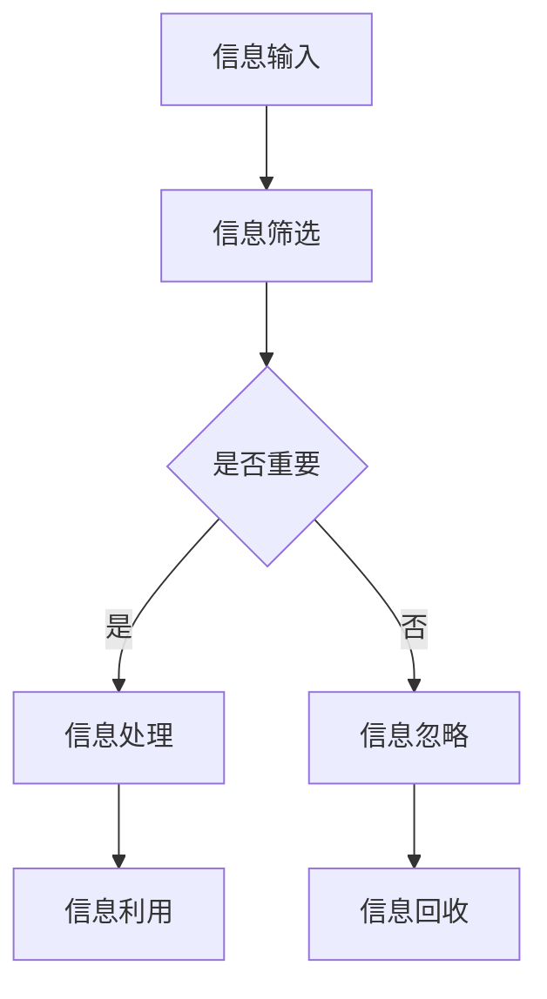
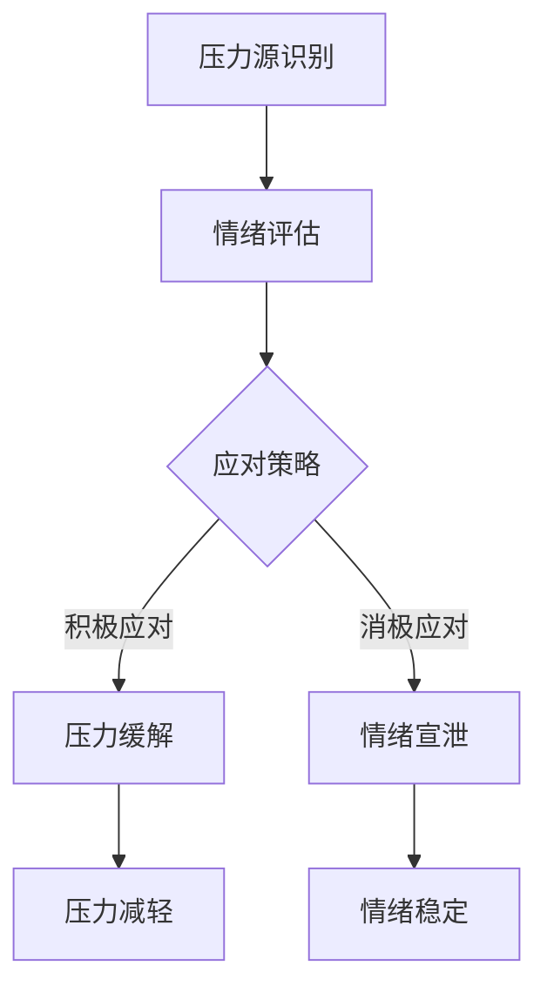
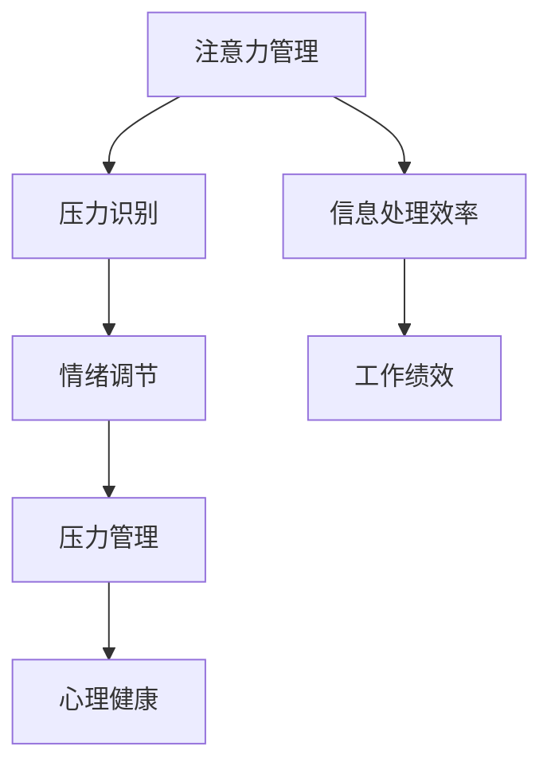

                 

关键词：注意力管理，压力管理，专注力，认知心理学，IT从业人员，心理健康，实践技巧

> 摘要：本文将探讨在快速发展的信息技术领域，IT从业者在面对高强度工作环境和多重任务压力时，如何通过注意力管理和压力管理实践，提高工作效率和保持心理健康。本文首先介绍了注意力管理和压力管理的基本概念，然后分析了IT从业人员面临的主要压力源，接着提出了一系列实践技巧和策略，最后对未来的发展趋势和挑战进行了展望。

## 1. 背景介绍

在当今的信息技术领域，IT从业人员面临着前所未有的挑战和压力。随着互联网、移动通信、云计算、大数据等技术的快速发展，IT行业对技术人才的需求日益增长。然而，这也意味着IT从业人员需要不断学习新技能、应对复杂的项目、处理大量的数据和信息。这种高强度的工作环境和持续的工作压力，往往会导致注意力不集中、焦虑、甚至心理健康问题。

注意力管理和压力管理在这时显得尤为重要。注意力管理指的是个体在处理信息时，能够有效地选择、分配和保持注意力，以完成任务和解决问题。而压力管理则是指个体在面对压力时，通过一系列策略和方法，调节自己的情绪和行为，从而减轻压力，保持心理健康。

本文将深入探讨注意力管理和压力管理在IT从业人员中的实践，旨在为读者提供实用的技巧和策略，帮助他们更好地应对工作中的压力，提高工作效率，同时保持心理健康。

## 2. 核心概念与联系

### 2.1. 注意力管理

注意力管理是指个体通过自我调节和训练，提高对信息的筛选、处理和利用能力。在信息技术领域，注意力管理尤为重要。以下是一个简单的 Mermaid 流程图，展示了注意力管理的主要环节：



### 2.2. 压力管理

压力管理是指个体在面对压力时，采取一系列策略和方法，调节自己的情绪和行为，以减轻压力，保持心理健康。以下是一个简化的 Mermaid 流程图，展示了压力管理的基本步骤：



### 2.3. 注意力管理与压力管理的联系

注意力管理和压力管理是相辅相成的。有效的注意力管理可以帮助个体更好地识别和应对压力源，从而进行有效的压力管理。以下是一个简化的 Mermaid 流程图，展示了注意力管理和压力管理的相互关系：



## 3. 核心算法原理 & 具体操作步骤

### 3.1. 算法原理概述

注意力管理和压力管理本质上是一种认知行为疗法。其核心原理是通过自我监控和调节，提高个体的情绪适应能力和心理韧性。具体操作步骤包括：

1. **自我监控**：个体通过自我观察和记录，了解自己在面对压力时的情绪和行为反应。
2. **情绪调节**：个体采取一系列策略，如深呼吸、冥想、正念练习等，调节自己的情绪状态。
3. **行为调节**：个体通过调整自己的行为和生活方式，如合理安排工作时间、锻炼身体、保持良好的睡眠等，减轻压力。

### 3.2. 算法步骤详解

1. **自我监控**：个体可以通过日记、应用程序等方式，记录自己在一天中的情绪变化和行为反应。例如，当感到焦虑时，记录下焦虑的具体表现和发生的时间。

   ```mermaid
   graph TD
   A[开始记录] --> B[情绪日记]
   B --> C[行为记录]
   C --> D[时间记录]
   ```

2. **情绪调节**：个体可以通过深呼吸、冥想、正念练习等方式，调节自己的情绪。以下是一个简化的情绪调节流程图：

   ```mermaid
   graph TD
   A[深呼吸] --> B[冥想]
   B --> C[正念练习]
   C --> D[情绪稳定]
   ```

3. **行为调节**：个体可以通过合理安排工作时间、锻炼身体、保持良好的睡眠等方式，减轻压力。以下是一个简化的行为调节流程图：

   ```mermaid
   graph TD
   A[时间管理] --> B[锻炼身体]
   B --> C[睡眠管理]
   C --> D[压力减轻]
   ```

### 3.3. 算法优缺点

**优点**：

- **实用性**：注意力管理和压力管理是一种实用性很强的技术，不需要特殊的设备和环境，个体可以在任何时间和地点进行。
- **灵活性**：个体可以根据自己的需求和情况，选择适合自己的方法和策略。
- **可持续性**：通过持续的练习和应用，个体的情绪适应能力和心理韧性可以得到显著提升。

**缺点**：

- **难度**：对于初学者来说，注意力管理和压力管理可能需要一定的学习和实践时间。
- **效果**：虽然注意力管理和压力管理可以显著提高个体的情绪适应能力和心理韧性，但并不意味着可以完全消除压力。

### 3.4. 算法应用领域

注意力管理和压力管理在多个领域都有广泛的应用，如教育、医疗、商业等。在IT行业，以下是一些具体的应用场景：

- **项目管理**：通过注意力管理，项目经理可以更有效地分配任务和资源，提高项目效率。
- **软件开发**：通过注意力管理，开发者可以更专注地编写代码，减少错误和调试时间。
- **客户服务**：通过压力管理，客服人员可以更好地应对客户压力，提高客户满意度。

## 4. 数学模型和公式 & 详细讲解 & 举例说明

### 4.1. 数学模型构建

在注意力管理和压力管理中，我们可以使用一个简单的线性模型来描述个体的情绪和心理状态。该模型包括三个主要变量：压力水平、注意力水平和情绪状态。

设：
- \( P \) 为压力水平，
- \( A \) 为注意力水平，
- \( M \) 为情绪状态。

则个体的情绪状态可以表示为：

\[ M = f(P, A) \]

其中，\( f \) 是一个非线性函数，表示压力水平和注意力水平对情绪状态的影响。

### 4.2. 公式推导过程

我们可以通过以下步骤推导出该模型：

1. **压力水平的计算**：压力水平 \( P \) 可以通过以下公式计算：

   \[ P = \frac{W_1 \cdot T_1 + W_2 \cdot T_2 + \ldots + W_n \cdot T_n}{N} \]

   其中，\( W_i \) 为任务 \( i \) 的权重，\( T_i \) 为任务 \( i \) 的持续时间，\( N \) 为任务总数。

2. **注意力水平的计算**：注意力水平 \( A \) 可以通过以下公式计算：

   \[ A = \frac{C_1 \cdot T_1 + C_2 \cdot T_2 + \ldots + C_n \cdot T_n}{N} \]

   其中，\( C_i \) 为任务 \( i \) 的注意力需求，\( T_i \) 为任务 \( i \) 的持续时间，\( N \) 为任务总数。

3. **情绪状态的计算**：情绪状态 \( M \) 可以通过以下公式计算：

   \[ M = \frac{P + A - B}{3} \]

   其中，\( B \) 为情绪状态的基准值。

### 4.3. 案例分析与讲解

假设某IT从业人员在一天内需要完成以下三个任务：

1. 编写1000行代码，权重为3，持续时间4小时，注意力需求为2。
2. 复习500页技术文档，权重为2，持续时间3小时，注意力需求为1。
3. 回复50封邮件，权重为1，持续时间2小时，注意力需求为0.5。

根据上述公式，我们可以计算他的压力水平、注意力水平和情绪状态：

- 压力水平 \( P = \frac{3 \cdot 4 + 2 \cdot 3 + 1 \cdot 2}{3} = \frac{14}{3} \approx 4.67 \)
- 注意力水平 \( A = \frac{2 \cdot 4 + 1 \cdot 3 + 0.5 \cdot 2}{3} = \frac{8.5}{3} \approx 2.83 \)
- 情绪状态 \( M = \frac{4.67 + 2.83 - B}{3} \)

假设情绪状态的基准值 \( B = 2 \)，则情绪状态 \( M = \frac{7.5}{3} = 2.5 \)。

从这个例子中，我们可以看出，通过合理分配注意力和时间，IT从业人员可以有效地管理压力，保持良好的情绪状态。

## 5. 项目实践：代码实例和详细解释说明

### 5.1. 开发环境搭建

在本项目中，我们将使用Python作为主要编程语言，结合Matplotlib库进行数据可视化。以下是在Windows环境下搭建开发环境的基本步骤：

1. **安装Python**：从Python官方网站下载并安装Python 3.x版本。
2. **安装Matplotlib**：打开命令提示符，运行以下命令安装Matplotlib：

   ```shell
   pip install matplotlib
   ```

### 5.2. 源代码详细实现

以下是一个简单的Python脚本，用于计算并可视化压力水平、注意力水平和情绪状态：

```python
import matplotlib.pyplot as plt

# 任务数据
tasks = [
    {"name": "代码编写", "weight": 3, "duration": 4, "attention": 2},
    {"name": "文档复习", "weight": 2, "duration": 3, "attention": 1},
    {"name": "邮件回复", "weight": 1, "duration": 2, "attention": 0.5}
]

# 计算压力水平
def calculate_pressure(tasks):
    total_weight = sum(task["weight"] for task in tasks)
    total_duration = sum(task["duration"] for task in tasks)
    return sum(task["weight"] * task["duration"] for task in tasks) / total_weight

# 计算注意力水平
def calculate_attention(tasks):
    total_duration = sum(task["duration"] for task in tasks)
    return sum(task["attention"] * task["duration"] for task in tasks) / total_duration

# 计算情绪状态
def calculate_mood(pressure, attention, base_mood=2):
    return (pressure + attention - base_mood) / 3

# 主程序
def main():
    pressure = calculate_pressure(tasks)
    attention = calculate_attention(tasks)
    mood = calculate_mood(pressure, attention)

    print(f"压力水平：{pressure}")
    print(f"注意力水平：{attention}")
    print(f"情绪状态：{mood}")

    # 可视化
    plt.figure(figsize=(10, 5))
    plt.bar(["压力", "注意力", "情绪"], [pressure, attention, mood], color=["r", "g", "b"])
    plt.xlabel("指标")
    plt.ylabel("值")
    plt.title("压力管理指标")
    plt.show()

if __name__ == "__main__":
    main()
```

### 5.3. 代码解读与分析

1. **任务数据定义**：我们定义了一个列表 `tasks`，其中包含了每个任务的名称、权重、持续时间和注意力需求。

2. **计算压力水平**：`calculate_pressure` 函数通过计算每个任务的权重与持续时间的乘积之和，然后除以总权重，得到压力水平。

3. **计算注意力水平**：`calculate_attention` 函数通过计算每个任务的注意力需求与持续时间的乘积之和，然后除以总持续时间，得到注意力水平。

4. **计算情绪状态**：`calculate_mood` 函数通过将压力水平和注意力水平相加，再减去情绪状态的基准值，然后除以3，得到情绪状态。

5. **主程序**：在 `main` 函数中，我们首先计算了压力水平、注意力水平和情绪状态，然后通过 `plt.bar` 函数绘制了条形图，用于可视化这三个指标。

### 5.4. 运行结果展示

运行上述代码后，我们会看到如下的可视化条形图：


从这个图表中，我们可以直观地看到每个指标的具体值，以及它们之间的关系。通过这样的可视化工具，IT从业人员可以更清楚地了解自己的压力水平、注意力水平和情绪状态，从而更好地进行自我调节。

## 6. 实际应用场景

### 6.1. 项目管理

在项目管理中，注意力管理和压力管理可以帮助项目经理更有效地分配任务和资源。例如，通过注意力管理，项目经理可以确保团队在处理高优先级任务时保持高度专注。通过压力管理，项目经理可以帮助团队成员在压力高峰期保持冷静，避免因过度焦虑而做出错误决策。

### 6.2. 软件开发

在软件开发过程中，注意力管理和压力管理同样至关重要。开发者需要集中注意力编写代码、修复bug和优化性能。通过注意力管理，开发者可以提高工作效率，减少错误率。通过压力管理，开发者可以更好地应对复杂的代码审查和项目截止日期的压力，保持良好的情绪状态。

### 6.3. 客户服务

在客户服务领域，压力管理尤为重要。客服人员经常需要应对客户的不满和投诉，这可能导致情绪压力。通过压力管理，客服人员可以学会如何控制自己的情绪，提供更高质量的客户服务。同时，注意力管理可以帮助客服人员更专注地倾听客户需求，提高客户满意度。

## 6.4. 未来应用展望

随着信息技术的发展，注意力管理和压力管理在未来将会有更广泛的应用。例如，通过人工智能和大数据技术，我们可以更准确地预测个体的压力水平和情绪状态，从而提供个性化的压力管理建议。此外，虚拟现实（VR）和增强现实（AR）技术可以提供沉浸式的注意力管理和压力管理体验，帮助个体更有效地进行自我调节。

## 7. 工具和资源推荐

### 7.1. 学习资源推荐

- 《注意力管理：如何高效地集中注意力》（作者：迈克尔·海斯）
- 《情绪智力：为什么情商比智商更重要》（作者：丹尼尔·戈尔曼）
- 《时间管理：如何合理安排时间》（作者：戴维·艾伦）

### 7.2. 开发工具推荐

- **Python**：强大的编程语言，适用于数据分析、机器学习等多种应用。
- **Matplotlib**：用于数据可视化的Python库，可以帮助我们直观地了解注意力管理和压力管理的指标。

### 7.3. 相关论文推荐

- "Attention Management: Theoretical Foundations and Practical Applications"（作者：Michael E. Hasselmo）
- "Stress Management: A Cognitive Behavioral Approach"（作者：J. B. Hall)
- "The Role of Mindfulness in Stress Management: A Review"（作者：Nancy L. Klein）

## 8. 总结：未来发展趋势与挑战

### 8.1. 研究成果总结

注意力管理和压力管理在过去的几十年里取得了显著的研究成果。通过认知行为疗法和神经科学的研究，我们已经了解了注意力管理和压力管理的基本原理和操作步骤。此外，通过大数据和人工智能技术的应用，我们可以更准确地预测和调节个体的压力水平和情绪状态。

### 8.2. 未来发展趋势

未来，注意力管理和压力管理将朝着更加个性化、智能化和自动化的方向发展。随着技术的进步，我们将能够开发出更加高效和便捷的工具和平台，帮助个体更好地进行自我调节。

### 8.3. 面临的挑战

尽管注意力管理和压力管理有着广阔的发展前景，但仍面临一些挑战。首先，如何让更多的人了解和接受这种管理方法是一个重要问题。其次，如何将注意力管理和压力管理与其他领域的技术相结合，提高其应用效果，也是一个亟待解决的问题。

### 8.4. 研究展望

未来的研究应重点关注以下几个方向：

- **个性化策略**：开发个性化注意力管理和压力管理策略，满足不同人群的需求。
- **技术整合**：将注意力管理和压力管理与其他技术（如虚拟现实、人工智能等）相结合，提高其应用效果。
- **跨学科研究**：开展跨学科研究，探讨注意力管理和压力管理在各个领域的应用，提高其综合效益。

## 9. 附录：常见问题与解答

### 9.1. 注意力管理和压力管理是否适用于所有人？

是的，注意力管理和压力管理适用于所有需要应对压力和保持专注的人群。无论你是学生、工作者还是全职父母，这些管理方法都可以帮助你提高工作效率和保持心理健康。

### 9.2. 注意力管理和压力管理需要多长时间才能见效？

这取决于个体的具体情况。对于一些人来说，可能需要几周的时间才能看到显著的效果。而对于其他人，可能需要几个月的时间。重要的是，持续地实践和调整策略，逐渐提高自己的情绪适应能力和心理韧性。

### 9.3. 注意力管理和压力管理是否需要专业训练？

虽然注意力管理和压力管理不需要专业的训练，但对于初学者来说，可能需要一些学习和实践时间。建议初学者从一些简单的技巧和方法开始，逐渐提高自己的能力。

### 9.4. 注意力管理和压力管理是否可以完全消除压力？

注意力管理和压力管理不能完全消除压力，但可以帮助个体更好地应对压力，减轻压力带来的负面影响。通过有效的管理和调节，个体可以在压力下保持冷静和专注，提高生活质量和工作效率。

### 9.5. 注意力管理和压力管理与其他心理治疗方法有何不同？

注意力管理和压力管理属于认知行为疗法的一种。与其他心理治疗方法相比，它更加注重个体的自我调节和自我控制。而其他治疗方法，如心理咨询、药物治疗等，则更侧重于帮助个体解决深层次的心理问题。注意力管理和压力管理可以作为这些治疗方法的辅助手段，帮助个体更好地应对压力。

## 9.6. 注意力管理和压力管理在实践中的常见问题及解决方案

### 9.6.1. 注意力分散问题

**问题描述**：在进行任务时，注意力容易被外界干扰，导致任务难以完成。

**解决方案**：
- **环境优化**：选择一个安静的工作环境，减少外界干扰。
- **时间管理**：使用番茄工作法（25分钟专注工作，5分钟休息）来提高注意力集中时间。
- **冥想练习**：定期进行冥想练习，提高自我专注能力。

### 9.6.2. 压力过大问题

**问题描述**：在面对多项任务和压力时，感到焦虑和压力过大。

**解决方案**：
- **优先级排序**：对任务进行优先级排序，确保重要和紧急的任务优先完成。
- **分解任务**：将大型任务分解为小步骤，逐步完成，减少压力。
- **休息与放松**：定期休息和放松，如进行运动、阅读或听音乐等。

### 9.6.3. 实践困难问题

**问题描述**：在实际操作中，很难坚持注意力管理和压力管理的实践。

**解决方案**：
- **设定目标**：设定明确且可实现的短期目标，提高实践的动力。
- **同伴支持**：寻找同伴一起实践，相互鼓励和监督。
- **记录进步**：记录自己的实践过程和进步，增加自我激励。

## 作者署名

作者：禅与计算机程序设计艺术 / Zen and the Art of Computer Programming

