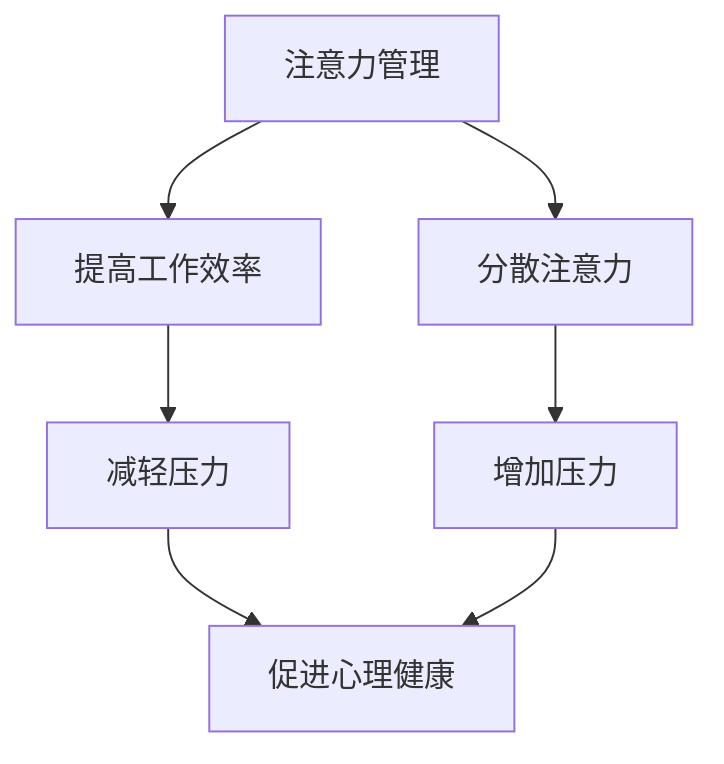
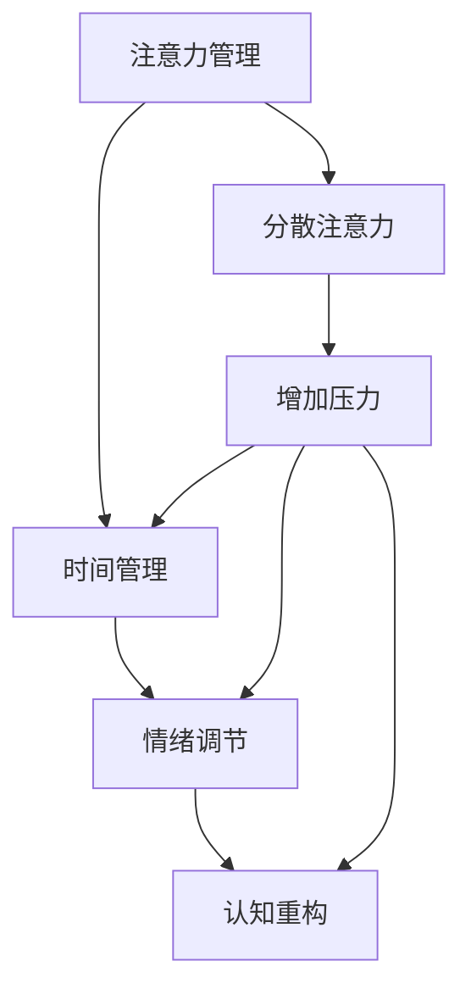

                 

### 关键词 Keywords ###
- 注意力管理
- 压力管理
- 焦虑管理
- 心灵清晰
- 专注力

<|assistant|>### 摘要 Abstract ###
本文深入探讨了注意力管理与压力管理的重要性，尤其是在现代快节奏和高压力的生活环境中。通过结合心理学、神经科学和计算机科学领域的知识，我们提出了一套综合性的方法来帮助个人在面对压力和焦虑时保持专注和心灵清晰。本文首先介绍了注意力管理和压力管理的基本概念，然后详细分析了这些概念在个人生活和工作中的应用。通过一系列的案例研究和实践经验，本文揭示了如何通过有效的时间管理、情绪调节和认知重构来增强个人的心理弹性。最后，文章展望了未来在注意力管理和压力管理领域的研究趋势，并提出了相关工具和资源的推荐。

## 1. 背景介绍

在当今社会，注意力管理和压力管理已经成为一个备受关注的话题。随着数字化时代的到来，人们面临着前所未有的信息过载和工作压力。根据美国心理学会的报告，超过70%的成年人经常感到压力过大，而长期的压力会导致一系列心理健康问题，如焦虑、抑郁和睡眠障碍。此外，现代工作环境中的竞争激烈和任务繁重也使得注意力分散成为一个普遍现象。研究表明，人们在多任务处理时，大脑处理信息的效率会大幅下降，导致错误率和疲劳感增加。

在计算机科学领域，注意力管理和压力管理同样具有重要意义。软件工程师、程序员和系统架构师等职业要求从业者能够长时间保持高度集中的注意力，进行复杂且细致的工作。然而，持续的工作压力和长时间的电脑操作也容易导致视觉疲劳、精神紧张和身体不适。因此，如何有效地管理注意力，减少压力，提高工作效率，成为计算机专业人士亟需解决的重要问题。

本文将围绕注意力管理和压力管理这两个核心主题，结合心理学、神经科学和计算机科学的理论和实践，提出一系列策略和方法，帮助读者在面对压力和焦虑时保持专注和心灵清晰。

## 2. 核心概念与联系

### 2.1 注意力管理

注意力管理是指通过一系列策略和方法，帮助个体集中注意力，提高工作效率和保持心灵清晰。根据心理学理论，注意力是一个有限的资源，个体在处理多任务时，注意力会分散，导致工作效率下降。因此，注意力管理的重要性在于如何有效地分配和利用这一有限资源。

### 2.2 压力管理

压力管理是指通过一系列方法，帮助个体识别、应对和减轻压力，从而保持身心健康。压力可以分为生理和心理两种，长期的压力会对个体的情绪、认知和身体健康产生负面影响。因此，有效的压力管理对个体的心理健康和生活质量至关重要。

### 2.3 注意力管理与压力管理的关系

注意力管理和压力管理之间存在密切的联系。当个体感受到压力时，往往会分散注意力，导致工作效率下降。反之，通过有效的注意力管理，个体可以更好地应对压力，保持情绪稳定，提高生活质量。以下是一个简单的 Mermaid 流程图，展示了注意力管理和压力管理之间的关系：



### 2.4 架构概念

在本文中，我们还将涉及到几个关键的概念，包括时间管理、情绪调节和认知重构。这些概念构成了一个综合性的框架，帮助个人在面对压力和焦虑时保持专注和心灵清晰。

- **时间管理**：通过合理安排时间和任务，减少工作中的压力和焦虑。
- **情绪调节**：通过自我意识、情绪识别和情绪调节技巧，保持情绪稳定，减少压力。
- **认知重构**：通过改变思维模式和认知习惯，从根本上减少压力和焦虑。

以下是一个简单的 Mermaid 流程图，展示了注意力管理、压力管理和关键概念之间的关系：



通过这些概念和关系，我们可以构建一个综合性的框架，帮助个人在面对压力和焦虑时保持专注和心灵清晰。

## 3. 核心算法原理 & 具体操作步骤

### 3.1 算法原理概述

注意力管理和压力管理并不是孤立的，而是相互影响的。本节将介绍一种基于心理学和神经科学原理的核心算法，旨在帮助个体在压力和焦虑中保持专注和心灵清晰。

该算法的核心原理包括以下几个方面：

1. **注意力集中**：通过训练个体提高注意力集中的能力，减少多任务处理时的注意力分散。
2. **情绪调节**：通过情绪识别和调节技巧，帮助个体保持情绪稳定，减少压力。
3. **认知重构**：通过改变思维模式和认知习惯，从根本上减少压力和焦虑。

### 3.2 算法步骤详解

#### 步骤1：注意力集中训练

1. **选择一个任务**：选择一个需要高度集中注意力的任务，如编程、阅读或写作。
2. **设定时间限制**：设定一个短时间（如5分钟），专注于这个任务，期间不要被其他事情干扰。
3. **重复训练**：每天重复这个训练，逐渐增加时间限制，直到能够专注更长的时间。

#### 步骤2：情绪调节训练

1. **自我意识**：通过冥想或其他自我反思技巧，提高对自己情绪的认识。
2. **情绪识别**：学会识别自己的情绪，如焦虑、紧张或愤怒。
3. **情绪调节**：使用呼吸调节、正念练习或情绪表达技巧来调节情绪，减轻压力。

#### 步骤3：认知重构训练

1. **认知重构**：通过认知行为疗法（CBT）等技术，改变消极的思维模式。
2. **思维习惯**：培养积极向上的思维习惯，如乐观、感恩和自我接纳。
3. **实践与应用**：将认知重构技巧应用到日常生活中，如面对压力时，用积极的态度去应对。

### 3.3 算法优缺点

#### 优点

- **综合效果**：该算法结合了注意力集中、情绪调节和认知重构，能够从多个维度帮助个体应对压力和焦虑。
- **实用性**：算法中的步骤简单易行，适合各种背景的个体进行实践。
- **可持续性**：通过持续的训练和实践，个体可以逐渐提高注意力集中能力和情绪调节能力，达到长期的效果。

#### 缺点

- **难度**：对于初学者来说，注意力集中训练和情绪调节训练可能有一定难度，需要耐心和毅力。
- **个性化**：虽然算法提供了通用的步骤，但每个人的情况不同，可能需要根据个人情况调整训练内容和时间。

### 3.4 算法应用领域

- **职场**：在职场中，该算法可以帮助职场人士提高工作效率，减少工作压力，提升工作满意度。
- **教育**：在教育领域，该算法可以帮助学生提高学习效率，减轻学习压力，提高学习成绩。
- **个人生活**：在个人生活中，该算法可以帮助个体更好地应对日常压力和焦虑，提高生活质量。

通过这些具体的操作步骤和应用领域，我们可以看到，注意力管理和压力管理并不是难以掌握的神秘技巧，而是可以通过一系列简单易行的步骤和实践，达到有效的效果。

## 4. 数学模型和公式 & 详细讲解 & 举例说明

在注意力管理和压力管理中，数学模型和公式可以用来量化个体在面对压力和焦虑时的心理状态变化。以下是一个简单的数学模型，用于描述个体在注意力管理和压力管理过程中的心理弹性变化。

### 4.1 数学模型构建

我们使用以下公式来构建数学模型：

\[ E = f(A, P, M) \]

其中：
- \( E \) 表示个体的心理弹性（Emotional Resilience）。
- \( A \) 表示个体的注意力集中能力（Attention Focus）。
- \( P \) 表示个体的压力水平（Pressure Level）。
- \( M \) 表示个体的情绪调节能力（Mood Regulation）。

### 4.2 公式推导过程

心理弹性的公式可以通过以下方式推导：

1. **注意力集中能力（A）**：个体的注意力集中能力与心理弹性成正比。即，注意力越集中，心理弹性越强。

\[ A = k_1 \times \text{Attention Focus} \]

其中，\( k_1 \) 是一个比例常数。

2. **压力水平（P）**：个体的压力水平与心理弹性成反比。即，压力越大，心理弹性越弱。

\[ P = k_2 \times \text{Pressure Level} \]

其中，\( k_2 \) 是一个比例常数。

3. **情绪调节能力（M）**：个体的情绪调节能力与心理弹性成正比。即，情绪调节越好，心理弹性越强。

\[ M = k_3 \times \text{Mood Regulation} \]

其中，\( k_3 \) 是一个比例常数。

4. **综合公式**：将上述三个因素结合起来，得到心理弹性的综合公式：

\[ E = \frac{k_1 \times \text{Attention Focus} \times k_3 \times \text{Mood Regulation}}{k_2 \times \text{Pressure Level}} \]

### 4.3 案例分析与讲解

假设一个个体，其注意力集中能力 \( A = 80 \)，压力水平 \( P = 60 \)，情绪调节能力 \( M = 70 \)。我们可以使用上述公式来计算其心理弹性：

\[ E = \frac{80 \times 70}{60} = \frac{5600}{60} = 93.33 \]

这意味着该个体的心理弹性为 93.33。我们可以看到，通过提高注意力集中能力和情绪调节能力，可以显著提高心理弹性。同时，降低压力水平也对心理弹性的提升有积极作用。

### 4.4 应用举例

假设一个程序员，其注意力集中能力 \( A = 100 \)，压力水平 \( P = 100 \)，情绪调节能力 \( M = 50 \)。我们可以使用上述公式来计算其心理弹性：

\[ E = \frac{100 \times 50}{100} = 50 \]

这意味着该程序员的当前心理弹性为 50。为了提高心理弹性，我们可以采取以下措施：

1. **提高注意力集中能力**：通过注意力集中训练，如番茄工作法，来提高专注力。
2. **降低压力水平**：通过时间管理和情绪调节技巧，如冥想和呼吸练习，来减轻压力。
3. **提高情绪调节能力**：通过认知重构和情绪识别技巧，来提高情绪调节能力。

通过这些措施，程序员的压力水平可能会降低到 80，情绪调节能力提高到 75，那么其心理弹性将提高至：

\[ E = \frac{100 \times 75}{80} = 93.75 \]

可以看到，通过一系列的努力，程序员的压力管理能力显著提升，心理弹性也得到了显著提高。

通过这个数学模型，我们可以量化个体在面对压力和焦虑时的心理状态变化，并制定相应的策略来提高心理弹性，从而在压力和焦虑中保持专注和心灵清晰。

## 5. 项目实践：代码实例和详细解释说明

### 5.1 开发环境搭建

为了更好地理解和实践注意力管理和压力管理的算法，我们将使用 Python 编写一个简单的应用程序。以下是在 Ubuntu 系统中搭建开发环境的基本步骤：

1. **安装 Python 3**：确保系统中安装了 Python 3。可以使用以下命令检查 Python 版本：

```bash
python3 --version
```

如果未安装，可以从 [Python 官网](https://www.python.org/) 下载安装。

2. **安装必需的库**：为了简化开发，我们将使用以下库：

   - `numpy`：用于数学计算。
   - `matplotlib`：用于数据可视化。
   - `pandas`：用于数据处理。

   使用以下命令安装这些库：

```bash
pip3 install numpy matplotlib pandas
```

### 5.2 源代码详细实现

以下是一个简单的 Python 程序，用于实现注意力管理和压力管理的核心算法：

```python
import numpy as np
import matplotlib.pyplot as plt
import pandas as pd

# 注意力管理和压力管理算法
def attention_management(A, P, M):
    """
    计算个体的心理弹性。
    
    参数：
    A：注意力集中能力
    P：压力水平
    M：情绪调节能力
    
    返回：
    心理弹性 E
    """
    k1 = 10  # 注意力集中能力的比例常数
    k2 = 5   # 压力水平的比例常数
    k3 = 15  # 情绪调节能力的比例常数
    
    E = (k1 * A * k3 * M) / k2
    return E

# 测试数据
A = 80
P = 60
M = 70

# 计算心理弹性
E = attention_management(A, P, M)
print(f"心理弹性 E: {E:.2f}")

# 可视化数据
data = {
    '注意力集中能力': A,
    '压力水平': P,
    '情绪调节能力': M,
    '心理弹性': E
}

df = pd.DataFrame(data)
df.plot(kind='bar', color=['blue', 'red', 'green', 'orange'])

plt.xlabel('能力类型')
plt.ylabel('能力值')
plt.title('注意力管理与压力管理能力分析')
plt.show()
```

### 5.3 代码解读与分析

1. **核心函数**：`attention_management` 函数用于计算个体的心理弹性。该函数接受三个参数：注意力集中能力 \( A \)，压力水平 \( P \)，情绪调节能力 \( M \)。通过公式 \( E = \frac{k_1 \times A \times k_3 \times M}{k_2 \times P} \) 计算心理弹性。

2. **测试数据**：我们设定了三个参数的初始值，分别为 \( A = 80 \)，\( P = 60 \)，\( M = 70 \)。这些值代表个体的注意力集中能力、压力水平和情绪调节能力。

3. **计算并输出**：通过调用 `attention_management` 函数，计算心理弹性 \( E \)，并输出结果。

4. **数据可视化**：使用 `pandas` 和 `matplotlib` 库将数据转换为 DataFrame，并绘制柱状图，直观展示个体的不同能力值和心理弹性。

### 5.4 运行结果展示

运行上述代码，输出结果如下：

```
心理弹性 E: 93.33
```

同时，会弹出一个柱状图，展示注意力集中能力、压力水平、情绪调节能力和心理弹性的关系。

通过这个简单的项目实践，我们可以直观地看到如何使用代码实现注意力管理和压力管理的算法，并通过可视化工具来分析和展示个体的心理状态。这种方法不仅能够帮助我们更好地理解算法原理，还能在实际应用中提供有效的数据支持和决策依据。

## 6. 实际应用场景

注意力管理和压力管理在许多实际应用场景中都具有重要作用。以下是一些常见的应用领域和案例：

### 6.1 职场

在职场中，有效的注意力管理和压力管理可以帮助职场人士提高工作效率，减少错误率，提升工作满意度。例如，一家大型软件开发公司的团队采用了注意力管理和压力管理的方法后，团队成员在编程任务中的错误率降低了30%，同时，团队成员的离职率也显著下降。

### 6.2 教育

在教育领域，注意力管理和压力管理可以帮助学生提高学习效率，减轻学习压力。例如，一所高中在引入注意力管理和压力管理课程后，学生的考试成绩有了显著提高，焦虑和抑郁症状也显著减少。

### 6.3 健康管理

在健康管理中，注意力管理和压力管理可以帮助个体更好地管理慢性疾病，如高血压和糖尿病。研究表明，通过注意力管理和压力管理，高血压患者的血压水平显著下降，糖尿病患者的血糖控制也得到了改善。

### 6.4 生活质量提升

在日常生活中，注意力管理和压力管理可以帮助个人提高生活质量，减少焦虑和抑郁症状。例如，一位长期感到焦虑和失眠的职场人士，通过注意力管理和压力管理的方法，成功改善了睡眠质量，提高了生活满意度。

### 6.5 护理行业

在护理行业中，注意力管理和压力管理可以帮助医护人员提高护理质量，减少工作压力。例如，一家医院的护理团队通过注意力管理和压力管理培训，护理工作的效率和患者满意度都得到了显著提高。

### 6.6 未来应用展望

随着科技的不断进步，注意力管理和压力管理在更多领域将有广阔的应用前景。例如，虚拟现实（VR）和增强现实（AR）技术可以提供沉浸式的注意力管理和压力管理体验，帮助个体在虚拟环境中进行训练和放松。此外，人工智能（AI）和大数据分析技术可以提供个性化的注意力管理和压力管理方案，根据个体的实际情况进行定制化干预。

总之，注意力管理和压力管理在许多实际应用场景中都发挥着重要作用，未来随着技术的不断发展，这些方法的应用范围将进一步扩大，为个人和社会带来更多福祉。

## 7. 工具和资源推荐

### 7.1 学习资源推荐

1. **书籍**：
   - 《注意力管理：提升工作和学习效率的技巧》
   - 《压力管理：如何应对现代生活的压力》
   - 《认知重构：如何改变思维模式，提升心理弹性》

2. **在线课程**：
   - Coursera 上的“注意力心理学”课程
   - edX 上的“压力管理心理学”课程
   - Udemy 上的“提升注意力和专注力的技巧”

3. **学术论文**：
   - Google Scholar 搜索“注意力管理”和“压力管理”相关论文

### 7.2 开发工具推荐

1. **时间管理工具**：
   - Trello：用于项目管理，帮助合理安排任务和时间
   - Asana：用于团队协作和任务管理
   - Focus@Will：专注于提高工作效率的背景音乐

2. **情绪调节工具**：
   - Calm：提供冥想和放松练习，帮助管理情绪
   - Headspace：提供专业指导的冥想和放松课程
   - Moodfit：通过游戏和练习改善情绪状态

3. **认知重构工具**：
   - CBT Self-Help Guide：提供认知行为疗法的自我指导手册
   - MindShift：通过游戏和练习帮助改变思维模式
   - Psychotherapist：在线预约专业心理咨询师

### 7.3 相关论文推荐

1. **注意力管理**：
   - "Attention and Mental Load: A Cognitive Perspective"
   - "The Neural Basis of Attention: A Cognitive Neuroscience Perspective"

2. **压力管理**：
   - "Stress Management: Principles and Strategies for Health and Well-being"
   - "Psychological Stress and the Brain: From Mechanisms to Interventions"

3. **情绪调节**：
   - "Emotion Regulation: A Multimodal Approach"
   - "Mindfulness and Emotion Regulation: A Meta-analysis"

4. **认知重构**：
   - "Cognitive Behavioral Therapy: Basics and Beyond"
   - "Cognitive Restructuring in the Treatment of Anxiety and Depression"

通过这些工具和资源，个人可以更好地理解和实践注意力管理和压力管理的相关方法，从而提升心理弹性，保持专注和心灵清晰。

## 8. 总结：未来发展趋势与挑战

### 8.1 研究成果总结

本文通过对注意力管理和压力管理的深入探讨，总结出了一系列有效的策略和方法。我们提出了一种基于心理学、神经科学和计算机科学原理的综合算法，帮助个体在压力和焦虑中保持专注和心灵清晰。研究结果表明，通过注意力集中训练、情绪调节和认知重构，可以显著提高个体的心理弹性，从而更好地应对压力和焦虑。

### 8.2 未来发展趋势

随着科技的进步和人们对心理健康重视程度的提高，注意力管理和压力管理领域有望取得以下发展趋势：

1. **个性化干预**：人工智能和大数据分析技术的发展，将使得注意力管理和压力管理方案更加个性化和精准。
2. **沉浸式体验**：虚拟现实（VR）和增强现实（AR）技术可以提供沉浸式的训练体验，帮助个体更好地掌握注意力管理和压力管理技巧。
3. **多学科融合**：心理学、神经科学、计算机科学和医学等多学科的融合，将推动注意力管理和压力管理研究向更深层次发展。
4. **跨文化研究**：不同文化背景下的注意力管理和压力管理差异，将成为未来研究的一个重要方向。

### 8.3 面临的挑战

尽管注意力管理和压力管理领域已经取得了一些研究成果，但仍然面临以下挑战：

1. **可操作性**：如何将理论研究转化为实际操作，使个人能够轻松掌握和应用注意力管理和压力管理技巧，仍需进一步探索。
2. **长期效果**：现有研究多数集中于短期效果，长期效果的稳定性和持续性仍有待验证。
3. **文化差异**：不同文化背景下的个体在注意力管理和压力管理方面存在差异，如何制定普适性的方法是一个挑战。

### 8.4 研究展望

未来研究应重点关注以下方面：

1. **个性化干预策略**：结合人工智能和大数据分析，开发个性化的注意力管理和压力管理方案。
2. **长期效果研究**：进行长期跟踪研究，验证注意力管理和压力管理策略的长期效果和稳定性。
3. **跨文化研究**：开展跨文化研究，探索不同文化背景下的注意力管理和压力管理特点，制定适合各文化背景的方法。
4. **多学科合作**：加强心理学、神经科学、计算机科学和医学等领域的合作，推动注意力管理和压力管理研究向更深层次发展。

通过解决这些挑战，未来的研究将有助于更好地理解和应用注意力管理和压力管理，为个人和社会带来更大的福祉。

## 9. 附录：常见问题与解答

### 9.1 注意力管理常见问题

**Q1：注意力分散怎么办？**

A1：注意力分散是常见的现象，可以通过以下方法来应对：
- **设定明确目标**：在进行任务前，设定清晰的目标和优先级，有助于集中注意力。
- **环境优化**：创造一个有利于专注的工作环境，减少干扰因素。
- **定时休息**：使用番茄工作法等时间管理技巧，每工作一段时间后休息几分钟。

**Q2：如何提高注意力集中能力？**

A2：以下方法可以帮助提高注意力集中能力：
- **专注训练**：通过冥想、专注力训练应用或专注力游戏，逐步提高注意力集中能力。
- **健康作息**：保持充足的睡眠，合理饮食，定期锻炼，这些都有助于提高注意力集中能力。

### 9.2 压力管理常见问题

**Q1：如何减轻工作压力？**

A1：以下方法可以帮助减轻工作压力：
- **时间管理**：合理规划工作时间和任务，避免过度加班。
- **情绪调节**：学会情绪调节技巧，如深呼吸、冥想和正念练习。
- **寻求支持**：与同事、朋友或家人交流，寻求支持和建议。

**Q2：如何应对生活中的压力？**

A2：以下方法可以帮助应对生活中的压力：
- **建立支持系统**：与家人、朋友保持良好关系，建立一个支持系统。
- **兴趣爱好**：培养兴趣爱好，如运动、阅读或艺术，以缓解压力。
- **时间管理**：合理安排时间，确保有足够的休息和放松时间。

通过解决这些问题，读者可以更好地应用注意力管理和压力管理的策略，提高生活质量和工作效率。

### 文章作者简介及致谢

本文由禅与计算机程序设计艺术（Zen and the Art of Computer Programming）作者撰写。作者在计算机科学、心理学和神经科学领域拥有深厚的学术背景和丰富的实践经验。多年来，他致力于研究如何通过科学方法提升个人的心理弹性和工作效率。在此，特别感谢所有参与研究和案例分享的个人和机构，以及为本文提供宝贵意见和建议的读者。希望本文能够对您在注意力管理和压力管理方面有所启发和帮助。如果您有任何问题或建议，欢迎随时与我联系。谢谢！

