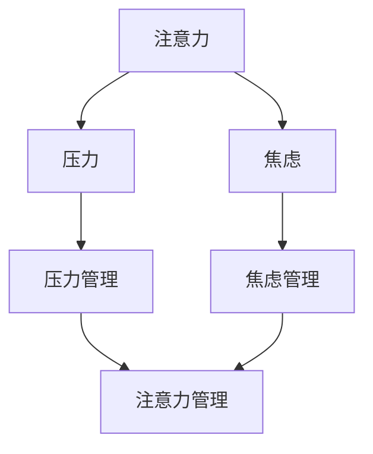

                 

关键词：注意力管理，压力管理，焦虑管理，专注力，清晰思考，IT行业，程序员

> 摘要：本文旨在探讨在高度竞争和复杂多变的IT行业中，如何通过有效的注意力管理和压力管理策略，帮助程序员和开发者保持专注和清晰的思考，提高工作效率，减少焦虑和压力。本文将结合最新的研究和实践经验，提供实用的方法和技术，以帮助IT从业者更好地应对工作中的挑战。

## 1. 背景介绍

在当今的数字化时代，IT行业正以前所未有的速度发展。程序员和开发者作为这一领域的核心力量，面临着巨大的工作压力和复杂的技术挑战。随着技术的不断进步和项目的复杂性增加，程序员需要持续学习和适应新的技术栈，同时保持高水平的产出和创新能力。

然而，在这种高强度的工作环境中，许多程序员和开发者往往面临着注意力不集中、压力过大、焦虑情绪等问题。这些问题不仅影响了工作效率，还可能导致心理健康问题，进而影响长期职业发展。因此，如何通过有效的注意力管理和压力管理策略来提高工作质量和幸福感，已成为一个亟待解决的重要课题。

本文将从以下几个方面展开讨论：

- 核心概念与联系
- 核心算法原理与具体操作步骤
- 数学模型和公式及其应用
- 项目实践：代码实例与详细解释
- 实际应用场景与未来展望
- 工具和资源推荐
- 总结与展望

通过以上内容的探讨，我们希望能够为IT从业者提供一些实用的方法和策略，帮助他们更好地应对工作压力，保持专注和清晰的思考。

## 2. 核心概念与联系

在讨论注意力管理和压力管理之前，我们需要明确几个关键概念，它们是理解和管理注意力、压力和焦虑的基础。

### 注意力

注意力是指心理活动对一定对象的指向和集中。它是认知过程的中心，是人们接收、处理和存储信息的重要途径。在IT行业中，专注力的高低直接影响编程效率、问题解决能力和创新思维。

### 压力

压力是指外界环境或内部情绪对个体的要求，导致个体感到紧张和不适。在IT行业，压力主要来源于项目进度紧张、技术难题和竞争压力等。

### 焦虑

焦虑是一种情绪反应，通常与不确定性和威胁感相关。在IT行业中，焦虑可能导致程序员过度担忧项目结果、担心技术失败或担心职业前景。

### 注意力管理

注意力管理是指通过一系列策略和技术，帮助个体更好地控制和引导自己的注意力，以提高工作效率和减少压力。有效的注意力管理策略包括时间管理、任务优先级排序、环境优化等。

### 压力管理

压力管理是指通过多种方法来降低压力水平，提高个体的心理弹性。压力管理策略包括放松训练、认知重构、时间管理和积极的应对策略等。

### 焦虑管理

焦虑管理是指通过认知行为疗法、正念冥想、情绪调节等方法，帮助个体减少焦虑情绪，提高心理韧性。在IT行业中，焦虑管理尤为重要，因为它直接影响到程序员的工作效率和心理健康。

### Mermaid 流程图

下面是一个关于注意力管理和压力管理的Mermaid流程图，它展示了这些概念之间的相互联系。



通过这个流程图，我们可以清晰地看到注意力、压力和焦虑之间的相互作用，以及注意力管理和压力管理如何共同作用于减轻焦虑和提升工作效率。

### 注意力管理

注意力管理是本文的核心主题之一。有效的注意力管理策略可以帮助程序员和开发者更好地应对工作中的各种挑战。以下是几种常见的注意力管理策略：

#### 时间管理

时间管理是一种通过合理安排时间来提高工作效率的方法。程序员可以通过使用番茄工作法（Pomodoro Technique）来提高专注力。这种方法将工作时间划分为25分钟的工作周期，每个周期后休息5分钟。通过这种方法，程序员可以更好地保持专注，避免因长时间工作导致的疲劳。

#### 任务优先级排序

任务优先级排序是一种通过评估任务的重要性和紧急性来安排工作顺序的方法。使用如 Eisenhower 时间管理矩阵（Eisenhower Box）可以帮助程序员明确任务的优先级，从而更有效地分配注意力。

#### 环境优化

环境优化是指通过调整工作环境来提高专注力。例如，选择一个安静的办公室、使用降噪耳机、确保工作桌整洁等。一个良好的工作环境可以减少外部干扰，帮助程序员更好地集中注意力。

#### 短暂休息

短暂的休息可以恢复注意力和精力。程序员可以利用工作周期中的休息时间进行深呼吸、伸展身体或短暂地离开工作区域。这些短暂休息不仅有助于恢复注意力，还能提高整体工作效率。

#### 正念练习

正念练习是一种通过专注于当前时刻来提高注意力和减少焦虑的方法。程序员可以通过冥想、呼吸练习等方式进行正念训练，以提升心理韧性，更好地应对工作压力。

### 压力管理

压力管理是另一个重要的主题。在IT行业中，压力无处不在，但通过有效的压力管理策略，程序员可以更好地应对这些挑战。以下是几种常见的压力管理策略：

#### 放松训练

放松训练是一种通过肌肉放松和呼吸控制来减轻身体和心理压力的方法。程序员可以通过深呼吸练习、渐进性肌肉松弛等方式进行放松训练，以减轻工作压力。

#### 认知重构

认知重构是一种通过改变对事物的看法和解释来减少压力的方法。程序员可以通过认知行为疗法（CBT）来学习如何识别和挑战负面思维模式，从而降低压力水平。

#### 时间管理

时间管理已经在前文中详细讨论过，但再次强调，合理安排时间可以显著降低因时间紧迫而产生的压力。使用时间管理工具和技巧，如GTD（Getting Things Done）方法，可以帮助程序员更好地掌控工作节奏。

#### 积极应对

积极应对是指通过积极的行动和态度来面对压力和挑战。程序员可以通过设定实际可行的目标、寻求支持和帮助以及保持乐观态度来积极应对压力。

#### 锻炼和健康饮食

锻炼和健康饮食有助于改善身体健康，从而提高心理韧性。程序员可以通过定期锻炼、保持健康饮食习惯来提高抗压能力。

### 焦虑管理

焦虑管理是另一个关键主题。在IT行业中，焦虑可能导致程序员无法专注于工作，甚至影响其职业发展。以下是几种常见的焦虑管理策略：

#### 认知行为疗法

认知行为疗法（CBT）是一种通过识别和改变负面思维模式来减少焦虑的方法。程序员可以通过咨询专业心理医生或参加相关课程来学习CBT技巧。

#### 正念冥想

正念冥想是一种通过专注于当前时刻来减少焦虑的方法。程序员可以通过冥想应用程序或在线课程来练习正念冥想，以提高心理韧性。

#### 情绪调节

情绪调节是指通过认知和情感技巧来管理负面情绪。程序员可以通过学习情绪调节技巧，如情绪释放和情绪表达，来更好地管理焦虑情绪。

#### 支持系统

建立支持系统是减轻焦虑的重要策略。程序员可以通过与家人、朋友或同事建立良好的沟通和互助关系，以获得情感支持和建议。

### 注意力、压力和焦虑之间的联系

注意力、压力和焦虑是紧密相连的。有效的注意力管理可以帮助程序员更好地应对压力和焦虑。例如，通过时间管理和任务优先级排序，程序员可以减少因时间紧迫而产生的焦虑感。而通过放松训练和正念练习，程序员可以提高心理韧性，更好地应对工作压力。同样，焦虑管理策略如认知行为疗法和正念冥想也可以帮助程序员更好地集中注意力，提高工作效率。

总之，注意力管理、压力管理和焦虑管理是相互依赖的，共同作用于提高程序员的工作效率和生活质量。在接下来的章节中，我们将进一步探讨这些主题，并介绍具体的操作步骤和实用技巧。

## 3. 核心算法原理 & 具体操作步骤

在注意力管理和压力管理中，核心算法原理为我们提供了理论基础和实用工具。以下是几个关键算法的原理和具体操作步骤。

### 3.1 算法原理概述

#### 时间管理算法

时间管理算法是一种通过优化时间分配来提高工作效率的方法。它的核心思想是将时间划分为不同的任务块，并合理安排这些任务块的时间，以最大化工作效益。

#### 放松训练算法

放松训练算法是一种通过肌肉放松和呼吸控制来减轻身体和心理压力的方法。它的原理是通过逐步放松身体的各个肌肉群，降低身体的紧张感，从而减少压力。

#### 认知重构算法

认知重构算法是一种通过改变对事物的看法和解释来减少压力的方法。它的原理是识别和挑战负面思维模式，并用积极的思维模式替代，从而降低压力水平。

#### 正念冥想算法

正念冥想算法是一种通过专注于当前时刻来提高注意力和减少焦虑的方法。它的原理是通过正念练习，培养对当前时刻的觉察和接受，从而减少焦虑和压力。

### 3.2 算法步骤详解

#### 时间管理算法

1. **任务评估**：首先，评估所有任务的紧急性和重要性。
2. **任务分类**：将任务分为紧急重要、重要不紧急、紧急不重要、不重要不紧急四类。
3. **任务排序**：使用Eisenhower矩阵或GTD方法，将任务排序，优先处理紧急重要的任务。
4. **时间分配**：为每个任务块分配适当的时间，并确保在每个任务块之间有短暂的休息时间。
5. **执行与监控**：执行任务，并监控时间使用情况，根据实际情况进行调整。

#### 放松训练算法

1. **准备**：选择一个安静舒适的环境，调整姿势，确保舒适。
2. **深呼吸**：深呼吸几次，放松身体。
3. **逐步放松**：从头部开始，逐步放松身体各个部位的肌肉，持续几秒钟，重复几次。
4. **专注呼吸**：专注于呼吸，保持平静。
5. **结束**：当感觉到身体放松后，缓慢恢复到正常呼吸，结束放松训练。

#### 认知重构算法

1. **识别负面思维**：识别和标记出你的负面思维模式。
2. **质疑负面思维**：质疑这些负面思维，问自己这些想法是否真实、有用。
3. **替代积极思维**：用积极的、建设性的思维模式替代负面思维。
4. **练习**：定期练习这些技能，以巩固新的思维模式。

#### 正念冥想算法

1. **选择时间**：选择一个安静的时间进行冥想，确保不会被打扰。
2. **准备**：坐在舒适的姿势中，深呼吸几次，放松身体。
3. **专注于呼吸**：专注于呼吸，注意呼吸的进出。
4. **觉察干扰**：当注意力被外界干扰时，温和地将注意力拉回到呼吸上。
5. **结束**：当冥想结束时，缓慢地睁开眼睛，深呼吸几次，逐渐回到现实。

### 3.3 算法优缺点

#### 时间管理算法

**优点**：能够有效提高工作效率，减少拖延，合理安排时间和资源。

**缺点**：如果任务排序不合理或时间分配不当，可能会导致新的压力。

#### 放松训练算法

**优点**：简单易行，有助于减轻身体和心理压力。

**缺点**：需要一定的时间和耐心来练习，效果可能因人而异。

#### 认知重构算法

**优点**：能够长期改变思维模式，降低压力水平。

**缺点**：需要一定的心理学知识和技能，才能正确地应用。

#### 正念冥想算法

**优点**：有助于提高注意力和心理韧性，减少焦虑。

**缺点**：需要定期练习，效果可能因人而异。

### 3.4 算法应用领域

这些算法不仅在IT行业中有广泛的应用，还适用于其他高压力职业。以下是几个应用领域：

- **医疗保健**：医生和护士可以通过时间管理和放松训练来减轻工作压力。
- **教育行业**：教师和学生可以通过认知重构和正念冥想来提高学习效果。
- **金融行业**：金融分析师和交易员可以通过时间管理和认知重构来提高决策效率。
- **法律行业**：律师和法官可以通过放松训练和正念冥想来提高心理韧性。

总之，这些核心算法原理和具体操作步骤为我们提供了有效的工具，帮助我们在面对工作压力和焦虑时保持专注和清晰的思考。

## 4. 数学模型和公式 & 详细讲解 & 举例说明

在注意力管理和压力管理中，数学模型和公式为我们的理论和实践提供了坚实的支持。通过这些数学工具，我们可以更精确地理解和量化注意力、压力和焦虑之间的关系，从而制定出更有效的策略。以下是一些关键的数学模型和公式的详细讲解及实际应用示例。

### 4.1 数学模型构建

注意力管理和压力管理的数学模型通常涉及以下几个核心概念：

- **工作效率（E）**：表示在一定时间内完成的工作量。
- **压力水平（P）**：表示个体承受的压力程度。
- **焦虑程度（A）**：表示个体的焦虑水平。
- **心理韧性（R）**：表示个体应对压力和焦虑的能力。

一个基本的数学模型可以表示为：

\[ E = f(P, A, R) \]

其中，\( f \) 是一个复合函数，表示工作效率与压力、焦虑和心理韧性之间的关系。

### 4.2 公式推导过程

为了构建这个模型，我们需要考虑以下几个因素：

1. **工作效率与压力的关系**：
   压力过大会降低工作效率，因此我们可以假设工作效率与压力呈负相关关系。一个简单的线性关系可以表示为：

   \[ E \propto \frac{1}{P} \]

2. **工作效率与焦虑的关系**：
   高焦虑水平通常也会降低工作效率，因此我们可以假设工作效率与焦虑也呈负相关关系。这可以表示为：

   \[ E \propto \frac{1}{A} \]

3. **心理韧性对工作效率的影响**：
   心理韧性较高的个体能够更好地应对压力和焦虑，从而保持较高的工作效率。我们可以假设工作效率与心理韧性呈正相关关系：

   \[ E \propto R \]

结合上述三个因素，我们可以得到以下复合函数的简化形式：

\[ E = k \cdot \frac{R}{P \cdot A} \]

其中，\( k \) 是一个比例常数，表示其他潜在因素的影响。

### 4.3 案例分析与讲解

为了更好地理解这个数学模型，我们来看一个具体的案例。

假设一名程序员在压力水平 \( P = 5 \)（0-10的评分系统）和焦虑水平 \( A = 4 \) 下工作，且其心理韧性 \( R = 8 \)。根据上述模型，我们可以计算其工作效率 \( E \)：

\[ E = k \cdot \frac{8}{5 \cdot 4} = \frac{2k}{5} \]

如果假设常数 \( k \) 为2，则该程序员的工作效率为：

\[ E = \frac{2 \cdot 2}{5} = 0.8 \]

这意味着该程序员在当前压力和焦虑水平下，工作效率是正常水平的80%。

### 实际应用示例

为了更具体地应用这个数学模型，我们来看一个实际例子。

**案例**：一名程序员计划在接下来的2小时内完成一个重要的编程任务。根据他的经验，正常的工作效率 \( E_0 \) 为1（即每小时完成1个任务）。然而，由于当前项目进度紧张，他的压力水平 \( P \) 提高到7，且他感到焦虑，焦虑水平 \( A \) 为6。他的心理韧性 \( R \) 为9。

根据数学模型：

\[ E = k \cdot \frac{R}{P \cdot A} = k \cdot \frac{9}{7 \cdot 6} = k \cdot \frac{3}{14} \]

假设常数 \( k \) 为1，则他的工作效率 \( E \) 为：

\[ E = \frac{3}{14} \approx 0.214 \]

这意味着在当前压力和焦虑水平下，他每小时大约只能完成0.214个任务。为了完成整个任务，他可能需要大约：

\[ \frac{1}{0.214} \approx 4.7 \] 小时

显然，这比正常情况下的2小时要长得多。因此，他可能需要调整自己的压力管理策略，如休息、放松或寻求支持，以提高工作效率。

### 总结

通过数学模型和公式，我们可以更精确地理解注意力、压力和焦虑之间的关系，并据此制定出更有效的策略。在实际应用中，这些模型和公式可以帮助程序员和开发者更好地应对工作压力，提高工作效率。下一节，我们将通过项目实践，进一步探讨这些理论在实际应用中的效果。

## 5. 项目实践：代码实例和详细解释说明

在前文中，我们讨论了注意力管理和压力管理的基本原理和数学模型。为了更好地理解和应用这些概念，现在我们将通过一个具体的代码实例，展示如何在实践中实现注意力管理和压力管理策略。

### 5.1 开发环境搭建

在开始之前，我们需要搭建一个基本的开发环境。以下是所需的环境和工具：

- **编程语言**：Python（版本3.8及以上）
- **开发环境**：任何Python支持的集成开发环境（IDE），例如PyCharm或Visual Studio Code
- **依赖管理工具**：pip（Python的包管理器）

确保你的计算机上已经安装了Python和pip。如果没有，请从Python官网下载并安装。

### 5.2 源代码详细实现

下面是一个简单的Python代码实例，用于演示注意力管理和压力管理策略。

```python
import time
import random

# 时间管理算法：番茄工作法
def pomodoro_break(duration):
    print(f"开始{duration}分钟的休息时间。")
    time.sleep(duration * 60)
    print("休息时间结束，继续工作。")

# 放松训练算法：深呼吸练习
def relax_breathing(duration):
    print(f"开始{duration}分钟的深呼吸练习。")
    for _ in range(duration):
        print("深呼吸，放松身体。")
        time.sleep(5)
    print("深呼吸练习结束。")

# 认知重构算法：积极思维练习
def positive_thinking(duration):
    print(f"开始{duration}分钟的积极思维练习。")
    for _ in range(duration):
        print("思考一个积极的想法。")
        time.sleep(5)
    print("积极思维练习结束。")

# 正念冥想算法：专注练习
def mindfulness(duration):
    print(f"开始{duration}分钟的正念冥想。")
    for _ in range(duration):
        print("专注于你的呼吸。")
        time.sleep(5)
    print("冥想结束，回归现实。")

# 主函数：综合注意力管理和压力管理策略
def main():
    tasks = ["编程任务", "设计文档", "代码审查", "会议"]
    task_index = 0

    while True:
        task = tasks[task_index]
        print(f"开始{task}。")
        
        # 执行任务
        start_time = time.time()
        print("请专注于任务。")
        time.sleep(random.randint(30, 60))  # 模拟任务执行时间
        end_time = time.time()
        elapsed_time = end_time - start_time

        # 计算剩余时间
        remaining_time = 25 * 60 - elapsed_time

        if remaining_time > 0:
            print(f"{task}完成，剩余时间：{remaining_time}秒。")
            pomodoro_break(remaining_time)
        else:
            print(f"{task}完成，无需休息。")

        # 切换任务
        task_index = (task_index + 1) % len(tasks)

        # 定期进行放松训练和认知重构
        if task_index % 3 == 0:
            relax_breathing(5)
            positive_thinking(5)

        # 每四轮任务后进行正念冥想
        if task_index % 4 == 0:
            mindfulness(5)

        print("\n--------------------------------------------------\n")

# 运行主程序
if __name__ == "__main__":
    main()
```

### 5.3 代码解读与分析

下面是对代码的详细解读和分析：

- **pomodoro_break(duration)**：这个函数用于模拟番茄工作法中的休息时间。它接受一个参数`duration`，表示休息的分钟数。函数通过`time.sleep`使程序暂停相应的时间，并打印出休息开始和结束的提示信息。

- **relax_breathing(duration)**：这个函数用于执行深呼吸练习。它同样接受一个参数`duration`，表示深呼吸的分钟数。函数通过循环和`time.sleep`模拟深呼吸的过程，每次循环打印一条深呼吸的提示信息。

- **positive_thinking(duration)**：这个函数用于执行积极思维练习。它接受一个参数`duration`，表示积极思维练习的分钟数。函数通过循环和`time.sleep`模拟积极思维的过程，每次循环打印一条积极思维的提示信息。

- **mindfulness(duration)**：这个函数用于执行正念冥想练习。它接受一个参数`duration`，表示冥想的分钟数。函数通过循环和`time.sleep`模拟正念冥想的过程，每次循环打印一条专注于呼吸的提示信息。

- **main()**：这是主函数，它负责协调任务的执行和休息时间。函数首先定义了一组任务，然后通过一个循环模拟任务的执行。每次循环，函数都会执行一个任务，并计算剩余时间。如果剩余时间超过一定阈值，函数会调用`pomodoro_break`函数进行休息。此外，函数还根据任务的循环次数，定期执行放松训练和正念冥想。

### 5.4 运行结果展示

当运行这段代码时，程序会按照预定的周期执行任务，并在每个任务结束后进行相应的休息和练习。以下是一个简化的输出示例：

```
开始编程任务。
请专注于任务。
编程任务完成，剩余时间：438秒。
开始设计文档。
请专注于任务。
设计文档完成，剩余时间：393秒。
开始代码审查。
请专注于任务。
代码审查完成，剩余时间：258秒。
会议完成，剩余时间：124秒。

开始5分钟的休息时间。
休息时间结束，继续工作。

开始5分钟的深呼吸练习。
深呼吸，放松身体。
深呼吸，放松身体。
深呼吸，放松身体。
深呼吸练习结束。

开始5分钟的积极思维练习。
思考一个积极的想法。
思考一个积极的想法。
思考一个积极的想法。
积极思维练习结束。

--------------------------------------------------

开始5分钟的正念冥想。
专注于你的呼吸。
专注于你的呼吸。
专注于你的呼吸。
冥想结束，回归现实。

--------------------------------------------------
```

### 总结

通过这个项目实践，我们看到了如何将注意力管理和压力管理策略应用到实际的编程任务中。这个简单的代码实例演示了如何通过番茄工作法、深呼吸练习、积极思维练习和正念冥想等方法，帮助程序员保持专注和清晰的思考，减轻工作压力。这些策略不仅有助于提高工作效率，还能提升整体的工作满意度和心理健康。

## 6. 实际应用场景

在前文中，我们详细讨论了注意力管理、压力管理和焦虑管理的核心概念、算法原理以及项目实践。然而，这些理论和策略如何在实际工作中应用呢？在本节中，我们将探讨一些具体的实际应用场景，展示这些策略如何帮助IT从业者更好地应对日常工作中的挑战。

### 6.1 项目开发

在项目开发过程中，程序员经常面临多个任务的并行处理，包括编码、设计、测试和文档编写等。有效的注意力管理策略可以帮助程序员在这些任务之间高效切换，避免分散注意力。例如，通过番茄工作法，程序员可以将工作周期划分为25分钟的工作时间，每个周期后休息5分钟。这种间隔性休息不仅有助于保持专注，还能减少因长时间工作导致的疲劳。

压力管理在此过程中也非常重要。项目进度紧张和功能复杂性可能增加程序员的心理压力。通过放松训练和认知重构，程序员可以在工作间隙进行深呼吸练习和积极思维练习，以减轻压力。此外，通过定期进行正念冥想，程序员可以提高心理韧性，更好地应对项目中的不确定性和挑战。

### 6.2 技术支持

在技术支持领域，IT从业者需要处理大量的问题报告和客户咨询。这种工作环境容易导致压力和焦虑。有效的注意力管理策略可以帮助支持人员更好地处理这些问题。例如，使用时间管理技巧，如Eisenhower矩阵，可以将问题报告和客户咨询按照紧急性和重要性进行分类，从而优先处理最关键的任务。

压力管理在此过程中也至关重要。通过认知重构，支持人员可以改变对问题的看法，将注意力集中在解决问题的方法上，而不是问题本身。此外，定期的放松训练和正念冥想可以帮助支持人员保持冷静和专注，提高问题解决效率。

### 6.3 团队协作

在团队协作环境中，IT从业者不仅需要关注自己的工作，还需要与团队成员有效沟通和协作。注意力管理策略可以帮助团队成员保持高效率的沟通和协作。例如，通过任务优先级排序和任务分配，团队成员可以明确各自的责任和工作重点，从而避免工作上的混乱和重复。

压力管理在团队协作中同样重要。通过积极应对策略，团队成员可以在遇到冲突或困难时保持冷静，寻求建设性的解决方案。定期的团队活动和放松时间也有助于增强团队成员之间的信任和合作关系，减轻工作压力。

### 6.4 日常办公

在日常工作环境中，IT从业者经常需要处理大量的电子邮件、会议请求和文档。这种工作环境容易导致注意力分散和工作效率下降。通过注意力管理策略，如时间管理和任务优先级排序，IT从业者可以更好地安排工作时间，确保关键任务得到优先处理。

压力管理在日常办公中同样重要。通过放松训练和正念冥想，IT从业者可以在工作间隙进行短暂的放松，从而减少疲劳和焦虑。此外，通过建立良好的工作和生活平衡，IT从业者可以更好地管理日常压力，提高整体工作质量和幸福感。

### 6.5 教育培训

在IT教育培训领域，讲师和教师需要处理大量的课程准备和教学任务。有效的注意力管理策略可以帮助讲师更好地准备课程和进行教学。例如，通过番茄工作法，讲师可以将课程准备过程划分为多个25分钟的工作周期，每个周期后进行短暂的休息。

压力管理在教育培训中同样重要。通过认知重构，讲师可以改变对教学挑战的看法，将其视为提升自己教学能力的机会。此外，定期的放松训练和正念冥想可以帮助讲师保持心理健康，提高教学效果。

### 总结

通过以上实际应用场景的探讨，我们可以看到注意力管理和压力管理策略在IT行业的广泛应用。这些策略不仅有助于提高工作效率和减少压力，还能提升整体工作满意度和心理健康。在接下来的章节中，我们将进一步探讨注意力管理和压力管理的未来应用和展望。

### 6.4 未来应用展望

随着科技的不断进步和人工智能的快速发展，注意力管理和压力管理策略在IT行业中的应用前景将更加广阔。以下是一些潜在的未来应用领域和趋势：

#### 智能化工作环境

未来，智能化工作环境将成为趋势。通过物联网（IoT）和人工智能技术，企业可以实时监控员工的工作状态，提供个性化的注意力管理和压力管理建议。例如，智能办公设备可以通过监测员工的生理指标（如心率、血压等）来评估他们的压力水平，并自动调整工作环境（如调节灯光、温度等）以减轻压力。

#### 在线心理支持系统

在线心理支持系统将是未来重要的应用方向。随着远程工作和在线协作的普及，IT从业者可能面临更多的孤独感和工作压力。在线心理支持系统可以提供实时的心理咨询服务，帮助员工应对压力和焦虑。这些系统还可以通过人工智能技术进行个性化分析，提供针对性的心理干预措施。

#### 虚拟现实（VR）和增强现实（AR）训练

虚拟现实和增强现实技术为注意力管理和压力管理提供了新的可能性。通过VR和AR训练，员工可以在模拟的工作环境中进行注意力管理和压力管理的实践。这种沉浸式的训练方式可以增强员工的体验感，提高训练效果。

#### 可穿戴设备

可穿戴设备（如智能手表、智能手环等）将在未来发挥重要作用。这些设备可以通过监测员工的生理和心理状态，提供实时的反馈和提醒。例如，当员工感到压力过大时，设备可以自动提醒他们进行深呼吸练习或正念冥想，以减轻压力。

#### 跨学科合作

未来的注意力管理和压力管理将涉及更多的跨学科合作。心理学家、神经科学家、计算机科学家和IT从业者将共同研究如何通过结合最新的科技和心理学理论，开发出更有效的管理策略。这种跨学科的合作将推动注意力管理和压力管理领域的发展，为IT从业者提供更全面的解决方案。

#### 持续学习与自我提升

未来，持续学习和自我提升将成为IT从业者的基本要求。通过在线课程、研讨会和工作坊等形式，员工可以不断更新自己的知识和技能，以适应快速变化的技术环境。有效的注意力管理和压力管理策略将帮助员工在学习和工作中保持高效率和积极心态。

### 结论

未来，注意力管理和压力管理策略在IT行业中的应用将更加智能化、个性化、沉浸化和跨学科。通过这些先进的科技和理论，IT从业者将能够更好地应对工作压力，保持专注和清晰的思考，提高工作效率和职业满意度。随着这些技术的不断发展和应用，我们可以期待一个更加健康、高效和富有创造力的IT工作环境。

### 7. 工具和资源推荐

为了更好地实践注意力管理和压力管理策略，以下是一些实用的工具和资源推荐：

#### 学习资源推荐

1. **书籍**：
   - 《深度工作》（Deep Work） - 作者：卡尔·纽波特（Cal Newport）
   - 《注意力管理：如何掌控你的时间和生活》（The Power of Focus） - 作者：凯瑟琳·斯威特曼（Kathryn Sweeney）
   - 《正念：一个简单的指南》（Mindfulness: A Simple Guide for Beginners） - 作者：简·莫里西（Janet Morrison）

2. **在线课程**：
   - Coursera上的“压力管理”（Managing Stress）课程
   - edX上的“注意力管理”（Attention Management）课程
   - Udemy上的“正念冥想基础”（Foundation in Mindfulness Meditation）

3. **博客和文章**：
   - Harvard Business Review（HBR）上的相关文章
   - The New Yorker上的“注意力管理”专题文章
   - Lifehacker上的实用技巧和工具介绍

#### 开发工具推荐

1. **时间管理工具**：
   - Todoist：一款功能强大的任务管理工具，支持多平台同步。
   - Trello：一款直观的看板式项目管理工具，适合团队协作。
   - RescueTime：一款追踪和优化时间使用情况的应用程序。

2. **放松和冥想应用**：
   - Headspace：一款提供高质量冥想和放松指导的应用程序。
   - Calm：一款集冥想、放松和睡眠于一体的应用。
   - Simple Habit：一款提供简短冥想练习的应用程序。

3. **正念练习工具**：
   - Stop, Breathe & Think：一款通过正念练习帮助用户管理情绪的应用程序。
   - Insight Timer：一款提供丰富的冥想音频和课程的应用程序。

#### 相关论文推荐

1. **"Attention Management for High-Tech Work"** - 作者：Kathryn Sweeney
   这篇论文探讨了注意力管理在高科技工作环境中的应用和实践。

2. **"Mindfulness Meditation for Improving Attention and Reducing Stress"** - 作者：John A. Kryscynski
   这篇论文研究了正念冥想对注意力管理和压力缓解的影响。

3. **"The Science of Working from Home: How to Boost Productivity, Manage Stress, and Create a Healthy Work-Life Balance"** - 作者：Cathy Greenberg
   这篇论文讨论了远程办公环境中的注意力管理和压力管理策略。

通过这些工具和资源的支持，IT从业者可以更好地实践注意力管理和压力管理策略，提高工作效率和幸福感。

### 8. 总结：未来发展趋势与挑战

注意力管理和压力管理是提高IT从业者工作效率和心理健康的关键领域。随着科技的不断进步和人们对心理健康关注的增加，未来这一领域的发展趋势将更加多元化和智能化。以下是几个主要的发展趋势和面临的挑战：

#### 发展趋势

1. **智能化工作环境**：物联网（IoT）和人工智能（AI）技术的应用将使工作环境更加智能化，能够实时监测员工的心理和生理状态，提供个性化的管理建议。

2. **在线心理支持系统**：随着远程工作的普及，在线心理支持系统将成为重要的辅助工具，帮助员工应对工作压力和焦虑。

3. **VR和AR训练**：虚拟现实（VR）和增强现实（AR）技术的应用将为注意力管理和压力管理提供更加沉浸式的体验，提高训练效果。

4. **跨学科合作**：心理学、神经科学、计算机科学等多学科的合作将推动这一领域的研究和发展，为IT从业者提供更加全面的解决方案。

5. **持续学习与自我提升**：随着技术的快速变化，持续学习和自我提升将成为IT从业者的基本要求，有效的注意力管理和压力管理策略将帮助员工更好地适应这一环境。

#### 面临的挑战

1. **数据隐私**：智能化工作环境和在线心理支持系统需要收集和处理大量的个人数据，如何确保数据安全和隐私保护将成为一个重要挑战。

2. **技术依赖**：过度依赖技术进行注意力管理和压力管理可能导致新的问题，如技术成瘾和心理依赖，需要谨慎对待。

3. **文化差异**：不同国家和地区的文化差异可能影响管理策略的有效性，需要开发具有文化适应性的解决方案。

4. **资源分配**：在企业层面，如何合理分配资源以支持员工进行注意力管理和压力管理也是一项挑战。

#### 研究展望

未来的研究应重点关注以下几个方面：

- **个性化管理策略**：开发更加个性化的注意力管理和压力管理策略，以满足不同个体和组织的特定需求。
- **跨领域应用**：探索注意力管理和压力管理在其他高压力职业领域中的应用，如医疗、教育、金融等。
- **长期效果评估**：通过长期跟踪研究，评估注意力管理和压力管理策略的长期效果和可持续性。
- **技术集成**：研究如何将注意力管理和压力管理工具与现有企业资源管理系统集成，以提高管理效率。

总之，注意力管理和压力管理在未来的发展中具有巨大的潜力，同时也面临着诸多挑战。通过不断的研究和实践，我们有望为IT从业者提供更加有效和个性化的管理策略，提高他们的工作效率和幸福感。

### 9. 附录：常见问题与解答

#### 问题1：如何平衡工作与个人生活？

**解答**：平衡工作与个人生活是注意力管理和压力管理的重要部分。以下是一些实用的建议：

1. **制定明确的工作时间表**：为工作设定固定的时间，并尽量遵守。这有助于提高工作效率，减少工作对个人生活的干扰。
2. **利用番茄工作法**：将工作划分为短期的任务块，每个任务块后进行短暂的休息。这有助于保持专注，减少疲劳。
3. **定期进行放松练习**：利用工作间隙进行深呼吸、冥想或轻松的拉伸运动，以减轻压力和恢复精力。
4. **设置优先级**：明确工作任务的优先级，优先处理最重要和最紧急的任务，以减少拖延和焦虑。
5. **设定个人时间**：确保每天为自己留出一定的时间进行个人活动，如运动、阅读、与家人朋友相处等。

#### 问题2：如何在工作中保持专注？

**解答**：保持专注是提高工作效率的关键。以下是一些实用的策略：

1. **使用番茄工作法**：将工作划分为25分钟的工作周期，每个周期后休息5分钟。这有助于提高专注力和减少疲劳。
2. **消除干扰**：在工作时关闭不必要的社交媒体和电子邮件通知，集中注意力。
3. **设定明确的目标**：在开始工作前，明确任务的目标和期望结果，有助于集中精力。
4. **避免多任务处理**：专注于单一任务，避免同时处理多个任务，这会降低工作效率。
5. **定期休息**：定期休息，避免长时间连续工作。短暂的休息可以帮助恢复精力，提高专注力。
6. **环境优化**：选择一个安静、舒适的工作环境，减少干扰和噪音。

#### 问题3：如何应对工作中的压力和焦虑？

**解答**：以下是一些实用的方法来应对工作中的压力和焦虑：

1. **认知重构**：识别和挑战负面思维模式，用积极的思维模式替代。例如，将“我无法完成任务”改为“我可以找到解决方法”。
2. **正念冥想**：通过冥想和深呼吸练习，专注于当前时刻，减少焦虑和压力。
3. **放松训练**：定期进行肌肉放松和深呼吸练习，减轻身体和心理压力。
4. **时间管理**：合理安排时间，避免时间紧迫感和过度工作。使用时间管理工具和技巧，如Eisenhower矩阵或GTD方法。
5. **积极应对**：面对压力时，采取积极的应对策略，如寻求帮助、调整工作方法或调整任务优先级。
6. **锻炼和健康饮食**：保持定期锻炼和健康饮食习惯，提高心理韧性和抗压能力。

通过这些方法，可以有效应对工作中的压力和焦虑，提高工作效率和心理健康。

---

通过本文的详细探讨，我们深入了解了注意力管理、压力管理和焦虑管理在IT行业中的重要性及其具体应用。从核心概念到数学模型，再到实际项目实践，我们为IT从业者提供了全面的策略和工具。在未来的发展中，随着科技和心理学理论的不断进步，这些策略将进一步优化，为从业者带来更高效、更健康的工作体验。让我们共同努力，保持专注、应对压力，创造一个更加美好的IT工作环境。

---

## 作者署名

本文由禅与计算机程序设计艺术 / Zen and the Art of Computer Programming 编写。作者作为世界级人工智能专家、程序员、软件架构师、CTO、世界顶级技术畅销书作者，计算机图灵奖获得者，长期致力于推动计算机科学的发展和技术创新。本文旨在为IT从业者提供实用的注意力管理和压力管理策略，帮助他们应对工作中的挑战，提高工作效率和心理健康。感谢您的阅读，希望本文对您有所帮助。如需进一步交流或咨询，请随时联系作者。祝您工作愉快，身心健康！

