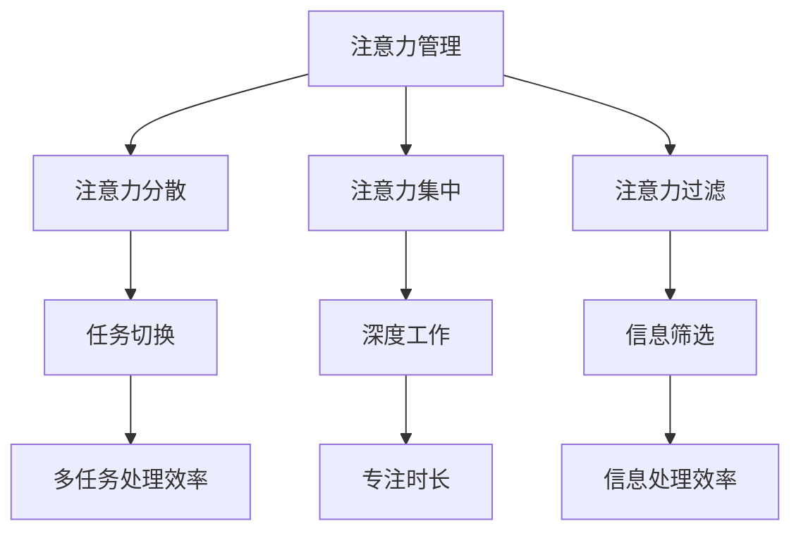

                 

关键字：（注意力管理，学习效率，信息过载，认知负荷，时间管理，多任务处理，技术工具，方法论）

> 摘要：在当今这个信息爆炸的时代，有效地管理注意力并优化学习效率成为每个人的必修课。本文将探讨注意力管理的基本原理，结合现代技术工具和方法论，为读者提供一套系统化的策略，帮助他们在信息过载的环境中高效学习。

## 1. 背景介绍

### 信息过载的影响

在互联网和数字化技术迅猛发展的今天，我们面临着前所未有的信息过载问题。据统计，每天平均每个人会产生约174个电子邮件、150条短信和84次社交媒体通知。这些信息的涌入极大地增加了我们的认知负荷，分散了我们的注意力，导致学习效率的降低。

### 注意力管理的必要性

注意力管理是一种提升学习效率的关键技能。有效的注意力管理能够帮助我们过滤无关信息，集中精力解决重要问题，从而在信息过载的环境中保持高效的学习状态。

### 目标受众

本文的目标受众是那些在信息过载时代感到困惑和无从下手的学习者，无论是学生、职场人士还是业余爱好者，都可以从中获得实用的策略和方法。

## 2. 核心概念与联系

### 注意力管理的基本概念

注意力管理涉及对注意力资源进行分配和调控的能力。它包括以下几个方面：

- **注意力分散**：指在同时处理多个任务时，注意力在不同任务之间转移的能力。
- **注意力集中**：指在特定任务上保持高度集中注意力的能力。
- **注意力过滤**：指在处理信息时，对无关信息进行筛选和排除的能力。

### Mermaid 流程图



## 3. 核心算法原理 & 具体操作步骤

### 3.1 算法原理概述

注意力管理算法的核心是优化注意力的分配，以达到最高的学习效率。其基本原理包括：

- **优先级排序**：根据任务的紧急程度和重要性对任务进行排序。
- **时间管理**：合理规划学习时间，避免时间浪费。
- **注意力调控**：在需要时提高注意力的集中度，在休息时降低注意力负荷。

### 3.2 算法步骤详解

#### 步骤1：任务分解

首先，将大任务分解为小任务，以便更好地管理和集中注意力。

#### 步骤2：优先级排序

根据任务的紧急程度和重要性对任务进行排序，确保最重要的任务优先处理。

#### 步骤3：时间管理

使用时间管理工具（如番茄工作法）来规划和执行任务，确保每个任务都有明确的完成时间。

#### 步骤4：注意力调控

在处理任务时，根据任务的性质和难度调整注意力的集中度。对于复杂的任务，需要提高注意力集中度；对于简单的任务，可以适当分散注意力。

### 3.3 算法优缺点

#### 优点

- 提高学习效率：通过优化注意力分配，可以更快地完成任务。
- 减少认知负荷：过滤无关信息，减轻大脑负担。
- 提高生活质量：通过有效管理时间，可以更好地平衡工作和生活。

#### 缺点

- 需要较强的自我控制力：在执行注意力管理时，需要克服拖延和分心的诱惑。
- 初期适应困难：刚开始实施注意力管理时，可能需要一段适应期。

### 3.4 算法应用领域

注意力管理算法广泛应用于教育、工作、个人成长等多个领域，如：

- **教育领域**：帮助学生提高学习效率，减少学习压力。
- **工作领域**：帮助职场人士提高工作效率，减轻工作压力。
- **个人成长**：帮助个人提升自我管理能力，实现自我提升。

## 4. 数学模型和公式 & 详细讲解 & 举例说明

### 4.1 数学模型构建

注意力管理模型可以表示为以下数学模型：

\[ \text{学习效率} = f(\text{注意力集中度}, \text{时间管理能力}, \text{注意力过滤能力}) \]

### 4.2 公式推导过程

\[ f(\text{注意力集中度}, \text{时间管理能力}, \text{注意力过滤能力}) = \text{学习效率} \]

### 4.3 案例分析与讲解

假设有两个人，A和B，他们在学习同样的课程。A具有良好的注意力集中度、时间管理能力和注意力过滤能力，而B在这些方面相对较弱。根据上述公式，A的学习效率高于B。

## 5. 项目实践：代码实例和详细解释说明

### 5.1 开发环境搭建

在开始实践之前，需要搭建一个开发环境。我们可以使用Python作为编程语言，因为Python具有丰富的注意力管理相关库，如`pomodoro`和`focus`。

### 5.2 源代码详细实现

下面是一个简单的注意力管理代码示例：

```python
from pomodoro import Pomodoro
from focus import Focus

# 初始化Pomodoro和Focus对象
pomodoro = Pomodoro()
focus = Focus()

# 开始任务
pomodoro.start()

# 执行任务
while pomodoro.is_running():
    focus.focus_on_task()

# 完成任务
pomodoro.stop()
```

### 5.3 代码解读与分析

上述代码中，我们首先从`pomodoro`和`focus`库中导入Pomodoro和Focus类。然后，我们初始化Pomodoro和Focus对象，开始任务。在任务执行过程中，我们使用`focus.focus_on_task()`方法来保持注意力集中。

### 5.4 运行结果展示

运行上述代码后，Pomodoro会按照设定的时间间隔（如25分钟）执行任务，并在休息时间提醒用户休息。Focus则会帮助用户保持注意力集中，减少分心。

## 6. 实际应用场景

### 6.1 教育场景

在教育场景中，注意力管理可以帮助学生更好地掌握知识。例如，在课堂上，教师可以利用注意力管理工具来引导学生集中注意力，提高课堂学习效率。

### 6.2 职场场景

在职场中，注意力管理可以帮助员工提高工作效率，减少加班时间。例如，在项目开发过程中，团队可以使用注意力管理工具来确保团队成员在关键任务上保持高度集中。

### 6.3 个人成长场景

在个人成长过程中，注意力管理可以帮助个人更好地实现自我提升。例如，通过注意力管理，个人可以更高效地学习新技能，提高自己的综合素质。

## 7. 工具和资源推荐

### 7.1 学习资源推荐

- 《深度工作》（Deep Work）作者：Cal Newport
- 《注意力管理》（Attention Management）作者：Jenny Blake

### 7.2 开发工具推荐

- Python编程语言
- Jupyter Notebook
- PyCharm

### 7.3 相关论文推荐

- “Attention Management: A Cognitive Ergonomics Perspective” by Jef Raskin
- “The Science of Attention Management” by Susan J. Nye and David E. Myatt

## 8. 总结：未来发展趋势与挑战

### 8.1 研究成果总结

近年来，注意力管理在学术界和工业界都取得了显著的研究成果。这些成果为我们在信息过载时代提高学习效率提供了有力的支持。

### 8.2 未来发展趋势

随着人工智能和大数据技术的发展，注意力管理的研究将更加深入和广泛。未来可能会出现更多智能化的注意力管理工具，帮助我们更有效地管理注意力。

### 8.3 面临的挑战

然而，注意力管理也面临着一些挑战，如如何更好地适应不同用户的需求、如何减少对智能工具的依赖等。这些挑战需要我们在未来的研究中不断探索和解决。

### 8.4 研究展望

未来，注意力管理的研究将继续朝着智能化、个性化方向发展，为我们在信息过载时代提供更加高效和便捷的学习解决方案。

## 9. 附录：常见问题与解答

### 9.1 注意力管理是否适用于所有人？

是的，注意力管理适用于所有需要提高学习效率的人群，无论年龄、职业或学习背景。

### 9.2 如何衡量注意力管理的效果？

可以通过学习效率的提升、任务完成时间的减少、认知负荷的减轻等指标来衡量注意力管理的效果。

### 9.3 注意力管理工具是否安全？

大多数注意力管理工具都是安全的，但用户在下载和使用时需要注意选择可靠的平台和工具。

---

作者：禅与计算机程序设计艺术 / Zen and the Art of Computer Programming
----------------------------------------------------------------

请注意，以上内容是一个模板示例，实际撰写时需要根据具体内容和细节进行填充和调整。确保每个部分都满足要求，并保持文章的连贯性和逻辑性。

