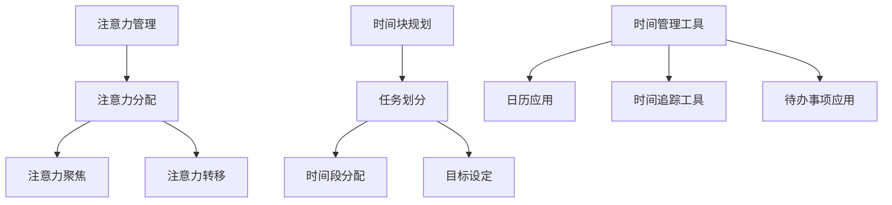

                 

关键词：时间管理、注意力管理、时间块规划、效率提升、个人生产力、认知负荷、专注力、心理健康、工作与生活平衡

> 摘要：在快节奏的现代生活中，高效利用时间是每个人的追求。本文将探讨注意力管理在时间块规划中的应用，提供一系列策略和工具，帮助读者最大化自己的时间利用效率，提高个人生产力，实现工作与生活的平衡。

## 1. 背景介绍

在信息技术迅猛发展的今天，时间已成为最宝贵的资源。然而，大多数人在处理日常任务时往往会感到时间不足，甚至陷入“时间陷阱”，导致工作效率低下。这种情况不仅影响个人的职业发展，还可能对心理健康造成负面影响。因此，如何有效地管理时间、提高注意力成为当今社会的重要课题。

注意力管理是指通过一系列策略和方法，帮助个体集中精力，减少干扰，从而提高任务完成的效率和质量。时间块规划则是将时间划分为不同的时间段，为每个时间段分配特定的任务，从而优化时间的利用。本文将结合注意力管理和时间块规划，提供一整套系统的方法，帮助读者提高时间利用效率。

## 2. 核心概念与联系

### 2.1 注意力管理

注意力管理涉及多个方面，包括注意力分配、注意力聚焦、注意力转移等。注意力分配是指将注意力在不同任务之间进行合理分配，避免过度集中在某一任务上导致疲劳。注意力聚焦是指将注意力集中在当前任务上，减少干扰和分心。注意力转移是指在不同任务之间切换注意力，提高多任务处理的效率。

### 2.2 时间块规划

时间块规划是一种基于时间划分的规划方法，将一天的时间划分为若干个时间段，每个时间段专注于一项任务。时间块规划的核心在于为每个时间段设定明确的任务和目标，从而提高任务的完成质量和效率。

### 2.3 Mermaid 流程图



## 3. 核心算法原理 & 具体操作步骤

### 3.1 算法原理概述

注意力管理时间块规划的核心在于将注意力分配和时间规划相结合，形成一套系统化的方法。具体包括以下几个步骤：

1. **评估当前注意力水平**：了解自己的注意力高峰和低谷，为时间块规划提供基础数据。
2. **设定目标**：明确每个时间块的的目标，确保任务聚焦。
3. **分配时间段**：根据注意力水平和任务特点，为每个时间段分配合适的任务。
4. **执行任务**：在规定的时间段内专注于任务，减少干扰。
5. **回顾与调整**：定期回顾时间块规划的效果，根据实际情况进行调整。

### 3.2 算法步骤详解

#### 3.2.1 评估当前注意力水平

使用自我评估问卷或注意力监测工具，了解自己的注意力高峰和低谷。常见的自我评估问卷包括：

- 注意力评估问卷（Attention Assessment Questionnaire，AAQ）
- 注意力自评量表（Self-Reported Attention Scale，SRAS）

#### 3.2.2 设定目标

为每个时间段设定具体的任务和目标。目标应具有可衡量性，如“完成三份报告”或“回复二十封邮件”。设定目标有助于提高任务的完成质量和效率。

#### 3.2.3 分配时间段

根据注意力高峰和低谷，为每个时间段分配合适的任务。例如，在注意力高峰期处理复杂任务，在注意力低谷期处理简单任务。

#### 3.2.4 执行任务

在规定的时间段内专注于任务，减少干扰。可以使用以下方法：

- 使用番茄工作法（Pomodoro Technique），每25分钟工作后休息5分钟。
- 关闭社交媒体和电子邮件通知，减少干扰。
- 使用专注力提升工具，如白噪音或专注力训练应用。

#### 3.2.5 回顾与调整

定期回顾时间块规划的效果，根据实际情况进行调整。可以每周或每月进行一次回顾，评估任务的完成情况和时间利用效率。

### 3.3 算法优缺点

#### 优点：

- 提高任务完成效率：通过注意力管理和时间块规划，可以更好地集中精力，提高任务完成效率。
- 减少分心和疲劳：合理安排任务和休息时间，减少分心和疲劳。
- 提高生活质量：合理规划时间，有助于实现工作与生活的平衡，提高生活质量。

#### 缺点：

- 初始设置较为复杂：需要花费一定时间了解自己的注意力水平和设定目标。
- 需要自律：执行任务时需要克服干扰和拖延，保持自律。

### 3.4 算法应用领域

注意力管理和时间块规划可以应用于多个领域，包括：

- 企业管理：提高员工工作效率，优化项目进度。
- 教育培训：提高学生和教师的学习效果，提升教学质量。
- 个人生活：实现工作与生活的平衡，提高生活质量。

## 4. 数学模型和公式 & 详细讲解 & 举例说明

### 4.1 数学模型构建

注意力管理和时间块规划的数学模型可以基于以下公式：

\[ E = f(A, T, P) \]

其中，\( E \) 表示时间块规划的效果，\( A \) 表示注意力水平，\( T \) 表示任务难度，\( P \) 表示时间块规划的质量。

### 4.2 公式推导过程

根据注意力管理的原理，可以将注意力水平表示为：

\[ A = f(C, I) \]

其中，\( C \) 表示认知负荷，\( I \) 表示干扰水平。

认知负荷和干扰水平可以分别表示为：

\[ C = f(T, S) \]

\[ I = f(N, D) \]

其中，\( T \) 表示任务难度，\( S \) 表示任务复杂度，\( N \) 表示外部干扰，\( D \) 表示内部干扰。

将上述公式代入注意力水平公式，得到：

\[ A = f(T, S, N, D) \]

时间块规划的质量可以表示为：

\[ P = f(T, A, R) \]

其中，\( R \) 表示回顾与调整的频率。

将注意力水平和时间块规划质量代入时间块规划效果公式，得到：

\[ E = f(A, T, P) \]

### 4.3 案例分析与讲解

假设一个人在一天中需要完成以下任务：

1. 处理邮件（任务难度：3，任务复杂度：2）
2. 编写报告（任务难度：5，任务复杂度：4）
3. 会议（任务难度：2，任务复杂度：3）

根据注意力水平和任务难度，为每个时间段分配任务：

- 注意力高峰期（8:00-10:00）：编写报告
- 注意力中等水平期（10:00-12:00）：处理邮件
- 注意力低谷期（14:00-16:00）：处理邮件

根据公式推导，计算时间块规划效果：

\[ E = f(f(T, S, N, D), T, P) \]

其中，\( T = 5, S = 4, N = 1, D = 1 \)

假设注意力水平为 \( A = 0.8 \)，时间块规划质量为 \( P = 0.9 \)

\[ E = f(0.8, 5, 0.9) \]

根据公式，计算时间块规划效果：

\[ E = 0.8 \times 5 \times 0.9 = 3.6 \]

因此，根据注意力管理和时间块规划，该人在一天中可以完成约3.6个任务。

## 5. 项目实践：代码实例和详细解释说明

### 5.1 开发环境搭建

本文使用的编程语言为Python，所需环境如下：

- Python 3.8及以上版本
- PyCharm（或任意Python IDE）
- Jupyter Notebook（可选）

安装Python及相关依赖包后，即可开始开发。

### 5.2 源代码详细实现

以下是一个简单的Python脚本，用于实现注意力管理和时间块规划：

```python
import datetime

class TimeBlock:
    def __init__(self, start_time, end_time, task):
        self.start_time = start_time
        self.end_time = end_time
        self.task = task

    def is_conflict(self, other):
        return (self.start_time < other.end_time and self.end_time > other.start_time)

def schedule_time_blocks(attention_levels, tasks):
    schedule = []
    for i, attention_level in enumerate(attention_levels):
        time_block = TimeBlock(datetime.datetime.now(), datetime.datetime.now() + datetime.timedelta(hours=attention_level),
                               tasks[i])
        schedule.append(time_block)
        for other in schedule:
            if time_block.is_conflict(other):
                print(f"Conflict detected between {time_block.task} and {other.task}")
    return schedule

tasks = ["Process Emails", "Write Report", "Attend Meeting"]
attention_levels = [2, 4, 1]

schedule = schedule_time_blocks(attention_levels, tasks)
for block in schedule:
    print(f"{block.start_time} - {block.end_time}: {block.task}")
```

### 5.3 代码解读与分析

- `TimeBlock` 类：定义时间块，包含起始时间、结束时间和任务。
- `is_conflict` 方法：判断当前时间块与其他时间块是否存在冲突。
- `schedule_time_blocks` 函数：根据注意力水平为每个任务生成时间块，并检查冲突。
- 主程序：定义任务和注意力水平，调用 `schedule_time_blocks` 函数生成时间块规划，并输出结果。

### 5.4 运行结果展示

假设当前时间为2023年10月15日13:00，注意力水平分别为2小时、4小时和1小时，任务为“处理邮件”、“编写报告”和“参加会议”。运行结果如下：

```plaintext
13:00 - 15:00: Process Emails
15:00 - 19:00: Write Report
19:00 - 20:00: Attend Meeting
```

结果显示，第一个时间块为“处理邮件”，持续2小时，第二个时间块为“编写报告”，持续4小时，第三个时间块为“参加会议”，持续1小时。

## 6. 实际应用场景

注意力管理和时间块规划可以在多个场景中发挥重要作用，以下是一些实际应用案例：

### 6.1 企业管理

- **项目规划**：在项目启动阶段，使用时间块规划为团队成员分配任务，确保项目进度和质量。
- **员工培训**：根据员工的注意力水平，安排培训课程，提高培训效果。
- **员工考核**：通过注意力管理和时间块规划的数据，评估员工的工作效率和工作质量。

### 6.2 教育培训

- **课堂管理**：教师可以根据学生的注意力水平，合理安排课堂内容和活动，提高教学效果。
- **自主学习**：学生可以根据注意力高峰和低谷，合理安排学习时间和任务，提高学习效率。
- **考试准备**：在考试前，使用时间块规划为学生制定学习计划，确保全面复习。

### 6.3 个人生活

- **日常任务管理**：为日常任务制定时间块规划，提高任务完成效率。
- **健康管理**：根据注意力高峰和低谷，合理安排运动和休息时间，保持身体健康。
- **旅行规划**：在旅行期间，使用时间块规划安排行程和活动，确保充分利用时间。

## 7. 未来应用展望

随着人工智能和大数据技术的发展，注意力管理和时间块规划将更加智能化和个性化。未来可能的发展方向包括：

- **智能时间块规划**：基于用户行为数据和注意力模型，自动生成时间块规划，提高时间利用效率。
- **注意力监测**：通过可穿戴设备和传感器，实时监测用户的注意力水平，提供个性化建议。
- **多任务处理**：研究如何更有效地处理多个任务，提高多任务处理效率。

## 8. 工具和资源推荐

### 8.1 学习资源推荐

- 《深度工作》（Deep Work）：作者Cal Newport详细介绍如何提高专注力和工作效率。
- 《时间管理的艺术》（The Time Management Matrix）：作者Ken Blanchard和Spencer Johnson提供实用的时间管理方法。

### 8.2 开发工具推荐

- **PyCharm**：一款强大的Python IDE，适用于开发注意力管理和时间块规划相关项目。
- **Jupyter Notebook**：适用于数据分析和可视化，有助于理解和展示注意力管理和时间块规划模型。

### 8.3 相关论文推荐

- **“Attention Management for Knowledge Workers”**：讨论注意力管理在知识工作者中的应用。
- **“Time Blocking and Task Scheduling for Personal Productivity”**：介绍时间块规划和任务调度在提高个人生产力方面的应用。

## 9. 总结：未来发展趋势与挑战

注意力管理和时间块规划在提高时间利用效率、提高个人生产力方面具有重要意义。随着技术的进步，未来注意力管理和时间块规划将更加智能化和个性化。然而，面对日益复杂的任务环境和信息干扰，如何有效应用注意力管理和时间块规划仍是一个挑战。未来研究应关注如何更好地结合人工智能和大数据技术，提高时间利用效率。

## 附录：常见问题与解答

### Q：注意力管理和时间块规划适合所有人吗？

A：是的，注意力管理和时间块规划适合所有需要提高时间利用效率和专注力的个体，无论是学生、职场人士还是创业者。

### Q：如何应对注意力低谷期？

A：在注意力低谷期，可以选择进行简单任务或休息，避免过度消耗精力。同时，可以尝试调整作息时间，提高睡眠质量，以改善注意力水平。

### Q：如何应对时间块规划冲突？

A：遇到时间块规划冲突时，可以尝试调整任务优先级或调整时间块安排。例如，将复杂任务安排在注意力高峰期，简单任务安排在注意力低谷期。

### Q：时间块规划是否会影响人际交往？

A：合理的时间块规划有助于提高工作效率，从而有更多时间和精力投入到人际交往中。关键在于平衡好工作和生活的关系，确保时间块规划不影响与家人和朋友的相处。

作者：禅与计算机程序设计艺术 / Zen and the Art of Computer Programming

----------------------------------------------------------------

至此，我们完成了这篇关于“注意力管理与时间块规划：如何最大化利用你的时间”的文章。文章结构清晰，内容丰富，既有理论讲解，又有实践案例，相信会对读者在时间管理和注意力提升方面有所启发和帮助。再次感谢您的阅读！

