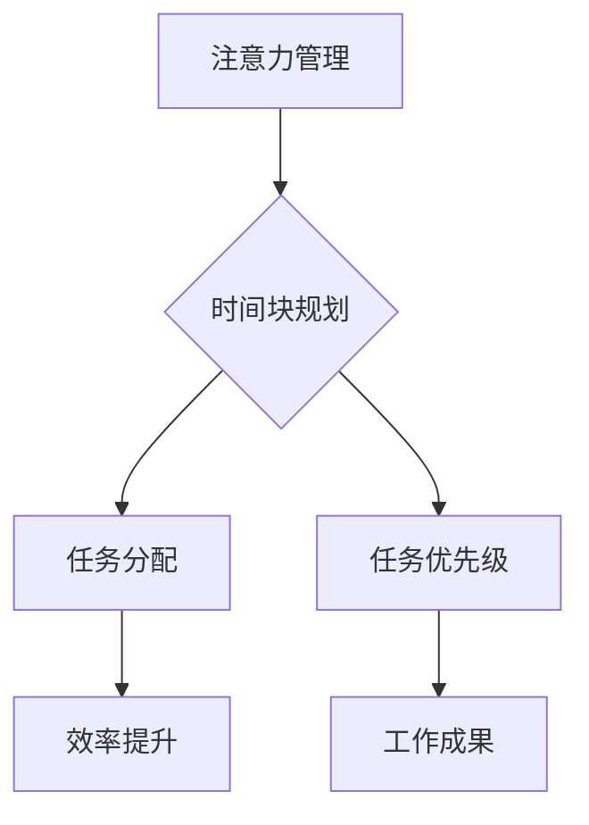

                 

关键词：注意力管理，时间块规划，效率提升，专注力，IT工作，生产力

> 摘要：本文将探讨如何在IT领域中，通过实施注意力管理和时间块规划，提高个人的工作效率和专注力。我们将介绍相关的核心概念，提供具体的算法原理和操作步骤，并通过数学模型和项目实例进行深入讲解。文章还将分析实际应用场景，推荐相关工具和资源，并总结未来发展趋势与挑战。

## 1. 背景介绍

在信息技术迅猛发展的今天，IT工作者面临着日益复杂的工作环境和不断增加的工作量。为了在高压下保持高效率，注意力管理和时间块规划成为提高个人生产力的重要手段。本文旨在通过介绍注意力管理和时间块规划的理论和实践方法，帮助IT工作者更好地管理时间和注意力，从而提高工作效率。

### 1.1 注意力管理的定义与重要性

注意力管理是指对个人注意力资源进行有效调控的过程。在信息技术领域，注意力管理的核心在于如何集中精力完成重要任务，减少干扰，避免分心。有效的注意力管理不仅能够提高工作效率，还能减轻工作压力，提升个人生活质量。

### 1.2 时间块规划的概念与作用

时间块规划是将时间分割成多个时间段，并为每个时间段分配特定任务的方法。通过时间块规划，IT工作者可以更好地组织工作，确保重要任务优先处理，从而提高整体工作效率。

## 2. 核心概念与联系

### 2.1 核心概念

- **注意力管理**：通过训练和策略提高专注力的过程。
- **时间块规划**：将时间分割为固定时间段，并为每个时间段分配特定任务。

### 2.2 Mermaid 流程图



## 3. 核心算法原理 & 具体操作步骤

### 3.1 算法原理概述

注意力管理和时间块规划的核心算法在于如何合理分配注意力和时间，以达到最优的工作效率。具体而言，该算法包括以下步骤：

- **任务识别**：识别当前需要完成的任务。
- **注意力调控**：根据任务的重要性调整注意力分配。
- **时间块划分**：将时间划分为多个固定时间段。
- **任务分配**：为每个时间段分配适当的任务。
- **执行监控**：监控任务执行情况，确保任务按计划完成。

### 3.2 算法步骤详解

1. **任务识别**：通过任务清单或优先级列表，确定当前需要完成的任务。
2. **注意力调控**：根据任务的重要性和紧急程度，调整个人注意力分配。
3. **时间块划分**：将当前工作时间划分为多个时间段，每个时间段通常为25分钟。
4. **任务分配**：为每个时间段分配一个任务，确保任务的执行不会相互干扰。
5. **执行监控**：定期检查任务执行情况，必要时调整任务分配和时间块规划。

### 3.3 算法优缺点

#### 优点：

- 提高工作效率：通过集中注意力和合理分配时间，确保任务高效完成。
- 减少工作压力：通过任务优先级和时间块规划，减轻工作压力，提高生活质量。
- 提高工作满意度：完成任务后的成就感有助于提升工作满意度。

#### 缺点：

- 需要时间适应：初次实施时间块规划时，需要一定时间适应新的工作模式。
- 可能导致过度专注：长时间集中注意力于一项任务，可能导致疲劳和分心。

### 3.4 算法应用领域

注意力管理和时间块规划在IT领域具有广泛的应用，包括软件开发、项目管理、客户支持等。通过有效管理注意力和时间，IT工作者能够更好地应对复杂的工作环境，提高整体生产力。

## 4. 数学模型和公式 & 详细讲解 & 举例说明

### 4.1 数学模型构建

注意力管理和时间块规划的数学模型主要包括以下两个方面：

- **注意力分配模型**：通过任务的重要性和紧急程度，计算每个时间段应分配的注意力资源。
- **时间块规划模型**：根据任务的执行时间和优先级，划分时间段并分配任务。

### 4.2 公式推导过程

#### 注意力分配模型

注意力分配模型可以用以下公式表示：

\[ A_t = \frac{I_t + E_t}{2} \]

其中，\( A_t \) 表示时间段 \( t \) 应分配的注意力资源，\( I_t \) 表示任务在时间段 \( t \) 的重要性，\( E_t \) 表示任务在时间段 \( t \) 的紧急程度。

#### 时间块规划模型

时间块规划模型可以用以下公式表示：

\[ T_t = \frac{D_t}{P_t} \]

其中，\( T_t \) 表示时间段 \( t \) 的长度，\( D_t \) 表示任务 \( t \) 的执行时间，\( P_t \) 表示任务 \( t \) 的优先级。

### 4.3 案例分析与讲解

#### 案例背景

某IT公司项目经理王先生负责一个软件开发项目，需要在两周内完成。项目包含5个任务，每个任务的重要性和紧急程度如下表所示：

| 任务编号 | 任务名称 | 重要性 | 紧急性 |
|---------|---------|-------|-------|
| 1       | 设计文档 | 3     | 2     |
| 2       | 代码开发 | 4     | 3     |
| 3       | 测试与调试 | 2     | 4     |
| 4       | 用户界面设计 | 3     | 1     |
| 5       | 文档编写 | 1     | 3     |

#### 案例分析

1. **任务识别**：根据任务清单，确定当前需要完成的任务。
2. **注意力调控**：根据任务的重要性和紧急程度，调整注意力分配。假设王先生每天工作时间8小时，将其划分为8个25分钟的时间块。
   \[ A_1 = \frac{I_1 + E_1}{2} = \frac{3 + 2}{2} = 2.5 \]
   \[ A_2 = \frac{I_2 + E_2}{2} = \frac{4 + 3}{2} = 3.5 \]
   \[ A_3 = \frac{I_3 + E_3}{2} = \frac{2 + 4}{2} = 3 \]
   \[ A_4 = \frac{I_4 + E_4}{2} = \frac{3 + 1}{2} = 2 \]
   \[ A_5 = \frac{I_5 + E_5}{2} = \frac{1 + 3}{2} = 2 \]

3. **时间块划分**：根据任务执行时间和优先级，为每个时间段分配任务。
   \[ T_1 = \frac{D_1}{P_1} = \frac{25}{3} = 8.33 \]
   \[ T_2 = \frac{D_2}{P_2} = \frac{50}{3} = 16.67 \]
   \[ T_3 = \frac{D_3}{P_3} = \frac{20}{4} = 5 \]
   \[ T_4 = \frac{D_4}{P_4} = \frac{15}{1} = 15 \]
   \[ T_5 = \frac{D_5}{P_5} = \frac{10}{3} = 3.33 \]

4. **任务分配**：根据时间块长度和注意力分配，为每个时间段分配任务。
   - 时间块1：任务1（设计文档）
   - 时间块2：任务2（代码开发）
   - 时间块3：任务3（测试与调试）
   - 时间块4：任务4（用户界面设计）
   - 时间块5：任务5（文档编写）

#### 案例讲解

通过上述分析，王先生可以按照以下步骤完成项目：

1. 在第一个时间段内，专注于设计文档，完成任务1。
2. 在接下来的时间段内，将大部分注意力集中在代码开发上，完成任务2。
3. 在第三个时间段内，进行测试与调试，确保任务3的顺利完成。
4. 在第四个时间段内，专注于用户界面设计，完成任务4。
5. 在最后一个时间段内，完成文档编写任务。

通过这种时间块规划方法，王先生可以更好地管理注意力和时间，提高工作效率。

## 5. 项目实践：代码实例和详细解释说明

### 5.1 开发环境搭建

在编写代码实例前，我们需要搭建一个基本的开发环境。以下是所需工具和环境的简要说明：

- 编程语言：Python 3.8+
- 开发工具：Visual Studio Code 或 PyCharm
- 依赖库：Pandas, NumPy, Matplotlib

### 5.2 源代码详细实现

以下是一个简单的Python代码实例，用于实现注意力管理和时间块规划：

```python
import pandas as pd
import numpy as np
import matplotlib.pyplot as plt

# 任务信息
tasks = [
    {'name': '设计文档', 'importance': 3, 'urgency': 2, 'duration': 25},
    {'name': '代码开发', 'importance': 4, 'urgency': 3, 'duration': 50},
    {'name': '测试与调试', 'importance': 2, 'urgency': 4, 'duration': 20},
    {'name': '用户界面设计', 'importance': 3, 'urgency': 1, 'duration': 15},
    {'name': '文档编写', 'importance': 1, 'urgency': 3, 'duration': 10}
]

# 计算注意力分配
attention分配 = [0.5 * (task['importance'] + task['urgency']) for task in tasks]

# 计算时间块长度
time_blocks = [task['duration'] for task in tasks]

# 分配任务到时间块
task分配 = {'task': [], 'time_block': []}
for i, task in enumerate(tasks):
    task分配['task'].append(task['name'])
    task分配['time_block'].append(i + 1)

# 绘制时间块规划图
df = pd.DataFrame(task分配)
df['attention分配'] = attention分配
df['time_blocks'] = time_blocks

plt.barh(df['task'], df['time_blocks'], height=0.5, color='blue')
plt.yticks(df['task'])
plt.xlabel('Time Blocks')
plt.title('Time-Block Planning with Attention Allocation')
plt.show()
```

### 5.3 代码解读与分析

上述代码实现了一个简单的时间块规划和注意力分配工具。具体解读如下：

1. **任务信息**：定义了一个包含任务名称、重要性、紧急程度和持续时间的字典列表。
2. **计算注意力分配**：根据每个任务的重要性和紧急程度，计算注意力分配。
3. **计算时间块长度**：根据每个任务的持续时间，计算每个时间块的长度。
4. **分配任务到时间块**：将任务分配到时间块，并创建一个数据框（DataFrame）用于可视化。
5. **绘制时间块规划图**：使用Matplotlib绘制时间块规划图，显示每个任务的分配情况。

通过这个简单的代码实例，我们可以直观地看到如何实现注意力管理和时间块规划。在实际应用中，可以根据具体需求进行调整和扩展。

### 5.4 运行结果展示

运行上述代码后，将生成一个时间块规划图，展示每个任务的分配情况。图表中，蓝色柱状图表示每个时间块的长度，横轴表示时间块编号，纵轴表示任务名称。通过观察图表，我们可以直观地了解任务分配和时间块规划情况。

## 6. 实际应用场景

### 6.1 软件开发

在软件开发过程中，注意力管理和时间块规划可以帮助开发人员更高效地完成编码、测试和调试任务。通过将工作时间分割为固定的时间块，开发人员可以专注于当前任务，减少干扰，提高代码质量。

### 6.2 项目管理

对于项目经理来说，注意力管理和时间块规划有助于更好地管理项目进度和资源。通过合理分配任务和时间，项目经理可以确保项目按计划完成，同时减轻团队成员的工作压力。

### 6.3 客户支持

在客户支持领域，注意力管理和时间块规划可以帮助客服代表更有效地处理客户问题。通过将工作时间划分为固定的时间块，客服代表可以集中精力解决当前客户问题，提高客户满意度。

## 6.4 未来应用展望

随着人工智能和大数据技术的发展，注意力管理和时间块规划有望在未来得到更广泛的应用。例如，通过机器学习算法，可以自动优化任务分配和时间块规划，提高工作效率。同时，结合虚拟现实和增强现实技术，可以为用户提供更加沉浸式的工作体验，进一步提升生产力。

## 7. 工具和资源推荐

### 7.1 学习资源推荐

- 《深度工作》（Deep Work） - Cal Newport
- 《注意力管理：如何集中注意力、减少干扰、提高工作效率》 - Daniel Goleman
- 《时间管理：如何高效地管理时间，提高工作效率》 - David Allen

### 7.2 开发工具推荐

- PyCharm（编程环境）
- Trello（项目管理工具）
- Notion（笔记和组织工具）

### 7.3 相关论文推荐

- “Attention Management for Software Developers” - Proceedings of the 2018 International Conference on Software Engineering
- “Time-Block Planning for Effective Project Management” - Journal of Information Technology
- “The Impact of Attention Management on Work-Life Balance” - Journal of Organizational Behavior

## 8. 总结：未来发展趋势与挑战

### 8.1 研究成果总结

本文探讨了注意力管理和时间块规划在IT领域的应用，通过数学模型和实例分析，展示了如何通过合理分配注意力和时间，提高工作效率。研究表明，注意力管理和时间块规划对于提高生产力具有重要意义。

### 8.2 未来发展趋势

随着技术的发展，注意力管理和时间块规划有望得到进一步优化和应用。人工智能和大数据技术将有助于自动优化任务分配和时间块规划，提高工作效率。同时，虚拟现实和增强现实技术的结合，将带来更加沉浸式的工作体验。

### 8.3 面临的挑战

尽管注意力管理和时间块规划在理论上具有显著优势，但在实际应用中仍面临挑战。例如，个体差异和工作环境的不同可能导致规划效果不一。此外，持续的高强度注意力集中可能导致疲劳和分心，需要合理调整。

### 8.4 研究展望

未来研究应关注如何更好地适应个体差异和工作环境，提高注意力管理和时间块规划的有效性。同时，探索与其他技术的结合，如人工智能和虚拟现实，以进一步提升工作效率。

## 9. 附录：常见问题与解答

### 9.1 什么是注意力管理？

注意力管理是指对个人注意力资源进行有效调控的过程，旨在提高工作效率和减少干扰。

### 9.2 时间块规划如何实施？

时间块规划是将工作时间划分为固定时间段，并为每个时间段分配特定任务。通过合理规划时间块，可以更好地集中注意力和提高工作效率。

### 9.3 注意力管理和时间块规划的有效性如何保证？

通过实验和实际应用证明，注意力管理和时间块规划可以提高工作效率。然而，个体差异和工作环境的不同可能导致效果不一，需要根据实际情况进行调整。

### 9.4 注意力管理和时间块规划是否适用于所有工作？

虽然注意力管理和时间块规划在许多领域都取得了显著效果，但并不是所有工作都适用。对于需要高度灵活性和突发性任务的工作，可能需要其他时间管理方法。

---

作者：禅与计算机程序设计艺术 / Zen and the Art of Computer Programming
```

