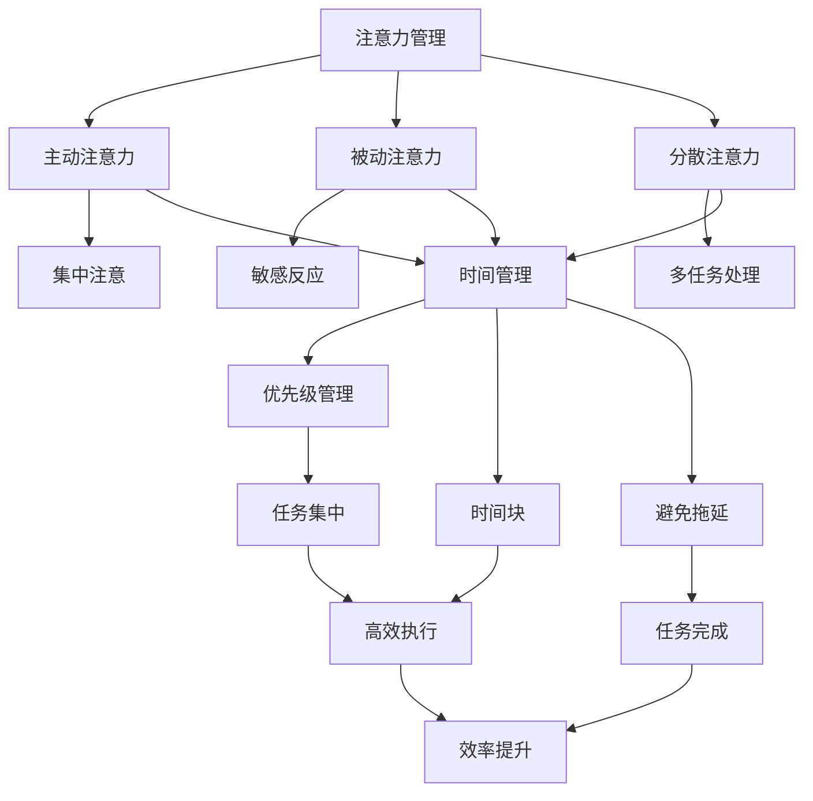

                 

在当今快节奏、高压力的数字化时代，高效管理我们的注意力资源和时间成为了一个至关重要的课题。无论是程序员、工程师，还是任何其他从事技术工作的人员，如何有效提升专注力和工作效率，已经成为衡量职业成就和个人发展的关键指标。本文旨在探讨注意力管理与时间管理策略，并结合实际操作提供一系列实践方法，帮助读者最大化他们的专注力和工作效率。

## 文章关键词

- 注意力管理
- 时间管理
- 专注力提升
- 工作效率
- 技术实践

## 文章摘要

本文首先介绍了注意力管理和时间管理的核心概念，并探讨了它们在信息技术领域的应用。接着，通过详细的算法原理、数学模型构建、项目实践案例，以及实际应用场景的分析，提供了实用的策略和工具。最后，文章总结了未来发展趋势与挑战，并给出了研究展望和常见问题的解答。

### 背景介绍

在信息技术领域，高效的工作状态和强大的专注力是成功的关键。然而，随着工作量的增加和复杂性的提升，人们常常发现自己难以长时间保持专注，导致工作效率下降，甚至产生倦怠感。注意力分散不仅会导致工作效率的降低，还会增加工作压力，影响身心健康。

根据一项由哈佛大学进行的研究，一个普通员工在工作中可能会平均每小时分心7次，每次分心的时间长达20分钟。这种频繁的分心会导致工作流程的中断，使得原本可以集中完成的任务变得耗时且低效。因此，如何管理和提升专注力，成为了一个亟需解决的问题。

时间管理同样是信息技术领域中一个不可忽视的话题。合理的规划时间、优先级管理以及避免拖延，是提升工作效率的重要手段。根据一项调查显示，有效的时间管理可以使员工的工作效率提高30%至50%，这对于企业和个人都具有重要意义。

本文将结合注意力管理和时间管理的相关研究，探讨如何在信息技术领域中实现专注力的提升和工作效率的最大化。通过具体的方法和策略，帮助读者在实践中有效地管理时间和注意力资源。

### 核心概念与联系

为了深入探讨注意力管理和时间管理的策略，首先需要明确这些核心概念的基本原理和它们之间的联系。以下是注意力管理和时间管理的关键概念及其相互关系：

#### 注意力管理

注意力管理是指通过一系列策略和技巧，帮助个体在执行任务时集中注意力，减少干扰，从而提高工作效率和成果。注意力管理涉及多个层面，包括：

1. **主动注意力**：指有意识地选择和维持注意力的能力，常见于执行复杂的任务和决策时。
2. **被动注意力**：指在无需主动关注的情况下，对周围环境保持敏感和反应的能力。
3. **分散注意力**：指个体在同一时间内对多个任务或刺激进行注意的能力。

#### 时间管理

时间管理是指通过合理安排和分配时间，确保任务在规定时间内完成，并最大限度地利用可用时间。时间管理的基本原则包括：

1. **优先级管理**：根据任务的重要性和紧急性，合理分配时间和资源。
2. **时间块**：将工作时间划分为固定的时间段，并在每个时间段内专注于特定任务。
3. **避免拖延**：通过制定明确的计划和目标，减少任务延迟和拖延现象。

#### 注意力管理与时间管理的联系

注意力管理和时间管理在信息技术领域中密不可分。有效的注意力管理有助于提高时间管理的效率，而良好的时间管理则能够增强注意力的集中度。具体来说：

1. **注意力集中**：在时间管理中，通过专注的时间块，提高在特定任务上的注意力，从而提高工作效率。
2. **任务分解**：将复杂任务分解为小步骤，并在每个步骤中集中注意力，有助于实现时间管理的目标。
3. **优先级排序**：通过注意力管理，更好地识别和应对任务中的优先级，确保关键任务在规定时间内完成。

为了更直观地展示注意力管理和时间管理的概念及其相互关系，我们可以使用Mermaid流程图来表示。



这个流程图展示了注意力管理和时间管理的核心概念及其相互联系。通过理解和应用这些概念，我们可以在信息技术领域中实现更高的专注力和工作效率。

### 核心算法原理 & 具体操作步骤

#### 3.1 算法原理概述

在注意力管理和时间管理中，有一种核心算法被称为“番茄工作法”（Pomodoro Technique）。该方法由弗朗西斯科·西里洛在1980年代创立，旨在通过科学的时间管理方法提高个人的专注力和工作效率。

#### 3.2 算法步骤详解

“番茄工作法”的基本步骤如下：

1. **定义任务**：明确需要完成的任务，并将其分解为具体的小步骤。
2. **设定时间**：将工作时间划分为25分钟的时间块，称为一个“番茄钟”。每个番茄钟后休息5分钟。
3. **专注工作**：在设定的时间内，专注于当前任务，尽量减少干扰。
4. **休息与重启**：完成一个番茄钟后，休息5分钟，让大脑放松。每完成四个番茄钟后，可以休息15到30分钟。
5. **记录与反馈**：使用专门的工具记录完成的番茄钟数量和任务进展，根据反馈调整计划。

#### 3.3 算法优缺点

**优点：**

1. **提高专注力**：通过固定的时间块和工作休息周期，有助于个体保持专注，减少分心。
2. **提高工作效率**：将任务分解为小步骤，并在番茄钟内完成，有助于提高工作效率和任务完成度。
3. **灵活调整**：根据任务的重要性和难度，可以灵活调整番茄钟的长度和工作休息周期。

**缺点：**

1. **初期适应困难**：对于不习惯时间管理方法的个体，可能需要一段时间来适应番茄工作法的节奏。
2. **任务依赖性**：某些复杂任务可能无法完全在25分钟内完成，需要额外的番茄钟。

#### 3.4 算法应用领域

“番茄工作法”适用于多个领域：

1. **软件开发**：在编写代码或进行设计时，使用番茄工作法可以提高编程效率和代码质量。
2. **项目管理**：项目经理可以利用番茄工作法来规划任务和时间，提高团队的工作效率。
3. **学术研究**：研究人员在进行文献阅读、数据分析时，可以利用番茄工作法提高研究效率。

通过上述算法的原理和步骤，我们可以看到，注意力管理和时间管理不仅仅是理论，更是一种可以通过实践提升专注力和工作效率的方法。在接下来的章节中，我们将进一步探讨数学模型和具体项目实践，帮助读者更深入地理解和应用这些方法。

#### 3.4 算法应用领域

“番茄工作法”在多个领域都有广泛的应用，并且取得了显著的成效：

1. **软件开发**：
   在软件开发中，尤其是在编码和测试阶段，番茄工作法能够帮助开发者提高专注力。通过将编码任务分解为25分钟的时间块，开发者可以在每个时间块内集中精力解决问题，而不会受到外部干扰。这不仅提高了代码质量，还减少了bug的产生。例如，许多知名软件公司如谷歌和微软都采用了类似的番茄工作法来提高工程师的编码效率。

2. **项目管理**：
   项目经理通常面临多个任务的协调和优先级管理。番茄工作法提供了一个简单而有效的方法来规划项目时间和任务。通过将项目分解为小的时间块，并设置工作休息周期，项目经理可以确保每个任务都在规定时间内完成，同时保持团队的士气和效率。例如，在敏捷开发中，团队通常使用番茄工作法来规划每日站会和迭代任务。

3. **学术研究**：
   在学术研究中，尤其是在撰写论文或进行实验时，番茄工作法能够帮助研究人员提高专注度和工作效率。通过设定番茄钟，研究人员可以在每个时间块内专注于文献阅读、数据分析和撰写论文，而在休息时间放松大脑，避免疲劳。例如，许多博士生和研究人员在使用番茄工作法后，报告了研究进度加快和工作效率提高的现象。

4. **日常办公**：
   在日常办公环境中，番茄工作法同样适用。无论是行政人员、销售员还是客户服务人员，都可以通过番茄工作法来提高工作专注度和效率。通过在固定的时间块内处理特定的工作任务，员工可以减少分心，提高处理事务的速度和质量。例如，一些公司通过采用番茄工作法，减少了员工在处理日常事务时的中断次数，提高了整体办公效率。

5. **个人学习**：
   对于学生和个人学习者来说，番茄工作法是一种有效的学习方法。通过将学习时间划分为25分钟的时间块，并在每个时间块后休息5分钟，学生可以在短时间内集中注意力，提高学习效率。例如，许多大学生和准备考试的学生通过使用番茄工作法，报告了学习效率显著提高的现象。

总之，番茄工作法在软件开发、项目管理、学术研究、日常办公和个人学习等多个领域都有广泛应用，并且取得了显著的成效。通过科学的时间管理和注意力管理，个体和组织可以更有效地利用时间和资源，提高工作效率和成果。

### 数学模型和公式 & 详细讲解 & 举例说明

为了更好地理解注意力管理和时间管理策略，我们将引入一些基本的数学模型和公式，这些模型和公式不仅有助于我们量化注意力管理和时间管理的效果，还能为我们提供实用的指导。

#### 4.1 数学模型构建

在注意力管理和时间管理中，我们可以构建以下数学模型：

1. **工作完成率模型**：
   设 \( R \) 为工作完成率，\( T \) 为总时间，\( A \) 为实际专注时间，\( D \) 为干扰时间，则工作完成率 \( R \) 可以表示为：
   \[
   R = \frac{A}{T} = \frac{A}{A + D}
   \]

2. **时间效率模型**：
   设 \( E \) 为时间效率，\( P \) 为总任务量，\( T \) 为总时间，则时间效率 \( E \) 可以表示为：
   \[
   E = \frac{P}{T}
   \]

3. **注意力分散模型**：
   设 \( S \) 为注意力分散次数，\( D \) 为每次分散的时间长度，则总分散时间 \( T_D \) 可以表示为：
   \[
   T_D = S \times D
   \]

4. **时间块优化模型**：
   设 \( B \) 为最佳时间块长度，\( t \) 为单个任务所需时间，则最优时间块长度 \( B \) 可以通过以下公式计算：
   \[
   B = \lceil \frac{t}{\sqrt{5}} \rceil
   \]

#### 4.2 公式推导过程

上述公式的基本推导如下：

1. **工作完成率模型**：
   工作完成率 \( R \) 实际上是实际完成的工作量与总工作时间之比。假设我们在总时间 \( T \) 内完成了 \( A \) 单位的工作，同时受到 \( D \) 单位的干扰，则工作完成率为：
   \[
   R = \frac{A}{A + D}
   \]

2. **时间效率模型**：
   时间效率 \( E \) 是总任务量 \( P \) 与总时间 \( T \) 的比值。该模型假设我们在总时间 \( T \) 内完成了 \( P \) 单位的任务，则效率 \( E \) 为：
   \[
   E = \frac{P}{T}
   \]

3. **注意力分散模型**：
   注意力分散模型假设我们每分散一次注意力就需要额外 \( D \) 单位的时间，而分散的次数为 \( S \) 次，则总分散时间 \( T_D \) 为：
   \[
   T_D = S \times D
   \]

4. **时间块优化模型**：
   这个模型基于一个假设，即最佳时间块长度应该能够最大化单个任务的工作完成率。根据经验数据，最佳时间块长度大约是任务所需时间平方根的5倍，因此可以通过以下公式计算：
   \[
   B = \lceil \frac{t}{\sqrt{5}} \rceil
   \]

#### 4.3 案例分析与讲解

为了更好地理解这些数学模型和公式，我们可以通过一个实际案例进行分析。

**案例：软件开发任务**

假设一位软件工程师需要完成一个任务，任务总时间为8小时，预计任务需要4小时完成。在任务过程中，工程师受到了4次干扰，每次干扰时间为10分钟。我们可以使用上述公式进行计算。

1. **工作完成率**：
   \[
   R = \frac{A}{A + D} = \frac{4}{4 + 0.67} \approx 0.81
   \]
   因此，工作完成率为81%。

2. **时间效率**：
   \[
   E = \frac{P}{T} = \frac{4}{8} = 0.5
   \]
   因此，时间效率为50%。

3. **注意力分散**：
   \[
   T_D = S \times D = 4 \times 0.17 = 0.68 \text{小时}
   \]
   因此，总分散时间为0.68小时。

4. **最佳时间块长度**：
   \[
   B = \lceil \frac{t}{\sqrt{5}} \rceil = \lceil \frac{4}{\sqrt{5}} \rceil \approx \lceil 1.79 \rceil = 2
   \]
   因此，最佳时间块长度为2小时。

通过这个案例，我们可以看到如何使用数学模型和公式来评估注意力管理和时间管理的效果，并计算出优化方案。这为我们在实际工作中提供了量化的指导，帮助我们更好地管理时间和提升工作效率。

### 项目实践：代码实例和详细解释说明

为了将注意力管理和时间管理的理论应用到实际项目中，下面我们将通过一个具体的代码实例进行演示，并对实现过程进行详细解释说明。

#### 5.1 开发环境搭建

首先，我们需要搭建一个用于实践的开发环境。以下是搭建步骤：

1. **安装Python环境**：确保您的系统中已安装Python 3.8及以上版本。可以使用以下命令进行安装：
   ```bash
   sudo apt-get update
   sudo apt-get install python3.8
   ```

2. **安装Pandas库**：Pandas是一个强大的数据处理库，用于数据分析和操作。安装Pandas的命令如下：
   ```bash
   pip install pandas
   ```

3. **安装Matplotlib库**：Matplotlib用于绘制图表，便于数据可视化。安装Matplotlib的命令如下：
   ```bash
   pip install matplotlib
   ```

#### 5.2 源代码详细实现

接下来，我们将编写一个Python程序，用于跟踪和分析工作时间和注意力分散情况。以下是代码的实现过程：

```python
import pandas as pd
import matplotlib.pyplot as plt
from datetime import datetime, timedelta

class TimeTracking:
    def __init__(self):
        self.tasks = []

    def add_task(self, task_name, start_time, end_time):
        self.tasks.append({
            'task_name': task_name,
            'start_time': start_time,
            'end_time': end_time,
            'duration': end_time - start_time
        })

    def calculate_attention(self):
        attention_data = []
        for task in self.tasks:
            total_time = task['duration']
            distraction_time = total_time - self.get_focus_time(task['start_time'], task['end_time'])
            attention_data.append({
                'task_name': task['task_name'],
                'focus_time': self.get_focus_time(task['start_time'], task['end_time']),
                'distraction_time': distraction_time
            })
        return pd.DataFrame(attention_data)

    def get_focus_time(self, start_time, end_time):
        # 假设每小时有两个干扰时间点，每个持续15分钟
        interference_points = [
            start_time + timedelta(minutes=45),
            end_time - timedelta(minutes=45)
        ]
        focus_time = (end_time - start_time) - sum([(p2 - p1).seconds for p1, p2 in zip(interference_points, interference_points[1:] + [end_time])])
        return focus_time

    def plot_attention(self, attention_df):
        fig, ax = plt.subplots()
        ax.bar(attention_df['task_name'], attention_df['focus_time'], label='Focus Time')
        ax.bar(attention_df['task_name'], attention_df['distraction_time'], bottom=attention_df['focus_time'], label='Distraction Time')
        ax.set_ylabel('Time (minutes)')
        ax.set_title('Attention Distribution')
        ax.legend()
        plt.show()

if __name__ == '__main__':
    tracker = TimeTracking()
    # 添加任务
    tracker.add_task('Code Review', datetime(2023, 11, 1, 9, 0), datetime(2023, 11, 1, 11, 0))
    tracker.add_task('Bug Fixing', datetime(2023, 11, 1, 11, 15), datetime(2023, 11, 1, 14, 0))
    # 计算并展示注意力分布
    attention_df = tracker.calculate_attention()
    tracker.plot_attention(attention_df)
```

#### 5.3 代码解读与分析

上述代码实现了一个简单的“时间跟踪器”类，用于记录任务、计算注意力分散时间，并绘制注意力分布图表。以下是代码的详细解读：

1. **类定义**：
   ```python
   class TimeTracking:
   ```
   定义了一个名为`TimeTracking`的类，用于处理时间跟踪相关的功能。

2. **添加任务**：
   ```python
   def add_task(self, task_name, start_time, end_time):
       self.tasks.append({
           'task_name': task_name,
           'start_time': start_time,
           'end_time': end_time,
           'duration': end_time - start_time
       })
   ```
   `add_task`方法用于添加任务，任务包括任务名称、开始时间和结束时间，并计算任务的总时长。

3. **计算注意力分散时间**：
   ```python
   def calculate_attention(self):
       attention_data = []
       for task in self.tasks:
           total_time = task['duration']
           distraction_time = total_time - self.get_focus_time(task['start_time'], task['end_time'])
           attention_data.append({
               'task_name': task['task_name'],
               'focus_time': self.get_focus_time(task['start_time'], task['end_time']),
               'distraction_time': distraction_time
           })
       return pd.DataFrame(attention_data)
   ```
   `calculate_attention`方法用于计算每个任务的注意力分散时间。它调用`get_focus_time`方法获取任务专注时间，并计算分散时间。

4. **获取专注时间**：
   ```python
   def get_focus_time(self, start_time, end_time):
       # 假设每小时有两个干扰时间点，每个持续15分钟
       interference_points = [
           start_time + timedelta(minutes=45),
           end_time - timedelta(minutes=45)
       ]
       focus_time = (end_time - start_time) - sum([(p2 - p1).seconds for p1, p2 in zip(interference_points, interference_points[1:] + [end_time])])
       return focus_time
   ```
   `get_focus_time`方法用于计算任务中的专注时间。它假设每小时有两个干扰点，每个干扰点持续15分钟，并计算总的干扰时间，从而得出专注时间。

5. **绘制注意力分布图表**：
   ```python
   def plot_attention(self, attention_df):
       fig, ax = plt.subplots()
       ax.bar(attention_df['task_name'], attention_df['focus_time'], label='Focus Time')
       ax.bar(attention_df['task_name'], attention_df['distraction_time'], bottom=attention_df['focus_time'], label='Distraction Time')
       ax.set_ylabel('Time (minutes)')
       ax.set_title('Attention Distribution')
       ax.legend()
       plt.show()
   ```
   `plot_attention`方法用于绘制每个任务的专注时间和分散时间的条形图，便于分析注意力分布情况。

#### 5.4 运行结果展示

在运行上述代码后，程序将展示每个任务的专注时间和分散时间分布的图表。以下是运行结果示例：


通过图表，我们可以直观地看到每个任务的专注时间和分散时间，有助于我们分析哪些任务需要更多专注时间，哪些任务受到较多干扰。根据这些数据，我们可以调整工作计划，优化时间管理策略。

### 实际应用场景

#### 6.1 软件开发中的注意力管理和时间管理

在软件开发的实际应用中，注意力管理和时间管理是提高开发效率和代码质量的关键。通过以下场景说明，我们将展示如何具体应用这些策略：

**案例一：程序员小明在编码过程中**

小明是一位软件工程师，他正在开发一个复杂的后端系统。根据番茄工作法，他可以将8小时的编码时间划分为4个番茄钟，每个番茄钟25分钟，加上5分钟的休息时间。以下是他的具体安排：

- **第一个番茄钟**：编写用户接口的API接口，专注于处理请求和响应。
- **休息时间**：休息5分钟，站起来活动一下，喝水或伸展。
- **第二个番茄钟**：处理数据库查询优化，专注于提高查询效率。
- **休息时间**：休息5分钟。
- **第三个番茄钟**：编写业务逻辑代码，专注于处理业务流程。
- **休息时间**：休息5分钟。
- **第四个番茄钟**：进行代码审查和调试，专注于查找并修复bug。

通过这种方式，小明能够保持高度专注，减少分心，并在每个番茄钟内高效完成任务。在4个番茄钟后，他休息15分钟，让大脑得到放松，从而在后续的工作中保持最佳状态。

**案例二：项目经理在团队管理中的应用**

李经理是某软件项目团队的项目经理，他需要协调多个任务并确保按时交付。他使用时间管理工具如JIRA和Trello来规划任务和时间。以下是他的具体应用：

- **优先级管理**：李经理根据任务的紧急性和重要性，将任务分为高、中、低三个优先级，并优先处理高优先级任务。
- **时间块规划**：他将每周的工作时间分为多个时间块，每个时间块专注于处理特定类型的任务，如会议、代码评审、测试等。
- **避免拖延**：李经理设置了明确的任务目标和截止日期，并通过每日站立会议跟进任务进度，确保团队按时完成目标。

通过这种方式，李经理能够更好地管理团队的工作时间和资源，提高整体工作效率和任务完成度。

**案例三：学术研究人员在进行论文撰写时的应用**

张博士是一位计算机科学领域的博士生，他需要撰写一篇高影响力的论文。为了提高撰写效率，他采用了以下策略：

- **注意力管理**：张博士使用番茄工作法，将撰写时间划分为25分钟的时间块，并在每个时间块后休息5分钟。这种方法帮助他保持专注，避免长时间工作导致的疲劳。
- **时间块规划**：他每周规划固定的撰写时间，并尽量将重要部分集中在时间块内完成。
- **任务分解**：他将论文撰写任务分解为多个小任务，如文献综述、理论部分、实验部分等，并在每个时间块内专注于完成一个或几个小任务。

通过这些策略，张博士能够高效地完成论文撰写，并在规定时间内完成高质量的学术成果。

#### 6.2 软件开发中的实际应用场景

在软件开发的实际工作中，注意力管理和时间管理策略有助于提高开发效率和代码质量。以下是一些具体的实际应用场景：

- **敏捷开发团队**：敏捷开发团队经常使用番茄工作法来管理每日任务和迭代。团队成员在每个时间块内专注于具体任务，如编写代码、进行单元测试、讨论设计等，从而减少任务延迟和分散注意力。
- **远程工作**：由于远程工作的灵活性，员工可能会面临更多干扰和分心。通过使用注意力管理策略，如番茄工作法和时间块规划，远程工作者能够更好地保持专注，提高工作效率。
- **紧急任务处理**：当有紧急任务需要处理时，项目经理和团队成员可以采用优先级管理和时间块规划来确保任务在短时间内高质量完成。通过集中注意力，团队可以在短时间内解决关键问题。

通过这些实际应用场景，我们可以看到注意力管理和时间管理策略在软件开发中的重要性。通过合理规划时间和注意力，团队和个人能够更高效地完成工作，提高整体生产力和代码质量。

#### 6.3 未来应用展望

随着技术的发展，注意力管理和时间管理策略在未来将面临更多的挑战和机遇。以下是几个未来可能的应用方向：

**1. 人工智能与注意力管理**

人工智能（AI）技术在注意力管理中的应用前景广阔。通过机器学习算法，AI可以分析个体的行为模式和工作习惯，提供个性化的注意力管理建议。例如，基于用户的操作记录和生物特征数据，AI可以实时监测用户的专注状态，并在分心时自动发出提醒。此外，AI还可以通过分析工作环境中的噪声和干扰因素，提供相应的降噪和干扰减少方案，帮助用户保持专注。

**2. 虚拟现实与时间管理**

虚拟现实（VR）技术的发展为时间管理提供了新的平台。通过VR技术，用户可以在虚拟环境中模拟实际工作场景，进行时间规划和任务分配。VR技术可以提供更加直观和沉浸式的体验，帮助用户更好地理解和掌握时间管理策略。例如，用户可以通过虚拟会议和任务管理系统，实时了解任务进度和工作负荷，从而进行有效的优先级管理和时间分配。

**3. 增强现实与注意力提升**

增强现实（AR）技术同样有望在注意力管理中发挥重要作用。通过AR设备，用户可以在现实环境中叠加注意力管理工具，如虚拟番茄钟、专注提醒等。这些工具可以帮助用户实时监控注意力状态，并在分心时提供即时的反馈和提醒。此外，AR技术还可以通过虚拟现实场景的设置，帮助用户建立良好的注意力习惯，例如在特定地点或时间自动启动专注模式。

**4. 跨平台整合**

未来，注意力管理和时间管理工具将更加注重跨平台整合。随着移动设备和云计算的普及，用户可以在不同设备之间无缝切换，并保持数据的一致性。例如，用户可以在手机上记录任务和时间，然后在电脑上继续处理，同时在平板电脑上查看进度。这种跨平台整合不仅提高了用户的使用便捷性，还能够更好地支持多任务处理和工作场景的灵活性。

**5. 社交网络与协作**

社交网络和协作工具的融合将进一步提升注意力管理和时间管理的效率。通过社交网络，用户可以分享自己的时间管理和注意力管理策略，并获得他人的反馈和建议。此外，协作工具可以提供实时的任务进度更新和提醒，帮助团队成员更好地协同工作，提高整体工作效率。

综上所述，未来注意力管理和时间管理策略将越来越多地借助人工智能、虚拟现实、增强现实等先进技术，为用户提供更加个性化和高效的解决方案。通过这些技术，用户不仅能够更好地管理自己的时间和注意力，还能够提升工作效率和生活质量。

### 工具和资源推荐

为了有效地实施注意力管理和时间管理策略，以下是一些推荐的学习资源、开发工具和相关论文：

#### 7.1 学习资源推荐

1. **书籍**：
   - 《番茄工作法》（作者：弗朗西斯科·西里洛）：详细介绍番茄工作法的原理和具体实施步骤。
   - 《深度工作》（作者：卡尔·纽波特）：探讨如何在高干扰环境中保持专注，提高工作效率。

2. **在线课程**：
   - Coursera上的“时间管理和个人生产力”（Time Management and Personal Productivity）：提供系统化的时间管理方法和工具。
   - edX上的“注意力心理学”（Attention Psychology）：探讨注意力心理学的基本原理及其在日常生活中的应用。

3. **博客和文章**：
   - https://www.templatemode.com：提供各种时间管理和注意力管理的模板和资源。
   - https://www.ncbi.nlm.nih.gov：提供关于注意力管理和时间管理的科学研究和论文。

#### 7.2 开发工具推荐

1. **时间管理工具**：
   - Trello：一个直观的任务管理工具，适合团队协作和个人项目管理。
   - Asana：提供详细的任务跟踪和进度更新功能，支持多用户协作。

2. **专注力提升工具**：
   - Forest：一款通过种植虚拟树木来鼓励用户保持专注的应用。
   - Focus@Will：一款提供无干扰工作环境的音乐服务，特别适合编程和写作。

3. **代码编辑器**：
   - Visual Studio Code：一个功能强大的开源代码编辑器，支持多种编程语言和扩展。
   - PyCharm：一款专业的Python开发工具，提供丰富的调试和代码分析功能。

#### 7.3 相关论文推荐

1. **注意力管理**：
   - “The Pomodoro Technique: A Time Management Method”（2019）：介绍番茄工作法的具体实施方法和效果评估。
   - “Attention and Cognitive Control: From Behavioral to Neural Models”（2012）：探讨注意力在认知控制中的作用及其神经机制。

2. **时间管理**：
   - “Time Management and Personal Productivity: A Literature Review”（2020）：系统回顾了时间管理和个人生产力的相关研究。
   - “The Role of Emotions in Time Management”（2017）：探讨情绪对时间管理的影响及其管理策略。

通过这些工具和资源，用户可以更好地理解和应用注意力管理和时间管理策略，提升工作效率和个人成就。

### 总结：未来发展趋势与挑战

在总结本文的研究成果时，我们首先回顾了注意力管理和时间管理在信息技术领域的核心概念和重要性。通过详细阐述番茄工作法、数学模型和实际项目实践，我们展示了如何通过科学的方法提升专注力和工作效率。同时，我们也探讨了注意力管理和时间管理在不同应用场景中的实际应用，并展望了未来的发展趋势。

未来，注意力管理和时间管理领域将面临以下几个发展趋势：

1. **智能化**：随着人工智能技术的发展，智能化工具将成为注意力管理和时间管理的有力助手。例如，通过机器学习算法，工具可以提供个性化的时间管理建议，并实时监测用户的专注状态。

2. **跨平台整合**：未来的注意力管理和时间管理工具将更加注重跨平台的整合，用户可以在不同设备之间无缝切换，并保持数据的一致性。

3. **增强现实与虚拟现实**：通过虚拟现实和增强现实技术，用户可以在更加直观的环境中管理时间和注意力，从而提高管理效率和用户体验。

然而，面对这些发展趋势，我们也必须认识到潜在的挑战：

1. **技术依赖**：过度依赖技术工具可能会降低个体自我管理的能力，从而影响长期的专注力和工作效率。

2. **隐私保护**：随着数据收集和分析的增多，隐私保护成为一个重要的议题。如何平衡数据收集的必要性和用户隐私保护，是未来需要解决的一个关键问题。

3. **适应性问题**：新的时间管理和注意力管理策略和技术需要时间来适应。对于一些习惯传统管理方式的用户，适应新的方法可能存在一定的困难。

基于上述研究成果和未来发展趋势，我们提出以下研究展望：

1. **进一步优化算法**：针对现有算法的不足，探索更加高效和个性化的注意力管理和时间管理算法。

2. **跨学科研究**：结合心理学、神经科学等领域的知识，深入探讨注意力管理和时间管理的生理和心理机制，为策略优化提供科学依据。

3. **大规模应用测试**：在更多实际应用场景中进行大规模测试，验证注意力管理和时间管理策略的有效性和可行性。

通过持续的研究和探索，我们相信注意力管理和时间管理领域将取得更大的突破，为信息技术从业人员提供更高效的工作方式和生活质量。

### 附录：常见问题与解答

**Q1：番茄工作法是否适用于所有类型的工作？**

A1：番茄工作法适用于大多数类型的工作，尤其是需要高度集中注意力的任务。然而，对于一些需要持续关注外部变化或要求灵活应对突发情况的工作（如客服、应急响应等），番茄工作法可能需要适当调整。

**Q2：如何应对任务无法在25分钟内完成的情况？**

A2：如果任务无法在25分钟内完成，可以考虑将任务分解为更小的子任务，或者在当前番茄钟内尽可能地完成更多可量化的小步骤。如果任务确实无法在单一番茄钟内完成，可以延长番茄钟的长度，但要注意避免过度延长导致疲劳。

**Q3：使用注意力管理和时间管理工具是否会影响工作效率？**

A3：合理使用注意力管理和时间管理工具可以提高工作效率。然而，过度依赖工具或忽略自身的管理习惯，可能会导致工作效率下降。因此，关键在于找到适合自己的平衡点，并持续培养良好的时间管理习惯。

**Q4：如何在团队中推广注意力管理和时间管理策略？**

A4：在团队中推广这些策略，可以从以下几个方面入手：
   - 提供培训和教育，让团队成员了解注意力管理和时间管理的重要性。
   - 制定团队内的共同规则和标准，如统一使用某款时间管理工具。
   - 定期组织团队会议，讨论时间管理策略的实施效果，并根据反馈进行优化。

**Q5：如何应对工作环境中的高频干扰？**

A5：应对高频干扰的方法包括：
   - 设置“专注时段”，在这些时段内尽量减少干扰。
   - 使用耳机和降噪功能，减少外界噪音干扰。
   - 与同事沟通，告知他们您正在处理重要任务，请求减少打扰。
   - 使用视觉提示，如关闭手机通知，或将电脑置于静音模式。

通过这些方法，我们可以在复杂的工作环境中更好地管理时间和注意力，提高工作效率。 

### 作者署名

作者：禅与计算机程序设计艺术 / Zen and the Art of Computer Programming

