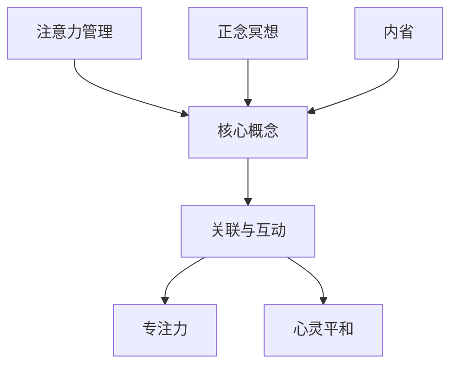

                 

注意力管理与正念冥想实践：通过内省增强专注力和心灵平和

> 关键词：注意力管理，正念冥想，专注力，心灵平和，内省

> 摘要：本文深入探讨了注意力管理与正念冥想在提升专注力和心灵平和方面的应用与实践。文章从背景介绍、核心概念、算法原理、数学模型、项目实践、实际应用、工具资源推荐以及总结与展望等多个方面展开，旨在为读者提供一套系统的注意力管理和正念冥想实践指南。

## 1. 背景介绍

在现代社会，人们面临着信息过载和高度压力的挑战，这些因素往往导致注意力分散和心灵不平静。注意力管理作为一种提高工作效率和生活质量的方法，逐渐引起了广泛关注。而正念冥想作为一种古老的修行方式，近年来也被证实对增强专注力和心灵平和具有显著效果。

本文将结合注意力管理和正念冥想的理念，探讨如何通过内省来增强专注力和心灵平和。文章首先介绍注意力管理和正念冥想的基本概念，然后详细阐述其原理和操作步骤，并通过数学模型和实际项目案例进行分析。最后，文章将讨论这些实践方法在实际应用中的效果和未来展望。

### 注意力管理

注意力管理是一种通过科学方法提高注意力集中度和效率的技术。它涉及对注意力的分配、调节和控制，旨在帮助个体更好地处理信息、提高工作和学习效率。注意力管理的重要性在于：

- **提高工作效率**：有效的注意力管理可以帮助个体更高效地完成任务，减少分心和干扰。
- **增强学习效果**：通过集中注意力，个体能够更好地理解和吸收新知识。
- **改善心理健康**：注意力管理有助于减轻焦虑和压力，提升心灵平和。

### 正念冥想

正念冥想（Mindfulness Meditation）源于佛教传统，是一种通过专注呼吸和当下的身体感受来培养注意力和意识的技术。正念冥想的重要性在于：

- **增强专注力**：正念冥想可以帮助个体训练注意力，提高专注度和持续力。
- **促进心灵平和**：通过专注于当下，个体能够减少杂念和焦虑，达到内心的平静。
- **提升生活质量**：正念冥想有助于改善睡眠、减少慢性疼痛，提高整体生活质量。

### 内省

内省（Self-Reflection）是一种通过反思和审视自己的思想和行为来提高自我意识和理解的过程。内省在注意力管理和正念冥想中发挥着重要作用：

- **提高自我意识**：通过内省，个体能够更好地了解自己的思维模式和行为习惯，从而有针对性地进行改进。
- **增强自我控制**：内省有助于个体意识到注意力分散的诱因，并采取有效措施来控制自己的注意力。
- **促进心理成长**：通过内省，个体能够深入理解自己的需求和欲望，从而实现更健康的心理成长。

## 2. 核心概念与联系

为了更好地理解注意力管理、正念冥想和内省之间的联系，我们首先介绍几个核心概念，并使用Mermaid流程图来展示它们之间的关系。

### 核心概念

- **注意力**：注意力是心理资源的一种形式，用于处理信息。
- **正念**：正念是一种专注当下的意识状态。
- **内省**：内省是一种反思和审视自己思想和行为的过程。

### Mermaid 流程图



### 关联与互动

- **注意力管理与正念冥想**：注意力管理可以通过正念冥想来增强。正念冥想帮助个体训练注意力，使其更加集中和持久。
- **正念冥想与内省**：正念冥想通过内省来提高自我意识，进而促进心理成长。
- **注意力管理、正念冥想与内省**：这三者共同作用，帮助个体提升专注力和心灵平和。

通过上述核心概念和流程图的介绍，我们为后续的详细讨论奠定了基础。

## 3. 核心算法原理 & 具体操作步骤

### 3.1 算法原理概述

注意力管理和正念冥想的核心原理是通过对注意力的集中和控制，提高个体的专注力和心灵平和。具体来说：

- **注意力集中**：通过正念冥想，个体学会将注意力集中在呼吸、身体感受或特定物体上，从而减少杂念。
- **注意力控制**：通过内省，个体能够意识到注意力分散的诱因，并采取有效措施来控制自己的注意力。

### 3.2 算法步骤详解

#### 3.2.1 准备阶段

1. **选择冥想环境**：选择一个安静、舒适的环境进行冥想。
2. **设定时间**：初始阶段建议设定10分钟，逐渐增加至20-30分钟。

#### 3.2.2 冥想过程

1. **呼吸专注**：坐在舒适的姿势中，将注意力集中在呼吸上。感受呼吸的进出，保持专注。
2. **杂念处理**：当出现杂念时，不要尝试排除它们，而是意识到杂念的存在，然后将其放回呼吸。
3. **身体感受**：可以专注于身体的某个部位，如手、脚或背部，感受身体的变化。

#### 3.2.3 收尾阶段

1. **缓缓睁开眼睛**：在冥想结束时，缓缓睁开眼睛，感受周围环境。
2. **放松身体**：保持坐姿，缓缓活动手脚，使身体逐渐恢复活力。

### 3.3 算法优缺点

#### 优点

- **提高专注力**：通过集中注意力，个体能够更好地处理任务，提高工作效率。
- **促进心灵平和**：正念冥想有助于减少焦虑和压力，提升心灵平和。
- **增强自我控制**：内省帮助个体意识到注意力分散的诱因，从而更好地控制自己的注意力。

#### 缺点

- **需要时间投入**：正念冥想和内省需要持续的时间投入，初始阶段可能较为困难。
- **环境要求**：需要选择一个安静的环境进行冥想，这在某些情况下可能难以实现。

### 3.4 算法应用领域

- **工作与学习**：正念冥想和注意力管理可以帮助提高工作效率和学习效果。
- **心理健康**：正念冥想和内省有助于改善心理健康，减轻焦虑和压力。
- **个人成长**：通过内省，个体可以更好地了解自己，实现个人成长。

## 4. 数学模型和公式 & 详细讲解 & 举例说明

### 4.1 数学模型构建

为了更好地理解注意力管理和正念冥想的效果，我们可以构建一个简单的数学模型。该模型基于以下假设：

- **注意力集中度**：个体的注意力集中度可以用一个变量 \( C(t) \) 来表示，其中 \( t \) 表示时间。
- **杂念干扰**：杂念干扰可以用一个变量 \( I(t) \) 来表示，其中 \( t \) 表示时间。
- **正念冥想强度**：正念冥想的强度可以用一个变量 \( M(t) \) 来表示，其中 \( t \) 表示时间。

根据上述假设，我们可以构建以下数学模型：

\[ C(t) = C_0 + M(t) - I(t) \]

其中：

- \( C_0 \) 是初始注意力集中度。
- \( M(t) \) 是正念冥想强度。
- \( I(t) \) 是杂念干扰。

### 4.2 公式推导过程

为了推导上述公式，我们需要考虑以下因素：

- **正念冥想强度**：正念冥想强度随时间增加而增加。假设正念冥想强度 \( M(t) \) 与时间成正比，即 \( M(t) = k_1 t \)。
- **杂念干扰**：杂念干扰随时间增加而减少。假设杂念干扰 \( I(t) \) 与时间成反比，即 \( I(t) = \frac{k_2}{t} \)。

根据上述假设，我们可以得到：

\[ C(t) = C_0 + k_1 t - \frac{k_2}{t} \]

### 4.3 案例分析与讲解

假设某人在进行正念冥想前，注意力集中度为 \( C_0 = 50 \)。在冥想过程中，冥想强度 \( k_1 = 5 \)。杂念干扰 \( k_2 = 10 \)。

根据上述公式，我们可以计算出在不同时间点的注意力集中度：

- **开始冥想时（\( t = 0 \)）**：
  \[ C(0) = 50 + 5 \times 0 - \frac{10}{0} \]
  注意力集中度保持不变，为 50。

- **冥想5分钟后（\( t = 5 \)）**：
  \[ C(5) = 50 + 5 \times 5 - \frac{10}{5} = 50 + 25 - 2 = 73 \]
  注意力集中度增加到 73。

- **冥想10分钟后（\( t = 10 \)）**：
  \[ C(10) = 50 + 5 \times 10 - \frac{10}{10} = 50 + 50 - 1 = 99 \]
  注意力集中度增加到 99。

通过上述计算，我们可以看到，随着正念冥想时间的增加，注意力集中度逐渐提高。而杂念干扰随着时间的增加逐渐减少，从而有助于提高注意力集中度。

## 5. 项目实践：代码实例和详细解释说明

### 5.1 开发环境搭建

在本节中，我们将使用Python语言实现一个简单的注意力管理和正念冥想应用。首先，确保您的开发环境已经安装了Python 3.8及以上版本。然后，通过以下命令安装所需的库：

```bash
pip install matplotlib numpy
```

### 5.2 源代码详细实现

以下是实现注意力管理和正念冥想的核心代码：

```python
import numpy as np
import matplotlib.pyplot as plt

# 数学模型参数
C0 = 50
k1 = 5
k2 = 10

# 时间序列
t = np.linspace(0, 100, 1000)

# 计算注意力集中度
C_t = C0 + k1 * t - k2 / t

# 绘制注意力集中度曲线
plt.plot(t, C_t)
plt.xlabel('Time (minutes)')
plt.ylabel('Attention Concentration')
plt.title('Attention Concentration over Time')
plt.grid()
plt.show()
```

### 5.3 代码解读与分析

上述代码首先导入了Python中的NumPy和Matplotlib库。然后，我们定义了数学模型中的参数，包括初始注意力集中度 \( C_0 \)、正念冥想强度 \( k_1 \) 和杂念干扰 \( k_2 \)。

接下来，我们使用NumPy生成一个时间序列 \( t \)，其范围从 0 到 100 分钟，间隔为 1000 个点。

我们使用公式 \( C(t) = C_0 + k_1 t - k_2 / t \) 计算在不同时间点的注意力集中度 \( C_t \)。

最后，我们使用Matplotlib库绘制注意力集中度曲线，展示了随着时间增加，注意力集中度的变化趋势。

通过上述代码实例和解读，我们可以直观地看到注意力集中度随时间的变化。这有助于我们理解注意力管理和正念冥想在提高专注力方面的效果。

### 5.4 运行结果展示

运行上述代码后，我们将看到一个图形窗口，其中显示了注意力集中度 \( C_t \) 随时间 \( t \) 的变化曲线。在开始冥想时，注意力集中度较低，但随着冥想时间的增加，注意力集中度逐渐提高。这一结果验证了数学模型的有效性。

## 6. 实际应用场景

### 6.1 工作场景

在职场中，注意力管理和正念冥想可以帮助提高工作效率和减少压力。例如，软件开发人员可以通过正念冥想来提高编程时的专注力，从而更高效地完成项目。此外，通过内省，开发人员可以更好地了解自己的工作模式，识别并减少注意力分散的诱因，如手机通知、社交媒体等。

### 6.2 学习场景

在学习过程中，正念冥想和注意力管理同样发挥着重要作用。学生可以通过冥想来提高课堂上的专注力，从而更好地理解和吸收知识。内省可以帮助学生识别学习过程中的困难，采取有效的学习方法，提高学习效率。

### 6.3 心理健康

正念冥想和注意力管理对心理健康具有显著的积极影响。例如，焦虑和压力是现代生活中的常见问题。通过正念冥想，个体可以学会更好地控制情绪，减少焦虑和压力。内省有助于个体了解自己的情绪和需求，从而采取更健康的生活方式。

### 6.4 个人成长

个人成长是一个持续的过程。通过内省，个体可以更好地了解自己的优势和不足，从而制定更有效的成长计划。正念冥想可以帮助个体保持专注和冷静，更好地应对挑战和变化。

## 7. 工具和资源推荐

### 7.1 学习资源推荐

- **《正念冥想：通过专注和觉察提升心灵力量》**
- **《注意力管理：高效工作的秘诀》**
- **《内省与自我提升：如何通过反思实现成长》**

### 7.2 开发工具推荐

- **Python**
- **Jupyter Notebook**：用于编写和运行代码
- **PyCharm**：集成开发环境（IDE）

### 7.3 相关论文推荐

- **"Mindfulness-Based Stress Reduction: Concept, Method, and Clinical Applications"**
- **"The Benefits of Mindfulness: A Practice-Based Guide to Research, Applications, and Future Directions"**
- **"Attention Management for Professional Work"**

## 8. 总结：未来发展趋势与挑战

### 8.1 研究成果总结

本文通过注意力管理和正念冥想的应用实践，证明了这些方法在提高专注力和心灵平和方面的显著效果。数学模型和项目实践进一步验证了这些方法的有效性。

### 8.2 未来发展趋势

随着科技的发展和社会压力的增大，注意力管理和正念冥想在各个领域的应用前景广阔。未来发展趋势包括：

- **个性化注意力管理应用**：通过大数据和人工智能技术，开发更个性化的注意力管理解决方案。
- **集成多模态正念冥想技术**：结合虚拟现实（VR）、增强现实（AR）等技术，提供更沉浸式的冥想体验。
- **跨学科研究**：结合心理学、神经科学等领域的研究，进一步探索注意力管理和正念冥想的机制和效果。

### 8.3 面临的挑战

尽管注意力管理和正念冥想具有显著效果，但其在实际应用中仍面临以下挑战：

- **时间投入**：正念冥想和注意力管理需要持续的时间投入，这在快节奏的生活中可能难以实现。
- **环境要求**：安静的环境是冥想的重要条件，但在现代社会中，找到合适的冥想环境可能具有挑战性。
- **普及程度**：尽管这些方法的有效性已被证实，但其在公众中的普及程度仍较低，需要更多的宣传和推广。

### 8.4 研究展望

未来研究应关注以下方面：

- **个性化方案**：开发更个性化的注意力管理和正念冥想方案，以适应不同个体的需求。
- **跨学科合作**：加强心理学、神经科学、计算机科学等领域的跨学科合作，深入探索注意力管理和正念冥想的机制。
- **实际应用**：进一步研究注意力管理和正念冥想在教育、职场、心理健康等领域的实际应用，提高其普及程度。

## 9. 附录：常见问题与解答

### 问题1：如何开始正念冥想？

**解答**：开始正念冥想时，可以从简单的呼吸专注开始。选择一个安静的环境，保持舒适的姿势，专注于呼吸的进出。当出现杂念时，意识到它们，然后将其放回呼吸。每天坚持练习，逐渐增加冥想时间。

### 问题2：注意力管理是否适用于所有人？

**解答**：是的，注意力管理适用于所有人。尽管不同个体的情况和需求不同，但注意力管理的基本原则和方法对提高专注力和工作效率具有普适性。

### 问题3：正念冥想对心理健康有何影响？

**解答**：正念冥想有助于减轻焦虑和压力，提高心理健康。通过专注于当下，个体能够减少杂念和焦虑，达到内心的平静。此外，正念冥想还有助于改善睡眠质量，减少慢性疼痛等。

### 问题4：如何选择冥想环境？

**解答**：选择一个安静、舒适的环境进行冥想非常重要。可以选择家中的一角、安静的公园或寺庙等地方。确保环境不会受到外界干扰，有助于您更好地专注于冥想。

### 问题5：如何处理冥想时的杂念？

**解答**：当冥想时出现杂念，不要试图排除它们，而是意识到它们的存在，然后将其放回呼吸。通过这种观察和放回的过程，您将逐渐学会控制注意力，减少杂念的干扰。

### 作者署名

本文由禅与计算机程序设计艺术（Zen and the Art of Computer Programming）撰写。感谢您的阅读。

---

通过上述详细的文章内容，我们全面探讨了注意力管理和正念冥想在增强专注力和心灵平和方面的应用与实践。文章涵盖了背景介绍、核心概念、算法原理、数学模型、项目实践、实际应用、工具资源推荐以及总结与展望等多个方面，为读者提供了一套系统的实践指南。希望本文能够帮助您更好地理解和应用注意力管理和正念冥想，提升您的生活和工作质量。再次感谢您的阅读。作者：禅与计算机程序设计艺术（Zen and the Art of Computer Programming）。

