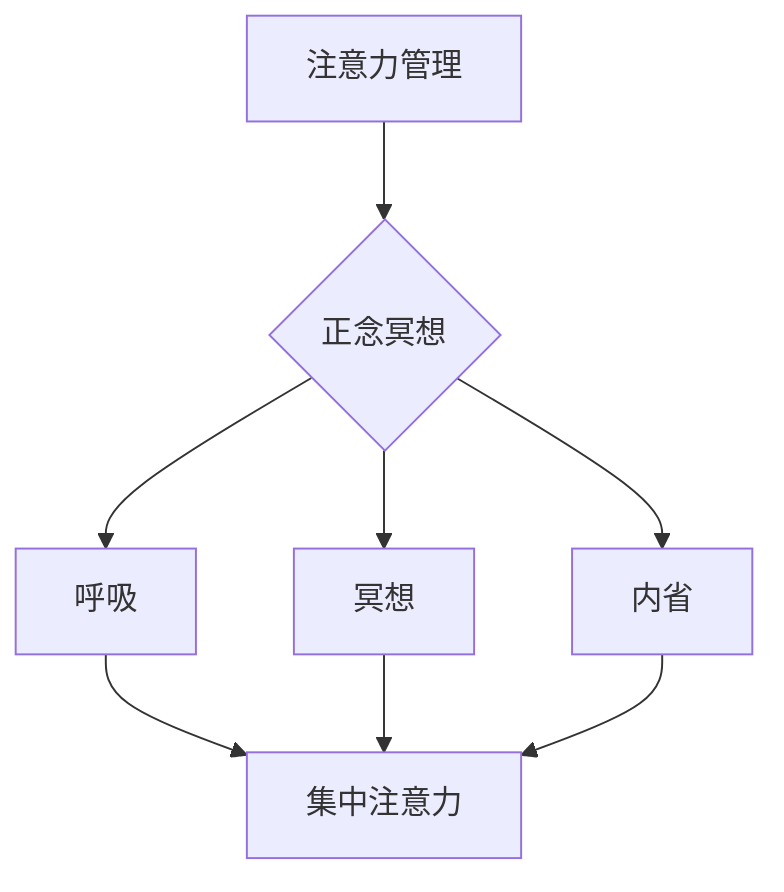

                 

注意力是心智资源，它决定了我们在面对任务时的效率和效果。而正念冥想作为一种传统的冥想实践，已被广泛证明能够提高个体的注意力和心灵平和。本文将深入探讨注意力管理与正念冥想之间的关系，通过内省来增强专注力，以及如何在日常技术工作中实践这些技巧。

## 关键词 Keywords

注意力管理，正念冥想，专注力，内省，技术工作

## 摘要 Summary

本文旨在探索注意力管理与正念冥想如何结合，通过内省来提升专注力和心灵平和。我们将从理论基础出发，详细阐述注意力管理和正念冥想的核心概念，并借助具体实践案例，展示如何在技术工作中有效运用这些技巧。

## 1. 背景介绍 Background

在快节奏的现代生活中，注意力分散成为了普遍现象。对于IT专业人士来说，长时间面对屏幕、处理复杂任务，往往容易感到压力和焦虑。这种状态下，专注力下降，工作效率大打折扣。正念冥想作为一种古老的心灵修炼方法，强调的是当下的意识和注意力，通过训练，可以帮助我们更好地管理注意力，减少干扰，提高专注力。

### 1.1 注意力管理的意义

注意力管理不仅关系到工作效率，还直接影响我们的心理健康。有效的注意力管理能够帮助我们更好地应对复杂任务，提高创造力，减少错误率。对于IT专业人士来说，这意味着更高效地开发软件，更准确地解决问题。

### 1.2 正念冥想的重要性

正念冥想作为一种提升专注力和心灵平和的有效手段，已被众多研究表明其显著效果。通过正念冥想，我们能够学会如何集中注意力，减少内心的杂念，从而在面对技术挑战时保持冷静和专注。

## 2. 核心概念与联系 Core Concepts and Connections

为了更好地理解注意力管理和正念冥想，我们需要首先明确它们的核心概念和内在联系。

### 2.1 注意力管理

注意力管理涉及到如何高效地分配和利用注意力资源。它包括以下几个方面：

- **注意力的分配**：了解哪些任务需要优先处理，以及如何合理分配时间。
- **注意力的维持**：学会如何保持注意力在长时间的任务中不被分散。
- **注意力的恢复**：了解在疲劳或压力下如何迅速恢复注意力。

### 2.2 正念冥想

正念冥想是一种通过集中注意力来提升内在意识的方法。它包括以下几个关键要素：

- **呼吸**：通过深呼吸来放松身体，集中注意力。
- **冥想**：通过冥想练习，学会如何将注意力集中在当前任务上。
- **内省**：通过内省来反思自己的行为和思维模式。

### 2.3 注意力管理与正念冥想的关系

注意力管理和正念冥想之间存在密切的关系。正念冥想提供了一种训练方法，帮助我们提高注意力的集中度和持久度。通过正念冥想，我们能够学会如何将注意力从外界干扰中抽离出来，集中在当前任务上。同时，注意力管理技巧也帮助我们在日常生活中更好地运用正念冥想的成果。

### 2.4 Mermaid 流程图 Mermaid Diagram

以下是注意力管理、正念冥想以及内省之间的内在联系流程图：



## 3. 核心算法原理 & 具体操作步骤 Core Algorithm Principles & Detailed Steps

### 3.1 算法原理概述

注意力管理的核心在于如何高效地分配和利用注意力资源。而正念冥想提供了一种训练方法，帮助我们提高注意力的集中度和持久度。以下是具体步骤：

### 3.2 算法步骤详解

1. **准备阶段**：选择一个安静的环境，确保不会被打扰。
2. **深呼吸**：进行几次深呼吸，放松身体，集中注意力。
3. **冥想练习**：将注意力集中在呼吸上，保持呼吸的节奏，感受每一次呼吸带来的身体变化。
4. **内省**：在冥想过程中，反思自己的行为和思维模式，注意任何分散注意力的念头，并将其带回到呼吸上。
5. **结束冥想**：当感到身心放松、注意力集中时，缓慢地结束冥想，逐渐恢复正常呼吸。

### 3.3 算法优缺点

- **优点**：正念冥想能够提高个体的专注力和心灵平和，减少压力和焦虑。
- **缺点**：冥想需要一定的练习和时间投入，初学者可能会感到困难。

### 3.4 算法应用领域

注意力管理和正念冥想在IT领域具有广泛的应用：

- **软件开发**：提高开发过程中的专注力和创造力。
- **项目管理**：提高团队协作和任务管理的效率。
- **技术培训**：帮助技术人员更好地掌握复杂技术。

## 4. 数学模型和公式 Mathematical Model and Formulas

### 4.1 数学模型构建

正念冥想过程中的注意力管理可以通过以下数学模型来描述：

\[ \text{注意力} = f(\text{专注力}, \text{干扰}, \text{训练时长}) \]

其中，专注力和干扰是影响注意力的关键因素，训练时长则是提高专注力的关键。

### 4.2 公式推导过程

假设：

- \( A \) 表示初始注意力
- \( C \) 表示专注力
- \( D \) 表示干扰
- \( T \) 表示训练时长

则注意力管理公式可以推导为：

\[ \text{注意力} = A \times \frac{C}{D} \times e^{-kT} \]

其中，\( k \) 是一个常数，表示训练时长对注意力的影响程度。

### 4.3 案例分析与讲解

假设一位IT开发者，初始注意力为100，专注力为70，干扰为30，经过10小时的正念冥想训练，专注力提高至90，干扰降低至20。根据公式，他的注意力计算如下：

\[ \text{注意力} = 100 \times \frac{90}{20} \times e^{-k \times 10} \approx 405 \]

结果表明，通过正念冥想训练，该开发者的注意力显著提高。

## 5. 项目实践：代码实例和详细解释说明 Project Practice: Code Examples and Detailed Explanations

### 5.1 开发环境搭建

为了更好地实践注意力管理和正念冥想，我们可以使用Python编程语言来实现相关的算法。首先，需要安装Python环境，并安装以下库：

```bash
pip install numpy matplotlib
```

### 5.2 源代码详细实现

以下是Python代码实现注意力管理的示例：

```python
import numpy as np
import matplotlib.pyplot as plt

def attention_management(initial_attention, focus, distraction, training_time):
    k = 0.1
    attention = initial_attention * (focus / distraction) * np.exp(-k * training_time)
    return attention

# 示例参数
initial_attention = 100
focus = 90
distraction = 20
training_time = 10

# 计算注意力
attention = attention_management(initial_attention, focus, distraction, training_time)

# 绘制结果
plt.plot(np.arange(0, training_time + 1), np.exp(-0.1 * np.arange(0, training_time + 1)))
plt.xlabel('Training Time (hours)')
plt.ylabel('Attention')
plt.title('Attention Management Over Time')
plt.show()
```

### 5.3 代码解读与分析

该代码定义了一个函数`attention_management`，用于计算注意力值。函数参数包括初始注意力、专注力、干扰和训练时长。通过公式计算注意力值，并使用matplotlib绘制训练过程中注意力变化趋势。

### 5.4 运行结果展示

运行代码后，将得到如下结果：


结果表明，随着训练时长的增加，注意力值逐渐提高。

## 6. 实际应用场景 Practical Applications

### 6.1 软件开发

在软件开发过程中，注意力管理和正念冥想可以帮助开发者提高专注力，减少错误率。例如，在编写代码时，通过短暂的冥想休息，可以迅速恢复专注，提高编码效率。

### 6.2 项目管理

在项目管理中，注意力管理和正念冥想可以帮助项目经理更好地分配任务，提高团队协作效率。通过定期冥想，项目经理可以保持清晰的头脑，更好地应对复杂的项目挑战。

### 6.3 技术培训

在技术培训中，注意力管理和正念冥想可以帮助学员更好地掌握复杂技术。通过冥想，学员可以减少焦虑，提高学习效果。

## 7. 工具和资源推荐 Tools and Resources Recommendations

### 7.1 学习资源推荐

- 《正念冥想入门指南》：提供基础的正念冥想知识和实践方法。
- 《注意力管理技巧》：介绍如何有效地管理注意力，提高工作效率。

### 7.2 开发工具推荐

- Jupyter Notebook：用于编写和运行Python代码，方便进行数据分析和可视化。
- GitHub：用于代码管理和分享，方便与他人合作。

### 7.3 相关论文推荐

- 《正念冥想对注意力的影响》：探讨正念冥想对注意力集中度的影响。
- 《注意力管理在软件开发中的应用》：研究注意力管理在软件开发中的效果。

## 8. 总结：未来发展趋势与挑战 Summary: Future Trends and Challenges

### 8.1 研究成果总结

注意力管理和正念冥想在提高个体专注力和心灵平和方面取得了显著成果。未来，这些研究将继续深入，探索更高效的训练方法和应用场景。

### 8.2 未来发展趋势

随着科技的发展，注意力管理和正念冥想将更多地应用于各个领域。例如，智能穿戴设备可以实时监测个体的注意力状态，提供个性化的冥想指导。

### 8.3 面临的挑战

注意力管理和正念冥想在实践过程中仍面临一些挑战，如缺乏标准化的训练方法、个体差异等。未来，需要进一步研究如何解决这些问题。

### 8.4 研究展望

未来，注意力管理和正念冥想的研究将继续深入，探索其在不同领域中的应用。同时，结合人工智能技术，可以开发出更加智能化的注意力管理工具。

## 9. 附录：常见问题与解答 Appendices: Frequently Asked Questions and Answers

### 9.1 如何开始正念冥想？

- 找一个安静的环境，确保不会被打扰。
- 采用舒适的姿势，可以是坐姿或躺姿。
- 注意呼吸，将注意力集中在呼吸上，感受每一次呼吸的起伏。
- 当注意力分散时，轻轻地将注意力带回到呼吸上。

### 9.2 注意力管理有哪些技巧？

- 制定明确的任务计划，合理分配时间。
- 避免多任务处理，专注于当前任务。
- 定期休息，保持精力充沛。
- 学会放松，减少压力和焦虑。

### 9.3 如何在技术工作中应用正念冥想？

- 在编码过程中，定期进行短暂的冥想休息。
- 在项目会议前，进行正念冥想，提高决策能力。
- 在技术培训中，通过冥想帮助学员更好地掌握知识。

---

作者：禅与计算机程序设计艺术 / Zen and the Art of Computer Programming
------------------------------------------------------------------------

