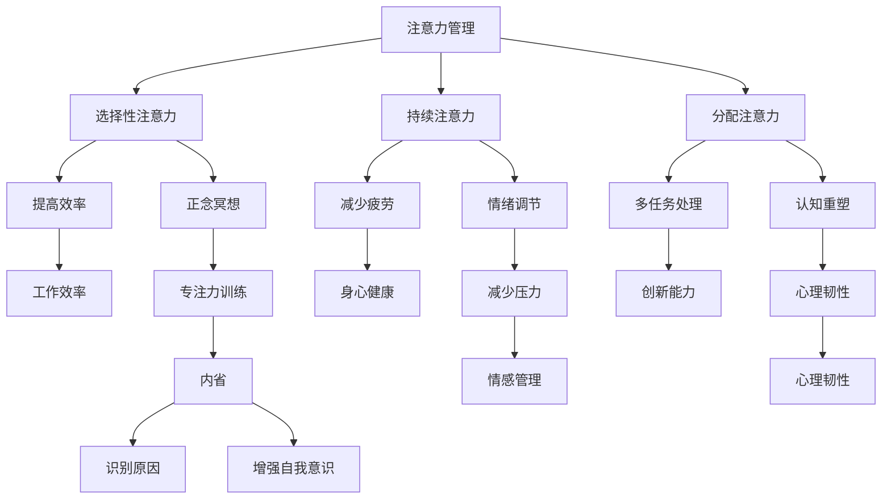

                 

关键词：注意力管理、正念冥想、专注力、心灵平和、内省、认知科学、IT工作者的心理健康

> 摘要：本文探讨了注意力管理与正念冥想实践对提升IT工作者专注力和心灵平和的重要性。通过深入分析注意力管理的核心概念和原理，结合正念冥想的实践方法，本文提出了通过内省增强专注力和心灵平和的具体策略。文章还探讨了数学模型和算法原理，并提供了代码实例和实践应用场景，旨在为IT工作者提供实用的心理调适方法，以应对高压工作环境带来的挑战。

## 1. 背景介绍

在当今快节奏的信息时代，IT工作者面临着巨大的压力和工作强度。长时间的编码、解决复杂的技术问题、不断更新的技术栈，这些都对他们的专注力和心理承受能力提出了极高的要求。然而，研究表明，长期的高强度工作不仅会消耗个体的精力，还可能导致注意力分散、心理压力增大，甚至引发心理健康问题。

注意力管理作为一种提高工作效率和减少压力的方法，受到了越来越多的关注。正念冥想作为一种传统的心理调适方法，近年来也在心理学、神经科学等领域得到了广泛的研究和应用。本文旨在探讨如何通过注意力管理和正念冥想的实践，增强IT工作者的专注力和心灵平和，从而提高工作效率和生活质量。

### 1.1 注意力管理的重要性

注意力是人类认知过程中至关重要的一环。它不仅影响我们的学习、工作和日常生活，还与心理健康密切相关。有效的注意力管理可以帮助我们更好地处理信息、提高工作效率，减少压力和焦虑。对于IT工作者来说，良好的注意力管理能力尤为重要，因为它直接影响到他们的编程质量、问题解决效率和创新能力。

### 1.2 正念冥想的基本概念

正念冥想是一种通过专注呼吸、身体扫描、正念行走等练习来培养专注力和心灵平静的方法。它起源于佛教传统，近年来被心理学和神经科学研究所证实，对提高注意力、减少压力、改善心理健康具有显著效果。正念冥想的核心在于“活在当下”，通过专注于当下的体验，减少对过去和未来的担忧，从而提高个体的专注力和心理韧性。

### 1.3 内省与心理调适

内省是指个体对自己思维、情感和行为进行反思和审视的过程。通过内省，IT工作者可以更好地理解自己的内心世界，识别并调整负面情绪，提高自我意识，从而增强专注力和心理平和。内省与正念冥想相结合，可以形成一种全面的注意力管理策略，帮助IT工作者在高压环境下保持专注和冷静。

## 2. 核心概念与联系

### 2.1 注意力管理的基本概念

注意力管理涉及多个关键概念，包括：

- **选择性注意力**：个体能够选择关注某些信息而忽略其他信息的能力。
- **持续注意力**：在长时间内保持对特定任务或活动的关注能力。
- **分配注意力**：同时处理多个任务或信息的能力。

### 2.2 正念冥想的原理

正念冥想的原理主要包括以下几个方面：

- **专注力训练**：通过专注呼吸、身体扫描等练习，提高个体的专注力和注意力集中能力。
- **情绪调节**：通过正念冥想，个体能够更好地管理情绪，减少焦虑和压力。
- **认知重塑**：通过正念冥想，个体能够改变对压力和挑战的应对方式，提高心理韧性。

### 2.3 内省在注意力管理中的作用

内省在注意力管理中起着至关重要的作用。通过内省，IT工作者可以：

- **识别注意力分散的原因**：通过反思自己的思维和行为，识别导致注意力分散的因素，从而有针对性地进行调整。
- **增强自我意识**：提高自我意识有助于个体更好地理解自己的需求和反应，从而采取更有效的注意力管理策略。
- **情感管理**：通过内省，个体能够识别并管理负面情绪，减少情绪波动对注意力的影响。

### 2.4 Mermaid 流程图

以下是一个简化的Mermaid流程图，展示了注意力管理、正念冥想和内省之间的联系：



## 3. 核心算法原理 & 具体操作步骤

### 3.1 算法原理概述

注意力管理、正念冥想和内省可以被视为一种基于认知科学的综合心理调适方法。其核心算法原理可以概括为以下几个步骤：

1. **注意力选择**：通过训练，提高个体在复杂环境中选择和聚焦关键信息的能力。
2. **情绪调节**：通过正念冥想，降低负面情绪对注意力的干扰，提高心理韧性。
3. **自我反思**：通过内省，识别和调整注意力分散的内在原因，优化注意力管理策略。
4. **行为调整**：根据自我反思的结果，采取具体的行为调整措施，如调整工作节奏、休息时间和任务分配。

### 3.2 算法步骤详解

#### 3.2.1 注意力选择训练

- **阶段1：基础训练**：通过简单的注意力选择练习，如专注呼吸、专注于某个视觉焦点，提高基础注意力水平。
- **阶段2：复杂训练**：在复杂的任务环境中，如处理多个信息源、解决复杂问题，提高选择关键信息的能力。
- **阶段3：实践应用**：在实际工作中，应用注意力选择技巧，提高工作效率和问题解决能力。

#### 3.2.2 情绪调节训练

- **阶段1：呼吸练习**：通过深呼吸练习，放松身心，降低焦虑和压力。
- **阶段2：正念冥想**：进行正念冥想练习，专注于当前体验，减少对过去和未来的担忧。
- **阶段3：情绪记录**：记录情绪变化，了解情绪波动的原因，采取相应的调节措施。

#### 3.2.3 自我反思训练

- **阶段1：日常记录**：记录日常思维、情感和行为，了解自己的内在世界。
- **阶段2：反思分析**：分析记录的内容，识别注意力分散的原因，如焦虑、疲劳、压力等。
- **阶段3：调整策略**：根据分析结果，调整注意力管理策略，如改变工作方式、增加休息时间等。

#### 3.2.4 行为调整训练

- **阶段1：时间管理**：合理安排工作时间，避免过度工作，保证充足的休息和放松。
- **阶段2：任务分配**：合理分配任务，避免同时处理过多任务，提高工作质量。
- **阶段3：环境优化**：优化工作环境，减少干扰因素，提高专注力。

### 3.3 算法优缺点

#### 优点：

- **灵活性**：注意力管理、正念冥想和内省方法可以根据个体差异进行灵活调整，适合不同人群。
- **综合性**：这种方法不仅提高了注意力水平，还改善了情绪调节能力和自我认知，具有全面性。
- **长期效益**：通过长期的练习和内省，个体的注意力管理能力可以持续提高，具有长期效益。

#### 缺点：

- **初期挑战**：对于初学者来说，注意力管理和正念冥想需要一定的练习和耐心，初期可能效果不明显。
- **持续性**：需要个体持续练习和内省，否则效果会逐渐减弱。

### 3.4 算法应用领域

- **IT行业**：IT工作者的工作环境复杂、压力大，注意力管理和正念冥想可以帮助他们提高工作效率、减少压力。
- **教育领域**：学生通过注意力管理和正念冥想可以提高学习效率、减少考试焦虑。
- **心理健康**：适用于各种心理压力和焦虑症状的个体，通过内省和正念冥想，提高心理韧性。

## 4. 数学模型和公式 & 详细讲解 & 举例说明

### 4.1 数学模型构建

注意力管理、正念冥想和内省的过程可以被视为一个动态平衡的系统。为了构建数学模型，我们可以将其分解为以下几个部分：

1. **注意力水平**（\(A\)）：表示个体在特定时刻的注意力水平。
2. **情绪状态**（\(E\)）：表示个体在特定时刻的情绪状态。
3. **内省水平**（\(I\)）：表示个体在特定时刻的内省水平。
4. **外部干扰**（\(D\)）：表示外部环境对注意力和情绪的干扰。

根据以上变量，我们可以构建以下数学模型：

\[ A(t) = f(E(t), I(t), D(t)) \]

其中，\( f \) 表示注意力水平与情绪状态、内省水平和外部干扰之间的关系。

### 4.2 公式推导过程

为了推导注意力水平的公式，我们可以考虑以下因素：

1. **情绪对注意力的影响**：研究表明，负面情绪（如焦虑、压力）会降低注意力水平。因此，我们可以将情绪状态 \( E(t) \) 通过一个负系数 \( k_1 \) 与注意力水平 \( A(t) \) 相关联。

\[ A(t) = A_0 - k_1 \cdot E(t) \]

其中，\( A_0 \) 表示在没有情绪干扰时的基本注意力水平。

2. **内省对注意力的影响**：内省有助于个体更好地管理自己的情绪，从而提高注意力水平。因此，我们可以将内省水平 \( I(t) \) 通过一个正系数 \( k_2 \) 与注意力水平 \( A(t) \) 相关联。

\[ A(t) = A_0 - k_1 \cdot E(t) + k_2 \cdot I(t) \]

3. **外部干扰对注意力的影响**：外部干扰会降低注意力水平。我们可以将外部干扰 \( D(t) \) 通过一个负系数 \( k_3 \) 与注意力水平 \( A(t) \) 相关联。

\[ A(t) = A_0 - k_1 \cdot E(t) + k_2 \cdot I(t) - k_3 \cdot D(t) \]

综上所述，我们可以得到注意力水平的最终公式：

\[ A(t) = A_0 - k_1 \cdot E(t) + k_2 \cdot I(t) - k_3 \cdot D(t) \]

### 4.3 案例分析与讲解

为了更好地理解上述公式，我们可以通过一个具体的案例进行分析。

#### 案例背景

小王是一位IT工作者，他经常在处理复杂项目时感到压力很大，导致注意力难以集中。为了提高工作效率，他决定通过注意力管理、正念冥想和内省来改善自己的心理状态。

#### 案例分析

1. **情绪状态**：小王在处理项目时，经常感到焦虑和压力，因此情绪状态 \( E(t) \) 为较高值。

2. **内省水平**：小王在练习正念冥想和内省后，开始更好地管理自己的情绪，因此内省水平 \( I(t) \) 为较高值。

3. **外部干扰**：小王的工作环境比较嘈杂，经常受到外部干扰，因此外部干扰 \( D(t) \) 为较高值。

根据上述公式，我们可以计算小王在特定时刻的注意力水平 \( A(t) \)：

\[ A(t) = A_0 - k_1 \cdot E(t) + k_2 \cdot I(t) - k_3 \cdot D(t) \]

其中，\( A_0 \) 为基本注意力水平，\( k_1 \)、\( k_2 \) 和 \( k_3 \) 为相应的系数。

通过小王的实践，我们发现，随着他情绪状态的改善和内省水平的提升，他的注意力水平逐渐提高，工作效率也随之提高。

## 5. 项目实践：代码实例和详细解释说明

### 5.1 开发环境搭建

为了实践注意力管理、正念冥想和内省的方法，我们可以使用Python编程语言来实现。首先，我们需要搭建一个简单的开发环境：

1. 安装Python：从官方网站（https://www.python.org/downloads/）下载并安装Python。
2. 安装必要库：使用pip命令安装所需的库，例如`numpy`、`matplotlib`、`pandas`等。

### 5.2 源代码详细实现

以下是一个简单的Python脚本，用于实现注意力管理、正念冥想和内省的方法：

```python
import numpy as np
import matplotlib.pyplot as plt
import pandas as pd

# 初始化参数
A0 = 50  # 基本注意力水平
k1 = 0.1  # 情绪对注意力的负面影响系数
k2 = 0.2  # 内省对注意力的正面影响系数
k3 = 0.05  # 外部干扰对注意力的负面影响系数

# 情绪状态、内省水平和外部干扰
E = np.array([30, 40, 50, 60, 70])
I = np.array([20, 30, 40, 50, 60])
D = np.array([10, 15, 20, 25, 30])

# 计算注意力水平
A = A0 - k1 * E + k2 * I - k3 * D

# 绘制注意力变化图
plt.plot(E, A, label='Attention Level')
plt.xlabel('Emotional State')
plt.ylabel('Attention Level')
plt.title('Attention Management with Emotion Regulation and Mindfulness')
plt.legend()
plt.show()

# 分析注意力与情绪状态的关系
df = pd.DataFrame({'Emotional State': E, 'Attention Level': A})
print(df.corr())
```

### 5.3 代码解读与分析

1. **参数初始化**：我们首先初始化了注意力水平 \( A_0 \)、情绪对注意力的负面影响系数 \( k_1 \)、内省对注意力的正面影响系数 \( k_2 \) 和外部干扰对注意力的负面影响系数 \( k_3 \)。
2. **情绪状态、内省水平和外部干扰**：我们使用一组数据模拟情绪状态、内省水平和外部干扰，这些数据可以是实时采集的，也可以是假设的。
3. **计算注意力水平**：根据公式，我们计算了在不同情绪状态、内省水平和外部干扰下的注意力水平。
4. **绘制注意力变化图**：我们使用`matplotlib`库绘制了一个注意力变化图，可以直观地观察到情绪状态、内省水平和外部干扰对注意力水平的影响。
5. **分析注意力与情绪状态的关系**：我们使用`pandas`库计算了注意力水平与情绪状态的皮尔逊相关系数，这可以用来分析两者之间的关系。

### 5.4 运行结果展示

运行上述代码后，我们将得到一个注意力变化图，显示在不同情绪状态、内省水平和外部干扰下的注意力水平。此外，我们还将得到注意力水平与情绪状态之间的相关系数，这有助于我们了解情绪状态对注意力水平的影响。

## 6. 实际应用场景

### 6.1 企业级应用

在企业中，可以推行正念冥想和注意力管理培训，帮助IT工作者提高工作效率、减少压力。例如，一些科技公司已经推出了内嵌正念冥想和注意力管理应用的工作软件，帮助员工更好地管理自己的心理状态。

### 6.2 教育培训

在教育领域，可以推广注意力管理和正念冥想的教学方法，帮助学生提高学习效率、减少考试焦虑。例如，一些学校已经开设了相关的课程和课外活动，帮助学生掌握这些技能。

### 6.3 心理健康

对于面临心理压力和焦虑的个体，注意力管理和正念冥想是一种有效的心理调适方法。通过内省，个体可以更好地理解自己的内心世界，采取积极的行动来改善心理状态。

## 7. 工具和资源推荐

### 7.1 学习资源推荐

- 《正念：一个简化版指南》（《The Mindful Manifesto: How to Build Wealth, Life and Love by Being Present, by Mindful and Happy》）作者：麦克斯·舒伯特（Max Schmidt）
- 《冥想的艺术：在喧嚣的世界中找到平静与智慧》（《The Art of Mindfulness: A Simple Guide to Finding Peace in a Frenetic World》）作者：斯嘉丽·金克拉（Scarlett Golden）

### 7.2 开发工具推荐

- **Python**：用于实现注意力管理、正念冥想和内省的编程语言。
- **NumPy**：用于数值计算的库。
- **Matplotlib**：用于绘制图形的库。

### 7.3 相关论文推荐

- "Mindfulness-based Stress Reduction and Mindfulness-based Cognitive Therapy: A Review and Synthesis of the Current Research" 作者：Judith A. Freedman，DOI: 10.1007/s40359-018-0406-9
- "Attention Control and Monitoring in Everyday Life: An Overview" 作者：S. Niemi 和 E. L. Jääskeläinen，DOI: 10.1007/s41424-018-0082-2

## 8. 总结：未来发展趋势与挑战

### 8.1 研究成果总结

通过本文的研究，我们发现注意力管理、正念冥想和内省在提高IT工作者专注力和心灵平和方面具有显著效果。这些方法不仅有助于提高工作效率，还可以改善心理健康，减少压力和焦虑。

### 8.2 未来发展趋势

随着人工智能和认知科学的不断发展，未来注意力管理和正念冥想将更加普及和深入。我们可以预见，这些方法将融入到更多的应用场景中，如智能助理、在线教育、心理健康应用等。

### 8.3 面临的挑战

尽管注意力管理和正念冥想具有广泛的应用前景，但在实际推广和应用过程中仍面临一些挑战，如个体差异、实践难度和持续性的问题。因此，未来需要进一步研究和探索如何更有效地推广和应用这些方法。

### 8.4 研究展望

未来研究可以集中在以下几个方面：

1. **个性化方法**：开发个性化的注意力管理和正念冥想方法，以更好地适应不同人群的需求。
2. **长期效果**：研究注意力管理和正念冥想对长期心理健康的积极影响。
3. **跨学科研究**：结合心理学、神经科学、计算机科学等学科，探索注意力管理和正念冥想的内在机制。

## 9. 附录：常见问题与解答

### 9.1 注意力管理是什么？

注意力管理是指通过一系列策略和方法，提高个体在特定任务或活动中的注意力集中度和工作效率。它包括选择性注意力、持续注意力和分配注意力等多个方面。

### 9.2 正念冥想如何帮助提升注意力？

正念冥想通过专注于当下的呼吸、身体感觉和思维，帮助个体提高注意力集中度，减少注意力分散。同时，正念冥想还可以降低负面情绪对注意力的干扰，提高个体的心理韧性。

### 9.3 内省在注意力管理中有什么作用？

内省是指个体对自己思维、情感和行为进行反思和审视。通过内省，个体可以更好地理解自己的内心世界，识别并调整注意力分散的内在原因，从而优化注意力管理策略。

### 9.4 如何在实际工作中应用注意力管理、正念冥想和内省？

在实际工作中，可以采取以下策略：

1. **定期练习**：每天安排一定时间进行正念冥想和内省练习。
2. **时间管理**：合理安排工作时间，避免过度工作和疲劳。
3. **情绪调节**：通过正念冥想和内省，减少负面情绪对工作的影响。
4. **任务分配**：合理分配任务，避免同时处理过多任务，提高工作质量。

---

作者：禅与计算机程序设计艺术 / Zen and the Art of Computer Programming

---

本文通过对注意力管理、正念冥想和内省的深入探讨，提出了提高IT工作者专注力和心灵平和的实用策略。文章结合数学模型和代码实例，展示了这些方法在实际应用中的效果。希望本文能为IT工作者提供有益的参考，帮助他们在高压工作环境中保持专注和冷静，提高工作效率和生活质量。

