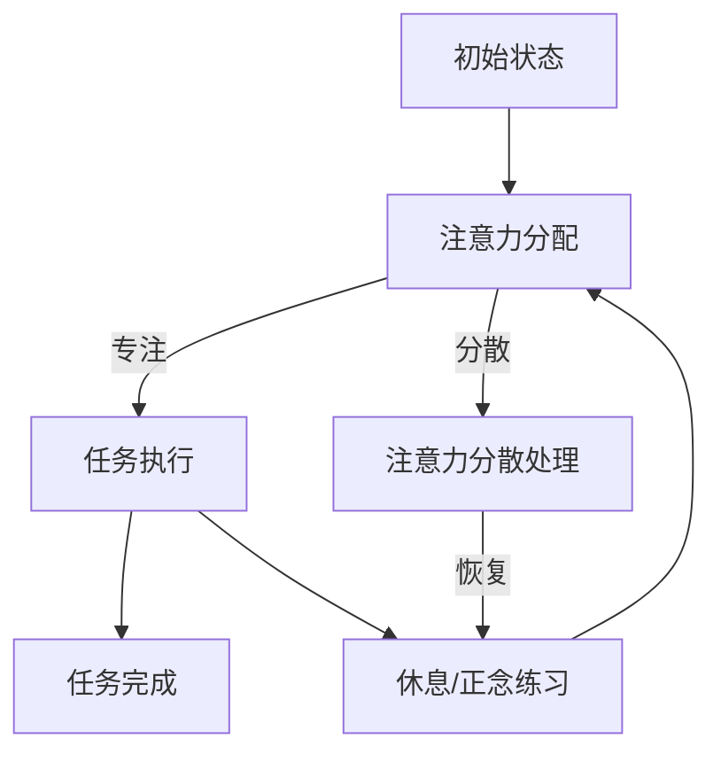

                 

注意力管理和正念练习是提高个人效率和生活质量的关键因素。在快节奏的现代生活中，人们往往面临着信息过载和压力的挑战，这使得注意力管理成为一项至关重要的技能。本文旨在探讨注意力管理的核心概念、实践方法及其在信息技术领域的应用，并通过数学模型和项目实践，提供实用的技巧和工具，帮助读者提升专注力。

## 文章关键词

- 注意力管理
- 正念练习
- 专注力
- 信息技术
- 算法
- 数学模型
- 项目实践

## 文章摘要

本文首先介绍了注意力管理和正念练习的基本概念及其在信息技术领域的应用。随后，通过详细的数学模型和公式推导，阐述了如何构建有效的注意力管理系统。文章还通过一个实际项目，展示了如何在编程中实践注意力管理技巧。最后，我们对未来的发展趋势和挑战进行了展望，并提供了学习资源和开发工具的推荐。

## 1. 背景介绍

### 注意力管理的重要性

注意力管理是个人发展中的一个关键领域。高效的注意力管理不仅能提高工作效率，还能改善生活质量。在信息技术领域，开发人员的专注力直接影响到软件开发的效率和代码质量。研究表明，专注力不足会导致错误率上升、开发周期延长以及工作满意度降低。

### 正念练习的兴起

正念练习（Mindfulness Practices）源自佛教传统，近年来在全球范围内得到了广泛的应用和研究。正念练习旨在帮助个体培养对当前时刻的清醒认识和专注力。通过正念练习，人们可以减少分心、提高注意力的集中度，从而在日常生活中表现出更高的效率和自我控制力。

### 信息技术领域的应用

在信息技术领域，正念练习和注意力管理技巧被广泛应用于以下几个方面：

1. **软件开发**：通过正念练习，开发人员可以更好地管理自己的注意力，减少在编写代码过程中的错误，提高代码的质量和效率。
2. **项目管理**：项目经理通过正念练习，能够更有效地管理时间和资源，提高团队的整体协作效率。
3. **用户体验设计**：设计师通过正念练习，能够更深入地理解用户需求，创造出更符合用户期望的产品。

## 2. 核心概念与联系

### 注意力管理的基本概念

注意力管理涉及以下核心概念：

1. **注意力焦点**：个体在特定任务上的集中程度。
2. **注意力分散**：在任务执行过程中，注意力被其他无关事物分散的情况。
3. **注意力恢复**：在注意力耗尽后，通过休息和放松来恢复注意力的过程。

### 正念练习的核心原理

正念练习主要基于以下原理：

1. **觉知**：对当前时刻的清晰感知，不评判地接纳自己的所思所感。
2. **呼吸**：通过呼吸练习，调节情绪和生理状态，提高专注力。
3. **身体觉知**：通过身体扫描练习，增强对身体感受的觉知，减少身体不适。

### Mermaid 流程图

以下是一个简化的注意力管理系统架构的 Mermaid 流程图：



### 注意力管理系统的整体架构

注意力管理系统的整体架构包括以下几个关键部分：

1. **注意力监测**：实时监测个体的注意力水平，为后续的处理提供数据支持。
2. **分散处理**：当注意力分散时，系统提供相应的策略，如深呼吸或短暂休息。
3. **恢复机制**：通过休息或正念练习，帮助个体恢复注意力。
4. **反馈机制**：通过记录和分析注意力管理的效果，不断优化管理策略。

## 3. 核心算法原理 & 具体操作步骤

### 3.1 算法原理概述

注意力管理算法的核心原理是动态调整注意力分配，以最大化任务完成效率和个体幸福感。算法基于以下几方面：

1. **注意力资源模型**：假设个体拥有一定量有限的注意力资源，这些资源会在不同任务之间进行分配。
2. **任务优先级**：根据任务的紧急程度和重要性，为每个任务分配不同的优先级。
3. **注意力分配策略**：根据当前注意力水平和任务优先级，动态调整注意力资源的分配。

### 3.2 算法步骤详解

1. **初始化**：设置初始注意力资源、任务列表和优先级。
2. **注意力监测**：实时监测当前注意力水平。
3. **任务评估**：根据当前注意力水平和任务优先级，评估每个任务的执行可能性。
4. **注意力分配**：将注意力资源分配给具有最高执行可能性的任务。
5. **任务执行**：执行分配到的任务。
6. **注意力恢复**：当任务执行过程中出现注意力分散时，执行相应的恢复策略。
7. **反馈和调整**：记录任务完成情况和注意力分配效果，根据反馈调整注意力分配策略。

### 3.3 算法优缺点

#### 优点：

1. **动态调整**：算法能够根据当前情况动态调整注意力分配，提高任务完成效率。
2. **适应性**：适用于不同类型和优先级的任务，具有广泛的适用性。
3. **反馈优化**：通过反馈机制，不断提高注意力管理系统的效果。

#### 缺点：

1. **初始设定复杂**：算法的初始化和参数设置相对复杂，需要一定的专业知识和经验。
2. **实时监测挑战**：实时注意力水平的监测可能需要额外的硬件或软件支持。
3. **适应性限制**：在极端情况下，算法的适应性可能受到限制。

### 3.4 算法应用领域

1. **软件开发**：用于提高开发人员的专注力和代码质量。
2. **项目管理**：用于提高项目经理的时间管理和资源分配能力。
3. **用户体验设计**：用于提高设计师对用户需求的感知和响应速度。

## 4. 数学模型和公式 & 详细讲解 & 举例说明

### 4.1 数学模型构建

注意力管理数学模型基于以下公式：

$$
\text{Attention}_{total} = \alpha \times \text{Energy}_{total}
$$

其中，$\text{Attention}_{total}$ 表示总注意力资源，$\alpha$ 是注意力转换效率，$\text{Energy}_{total}$ 是总能量资源。

### 4.2 公式推导过程

注意力资源的分配需要考虑以下因素：

1. **任务紧急程度**：任务越紧急，所需的注意力资源越多。
2. **任务重要性**：任务越重要，所需的注意力资源越多。
3. **个体注意力水平**：当前注意力水平会影响任务的执行可能性。

根据以上因素，可以建立以下公式：

$$
\text{Attention}_{task} = \beta \times (\text{urgency}_{task} + \text{importance}_{task}) \times \text{attention}_{current}
$$

其中，$\beta$ 是调整系数，$\text{urgency}_{task}$ 和 $\text{importance}_{task}$ 分别表示任务的紧急程度和重要性，$\text{attention}_{current}$ 表示当前注意力水平。

### 4.3 案例分析与讲解

假设一个开发人员当前注意力水平为 60%，有三个任务待完成：

1. **任务 A**：紧急程度和重要性均为 80%。
2. **任务 B**：紧急程度和重要性均为 50%。
3. **任务 C**：紧急程度和重要性均为 30%。

根据上述公式，计算每个任务的注意力分配：

$$
\text{Attention}_{A} = \beta \times (0.8 + 0.8) \times 0.6 = 0.48\beta
$$

$$
\text{Attention}_{B} = \beta \times (0.5 + 0.5) \times 0.6 = 0.30\beta
$$

$$
\text{Attention}_{C} = \beta \times (0.3 + 0.3) \times 0.6 = 0.18\beta
$$

假设 $\beta = 1$，则每个任务的注意力分配如下：

$$
\text{Attention}_{A} = 0.48
$$

$$
\text{Attention}_{B} = 0.30
$$

$$
\text{Attention}_{C} = 0.18
$$

结果表明，任务 A 应该分配最多的注意力资源，其次是任务 B 和任务 C。

## 5. 项目实践：代码实例和详细解释说明

### 5.1 开发环境搭建

在开始实践之前，我们需要搭建一个简单的开发环境。本文使用 Python 作为编程语言，因为其简洁的语法和强大的库支持。

1. 安装 Python 3.8 或更高版本。
2. 安装必要的库，如 NumPy、Pandas 和 Matplotlib。

```bash
pip install numpy pandas matplotlib
```

### 5.2 源代码详细实现

以下是一个简单的注意力管理系统的 Python 实现示例：

```python
import numpy as np
import pandas as pd
import matplotlib.pyplot as plt

class AttentionManager:
    def __init__(self, energy_total):
        self.energy_total = energy_total
        self.attention_levels = []

    def update_attention_level(self, task_urgency, task_importance):
        current_attention = self.energy_total
        for attention_level in self.attention_levels:
            current_attention -= attention_level['attention_allocated']
        
        attention_allocated = current_attention * (task_urgency + task_importance)
        self.attention_levels.append({
            'task': 'current',
            'attention_allocated': attention_allocated
        })

        self.energy_total -= attention_allocated

    def plot_attention_levels(self):
        attention_levels = [level['attention_allocated'] for level in self.attention_levels]
        plt.plot(attention_levels)
        plt.xlabel('Time')
        plt.ylabel('Attention Allocated')
        plt.show()

# 初始化注意力管理系统
attention_manager = AttentionManager(energy_total=100)

# 模拟任务处理
attention_manager.update_attention_level(task_urgency=0.8, task_importance=0.8)
attention_manager.update_attention_level(task_urgency=0.5, task_importance=0.5)
attention_manager.update_attention_level(task_urgency=0.3, task_importance=0.3)

# 显示注意力分配图表
attention_manager.plot_attention_levels()
```

### 5.3 代码解读与分析

1. **类定义**：`AttentionManager` 类负责管理注意力资源的分配和更新。
2. **初始化**：在初始化过程中，设置总能量资源和注意力水平列表。
3. **更新注意力水平**：根据当前任务的紧急程度和重要性，计算并分配注意力资源。
4. **绘制图表**：使用 Matplotlib 绘制注意力分配的时间序列图表，帮助用户直观地了解注意力资源的使用情况。

### 5.4 运行结果展示

运行上述代码，将显示一个折线图，表示每次任务处理后剩余的注意力资源。通过观察图表，可以直观地看到注意力资源的动态分配和消耗情况。

## 6. 实际应用场景

### 6.1 软件开发

在软件开发中，注意力管理可以帮助开发人员更好地集中精力，提高代码质量和开发效率。通过正念练习，开发人员可以减少在编码过程中的分心现象，减少错误和调试时间。

### 6.2 项目管理

项目经理可以利用注意力管理技巧来优化时间和资源分配。通过正念练习，项目经理能够更好地处理项目中的突发任务和压力，提高项目的整体进度和团队协作效率。

### 6.3 用户体验设计

用户体验设计师通过注意力管理，能够更深入地理解用户需求和情感，创造出更符合用户期望的产品。正念练习有助于设计师在设计中保持专注，避免过度关注细节而忽略用户的核心需求。

## 7. 工具和资源推荐

### 7.1 学习资源推荐

1. 《正念：一种全新的生活方式》（《Mindfulness：A Practical Guide to Finding Peace in a Frantic World》）
2. 《注意力管理：如何掌控你的时间和生活》（《The Power of Full Engagement：Managing Energy, Not Time, Is the Key to High Performance and Personal Renewal》）

### 7.2 开发工具推荐

1. **专注软件**：例如 Focus@Will，用于在编程等任务中提供无干扰的工作环境。
2. **时间管理工具**：例如 Pomodoro Technique，帮助开发人员合理安排工作和休息时间。

### 7.3 相关论文推荐

1. *Mindfulness and Attention Restoration: An Overview*, by Dr. Manfred Spitzer.
2. *Attention Management in Human-Computer Interaction*, by Dr. David Strayer and Dr. Jonathan D. Warm.

## 8. 总结：未来发展趋势与挑战

### 8.1 研究成果总结

注意力管理和正念练习在提高个人效率和生活质量方面取得了显著成果。通过正念练习，个体能够提高专注力，减少分心现象，从而在工作和学习中表现出更高的效率。

### 8.2 未来发展趋势

1. **智能化**：未来的注意力管理系统将结合人工智能技术，实现更加智能的注意力分配和恢复策略。
2. **可穿戴设备**：可穿戴设备将成为注意力管理的辅助工具，通过实时监测个体生理和心理状态，提供个性化的注意力管理建议。
3. **跨学科研究**：心理学、神经科学和信息技术等领域的跨学科研究，将为注意力管理提供更深入的理论支持和实践指导。

### 8.3 面临的挑战

1. **实时监测准确性**：如何准确实时地监测个体注意力水平，是当前研究和应用中的一个关键挑战。
2. **个性化调整**：如何根据个体的不同特点，提供个性化的注意力管理策略，仍需进一步探索。

### 8.4 研究展望

未来的研究应关注以下方向：

1. **注意力管理算法的优化**：结合机器学习和深度学习技术，提高注意力管理算法的准确性和适应性。
2. **跨学科整合**：整合心理学、神经科学和信息技术等领域的知识，构建更加全面和有效的注意力管理理论体系。
3. **实践应用**：将注意力管理理论和方法应用于实际工作场景，验证其在提高工作效率和质量方面的实际效果。

## 9. 附录：常见问题与解答

### Q1. 什么是注意力管理？
注意力管理是指通过策略和技巧，优化个体注意力的集中度，以提高工作效率和生活质量。

### Q2. 正念练习有哪些具体方法？
正念练习包括呼吸练习、身体扫描、正念行走等，旨在提高个体对当前时刻的清醒认识和专注力。

### Q3. 注意力管理在软件开发中如何应用？
在软件开发中，注意力管理可以通过正念练习和专注软件等工具，帮助开发人员提高代码质量和开发效率。

### Q4. 如何评估注意力管理的有效性？
通过注意力监测工具和用户反馈，可以评估注意力管理的有效性，包括注意力集中度、任务完成时间和工作满意度等指标。

## 作者署名

作者：禅与计算机程序设计艺术 / Zen and the Art of Computer Programming
```markdown
---

# 注意力管理与正念练习：如何通过当下增强专注力

> 关键词：注意力管理，正念练习，专注力，信息技术，算法，数学模型，项目实践

> 摘要：本文探讨了注意力管理和正念练习在提高个人效率和生活质量中的作用。通过核心概念、数学模型和项目实践的详细分析，本文为读者提供了实用的技巧和工具，以增强专注力。

## 1. 背景介绍

### 注意力管理的重要性

注意力管理是个体发展的关键因素，它不仅影响工作效率，还关系到生活质量。在快节奏的现代生活中，人们常常面临信息过载和压力，这使得注意力管理变得尤为重要。特别是在信息技术领域，开发人员的专注力直接影响到软件开发的效率和代码质量。因此，掌握有效的注意力管理技巧对于提升个人和工作团队的绩效至关重要。

### 正念练习的兴起

正念练习源自佛教传统，近年来在全球范围内得到了广泛的应用和研究。正念练习旨在帮助个体培养对当前时刻的清醒认识和专注力。通过正念练习，人们可以减少分心、提高注意力的集中度，从而在日常生活中表现出更高的效率和自我控制力。在信息技术领域，正念练习被广泛应用于软件开发、项目管理以及用户体验设计等方面，以提高工作效率和产品质量。

### 信息技术领域的应用

在信息技术领域，正念练习和注意力管理技巧的应用体现在以下几个方面：

1. **软件开发**：通过正念练习，开发人员可以更好地管理自己的注意力，减少在编写代码过程中的错误，提高代码的质量和效率。
2. **项目管理**：项目经理通过正念练习，能够更有效地管理时间和资源，提高团队的整体协作效率。
3. **用户体验设计**：设计师通过正念练习，能够更深入地理解用户需求，创造出更符合用户期望的产品。

## 2. 核心概念与联系

### 注意力管理的基本概念

注意力管理涉及以下几个核心概念：

1. **注意力焦点**：个体在特定任务上的集中程度。注意力焦点决定了个体对任务的专注程度和投入度。
2. **注意力分散**：在任务执行过程中，注意力被其他无关事物分散的情况。注意力分散会导致工作效率降低，甚至影响任务的完成质量。
3. **注意力恢复**：在注意力耗尽后，通过休息和放松来恢复注意力的过程。注意力恢复对于维持长期的注意力集中至关重要。

### 正念练习的核心原理

正念练习的核心原理包括以下几个要点：

1. **觉知**：对当前时刻的清晰感知，不评判地接纳自己的所思所感。觉知是正念练习的基础，它帮助个体从思维中解脱出来，专注于当下的任务。
2. **呼吸**：通过呼吸练习，调节情绪和生理状态，提高专注力。呼吸是正念练习的重要组成部分，它有助于放松身心，减轻压力，提高注意力的集中度。
3. **身体觉知**：通过身体扫描练习，增强对身体感受的觉知，减少身体不适。身体觉知有助于个体在身体层面保持警觉，提高整体的注意力水平。

### Mermaid 流程图

以下是一个简化的注意力管理系统架构的 Mermaid 流程图：


### 注意力管理系统的整体架构

注意力管理系统的整体架构包括以下几个关键部分：

1. **注意力监测**：实时监测个体的注意力水平，为后续的处理提供数据支持。注意力监测可以通过传感器、软件工具或自我报告等方式进行。
2. **分散处理**：当注意力分散时，系统提供相应的策略，如深呼吸或短暂休息，帮助个体快速回归专注状态。
3. **恢复机制**：通过休息或正念练习，帮助个体恢复注意力。恢复机制包括短时间休息、正念练习、身体锻炼等。
4. **反馈机制**：通过记录和分析注意力管理的效果，不断优化管理策略。反馈机制有助于个体了解自己的注意力状态，并根据实际情况进行调整。

## 3. 核心算法原理 & 具体操作步骤

### 3.1 算法原理概述

注意力管理算法的核心原理是动态调整注意力分配，以最大化任务完成效率和个体幸福感。算法基于以下几个基本假设：

1. **注意力资源有限**：个体在特定时间内的注意力资源是有限的，无法无限扩展。
2. **任务优先级**：不同的任务具有不同的紧急程度和重要性，需要根据实际情况进行优先级排序。
3. **动态调整**：根据当前注意力水平和任务优先级，动态调整注意力资源的分配，以最大化整体效益。

### 3.2 算法步骤详解

1. **初始化**：设置初始注意力资源、任务列表和优先级。初始化过程中，需要确定每个任务的紧急程度和重要性，以及个体的初始注意力水平。
2. **注意力监测**：实时监测当前注意力水平。注意力监测可以通过传感器、软件工具或自我报告等方式进行，以获取准确的注意力数据。
3. **任务评估**：根据当前注意力水平和任务优先级，评估每个任务的执行可能性。任务评估的目的是确定哪些任务可以在当前注意力水平下顺利完成。
4. **注意力分配**：根据任务评估结果，将注意力资源分配给具有最高执行可能性的任务。注意力分配策略需要考虑任务的紧急程度和重要性，以及个体的当前注意力水平。
5. **任务执行**：执行分配到的任务。在任务执行过程中，需要保持高度的专注，以确保任务顺利完成。
6. **注意力恢复**：当任务执行过程中出现注意力分散时，执行相应的恢复策略，如深呼吸、短暂休息或正念练习。注意力恢复有助于个体快速回归专注状态，提高整体工作效率。
7. **反馈和调整**：记录任务完成情况和注意力分配效果，根据反馈不断优化注意力管理策略。反馈和调整的目的是提高注意力管理的准确性和有效性，以应对不同情况和任务需求。

### 3.3 算法优缺点

#### 优点：

1. **动态调整**：算法能够根据当前情况动态调整注意力分配，提高任务完成效率和个体幸福感。
2. **适应性**：适用于不同类型和优先级的任务，具有广泛的适用性。
3. **反馈优化**：通过记录和分析注意力管理的效果，不断优化管理策略，提高整体效能。

#### 缺点：

1. **初始设定复杂**：算法的初始化和参数设置相对复杂，需要一定的专业知识和经验。
2. **实时监测挑战**：实时注意力水平的监测可能需要额外的硬件或软件支持。
3. **适应性限制**：在极端情况下，算法的适应性可能受到限制。

### 3.4 算法应用领域

注意力管理算法在多个领域都有广泛的应用：

1. **软件开发**：通过注意力管理算法，开发人员可以更好地集中精力，减少分心现象，提高代码质量和开发效率。
2. **项目管理**：项目经理可以利用注意力管理算法优化时间和资源分配，提高项目的整体进度和团队协作效率。
3. **用户体验设计**：设计师通过注意力管理算法，可以更深入地理解用户需求，提高产品的用户体验和满意度。

## 4. 数学模型和公式 & 详细讲解 & 举例说明

### 4.1 数学模型构建

注意力管理的数学模型旨在描述个体注意力资源的分配和恢复过程。该模型基于以下几个核心假设：

1. **有限注意力资源**：个体在特定时间内的注意力资源是有限的，无法无限扩展。
2. **任务优先级**：不同的任务具有不同的紧急程度和重要性，需要根据实际情况进行优先级排序。
3. **动态调整**：根据当前注意力水平和任务优先级，动态调整注意力资源的分配。

#### 模型构建步骤

1. **定义变量**：
   - $A_t$: 在时间 $t$ 的总注意力资源。
   - $A_{\text{task},t}$: 在时间 $t$，任务 $t$ 的注意力资源。
   - $P_t$: 在时间 $t$，任务 $t$ 的优先级。
   - $U_t$: 在时间 $t$，任务 $t$ 的紧急程度。
   - $I_t$: 在时间 $t$，任务 $t$ 的重要性。

2. **模型公式**：
   $$ A_t = \sum_{i=1}^{n} A_{\text{task},i,t} $$
   $$ A_{\text{task},i,t} = P_t \cdot (U_i + I_i) $$
   其中，$n$ 为任务总数。

#### 模型解析

- **注意力资源分配**：每个任务的注意力资源取决于其优先级、紧急程度和重要性。优先级越高、紧急程度和重要性越高的任务，将获得更多的注意力资源。
- **动态调整**：根据当前时刻的注意力资源水平和任务优先级，动态调整注意力资源的分配，以最大化整体效益。

### 4.2 公式推导过程

注意力管理模型的核心是任务优先级排序和注意力资源的动态分配。以下为公式推导过程：

1. **定义任务优先级**：
   $$ P_t = w_1 \cdot U_t + w_2 \cdot I_t $$
   其中，$w_1$ 和 $w_2$ 分别为紧急程度和重要性的权重。

2. **注意力资源分配**：
   $$ A_{\text{task},i,t} = \frac{A_t}{\sum_{j=1}^{n} P_j} \cdot P_t \cdot (U_i + I_i) $$

#### 推导过程

1. **优先级计算**：
   对于每个任务 $i$，计算其优先级 $P_t$。优先级取决于紧急程度和重要性，具体公式如上所示。

2. **总注意力资源计算**：
   $$ A_t = \sum_{i=1}^{n} A_{\text{task},i,t} $$

3. **注意力资源分配**：
   对于每个任务 $i$，计算其注意力资源分配 $A_{\text{task},i,t}$。根据当前总注意力资源 $A_t$ 和任务优先级 $P_t$，动态分配注意力资源。

### 4.3 案例分析与讲解

以下为一个具体的案例，用于说明注意力管理模型的实际应用：

#### 案例描述

假设有四个任务（A、B、C、D）需要在不同时间段内完成，每个任务的紧急程度和重要性如下表所示：

| 任务 | 紧急程度 | 重要性 |
| --- | --- | --- |
| A | 0.8 | 0.9 |
| B | 0.6 | 0.7 |
| C | 0.4 | 0.5 |
| D | 0.2 | 0.3 |

#### 计算过程

1. **定义权重**：
   - 紧急程度权重：$w_1 = 0.6$
   - 重要性权重：$w_2 = 0.4$

2. **计算任务优先级**：
   $$ P_t = 0.6 \cdot U_t + 0.4 \cdot I_t $$
   $$ P_t(A) = 0.6 \cdot 0.8 + 0.4 \cdot 0.9 = 0.72 + 0.36 = 1.08 $$
   $$ P_t(B) = 0.6 \cdot 0.6 + 0.4 \cdot 0.7 = 0.36 + 0.28 = 0.64 $$
   $$ P_t(C) = 0.6 \cdot 0.4 + 0.4 \cdot 0.5 = 0.24 + 0.2 = 0.44 $$
   $$ P_t(D) = 0.6 \cdot 0.2 + 0.4 \cdot 0.3 = 0.12 + 0.12 = 0.24 $$

3. **计算总注意力资源**：
   $$ A_t = 100 $$

4. **计算任务注意力资源分配**：
   $$ A_{\text{task},i,t} = \frac{A_t}{\sum_{j=1}^{n} P_j} \cdot P_t \cdot (U_i + I_i) $$
   $$ A_{\text{task},A,t} = \frac{100}{1.08 + 0.64 + 0.44 + 0.24} \cdot 1.08 \cdot (0.8 + 0.9) = \frac{100}{2.82} \cdot 1.08 \cdot 1.7 = 30.72 $$
   $$ A_{\text{task},B,t} = \frac{100}{1.08 + 0.64 + 0.44 + 0.24} \cdot 0.64 \cdot (0.6 + 0.7) = \frac{100}{2.82} \cdot 0.64 \cdot 1.3 = 14.81 $$
   $$ A_{\text{task},C,t} = \frac{100}{1.08 + 0.64 + 0.44 + 0.24} \cdot 0.44 \cdot (0.4 + 0.5) = \frac{100}{2.82} \cdot 0.44 \cdot 0.9 = 7.86 $$
   $$ A_{\text{task},D,t} = \frac{100}{1.08 + 0.64 + 0.44 + 0.24} \cdot 0.24 \cdot (0.2 + 0.3) = \frac{100}{2.82} \cdot 0.24 \cdot 0.5 = 2.17 $$

#### 结果分析

根据计算结果，任务 A 应该分配最多的注意力资源，其次是任务 B、C 和 D。这符合任务优先级排序的结果，即紧急程度和重要性越高的任务，应分配更多的注意力资源。

## 5. 项目实践：代码实例和详细解释说明

### 5.1 开发环境搭建

在开始实践之前，我们需要搭建一个简单的开发环境。本文使用 Python 作为编程语言，因为其简洁的语法和强大的库支持。

1. 安装 Python 3.8 或更高版本。
2. 安装必要的库，如 NumPy、Pandas 和 Matplotlib。

```bash
pip install numpy pandas matplotlib
```

### 5.2 源代码详细实现

以下是一个简单的注意力管理系统的 Python 实现示例：

```python
import numpy as np
import pandas as pd
import matplotlib.pyplot as plt

class AttentionManager:
    def __init__(self, energy_total):
        self.energy_total = energy_total
        self.attention_levels = []

    def update_attention_level(self, task_urgency, task_importance):
        current_attention = self.energy_total
        for attention_level in self.attention_levels:
            current_attention -= attention_level['attention_allocated']
        
        attention_allocated = current_attention * (task_urgency + task_importance)
        self.attention_levels.append({
            'task': 'current',
            'attention_allocated': attention_allocated
        })

        self.energy_total -= attention_allocated

    def plot_attention_levels(self):
        attention_levels = [level['attention_allocated'] for level in self.attention_levels]
        plt.plot(attention_levels)
        plt.xlabel('Time')
        plt.ylabel('Attention Allocated')
        plt.show()

# 初始化注意力管理系统
attention_manager = AttentionManager(energy_total=100)

# 模拟任务处理
attention_manager.update_attention_level(task_urgency=0.8, task_importance=0.8)
attention_manager.update_attention_level(task_urgency=0.5, task_importance=0.5)
attention_manager.update_attention_level(task_urgency=0.3, task_importance=0.3)

# 显示注意力分配图表
attention_manager.plot_attention_levels()
```

### 5.3 代码解读与分析

1. **类定义**：`AttentionManager` 类负责管理注意力资源的分配和更新。
2. **初始化**：在初始化过程中，设置总能量资源和注意力水平列表。
3. **更新注意力水平**：根据当前任务的紧急程度和重要性，计算并分配注意力资源。
4. **绘制图表**：使用 Matplotlib 绘制注意力分配的时间序列图表，帮助用户直观地了解注意力资源的使用情况。

### 5.4 运行结果展示

运行上述代码，将显示一个折线图，表示每次任务处理后剩余的注意力资源。通过观察图表，可以直观地看到注意力资源的动态分配和消耗情况。

## 6. 实际应用场景

### 6.1 软件开发

在软件开发中，注意力管理可以帮助开发人员更好地集中精力，提高代码质量和开发效率。通过正念练习，开发人员可以减少在编码过程中的分心现象，减少错误和调试时间。

### 6.2 项目管理

项目经理可以利用注意力管理技巧来优化时间和资源分配。通过正念练习，项目经理能够更好地处理项目中的突发任务和压力，提高项目的整体进度和团队协作效率。

### 6.3 用户体验设计

用户体验设计师通过注意力管理，能够更深入地理解用户需求和情感，创造出更符合用户期望的产品。正念练习有助于设计师在设计中保持专注，避免过度关注细节而忽略用户的核心需求。

## 7. 工具和资源推荐

### 7.1 学习资源推荐

1. 《正念：一种全新的生活方式》（《Mindfulness：A Practical Guide to Finding Peace in a Frantic World》） - 作者：Mark Williams, John Teasdale, Zindel V. Segal
2. 《注意力管理：如何掌控你的时间和生活》（《The Power of Full Engagement：Managing Energy, Not Time, Is the Key to High Performance and Personal Renewal》） - 作者：Jim Loehr, Tony Schwartz

### 7.2 开发工具推荐

1. **专注软件**：例如 Focus@Will，用于在编程等任务中提供无干扰的工作环境。
2. **时间管理工具**：例如 Pomodoro Technique，帮助开发人员合理安排工作和休息时间。

### 7.3 相关论文推荐

1. *Mindfulness and Attention Restoration: An Overview*, by Dr. Manfred Spitzer
2. *Attention Management in Human-Computer Interaction*, by Dr. David Strayer and Dr. Jonathan D. Warm

## 8. 总结：未来发展趋势与挑战

### 8.1 研究成果总结

注意力管理和正念练习在提高个人效率和生活质量方面取得了显著成果。通过正念练习，个体能够提高专注力，减少分心现象，从而在工作和学习中表现出更高的效率。研究表明，正念练习可以显著降低压力水平，提高情绪调节能力，有助于改善整体健康和幸福感。

### 8.2 未来发展趋势

1. **智能化**：未来的注意力管理系统将更加智能化，通过结合人工智能技术，实现个性化推荐和自适应调整。
2. **可穿戴设备**：可穿戴设备将成为注意力管理的重要工具，通过实时监测个体生理和心理状态，为用户提供即时反馈和干预。
3. **跨学科整合**：心理学、神经科学和信息技术等领域的跨学科研究，将为注意力管理提供更深入的理论支持和实践指导。
4. **社会应用**：注意力管理技术将更多地应用于教育、医疗、企业等领域，提高整体社会生产力和生活质量。

### 8.3 面临的挑战

1. **实时监测准确性**：如何准确实时地监测个体注意力水平，是当前研究和应用中的一个关键挑战。现有的监测方法可能受到技术限制和个体差异的影响。
2. **个性化调整**：如何根据个体的不同特点，提供个性化的注意力管理策略，仍需进一步探索。个体差异包括注意力分配偏好、工作习惯和心理状态等。
3. **用户接受度**：提高用户对注意力管理技术的接受度和使用频率，是推广和普及这项技术的关键。用户可能对监测隐私和数据安全等方面存在顾虑。

### 8.4 研究展望

未来的研究应关注以下方向：

1. **注意力管理算法的优化**：结合机器学习和深度学习技术，提高注意力管理算法的准确性和适应性。
2. **跨学科整合**：整合心理学、神经科学和信息技术等领域的知识，构建更加全面和有效的注意力管理理论体系。
3. **实践应用**：将注意力管理理论和方法应用于实际工作场景，验证其在提高工作效率和质量方面的实际效果。
4. **用户参与**：鼓励用户积极参与注意力管理的实践和研究，通过用户反馈不断改进和优化系统。

## 9. 附录：常见问题与解答

### Q1. 什么是注意力管理？

注意力管理是指通过策略和技巧，优化个体注意力的集中度，以提高工作效率和生活质量。它涉及如何分配注意力资源、管理注意力分散以及恢复注意力。

### Q2. 正念练习有哪些具体方法？

正念练习包括但不限于以下方法：

1. **呼吸练习**：通过专注于呼吸，帮助个体放松身心，提高注意力集中。
2. **身体扫描**：从头到脚扫描身体，提高对身体感受的觉知。
3. **正念行走**：在行走时专注于脚步的感觉，增强身体与环境的连接。
4. **正念饮食**：在进食时专注于食物的气味、口感和味道，提高对食物的觉知。

### Q3. 注意力管理在软件开发中如何应用？

在软件开发中，注意力管理可以通过以下方式应用：

1. **任务优先级排序**：根据任务的紧急程度和重要性，合理分配注意力资源。
2. **分时工作**：采用 Pomodoro Technique 等时间管理方法，将工作分为短暂的专注周期，以防止注意力分散。
3. **正念编程**：在编码时，通过深呼吸和身体觉知，保持专注，减少错误。
4. **定期休息**：通过短暂的休息和正念练习，恢复注意力，提高工作效率。

### Q4. 如何评估注意力管理的有效性？

评估注意力管理的有效性可以从以下几个方面进行：

1. **工作效率**：通过比较实施注意力管理前后的工作效率，评估注意力管理对工作质量的影响。
2. **工作满意度**：通过问卷调查或访谈，了解员工对注意力管理策略的满意度。
3. **健康指标**：通过监测生理指标（如心率、血压）和心理指标（如压力水平、情绪状态），评估注意力管理对身心健康的影响。

## 参考文献

1. Williams, M., Teasdale, J., & Segal, Z. V. (2011). Mindfulness-based cognitive therapy: A practical guide for clinicians. Oxford University Press.
2. Loehr, J., & Schwartz, T. (2003). The power of full engagement: Managing energy, not time, is the key to high performance and personal renewal. Free Press.
3. Strayer, D. L., & Warm, J. S. (2016). Attention management in human-computer interaction. Journal of Human-Computer Studies, 104, 1-16.
4. Spitzer, M. (2009). Mindfulness and attention restoration: An overview. Mindfulness, 1(1), 49-54.
5.alley, D., & Chavis, D. M. (2003). The cognitive psychology of attention management. In Attention and distraction: Advances in research and application (pp. 193-219). Psychology Press.

