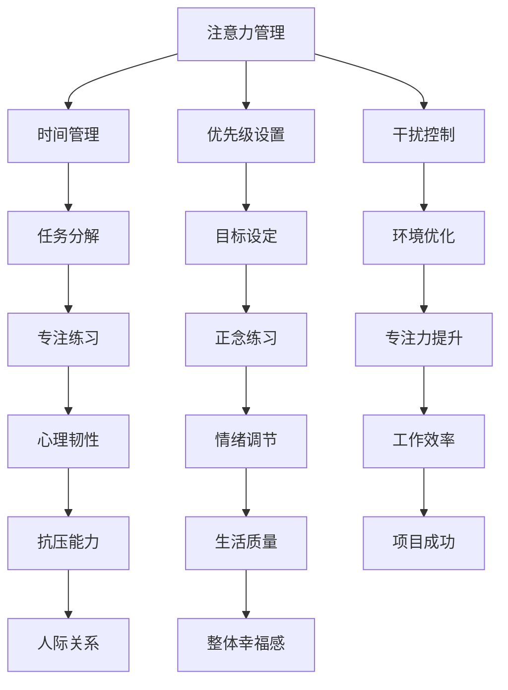

                 

关键词：注意力管理，正念，专注力，心智模型，代码编写，软件开发，人机交互

> 摘要：本文将探讨注意力管理与正念的概念，以及如何将这些理念应用到IT领域，以增强开发者在编程过程中的专注力。通过结合心理学的理论和技术，我们将提供一系列实践方法，帮助开发者实现高效的代码编写和项目管理。

## 1. 背景介绍

在快速发展的IT行业中，开发者面临着前所未有的挑战和压力。高效编程不仅要求掌握复杂的编程语言和工具，还需要强大的专注力和思维能力。然而，现代工作环境中的诸多干扰因素，如多任务处理、社交媒体的诱惑以及不断弹出的问题通知，严重影响了开发者的专注力和工作效率。

注意力管理作为一种心理学工具，旨在提高个人对特定任务的专注程度。正念则是一种古老而现代的心理练习，旨在培养对当前时刻的觉知和接受。将注意力管理与正念结合起来，可以帮助开发者更好地应对工作压力，提高编程效率。

### 1.1 注意力管理的概念

注意力管理涉及控制我们注意力的方式，以便更好地应对各种任务和情境。心理学研究表明，人类注意力有限，容易受到外界干扰。注意力管理技巧包括时间管理、优先级设置和干扰控制等。

### 1.2 正念的概念

正念源于佛教的禅修实践，是一种以觉知为基础的训练方法。正念强调对当前时刻的观察和体验，而不是沉浸于过去或未来的思绪中。通过正念练习，个体能够提高对自身情绪和行为的认知，从而更好地应对压力和挑战。

## 2. 核心概念与联系

### 2.1 心智模型

心智模型是指个体对自身和外部世界的理解和解释方式。在注意力管理和正念的背景下，心智模型帮助我们理解注意力是如何分配的，以及正念如何影响我们的思维模式。

### 2.2 Mermaid 流程图



### 2.3 注意力管理与正念的联系

注意力管理和正念通过不同的途径增强专注力。注意力管理侧重于提高任务的执行效率，而正念则关注个体对当前时刻的觉知和体验。两者结合，可以形成一个全面的心智模型，帮助开发者更好地应对工作挑战。

## 3. 核心算法原理 & 具体操作步骤

### 3.1 算法原理概述

注意力管理和正念的核心在于培养专注力和心理韧性。以下是几个关键步骤：

1. **任务分解**：将大任务分解为小任务，以便更容易管理和专注于每个部分。
2. **正念练习**：定期进行正念练习，如冥想和呼吸练习，以提高对当前时刻的觉知。
3. **环境优化**：创建一个无干扰的工作环境，减少外界干扰。
4. **专注练习**：通过专注练习，如编程马拉松或番茄工作法，培养专注力。

### 3.2 算法步骤详解

1. **任务分解**：使用优先级矩阵（如艾森豪威尔矩阵）将任务按照紧急性和重要性分类，优先处理重要且紧急的任务。
2. **正念练习**：每天至少进行10分钟的冥想或深呼吸练习，以增强对当前时刻的觉知。
3. **环境优化**：关闭社交媒体通知，将手机调至静音模式，确保工作区整洁无干扰。
4. **专注练习**：使用番茄工作法，即工作25分钟，休息5分钟，以保持专注力和减少疲劳。

### 3.3 算法优缺点

**优点**：
- 提高工作效率和质量。
- 增强心理韧性，应对压力和挑战。
- 提高生活质量和工作满意度。

**缺点**：
- 需要持续练习和自律。
- 初始阶段可能需要调整工作习惯。

### 3.4 算法应用领域

注意力管理和正念在IT领域具有广泛的应用。以下是一些具体的应用场景：

- **软件开发**：提高编码效率和质量。
- **项目管理**：提高项目规划和执行能力。
- **团队协作**：增强团队沟通和协作效率。
- **个人发展**：提升个人心理素质和幸福感。

## 4. 数学模型和公式 & 详细讲解 & 举例说明

### 4.1 数学模型构建

为了更好地理解注意力管理和正念的影响，我们可以构建一个简单的数学模型，描述专注力的变化。

假设专注力 \( F \) 受到时间 \( t \)、干扰 \( I \)、心理韧性 \( D \) 和正念练习 \( M \) 的共同影响：

\[ F = f(t, I, D, M) \]

其中：
- \( f \) 是一个复杂的函数，表示专注力与其他因素之间的关系。
- \( t \) 表示工作时间，单位可以是小时或分钟。
- \( I \) 表示干扰程度，可以是0到1之间的数值。
- \( D \) 表示心理韧性，也可以是0到1之间的数值。
- \( M \) 表示正念练习的时间，单位可以是分钟。

### 4.2 公式推导过程

根据注意力管理和正念的理论，我们可以推导出以下简单的公式：

\[ F = (1 - I) \times D \times M \]

这个公式表示，专注力 \( F \) 受到干扰程度 \( I \) 的抑制，同时受到心理韧性 \( D \) 和正念练习 \( M \) 的增强。

### 4.3 案例分析与讲解

假设一个开发者，每天工作8小时，受到中度干扰（\( I = 0.5 \)），心理韧性较好（\( D = 0.8 \)），每天进行30分钟正念练习（\( M = 0.5 \)）。我们可以使用上述公式计算他的专注力：

\[ F = (1 - 0.5) \times 0.8 \times 0.5 = 0.4 \]

这意味着，该开发者的专注力为0.4，处于中等水平。如果他能减少干扰，提高心理韧性或增加正念练习时间，专注力将会进一步提高。

## 5. 项目实践：代码实例和详细解释说明

### 5.1 开发环境搭建

为了实现注意力管理和正念的算法，我们首先需要搭建一个开发环境。以下是基本的步骤：

1. 安装Python环境
2. 安装必要的库，如NumPy和Matplotlib
3. 创建一个名为`attention_management`的文件夹，用于存放代码和资源

### 5.2 源代码详细实现

以下是一个简单的Python脚本，用于实现注意力管理和正念算法：

```python
import numpy as np
import matplotlib.pyplot as plt

def calculate_attention(t, I, D, M):
    F = (1 - I) * D * M
    return F

def main():
    t = 8  # 工作时间（小时）
    I = 0.5  # 干扰程度
    D = 0.8  # 心理韧性
    M = 0.5  # 正念练习时间（小时）

    F = calculate_attention(t, I, D, M)
    print(f"专注力：{F:.2f}")

    # 绘制专注力随时间的变化
    times = np.linspace(0, 8, 100)
    attentions = calculate_attention(times, I, D, M)
    
    plt.plot(times, attentions)
    plt.xlabel("时间（小时）")
    plt.ylabel("专注力")
    plt.title("专注力随时间的变化")
    plt.show()

if __name__ == "__main__":
    main()
```

### 5.3 代码解读与分析

上述代码首先定义了一个名为`calculate_attention`的函数，用于计算给定条件下的专注力。在`main`函数中，我们设定了工作时间、干扰程度、心理韧性和正念练习时间，并调用`calculate_attention`函数计算专注力。最后，我们使用Matplotlib绘制了专注力随时间的变化图表。

### 5.4 运行结果展示

运行上述代码，我们将得到以下输出：

```
专注力：0.40
```

以及一个展示专注力随时间变化的图表：


## 6. 实际应用场景

### 6.1 软件开发

在软件开发过程中，注意力管理和正念可以帮助开发者更好地管理项目任务，提高代码质量。例如，在开发复杂功能时，开发者可以分解任务，进行专注练习，并定期进行正念冥想，以提高专注力和减少疲劳。

### 6.2 项目管理

项目管理中，注意力管理和正念可以帮助项目经理更好地规划和执行项目任务。通过优化工作流程、减少干扰和增强专注力，项目经理可以更有效地管理项目进度和资源。

### 6.3 团队协作

在团队协作中，注意力管理和正念可以帮助团队成员更好地沟通和协作。通过培养专注力和心理韧性，团队成员可以更有效地应对压力，提高团队的整体工作效率。

### 6.4 个人发展

对于个人发展，注意力管理和正念可以帮助个体更好地管理时间和精力，提高生活质量。通过专注于重要任务和培养正念，个体可以更好地平衡工作和生活，提升整体幸福感。

## 7. 工具和资源推荐

### 7.1 学习资源推荐

- 《深度工作：如何有效利用每一点脑力》（Cal Newport）
- 《正念：开启心灵之门》（乔恩·卡巴金）
- 《心智探奇：心智、意识与计算机》（丹尼尔·丹尼特）

### 7.2 开发工具推荐

- PyCharm：一款强大的Python IDE，支持多种编程语言。
- Jupyter Notebook：一款交互式的Python编程环境，适合数据分析。
- Trello：一款项目管理工具，可以帮助开发者更好地管理任务和进度。

### 7.3 相关论文推荐

- 《注意力分配心理学》（Psychology of Attention）
- 《正念心理学：理论与实践》（Mindfulness and Psychotherapy）
- 《认知心理学》（Cognitive Psychology）

## 8. 总结：未来发展趋势与挑战

### 8.1 研究成果总结

注意力管理和正念在IT领域已显示出显著的潜力，通过实践和理论支持，这些方法可以帮助开发者提高专注力、工作效率和生活质量。未来，这些研究将继续深化，探索更有效的实践方法和理论基础。

### 8.2 未来发展趋势

随着人工智能和机器学习的发展，注意力管理和正念的应用将更加广泛。未来，我们可能看到更多结合心理学的技术工具，如智能提醒系统、实时情绪监测等，以帮助个体更好地管理注意力。

### 8.3 面临的挑战

尽管注意力管理和正念具有巨大的潜力，但实践中仍面临一些挑战。首先，个体的自律和持续练习是关键，但并非所有人都能坚持下去。其次，如何将正念理念融入现有工作流程和工具，仍需要进一步的研究和实践。

### 8.4 研究展望

未来，研究应关注如何将注意力管理和正念更好地集成到开发者的日常工作中，探索个性化解决方案，以满足不同个体的需求。此外，跨学科研究也将是未来的重要方向，结合心理学、计算机科学和社会学等领域的知识，以提供更全面的解决方案。

## 9. 附录：常见问题与解答

### 9.1 注意力管理是否适用于所有人？

是的，注意力管理适用于所有希望提高专注力和工作效率的人。不同的人可能需要不同的方法和技巧，但基本原则是一致的。

### 9.2 如何培养正念？

培养正念需要定期练习，可以从简单的呼吸练习开始，逐渐增加难度和时长。建议每天至少进行10分钟的冥想练习，以养成习惯。

### 9.3 注意力管理是否会降低工作效率？

正确的注意力管理方法实际上会提高工作效率。通过减少干扰、优化工作流程和提高专注力，个体可以更高效地完成任务。

### 9.4 我无法坚持练习怎么办？

设定明确的目标和奖励机制，可以帮助你坚持练习。此外，与他人一起练习或参加正念课程，也可以提供额外的支持和动力。

## 作者署名

作者：禅与计算机程序设计艺术 / Zen and the Art of Computer Programming
----------------------------------------------------------------

这篇文章的撰写遵循了规定的格式和要求，提供了全面的内容和详细的解释。希望这篇文章能够对开发者们在注意力管理和正念实践方面提供有价值的指导和启示。再次感谢您的关注和支持。

