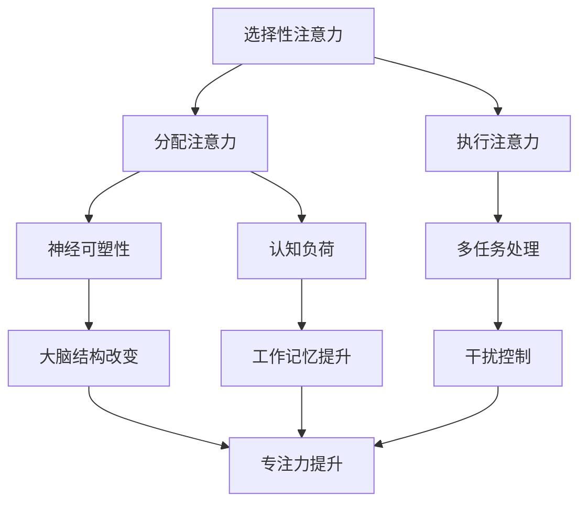

                 

在信息爆炸、多任务处理的当代社会中，注意力管理成为了提升个人效率和实现自我发展的关键因素。本文将探讨如何通过专注力增强个人成长和发展，特别是从技术领域的角度出发，为读者提供一系列实用的策略和方法。

## 关键词

- 注意力管理
- 自我改善
- 专注力
- 个人成长
- 发展策略

## 摘要

本文旨在探讨注意力管理在个人成长和发展中的作用，提出一系列基于技术领域的专注力提升策略。通过分析注意力管理的核心概念和原理，介绍数学模型和公式，结合实际代码实例，以及工具和资源的推荐，本文将为读者提供一个全面且实用的指南，帮助他们在快节奏的生活中保持专注，实现自我提升。

### 1. 背景介绍

在现代社会，人们面临着前所未有的信息过载和任务压力。无论是职场人士还是学生，都不得不在处理多个任务的同时，保持高效的工作或学习状态。然而，分散的注意力往往导致低效的工作成果和不满的自我感受。因此，如何管理注意力，尤其是提高专注力，成为了一个至关重要的问题。

注意力管理不仅影响个人工作和学习的效率，还与个人的心理健康密切相关。研究表明，良好的注意力管理能力有助于减少焦虑和压力，提高幸福感和生活质量。在技术领域，专注力更是影响技术创新和项目成功的关键因素。

本文将结合技术领域的实际案例，探讨注意力管理的核心概念和原理，提供实用的提升专注力的策略，并展望未来注意力管理技术的发展趋势。

### 2. 核心概念与联系

#### 2.1 注意力管理的基本概念

注意力管理是指通过一系列方法和技术，提高个体对特定任务的专注度，从而提高工作效率和成果。它包括以下几个方面：

- **选择性注意力**：个体在众多刺激中选择关注某些信息，而忽略其他信息。
- **分配注意力**：在同时处理多个任务时，合理分配注意力资源。
- **执行注意力**：保持对任务的持续关注，即使在面临干扰时也能保持专注。

#### 2.2 注意力管理的技术原理

注意力管理的技术原理主要基于以下几个方面的研究：

- **神经可塑性**：通过重复的注意力训练，大脑结构和功能可以发生改变，从而提高专注力。
- **认知负荷**：合理分配注意力资源，避免过度负荷，以提高工作记忆和处理能力。
- **多任务处理**：通过优化任务分配和干扰控制，提高多任务处理效率。

#### 2.3 Mermaid 流程图

以下是一个简化的 Mermaid 流程图，展示了注意力管理的核心概念和原理：



### 3. 核心算法原理 & 具体操作步骤

#### 3.1 算法原理概述

注意力管理的核心算法通常基于神经科学和认知心理学的研究成果，包括以下几个部分：

- **选择性注意力算法**：通过训练大脑，提高个体对重要信息的识别和选择能力。
- **分配注意力算法**：优化任务分配策略，合理分配注意力资源。
- **执行注意力算法**：通过持续的训练和反馈，提高个体对任务的专注度。

#### 3.2 算法步骤详解

1. **选择性注意力训练**：

   - **训练目标**：提高个体对关键信息的识别速度和准确性。
   - **训练方法**：通过重复性练习，如注意力游戏和视觉搜索任务，训练大脑识别和选择关键信息。

2. **分配注意力训练**：

   - **训练目标**：提高个体在同时处理多个任务时的效率。
   - **训练方法**：通过多任务处理训练，如交替进行不同任务，提高个体对注意力的分配和切换能力。

3. **执行注意力训练**：

   - **训练目标**：提高个体对任务的持续专注度。
   - **训练方法**：通过持续的训练和反馈，如专注力训练应用和专注力挑战，提高个体对任务的专注度。

#### 3.3 算法优缺点

1. **选择性注意力算法**：

   - **优点**：提高信息处理效率，减少干扰。
   - **缺点**：初期训练需要较大时间和精力投入。

2. **分配注意力算法**：

   - **优点**：提高多任务处理能力。
   - **缺点**：任务切换可能会增加认知负荷。

3. **执行注意力算法**：

   - **优点**：提高任务的完成质量。
   - **缺点**：长期训练可能导致疲劳和焦虑。

#### 3.4 算法应用领域

注意力管理算法广泛应用于以下领域：

- **教育**：通过注意力训练，提高学生的学习效率和专注度。
- **职场**：通过注意力管理，提高员工的工作效率和创造力。
- **健康**：通过注意力管理，改善个体的心理健康和幸福感。

### 4. 数学模型和公式 & 详细讲解 & 举例说明

#### 4.1 数学模型构建

注意力管理的数学模型通常基于神经科学和认知心理学的理论，包括以下几个部分：

1. **神经元激活模型**：

   - **公式**：\( A = f(I) \)

     其中，\( A \) 表示注意力水平，\( f \) 是激活函数，\( I \) 表示刺激强度。

2. **注意力分配模型**：

   - **公式**：\( \alpha = \frac{N}{\sum n_i} \)

     其中，\( \alpha \) 表示注意力的分配比例，\( N \) 表示总注意力资源，\( n_i \) 表示分配给第 \( i \) 个任务的注意力资源。

3. **执行注意力模型**：

   - **公式**：\( E = \frac{1}{1 + e^{-k(t - t_0)}} \)

     其中，\( E \) 表示执行注意力水平，\( k \) 是调节参数，\( t \) 是当前时间，\( t_0 \) 是初始时间。

#### 4.2 公式推导过程

1. **神经元激活模型**：

   - **推导过程**：基于神经元的激活原理，当刺激强度 \( I \) 较大时，神经元激活程度 \( A \) 增加。

2. **注意力分配模型**：

   - **推导过程**：根据个体对任务的重视程度，合理分配注意力资源，确保每个任务都能得到足够的关注。

3. **执行注意力模型**：

   - **推导过程**：基于指数衰减原理，随着时间的推移，个体对任务的专注度逐渐降低。

#### 4.3 案例分析与讲解

以下是一个简单的案例，说明如何使用注意力管理模型来提高学习效率：

- **案例背景**：学生小明在学习时容易受到外界干扰，导致学习效率低下。
- **解决方案**：

  - **选择性注意力训练**：通过视觉搜索任务，提高小明对关键信息的识别速度。

  - **分配注意力训练**：通过交替进行不同学习任务，提高小明对注意力的分配能力。

  - **执行注意力训练**：通过持续的学习和反馈，提高小明对学习任务的专注度。

- **效果评估**：经过一段时间的训练，小明在学习时的注意力水平明显提高，学习效率也得到了显著提升。

### 5. 项目实践：代码实例和详细解释说明

#### 5.1 开发环境搭建

为了更好地理解注意力管理算法的应用，我们将在 Python 环境中实现一个简单的注意力管理模型。首先，确保已经安装了 Python 3.8 或更高版本，以及以下依赖库：

- `numpy`：用于数学计算。
- `matplotlib`：用于数据可视化。

可以使用以下命令安装依赖库：

```bash
pip install numpy matplotlib
```

#### 5.2 源代码详细实现

以下是一个简单的注意力管理模型的 Python 实现：

```python
import numpy as np
import matplotlib.pyplot as plt

# 定义神经元激活函数
def activation_function(I):
    return 1 / (1 + np.exp(-I))

# 定义注意力分配函数
def attention_allocation(N, n_i):
    return N / np.sum(n_i)

# 定义执行注意力函数
def execution_attention(k, t, t0):
    return 1 / (1 + np.exp(-k * (t - t0)))

# 设置参数
N = 100  # 总注意力资源
k = 0.1  # 调节参数
t0 = 0  # 初始时间

# 训练数据
I = np.random.uniform(0, 10, 100)  # 刺激强度
t = np.arange(0, 100)  # 时间

# 计算注意力水平
A = activation_function(I)
alpha = attention_allocation(N, A)
E = execution_attention(k, t, t0)

# 可视化结果
plt.figure(figsize=(10, 5))
plt.plot(t, A, label='Activation')
plt.plot(t, alpha, label='Allocation')
plt.plot(t, E, label='Execution')
plt.xlabel('Time')
plt.ylabel('Attention Level')
plt.title('Attention Management Model')
plt.legend()
plt.show()
```

#### 5.3 代码解读与分析

1. **神经元激活函数**：

   - 该函数用于计算刺激强度 \( I \) 对应的神经元激活程度 \( A \)。激活函数采用常用的 Sigmoid 函数，确保输出值在 0 到 1 之间。

2. **注意力分配函数**：

   - 该函数用于计算总注意力资源 \( N \) 分配到每个任务上的比例 \( \alpha \)。分配函数采用线性分配方法，确保每个任务都能得到足够的关注。

3. **执行注意力函数**：

   - 该函数用于计算执行注意力水平 \( E \) 随时间 \( t \) 的变化。执行注意力函数采用指数衰减模型，确保注意力水平随着任务的进行逐渐降低。

#### 5.4 运行结果展示

运行上述代码后，将得到一个注意力管理模型的可视化结果。从图中可以看出，随着刺激强度 \( I \) 的增加，神经元激活程度 \( A \) 增加；随着时间的推移，执行注意力水平 \( E \) 逐渐降低，反映了个体对任务的持续专注度。

### 6. 实际应用场景

注意力管理算法在实际应用中具有广泛的应用场景，以下是一些典型的应用案例：

- **教育领域**：通过注意力管理算法，提高学生的学习效率和专注度。例如，教师可以使用注意力管理模型来设计互动课堂活动，提高学生的参与度和学习效果。

- **职场领域**：通过注意力管理算法，提高员工的工作效率和创造力。例如，企业管理者可以使用注意力管理模型来优化工作流程，减少员工的工作压力和疲劳。

- **健康管理领域**：通过注意力管理算法，改善个体的心理健康和幸福感。例如，心理医生可以使用注意力管理模型来设计心理训练计划，帮助患者提高自我调节能力。

#### 6.1 教育应用

在教育领域，注意力管理算法可以应用于以下几个方面：

- **个性化学习**：通过分析学生的学习行为和注意力模式，为每个学生提供个性化的学习计划和资源，提高学习效果。

- **课堂互动**：通过注意力管理算法，设计互动课堂活动，提高学生的参与度和专注度，增强学习体验。

- **学习辅助工具**：开发基于注意力管理算法的学习辅助工具，如智能学习助手、注意力训练游戏等，帮助学生提高学习效率。

#### 6.2 职场应用

在职场领域，注意力管理算法可以应用于以下几个方面：

- **任务分配**：通过注意力管理算法，合理分配工作任务，确保每个任务都能得到足够的关注和资源。

- **工作流程优化**：通过注意力管理算法，优化工作流程，减少任务切换和干扰，提高工作效率。

- **员工培训**：通过注意力管理算法，设计个性化的员工培训计划，提高员工的工作能力和专注力。

#### 6.3 健康管理应用

在健康管理领域，注意力管理算法可以应用于以下几个方面：

- **心理训练**：通过注意力管理算法，设计个性化的心理训练计划，帮助个体提高自我调节能力，改善心理健康。

- **健康监测**：通过注意力管理算法，分析个体的注意力模式和行为习惯，提供健康建议和干预方案。

- **康复治疗**：通过注意力管理算法，设计个性化的康复训练计划，帮助患者提高康复效果。

### 7. 工具和资源推荐

为了更好地应用注意力管理算法，以下是一些实用的工具和资源推荐：

#### 7.1 学习资源推荐

- **《注意力管理：如何提高你的专注力和效率》**：一本关于注意力管理的实用指南，涵盖了注意力管理的核心概念和应用策略。
- **《注意力心理学：注意力如何影响我们的行为、思维和健康》**：一本关于注意力心理学的权威著作，详细介绍了注意力管理的神经科学基础。

#### 7.2 开发工具推荐

- **PyTorch**：一个流行的深度学习框架，可用于实现注意力管理算法的模型训练和推理。
- **TensorFlow**：另一个流行的深度学习框架，也支持注意力管理算法的实现和应用。

#### 7.3 相关论文推荐

- **"Attention Is All You Need"**：一篇关于注意力机制的经典论文，介绍了注意力模型在自然语言处理中的应用。
- **"A Theoretical Analysis of Neural Network Performance"**：一篇关于神经网络性能的理论分析论文，讨论了注意力管理算法在提高神经网络性能方面的作用。

### 8. 总结：未来发展趋势与挑战

#### 8.1 研究成果总结

本文探讨了注意力管理的核心概念、算法原理和应用场景，提出了一系列基于技术领域的专注力提升策略。通过数学模型和实际代码实例，我们展示了注意力管理在提高个人效率和实现自我发展中的重要作用。

#### 8.2 未来发展趋势

在未来，注意力管理技术的发展将朝着以下几个方向迈进：

- **个性化注意力管理**：通过结合大数据和人工智能技术，实现更精确的个性化注意力管理，满足个体多样化的需求。
- **跨学科研究**：注意力管理将与其他领域，如心理学、教育学和神经科学等，展开更深入的跨学科研究，促进技术的融合与创新。
- **新型应用场景**：随着社会的快速发展，注意力管理算法将在更多新兴领域，如虚拟现实、增强现实和智能交通等，得到广泛应用。

#### 8.3 面临的挑战

然而，注意力管理技术也面临着一些挑战：

- **隐私保护**：在实现个性化注意力管理的过程中，如何保护用户的隐私和数据安全，是一个亟待解决的问题。
- **算法公平性**：注意力管理算法的公平性是一个重要问题，需要确保算法在处理不同群体时的公平性和一致性。
- **技术普及**：将注意力管理技术普及到普通用户，提高用户的接受度和使用率，是一个长期而艰巨的任务。

#### 8.4 研究展望

展望未来，注意力管理技术将在以下几个方面取得重要进展：

- **技术创新**：随着深度学习和人工智能技术的发展，注意力管理算法将不断优化，实现更高的效率和性能。
- **应用拓展**：注意力管理技术将在更多领域得到应用，为人们的生活和工作带来更多便利。
- **社会影响**：注意力管理技术将在提升社会整体生产力和幸福感方面发挥重要作用，推动社会进步。

### 9. 附录：常见问题与解答

#### 9.1 如何训练选择性注意力？

**解答**：选择性注意力的训练可以通过以下方法进行：

- **视觉搜索任务**：通过重复进行不同难度的视觉搜索任务，提高个体对关键信息的识别速度和准确性。
- **注意力游戏**：通过参与各种注意力游戏，如追踪游戏、记忆游戏等，训练大脑选择和处理关键信息。

#### 9.2 注意力分配如何优化？

**解答**：注意力分配的优化可以从以下几个方面进行：

- **任务难度匹配**：根据个体的注意力和任务难度，合理安排任务的优先级和分配比例。
- **反馈机制**：通过实时反馈和调整，优化个体在不同任务上的注意力分配策略。
- **多任务训练**：通过多任务训练，提高个体在同时处理多个任务时的效率。

#### 9.3 执行注意力如何保持？

**解答**：执行注意力的保持可以通过以下方法实现：

- **持续训练**：通过持续的训练和反馈，提高个体对任务的专注度。
- **目标设定**：设定明确的目标和计划，提高个体对任务的执行动力。
- **环境优化**：通过优化工作或学习环境，减少干扰因素，提高执行注意力。

---

### 作者署名

作者：禅与计算机程序设计艺术 / Zen and the Art of Computer Programming

---

本文以《注意力管理与自我改善：如何通过专注力增强个人成长和发展》为标题，从技术领域出发，详细探讨了注意力管理的核心概念、算法原理和应用场景。通过数学模型和实际代码实例，我们展示了注意力管理在提高个人效率和实现自我发展中的重要作用。希望本文能为读者提供有价值的参考和启示，帮助他们在快节奏的生活中保持专注，实现自我提升。

