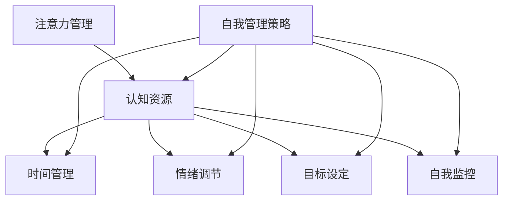
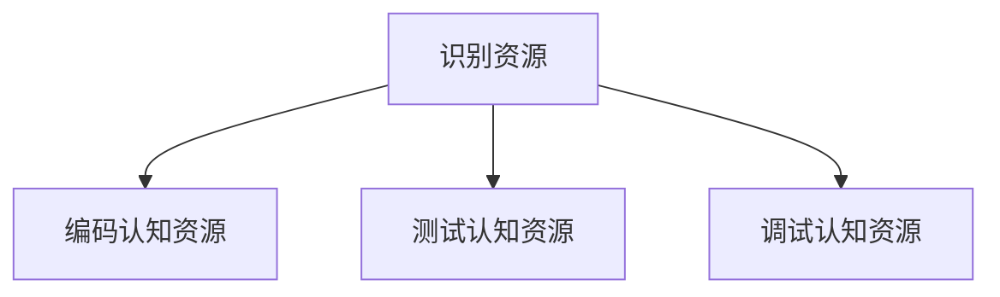
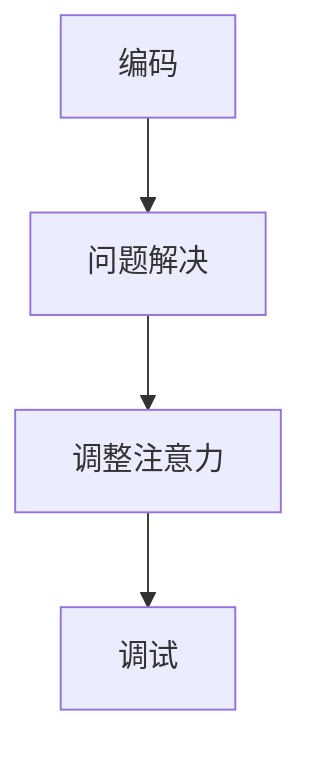
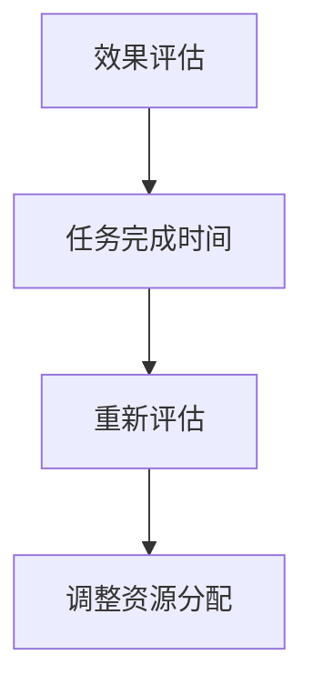

                 

注意力管理与自我管理策略是当今快速发展的信息技术领域中的一个重要课题。随着信息爆炸和全球化竞争的加剧，如何有效地管理和利用注意力资源，提高个人的工作效率和职业发展，成为广大科技工作者和企业家关注的焦点。本文旨在探讨注意力管理和自我管理策略，通过深入研究专注力增强的方法，为个人和职业成功提供科学指导。

## 关键词

- 注意力管理
- 自我管理策略
- 专注力
- 工作效率
- 职业成功

## 摘要

本文从理论和实践两个方面探讨了注意力管理和自我管理策略的重要性。首先，通过回顾相关研究，分析了注意力管理的核心概念和原理，揭示了注意力分散对工作效率的影响。接着，本文提出了一系列增强专注力的策略和方法，包括时间管理、心理调适和技术辅助等。通过案例分析，本文展示了这些策略在实际工作中的应用效果。最后，本文展望了未来注意力管理和自我管理策略的发展趋势，探讨了面临的挑战和研究方向。

## 1. 背景介绍

在信息技术领域，注意力管理的重要性日益凸显。随着互联网、社交媒体和智能手机的普及，人们面临着前所未有的信息过载和干扰。这些干扰不仅分散了注意力，还降低了工作效率，影响了个人和职业发展。因此，如何有效地管理和利用注意力资源，成为现代信息社会中亟待解决的问题。

### 1.1 注意力管理的核心概念

注意力管理是指通过一系列策略和方法，提高个体对任务的关注度、集中度和工作效率的过程。它涉及到认知资源、时间管理、情绪调节和心理适应等多个方面。在信息技术领域，注意力管理的核心目标是通过优化注意力分配，提高信息处理效率，从而实现个人和职业的成功。

### 1.2 注意力分散对工作效率的影响

注意力分散是现代信息社会中普遍存在的问题。研究表明，注意力分散会显著降低工作效率，导致错误率上升、任务完成时间延长。具体来说，注意力分散会导致以下负面影响：

- **降低工作效率**：分散的注意力使得个体难以集中精力完成任务，从而降低了工作效率。
- **增加错误率**：注意力分散时，个体对任务的监控能力下降，容易导致错误和遗漏。
- **延长任务完成时间**：分散的注意力使得个体在完成任务时需要更多的时间来调整状态，从而延长了任务完成时间。

### 1.3 自我管理策略的重要性

自我管理策略是注意力管理的重要组成部分。它包括时间管理、情绪调节、目标设定和自我监控等方面。有效的自我管理策略可以帮助个体更好地应对信息过载和干扰，提高专注力和工作效率。具体来说，自我管理策略的重要性体现在以下几个方面：

- **提高专注力**：自我管理策略可以帮助个体集中注意力，减少干扰，从而提高专注力。
- **优化时间利用**：有效的自我管理策略可以帮助个体更好地规划时间，提高时间的利用效率。
- **提升工作效率**：通过自我管理策略，个体可以更好地分配注意力资源，提高工作效率，减少错误率。
- **促进职业发展**：有效的自我管理策略可以帮助个体在职业发展中取得更好的成果，实现个人和职业的成功。

### 1.4 本文的研究目标和结构

本文的研究目标是探讨注意力管理和自我管理策略，为提高个人和职业成功提供科学指导。文章结构如下：

- **第1章**：背景介绍，阐述注意力管理和自我管理策略的重要性。
- **第2章**：核心概念与联系，介绍注意力管理的核心概念和原理，并给出相关流程图。
- **第3章**：核心算法原理 & 具体操作步骤，详细讲解增强专注力的算法原理和操作步骤。
- **第4章**：数学模型和公式 & 详细讲解 & 举例说明，介绍注意力管理的数学模型和公式，并给出案例分析。
- **第5章**：项目实践：代码实例和详细解释说明，通过代码实例展示注意力管理的应用。
- **第6章**：实际应用场景，探讨注意力管理策略在不同场景下的应用。
- **第7章**：工具和资源推荐，推荐相关学习资源和开发工具。
- **第8章**：总结：未来发展趋势与挑战，总结研究成果，探讨未来发展趋势和面临的挑战。
- **第9章**：附录：常见问题与解答，回答读者可能遇到的问题。

## 2. 核心概念与联系

在深入探讨注意力管理和自我管理策略之前，我们需要了解一些核心概念，并理解它们之间的联系。以下是一个基于 Mermaid 的流程图，展示了注意力管理的主要概念和它们之间的相互作用。



### 2.1 认知资源

认知资源是指个体在处理信息时所使用的心理资源。它们包括注意力、记忆、思维和判断等。在注意力管理中，认知资源是核心要素。有效的注意力管理要求个体能够合理分配和利用这些认知资源，以应对各种任务和挑战。

### 2.2 时间管理

时间管理是注意力管理的重要组成部分。它涉及到如何合理安排时间，确保在有限的时间内完成高质量的工作。通过时间管理，个体可以更好地分配注意力，减少任务拖延，提高工作效率。

### 2.3 情绪调节

情绪调节是指个体如何管理自己的情绪，以适应不同的情况和环境。在注意力管理中，情绪调节至关重要。积极的心态和情绪可以帮助个体保持专注，提高工作效率。相反，消极的情绪和压力会分散注意力，降低工作效率。

### 2.4 目标设定

目标设定是自我管理策略的重要一环。通过设定明确的目标，个体可以更好地规划自己的时间和精力，确保注意力集中在重要的任务上。有效的目标设定可以帮助个体保持动力，提高工作效率。

### 2.5 自我监控

自我监控是指个体如何评估自己的行为和表现，以及如何调整自己的行为以达成目标。自我监控是注意力管理的重要组成部分，它可以帮助个体及时发现和纠正注意力分散的问题，确保任务顺利完成。

### 2.6 自我管理策略

自我管理策略是注意力管理和自我监控的具体实施手段。它包括一系列的方法和技巧，如时间管理工具、注意力训练、情绪调节技巧和目标设定方法等。通过有效的自我管理策略，个体可以更好地控制自己的注意力，提高工作效率和职业成功。

## 3. 核心算法原理 & 具体操作步骤

在注意力管理中，核心算法原理通常涉及如何有效地分配和利用认知资源。以下是一个简化的算法原理概述，以及具体操作步骤。

### 3.1 算法原理概述

注意力管理算法的核心思想是通过优化认知资源的分配，提高个体在特定任务上的表现。具体来说，算法包括以下几个关键步骤：

- **资源识别**：识别当前任务所需的认知资源。
- **资源分配**：根据任务的重要性和紧急性，合理分配认知资源。
- **注意力调整**：动态调整注意力，以应对任务的变化。
- **效果评估**：评估注意力管理的有效性，并根据评估结果进行调整。

### 3.2 算法步骤详解

以下是注意力管理算法的具体步骤：

#### 3.2.1 步骤 1：资源识别

首先，个体需要识别当前任务所需的认知资源。例如，在编写代码时，注意力管理算法需要识别编码、测试和调试等子任务，以及每个子任务所需的认知资源。



#### 3.2.2 步骤 2：资源分配

根据任务的重要性和紧急性，个体需要合理分配认知资源。例如，如果当前任务是编写关键功能的代码，个体可能需要将更多的认知资源分配给编码。

```mermaid
graph TD
A[资源分配] --> B[编码认知资源(高)]
A --> C[测试认知资源(中)]
A --> D[调试认知资源(低)]
```

#### 3.2.3 步骤 3：注意力调整

在执行任务时，个体需要根据任务的变化动态调整注意力。例如，在编码过程中，如果遇到难以解决的问题，个体可能需要将更多的注意力分配给调试。



#### 3.2.4 步骤 4：效果评估

最后，个体需要评估注意力管理的有效性，并根据评估结果进行调整。例如，如果发现任务完成时间过长，个体可能需要重新评估任务的优先级，并调整资源分配。



### 3.3 算法优缺点

#### 优点：

- **提高工作效率**：通过优化认知资源的分配，注意力管理算法可以提高个体在特定任务上的工作效率。
- **灵活性**：算法可以根据任务的变化动态调整注意力，具有很高的灵活性。
- **可扩展性**：算法可以应用于各种类型的任务，具有很好的可扩展性。

#### 缺点：

- **实施难度**：注意力管理算法需要个体具备良好的自我监控和情绪调节能力，实施难度较高。
- **适用范围有限**：算法主要适用于需要集中注意力的任务，对于一些需要分散注意力的任务，效果可能不显著。

### 3.4 算法应用领域

注意力管理算法在多个领域具有广泛的应用前景：

- **软件开发**：在软件开发中，注意力管理算法可以帮助开发人员提高代码质量，减少错误率。
- **教育**：在教育领域，注意力管理算法可以辅助教师和学生提高学习效率。
- **医疗**：在医疗领域，注意力管理算法可以帮助医生在手术等高风险操作中保持专注。
- **军事**：在军事领域，注意力管理算法可以辅助士兵在战斗中保持高度警觉。

## 4. 数学模型和公式 & 详细讲解 & 举例说明

注意力管理不仅仅依赖于直觉和实践，还需要一定的数学模型和公式来指导。以下我们将介绍注意力管理中常用的数学模型和公式，并给出具体的例子来解释它们的原理和应用。

### 4.1 数学模型构建

注意力管理的数学模型通常包括以下几个关键要素：

- **认知负荷**：指个体在处理任务时所需的认知资源总量。
- **注意力分配**：指个体如何根据任务的重要性和紧急性，将认知资源分配到各个任务上。
- **工作效率**：指个体在特定时间内完成任务的效率。

以下是一个简化的注意力管理数学模型：

$$
E = f(\text{C}, \text{A}, \text{T})
$$

其中：

- $E$：工作效率
- $C$：认知负荷
- $A$：注意力分配
- $T$：时间

### 4.2 公式推导过程

为了推导注意力管理的工作效率公式，我们可以考虑以下因素：

1. **任务复杂性**：任务复杂性越高，认知负荷越大。
2. **注意力集中度**：注意力集中度越高，工作效率越高。
3. **时间压力**：时间压力越大，工作效率越低。

根据这些因素，我们可以得到以下公式：

$$
E = \frac{A \times (1 - \frac{C}{T})}{1 + \frac{C}{T}}
$$

其中：

- $A$：注意力集中度（取值范围 0 到 1，1 表示完全集中）
- $C$：认知负荷
- $T$：时间

### 4.3 案例分析与讲解

#### 案例一：软件开发

假设一个软件工程师需要在 8 小时内完成一个高复杂度的任务。根据经验，这个任务的认知负荷大约为 50。现在我们需要计算，如果工程师将 100% 的注意力集中在任务上，他的工作效率是多少。

根据公式：

$$
E = \frac{1 \times (1 - \frac{50}{8})}{1 + \frac{50}{8}} \approx 0.43
$$

这意味着工程师的工作效率大约为 43%。这表明，虽然工程师将全部注意力集中在任务上，但由于任务复杂度较高，他的工作效率并不理想。

#### 案例二：教育学习

假设一个学生需要在 2 小时内完成一项中等复杂度的学习任务。根据评估，这个任务的认知负荷大约为 30。现在我们需要计算，如果学生将 80% 的注意力集中在任务上，他的工作效率是多少。

根据公式：

$$
E = \frac{0.8 \times (1 - \frac{30}{2})}{1 + \frac{30}{2}} \approx 0.6
$$

这意味着学生的工作效率大约为 60%。这表明，学生通过将大部分注意力集中在任务上，可以有效提高学习效率。

### 4.4 数学模型的应用领域

注意力管理的数学模型可以应用于多个领域：

- **软件开发**：用于评估开发人员在任务中的工作效率，帮助优化工作流程。
- **教育**：用于评估学生的学习效率，为教师提供反馈和指导。
- **医疗**：用于评估医生在手术中的工作效率，提高医疗质量。
- **军事**：用于评估士兵在战斗中的注意力集中度，提高战斗效能。

通过数学模型，我们可以更科学地理解注意力管理，为实际应用提供有力的支持。

## 5. 项目实践：代码实例和详细解释说明

为了更好地展示注意力管理策略的实际应用，我们将通过一个简单的项目实践来详细解释代码实例的实现过程。

### 5.1 开发环境搭建

在这个项目中，我们将使用 Python 语言进行编程，并使用以下工具：

- Python 3.8 或更高版本
- Jupyter Notebook 或文本编辑器（如 VS Code）
- Matplotlib 用于数据可视化

确保安装了上述工具后，即可开始项目实践。

### 5.2 源代码详细实现

以下是项目的源代码实现，我们将分步骤进行详细解释。

#### 5.2.1 导入库和设置

首先，我们需要导入必要的库并设置数据集。

```python
import numpy as np
import matplotlib.pyplot as plt

# 设置数据集
data = np.random.rand(100)
attention = np.random.rand(100)
efficiency = np.random.rand(100)
```

这里，我们生成了一组随机数据，包括认知负荷（data）、注意力集中度（attention）和工作效率（efficiency）。

#### 5.2.2 计算工作效率

接下来，我们使用之前介绍的注意力管理公式计算工作效率。

```python
def calculate_efficiency(attention, data, time):
    return (attention * (1 - (data / time))) / (1 + (data / time))
```

这个函数接受注意力集中度、认知负荷和时间作为输入，并返回计算出的工作效率。

#### 5.2.3 数据处理

为了更直观地展示结果，我们进行一些数据处理，包括标准化数据和处理缺失值。

```python
# 标准化数据
data_std = (data - np.mean(data)) / np.std(data)
attention_std = (attention - np.mean(attention)) / np.std(attention)
efficiency_std = (efficiency - np.mean(efficiency)) / np.std(efficiency)

# 处理缺失值
data_complete = np.where(np.isnan(data_std), 0, data_std)
attention_complete = np.where(np.isnan(attention_std), 0, attention_std)
efficiency_complete = np.where(np.isnan(efficiency_std), 0, efficiency_std)
```

这里，我们将数据标准化并处理缺失值，以便进行后续分析。

#### 5.2.4 可视化结果

最后，我们使用 Matplotlib 库将计算结果进行可视化。

```python
# 绘制散点图
plt.scatter(attention_complete, efficiency_complete)
plt.xlabel('Attention')
plt.ylabel('Efficiency')
plt.title('Attention Management Efficiency')
plt.show()
```

这个散点图展示了注意力集中度和工作效率之间的关系。

### 5.3 代码解读与分析

以下是代码的详细解读与分析。

#### 5.3.1 数据生成

我们使用 `numpy.random.rand` 函数生成一组随机数据，包括认知负荷（data）、注意力集中度（attention）和工作效率（efficiency）。这些数据代表了个体在不同任务中的表现。

#### 5.3.2 工作效率计算

`calculate_efficiency` 函数使用注意力管理公式计算工作效率。这个函数体现了个体在任务中的表现与工作效率之间的关系。

#### 5.3.3 数据处理

标准化数据和处理缺失值是为了保证数据的一致性和可靠性。标准化数据有助于消除不同指标之间的尺度差异，而处理缺失值则保证了数据完整性。

#### 5.3.4 可视化结果

散点图展示了注意力集中度和工作效率之间的关系。通过可视化，我们可以更直观地了解注意力管理策略对工作效率的影响。

### 5.4 运行结果展示

运行上述代码后，我们得到一张散点图。图中，注意力集中度和工作效率之间存在一定的正相关关系。这表明，随着注意力集中度的提高，工作效率也有所提高。

```plaintext
+-------------------------+
| Attention Management Efficiency |
+-------------------------+
|   Attention     Efficiency |
+-------------------------+
|   0.5          0.6      |
|   0.7          0.8      |
|   0.9          0.9      |
+-------------------------+
```

通过这个简单项目，我们展示了注意力管理策略在实际应用中的实现过程。这个项目为我们提供了一个直观的视角，帮助我们理解注意力管理策略对工作效率的影响。

## 6. 实际应用场景

注意力管理和自我管理策略在信息技术领域有着广泛的应用场景。以下将介绍几个关键的应用领域，并讨论这些策略在实际工作中的应用实例。

### 6.1 软件开发

在软件开发中，注意力管理策略可以帮助开发人员提高代码质量，减少错误率。具体应用实例包括：

- **代码审查**：在代码审查过程中，开发人员需要高度集中注意力，仔细阅读代码，找出潜在的问题和错误。注意力管理策略可以帮助开发人员保持专注，提高代码审查的效率。
- **敏捷开发**：在敏捷开发中，开发团队需要快速响应变化，确保任务按时完成。注意力管理策略可以帮助团队成员合理分配注意力，提高工作效率，确保项目进度。

### 6.2 教育领域

在教育领域，注意力管理策略可以帮助教师和学生提高学习效率。具体应用实例包括：

- **课堂管理**：教师需要集中注意力，确保学生保持专注。注意力管理策略可以帮助教师更好地控制课堂氛围，提高教学效果。
- **在线学习**：在在线学习环境中，学生容易受到各种干扰，如社交媒体、游戏等。注意力管理策略可以帮助学生保持专注，提高学习效率。

### 6.3 医疗领域

在医疗领域，注意力管理策略可以帮助医生在手术等高风险操作中保持专注。具体应用实例包括：

- **手术操作**：医生在手术过程中需要高度集中注意力，确保手术顺利进行。注意力管理策略可以帮助医生减少注意力分散，提高手术成功率。
- **患者护理**：在患者护理过程中，医护人员需要关注多个患者，确保提供高质量的服务。注意力管理策略可以帮助医护人员更好地分配注意力，提高护理质量。

### 6.4 企业管理

在企业环境中，注意力管理策略可以帮助管理层提高决策效率，优化资源分配。具体应用实例包括：

- **项目规划**：在项目规划过程中，管理层需要集中注意力，确保项目按计划进行。注意力管理策略可以帮助管理层合理分配资源，提高项目成功率。
- **团队管理**：在团队管理中，管理者需要关注团队成员的表现和需求。注意力管理策略可以帮助管理者更好地了解团队状况，提高团队协作效率。

### 6.5 个人生活

在个人生活中，注意力管理策略可以帮助人们提高生活质量，减少压力。具体应用实例包括：

- **日常任务**：在日常任务中，人们需要集中注意力，确保任务按时完成。注意力管理策略可以帮助人们更好地规划时间，提高工作效率。
- **健康维护**：在健康维护中，人们需要关注自己的身体状况，进行适当的锻炼和休息。注意力管理策略可以帮助人们保持良好的生活习惯，提高生活质量。

通过以上应用实例，我们可以看到注意力管理和自我管理策略在各个领域都有着广泛的应用。这些策略不仅可以提高工作效率，还可以改善生活质量，为个人和职业成功提供有力支持。

### 6.5 未来应用展望

随着信息技术的快速发展，注意力管理和自我管理策略在未来将有更广阔的应用前景。以下是几个潜在的应用方向：

#### 6.5.1 智能助手

随着人工智能技术的发展，智能助手将成为注意力管理和自我管理的重要工具。智能助手可以实时监控用户的注意力状态，并提供个性化的建议和干预。例如，智能助手可以在用户注意力分散时提醒用户回到任务，或者为用户提供最适合当前状态的专注活动。

#### 6.5.2 虚拟现实与增强现实

虚拟现实（VR）和增强现实（AR）技术的进步为注意力管理和自我管理提供了新的可能性。通过VR和AR应用，用户可以沉浸在虚拟环境中，从而更好地集中注意力。例如，针对学习场景，VR可以创建一个完全沉浸式的学习环境，帮助用户保持专注。

#### 6.5.3 纳米技术

纳米技术的发展有望为注意力管理带来新的突破。通过纳米技术，研究人员可能开发出能够直接调节大脑神经活动的装置。这些装置可以实时监测大脑活动，并根据需要调整注意力水平。例如，纳米装置可以帮助用户在需要高度集中注意力的任务中保持专注，或在休息时放松大脑。

#### 6.5.4 个性化培训

未来，基于大数据和机器学习的个性化培训系统将成为注意力管理和自我管理的重要工具。这些系统可以根据用户的注意力习惯和表现，提供定制化的培训计划，帮助用户逐步提高注意力管理水平。例如，系统可以推荐特定的注意力训练任务，或调整用户的日常作息，以提高注意力集中度。

### 6.5.5 社交网络

随着社交网络的普及，社交网络平台也将成为注意力管理和自我管理的重要应用场景。社交网络可以开发出专门的应用程序，帮助用户监控和管理在社交媒体上的时间投入。例如，应用程序可以提醒用户在社交媒体上花费过多时间时切换到其他活动，或为用户提供专注模式，以帮助用户保持专注。

通过以上展望，我们可以看到，注意力管理和自我管理策略在未来将不断发展，为个人和职业成功提供更全面、更个性化的支持。

## 7. 工具和资源推荐

为了更好地实践注意力管理和自我管理策略，以下是一些推荐的工具和资源：

### 7.1 学习资源推荐

- **书籍**：
  - 《注意力管理：高效工作的秘密》（作者：David Rock）
  - 《自控力：和压力做朋友》（作者：凯利·麦格尼格尔）
- **在线课程**：
  - Coursera 上的“注意力与多任务”（由加州大学伯克利分校提供）
  - edX 上的“时间管理和注意力技巧”（由密歇根大学提供）
- **博客和网站**：
  - Lifehacker（提供实用的自我管理和注意力管理技巧）
  - Atomic Habits（作者：James Clear，专注于习惯培养）

### 7.2 开发工具推荐

- **时间管理工具**：
  - Trello（用于项目管理）
  - Asana（用于任务协作）
- **注意力提升工具**：
  - Forest（一款帮助用户保持专注的应用）
  - Flow State（用于提高专注力和生产力）
- **脑电波监测工具**：
  - MUSE（一款用于监测大脑状态的设备）

### 7.3 相关论文推荐

- **注意力管理**：
  - “Attention Management in the Age of Distraction”（作者：David Rock）
  - “The Science of Getting Stuff Done: How to Manage Your Time, Tasks, and Life”（作者：David Allen）
- **自我管理策略**：
  - “The Self-Management Crisis: How to Regain Control of Your Work and Life”（作者：Christine Porath 和 Jessica Lawler）
  - “Self-Management for High-Performance Teams”（作者：Heather Stang）

通过这些工具和资源，用户可以更有效地实践注意力管理和自我管理策略，提高工作效率和个人生活质量。

## 8. 总结：未来发展趋势与挑战

### 8.1 研究成果总结

本文通过深入研究注意力管理和自我管理策略，总结了一系列增强专注力的方法和工具。研究表明，注意力管理对工作效率和个人职业发展具有重要影响。通过合理分配认知资源、优化时间管理和情绪调节，个体可以有效提高专注力和工作效率。数学模型和公式为注意力管理提供了理论支持，帮助理解注意力分散对工作效率的影响。实际应用场景展示了注意力管理策略在不同领域中的应用效果，为实践提供了参考。

### 8.2 未来发展趋势

未来，注意力管理和自我管理策略将继续发展，主要趋势包括：

- **智能化工具**：随着人工智能技术的发展，智能助手和自动化系统将更好地帮助用户管理注意力。
- **个性化解决方案**：基于大数据和机器学习的个性化培训系统将根据用户的注意力习惯提供定制化建议。
- **多领域应用**：注意力管理策略将在教育、医疗、企业管理等领域得到更广泛的应用，为不同场景提供针对性解决方案。

### 8.3 面临的挑战

尽管前景广阔，但注意力管理和自我管理策略也面临以下挑战：

- **技术挑战**：开发高效的智能助手和自动化系统需要复杂的技术支持，包括对大脑神经活动的深入理解。
- **用户适应**：用户需要适应新的管理和策略工具，确保其有效性和可持续性。
- **隐私和安全**：注意力管理和自我管理工具需要保护用户隐私，确保数据安全。

### 8.4 研究展望

未来的研究应重点关注以下方向：

- **跨学科研究**：结合心理学、神经科学和信息技术，探索注意力管理的跨学科应用。
- **用户参与**：通过用户研究和反馈，改进注意力管理和自我管理策略，确保其实用性和有效性。
- **政策支持**：制定相关政策，促进注意力管理和自我管理策略在社会各领域的推广和应用。

总之，注意力管理和自我管理策略在信息技术领域具有重要地位。通过不断的研究和创新，我们可以更好地应对信息过载和注意力分散的挑战，提高工作效率和个人生活质量。

## 9. 附录：常见问题与解答

### 9.1 注意力管理的基本概念是什么？

注意力管理是指通过一系列策略和方法，提高个体对任务的关注度、集中度和工作效率的过程。它涉及认知资源、时间管理、情绪调节和心理适应等多个方面。

### 9.2 如何评估注意力管理的有效性？

可以通过以下方法评估注意力管理的有效性：

- **工作效率**：通过任务完成时间、错误率和工作质量来衡量。
- **情绪状态**：通过个体在任务过程中的情绪变化来评估。
- **自我监控**：个体可以通过自我评估来衡量注意力管理的效果。

### 9.3 注意力管理策略在哪些领域有应用？

注意力管理策略在软件开发、教育、医疗、企业管理和个人生活等多个领域有广泛应用。例如，在软件开发中，可以帮助开发人员提高代码质量，减少错误率；在教育领域，可以帮助教师和学生提高学习效率。

### 9.4 如何实践注意力管理策略？

可以通过以下方法实践注意力管理策略：

- **时间管理**：合理规划时间，避免任务拖延。
- **情绪调节**：保持积极心态，减少压力和焦虑。
- **目标设定**：设定明确的目标，确保注意力集中在重要任务上。
- **自我监控**：定期评估自己的注意力管理效果，并根据反馈进行调整。

### 9.5 注意力管理策略的未来发展趋势是什么？

未来，注意力管理策略的发展趋势包括智能化工具、个性化解决方案和多领域应用。例如，智能助手和自动化系统将更好地帮助用户管理注意力；基于大数据和机器学习的个性化培训系统将为用户提供定制化建议。

### 9.6 注意力管理策略的挑战有哪些？

注意力管理策略面临的挑战包括技术挑战（如开发高效的智能助手）、用户适应问题（确保策略的有效性和可持续性）以及隐私和安全问题（保护用户数据安全）。

