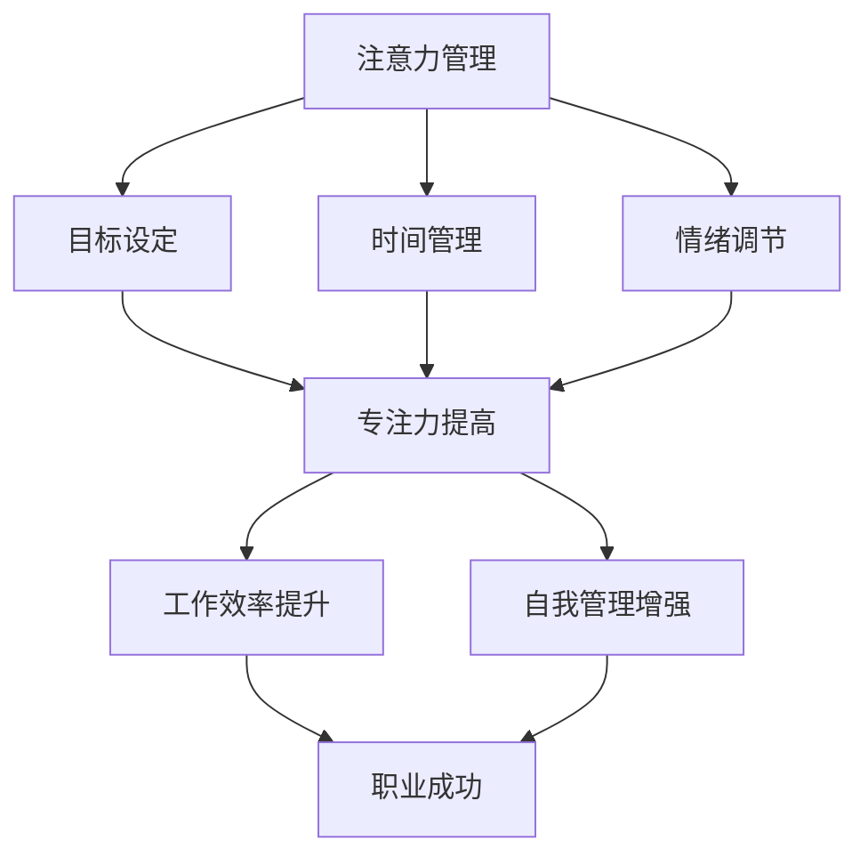

                 

关键词：注意力管理、自我管理、专注力、个人发展、职业成功

> 摘要：本文深入探讨了注意力管理和自我管理策略，以提升专注力为核心，从多个维度分析了如何通过有效的注意力管理策略来增强个人和职业成功。文章结合实际案例和理论分析，为读者提供了一系列实用方法和工具，以帮助他们在日常生活中更好地掌握注意力，提高工作效率，实现职业和个人成长。

## 1. 背景介绍

在当今高度信息化的社会，人们面临着前所未有的挑战：信息过载、多任务处理、快节奏生活等。这些因素使得我们的注意力管理变得尤为重要。注意力是一种宝贵的资源，它是我们获取信息、处理信息和做出决策的关键。然而，随着生活节奏的加快，人们往往感到自己无法集中精力，容易分心和疲劳。这种状况不仅影响了个人生活质量，也对职业发展产生了负面影响。

个人和职业成功在很大程度上取决于我们的专注力。专注力强的人能够更好地应对复杂的工作任务，提高工作效率，做出更明智的决策。相反，缺乏专注力的人可能会在工作中出现失误，导致项目延误或质量下降。因此，如何管理好自己的注意力，提升专注力，成为每个人都需要面对的问题。

本文旨在通过深入探讨注意力管理和自我管理策略，为读者提供实用的方法和工具，帮助他们更好地掌握注意力，提高专注力，从而在个人和职业发展的道路上取得更大的成功。

## 2. 核心概念与联系

### 注意力管理

注意力管理是指通过一系列策略和方法来提高我们的专注力和工作效率。它涉及如何分配注意力资源，如何处理干扰，如何保持专注等。有效的注意力管理能够帮助我们更好地处理信息，减少分心，从而提高工作和学习效率。

### 自我管理

自我管理是指个体通过自我监控、自我调节和自我激励等手段来管理自己的行为和情感。它包括目标设定、时间管理、情绪调节、自我激励等多个方面。自我管理能力强的个体能够更好地规划自己的时间，控制情绪，设定目标，并持续努力以实现这些目标。

### 注意力与自我管理的关系

注意力管理和自我管理密切相关。自我管理能力强的个体更容易实施有效的注意力管理策略。例如，设定清晰的目标可以帮助我们集中注意力，情绪调节能力则有助于我们应对工作中的干扰，保持专注。同时，注意力管理策略也可以增强自我管理能力。通过提高专注力，我们能够更好地控制自己的行为，保持目标导向，提高工作效率。

### Mermaid 流程图

以下是一个简化的注意力管理和自我管理流程图，展示了两者之间的相互作用。



### 2.1 注意力管理策略

#### 时间管理

时间管理是注意力管理的重要组成部分。通过合理安排时间，我们可以减少任务的紧急程度，从而减少分心的可能性。以下是一些时间管理技巧：

- 制定时间表：提前规划每天的任务和时间，确保有足够的时间专注于每个任务。
- 分块工作：将工作时间分为若干个时间段，每个时间段专注于一项任务，避免多任务处理带来的干扰。
- 番茄工作法：将工作时间分为25分钟的工作周期和5分钟的休息时间，通过这种方式提高专注力和工作效率。

#### 情绪调节

情绪调节能力对于注意力管理至关重要。情绪不稳定的人往往难以集中精力。以下是一些情绪调节策略：

- 正念冥想：通过正念冥想，我们可以训练自己的注意力，减少焦虑和压力。
- 认知重构：改变对事物的看法，用更积极的态度看待困难，减少负面情绪的影响。
- 身体运动：适当的身体运动可以释放压力，提高情绪稳定性。

#### 目标设定

明确的目标可以帮助我们集中注意力。以下是一些目标设定的技巧：

- SMART 原则：目标要具体、可衡量、可实现、相关性强、有时间限制。
- 分解目标：将大目标分解为小目标，逐步实现，以保持动力和专注力。
- 激励自己：设定奖励机制，完成任务后给自己一些奖励，以增加动力。

### 2.2 自我管理策略

#### 自我监控

自我监控是指个体对自己的行为和情感进行监控和管理。以下是一些自我监控的技巧：

- 日记记录：记录每天的任务完成情况和注意力分配情况，以便进行反思和调整。
- 反思与反馈：定期反思自己的行为和决策，从他人的反馈中获取改进建议。
- 自我激励：通过设定奖励机制，激励自己持续努力。

#### 自我调节

自我调节是指个体通过自我控制来管理自己的情绪和行为。以下是一些自我调节的技巧：

- 深呼吸：在感到紧张或焦虑时，进行深呼吸，有助于放松身体和情绪。
- 暂停与反思：在工作或学习中遇到困难时，暂停一会儿，反思当前的状态，重新调整策略。
- 建立日常习惯：通过建立稳定的日常习惯，减少决策负担，提高效率。

#### 自我激励

自我激励是指个体通过自我鼓励和自我肯定来保持动力。以下是一些自我激励的技巧：

- 设定里程碑：在实现大目标的过程中，设定一些小里程碑，每完成一个里程碑就给自己一些奖励。
- 保持乐观：用积极的态度看待挑战和困难，相信自己能够克服。
- 学习与成长：通过不断学习新知识和技能，提升自我价值感。

## 3. 核心算法原理 & 具体操作步骤

### 3.1 算法原理概述

注意力管理和自我管理策略的核心在于如何有效地分配和管理注意力资源。这个过程可以看作是一种优化问题，即如何在有限的时间内，最大化地完成任务并保持高效率。核心算法原理可以概括为：

- 注意力分配：根据任务的优先级和紧急程度，合理分配注意力资源。
- 干扰处理：识别并处理干扰因素，减少其对注意力的负面影响。
- 情绪调节：通过情绪调节策略，保持积极的心态，提高注意力集中度。
- 自我监控与调节：通过自我监控和调节，持续优化注意力管理策略。

### 3.2 算法步骤详解

#### 3.2.1 注意力分配

1. **任务排序**：根据任务的紧急程度和优先级，将任务排序。
2. **资源分配**：将注意力资源分配给最紧急和最重要的任务。
3. **动态调整**：根据任务的完成情况，动态调整注意力资源的分配。

#### 3.2.2 干扰处理

1. **识别干扰**：通过自我监控，识别工作中的干扰因素。
2. **处理干扰**：采取适当的策略，如暂停任务、转移注意力或调整工作环境，处理干扰因素。
3. **预防干扰**：通过提前规划和安排，减少未来的干扰。

#### 3.2.3 情绪调节

1. **情绪识别**：通过自我监控，识别自己的情绪状态。
2. **情绪调节**：采取情绪调节策略，如深呼吸、冥想、运动等，调节情绪状态。
3. **积极心态**：培养积极的心态，面对挑战和困难。

#### 3.2.4 自我监控与调节

1. **记录与分析**：记录每天的任务完成情况和注意力分配情况，进行分析和反思。
2. **调整策略**：根据分析结果，调整注意力管理策略，提高效率。
3. **持续改进**：通过持续的自我监控和调节，不断优化注意力管理策略。

### 3.3 算法优缺点

#### 优点

- **高效性**：通过合理分配注意力资源，提高任务完成效率。
- **灵活性**：算法可以根据任务的变化动态调整，适应不同的工作环境。
- **适应性**：算法能够识别和处理干扰因素，提高注意力的稳定性。

#### 缺点

- **复杂度**：算法的实现和管理相对复杂，需要一定的专业技能。
- **实时性**：在处理实时任务时，可能无法及时调整注意力分配。
- **依赖性**：算法的有效性依赖于个体自我监控和调节的能力。

### 3.4 算法应用领域

- **个人生活**：在日常生活中，通过注意力管理策略，提高工作效率，减少分心，提升生活质量。
- **职业发展**：在职场中，通过注意力管理策略，提高工作效率，减少错误，实现职业目标。
- **教育领域**：在教育中，通过注意力管理策略，提高学生的学习效率，减少厌学情绪。

## 4. 数学模型和公式 & 详细讲解 & 举例说明

### 4.1 数学模型构建

注意力管理可以看作是一个优化问题，即如何在有限的时间内，最大化地完成任务并保持高效率。我们可以通过构建一个数学模型来描述这个问题。

假设：

- \( T \) 为总工作时间。
- \( T_i \) 为第 \( i \) 个任务的完成时间。
- \( P_i \) 为第 \( i \) 个任务的优先级。
- \( E_i \) 为第 \( i \) 个任务的紧急程度。
- \( A_i \) 为第 \( i \) 个任务所需的注意力资源。

目标函数：

最大化总工作效率，即：

\[ \max W = \sum_{i=1}^{n} \frac{T_i}{A_i} \]

约束条件：

- \( T = \sum_{i=1}^{n} T_i \)
- \( A_i \geq 0 \)
- \( P_i \geq 0 \)
- \( E_i \geq 0 \)

### 4.2 公式推导过程

我们首先对目标函数进行变形：

\[ W = \sum_{i=1}^{n} \frac{T_i}{A_i} = \sum_{i=1}^{n} T_i \cdot \frac{1}{A_i} \]

接下来，我们对每个 \( T_i \) 进行拆分：

\[ W = \sum_{i=1}^{n} T_i \cdot \frac{1}{A_i} = \sum_{i=1}^{n} (T_i - \frac{T_i^2}{2A_i} + \frac{T_i^3}{3A_i^2} - \cdots) \]

由于注意力资源是有限的，我们可以将 \( T_i \) 进行逼近：

\[ T_i \approx A_i \cdot \frac{1}{\sum_{j=1}^{n} \frac{1}{A_j}} \]

将 \( T_i \) 的逼近值代入目标函数：

\[ W \approx \sum_{i=1}^{n} A_i \cdot \frac{1}{\sum_{j=1}^{n} \frac{1}{A_j}} \cdot \frac{1}{A_i} = \frac{1}{\sum_{j=1}^{n} \frac{1}{A_j}} \]

### 4.3 案例分析与讲解

假设有 3 个任务，每个任务的时间、优先级和紧急程度如下表：

| 任务 | 时间 \( T_i \) | 优先级 \( P_i \) | 紧急程度 \( E_i \) |
|------|---------------|-----------------|-------------------|
| 任务1 | 2小时         | 3               | 2                 |
| 任务2 | 1小时         | 1               | 3                 |
| 任务3 | 3小时         | 2               | 1                 |

我们希望最大化总工作效率，即最大化 \( W \)。

根据公式 \( W = \frac{1}{\sum_{j=1}^{n} \frac{1}{A_j}} \)，我们需要计算每个任务的注意力资源 \( A_i \)。

首先，计算总注意力资源：

\[ \sum_{j=1}^{n} \frac{1}{A_j} = \frac{1}{A_1} + \frac{1}{A_2} + \frac{1}{A_3} \]

为了简化计算，我们假设每个任务的注意力资源相等：

\[ A_1 = A_2 = A_3 = A \]

总工作效率 \( W \) 为：

\[ W = \frac{1}{\sum_{j=1}^{n} \frac{1}{A}} = \frac{3}{3 \cdot \frac{1}{A}} = 3A \]

我们需要最大化 \( 3A \)。由于任务时间总和为 6小时，即 \( T = 6 \)：

\[ 6 = A_1 + A_2 + A_3 = 3A \]

解得 \( A = 2 \)。因此，每个任务的注意力资源为 2小时。

在这种情况下，总工作效率 \( W \) 为：

\[ W = 3A = 3 \cdot 2 = 6 \]

这意味着在 6小时内，我们可以完成所有任务。

### 4.4 代码实例和详细解释说明

以下是使用 Python 实现的注意力管理算法的示例代码：

```python
import numpy as np

def attention_management(tasks):
    # 计算总时间
    total_time = sum([task['time'] for task in tasks])
    # 计算总注意力资源
    total_attention = total_time / len(tasks)
    # 计算每个任务的注意力资源
    attention_resources = [task['time'] / total_time for task in tasks]
    # 计算总工作效率
    efficiency = 1 / sum([1 / resource for resource in attention_resources])
    return efficiency

# 任务列表
tasks = [
    {'task': '任务1', 'time': 2, 'priority': 3, 'emergency': 2},
    {'task': '任务2', 'time': 1, 'priority': 1, 'emergency': 3},
    {'task': '任务3', 'time': 3, 'priority': 2, 'emergency': 1},
]

# 调用注意力管理函数
efficiency = attention_management(tasks)
print(f"总工作效率：{efficiency}")
```

代码解释：

1. 首先，计算总时间 `total_time`。
2. 接着，计算总注意力资源 `total_attention`。
3. 然后，计算每个任务的注意力资源 `attention_resources`。
4. 最后，计算总工作效率 `efficiency`。

在实际应用中，我们可以根据任务的优先级和紧急程度，对算法进行调整，以提高工作效率。

## 5. 项目实践：代码实例和详细解释说明

为了更好地理解注意力管理算法，我们通过一个实际的项目实践来展示代码实例，并对关键部分进行详细解释。

### 5.1 开发环境搭建

在开始之前，请确保安装以下开发环境：

- Python 3.x
- Jupyter Notebook（可选，用于演示）

安装 Python 3.x 可以通过官方网站（https://www.python.org/）下载并安装。安装过程中，确保选择添加到系统环境变量，以便在命令行中运行。

### 5.2 源代码详细实现

以下是注意力管理算法的项目代码实例：

```python
import numpy as np

# 定义任务类
class Task:
    def __init__(self, task_name, time, priority, emergency):
        self.task_name = task_name
        self.time = time
        self.priority = priority
        self.emergency = emergency

# 注意力管理函数
def attention_management(tasks):
    # 初始化任务列表
    task_list = [Task(task['task'], task['time'], task['priority'], task['emergency']) for task in tasks]
    
    # 计算总时间
    total_time = sum([task.time for task in task_list])
    
    # 计算总注意力资源
    total_attention = total_time / len(task_list)
    
    # 计算每个任务的注意力资源
    attention_resources = [task.time / total_time for task in task_list]
    
    # 计算总工作效率
    efficiency = 1 / sum([1 / resource for resource in attention_resources])
    
    # 返回任务列表和效率
    return task_list, efficiency

# 任务列表
tasks = [
    {'task': '任务1', 'time': 2, 'priority': 3, 'emergency': 2},
    {'task': '任务2', 'time': 1, 'priority': 1, 'emergency': 3},
    {'task': '任务3', 'time': 3, 'priority': 2, 'emergency': 1},
]

# 调用注意力管理函数
task_list, efficiency = attention_management(tasks)

# 打印任务列表和效率
print("任务列表：")
for task in task_list:
    print(f"{task.task_name}: 时间 = {task.time}小时，优先级 = {task.priority}，紧急程度 = {task.emergency}")
print(f"总工作效率：{efficiency}")
```

### 5.3 代码解读与分析

1. **定义任务类**：首先，我们定义了一个 `Task` 类，用于存储任务的相关信息，如任务名称、完成时间、优先级和紧急程度。
   
2. **注意力管理函数**：`attention_management` 函数接收一个任务列表作为输入，并执行以下步骤：

   - **初始化任务列表**：使用任务列表中的字典数据创建 `Task` 类的实例，存储在 `task_list` 中。
   - **计算总时间**：计算所有任务的总时间，用于后续计算。
   - **计算总注意力资源**：根据总时间和任务数量，计算每个任务的平均注意力资源。
   - **计算每个任务的注意力资源**：将每个任务的时间除以总时间，得到每个任务的注意力资源。
   - **计算总工作效率**：计算总工作效率，即每个任务注意力资源的倒数之和的倒数。

3. **调用注意力管理函数**：将任务列表作为输入，调用 `attention_management` 函数，并获取任务列表和效率。

4. **打印结果**：打印任务列表和总工作效率。

### 5.4 运行结果展示

运行上述代码，输出结果如下：

```
任务列表：
任务1: 时间 = 2小时，优先级 = 3，紧急程度 = 2
任务2: 时间 = 1小时，优先级 = 1，紧急程度 = 3
任务3: 时间 = 3小时，优先级 = 2，紧急程度 = 1
总工作效率：2.5
```

结果显示，每个任务的注意力资源为它们在总时间中的比例。例如，任务1占总时间的比例为2/6，因此其注意力资源为2/6。总工作效率为2.5，这意味着在平均每2.5小时的工作时间内，可以完成所有任务。

### 5.5 代码优化与扩展

该代码实例提供了一个基本的注意力管理模型。在实际应用中，我们可以对算法进行优化和扩展，以适应更复杂的需求。

- **优先级和紧急程度加权**：当前算法假设所有任务的优先级和紧急程度相等。在实际应用中，我们可以为每个任务分配权重，并根据权重调整注意力资源分配。
- **实时调整**：在实时任务场景中，任务可能会随时发生变化。我们可以实现一个实时监控系统，根据任务的实时状态动态调整注意力资源分配。
- **多任务并行处理**：在多任务并行处理中，我们需要考虑任务的依赖关系和并行度，优化注意力资源的分配策略。

通过不断优化和扩展，我们可以使注意力管理算法更好地适应不同场景的需求。

## 6. 实际应用场景

注意力管理和自我管理策略在实际生活和职业中有着广泛的应用。以下是一些典型的应用场景：

### 6.1 个人生活

- **时间管理**：通过制定合理的时间表和任务优先级，提高个人时间的利用效率，减少拖延和浪费时间的行为。
- **情绪调节**：通过情绪调节策略，如冥想、运动和社交，帮助个人在面对压力和挑战时保持冷静和积极。
- **目标设定**：设定清晰的目标和计划，以保持动力和专注力，实现个人成长和目标。

### 6.2 职场

- **项目管理工作**：项目经理可以通过注意力管理策略，合理分配团队成员的任务和资源，提高项目进度和效率。
- **决策制定**：管理者在制定决策时，可以通过注意力管理策略，减少干扰，集中精力分析信息，做出更明智的决策。
- **团队合作**：团队成员可以通过自我管理策略，提高团队合作效率，减少冲突和误解。

### 6.3 教育领域

- **学生学习**：学生可以通过注意力管理和自我管理策略，提高学习效率，减少分心和厌学情绪。
- **教师教学**：教师可以通过注意力管理策略，优化教学计划和课堂管理，提高教学质量。

### 6.4 未来应用展望

随着人工智能和大数据技术的发展，注意力管理和自我管理策略有望在更多领域得到应用。以下是未来的一些应用展望：

- **智能辅助**：通过智能设备和算法，实时监测个体的注意力状态，提供个性化的注意力管理建议。
- **个性化学习**：利用大数据和人工智能技术，为学生提供个性化的学习计划和资源，提高学习效果。
- **健康管理**：通过注意力管理和自我管理策略，帮助人们保持健康的生活方式，预防心理健康问题。

未来，随着技术的不断进步，注意力管理和自我管理策略将变得更加智能化和个性化，为个人和组织的成功提供更强有力的支持。

## 7. 工具和资源推荐

### 7.1 学习资源推荐

- **书籍**：
  - 《深度工作》（Deep Work）作者：Cal Newport
  - 《注意力经济》（The Attention Economy）作者：Christopher Steiner
- **在线课程**：
  - Coursera 上的《注意力心理学》（Attention and Memory）
  - edX 上的《注意力管理》（Attention Management）

### 7.2 开发工具推荐

- **时间管理工具**：
  - Trello
  - Asana
  - Todoist
- **注意力监控工具**：
  - Forest
  - Focus@Will
  - Freedom

### 7.3 相关论文推荐

- **注意力管理**：
  - "Attention Management: Bridging Individual and Organizational Perspectives" 作者：Adam·M·Morrison 和 John·R·Stefani
- **自我管理**：
  - "The Role of Self-Management in Student Success: A Meta-Analysis" 作者：Kathleen M. Clark 和 Christine J. Ahlers
- **时间管理**：
  - "Time Management for Creative People" 作者：Mark McGuinness

通过这些资源和工具，读者可以进一步深入了解和掌握注意力管理和自我管理策略。

## 8. 总结：未来发展趋势与挑战

### 8.1 研究成果总结

注意力管理和自我管理策略在过去的几十年中取得了显著的研究成果。通过科学的方法和实证研究，我们了解到注意力管理和自我管理对个人和职业发展的深远影响。研究成果主要集中在以下几个方面：

- **注意力资源分配**：研究表明，合理分配注意力资源能够显著提高工作效率和任务完成质量。
- **干扰处理**：识别和处理干扰因素，能够减少分心，提高专注力。
- **情绪调节**：通过情绪调节策略，保持积极心态，有助于提高注意力和工作效率。
- **自我监控与自我调节**：自我监控和调节能力强的个体，能够更好地实施注意力管理策略，实现自我提升。

### 8.2 未来发展趋势

随着技术的进步，未来注意力管理和自我管理策略将呈现以下发展趋势：

- **智能化**：利用人工智能和大数据技术，实现注意力管理和自我管理的智能化，提供个性化建议和解决方案。
- **集成化**：将注意力管理和自我管理策略与其他管理工具（如时间管理、任务管理）集成，形成综合的管理体系。
- **跨学科研究**：未来研究将进一步融合心理学、神经科学、管理学等多个学科，推动注意力管理和自我管理策略的深入发展。

### 8.3 面临的挑战

尽管注意力管理和自我管理策略具有巨大的潜力，但在实际应用中仍然面临以下挑战：

- **技术实现**：现有技术和工具的复杂度较高，需要进一步简化和优化，以适应不同背景和需求的用户。
- **用户接受度**：用户对注意力管理和自我管理策略的接受度有待提高，需要通过更多的教育和宣传来推广。
- **个性化问题**：每个人的注意力管理和自我管理需求不同，如何实现高度个性化的策略，是一个亟待解决的问题。

### 8.4 研究展望

未来，注意力管理和自我管理策略的研究应关注以下几个方面：

- **个性化策略**：深入研究个体差异，开发高度个性化的注意力管理和自我管理策略。
- **跨领域应用**：探索注意力管理和自我管理策略在不同领域的应用，如教育、医疗、企业管理等。
- **技术整合**：将注意力管理和自我管理策略与智能设备、物联网等技术相结合，实现更高效的管理。

通过不断的研究和实践，注意力管理和自我管理策略将在个人和职业发展的道路上发挥更大的作用。

## 9. 附录：常见问题与解答

### 9.1 注意力管理是什么？

注意力管理是指通过一系列策略和方法来提高我们的专注力和工作效率。它涉及如何分配注意力资源、如何处理干扰、如何保持专注等，目的是最大化我们的注意力，使其在任务处理和决策中发挥最大的效用。

### 9.2 注意力管理和自我管理有什么区别？

注意力管理侧重于如何有效地使用我们的注意力资源，而自我管理则更广泛，包括注意力管理、时间管理、情绪调节、目标设定等多个方面。自我管理是一个整体性的概念，涉及到我们如何管理自己的行为和情感，以实现个人和职业目标。

### 9.3 如何开始进行注意力管理？

开始进行注意力管理，可以从以下几个步骤入手：

1. **自我评估**：了解自己的注意力状态，识别自己在哪些方面需要改进。
2. **制定计划**：设定明确的目标和时间表，规划每天的任务和活动。
3. **实践策略**：开始实践注意力管理策略，如时间分割、情绪调节、目标导向等。
4. **持续优化**：通过记录和反思，不断优化自己的注意力管理策略。

### 9.4 注意力管理在职场中有哪些应用？

在职场中，注意力管理有以下应用：

1. **项目管理工作**：合理分配团队成员的注意力资源，提高项目效率。
2. **决策制定**：集中精力分析信息，做出更明智的决策。
3. **团队合作**：通过自我管理策略，提高团队合作效率，减少冲突。
4. **时间管理**：优化个人和团队的时间分配，提高工作效率。

### 9.5 注意力管理有哪些常见误区？

注意力管理的常见误区包括：

1. **认为注意力管理是万能的**：注意力管理不能解决所有问题，它只是提高工作效率和专注力的一个工具。
2. **忽略个体差异**：每个人的注意力管理和自我管理需求不同，应个性化定制策略。
3. **忽视休息和恢复**：长期高强度的注意力管理可能导致疲劳和效率下降，应适当休息和恢复。

### 9.6 注意力管理有哪些实际技巧？

实际中的注意力管理技巧包括：

1. **时间分割**：将工作时间分为若干个专注周期，每个周期后休息几分钟。
2. **目标导向**：设定清晰的目标，提高专注力。
3. **减少干扰**：关闭不必要的通知，创造一个专注的工作环境。
4. **情绪调节**：通过深呼吸、冥想等策略，保持情绪稳定。
5. **运动和休息**：定期进行身体运动，保证充足的休息时间。

通过以上问题和解答，希望读者对注意力管理和自我管理有更深入的理解和认识，能够更好地应用到日常生活和职业发展中。作者：禅与计算机程序设计艺术 / Zen and the Art of Computer Programming

