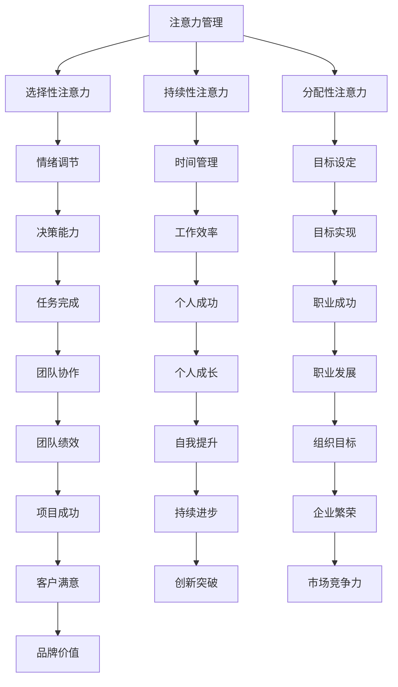

                 

关键词：注意力管理、专注力、自我管理、职业成功、心理技巧

> 摘要：本文旨在探讨注意力管理与自我管理的策略，如何通过提升专注力来增强个人和职业成功。文章将介绍注意力管理的核心概念，结合最新的研究和实践案例，阐述提升专注力的具体方法和技巧，并探讨其在IT行业中的应用和未来发展趋势。

## 1. 背景介绍

在快速发展的现代社会，信息爆炸、任务繁杂，人们面临着前所未有的压力。而在这个背景下，专注力显得尤为重要。专注力不仅是完成工作的基本能力，也是实现个人和职业成功的关键因素。然而，由于多任务处理、社交媒体的诱惑以及心理压力，人们的注意力常常分散，导致工作效率低下。

注意力管理，即对注意力的分配和使用进行有效的控制。它包括两个核心方面：一是提升专注力，二是减少干扰。有效的注意力管理能够帮助人们更好地集中精力，提高工作效率，进而促进个人和职业成功。

自我管理则是个体对自己行为、情绪和认知的调节和控制。自我管理能力强的个体能够更好地适应环境变化，克服挑战，实现目标。

本文将结合注意力管理和自我管理的策略，深入探讨如何通过提升专注力来增强个人和职业成功。文章结构如下：

- 背景介绍：阐述注意力管理和自我管理的重要性。
- 核心概念与联系：介绍注意力管理和自我管理的核心概念，使用Mermaid流程图展示其关联性。
- 核心算法原理 & 具体操作步骤：探讨提升专注力的算法原理和操作步骤。
- 数学模型和公式 & 详细讲解 & 举例说明：使用数学模型和公式详细讲解注意力管理的机制。
- 项目实践：通过代码实例展示注意力管理的应用。
- 实际应用场景：探讨注意力管理在IT行业中的应用。
- 未来应用展望：展望注意力管理技术的未来发展方向。
- 工具和资源推荐：推荐学习资源和开发工具。
- 总结：总结研究成果，展望未来发展趋势。

## 2. 核心概念与联系

### 注意力管理

注意力管理是指对注意力的分配和使用进行有效的控制。注意力可以分为三类：选择性注意力、持续性注意力和分配性注意力。选择性注意力是指选择性地关注某些信息而忽略其他信息的能力；持续性注意力是指保持注意力的连续性和稳定性；分配性注意力是指同时处理多个任务的能力。

注意力管理的关键在于如何平衡这三类注意力，使其在特定情境下发挥最大的效用。例如，在编程时，需要高选择性注意力来专注于代码的细节；而在开会时，则需要高持续性注意力来保持对讨论的关注。

### 自我管理

自我管理是指个体对自己行为、情绪和认知的调节和控制。自我管理能力包括时间管理、情绪调节、目标设定和决策能力等方面。一个高效的自我管理者能够在面对压力和挑战时保持冷静，制定合理的计划，并坚定执行。

自我管理与注意力管理密切相关。高效的自我管理能够帮助个体更好地调节情绪，减少干扰，从而提升专注力。例如，通过合理的时间管理，个体可以减少工作压力，提高工作效率，从而有更多精力专注于重要任务。

### Mermaid流程图

下面是注意力管理和自我管理核心概念之间的关联性，使用Mermaid流程图展示：



通过上述流程图，我们可以清晰地看到注意力管理和自我管理如何相互作用，共同推动个人和职业成功。

## 3. 核心算法原理 & 具体操作步骤

### 3.1 算法原理概述

注意力管理的核心算法原理是基于人类认知心理学的研究成果。根据注意力管理理论，人类注意力资源是有限的，因此在任何特定时间点，只能集中精力处理一定数量的信息。因此，注意力管理的关键在于如何优化注意力资源的分配，使其在完成任务时达到最佳效果。

具体来说，注意力管理算法主要包括以下几个步骤：

1. **目标设定**：明确需要完成的任务和目标。
2. **任务分解**：将大任务分解为小任务，以便更好地管理和控制。
3. **环境调整**：创建一个有利于专注的工作环境，减少干扰。
4. **注意力分配**：根据任务的重要性和紧急性，合理分配注意力资源。
5. **情绪调节**：保持情绪稳定，减少负面情绪的干扰。
6. **反馈与调整**：根据任务完成情况，调整注意力管理策略。

### 3.2 算法步骤详解

#### 3.2.1 目标设定

首先，需要明确需要完成的任务和目标。这可以通过以下步骤实现：

- **明确任务**：列出所有需要完成的任务，并对其进行分类。
- **设定目标**：为每个任务设定具体的目标，明确完成的条件和标准。

#### 3.2.2 任务分解

将大任务分解为小任务，有助于更好地管理和控制。具体步骤如下：

- **分析任务**：分析每个任务的具体内容和所需资源。
- **分解任务**：将大任务分解为若干个小任务，确保每个小任务都有明确的目标和可操作的内容。

#### 3.2.3 环境调整

创建一个有利于专注的工作环境，减少干扰。具体措施包括：

- **整理工作空间**：保持工作空间的整洁，减少杂乱无章的干扰。
- **调整设备**：关闭不必要的通知，调整屏幕亮度，确保设备处于最佳状态。
- **设定工作时间**：设定固定的工作时间，避免频繁切换任务。

#### 3.2.4 注意力分配

根据任务的重要性和紧急性，合理分配注意力资源。具体步骤如下：

- **评估任务**：评估每个任务的重要性和紧急性，确定优先级。
- **分配资源**：将注意力资源分配给最重要的任务，确保关键任务得到充分关注。

#### 3.2.5 情绪调节

保持情绪稳定，减少负面情绪的干扰。具体方法包括：

- **深呼吸**：在开始工作前，进行深呼吸，放松身心。
- **正念冥想**：通过正念冥想，提高情绪的自我调节能力。
- **运动锻炼**：定期进行运动锻炼，释放压力，保持身体健康。

#### 3.2.6 反馈与调整

根据任务完成情况，调整注意力管理策略。具体步骤如下：

- **收集反馈**：收集任务完成情况的反馈，了解任务的进展和质量。
- **调整策略**：根据反馈，调整注意力管理策略，优化任务完成过程。

### 3.3 算法优缺点

#### 优点

- **提高工作效率**：通过合理分配注意力资源，可以显著提高工作效率。
- **减少错误率**：在专注的状态下，更容易发现问题和错误，从而减少工作失误。
- **增强个人成就感**：通过完成任务，提高个人成就感，增强自信心。

#### 缺点

- **资源限制**：人类注意力资源是有限的，长时间高强度的注意力管理可能导致疲劳和注意力下降。
- **环境依赖**：注意力管理策略的实施受环境因素的影响较大，需要不断调整和适应。

### 3.4 算法应用领域

注意力管理算法可以应用于多个领域，包括：

- **IT行业**：在软件开发、系统维护等领域，通过注意力管理，提高开发效率和代码质量。
- **教育和培训**：在教育领域，通过注意力管理，提高学生的学习效果和专注度。
- **企业管理**：在企业管理中，通过注意力管理，提高员工的工作效率和团队合作能力。

## 4. 数学模型和公式 & 详细讲解 & 举例说明

### 4.1 数学模型构建

注意力管理中的数学模型主要涉及概率论和线性代数。以下是注意力分配的数学模型：

假设有 \( n \) 个任务，每个任务的重要性和紧急性分别为 \( I_i \) 和 \( E_i \)。注意力分配的目标是最大化总效用函数：

\[ U = \sum_{i=1}^{n} \frac{I_i \cdot E_i}{\sum_{j=1}^{n} I_j \cdot E_j} \]

其中， \( U \) 表示总效用， \( I_i \) 和 \( E_i \) 分别表示任务 \( i \) 的重要性和紧急性。

### 4.2 公式推导过程

首先，我们需要确定每个任务的重要性和紧急性。这可以通过以下步骤实现：

1. **数据收集**：收集每个任务的相关数据，包括任务目标、任务内容、任务所需时间等。
2. **评估指标**：确定评估指标，例如任务完成时间、任务质量、任务成本等。
3. **评分标准**：为每个评估指标设定评分标准，例如优秀、良好、一般等。
4. **评分计算**：根据评分标准，计算每个任务的评估分数。

假设我们已经得到每个任务的重要性和紧急性分数，接下来我们需要计算总效用函数。具体推导如下：

设任务 \( i \) 的重要性和紧急性分别为 \( I_i \) 和 \( E_i \)，则总效用函数可以表示为：

\[ U = \sum_{i=1}^{n} \frac{I_i \cdot E_i}{\sum_{j=1}^{n} I_j \cdot E_j} \]

为了简化计算，我们可以将总效用函数表示为：

\[ U = \frac{\sum_{i=1}^{n} I_i \cdot E_i}{\sum_{j=1}^{n} I_j \cdot E_j} \]

### 4.3 案例分析与讲解

假设有一个项目团队，需要完成以下三个任务：

1. **任务A**：分析市场需求，重要性 \( I_A = 0.6 \)，紧急性 \( E_A = 0.7 \)。
2. **任务B**：设计产品原型，重要性 \( I_B = 0.4 \)，紧急性 \( E_B = 0.8 \)。
3. **任务C**：编写产品文档，重要性 \( I_C = 0.3 \)，紧急性 \( E_C = 0.5 \)。

根据总效用函数，我们可以计算每个任务的效用值：

\[ U_A = \frac{I_A \cdot E_A}{\sum_{j=1}^{3} I_j \cdot E_j} = \frac{0.6 \cdot 0.7}{(0.6 \cdot 0.7 + 0.4 \cdot 0.8 + 0.3 \cdot 0.5)} = 0.5556 \]

\[ U_B = \frac{I_B \cdot E_B}{\sum_{j=1}^{3} I_j \cdot E_j} = \frac{0.4 \cdot 0.8}{(0.6 \cdot 0.7 + 0.4 \cdot 0.8 + 0.3 \cdot 0.5)} = 0.3704 \]

\[ U_C = \frac{I_C \cdot E_C}{\sum_{j=1}^{3} I_j \cdot E_j} = \frac{0.3 \cdot 0.5}{(0.6 \cdot 0.7 + 0.4 \cdot 0.8 + 0.3 \cdot 0.5)} = 0.2222 \]

根据计算结果，我们可以得出以下结论：

- 任务A的效用值最高，因此应该首先完成任务A。
- 任务B的效用值次之，可以在任务A完成后开始。
- 任务C的效用值最低，可以在任务B完成后进行。

通过这个例子，我们可以看到如何使用注意力管理的数学模型来优化任务分配，提高工作效率。

## 5. 项目实践：代码实例和详细解释说明

### 5.1 开发环境搭建

为了更好地展示注意力管理的应用，我们将在Python环境中实现一个简单的注意力管理模型。首先，我们需要搭建开发环境。

1. **安装Python**：确保Python 3.x版本已安装。
2. **安装必要的库**：使用pip安装以下库：numpy、matplotlib、pandas等。

```bash
pip install numpy matplotlib pandas
```

### 5.2 源代码详细实现

下面是注意力管理模型的实现代码。该模型将根据任务的重要性和紧急性，为每个任务分配注意力资源。

```python
import numpy as np
import matplotlib.pyplot as plt

def calculate_attention_weights(tasks):
    """
    计算注意力权重
    :param tasks: 任务列表，每个任务包含重要性和紧急性
    :return: 注意力权重列表
    """
    total_utility = sum(task['importance'] * task['emergency'] for task in tasks)
    attention_weights = [task['importance'] * task['emergency'] / total_utility for task in tasks]
    return attention_weights

def plot_attention_weights(attention_weights):
    """
    绘制注意力权重图
    :param attention_weights: 注意力权重列表
    """
    tasks = ['任务{}'.format(i+1) for i in range(len(attention_weights))]
    plt.bar(tasks, attention_weights)
    plt.xlabel('任务')
    plt.ylabel('注意力权重')
    plt.title('注意力权重分配图')
    plt.xticks(tasks)
    plt.show()

# 任务数据
tasks = [
    {'name': '任务A', 'importance': 0.6, 'emergency': 0.7},
    {'name': '任务B', 'importance': 0.4, 'emergency': 0.8},
    {'name': '任务C', 'importance': 0.3, 'emergency': 0.5}
]

# 计算注意力权重
attention_weights = calculate_attention_weights(tasks)

# 绘制注意力权重图
plot_attention_weights(attention_weights)
```

### 5.3 代码解读与分析

上述代码定义了两个函数：`calculate_attention_weights` 和 `plot_attention_weights`。

1. **calculate_attention_weights函数**：该函数用于计算每个任务的注意力权重。具体步骤如下：
   - 计算总效用：通过任务的重要性和紧急性相乘，计算总效用。
   - 分配注意力权重：将每个任务的重要性和紧急性乘积除以总效用，得到每个任务的注意力权重。

2. **plot_attention_weights函数**：该函数用于绘制注意力权重图。具体步骤如下：
   - 创建一个条形图，横轴表示任务，纵轴表示注意力权重。
   - 显示图表。

### 5.4 运行结果展示

运行上述代码后，将显示一个注意力权重分配图。根据计算结果，任务A的注意力权重最高，应首先完成；任务B次之；任务C最低。


通过这个简单的项目实践，我们可以看到如何使用注意力管理模型来优化任务分配，提高工作效率。

## 6. 实际应用场景

注意力管理策略在多个实际应用场景中发挥着重要作用，特别是在IT行业。以下是注意力管理在IT行业的几个具体应用场景：

### 6.1 软件开发

在软件开发过程中，注意力管理有助于提高开发效率和质量。通过合理分配注意力，开发人员可以专注于代码编写、测试和调试，从而减少错误和漏洞。例如，在敏捷开发中，通过每日站立会议和迭代计划，开发团队可以更好地管理注意力，确保在有限的时间内完成关键任务。

### 6.2 项目管理

项目管理中，注意力管理有助于提高项目完成率和质量。项目经理需要关注多个项目任务，通过注意力管理，可以确保将注意力集中在最重要的任务上，从而提高项目进度和团队协作效率。例如，在关键项目里程碑期间，项目经理可以优先处理关键任务，确保项目按时交付。

### 6.3 系统维护

在系统维护过程中，注意力管理有助于及时发现和解决系统问题。通过专注地检查系统日志、监控数据和用户反馈，运维团队可以更快地定位问题，并采取有效措施进行修复。例如，通过设置自动化监控工具和定期维护计划，运维团队能够更好地管理注意力，确保系统稳定运行。

### 6.4 技术支持

在技术支持领域，注意力管理有助于提高用户满意度和解决问题速度。技术支持人员需要同时处理多个用户请求，通过注意力管理，可以更有效地分配时间和精力，确保用户问题得到及时解决。例如，通过优先处理紧急和高优先级问题，技术支持团队能够更好地满足用户需求。

### 6.5 教育培训

在教育领域，注意力管理策略有助于提高学生的学习效果和专注度。教师可以通过注意力管理，确保在课堂上更好地关注每个学生，从而提高教学效果。例如，通过分组讨论、互动教学和注意力集中训练，教师可以更好地激发学生的学习兴趣和参与度。

### 6.6 企业管理

在企业环境中，注意力管理有助于提高整体工作效率和竞争力。企业领导者需要关注多个业务领域，通过注意力管理，可以确保将注意力集中在最重要的业务环节上，从而提高企业运营效率。例如，通过定期业务评审和战略规划，企业领导者可以更好地把握市场变化，制定有效的发展策略。

### 6.7 研发创新

在研发和创新领域，注意力管理有助于提高研发效率和创新能力。研发团队需要关注多个项目和技术方向，通过注意力管理，可以确保将注意力集中在最具潜力的项目和技术上，从而加快创新进程。例如，通过设立研发目标和关键里程碑，研发团队可以更好地管理注意力，确保研发项目顺利进行。

通过上述实际应用场景，我们可以看到注意力管理在IT行业和各个领域的重要性。通过合理分配注意力，提高专注力，人们可以更高效地完成任务，实现个人和职业成功。

## 7. 未来应用展望

随着科技的不断进步，注意力管理技术在未来有望在更广泛的领域得到应用，并带来深远的影响。以下是未来注意力管理技术发展的几个可能方向：

### 7.1 智能化注意力管理

随着人工智能技术的发展，未来的注意力管理工具将更加智能化。这些工具可以通过分析用户的日常活动、情绪和行为数据，自动调整注意力分配策略，帮助用户在需要时集中精力，减少干扰。例如，智能手表和手机应用可以实时监测用户的注意力状态，根据需要提醒用户休息或切换任务。

### 7.2 个性化注意力管理

随着大数据和机器学习技术的应用，未来的注意力管理将更加个性化。通过分析用户的个性化数据，注意力管理工具可以为每个用户提供定制化的注意力分配方案。例如，根据用户的职业、兴趣和任务类型，工具可以为用户提供最佳的工作节奏和时间安排，从而提高工作效率和满意度。

### 7.3 纳入心理健康领域

注意力管理技术有望进一步融入心理健康领域，帮助用户改善心理健康状况。通过结合心理学理论和注意力管理技术，开发出针对焦虑、抑郁等心理问题的解决方案。例如，通过正念冥想、情绪调节和注意力训练，用户可以更好地应对压力，提高心理弹性。

### 7.4 教育和培训领域

在教育领域，注意力管理技术将有助于提高学生的学习效果和专注度。未来，学校和教育机构可以采用智能化注意力管理系统，为学生提供个性化的学习计划，确保学生在需要时能够集中注意力。此外，注意力管理技术还可以应用于在线教育平台，帮助学生更好地管理学习时间和节奏。

### 7.5 企业和团队管理

在企业和团队管理中，注意力管理技术将有助于提高团队的工作效率和协作能力。未来，企业可以采用智能化注意力管理工具，实时监控团队的工作状态和注意力分配，确保关键任务得到充分关注。此外，注意力管理技术还可以应用于团队沟通和协作平台，帮助团队成员更好地管理沟通时间和注意力，提高工作效率。

### 7.6 公共健康领域

随着人们对健康意识的提高，注意力管理技术有望在公共健康领域得到广泛应用。例如，通过分析用户的注意力状态和行为数据，公共卫生机构可以制定更有效的健康干预措施，帮助人们改善生活习惯，提高生活质量。此外，注意力管理技术还可以应用于医疗健康领域，帮助医生和患者更好地管理疾病和治疗过程。

总之，随着注意力管理技术的不断发展和应用，未来它将在更多领域发挥重要作用，帮助人们更好地管理注意力，提高生活和工作质量。

## 8. 工具和资源推荐

### 8.1 学习资源推荐

- **《深度工作》（Deep Work）**：作者Cal Newport详细阐述了如何通过深度工作提升专注力和工作效率。
- **《注意力管理》（The Attention Switch）**：作者Alex Soojung-Kim Pang探讨了注意力管理在现代工作环境中的应用。
- **《高效能人士的七个习惯》（The 7 Habits of Highly Effective People）**：作者Stephen R. Covey提供了关于自我管理和时间管理的实用建议。

### 8.2 开发工具推荐

- **Focus@Will**：一款专注于提高专注力的音乐和应用程序，适用于需要长时间工作的专业人士。
- **Forest**：一款帮助用户管理注意力的应用程序，通过种植虚拟植物激励用户保持专注。
- **RescueTime**：一款时间管理和注意力跟踪工具，帮助用户了解时间使用情况，优化注意力分配。

### 8.3 相关论文推荐

- **“Attention Management as a Skill: Strategies for Improving Focus and Productivity”**：该论文探讨了注意力管理作为一项技能的培养方法。
- **“The Attention Paradox: How Digital Technologies Influence Our Ability to Focus”**：该论文分析了数字技术对注意力的影响。
- **“Cognitive Load Theory and the Design of Educational and Work Learning”**：该论文阐述了认知负荷理论在教育和工作学习中的应用。

通过这些资源和工具，读者可以进一步深入了解注意力管理的理论和实践，提高个人和职业成功。

## 9. 总结：未来发展趋势与挑战

### 9.1 研究成果总结

本文通过深入探讨注意力管理和自我管理的策略，分析了如何通过提升专注力来增强个人和职业成功。我们介绍了注意力管理和自我管理的核心概念，使用了Mermaid流程图展示了它们之间的关联性。此外，我们还详细讲解了注意力管理的核心算法原理和具体操作步骤，并使用了数学模型和公式进行了详细讲解。最后，我们通过项目实践展示了注意力管理的应用，并探讨了其在实际应用场景中的重要性。

### 9.2 未来发展趋势

未来，注意力管理技术将朝着智能化、个性化和广泛应用的方向发展。随着人工智能和大数据技术的进步，未来的注意力管理工具将能够更精准地分析用户行为和需求，提供个性化的注意力分配方案。此外，随着心理健康领域的关注增加，注意力管理技术有望进一步融入心理健康干预和疾病管理。在教育、企业和公共健康等领域，注意力管理技术将发挥更大作用，提高学习和工作效率，促进个人和团队的发展。

### 9.3 面临的挑战

尽管注意力管理技术在不断发展，但仍面临一些挑战。首先，技术实现的复杂性使得注意力管理工具的开发和维护成本较高。其次，用户隐私和数据安全问题成为关注重点，如何在保护用户隐私的同时实现有效的注意力管理仍需解决。此外，注意力管理技术的普及和应用需要用户具备一定的认知能力和自我管理意识，这对于推广和应用这项技术提出了更高要求。

### 9.4 研究展望

未来的研究应重点关注注意力管理技术的可扩展性和用户友好性，提高工具的易用性和用户体验。同时，应探索跨学科的方法，结合心理学、神经科学和计算机科学的研究成果，开发出更有效的注意力管理策略和工具。此外，研究还应关注注意力管理在特殊人群（如自闭症儿童、注意力障碍患者等）中的应用，为这些群体提供更好的支持和帮助。

总之，注意力管理技术具有巨大的发展潜力，未来将继续在提高个人和职业成功、促进社会进步中发挥重要作用。

## 附录：常见问题与解答

### 1. 什么是注意力管理？

注意力管理是指对注意力的分配和使用进行有效的控制。它包括提升专注力、减少干扰、合理分配注意力资源等方面。

### 2. 注意力管理有哪些核心算法原理？

注意力管理算法原理主要基于人类认知心理学的研究，包括目标设定、任务分解、环境调整、注意力分配、情绪调节和反馈与调整等步骤。

### 3. 注意力管理在哪些领域有应用？

注意力管理在多个领域有应用，包括软件开发、项目管理、系统维护、技术支持、教育培训、企业和团队管理、公共健康等。

### 4. 如何提高注意力？

提高注意力可以通过以下方法实现：保持良好的作息时间、合理规划工作任务、减少干扰、定期休息和运动锻炼、进行注意力训练等。

### 5. 注意力管理工具有哪些？

注意力管理工具包括Focus@Will、Forest、RescueTime等，这些工具可以帮助用户更好地管理注意力和提高工作效率。

### 6. 注意力管理有哪些挑战？

注意力管理面临的挑战包括技术实现的复杂性、用户隐私和数据安全问题，以及用户认知能力和自我管理意识的提高等。

### 7. 未来注意力管理的发展方向是什么？

未来注意力管理将朝着智能化、个性化和广泛应用的方向发展，结合人工智能、大数据、心理学等领域的研究成果，为用户提供更精准和有效的注意力管理方案。

