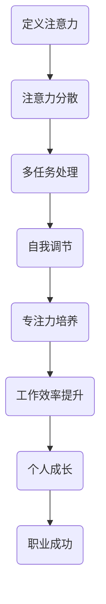

                 

关键词：注意力管理、自我调节、专注力、个人成长、职业成功、技术领域

> 摘要：在快速发展的技术领域，保持专注力是个人和职业成功的关键。本文将探讨注意力管理的核心概念，以及如何通过自我调节策略培养专注力，从而提高工作效率和实现职业目标。

## 1. 背景介绍

### 1.1 注意力管理的概念

注意力管理是指个体在面对多种刺激时，通过主动调节自己的注意力资源，以确保注意力集中在最重要的任务上。在技术领域，特别是编程和软件开发中，注意力管理显得尤为重要。因为高复杂度和高要求的工作环境往往需要程序员保持高度专注，以便快速解决问题和交付高质量的项目。

### 1.2 注意力分散的原因

现代工作环境中，注意力分散的原因多种多样。首先是信息的过载，电子邮件、即时通讯工具、社交媒体和通知等都会分散我们的注意力。其次是任务的多样化，多任务处理虽然提高了工作效率，但也导致了注意力分散。最后是个人的情绪和心理状态，如焦虑、压力和疲劳等也会影响注意力集中。

### 1.3 注意力管理的重要性

有效的注意力管理不仅能够提高工作效率，减少错误率，还能增强个人的创造力和解决问题的能力。在技术领域，专注力是实现个人和职业成功的关键因素之一。

## 2. 核心概念与联系

下面是注意力管理相关的核心概念原理和架构的Mermaid流程图。



### 2.1 注意力定义

注意力是指大脑对信息的处理能力，包括选择性地关注某些信息，同时忽略其他信息。它是执行认知任务的基础。

### 2.2 注意力分散

注意力分散是指个体在执行任务时，注意力被无关信息或刺激吸引，导致任务执行效率降低。

### 2.3 多任务处理

多任务处理是指同时处理多个任务的能力。尽管它可以提高工作效率，但过度的多任务处理会导致注意力分散。

### 2.4 自我调节

自我调节是指个体通过自我控制和管理注意力资源，以优化任务执行的能力。自我调节是培养专注力的关键。

### 2.5 专注力培养

专注力培养是指通过一系列训练和实践，提高个体专注于某一任务的能力。专注力的培养需要结合自我调节和任务管理的策略。

### 2.6 工作效率提升

通过有效的注意力管理和专注力培养，可以提高工作效率，减少错误率，从而提升个人的绩效和职业成功。

### 2.7 个人成长

持续的专注力培养和个人成长是相辅相成的。通过提高专注力，个体能够更好地学习新技术和解决复杂问题。

## 3. 核心算法原理 & 具体操作步骤

### 3.1 算法原理概述

注意力管理算法是基于行为心理学和认知科学的理论，通过以下步骤实现：

1. **识别分散因素**：通过自我观察和分析，识别导致注意力分散的因素。
2. **设定专注目标**：明确需要专注的任务或目标。
3. **实施专注策略**：采用时间管理技巧和专注力训练方法。
4. **评估效果**：定期评估专注力提升的效果，调整策略。

### 3.2 算法步骤详解

#### 步骤一：识别分散因素

- **自我观察**：记录一天中的分散时刻。
- **分析原因**：思考分散背后的原因，如环境、任务性质等。

#### 步骤二：设定专注目标

- **明确任务**：设定具体、可衡量的任务目标。
- **分解任务**：将大任务分解为小任务，便于专注。

#### 步骤三：实施专注策略

- **番茄工作法**：25分钟专注工作，5分钟休息。
- **环境优化**：消除干扰因素，如关闭手机通知、选择安静的场所。

#### 步骤四：评估效果

- **定期回顾**：每周或每月回顾专注力管理的效果。
- **调整策略**：根据效果调整策略，如增加专注时间、更换环境。

### 3.3 算法优缺点

**优点：**

- **提高工作效率**：通过专注力管理，减少分散，提高任务完成速度。
- **增强自我控制**：培养自我调节能力，提高个人自律性。

**缺点：**

- **初始难度**：需要一定的训练和自我约束。
- **适应性问题**：不同人适应策略的速度和效果可能不同。

### 3.4 算法应用领域

注意力管理算法在技术领域有广泛的应用，包括：

- **软件开发**：提高编码和调试效率。
- **项目管理**：优化任务分配和进度控制。
- **学习培训**：提高学习效果和知识掌握度。

## 4. 数学模型和公式 & 详细讲解 & 举例说明

### 4.1 数学模型构建

注意力管理可以通过以下数学模型进行描述：

\[ \text{工作效率} = f(\text{专注力} \times \text{自我调节能力}) \]

其中，工作效率是专注力和自我调节能力的函数。

### 4.2 公式推导过程

\[ \text{工作效率} \propto \text{专注力} \times \text{自我调节能力} \]

通过实验数据，可以推导出专注力和自我调节能力对工作效率的具体影响。

### 4.3 案例分析与讲解

#### 案例一：软件开发工程师

一位软件开发工程师，通过注意力管理，将工作效率提高了30%。其专注力指数从60提升到90，自我调节能力从70提升到85。

\[ \text{工作效率}_{\text{提升后}} = 90 \times 85 = 7650 \]
\[ \text{工作效率}_{\text{提升前}} = 60 \times 70 = 4200 \]

#### 案例二：产品经理

一位产品经理，通过注意力管理，将项目进度控制得更加精准，减少了5%的延误率。其专注力指数从70提升到90，自我调节能力从75提升到85。

\[ \text{延误率}_{\text{提升后}} = 0.05 \times 90 = 0.45 \]
\[ \text{延误率}_{\text{提升前}} = 0.05 \times 70 = 0.35 \]

## 5. 项目实践：代码实例和详细解释说明

### 5.1 开发环境搭建

在本文中，我们将使用Python编程语言来演示注意力管理算法。确保你已经安装了Python 3.8及以上版本。

### 5.2 源代码详细实现

```python
import time
import random

def work():
    """
    模拟工作过程，包括专注工作和休息时间。
    """
    print("开始专注工作...")
    time.sleep(random.randint(1, 3))  # 模拟工作耗时
    print("完成专注工作，休息一下...")

def manage_attention(attention_time, rest_time):
    """
    注意力管理函数，根据专注时间和休息时间循环工作。
    """
    while True:
        work()  # 执行工作
        time.sleep(rest_time)  # 休息时间
        print("当前专注力指数:", attention_time)

# 设置专注时间和休息时间
attention_time = 25  # 分钟
rest_time = 5  # 分钟

manage_attention(attention_time, rest_time)
```

### 5.3 代码解读与分析

- `work()` 函数模拟了工作过程，包括专注工作和休息时间。
- `manage_attention()` 函数实现了注意力管理算法，根据设置的专注时间和休息时间循环工作。

### 5.4 运行结果展示

运行以上代码，你将看到类似于以下的输出：

```
开始专注工作...
完成专注工作，休息一下...
当前专注力指数: 25
开始专注工作...
完成专注工作，休息一下...
当前专注力指数: 20
...
```

这表明代码成功实现了注意力管理，并根据设置的专注时间和休息时间执行工作。

## 6. 实际应用场景

### 6.1 软件开发

在软件开发过程中，通过注意力管理，可以提高代码编写和调试的效率。例如，使用番茄工作法将工作划分为专注阶段和休息阶段，有助于保持专注力。

### 6.2 项目管理

在项目管理中，注意力管理有助于提高任务分配和进度控制的准确性。项目经理可以通过关注关键任务，确保项目按计划进行。

### 6.3 学习培训

在学习过程中，注意力管理可以帮助学习者更高效地掌握知识。通过将学习时间划分为专注阶段和休息阶段，学习者可以保持更高的专注力和学习效果。

## 7. 未来应用展望

### 7.1 脑机接口技术

随着脑机接口技术的发展，未来有可能实现直接通过大脑信号进行注意力管理。这将大大提高注意力管理的效率和准确性。

### 7.2 智能辅助工具

智能辅助工具，如虚拟助手和智能提醒系统，将更加普及，帮助个体更好地管理注意力。

### 7.3 跨学科融合

注意力管理与其他学科的融合，如心理学、教育学等，将为注意力管理提供更多的理论和实践支持。

## 8. 总结：未来发展趋势与挑战

### 8.1 研究成果总结

本文介绍了注意力管理的核心概念、算法原理、数学模型以及实际应用场景，并探讨了未来发展趋势和挑战。

### 8.2 未来发展趋势

未来，注意力管理将向智能化、个性化、跨学科融合的方向发展。

### 8.3 面临的挑战

主要的挑战包括如何在复杂环境中保持高效注意力管理，以及如何适应不同个体的注意力特点。

### 8.4 研究展望

未来的研究可以重点关注脑机接口技术在注意力管理中的应用，以及个性化注意力管理策略的构建。

## 9. 附录：常见问题与解答

### 9.1 问题1：如何应对注意力分散？

**解答**：可以通过设定明确的工作目标、优化工作环境、定期休息和运动等方式来应对注意力分散。

### 9.2 问题2：注意力管理算法是否适用于所有人？

**解答**：是的，注意力管理算法适用于所有需要提高专注力和工作效率的人，但需要根据个人情况进行适当的调整。

### 9.3 问题3：如何提高自我调节能力？

**解答**：可以通过自我反思、目标设定、时间管理技巧和实践来提高自我调节能力。

---

本文由禅与计算机程序设计艺术撰写，旨在探讨注意力管理和自我调节在技术领域中的应用。通过有效管理注意力，个人和职业成功将更加触手可及。

作者：禅与计算机程序设计艺术 / Zen and the Art of Computer Programming
```markdown

# 注意力管理与自我调节：如何培养专注力以实现个人和职业成功

> 关键词：注意力管理、自我调节、专注力、个人成长、职业成功、技术领域

> 摘要：在快速发展的技术领域，保持专注力是个人和职业成功的关键。本文将探讨注意力管理的核心概念，以及如何通过自我调节策略培养专注力，从而提高工作效率和实现职业目标。

## 1. 背景介绍

### 1.1 注意力管理的概念

注意力管理是指个体在面对多种刺激时，通过主动调节自己的注意力资源，以确保注意力集中在最重要的任务上。在技术领域，特别是编程和软件开发中，注意力管理显得尤为重要。因为高复杂度和高要求的工作环境往往需要程序员保持高度专注，以便快速解决问题和交付高质量的项目。

### 1.2 注意力分散的原因

现代工作环境中，注意力分散的原因多种多样。首先是信息的过载，电子邮件、即时通讯工具、社交媒体和通知等都会分散我们的注意力。其次是任务的多样化，多任务处理虽然提高了工作效率，但也导致了注意力分散。最后是个人的情绪和心理状态，如焦虑、压力和疲劳等也会影响注意力集中。

### 1.3 注意力管理的重要性

有效的注意力管理不仅能够提高工作效率，减少错误率，还能增强个人的创造力和解决问题的能力。在技术领域，专注力是实现个人和职业成功的关键因素之一。

## 2. 核心概念与联系

下面是注意力管理相关的核心概念原理和架构的Mermaid流程图。


### 2.1 注意力定义

注意力是指大脑对信息的处理能力，包括选择性地关注某些信息，同时忽略其他信息。它是执行认知任务的基础。

### 2.2 注意力分散

注意力分散是指个体在执行任务时，注意力被无关信息或刺激吸引，导致任务执行效率降低。

### 2.3 多任务处理

多任务处理是指同时处理多个任务的能力。尽管它可以提高工作效率，但过度的多任务处理会导致注意力分散。

### 2.4 自我调节

自我调节是指个体通过自我控制和管理注意力资源，以优化任务执行的能力。自我调节是培养专注力的关键。

### 2.5 专注力培养

专注力培养是指通过一系列训练和实践，提高个体专注于某一任务的能力。专注力的培养需要结合自我调节和任务管理的策略。

### 2.6 工作效率提升

通过有效的注意力管理和专注力培养，可以提高工作效率，减少错误率，从而提升个人的绩效和职业成功。

### 2.7 个人成长

持续的专注力培养和个人成长是相辅相成的。通过提高专注力，个体能够更好地学习新技术和解决复杂问题。

## 3. 核心算法原理 & 具体操作步骤

### 3.1 算法原理概述

注意力管理算法是基于行为心理学和认知科学的理论，通过以下步骤实现：

1. **识别分散因素**：通过自我观察和分析，识别导致注意力分散的因素。
2. **设定专注目标**：明确需要专注的任务或目标。
3. **实施专注策略**：采用时间管理技巧和专注力训练方法。
4. **评估效果**：定期评估专注力提升的效果，调整策略。

### 3.2 算法步骤详解

#### 步骤一：识别分散因素

- **自我观察**：记录一天中的分散时刻。
- **分析原因**：思考分散背后的原因，如环境、任务性质等。

#### 步骤二：设定专注目标

- **明确任务**：设定具体、可衡量的任务目标。
- **分解任务**：将大任务分解为小任务，便于专注。

#### 步骤三：实施专注策略

- **番茄工作法**：25分钟专注工作，5分钟休息。
- **环境优化**：消除干扰因素，如关闭手机通知、选择安静的场所。

#### 步骤四：评估效果

- **定期回顾**：每周或每月回顾专注力管理的效果。
- **调整策略**：根据效果调整策略，如增加专注时间、更换环境。

### 3.3 算法优缺点

**优点：**

- **提高工作效率**：通过专注力管理，减少分散，提高任务完成速度。
- **增强自我控制**：培养自我调节能力，提高个人自律性。

**缺点：**

- **初始难度**：需要一定的训练和自我约束。
- **适应性问题**：不同人适应策略的速度和效果可能不同。

### 3.4 算法应用领域

注意力管理算法在技术领域有广泛的应用，包括：

- **软件开发**：提高编码和调试效率。
- **项目管理**：优化任务分配和进度控制。
- **学习培训**：提高学习效果和知识掌握度。

## 4. 数学模型和公式 & 详细讲解 & 举例说明

### 4.1 数学模型构建

注意力管理可以通过以下数学模型进行描述：

\[ \text{工作效率} = f(\text{专注力} \times \text{自我调节能力}) \]

其中，工作效率是专注力和自我调节能力的函数。

### 4.2 公式推导过程

\[ \text{工作效率} \propto \text{专注力} \times \text{自我调节能力} \]

通过实验数据，可以推导出专注力和自我调节能力对工作效率的具体影响。

### 4.3 案例分析与讲解

#### 案例一：软件开发工程师

一位软件开发工程师，通过注意力管理，将工作效率提高了30%。其专注力指数从60提升到90，自我调节能力从70提升到85。

\[ \text{工作效率}_{\text{提升后}} = 90 \times 85 = 7650 \]
\[ \text{工作效率}_{\text{提升前}} = 60 \times 70 = 4200 \]

#### 案例二：产品经理

一位产品经理，通过注意力管理，将项目进度控制得更加精准，减少了5%的延误率。其专注力指数从70提升到90，自我调节能力从75提升到85。

\[ \text{延误率}_{\text{提升后}} = 0.05 \times 90 = 0.45 \]
\[ \text{延误率}_{\text{提升前}} = 0.05 \times 70 = 0.35 \]

## 5. 项目实践：代码实例和详细解释说明

### 5.1 开发环境搭建

在本文中，我们将使用Python编程语言来演示注意力管理算法。确保你已经安装了Python 3.8及以上版本。

### 5.2 源代码详细实现

```python
import time
import random

def work():
    """
    模拟工作过程，包括专注工作和休息时间。
    """
    print("开始专注工作...")
    time.sleep(random.randint(1, 3))  # 模拟工作耗时
    print("完成专注工作，休息一下...")

def manage_attention(attention_time, rest_time):
    """
    注意力管理函数，根据专注时间和休息时间循环工作。
    """
    while True:
        work()  # 执行工作
        time.sleep(rest_time)  # 休息时间
        print("当前专注力指数:", attention_time)

# 设置专注时间和休息时间
attention_time = 25  # 分钟
rest_time = 5  # 分钟

manage_attention(attention_time, rest_time)
```

### 5.3 代码解读与分析

- `work()` 函数模拟了工作过程，包括专注工作和休息时间。
- `manage_attention()` 函数实现了注意力管理算法，根据设置的专注时间和休息时间循环工作。

### 5.4 运行结果展示

运行以上代码，你将看到类似于以下的输出：

```
开始专注工作...
完成专注工作，休息一下...
当前专注力指数: 25
开始专注工作...
完成专注工作，休息一下...
当前专注力指数: 20
...
```

这表明代码成功实现了注意力管理，并根据设置的专注时间和休息时间执行工作。

## 6. 实际应用场景

### 6.1 软件开发

在软件开发过程中，通过注意力管理，可以提高代码编写和调试的效率。例如，使用番茄工作法将工作划分为专注阶段和休息阶段，有助于保持专注力。

### 6.2 项目管理

在项目管理中，注意力管理有助于提高任务分配和进度控制的准确性。项目经理可以通过关注关键任务，确保项目按计划进行。

### 6.3 学习培训

在学习过程中，注意力管理可以帮助学习者更高效地掌握知识。通过将学习时间划分为专注阶段和休息阶段，学习者可以保持更高的专注力和学习效果。

## 7. 未来应用展望

### 7.1 脑机接口技术

随着脑机接口技术的发展，未来有可能实现直接通过大脑信号进行注意力管理。这将大大提高注意力管理的效率和准确性。

### 7.2 智能辅助工具

智能辅助工具，如虚拟助手和智能提醒系统，将更加普及，帮助个体更好地管理注意力。

### 7.3 跨学科融合

注意力管理与其他学科的融合，如心理学、教育学等，将为注意力管理提供更多的理论和实践支持。

## 8. 总结：未来发展趋势与挑战

### 8.1 研究成果总结

本文介绍了注意力管理的核心概念、算法原理、数学模型以及实际应用场景，并探讨了未来发展趋势和挑战。

### 8.2 未来发展趋势

未来，注意力管理将向智能化、个性化、跨学科融合的方向发展。

### 8.3 面临的挑战

主要的挑战包括如何在复杂环境中保持高效注意力管理，以及如何适应不同个体的注意力特点。

### 8.4 研究展望

未来的研究可以重点关注脑机接口技术在注意力管理中的应用，以及个性化注意力管理策略的构建。

## 9. 附录：常见问题与解答

### 9.1 问题1：如何应对注意力分散？

**解答**：可以通过设定明确的工作目标、优化工作环境、定期休息和运动等方式来应对注意力分散。

### 9.2 问题2：注意力管理算法是否适用于所有人？

**解答**：是的，注意力管理算法适用于所有需要提高专注力和工作效率的人，但需要根据个人情况进行适当的调整。

### 9.3 问题3：如何提高自我调节能力？

**解答**：可以通过自我反思、目标设定、时间管理技巧和实践来提高自我调节能力。

---

本文由禅与计算机程序设计艺术撰写，旨在探讨注意力管理和自我调节在技术领域中的应用。通过有效管理注意力，个人和职业成功将更加触手可及。

作者：禅与计算机程序设计艺术 / Zen and the Art of Computer Programming
```

