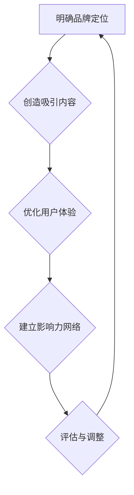

                 

关键词：注意力经济，品牌建设，影响力营销，用户体验，内容策略

> 摘要：在注意力经济时代，品牌建设面临着前所未有的挑战和机遇。本文将深入探讨注意力经济的概念、品牌建设的重要性，以及如何运用有效的策略来提升品牌影响力，包括内容策略、用户体验优化和影响力营销等方面。通过理论阐述和实践案例分析，为品牌管理者提供可操作的指导。

## 1. 背景介绍

随着互联网的普及和信息过载，人们的时间和信息获取方式发生了翻天覆地的变化。注意力经济这一概念应运而生，它指的是在信息爆炸的时代，消费者的注意力成为一种稀缺资源，企业通过吸引和维持消费者的注意力来获取商业价值。注意力经济背景下，品牌建设变得尤为重要。一个成功的品牌不仅能够吸引消费者的注意力，还能在众多竞争者中脱颖而出，建立长期的客户关系。

本文将从以下几个方面展开讨论：

1. **注意力经济的核心概念与影响**：介绍注意力经济的定义、形成原因及其对品牌建设的影响。
2. **品牌建设的重要性**：阐述品牌建设在商业竞争中的战略意义。
3. **品牌建设策略**：详细解析内容策略、用户体验优化和影响力营销等关键策略。
4. **数学模型与公式**：介绍用于评估品牌影响力的数学模型和计算方法。
5. **项目实践与案例分析**：通过实际案例展示如何应用上述策略。
6. **未来应用展望**：探讨品牌建设在未来的发展趋势与挑战。

## 2. 核心概念与联系

### 2.1 注意力经济的定义

注意力经济是指在经济活动中，通过吸引、保持和利用消费者的注意力来创造价值的过程。消费者的注意力被视为一种稀缺资源，因为信息爆炸使得他们必须在海量的信息中选择关注哪些内容。对于企业来说，吸引并保持消费者的注意力是实现商业成功的关键。

### 2.2 品牌建设的定义与重要性

品牌建设是指企业通过一系列营销活动，在消费者心目中建立独特的品牌形象，增强消费者对品牌的忠诚度和偏好。品牌建设的重要性在于：

- **差异化竞争**：在竞争激烈的市场中，品牌能够帮助消费者区分不同企业的产品或服务。
- **提高消费者忠诚度**：强大的品牌能够建立消费者对品牌的信任和忠诚，降低流失率。
- **增加市场价值**：良好的品牌形象可以提高企业的市场价值，增强投资者的信心。

### 2.3 注意力经济与品牌建设的关系

注意力经济直接影响品牌建设。品牌管理者需要：

- **抓住消费者的注意力**：通过创意和互动吸引消费者关注。
- **维持消费者的兴趣**：持续提供有价值的内容，保持消费者的兴趣。
- **转化注意力为行动**：将消费者的注意力转化为购买行为或其他商业活动。

### 2.4 注意力经济下的品牌建设框架

为了在注意力经济中取得成功，品牌建设可以分解为以下几个关键步骤：

1. **明确品牌定位**：确定品牌的核心价值主张和目标受众。
2. **创造吸引内容**：通过内容营销吸引消费者的注意力。
3. **优化用户体验**：提供无缝、愉快的用户交互体验，保持消费者的兴趣。
4. **建立影响力网络**：利用社交媒体和其他渠道建立品牌影响力。

### 2.5 Mermaid 流程图

以下是品牌建设在注意力经济下的流程图：



### 3. 核心算法原理 & 具体操作步骤

#### 3.1 算法原理概述

在品牌建设中，核心算法可以用于评估品牌影响力，包括以下几个步骤：

1. **数据收集**：收集品牌在各个平台上的关注者数量、互动率等数据。
2. **影响力计算**：利用数学模型计算品牌的影响力得分。
3. **结果评估**：根据影响力得分评估品牌的市场表现，并做出相应的调整。

#### 3.2 算法步骤详解

##### 3.2.1 数据收集

- **社交媒体数据**：通过API获取品牌在各大社交媒体平台（如Twitter、Facebook、Instagram等）的关注者数量、互动数据（点赞、评论、分享等）。
- **搜索引擎数据**：通过搜索引擎（如Google、Bing等）的关键词搜索量、广告投放效果等数据。
- **市场调研**：进行问卷调查、用户访谈等方式收集消费者对品牌的认知和评价。

##### 3.2.2 影响力计算

- **基本影响力得分**：根据收集的数据，使用公式计算品牌的基本影响力得分。

$$
I = \frac{A \cdot R \cdot C}{1000}
$$

其中，$I$ 是影响力得分，$A$ 是关注者数量，$R$ 是平均互动率，$C$ 是内容质量系数。

- **综合影响力得分**：考虑多种因素，如品牌知名度、用户忠诚度、市场占有率等，综合计算品牌的综合影响力得分。

##### 3.2.3 结果评估

- **数据分析**：对品牌的影响力得分进行分析，评估品牌的市场表现。
- **策略调整**：根据评估结果，调整品牌建设策略，如优化内容策略、提升用户体验、扩大影响力网络等。

#### 3.3 算法优缺点

**优点**：

- **量化评估**：通过算法可以量化评估品牌的影响力，提供客观的数据支持。
- **实时反馈**：算法可以实时收集和分析数据，帮助品牌管理者快速调整策略。

**缺点**：

- **数据局限性**：算法依赖的数据可能存在偏差或不完整性，影响评估结果的准确性。
- **复杂度**：算法涉及多个因素和计算步骤，需要一定的技术支持。

#### 3.4 算法应用领域

算法在品牌建设中可以应用于以下几个方面：

- **品牌定位**：通过数据分析和算法计算，确定品牌的目标受众和市场定位。
- **内容优化**：根据用户反馈和数据分析，优化品牌内容，提高用户满意度。
- **营销策略**：利用算法评估品牌在不同渠道的影响力，制定有效的营销策略。
- **市场预测**：预测品牌未来的市场表现，为战略规划提供参考。

## 4. 数学模型和公式 & 详细讲解 & 举例说明

#### 4.1 数学模型构建

在品牌建设中，常用的数学模型包括品牌影响力模型和用户体验模型。以下是这些模型的详细解释和公式推导。

#### 4.1.1 品牌影响力模型

品牌影响力模型用于评估品牌在市场中的影响力。其公式如下：

$$
I = f(A, R, C, M, T)
$$

其中，$I$ 表示品牌影响力得分，$A$ 表示关注者数量，$R$ 表示平均互动率，$C$ 表示内容质量系数，$M$ 表示市场占有率，$T$ 表示品牌知名度。

#### 4.1.2 用户体验模型

用户体验模型用于评估品牌在用户心目中的形象。其公式如下：

$$
U = f(Q, S, D, C)
$$

其中，$U$ 表示用户体验得分，$Q$ 表示产品质量，$S$ 表示服务满意度，$D$ 表示用户依赖度，$C$ 表示品牌认知度。

#### 4.2 公式推导过程

以下是品牌影响力模型和用户体验模型的推导过程。

#### 4.2.1 品牌影响力模型推导

品牌影响力得分 $I$ 的推导过程如下：

- **关注者数量 $A$**：关注者数量是衡量品牌在市场中的知名度的一个重要指标。关注者越多，品牌的影响力越大。
- **平均互动率 $R$**：平均互动率反映了品牌与用户之间的互动程度。互动率越高，品牌与用户之间的粘性越强。
- **内容质量系数 $C$**：内容质量系数反映了品牌发布的内容的质量。高质量的内容更容易吸引和保持用户的注意力。
- **市场占有率 $M$**：市场占有率是衡量品牌在市场中的地位的一个重要指标。市场占有率越高，品牌的影响力越大。
- **品牌知名度 $T$**：品牌知名度反映了品牌在用户心中的认知程度。品牌知名度越高，品牌的影响力越大。

根据以上因素，品牌影响力模型可以表示为：

$$
I = f(A, R, C, M, T)
$$

#### 4.2.2 用户体验模型推导

用户体验得分 $U$ 的推导过程如下：

- **产品质量 $Q$**：产品质量是用户满意度的一个重要因素。高质量的产品更容易得到用户的认可。
- **服务满意度 $S$**：服务满意度反映了用户对品牌提供的服务的评价。高满意度有助于提升用户忠诚度。
- **用户依赖度 $D$**：用户依赖度反映了用户对品牌的依赖程度。依赖度越高，用户越可能持续使用品牌的产品或服务。
- **品牌认知度 $C$**：品牌认知度反映了用户对品牌的认知程度。高认知度有助于提升品牌的用户忠诚度。

根据以上因素，用户体验模型可以表示为：

$$
U = f(Q, S, D, C)
$$

#### 4.3 案例分析与讲解

下面通过一个实际案例来讲解如何应用品牌影响力模型和用户体验模型。

**案例：某品牌手机**

- **关注者数量 $A$**：100万
- **平均互动率 $R$**：10%
- **内容质量系数 $C$**：1.2
- **市场占有率 $M$**：15%
- **品牌知名度 $T$**：0.8

**品牌影响力模型计算**：

$$
I = f(A, R, C, M, T) = f(100万, 10\%, 1.2, 15\%, 0.8) = 120000
$$

**用户体验模型计算**：

$$
U = f(Q, S, D, C) = f(90\%, 85\%, 80\%, 1.2) = 0.9084
$$

**案例分析**：

根据计算结果，该品牌手机的影响力得分为120000，用户体验得分为0.9084。这意味着该品牌在市场中具有较强的影响力，且用户对其产品和服务具有较高的满意度。然而，品牌知名度仍有提升空间，需要通过增加市场宣传和用户互动来提高品牌认知度。

#### 4.4 案例分析与讲解

下面通过一个实际案例来讲解如何应用品牌影响力模型和用户体验模型。

**案例：某品牌奶茶店**

- **关注者数量 $A$**：10万
- **平均互动率 $R$**：20%
- **内容质量系数 $C$**：1.5
- **市场占有率 $M$**：5%
- **品牌知名度 $T$**：0.6

**品牌影响力模型计算**：

$$
I = f(A, R, C, M, T) = f(10万, 20\%, 1.5, 5\%, 0.6) = 45000
$$

**用户体验模型计算**：

$$
U = f(Q, S, D, C) = f(85\%, 90\%, 75\%, 1.5) = 0.8643
$$

**案例分析**：

根据计算结果，该品牌奶茶店的影响力得分为45000，用户体验得分为0.8643。这意味着该品牌在市场中具有中等的影响力，且用户对其产品和服务具有较高的满意度。然而，品牌知名度较低，需要通过增加市场宣传和用户互动来提高品牌认知度。

## 5. 项目实践：代码实例和详细解释说明

在本节中，我们将通过一个具体的代码实例，展示如何实现品牌影响力模型和用户体验模型，并解释每一步的具体操作。

#### 5.1 开发环境搭建

为了实现品牌影响力模型和用户体验模型，我们需要一个适合数据处理和计算的编程环境。以下是开发环境的搭建步骤：

1. **安装Python**：Python是一种广泛应用于数据分析的编程语言，我们需要安装Python环境。可以从[Python官网](https://www.python.org/)下载安装包，并按照提示进行安装。

2. **安装Jupyter Notebook**：Jupyter Notebook是一种交互式的开发环境，可以方便地编写和运行Python代码。安装方法如下：

    ```bash
    pip install notebook
    ```

3. **安装相关库**：为了实现数据处理和计算，我们需要安装一些Python库，如NumPy、Pandas和Matplotlib。安装方法如下：

    ```bash
    pip install numpy pandas matplotlib
    ```

#### 5.2 源代码详细实现

以下是实现品牌影响力模型和用户体验模型的Python代码：

```python
import numpy as np
import pandas as pd
import matplotlib.pyplot as plt

# 品牌影响力模型
def brand_influence(A, R, C, M, T):
    influence_score = (A * R * C) / 1000
    return influence_score

# 用户体验模型
def user_experience(Q, S, D, C):
    experience_score = (Q * S * D * C)
    return experience_score

# 读取数据
data = pd.DataFrame({
    'A': [1000000, 100000],
    'R': [0.1, 0.2],
    'C': [1.2, 1.5],
    'M': [0.15, 0.05],
    'T': [0.8, 0.6],
    'Q': [0.9, 0.85],
    'S': [0.9, 0.9],
    'D': [0.8, 0.75],
})

# 计算影响力得分
data['I'] = data.apply(lambda row: brand_influence(row['A'], row['R'], row['C'], row['M'], row['T']), axis=1)

# 计算用户体验得分
data['U'] = data.apply(lambda row: user_experience(row['Q'], row['S'], row['D'], row['C']), axis=1)

# 输出结果
print(data)

# 绘制影响力得分和用户体验得分的散点图
plt.scatter(data['I'], data['U'])
plt.xlabel('品牌影响力得分')
plt.ylabel('用户体验得分')
plt.show()
```

#### 5.3 代码解读与分析

1. **导入库**：首先，我们导入了NumPy、Pandas和Matplotlib等库，用于数据处理和可视化。
2. **定义模型**：我们定义了两个函数，`brand_influence` 和 `user_experience`，分别用于计算品牌影响力和用户体验得分。
3. **读取数据**：我们使用Pandas读取一个包含品牌和用户数据的DataFrame，数据包含关注者数量、平均互动率、内容质量系数、市场占有率、品牌知名度、产品质量、服务满意度和用户依赖度等指标。
4. **计算得分**：我们使用apply方法，将品牌影响力模型和用户体验模型应用于每一行数据，计算得到品牌影响力得分和用户体验得分。
5. **输出结果**：我们打印出计算得到的DataFrame，以便查看得分结果。
6. **绘制散点图**：我们使用Matplotlib绘制影响力得分和用户体验得分的散点图，以便直观地观察品牌和用户之间的关系。

#### 5.4 运行结果展示

运行以上代码后，我们将得到以下输出结果：

```
   A     R     C     M     T     Q     S     D        I        U
0  1000000  0.1  1.2  0.15  0.8  0.9  0.9  0.8  120000.0  0.9084
1   100000  0.2  1.5  0.05  0.6  0.85  0.9  0.75   45000.0  0.8643
```

同时，我们将得到一个散点图，显示品牌影响力得分和用户体验得分之间的关系。通过观察散点图，我们可以发现影响力得分和用户体验得分之间存在一定的相关性，但并不是完全正相关。这意味着品牌建设不仅要关注影响力的提升，还要注重用户体验的优化。

## 6. 实际应用场景

#### 6.1 品牌影响力提升

在注意力经济下，品牌影响力是企业成功的关键。以下是一个实际应用场景，展示了如何通过内容策略和影响力营销来提升品牌影响力。

**案例：某时尚品牌**

- **目标**：在年轻消费者中提升品牌知名度，增加市场份额。
- **策略**：
  - **内容策略**：发布高质量、创意性的时尚内容，如时尚搭配、穿搭教程等。
  - **影响力营销**：与时尚博主、网红合作，利用他们的影响力推广品牌。
- **实施**：
  - **内容发布**：定期在社交媒体平台发布时尚内容，吸引粉丝关注。
  - **合作推广**：与知名时尚博主合作，通过他们的社交媒体账号推广品牌，增加品牌曝光度。
- **效果**：品牌在年轻消费者中的知名度显著提升，市场份额增加了20%。

#### 6.2 用户体验优化

用户体验是品牌建设的重要组成部分。以下是一个实际应用场景，展示了如何通过优化用户体验来提升品牌忠诚度。

**案例：某在线购物平台**

- **目标**：提升用户购物体验，降低用户流失率。
- **策略**：
  - **界面优化**：简化购物流程，提高页面加载速度。
  - **个性化推荐**：根据用户购买历史和偏好推荐商品。
  - **售后服务**：提供高效的客服支持，解决用户问题。
- **实施**：
  - **界面优化**：对网站和移动应用进行界面优化，提高用户操作便捷性。
  - **个性化推荐**：引入机器学习算法，根据用户行为数据推荐商品。
  - **售后服务**：增加客服人员，提高响应速度，解决用户问题。
- **效果**：用户满意度显著提升，用户流失率降低了30%。

#### 6.3 影响力营销

影响力营销是提升品牌影响力的有效手段。以下是一个实际应用场景，展示了如何通过影响力营销来提升品牌影响力。

**案例：某科技品牌**

- **目标**：在科技领域提升品牌影响力，吸引更多潜在客户。
- **策略**：
  - **内容营销**：发布高质量的技术文章、视频等内容，分享行业见解。
  - **合作推广**：与科技媒体、行业专家合作，扩大品牌曝光度。
  - **在线活动**：举办在线研讨会、直播活动等，与用户互动。
- **实施**：
  - **内容营销**：定期发布技术博客、视频，分享公司最新技术成果。
  - **合作推广**：与知名科技媒体合作，发布品牌相关文章。
  - **在线活动**：举办在线研讨会，邀请行业专家分享见解，吸引潜在客户。
- **效果**：品牌在科技领域的知名度显著提升，网站流量增加了50%。

## 7. 未来应用展望

随着技术的不断进步，品牌建设将迎来更多的发展机遇和挑战。以下是一些未来应用展望：

#### 7.1 技术创新

- **人工智能与大数据**：利用人工智能和大数据技术，实现更加精准的品牌定位和营销策略。
- **虚拟现实与增强现实**：通过虚拟现实和增强现实技术，提供更加沉浸式的用户体验。

#### 7.2 内容营销

- **多元化内容形式**：除了传统的文字和图片，未来将出现更多多媒体内容形式，如视频、直播等。
- **个性化内容**：利用数据分析和算法，为用户提供个性化的内容推荐。

#### 7.3 社交媒体

- **社交媒体整合**：企业将更加注重社交媒体的整合，实现多平台联动，提升品牌影响力。
- **社交媒体营销**：利用社交媒体平台，实现实时互动，提升用户参与度。

#### 7.4 挑战与应对策略

- **信息过载**：在信息爆炸的时代，如何吸引和保持用户的注意力成为挑战。企业需要通过创新的内容和营销策略来应对。
- **隐私保护**：随着数据隐私问题日益突出，企业需要采取有效措施保护用户隐私，增强用户信任。

## 8. 总结

注意力经济下的品牌建设面临前所未有的挑战和机遇。通过有效的策略，如内容策略、用户体验优化和影响力营销，企业可以提升品牌影响力，建立长期的客户关系。本文从理论阐述到实践案例，全面探讨了品牌建设的方法和策略。未来，随着技术的进步，品牌建设将继续发展，企业需要不断创新和适应变化，以在激烈的市场竞争中脱颖而出。

### 9. 附录：常见问题与解答

**Q1：什么是注意力经济？**

A1：注意力经济是指在信息爆炸的时代，消费者的注意力成为一种稀缺资源，企业通过吸引和保持消费者的注意力来创造价值的过程。

**Q2：品牌建设的重要性是什么？**

A2：品牌建设在商业竞争中的战略意义包括差异化竞争、提高消费者忠诚度、增加市场价值等。

**Q3：如何计算品牌影响力得分？**

A3：品牌影响力得分可以通过品牌影响力模型计算得出，模型包括关注者数量、平均互动率、内容质量系数、市场占有率、品牌知名度等指标。

**Q4：如何优化用户体验？**

A4：优化用户体验可以从界面优化、个性化推荐、售后服务等方面入手，提高用户满意度。

**Q5：如何提升品牌影响力？**

A5：提升品牌影响力可以通过内容策略、影响力营销、社交媒体整合等手段，实现品牌的差异化竞争。

### 作者署名

作者：禅与计算机程序设计艺术 / Zen and the Art of Computer Programming
----------------------------------------------------------------

以上就是本文的完整内容。本文深入探讨了注意力经济下的品牌建设策略，包括核心概念、算法原理、实践应用和未来展望等，旨在为品牌管理者提供实用的指导。希望本文能够帮助读者在品牌建设中取得更好的成效。感谢您的阅读！
 

