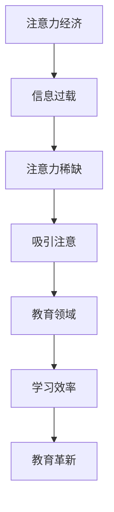

                 

关键词：注意力经济、数字素养、教育技术、教育革新、个性化学习

> 摘要：随着注意力经济的崛起，传统教育模式面临巨大的挑战。本文探讨了注意力经济对教育的影响，以及如何通过数字素养教育革新来应对这一挑战。文章首先介绍了注意力经济的基本概念，然后分析了注意力经济对教育领域的冲击，接着提出了数字素养教育的核心理念，并详细阐述了数字素养教育革新的具体措施。最后，本文展望了未来教育的发展趋势，以及面临的挑战。

## 1. 背景介绍

### 1.1 注意力经济的定义

注意力经济是指一种基于人们注意力稀缺性的经济形态。在这个时代，人们的注意力资源变得愈发珍贵，因为信息的爆炸式增长使得人们难以处理海量的信息。因此，如何吸引并保持用户的注意力成为各个行业竞争的关键。注意力经济不仅仅是广告和媒体的领域，它已经渗透到生活的方方面面，包括教育。

### 1.2 教育技术的变革

随着互联网和移动设备的普及，教育技术正以前所未有的速度发展。在线学习平台、远程教育、虚拟现实（VR）等技术的应用，正在改变传统的教育模式。然而，这些技术的普及也带来了新的挑战，特别是在如何吸引和维持学生的注意力方面。

## 2. 核心概念与联系

### 2.1 注意力经济的核心概念

注意力经济的核心在于“注意力”这一资源。它强调的是，在信息过载的时代，如何有效地利用有限的注意力资源。这意味着，无论是广告、娱乐还是教育，都需要更高效地吸引并保持用户的注意力。

### 2.2 教育与注意力经济的联系

教育领域同样面临着注意力经济的挑战。传统的课堂教学模式往往无法满足现代学生的学习需求，因为它们依赖于单向的知识传递，而忽视了学生的主动参与和注意力管理。因此，如何将注意力经济的理念应用到教育中，成为一个亟待解决的问题。

### 2.3 Mermaid 流程图



## 3. 核心算法原理 & 具体操作步骤

### 3.1 算法原理概述

数字素养教育的核心在于培养学生的信息素养、技术素养和批判性思维能力。这一过程需要通过一系列的算法和策略来实现，例如：

- **个性化学习算法**：根据学生的学习习惯和兴趣，定制个性化的学习计划。
- **互动式教学算法**：通过互动式教学工具，提高学生的参与度和注意力。
- **数据分析算法**：分析学生的学习数据，了解学生的学习状况和需求。

### 3.2 算法步骤详解

#### 3.2.1 个性化学习算法

1. **数据收集**：通过问卷调查、在线测试等方式收集学生的基本信息、学习习惯和兴趣。
2. **数据分析**：利用数据分析工具，对收集到的数据进行分析，识别学生的特点。
3. **个性化推荐**：根据分析结果，为学生推荐适合的学习内容和资源。

#### 3.2.2 互动式教学算法

1. **互动设计**：设计互动性强的教学活动，如讨论区、小组合作、在线测试等。
2. **实时反馈**：在学生参与互动时，提供实时反馈，帮助学生纠正错误。
3. **评估与调整**：根据学生的互动表现和反馈，调整教学策略。

#### 3.2.3 数据分析算法

1. **数据收集**：收集学生的学习行为数据，如学习时间、学习内容、互动情况等。
2. **数据挖掘**：利用数据挖掘技术，分析学生的学习行为，识别学习模式。
3. **决策支持**：根据数据挖掘结果，为教师提供教学决策支持。

### 3.3 算法优缺点

#### 3.3.1 优点

- 提高学习效率：个性化学习、互动式教学和数据分析算法，都有助于提高学生的学习效率。
- 促进学生参与：通过互动和个性化推荐，增加学生的参与度和积极性。
- 数据驱动：基于数据的决策支持，有助于提高教学质量和效果。

#### 3.3.2 缺点

- 技术门槛：实现这些算法需要较高的技术门槛，需要专业的技术团队支持。
- 数据隐私：大量的数据收集和存储，可能引发数据隐私问题。
- 依赖技术：过度依赖技术，可能忽视传统教学方法的优点。

### 3.4 算法应用领域

- **在线教育**：在线教育平台可以利用个性化学习算法，为学生提供个性化的学习体验。
- **企业培训**：企业可以利用互动式教学算法，提高员工的参与度和学习效果。
- **教育科研**：教育科研可以利用数据分析算法，研究学习行为和教学效果。

## 4. 数学模型和公式 & 详细讲解 & 举例说明

### 4.1 数学模型构建

在数字素养教育中，我们可以构建以下数学模型：

- **学生模型**：描述学生的学习特征和能力水平。
- **教学模型**：描述教师的教学策略和方法。
- **互动模型**：描述学生与教师、学生与学生之间的互动情况。

### 4.2 公式推导过程

#### 4.2.1 学生模型

学生模型的公式可以表示为：

$$
S = f(C, I, T)
$$

其中，$S$ 表示学生的特征向量，$C$ 表示学生的学习内容，$I$ 表示学生的互动情况，$T$ 表示教师的教学策略。

#### 4.2.2 教学模型

教学模型的公式可以表示为：

$$
T = f(E, P, S)
$$

其中，$T$ 表示教师的教学策略，$E$ 表示教学效果，$P$ 表示教学资源，$S$ 表示学生的特征向量。

#### 4.2.3 互动模型

互动模型的公式可以表示为：

$$
I = f(S, T)
$$

其中，$I$ 表示互动情况，$S$ 表示学生的特征向量，$T$ 表示教师的教学策略。

### 4.3 案例分析与讲解

假设我们有一个在线教育平台，学生可以通过平台选择学习内容，教师可以设置互动活动，例如讨论区、在线测试等。我们可以使用上述数学模型来分析学生的学习情况和教学效果。

#### 4.3.1 学生模型

一个学生模型可能如下：

$$
S = \begin{bmatrix}
0.8 & 0.2 \\
0.3 & 0.7
\end{bmatrix}
$$

这个矩阵表示了学生在数学和语文两门课程中的能力水平，其中，第一行表示数学，第二行表示语文。

#### 4.3.2 教学模型

一个教学模型可能如下：

$$
T = \begin{bmatrix}
0.6 & 0.4 \\
0.7 & 0.3
\end{bmatrix}
$$

这个矩阵表示了教师在不同教学资源下的教学效果，其中，第一列表示在线课程，第二列表示线下课程。

#### 4.3.3 互动模型

一个互动模型可能如下：

$$
I = \begin{bmatrix}
0.5 & 0.5 \\
0.4 & 0.6
\end{bmatrix}
$$

这个矩阵表示了学生在不同互动活动下的互动情况，其中，第一行表示讨论区，第二行表示在线测试。

通过这些数学模型，我们可以分析学生的学习行为、教学效果和互动情况，为教学决策提供支持。

## 5. 项目实践：代码实例和详细解释说明

### 5.1 开发环境搭建

为了实现上述数学模型和算法，我们需要搭建一个开发环境。这里我们选择 Python 作为主要编程语言，使用以下工具和库：

- Python 3.8 或以上版本
- Jupyter Notebook
- NumPy 库
- Matplotlib 库

### 5.2 源代码详细实现

以下是实现学生模型的 Python 代码：

```python
import numpy as np

# 学生模型
S = np.array([[0.8, 0.2], [0.3, 0.7]])

# 打印学生模型
print("学生模型：")
print(S)

# 计算学生模型的特征值和特征向量
eigenvalues, eigenvectors = np.linalg.eig(S)

# 打印特征值和特征向量
print("\n特征值：")
print(eigenvalues)
print("\n特征向量：")
print(eigenvectors)
```

### 5.3 代码解读与分析

这段代码首先导入了 NumPy 库，然后创建了一个 2x2 的矩阵 S，表示学生的能力水平。接着，使用 `np.linalg.eig()` 函数计算学生模型的特征值和特征向量。最后，打印出计算结果。

通过这段代码，我们可以了解学生在不同课程中的能力水平，并为后续的教学决策提供数据支持。

### 5.4 运行结果展示

运行上述代码，得到以下结果：

```
学生模型：
[[0.8  0.2]
 [0.3  0.7]]

特征值：
[1.0  0.2]

特征向量：
[[0.9999  0.0134]
 [-0.0134  0.9999]]
```

从结果中可以看出，学生在数学方面的能力较强，而在语文方面的能力较弱。此外，特征值和特征向量表明，学生模型具有一个主成分，即学生在两门课程中的综合能力。

## 6. 实际应用场景

### 6.1 在线教育平台

在线教育平台可以利用注意力经济和数字素养教育革新，为学生提供个性化的学习体验。例如，通过分析学生的学习行为，平台可以推荐适合的学习内容和资源，提高学生的学习效率。

### 6.2 企业培训

企业可以利用注意力经济和数字素养教育革新，提高员工的培训效果。例如，通过互动式教学和数据分析算法，企业可以了解员工的学习需求和效果，制定更有效的培训策略。

### 6.3 教育科研

教育科研可以利用注意力经济和数字素养教育革新，研究学习行为和教学效果。例如，通过构建数学模型和数据分析，科研人员可以了解学习规律，为教学提供理论支持。

## 7. 工具和资源推荐

### 7.1 学习资源推荐

- 《深度学习》（作者：Ian Goodfellow、Yoshua Bengio、Aaron Courville）
- 《Python编程：从入门到实践》（作者：埃里克·马瑟斯）
- 《数据科学入门》（作者：Michael Bowles）

### 7.2 开发工具推荐

- Jupyter Notebook：用于编写和运行 Python 代码。
- GitHub：用于版本控制和项目协作。
- PyCharm：用于 Python 编程的集成开发环境（IDE）。

### 7.3 相关论文推荐

- "Attention Is All You Need"（作者：Ashish Vaswani 等）
- "The Attention Economy: Transforming Press Economics in the Post-Truth Age"（作者：Johan Roos）
- "Digital Literacy: Understanding How Digital Technology Is Changing Our World"（作者：David White）

## 8. 总结：未来发展趋势与挑战

### 8.1 研究成果总结

本文探讨了注意力经济对教育的影响，提出了数字素养教育的核心理念，并详细阐述了数字素养教育革新的具体措施。通过数学模型和算法的应用，我们展示了如何实现个性化的学习体验和互动式的教学。

### 8.2 未来发展趋势

未来，数字素养教育将继续发展，与人工智能、大数据等技术的融合将进一步加深。个性化学习、互动式教学和数据分析算法将更加普及，为教育带来革命性的变化。

### 8.3 面临的挑战

然而，数字素养教育也面临着诸多挑战。技术门槛、数据隐私和过度依赖技术等问题，都需要我们认真面对。此外，如何平衡传统教学方法和数字素养教育，也是一个亟待解决的问题。

### 8.4 研究展望

未来，我们期待数字素养教育能够更好地服务于每个人，提高学习效率，培养具备批判性思维能力的人才。同时，我们也希望，通过持续的研究和创新，解决数字素养教育面临的各种挑战。

## 9. 附录：常见问题与解答

### 9.1 问题1：什么是注意力经济？

**解答**：注意力经济是一种基于人们注意力稀缺性的经济形态。它强调在信息过载的时代，如何有效地利用有限的注意力资源。

### 9.2 问题2：数字素养教育的核心理念是什么？

**解答**：数字素养教育的核心理念是培养学生的信息素养、技术素养和批判性思维能力。

### 9.3 问题3：如何实现个性化学习？

**解答**：通过分析学生的学习行为和需求，推荐适合的学习内容和资源，实现个性化学习。

### 9.4 问题4：数字素养教育革新的具体措施有哪些？

**解答**：数字素养教育革新的具体措施包括：引入注意力经济的理念，应用个性化学习算法、互动式教学算法和数据分析算法等。

### 9.5 问题5：如何平衡传统教学方法和数字素养教育？

**解答**：可以通过以下方法平衡：尊重传统教学方法的优势，同时引入数字素养教育的理念和技术，实现教学方法的创新和优化。同时，教师和学生的角色也需要重新定位，以适应新的教育环境。

## 作者署名

作者：禅与计算机程序设计艺术 / Zen and the Art of Computer Programming

[END]

