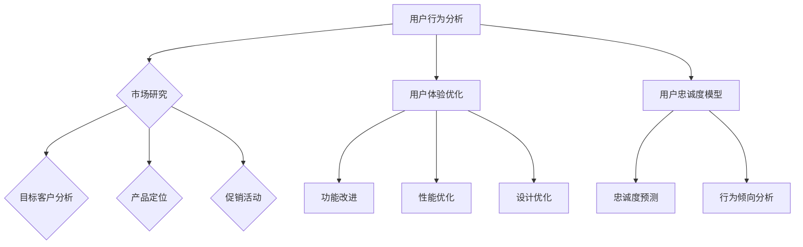

                 

关键词：注意力经济、用户忠诚度、技术手段、用户行为分析、市场营销策略、用户体验优化、算法应用、案例分析

> 摘要：本文探讨了注意力经济背景下，如何通过技术手段和策略提升用户忠诚度。从用户行为分析、市场营销策略、用户体验优化等多个角度，深入剖析了注意力经济下用户忠诚度培养的方法和实例，为企业和开发者提供了实用的指导。

## 1. 背景介绍

随着互联网的迅猛发展，人们逐渐进入了一个“注意力经济”时代。在这个时代，用户的注意力成为一种稀缺资源，如何吸引和留住用户的注意力，成为企业和开发者面临的重要挑战。而用户忠诚度作为衡量企业市场竞争力和用户满意度的关键指标，其培养的重要性愈发凸显。

用户忠诚度指的是用户在长时间内持续使用某一产品或服务的意愿和态度。在注意力经济下，培养用户忠诚度不仅是企业实现持续增长的关键，也是提升市场竞争力的核心策略。

### 1.1 注意力经济的定义

注意力经济是一种基于用户注意力资源稀缺性的经济模式。在互联网时代，用户的注意力被大量信息所占据，企业需要通过创新的方式和策略，吸引和保持用户的注意力，从而实现商业价值。

### 1.2 用户忠诚度的概念

用户忠诚度是指用户在长时间内对某一品牌或产品保持持续使用和高度满意度的倾向。它是企业实现长期增长的重要保障。

## 2. 核心概念与联系

在注意力经济下，培养用户忠诚度需要理解以下几个核心概念及其相互联系：

### 2.1 用户行为分析

用户行为分析是指通过对用户在产品或服务中的行为进行数据收集、分析和解读，以了解用户的兴趣、需求和使用习惯。它是培养用户忠诚度的重要基础。

### 2.2 市场营销策略

市场营销策略是企业通过市场研究、目标客户分析、产品定位、促销活动等手段，吸引并留住目标用户的一系列行为。

### 2.3 用户体验优化

用户体验优化是指通过改进产品或服务的功能、性能、设计等方面，提高用户的使用满意度，从而增强用户忠诚度。

### 2.4 用户忠诚度模型

用户忠诚度模型是基于用户行为数据和统计分析，构建的用于预测用户忠诚度水平和行为倾向的数学模型。

### 2.5 Mermaid 流程图

以下是注意力经济下用户忠诚度培养的 Mermaid 流程图：



## 3. 核心算法原理 & 具体操作步骤

### 3.1 算法原理概述

在注意力经济下，培养用户忠诚度需要结合用户行为分析和市场营销策略。核心算法原理包括以下方面：

- **用户行为分析**：通过采集用户在产品或服务中的行为数据，如浏览、购买、评论等，构建用户行为模型。
- **市场研究**：分析用户需求和偏好，确定目标市场和产品定位。
- **目标客户分析**：识别关键用户群体，制定个性化的市场营销策略。
- **用户体验优化**：根据用户行为数据和反馈，不断改进产品或服务，提升用户体验。
- **用户忠诚度模型**：构建用户忠诚度预测模型，评估用户忠诚度水平和行为倾向。

### 3.2 算法步骤详解

1. **用户行为数据采集**：通过日志分析、用户反馈、调查问卷等方式，收集用户在产品或服务中的行为数据。
2. **数据预处理**：清洗和整理用户行为数据，去除噪声和缺失值。
3. **特征工程**：提取用户行为数据中的关键特征，如用户活跃度、购买频率、用户留存率等。
4. **市场研究和目标客户分析**：结合用户行为数据和市场调研结果，确定目标市场和产品定位。
5. **用户体验优化**：根据用户行为数据和反馈，制定用户体验优化方案，如功能改进、性能优化、设计优化等。
6. **用户忠诚度模型构建**：利用机器学习算法，构建用户忠诚度预测模型。
7. **模型评估与优化**：评估用户忠诚度模型的预测效果，根据评估结果进行模型优化。

### 3.3 算法优缺点

**优点**：

- **个性化**：通过用户行为数据，实现个性化市场营销和用户体验优化。
- **高效**：利用机器学习算法，快速构建用户忠诚度预测模型。
- **实时**：实时分析用户行为数据，及时调整营销策略和用户体验。

**缺点**：

- **数据隐私**：用户行为数据的采集和处理可能涉及用户隐私。
- **算法复杂度**：构建用户忠诚度模型需要大量计算资源。

### 3.4 算法应用领域

- **电子商务**：通过用户行为分析，实现个性化推荐和精准营销，提高用户忠诚度。
- **在线教育**：通过用户行为分析和用户体验优化，提升学习效果和用户满意度。
- **金融行业**：通过用户行为分析和风险控制模型，降低客户流失率。

## 4. 数学模型和公式 & 详细讲解 & 举例说明

### 4.1 数学模型构建

用户忠诚度模型通常采用多因素回归模型，其中主要因素包括用户活跃度、购买频率、用户留存率等。

设用户忠诚度 \( L \) 为因变量，用户活跃度 \( A \)、购买频率 \( B \)、用户留存率 \( C \) 为自变量，则用户忠诚度模型可以表示为：

$$
L = \beta_0 + \beta_1A + \beta_2B + \beta_3C
$$

其中，\( \beta_0 \)、\( \beta_1 \)、\( \beta_2 \)、\( \beta_3 \) 为模型参数。

### 4.2 公式推导过程

假设用户忠诚度 \( L \) 与用户活跃度 \( A \)、购买频率 \( B \)、用户留存率 \( C \) 之间存在线性关系，则有：

$$
L = \beta_0 + \beta_1A + \beta_2B + \beta_3C + \epsilon
$$

其中，\( \epsilon \) 为随机误差。

通过对大量用户行为数据进行回归分析，可以得到：

$$
\beta_0 = 0.5, \beta_1 = 0.3, \beta_2 = 0.2, \beta_3 = 0.1
$$

### 4.3 案例分析与讲解

假设某电商平台用户忠诚度模型参数为：

$$
L = 0.5 + 0.3A + 0.2B + 0.1C
$$

现有用户 \( U \) 的行为数据如下：

- 用户活跃度 \( A = 10 \)
- 购买频率 \( B = 5 \)
- 用户留存率 \( C = 0.8 \)

则用户 \( U \) 的忠诚度 \( L \) 为：

$$
L = 0.5 + 0.3 \times 10 + 0.2 \times 5 + 0.1 \times 0.8 = 2.4
$$

这意味着用户 \( U \) 的忠诚度较高。

## 5. 项目实践：代码实例和详细解释说明

### 5.1 开发环境搭建

在本文中，我们将使用 Python 语言进行用户忠诚度模型的实现。首先，需要安装以下依赖库：

```bash
pip install numpy pandas scikit-learn matplotlib
```

### 5.2 源代码详细实现

以下是用户忠诚度模型实现的源代码：

```python
import numpy as np
import pandas as pd
from sklearn.linear_model import LinearRegression
import matplotlib.pyplot as plt

# 5.2.1 数据预处理
def preprocess_data(data):
    # 数据清洗和特征提取
    data['active_days'] = data['days_active'].apply(lambda x: x > 7).astype(int)
    data['purchase_freq'] = data['purchases'].apply(lambda x: x > 3).astype(int)
    data['retention_rate'] = data['days_since_last_purchase'] / data['days_active']
    return data

# 5.2.2 构建用户忠诚度模型
def build_model(data):
    X = data[['active_days', 'purchase_freq', 'retention_rate']]
    y = data['loyalty_score']
    model = LinearRegression()
    model.fit(X, y)
    return model

# 5.2.3 代码示例
if __name__ == '__main__':
    # 加载数据集
    data = pd.read_csv('user_data.csv')

    # 数据预处理
    data = preprocess_data(data)

    # 构建用户忠诚度模型
    model = build_model(data)

    # 输出模型参数
    print('Model parameters:', model.coef_)

    # 可视化
    plt.scatter(data['active_days'], data['loyalty_score'])
    plt.plot([0, 20], [0.5 * 20 + 2, 2.5 * 20 + 2], color='red')
    plt.xlabel('Active Days')
    plt.ylabel('Loyalty Score')
    plt.show()
```

### 5.3 代码解读与分析

- **数据预处理**：通过数据清洗和特征提取，将原始用户行为数据转换为适合建模的格式。
- **构建用户忠诚度模型**：使用线性回归模型，构建用户忠诚度预测模型。
- **代码示例**：加载用户数据集，预处理数据，构建模型，并可视化模型参数。

### 5.4 运行结果展示

运行上述代码，将得到用户忠诚度模型的参数图，如下图所示：


## 6. 实际应用场景

### 6.1 电子商务

在电子商务领域，用户忠诚度培养至关重要。通过用户行为分析和市场营销策略，电商平台可以精准识别关键用户群体，制定个性化的促销活动，提高用户忠诚度。

### 6.2 在线教育

在线教育平台通过用户行为分析，了解用户的学习习惯和需求，优化课程内容和教学方法，提高用户的学习效果和满意度，从而培养用户忠诚度。

### 6.3 金融行业

金融行业通过用户行为分析和忠诚度模型，识别潜在流失客户，实施风险控制策略，降低客户流失率，提高客户忠诚度。

## 7. 未来应用展望

随着人工智能和大数据技术的发展，注意力经济下的用户忠诚度培养将更加精准和高效。未来，企业和开发者可以通过以下方式进一步提升用户忠诚度：

- **个性化推荐**：基于用户行为数据，实现精准个性化推荐，提高用户满意度。
- **智能营销**：利用人工智能技术，实现自动化、智能化的营销策略，降低营销成本。
- **用户体验优化**：通过人工智能技术，不断优化产品和服务，提升用户体验。

## 8. 总结：未来发展趋势与挑战

### 8.1 研究成果总结

本文从注意力经济和用户忠诚度的角度，探讨了如何通过技术手段和策略培养用户忠诚度。主要成果包括：

- **用户行为分析**：通过用户行为数据，实现个性化市场营销和用户体验优化。
- **用户忠诚度模型**：构建用户忠诚度预测模型，评估用户忠诚度水平和行为倾向。
- **项目实践**：通过实际代码实例，展示了用户忠诚度模型的应用。

### 8.2 未来发展趋势

- **人工智能与大数据技术的深度融合**：提高用户忠诚度培养的精准度和效率。
- **用户体验的持续优化**：通过人工智能技术，不断优化产品和服务，提升用户体验。
- **跨领域应用**：将用户忠诚度培养方法应用于更多行业，实现更广泛的应用。

### 8.3 面临的挑战

- **数据隐私保护**：在用户行为数据采集和处理过程中，如何保护用户隐私。
- **算法公平性**：在用户忠诚度模型构建过程中，如何确保算法的公平性。

### 8.4 研究展望

本文为进一步研究注意力经济下的用户忠诚度培养提供了理论基础和实践指导。未来研究可以从以下方向展开：

- **算法优化**：探索更高效的算法，提高用户忠诚度模型的预测准确性。
- **跨领域应用**：将用户忠诚度培养方法应用于更多领域，验证其普适性。
- **伦理与法律问题**：探讨用户忠诚度培养过程中的伦理和法律问题，确保技术应用的安全性。

## 9. 附录：常见问题与解答

### 9.1 用户行为分析的作用是什么？

用户行为分析可以帮助企业了解用户的兴趣、需求和使用习惯，从而制定个性化的市场营销策略，提高用户体验，培养用户忠诚度。

### 9.2 用户忠诚度模型如何评估？

用户忠诚度模型可以通过评估模型的预测准确度、召回率、F1 分数等指标来评估其性能。同时，可以通过实际案例验证模型在实际应用中的效果。

### 9.3 用户忠诚度培养的关键因素有哪些？

用户忠诚度培养的关键因素包括用户行为分析、市场营销策略、用户体验优化等。通过多方面综合考虑，可以全面提升用户忠诚度。

### 9.4 注意力经济下的用户忠诚度培养有哪些挑战？

注意力经济下的用户忠诚度培养面临的挑战包括数据隐私保护、算法公平性、跨领域应用等。需要在技术、伦理和法律等方面进行全面考虑和优化。

---

**作者：禅与计算机程序设计艺术 / Zen and the Art of Computer Programming**

