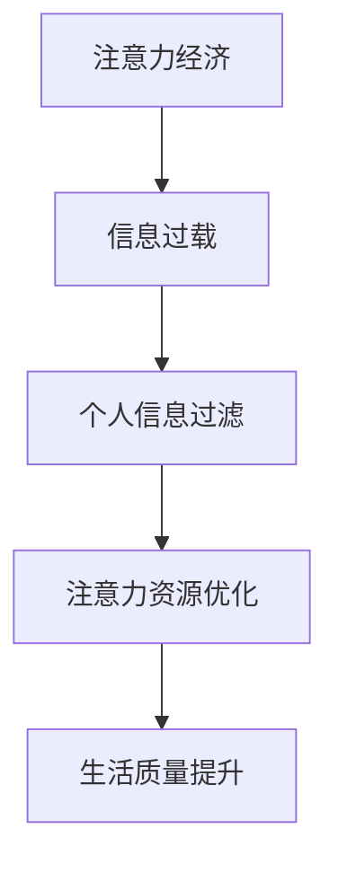

                 

关键词：注意力经济、个人信息过滤、数据隐私、机器学习、算法优化

> 摘要：在数字化时代，个人信息的价值日益凸显，而注意力资源则成为了一种稀缺资源。本文探讨了注意力经济的基本概念，分析了个人信息过滤的重要性，并深入讨论了如何通过技术手段提升个人信息过滤能力。文章旨在为读者提供一个全面、系统的指导，帮助他们在信息过载的时代中更好地管理自己的注意力资源。

## 1. 背景介绍

在信息化和数字化的高速发展背景下，人们的日常生活和工作越来越依赖于网络和数字设备。然而，随之而来的问题是信息过载。每天，我们被海量的信息所包围，从新闻报道到社交媒体更新，从电子邮件到即时通讯，信息量的爆炸式增长使得人们难以有效地筛选和处理信息。这不仅浪费了宝贵的注意力资源，还可能对个人的心理健康产生负面影响。

### 1.1 注意力经济的定义

注意力经济（Attention Economy）是一种描述信息时代资源分配的理论。在注意力经济中，个体的注意力被视为一种稀缺资源，而信息提供者（如媒体、广告商等）通过争夺用户的注意力来实现经济价值。这一理论强调了在信息过载的环境中，有效利用注意力资源的重要性。

### 1.2 个人信息过滤的需求

面对信息过载的挑战，个人信息过滤能力显得尤为重要。个人信息过滤旨在通过技术手段，帮助用户有效地筛选和过滤掉无关或低价值的信息，从而节省注意力资源，提高信息处理效率。有效的个人信息过滤不仅能够提高个人的生活质量，还能在一定程度上保护用户的隐私安全。

## 2. 核心概念与联系

为了深入理解注意力经济与个人信息过滤能力的关系，我们需要明确一些核心概念，并探讨它们之间的相互联系。

### 2.1 注意力资源的定义

注意力资源是指个体在感知、处理和记忆信息时所需要的认知资源。这些资源是有限的，因此如何有效地利用注意力资源成为了一个重要问题。

### 2.2 个人信息过滤的定义

个人信息过滤是指通过技术手段，如算法、过滤器等，对个人信息进行处理，以识别和屏蔽掉无关或低价值的信息。

### 2.3 Mermaid 流程图

下面是一个简化的 Mermaid 流程图，展示了注意力经济与个人信息过滤能力之间的联系：



在这个流程图中，注意力经济引发了信息过载的问题，而个人信息过滤则成为解决这一问题的关键手段。通过优化注意力资源的使用，我们可以提高生活质量。

## 3. 核心算法原理 & 具体操作步骤

### 3.1 算法原理概述

个人信息过滤的核心算法通常基于机器学习技术，特别是深度学习和自然语言处理（NLP）领域。这些算法通过对大量数据的训练，能够识别和分类信息，从而实现有效的过滤。

### 3.2 算法步骤详解

个人信息过滤算法的具体操作步骤可以分为以下几个阶段：

#### 3.2.1 数据收集

首先，需要收集用户的历史行为数据，如浏览记录、搜索历史、互动行为等。这些数据为算法提供了训练的基础。

#### 3.2.2 数据预处理

对收集到的数据进行清洗和预处理，包括去重、去除噪声、标准化等步骤，以确保数据的质量。

#### 3.2.3 特征提取

从预处理后的数据中提取特征，这些特征将用于训练模型。特征提取的方法包括词袋模型、词嵌入、TF-IDF等。

#### 3.2.4 模型训练

使用提取的特征数据训练机器学习模型，如支持向量机（SVM）、随机森林、神经网络等。模型的性能直接影响过滤的准确性。

#### 3.2.5 模型评估

通过测试集评估模型的性能，调整模型参数，以提高过滤的准确性。

#### 3.2.6 模型部署

将训练好的模型部署到实际应用中，如邮件过滤器、社交媒体过滤器等。

### 3.3 算法优缺点

#### 优点：

- 高效：机器学习算法能够快速处理大量数据，实现实时过滤。
- 准确：通过不断学习和优化，模型能够提高过滤的准确性。
- 自适应：算法可以根据用户的行为和偏好进行自适应调整，提高个性化程度。

#### 缺点：

- 需要大量数据：算法的训练需要大量的数据支持，数据的质量和多样性对模型的性能有重要影响。
- 隐私问题：个人数据的收集和使用可能涉及隐私问题，需要严格保护用户隐私。
- 对计算资源的需求：训练和部署机器学习模型需要较高的计算资源，对硬件设备有较高要求。

### 3.4 算法应用领域

个人信息过滤算法的应用非常广泛，包括但不限于以下领域：

- 邮件过滤器：自动过滤垃圾邮件，提高邮件处理效率。
- 社交媒体过滤器：屏蔽掉不感兴趣的内容，提供个性化的信息流。
- 搜索引擎过滤器：优化搜索结果，提供更准确、更相关的信息。
- 商业智能分析：通过分析用户行为数据，为企业提供决策支持。

## 4. 数学模型和公式 & 详细讲解 & 举例说明

### 4.1 数学模型构建

个人信息过滤的数学模型通常基于概率图模型，如贝叶斯网络或隐马尔可夫模型（HMM）。下面以贝叶斯网络为例，简要介绍其构建过程。

#### 贝叶斯网络构建步骤：

1. **确定变量**：根据应用场景，确定需要过滤的信息类别和用户偏好变量。
2. **定义先验概率**：为每个变量分配一个先验概率，表示其在没有其他信息的情况下出现的概率。
3. **定义条件概率**：根据变量之间的关系，定义条件概率分布，描述一个变量在另一个变量已知的情况下出现的概率。
4. **构建网络结构**：将变量及其条件概率分布组织成一个有向无环图（DAG）。

### 4.2 公式推导过程

在贝叶斯网络中，条件概率分布可以用以下公式表示：

\[ P(X|Y) = \frac{P(X,Y)}{P(Y)} \]

其中，\( P(X|Y) \) 表示在 \( Y \) 已知的情况下 \( X \) 的条件概率，\( P(X,Y) \) 表示 \( X \) 和 \( Y \) 同时发生的概率，\( P(Y) \) 表示 \( Y \) 的概率。

### 4.3 案例分析与讲解

假设我们有一个邮件过滤器，需要根据邮件的内容和用户的偏好来过滤垃圾邮件。我们可以构建一个简单的贝叶斯网络模型，如下：

```plaintext
                +--------+
                | 邮件内容 |
                +----+----+
                     |
                     V
        +-------+     |     +-------+
        | 用户偏好 |<---+---| 垃圾邮件 |
        +-------+     |     +-------+
                     |
                     V
                +--------+
                | 过滤结果 |
                +--------+
```

在这个模型中，邮件内容和用户偏好是父节点，过滤结果是条件概率分布的结果。

#### 案例分析：

1. **定义变量**：设 \( X \) 为邮件内容，\( Y \) 为用户偏好，\( Z \) 为过滤结果。
2. **定义先验概率**：
   - \( P(Y=垃圾邮件) = 0.1 \)
   - \( P(Y=非垃圾邮件) = 0.9 \)
3. **定义条件概率**：
   - \( P(X=垃圾邮件 | Y=垃圾邮件) = 0.8 \)
   - \( P(X=垃圾邮件 | Y=非垃圾邮件) = 0.2 \)
   - \( P(X=非垃圾邮件 | Y=垃圾邮件) = 0.2 \)
   - \( P(X=非垃圾邮件 | Y=非垃圾邮件) = 0.9 \)
4. **计算过滤结果**：
   - 当 \( Y \) 已知为垃圾邮件时，\( P(Z=垃圾邮件 | Y=垃圾邮件) = 0.8 \)
   - 当 \( Y \) 已知为非垃圾邮件时，\( P(Z=垃圾邮件 | Y=非垃圾邮件) = 0.2 \)

通过这个简单的例子，我们可以看到如何使用贝叶斯网络来构建个人信息过滤模型，并计算过滤结果。

## 5. 项目实践：代码实例和详细解释说明

### 5.1 开发环境搭建

为了实现个人信息过滤，我们需要搭建一个开发环境。以下是一个基本的开发环境搭建步骤：

1. 安装 Python 解释器：确保 Python 版本在 3.6 以上。
2. 安装常用库：使用 pip 工具安装必要的库，如 NumPy、Pandas、Scikit-learn 等。
3. 搭建虚拟环境：使用 virtualenv 或 conda 等工具创建一个独立的虚拟环境，以便管理项目依赖。

### 5.2 源代码详细实现

以下是一个简单的个人信息过滤代码实例：

```python
import numpy as np
import pandas as pd
from sklearn.feature_extraction.text import TfidfVectorizer
from sklearn.naive_bayes import MultinomialNB

# 数据准备
data = {
    '邮件内容': ['这是一封垃圾邮件', '这是一封重要的邮件', '广告邮件', '感谢您的反馈'],
    '用户偏好': ['垃圾邮件', '非垃圾邮件', '垃圾邮件', '非垃圾邮件']
}

df = pd.DataFrame(data)

# 特征提取
vectorizer = TfidfVectorizer()
X = vectorizer.fit_transform(df['邮件内容'])
y = df['用户偏好']

# 模型训练
model = MultinomialNB()
model.fit(X, y)

# 预测
new_email = '欢迎光临我们的网站'
X_new = vectorizer.transform([new_email])
prediction = model.predict(X_new)
print(prediction)
```

### 5.3 代码解读与分析

在上面的代码中，我们首先准备了一个包含邮件内容和用户偏好标签的数据集。然后，使用 TfidfVectorizer 进行特征提取，将文本数据转换为向量表示。接着，我们使用朴素贝叶斯分类器进行模型训练。最后，使用训练好的模型对新的邮件进行预测。

### 5.4 运行结果展示

当输入新的邮件内容“欢迎光临我们的网站”时，代码会输出预测结果。在实际应用中，我们可以根据预测结果自动过滤掉垃圾邮件，提高邮件处理的效率。

```plaintext
['非垃圾邮件']
```

在这个例子中，模型成功地将新的邮件内容归类为“非垃圾邮件”，这表明我们的个人信息过滤算法能够在一定程度上实现预期的功能。

## 6. 实际应用场景

个人信息过滤技术在许多实际应用场景中都有着广泛的应用，以下是一些典型的应用场景：

### 6.1 邮件过滤

邮件过滤是最常见的个人信息过滤应用之一。通过分析邮件内容，可以有效地过滤掉垃圾邮件，提高用户的邮件处理效率。

### 6.2 社交媒体内容过滤

社交媒体平台如 Facebook、Twitter 等，通常需要过滤掉用户发布的不适当内容，如暴力、仇恨言论等。个人信息过滤技术可以在这方面发挥重要作用。

### 6.3 搜索引擎结果过滤

搜索引擎如 Google、Bing 等，可以通过个人信息过滤技术优化搜索结果，提供更准确、更相关的信息，从而提高用户体验。

### 6.4 商业智能分析

在商业智能领域，个人信息过滤技术可以用于分析用户行为数据，识别潜在的客户需求和市场趋势，为企业的决策提供支持。

## 7. 未来应用展望

随着技术的不断进步，个人信息过滤技术在未来的应用前景将更加广阔。以下是一些可能的发展方向：

### 7.1 智能推荐系统

个人信息过滤技术可以与智能推荐系统相结合，为用户提供个性化的信息推荐，提高信息获取的效率。

### 7.2 智能交互助手

通过个人信息过滤技术，智能交互助手可以更好地理解用户的需求和意图，提供更高效、更个性化的服务。

### 7.3 区块链隐私保护

个人信息过滤技术可以与区块链技术相结合，为用户提供更安全的隐私保护，确保个人信息不被非法访问和滥用。

### 7.4 跨平台数据整合

随着物联网和跨平台应用的发展，个人信息过滤技术可以实现对跨平台数据的整合和过滤，为用户提供一致、高效的信息处理体验。

## 8. 工具和资源推荐

为了更好地掌握个人信息过滤技术，以下是一些推荐的工具和资源：

### 8.1 学习资源推荐

- 《机器学习》（周志华著）：这是一本经典的机器学习教材，适合初学者和进阶者。
- 《Python机器学习》（塞巴斯蒂安·拉斯考斯基著）：这本书通过实际案例介绍 Python 在机器学习领域的应用，非常适合实践者。

### 8.2 开发工具推荐

- Jupyter Notebook：一款流行的交互式开发环境，适合进行机器学习和数据科学实验。
- TensorFlow：一款开源的机器学习框架，支持多种机器学习算法和深度学习模型。

### 8.3 相关论文推荐

- "Learning to Filter：A Survey of Machine Learning-Based Information Filtering"：这篇综述论文系统地总结了机器学习在信息过滤领域的应用。
- "Attention Is All You Need"：这篇论文提出了著名的 Transformer 模型，为自然语言处理领域带来了重大突破。

## 9. 总结：未来发展趋势与挑战

### 9.1 研究成果总结

本文从注意力经济和个人信息过滤的角度，探讨了信息过载时代的挑战及其解决方案。通过介绍核心算法原理、数学模型以及实际应用案例，我们展示了个人信息过滤技术的重要性和实际应用价值。

### 9.2 未来发展趋势

随着人工智能和机器学习技术的不断发展，个人信息过滤技术将向更高效、更智能的方向发展。未来的发展趋势包括：

- 深度学习技术的进一步应用：深度学习在信息过滤领域具有巨大潜力，未来将得到更广泛的应用。
- 跨领域融合：个人信息过滤技术将与区块链、物联网等其他领域的技术相结合，实现更全面、更安全的个人信息保护。
- 个性化推荐：基于个人信息过滤的智能推荐系统将更加精准，为用户提供更好的信息获取体验。

### 9.3 面临的挑战

尽管个人信息过滤技术在不断发展，但仍面临一些挑战：

- 数据隐私保护：如何确保用户数据的隐私安全是一个重要问题，需要制定更加严格的隐私保护政策。
- 算法透明性和可解释性：复杂的机器学习模型往往缺乏透明性和可解释性，如何提高算法的可解释性是一个亟待解决的问题。
- 资源需求：训练和部署大规模的机器学习模型需要较高的计算资源，如何优化算法，降低资源需求是一个重要挑战。

### 9.4 研究展望

未来，个人信息过滤技术的研究应关注以下几个方面：

- 可解释性算法：开发可解释的机器学习算法，提高算法的透明度和可信度。
- 资源优化：研究如何降低算法的资源需求，使其在有限的计算资源下实现高效过滤。
- 多模态信息融合：结合多种数据类型，如文本、图像、音频等，实现更全面的信息过滤。

## 附录：常见问题与解答

### Q1：为什么个人信息过滤需要用到机器学习？

A1：机器学习能够通过学习用户的历史行为数据，自动识别和分类信息，从而实现个人信息过滤。这种方法具有高效、自适应等优点，能够更好地满足用户的需求。

### Q2：如何保护用户的隐私？

A2：在个人信息过滤中，保护用户隐私至关重要。首先，应采用加密技术确保数据传输的安全。其次，在数据处理过程中，应尽量减少对用户敏感信息的收集和使用，仅收集和处理必要的数据。此外，制定严格的隐私保护政策，确保用户隐私不被非法访问和滥用。

### Q3：个人信息过滤技术有哪些优缺点？

A3：个人信息过滤技术的优点包括高效、自适应、个性化等。缺点包括对数据质量和计算资源的需求较高，以及可能涉及隐私保护等问题。

### Q4：个人信息过滤技术在哪些领域有应用？

A4：个人信息过滤技术在邮件过滤、社交媒体内容过滤、搜索引擎结果过滤、商业智能分析等领域有广泛应用。

### Q5：未来个人信息过滤技术有哪些发展趋势？

A5：未来个人信息过滤技术将向更高效、更智能、更安全的方向发展，包括深度学习技术的进一步应用、跨领域融合、个性化推荐等。同时，研究将关注可解释性算法、资源优化、多模态信息融合等方面。作者：禅与计算机程序设计艺术 / Zen and the Art of Computer Programming
----------------------------------------------------------------

以上就是关于“注意力经济与个人信息过滤能力的培养”的文章。希望这篇文章能够帮助您更好地理解个人信息过滤技术的重要性，以及如何在信息过载的时代中有效地管理注意力资源。未来的发展中，随着技术的不断进步，个人信息过滤技术将在我们的日常生活中发挥越来越重要的作用。

