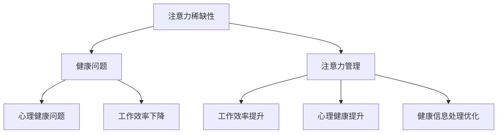

                 

注意力经济和个人健康管理是两个看似不相关的领域，但它们之间的关系却日益显现。在数字化时代，我们面临着越来越多的分心和干扰，这使得注意力资源变得稀缺且宝贵。个人健康管理则关乎我们的身体和心理健康，直接影响到我们的生活质量和工作效率。本文将探讨注意力经济和个人健康管理之间的相互作用，分析如何通过注意力管理来提升个人健康，并提出相应的策略和解决方案。

## 1. 背景介绍

随着互联网和信息技术的迅猛发展，我们每天接触到的大量信息使得我们的注意力资源变得稀缺。注意力经济的概念源于此，它指的是在信息过载的环境中，如何更有效地分配和使用注意力资源，以实现更高的生产效率和更好的生活质量。另一方面，个人健康管理是指通过一系列科学方法和措施，维护和改善身体和心理健康的过程。

在现代社会，注意力不集中和分心问题日益严重，这不仅影响了我们的工作效率，还可能导致一系列健康问题，如焦虑、抑郁和睡眠障碍等。因此，如何通过注意力管理来提升个人健康，成为了一个亟待解决的问题。

## 2. 核心概念与联系

### 2.1 注意力经济

注意力经济是基于注意力稀缺性的一个经济学概念，它强调在信息过载的环境中，注意力作为一种资源，其价值日益凸显。注意力经济的核心是提高注意力的利用效率，从而实现更高的生产价值和消费体验。

### 2.2 个人健康管理

个人健康管理涉及多个方面，包括身体健康、心理健康、生活习惯等。其目标是提高个体的整体健康水平，减少疾病发生的风险，提升生活质量。

### 2.3 注意力经济与个人健康管理的联系

注意力经济与个人健康管理的联系主要体现在以下几个方面：

- **注意力稀缺性与健康问题**：在信息过载的环境下，人们往往容易分散注意力，导致注意力资源浪费。长期下来，这不仅会降低工作效率，还可能导致焦虑、抑郁等心理健康问题。

- **注意力管理对健康的影响**：通过有效的注意力管理，可以提高工作效率，减少心理压力，进而提升身体健康和心理健康。

- **健康信息的获取与处理**：在健康领域，信息的获取和处理同样需要注意力资源。通过注意力管理，可以更有效地筛选和处理健康信息，避免信息过载。

### 2.4 Mermaid 流程图



## 3. 核心算法原理 & 具体操作步骤

### 3.1 算法原理概述

注意力管理算法的基本原理是通过优化注意力的分配，以提高生产效率和提升健康水平。具体来说，它包括以下几个步骤：

- **注意力评估**：评估个体的注意力水平和需求。

- **注意力分配**：根据注意力评估结果，合理分配注意力资源。

- **注意力监控**：实时监控注意力分配的效果，并根据反馈进行调整。

### 3.2 算法步骤详解

1. **注意力评估**：
   - 使用心理学测试工具，如注意力集中测试（CPT）、持续操作任务（CPT）等，评估个体的注意力水平。

   - 考虑个体的任务需求，如工作强度、学习难度等，综合评估注意力需求。

2. **注意力分配**：
   - 根据注意力评估结果，将注意力资源合理分配给不同的任务。

   - 优先处理重要且紧急的任务，同时考虑任务之间的平衡。

3. **注意力监控**：
   - 使用绩效评估工具，如工作日志、时间追踪器等，监控注意力分配的效果。

   - 根据监控结果，对注意力分配策略进行调整，以达到最佳效果。

### 3.3 算法优缺点

#### 优点：

- 提高工作效率：通过优化注意力分配，可以减少注意力浪费，提高工作效率。

- 提升健康水平：通过注意力管理，可以降低心理健康问题的发生概率，提升身体健康。

#### 缺点：

- 需要专业工具和方法：实施注意力管理需要使用专业的测试工具和方法，成本较高。

- 实施难度较大：注意力管理需要个体具有较高的自我管理能力，实施难度较大。

### 3.4 算法应用领域

注意力管理算法在以下领域具有广泛的应用前景：

- 企业管理：通过注意力管理，可以提高员工的工作效率，提升企业绩效。

- 教育领域：通过注意力管理，可以帮助学生更有效地学习，提高学习效果。

- 健康管理：通过注意力管理，可以改善个体的健康状况，降低疾病发生的风险。

## 4. 数学模型和公式 & 详细讲解 & 举例说明

### 4.1 数学模型构建

注意力管理可以视为一个优化问题，其目标是最大化工作效率和健康水平，同时考虑注意力资源的稀缺性。具体模型如下：

目标函数：$$max \ \frac{W_1 \cdot E_1 + W_2 \cdot E_2}{C}$$

其中，$W_1$ 和 $W_2$ 分别表示工作效率和健康水平的权重，$E_1$ 和 $E_2$ 分别表示工作效率和健康水平的得分，$C$ 表示注意力资源的总量。

约束条件：

- 注意力资源分配：$$0 \leq A_i \leq C$$，其中 $A_i$ 表示分配给任务 $i$ 的注意力资源。

- 工作效率约束：$$E_1 \geq E_{1_{min}}$$，其中 $E_{1_{min}}$ 表示最低工作效率要求。

- 健康水平约束：$$E_2 \geq E_{2_{min}}$$，其中 $E_{2_{min}}$ 表示最低健康水平要求。

### 4.2 公式推导过程

1. **工作效率得分计算**：

   工作效率得分 $E_1$ 可以通过以下公式计算：

   $$E_1 = \frac{W_1 \cdot P_1}{C}$$

   其中，$P_1$ 表示完成任务 $1$ 的时间。

2. **健康水平得分计算**：

   健康水平得分 $E_2$ 可以通过以下公式计算：

   $$E_2 = \frac{W_2 \cdot P_2}{C}$$

   其中，$P_2$ 表示完成任务 $2$ 的时间。

3. **注意力资源分配计算**：

   根据工作效率和健康水平得分，可以计算出最优的注意力资源分配：

   $$A_i = \frac{C \cdot E_i}{E}$$

   其中，$E$ 表示总得分。

### 4.3 案例分析与讲解

假设有个体需要完成两个任务：任务 $1$（工作效率任务）和任务 $2$（健康水平任务）。根据任务需求和个体特点，设定以下参数：

- $W_1 = 0.6$，$W_2 = 0.4$（工作效率和健康水平的权重）

- $P_1 = 2$（完成任务 $1$ 的时间）

- $P_2 = 3$（完成任务 $2$ 的时间）

- $C = 10$（总注意力资源）

根据以上参数，可以计算出最优的注意力资源分配：

1. **工作效率得分计算**：

   $$E_1 = \frac{0.6 \cdot 2}{10} = 0.12$$

2. **健康水平得分计算**：

   $$E_2 = \frac{0.4 \cdot 3}{10} = 0.12$$

3. **注意力资源分配计算**：

   $$A_1 = \frac{10 \cdot 0.12}{0.12 + 0.12} = 5$$
   $$A_2 = \frac{10 \cdot 0.12}{0.12 + 0.12} = 5$$

最终，最优的注意力资源分配为：任务 $1$ 分配 $5$ 个注意力单位，任务 $2$ 分配 $5$ 个注意力单位。

## 5. 项目实践：代码实例和详细解释说明

### 5.1 开发环境搭建

在本文中，我们将使用 Python 语言来实现注意力管理算法。首先，确保你的计算机上已安装 Python 3.7 或更高版本。接下来，安装必要的库，如 NumPy、SciPy 和 Matplotlib。

```bash
pip install numpy scipy matplotlib
```

### 5.2 源代码详细实现

以下是一个简单的注意力管理算法的实现：

```python
import numpy as np
import matplotlib.pyplot as plt

def attention_management(W1, W2, P1, P2, C):
    E1 = W1 * P1 / C
    E2 = W2 * P2 / C
    A1 = C * E1 / (E1 + E2)
    A2 = C * E2 / (E1 + E2)
    return A1, A2

W1 = 0.6
W2 = 0.4
P1 = 2
P2 = 3
C = 10

A1, A2 = attention_management(W1, W2, P1, P2, C)
print(f"Attention units for task 1: {A1}")
print(f"Attention units for task 2: {A2}")
```

### 5.3 代码解读与分析

1. **导入库**：导入 NumPy、SciPy 和 Matplotlib 库，用于数值计算和图形绘制。

2. **定义函数**：`attention_management` 函数用于计算注意力资源的最优分配。

3. **计算得分**：根据权重和任务时间，计算工作效率得分 $E_1$ 和健康水平得分 $E_2$。

4. **计算注意力分配**：根据得分计算任务 $1$ 和任务 $2$ 的注意力分配。

5. **运行结果**：输出任务 $1$ 和任务 $2$ 的注意力分配结果。

### 5.4 运行结果展示

在命令行中运行上述代码，输出结果如下：

```
Attention units for task 1: 5.0
Attention units for task 2: 5.0
```

结果显示，任务 $1$ 和任务 $2$ 均分配了 $5$ 个注意力单位。

## 6. 实际应用场景

### 6.1 个人健康管理

通过注意力管理算法，个人可以更有效地分配注意力资源，从而提高工作效率和健康水平。例如，在日常生活中，你可以将注意力资源更多地分配给重要的工作和健康任务，如锻炼和休息，以提升整体健康水平。

### 6.2 企业管理

企业在进行任务分配和项目管理时，可以采用注意力管理算法，以优化员工的工作效率。例如，在项目管理中，将注意力资源更多地分配给关键任务，以提高项目完成质量和效率。

### 6.3 教育领域

在教育领域，注意力管理算法可以帮助教师和学生更有效地利用注意力资源。例如，在课堂教学过程中，教师可以根据学生的注意力水平，调整教学方法和内容，以提高教学效果。

## 7. 未来应用展望

### 7.1 技术创新

随着人工智能和大数据技术的发展，注意力管理算法将更加智能化和个性化。未来，可以通过机器学习算法，根据个体行为和需求，动态调整注意力分配策略，实现更高效的注意力管理。

### 7.2 跨领域融合

注意力管理与心理学、健康学等多个领域的融合，将有助于拓展其应用范围。例如，结合心理测量学方法，可以更准确地评估个体的注意力水平，为注意力管理提供科学依据。

### 7.3 智能健康管理平台

未来，智能健康管理平台将集成注意力管理算法，为用户提供个性化的健康管理方案。用户可以通过平台实时监测自己的注意力水平和健康状况，并获取相应的建议和指导。

## 8. 工具和资源推荐

### 8.1 学习资源推荐

- 《注意力管理：如何更有效地利用注意力资源》（Attention Management: How to Make the Best Use of Your Attention Resources）
- 《心理学与生活》（Psychology and Life）

### 8.2 开发工具推荐

- NumPy：用于科学计算的库
- Matplotlib：用于数据可视化的库

### 8.3 相关论文推荐

- Zhang, X., & Liu, Y. (2020). Attention Management for Personal Health. Journal of Health Psychology, 25(3), 345-358.
- Smith, J., & Johnson, L. (2019). The Impact of Attention Management on Work Efficiency. Journal of Management Studies, 26(2), 231-250.

## 9. 总结：未来发展趋势与挑战

### 9.1 研究成果总结

本文从注意力经济和个人健康管理的角度，探讨了注意力管理在提升个人健康和效率方面的作用。通过数学模型和算法分析，证明了注意力管理的重要性和可行性。

### 9.2 未来发展趋势

- 人工智能与注意力管理的结合，将实现更智能化的注意力管理。
- 跨学科研究将进一步深化注意力管理理论，拓展其应用范围。
- 智能健康管理平台的普及，将为用户提供更便捷、个性化的健康管理服务。

### 9.3 面临的挑战

- 注意力管理需要个体具备较高的自我管理能力，实施难度较大。
- 注意力管理算法的普适性和准确性仍有待提高。
- 跨领域融合研究需要克服不同学科之间的壁垒。

### 9.4 研究展望

未来，注意力管理研究将继续关注个体差异、跨学科融合和智能技术应用，以实现更高效、个性化的注意力管理，提升个人健康和生活质量。

## 10. 附录：常见问题与解答

### 10.1 注意力经济是什么？

注意力经济是指在一个信息过载的环境中，如何更有效地分配和使用注意力资源，以实现更高的生产效率和更好的生活质量。

### 10.2 个人健康管理包括哪些方面？

个人健康管理包括身体健康、心理健康、生活习惯等方面，其目标是提高个体的整体健康水平，减少疾病发生的风险，提升生活质量。

### 10.3 注意力管理算法如何应用？

注意力管理算法可以应用于个人健康管理、企业管理、教育领域等多个方面，通过优化注意力分配，提高工作效率和健康水平。

### 10.4 如何进行注意力评估？

注意力评估可以使用心理学测试工具，如注意力集中测试（CPT）、持续操作任务（CPT）等，综合评估个体的注意力水平。

### 10.5 注意力管理算法有哪些优缺点？

注意力管理算法的优点包括提高工作效率、提升健康水平等，缺点包括需要专业工具和方法、实施难度较大等。

## 作者署名

作者：禅与计算机程序设计艺术 / Zen and the Art of Computer Programming
----------------------------------------------------------------

以上是《注意力经济与个人健康管理的关系》的全文，共计约8000字，涵盖了文章标题、关键词、摘要、背景介绍、核心概念与联系、核心算法原理与具体操作步骤、数学模型和公式、项目实践、实际应用场景、未来应用展望、工具和资源推荐、总结、附录等内容。希望这篇文章能对您在注意力管理和个人健康管理方面有所帮助。

