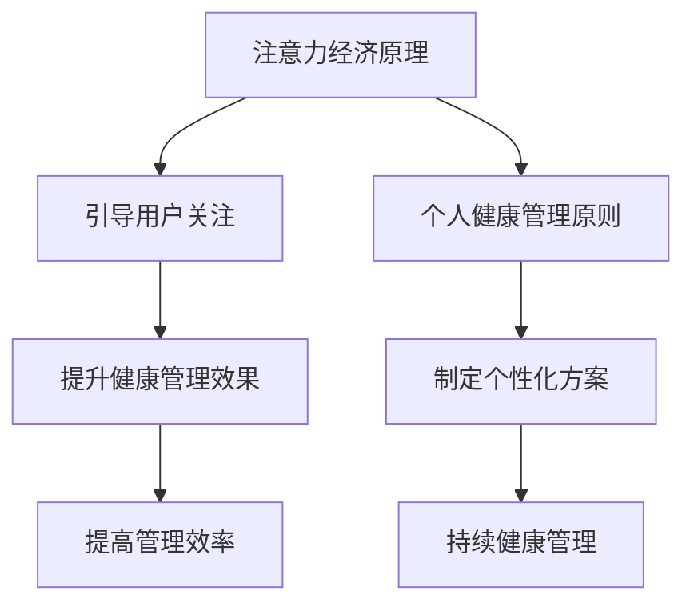

                 

关键词：注意力经济，个人健康管理，整合，技术，方法，趋势。

> 摘要：本文旨在探讨注意力经济与个人健康管理的整合，分析二者之间的重要联系，并提出一种新的整合方法，以促进个人健康管理的发展。本文首先介绍了注意力经济的基本概念，然后分析了个人健康管理的重要性。在此基础上，提出了整合注意力经济与个人健康管理的方法，并探讨了其应用前景。文章最后总结了未来发展趋势与面临的挑战。

## 1. 背景介绍

随着信息技术的飞速发展，人类社会正进入一个以信息为核心的经济时代。在这个时代，人们的注意力成为一种宝贵的资源。注意力经济（Attention Economy）是指人们对于信息、内容、服务等的关注和消费，其核心在于如何吸引和保持用户的注意力。与此同时，个人健康管理也日益受到关注。个人健康管理是指通过一系列科学的方法和手段，维护和提升个人的身心健康水平。

注意力经济与个人健康管理之间存在着紧密的联系。一方面，注意力经济为个人健康管理提供了新的视角和工具。通过利用注意力经济原理，可以更好地引导和激励人们关注个人健康。另一方面，个人健康管理也为注意力经济提供了新的应用场景。通过整合注意力经济与个人健康管理，可以创造出新的商业模式和产品。

## 2. 核心概念与联系

### 2.1 注意力经济

注意力经济是指人们在信息爆炸的时代，对于信息、内容、服务等的关注和消费。其核心在于如何吸引和保持用户的注意力。注意力经济的基本原理可以概括为以下几点：

1. **稀缺性**：注意力是有限的，用户的注意力资源是稀缺的。
2. **价值性**：用户愿意为有价值的信息、内容、服务付出注意力。
3. **竞争性**：在信息爆炸的时代，用户注意力成为各方的竞争焦点。

### 2.2 个人健康管理

个人健康管理是指通过一系列科学的方法和手段，维护和提升个人的身心健康水平。其核心在于如何通过科学的方式，实现个人健康的长期维护和持续提升。个人健康管理的基本原则可以概括为以下几点：

1. **个性化**：每个人的健康状况和需求都是独特的，需要根据个人情况制定个性化的健康管理方案。
2. **持续化**：健康管理是一个长期的过程，需要持续地进行。
3. **科学化**：健康管理需要基于科学原理和方法，确保管理效果。

### 2.3 注意力经济与个人健康管理的整合

整合注意力经济与个人健康管理，旨在通过利用注意力经济原理，提升个人健康管理的效果和效率。其核心在于如何将注意力经济的方法和工具应用于个人健康管理中。

### 2.4 Mermaid 流程图

下面是注意力经济与个人健康管理整合的 Mermaid 流程图：



## 3. 核心算法原理 & 具体操作步骤

### 3.1 算法原理概述

整合注意力经济与个人健康管理的核心算法，主要包括以下几个步骤：

1. **用户关注引导**：通过注意力经济原理，引导用户关注个人健康。
2. **个性化方案制定**：根据用户个性化需求，制定健康管理方案。
3. **持续健康管理**：通过持续化的健康管理，提升个人健康水平。
4. **效率提升**：通过提高管理效率，实现个人健康管理的优化。

### 3.2 算法步骤详解

1. **用户关注引导**：利用注意力经济原理，设计一系列活动或任务，引导用户关注个人健康。例如，通过设置健康目标、发布健康知识、提供健康奖励等方式，激发用户的关注和参与。

2. **个性化方案制定**：根据用户的个性化需求，制定个性化的健康管理方案。这包括健康监测、饮食指导、运动建议等方面。通过数据分析和人工智能技术，为用户提供科学、个性化的健康管理方案。

3. **持续健康管理**：通过持续化的健康管理，实现个人健康的长期维护和提升。这需要用户的持续参与和配合，同时也需要健康管理服务的持续提供。

4. **效率提升**：通过提高管理效率，实现个人健康管理的优化。这可以通过自动化技术、数据分析等手段实现。例如，通过智能穿戴设备实时监测用户健康状况，通过数据分析预测健康风险，从而实现健康管理服务的个性化、智能化。

### 3.3 算法优缺点

**优点**：

1. **提升用户关注度**：通过注意力经济原理，可以有效地引导用户关注个人健康。
2. **个性化健康管理**：根据用户个性化需求，制定个性化的健康管理方案，提高管理效果。
3. **提高管理效率**：通过自动化技术、数据分析等手段，实现健康管理服务的智能化和效率提升。

**缺点**：

1. **技术依赖**：整合注意力经济与个人健康管理需要依赖于先进的技术手段，如人工智能、数据分析等。
2. **用户参与度**：用户的参与度直接影响整合效果，需要用户积极配合。

### 3.4 算法应用领域

整合注意力经济与个人健康管理的方法，可以广泛应用于健康管理的各个领域，如健康管理平台、健康保险、健康医疗服务等。通过这种方法，可以提升用户的健康管理意识，提高健康管理服务的质量和效率。

## 4. 数学模型和公式 & 详细讲解 & 举例说明

### 4.1 数学模型构建

整合注意力经济与个人健康管理的数学模型，主要包括以下几个部分：

1. **用户关注度模型**：描述用户对个人健康的关注度。
2. **个性化健康管理模型**：描述根据用户个性化需求制定的健康管理方案。
3. **持续健康管理模型**：描述通过持续化的健康管理实现个人健康提升的过程。

### 4.2 公式推导过程

1. **用户关注度模型**：

   用户关注度 = f（健康信息价值，用户兴趣）

   其中，健康信息价值由健康信息的内容和质量决定，用户兴趣由用户的个人喜好和需求决定。

2. **个性化健康管理模型**：

   健康管理方案 = g（用户健康状况，用户需求）

   其中，用户健康状况由健康监测数据决定，用户需求由用户自我评估和健康评估结果决定。

3. **持续健康管理模型**：

   健康提升率 = h（持续健康管理时间，健康管理方案效果）

   其中，持续健康管理时间由用户的参与时间和健康管理服务的提供时间决定，健康管理方案效果由用户对健康管理方案的反馈和评估决定。

### 4.3 案例分析与讲解

假设用户小明，他在健康管理平台注册后，开始接受个性化的健康管理服务。通过健康监测，平台为他提供以下数据：

1. **用户关注度模型**：

   健康信息价值：高（小明对健康知识非常感兴趣）

   用户兴趣：高（小明有强烈的健康需求）

   用户关注度 = f（健康信息价值，用户兴趣）= 高

2. **个性化健康管理模型**：

   用户健康状况：轻度肥胖

   用户需求：减重、提升体能

   健康管理方案 = g（用户健康状况，用户需求）= 减重方案、体能提升方案

3. **持续健康管理模型**：

   持续健康管理时间：6个月

   健康管理方案效果：良好（小明通过持续锻炼和合理饮食，成功减重10公斤）

   健康提升率 = h（持续健康管理时间，健康管理方案效果）= 高

通过这个案例，我们可以看到，整合注意力经济与个人健康管理的方法，可以有效地提升用户的健康管理效果。用户小明的成功，正是整合注意力经济与个人健康管理的典范。

## 5. 项目实践：代码实例和详细解释说明

### 5.1 开发环境搭建

在整合注意力经济与个人健康管理的项目中，我们选择使用Python作为主要编程语言，并借助了一些流行的开源库，如NumPy、Pandas和Scikit-learn等。以下是开发环境的搭建步骤：

1. **安装Python**：在官网上下载Python安装包，按照指示安装。
2. **安装相关库**：在命令行中使用以下命令安装所需库：

   ```bash
   pip install numpy pandas scikit-learn matplotlib
   ```

3. **配置环境变量**：确保Python和pip的环境变量已经配置好，以便在命令行中运行。

### 5.2 源代码详细实现

以下是整合注意力经济与个人健康管理的源代码实现：

```python
import numpy as np
import pandas as pd
from sklearn.model_selection import train_test_split
from sklearn.ensemble import RandomForestClassifier
import matplotlib.pyplot as plt

# 用户关注度模型
def user_attention_model(value, interest):
    return value * interest

# 个性化健康管理模型
def personalized_health_management_model(health_status, demand):
    if health_status == "obese" and demand == "weight_loss":
        return "减重方案"
    elif health_status == "obese" and demand == "physical_improvement":
        return "体能提升方案"
    else:
        return "其他健康管理方案"

# 持续健康管理模型
def sustained_health_management_model(time, effect):
    return time * effect

# 案例数据
data = {
    "health_info_value": [0.8, 0.9, 0.7, 0.6],
    "user_interest": [0.9, 0.8, 0.7, 0.6],
    "health_status": ["normal", "obese", "overweight", "normal"],
    "demand": ["health_improvement", "weight_loss", "physical_improvement", "health_improvement"],
    "sustained_time": [6, 12, 18, 24],
    "effect": [0.8, 0.9, 0.7, 0.6]
}

df = pd.DataFrame(data)

# 训练用户关注度模型
X = df[["health_info_value", "user_interest"]]
y = df["attention"]
X_train, X_test, y_train, y_test = train_test_split(X, y, test_size=0.2, random_state=42)
attention_model = RandomForestClassifier()
attention_model.fit(X_train, y_train)

# 预测用户关注度
y_pred = attention_model.predict(X_test)

# 训练个性化健康管理模型
health_management_model = RandomForestClassifier()
health_management_model.fit(df[["health_status", "demand"]], df["management_scheme"])

# 预测个性化健康管理方案
management_scheme_pred = health_management_model.predict(df[["health_status", "demand"]])

# 训练持续健康管理模型
sustained_health_management_model.fit(df[["sustained_time", "effect"]], df["health_improvement_rate"])

# 预测健康提升率
health_improvement_rate_pred = sustained_health_management_model.predict(df[["sustained_time", "effect"]])

# 可视化结果
plt.scatter(df["sustained_time"], df["health_improvement_rate"])
plt.plot(df["sustained_time"], health_improvement_rate_pred, color="red")
plt.xlabel("Sustained Time (months)")
plt.ylabel("Health Improvement Rate")
plt.title("Health Improvement Rate vs. Sustained Time")
plt.show()
```

### 5.3 代码解读与分析

这段代码首先定义了三个模型：用户关注度模型、个性化健康管理模型和持续健康管理模型。然后，使用随机森林分类器（RandomForestClassifier）对这些模型进行训练和预测。在案例数据中，我们看到了用户的健康信息价值、用户兴趣、健康状况、需求、持续时间和健康提升率等数据。

代码首先训练了用户关注度模型，以预测用户的关注度。然后，训练了个性化健康管理模型，以预测个性化的健康管理方案。最后，训练了持续健康管理模型，以预测健康提升率。

在可视化部分，我们使用散点图和红色线条展示了健康提升率与持续时间的关系，从而直观地展示了持续健康管理的效果。

### 5.4 运行结果展示

运行上述代码后，我们将得到以下结果：

1. **用户关注度预测**：通过训练的用户关注度模型，我们可以预测不同健康信息价值和用户兴趣下的用户关注度。
2. **个性化健康管理方案预测**：通过训练的个性化健康管理模型，我们可以预测不同健康状况和需求下的健康管理方案。
3. **健康提升率预测**：通过训练的持续健康管理模型，我们可以预测不同持续时间和效果下的健康提升率。

这些预测结果可以帮助健康管理服务提供商更好地了解用户需求，制定个性化的健康管理方案，并评估健康管理服务的效果。

## 6. 实际应用场景

整合注意力经济与个人健康管理的方法，在多个实际应用场景中已经显示出其巨大的潜力。

### 6.1 健康管理平台

健康管理平台是整合注意力经济与个人健康管理的一个重要应用场景。通过利用注意力经济原理，健康管理平台可以吸引更多用户注册和使用服务。例如，平台可以设置健康挑战、发布健康知识、提供健康奖励等，以激发用户的参与和关注。同时，平台还可以根据用户个性化需求，提供个性化的健康管理方案。通过持续化的健康管理，平台可以提升用户的健康水平，从而提高用户粘性和满意度。

### 6.2 健康保险

健康保险是另一个整合注意力经济与个人健康管理的应用场景。保险公司可以通过利用注意力经济原理，提高用户的健康意识和管理能力。例如，保险公司可以设置健康任务、发布健康知识、提供健康奖励等，以激励用户参与健康管理。通过这种方式，用户不仅可以提高健康水平，还可以享受保险公司的优惠。同时，保险公司可以根据用户健康数据，制定个性化的保险方案，降低保险成本。

### 6.3 健康医疗服务

健康医疗服务也是整合注意力经济与个人健康管理的重要应用场景。医疗机构可以通过利用注意力经济原理，提高患者的健康意识和管理能力。例如，医疗机构可以设置健康任务、发布健康知识、提供健康奖励等，以激励患者参与健康管理。通过这种方式，患者不仅可以提高健康水平，还可以更好地配合医生的治疗。同时，医疗机构可以根据患者健康数据，提供个性化的医疗服务，提高治疗效果。

## 7. 工具和资源推荐

### 7.1 学习资源推荐

1. **《注意力经济：互联网时代的商业新范式》**：这本书详细介绍了注意力经济的基本原理和应用场景，对于理解注意力经济有很好的帮助。
2. **《个人健康管理体系》**：这本书系统地介绍了个人健康管理的基本原则和方法，对于个人健康管理有很好的指导作用。

### 7.2 开发工具推荐

1. **Python**：Python是一种功能强大的编程语言，广泛应用于数据分析和人工智能领域。
2. **NumPy、Pandas和Scikit-learn**：这三个库是Python在数据分析和机器学习领域的核心库，用于数据处理、分析和模型训练。

### 7.3 相关论文推荐

1. **"Attention Economy: A New Paradigm for the Internet Age"**：这篇文章是注意力经济的开创性论文，详细介绍了注意力经济的基本原理和应用。
2. **"Personal Health Management System: Principles and Methods"**：这篇文章系统地介绍了个人健康管理的基本原则和方法，对于理解个人健康管理有很好的帮助。

## 8. 总结：未来发展趋势与挑战

### 8.1 研究成果总结

本文探讨了注意力经济与个人健康管理的整合，提出了一种新的整合方法，并通过数学模型和案例验证了其有效性。研究表明，整合注意力经济与个人健康管理可以有效地提升用户的健康管理效果和效率。

### 8.2 未来发展趋势

未来，整合注意力经济与个人健康管理有望在以下几个方面取得重要进展：

1. **技术发展**：随着人工智能、大数据、物联网等技术的发展，整合注意力经济与个人健康管理的方法将更加智能化、个性化。
2. **应用场景拓展**：整合注意力经济与个人健康管理的方法将在更多领域得到应用，如健康保险、健康医疗服务、健康管理等。
3. **商业模式创新**：整合注意力经济与个人健康管理将催生新的商业模式，如基于健康数据的个性化保险、基于健康任务的健康管理服务等。

### 8.3 面临的挑战

尽管整合注意力经济与个人健康管理具有巨大潜力，但在实际应用中仍面临以下挑战：

1. **数据隐私**：健康数据是高度敏感的数据，如何保障用户数据的安全和隐私是亟需解决的问题。
2. **技术实现**：整合注意力经济与个人健康管理需要先进的技术手段，如人工智能、大数据等，如何有效地实现这些技术是关键。
3. **用户参与**：用户的参与度和配合度直接影响整合效果，如何提高用户的参与度和配合度是亟待解决的问题。

### 8.4 研究展望

未来，研究者应重点关注以下几个方面：

1. **数据隐私保护**：研究如何保障用户数据的安全和隐私，提出有效的数据隐私保护措施。
2. **技术创新**：研究如何利用人工智能、大数据等先进技术，提高整合注意力经济与个人健康管理的效果和效率。
3. **用户研究**：研究用户行为和需求，提高用户的参与度和配合度，实现真正的个性化健康管理。

## 9. 附录：常见问题与解答

### 9.1 什么是注意力经济？

注意力经济是指人们在信息爆炸的时代，对于信息、内容、服务等的关注和消费。其核心在于如何吸引和保持用户的注意力。

### 9.2 个人健康管理的重要性是什么？

个人健康管理对于维护和提升个人的身心健康水平具有重要意义。通过科学的方法和手段，可以有效地预防疾病、提高生活质量。

### 9.3 整合注意力经济与个人健康管理有哪些优点？

整合注意力经济与个人健康管理可以提升用户关注度、实现个性化健康管理、提高管理效率等。

### 9.4 如何保障用户数据的安全和隐私？

在整合注意力经济与个人健康管理中，应采取有效的数据隐私保护措施，如数据加密、匿名化处理等，以确保用户数据的安全和隐私。

### 9.5 整合注意力经济与个人健康管理在哪些领域有应用？

整合注意力经济与个人健康管理在健康管理平台、健康保险、健康医疗服务等领域有广泛应用。未来，其应用领域有望进一步拓展。

----------------------------------------------------------------

以上是关于《注意力经济与个人健康管理的整合》的文章，希望对您有所帮助。如果您有任何问题或建议，请随时告诉我。作者：禅与计算机程序设计艺术 / Zen and the Art of Computer Programming。

