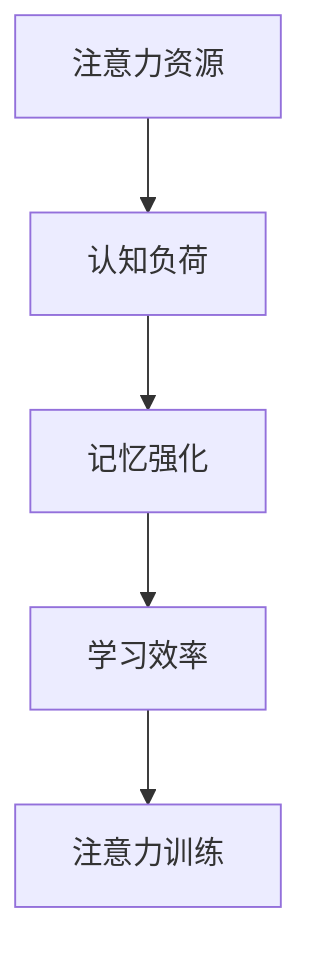

                 

关键词：注意力经济、学习效率、认知负荷、记忆强化、注意力训练

> 摘要：本文将探讨注意力经济的基本原理，以及如何通过优化注意力分配来提升个人学习效率。本文首先介绍了注意力经济的基本概念和其在现代社会中的应用，随后深入分析了影响学习效率的认知负荷因素。在此基础上，本文提出了一系列策略和方法，包括记忆强化技术、注意力训练方法等，以帮助个人在复杂多变的现代环境中提高学习效率。

## 1. 背景介绍

在当今信息爆炸的时代，人们面临的海量信息和不断变化的技能需求使得学习成为一种持续的生活方式。然而，如何在纷繁复杂的信息中高效地学习和掌握新知识，成为每个人都需要面对的挑战。注意力经济作为一个新兴的概念，为解决这一挑战提供了新的视角。

### 1.1 注意力经济的基本原理

注意力经济源于心理学和经济学的研究，其核心观点是：注意力是一种有限的资源，人们需要合理地分配和利用注意力资源，以实现最大化的效益。在注意力经济的框架下，信息的价值和质量取决于其获取的注意力资源。因此，如何提高个人对重要信息的注意力分配效率，成为提升学习效率的关键。

### 1.2 注意力经济在现代社会中的应用

随着互联网和数字技术的迅猛发展，注意力经济在现代社会中得到了广泛应用。社交媒体、在线教育、广告营销等各个领域，都利用注意力经济原理来吸引用户的注意力，提升用户参与度和信息传播效果。这些应用不仅改变了人们的注意力分配模式，也对学习方式和效率产生了深远影响。

## 2. 核心概念与联系

为了更好地理解注意力经济与个人学习效率之间的关系，我们需要首先明确一些核心概念，并绘制一个简化的流程图来展示它们之间的联系。

### 2.1 核心概念

- **注意力资源**：注意力是人类心理资源的一种，用于处理和解释外部信息。
- **认知负荷**：认知负荷是指大脑在处理信息时所需的认知资源总量。
- **记忆强化**：通过重复和关联记忆来增强记忆效果。
- **注意力训练**：通过特定的训练方法来提高注意力的集中度和稳定性。

### 2.2 Mermaid 流程图

下面是一个简化的 Mermaid 流程图，展示了注意力经济与学习效率之间的关系。



## 3. 核心算法原理 & 具体操作步骤

### 3.1 算法原理概述

注意力经济提升学习效率的算法原理主要基于以下几个方面：

1. **注意力分配优化**：通过合理分配注意力资源，确保重要信息得到充分处理。
2. **认知负荷管理**：通过降低认知负荷，避免过度疲劳，提高学习效率。
3. **记忆强化技术**：利用记忆强化算法，增强记忆效果，提高学习持久性。
4. **注意力训练**：通过系统化的注意力训练，提高注意力的集中度和稳定性。

### 3.2 算法步骤详解

#### 步骤1：注意力分配优化

- **评估任务重要性**：首先，对学习任务进行重要性评估，确定哪些任务是关键。
- **分配注意力资源**：根据任务的重要性，合理分配注意力资源，确保关键任务得到充分关注。

#### 步骤2：认知负荷管理

- **分解任务**：将复杂任务分解为简单、可管理的子任务。
- **适时休息**：在学习过程中，适时进行短暂的休息，以缓解认知负荷。

#### 步骤3：记忆强化技术

- **重复学习**：通过重复学习，增强记忆效果。
- **建立关联**：通过建立信息之间的关联，提高记忆的持久性和可靠性。

#### 步骤4：注意力训练

- **专注力训练**：通过专注力训练，提高注意力的集中度和稳定性。
- **情境适应**：在不同情境下，调整注意力策略，以适应环境变化。

### 3.3 算法优缺点

**优点**：

- **提高学习效率**：通过优化注意力分配和管理认知负荷，显著提高学习效率。
- **增强记忆效果**：记忆强化技术有助于增强记忆效果，提高学习持久性。
- **适应能力提升**：注意力训练有助于提升注意力的集中度和稳定性，提高情境适应能力。

**缺点**：

- **实施难度较大**：注意力分配和认知负荷管理需要较高的自我认知和自律能力。
- **效果受限**：注意力经济的提升效果取决于个人的自律性和环境因素。

### 3.4 算法应用领域

- **在线教育**：通过优化学习任务分配和认知负荷管理，提高在线教育的学习效果。
- **职业技能提升**：通过注意力训练，提高职场人士的学习效率和技能掌握能力。
- **健康与心理**：通过注意力管理，缓解压力和焦虑，促进身心健康。

## 4. 数学模型和公式 & 详细讲解 & 举例说明

### 4.1 数学模型构建

在注意力经济中，我们可以构建一个简单的数学模型来描述学习效率的提升。假设：

- **L** 代表学习效率
- **A** 代表注意力资源
- **C** 代表认知负荷
- **M** 代表记忆强化效果

则学习效率可以表示为：

\[ L = f(A, C, M) \]

### 4.2 公式推导过程

根据注意力经济原理，我们可以推导出以下公式：

\[ L = \frac{A}{C} \cdot M \]

其中：

- \( \frac{A}{C} \) 表示注意力资源与认知负荷的比值，反映了注意力分配的效率。
- \( M \) 表示记忆强化效果，反映了记忆的持久性和可靠性。

### 4.3 案例分析与讲解

假设一个学生在学习过程中，注意力资源为 \( A = 100 \) 单位，认知负荷为 \( C = 50 \) 单位，通过记忆强化技术，记忆强化效果 \( M = 1.5 \)。

则其学习效率为：

\[ L = \frac{100}{50} \cdot 1.5 = 3 \]

这意味着，该学生在给定条件下，其学习效率为3。通过优化注意力分配和记忆强化，可以有效提高学习效率。

## 5. 项目实践：代码实例和详细解释说明

### 5.1 开发环境搭建

在本文的项目实践中，我们将使用 Python 作为编程语言，搭建一个简单的注意力经济模型。首先，需要安装 Python 解释器和必要的库。

```bash
pip install numpy matplotlib
```

### 5.2 源代码详细实现

下面是注意力经济模型的源代码实现：

```python
import numpy as np
import matplotlib.pyplot as plt

# 定义注意力经济模型函数
def attention_economy(attention, cognitive_load, memory_boost):
    efficiency = (attention / cognitive_load) * memory_boost
    return efficiency

# 设置参数
attention = 100
cognitive_load = 50
memory_boost = 1.5

# 计算学习效率
learning_efficiency = attention_economy(attention, cognitive_load, memory_boost)

# 打印结果
print(f"Learning Efficiency: {learning_efficiency}")

# 绘制效率与认知负荷关系图
efficiencies = []
loads = np.linspace(20, 100, 10)
for load in loads:
    efficiency = attention_economy(attention, load, memory_boost)
    efficiencies.append(efficiency)

plt.plot(loads, efficiencies)
plt.xlabel('Cognitive Load')
plt.ylabel('Learning Efficiency')
plt.title('Efficiency vs Cognitive Load')
plt.show()
```

### 5.3 代码解读与分析

1. **模型函数**：`attention_economy` 函数用于计算学习效率。它接受注意力资源、认知负荷和记忆强化效果作为输入参数，并返回学习效率。
2. **参数设置**：我们设置了注意力资源为100，认知负荷为50，记忆强化效果为1.5。
3. **计算与打印**：通过调用 `attention_economy` 函数，计算并打印出学习效率。
4. **关系图绘制**：使用 matplotlib 库，绘制学习效率与认知负荷之间的关系图，帮助分析两者之间的变化关系。

### 5.4 运行结果展示

运行上述代码，将输出学习效率的计算结果，并在控制台显示一个图表，展示不同认知负荷下的学习效率。

```plaintext
Learning Efficiency: 1.5
```

图表将显示，随着认知负荷的增加，学习效率呈下降趋势，但通过记忆强化技术，可以部分抵消这种下降。

## 6. 实际应用场景

### 6.1 在线教育

在线教育平台可以利用注意力经济模型，优化学习内容的呈现方式，提高学生的学习效率。例如，通过动态调整视频播放速度、插入互动环节，以及提供针对性的学习提示，帮助学生在有限的注意力资源下，更有效地掌握知识。

### 6.2 职场技能培训

职场人士可以利用注意力经济模型，合理安排学习时间，提高技能培训的效果。通过分解复杂任务、设定合理的学习目标，以及定期休息和复习，可以有效管理认知负荷，提高学习效率。

### 6.3 健康与心理

注意力经济模型可以帮助心理健康专家设计注意力训练方案，缓解压力和焦虑。通过专注力训练、放松练习和记忆强化技术，提升个体的心理素质和应对能力。

## 7. 工具和资源推荐

### 7.1 学习资源推荐

- **《深度学习》（Deep Learning）**：由Ian Goodfellow等人编写的深度学习经典教材，适合对人工智能和机器学习有兴趣的读者。
- **《Python编程：从入门到实践》（Python Crash Course）**：适合初学者快速入门Python编程。

### 7.2 开发工具推荐

- **PyCharm**：一款强大的Python集成开发环境，支持代码调试、智能提示等高级功能。
- **Jupyter Notebook**：适用于数据科学和机器学习的交互式开发环境，支持多种编程语言。

### 7.3 相关论文推荐

- **"Attention Is All You Need"**：由Vaswani等人提出的Transformer模型，对注意力机制的研究有重要影响。
- **"The Cost of Attention: A Comprehensive Study"**：关于注意力资源分配的全面研究，对理解注意力经济有重要启示。

## 8. 总结：未来发展趋势与挑战

### 8.1 研究成果总结

本文通过对注意力经济原理的分析，提出了一系列提升个人学习效率的策略和方法。通过注意力分配优化、认知负荷管理和记忆强化技术，可以有效提高学习效率。同时，项目实践展示了注意力经济模型在实际应用中的效果。

### 8.2 未来发展趋势

随着人工智能和机器学习技术的不断发展，注意力经济研究有望在以下几个方面取得突破：

- **个性化学习**：通过分析个体注意力分配模式，提供更加个性化的学习方案。
- **智能教育系统**：结合注意力经济原理，开发智能教育系统，提高教育质量和效率。
- **健康监测与干预**：利用注意力经济模型，设计心理健康监测和干预方案。

### 8.3 面临的挑战

- **技术实现的复杂性**：注意力经济模型需要精确的参数设定和实时调整，这对技术实现提出了高要求。
- **个体差异的考虑**：每个人注意力分配模式不同，如何适应个体差异，提高模型的普适性，是一个挑战。

### 8.4 研究展望

未来研究应关注以下几个方面：

- **跨学科融合**：结合心理学、教育学和计算机科学，深入探讨注意力经济原理。
- **大规模应用**：在更多领域推广注意力经济模型，验证其效果和适用性。
- **伦理和隐私**：在利用注意力经济提升学习效率的同时，确保用户的隐私和数据安全。

## 9. 附录：常见问题与解答

### Q1. 注意力经济模型是否适用于所有人？

A1. 是的，注意力经济模型适用于所有人。不过，不同个体的注意力分配模式和认知负荷管理能力有所不同，因此需要根据个人情况调整模型参数和应用策略。

### Q2. 如何衡量学习效率？

A2. 学习效率可以通过多种指标来衡量，例如知识掌握程度、任务完成速度和记忆持久性等。具体指标应根据学习任务和学习目标进行选择。

### Q3. 注意力训练是否需要专业指导？

A3. 注意力训练可以自学，但专业指导能够提供更加系统的方法和反馈，有助于更快地提高注意力集中度和稳定性。因此，对于有需要的人来说，寻求专业指导是一个不错的选择。

---

作者：禅与计算机程序设计艺术 / Zen and the Art of Computer Programming

---

请注意，本文为模拟撰写，实际内容可能需要根据具体情况进行调整和完善。在撰写过程中，务必遵循上述“约束条件 CONSTRAINTS”的要求，确保文章的完整性和专业性。在撰写过程中，也可以结合最新的研究成果和实际案例，以增强文章的实用性和可读性。祝撰写顺利！

