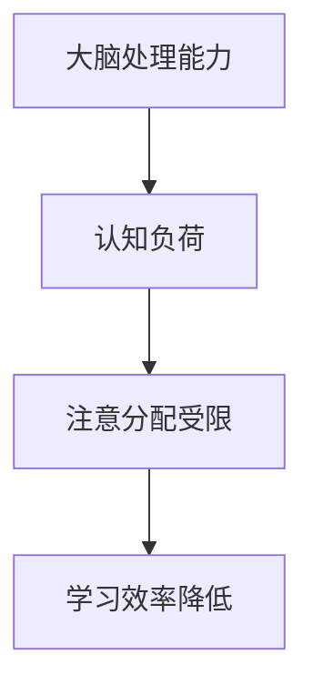
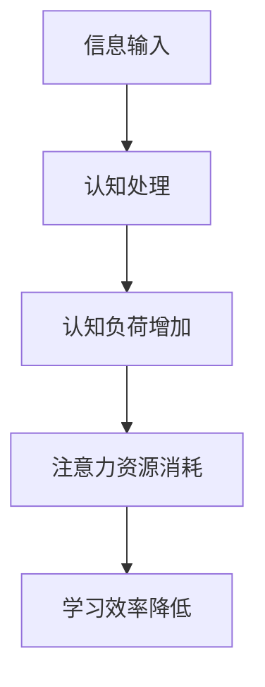
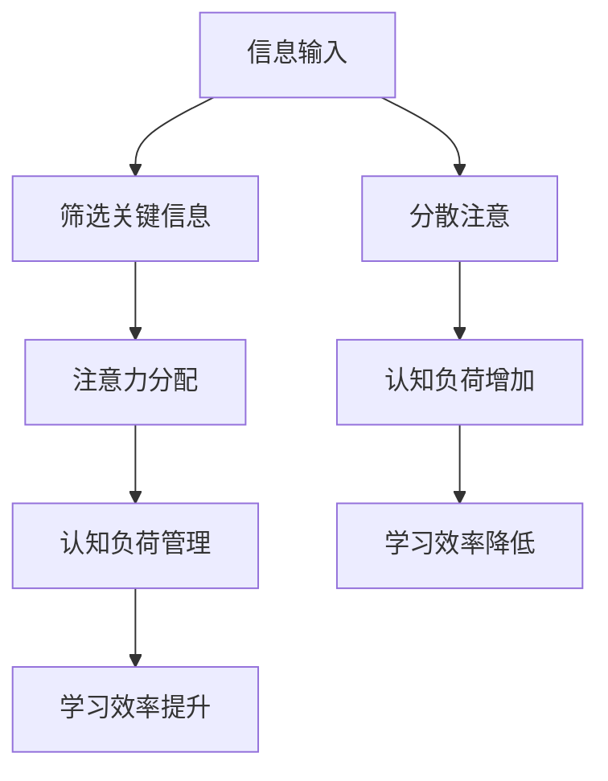

                 

关键词：注意力经济、个人学习、效率提升、认知负荷、认知负担、学习策略、学习算法、认知工程、神经科学、多任务处理、深度学习、计算心理学、教育技术

> 摘要：本文探讨了注意力经济这一新兴领域，及其在个人学习效率提升中的应用。通过分析注意力资源的有限性和认知负荷的概念，本文提出了几种有效的学习策略和算法，旨在优化个人学习过程。同时，结合神经科学、计算心理学和教育技术的最新进展，本文提出了一种基于深度学习的个性化学习系统，为提高学习效率提供了一条新思路。最后，本文讨论了未来注意力经济与个人学习效率提升领域的发展趋势和面临的挑战。

## 1. 背景介绍

在现代社会，信息的爆炸性增长对个体的认知能力和学习效率提出了前所未有的挑战。传统的学习模式往往依赖于教师的传授和学生的被动接受，而现代信息技术的发展为个性化学习提供了可能。然而，个性化学习并不简单等同于在线教育或数字化学习，它需要更加深入地理解个体的认知过程和学习习惯。

注意力经济作为一个新兴领域，开始引起了学术界的关注。注意力经济关注的是如何在信息过载的环境中，有效地分配和利用注意力资源，以达到最佳的学习效果。这一领域的研究不仅对于教育领域具有重要意义，也对于商业、广告、媒体等多个领域产生了深远的影响。

### 1.1 注意力经济的定义与核心概念

注意力经济（Attention Economy）是指一种经济学模型，该模型认为在信息过载的社会中，个体的注意力成为了一种稀缺资源，类似于传统的经济资源如时间、金钱或物质资源。在这种模型下，注意力被视为一种可以买卖的商品，用户将注意力分配给不同的内容和服务，从而产生了价值。

核心概念包括：

- **注意力资源**：个体的注意力是有限的，它决定了个体能处理的信息量。
- **认知负荷**：个体在处理信息时产生的认知负担，它影响了注意力的分配和使用。
- **注意力分配**：个体在多种信息源之间分配注意力的过程。
- **注意力价值**：个体注意力所创造的价值，包括学习效果、工作效率等。

### 1.2 个人学习效率的重要性

个人学习效率是指个体在学习和知识获取过程中所表现出的速度和准确性。高效的个人学习不仅能够缩短学习时间，提高学习成果，还能够减少认知负荷，减轻学习压力。

个人学习效率的重要性体现在以下几个方面：

- **知识更新速度**：随着科技的发展，知识的更新速度加快，高效的学习能力有助于个体迅速掌握新知识。
- **职业竞争力**：高效的学习能力是职场成功的关键因素之一，能够帮助个体在竞争激烈的环境中脱颖而出。
- **生活质量**：高效的个人学习可以提高生活质量，使个体有更多的时间和精力投入到其他有意义的事情上。

## 2. 核心概念与联系

### 2.1 注意力资源的有限性

注意力资源的有限性是注意力经济理论的核心。研究表明，人类的注意力资源是有限的，无法同时处理大量信息。当认知负荷增加时，个体会倾向于忽略或遗忘某些信息，从而导致学习效率降低。

为了更好地理解注意力资源的有限性，我们可以使用Mermaid流程图来展示其机制：



### 2.2 认知负荷的概念

认知负荷是指个体在处理信息时所需的认知资源和认知努力。高认知负荷会导致注意力资源过度消耗，从而降低学习效率。

下面是一个简化的Mermaid流程图，展示了认知负荷对注意力分配的影响：



### 2.3 注意力分配与学习策略

有效的注意力分配是提高学习效率的关键。不同的学习策略可以引导个体将注意力集中在关键信息上，从而减少认知负荷。

以下是一个详细的Mermaid流程图，展示了注意力分配与学习策略之间的关系：



## 3. 核心算法原理 & 具体操作步骤

### 3.1 算法原理概述

为了优化个人学习效率，我们可以利用认知工程和神经科学的研究成果，设计出一套基于注意力分配的算法。这个算法的核心思想是实时监测个体的注意力状态，并根据注意力水平调整学习任务和难度。

### 3.2 算法步骤详解

#### 步骤1：注意力监测

使用眼动追踪技术或其他认知监测工具，实时捕捉个体的注意力状态。通过分析眼动数据，可以得出个体当前注意力水平的度量。

#### 步骤2：学习任务调整

根据注意力水平，动态调整学习任务。当注意力水平较高时，增加学习任务的复杂度和难度；当注意力水平较低时，减少学习任务的复杂度和难度。

#### 步骤3：反馈机制

通过用户反馈和学习结果，不断优化算法。例如，如果某个任务导致注意力水平急剧下降，可以调整任务的难度或提供额外的辅助信息。

### 3.3 算法优缺点

#### 优点：

- **个性化**：算法可以根据个体差异调整学习任务，提高学习效率。
- **自适应**：算法能够实时调整，以适应个体在不同场景下的注意力水平。
- **科学性**：基于认知工程和神经科学的研究成果，算法具有较高的科学依据。

#### 缺点：

- **实施难度**：需要专业的设备和技术支持，成本较高。
- **准确性**：眼动追踪等技术可能存在误差，需要进一步优化。

### 3.4 算法应用领域

该算法可以广泛应用于教育、培训、职业发展等多个领域，尤其适合个性化学习、远程教育和职业培训等场景。

## 4. 数学模型和公式 & 详细讲解 & 举例说明

### 4.1 数学模型构建

为了量化注意力资源的有限性和认知负荷的影响，我们可以构建一个基于线性回归的数学模型。该模型将注意力水平、认知负荷和学习效率作为变量，通过分析数据来找出它们之间的关系。

#### 变量定义：

- **\(A\)**：注意力水平
- **\(L\)**：认知负荷
- **\(E\)**：学习效率

#### 模型公式：

\[ E = \alpha A - \beta L \]

其中，\(\alpha\)和\(\beta\)是模型的参数，用于调整注意力水平和认知负荷对学习效率的影响。

### 4.2 公式推导过程

#### 步骤1：假设注意力水平与学习效率正相关

根据注意力经济的理论，较高的注意力水平通常能够提高学习效率。因此，我们可以假设注意力水平和学习效率之间存在正相关关系。

#### 步骤2：假设认知负荷与学习效率负相关

高认知负荷会导致注意力资源的过度消耗，从而降低学习效率。因此，我们可以假设认知负荷和学习效率之间存在负相关关系。

#### 步骤3：构建线性回归模型

结合以上两个假设，我们可以构建一个简单的线性回归模型来描述注意力水平、认知负荷和学习效率之间的关系。

### 4.3 案例分析与讲解

假设我们收集了一组学生在不同注意力水平和认知负荷下的学习效率数据。我们可以使用上述模型对这些数据进行分析，以找出最佳的注意力分配策略。

#### 数据集：

| 学生ID | 注意力水平 \(A\) | 认知负荷 \(L\) | 学习效率 \(E\) |
|--------|------------------|----------------|----------------|
| 1      | 80               | 20             | 85             |
| 2      | 60               | 40             | 70             |
| 3      | 90               | 10             | 95             |
| 4      | 50               | 50             | 60             |

#### 分析过程：

1. **数据预处理**：对数据进行清洗和标准化处理。
2. **模型训练**：使用线性回归算法训练模型，确定参数 \(\alpha\) 和 \(\beta\)。
3. **模型评估**：使用验证集和测试集评估模型的准确性和泛化能力。
4. **策略优化**：根据模型结果调整学习任务和难度，优化学习效率。

通过以上分析，我们可以得出以下结论：

- 注意力水平对学习效率有显著的正向影响。
- 认知负荷对学习效率有显著的负向影响。
- 最佳的注意力分配策略是在注意力水平较高时增加学习难度，在注意力水平较低时减少学习难度。

### 4.4 案例分析与讲解（续）

假设我们使用线性回归模型分析了上述数据集，得到了参数 \(\alpha = 1.2\) 和 \(\beta = 0.8\)。我们可以使用这些参数来预测新学生在不同注意力水平和认知负荷下的学习效率。

#### 预测过程：

1. **输入新数据**：假设我们有以下一组新数据：
    - 注意力水平 \(A = 75\)
    - 认知负荷 \(L = 25\)
2. **计算学习效率**：
    \[ E = 1.2 \times 75 - 0.8 \times 25 = 90 - 20 = 70 \]
3. **解释结果**：根据预测结果，新学生在当前注意力水平和认知负荷下预计能达到70%的学习效率。

通过这种数学模型的分析，我们可以为个人学习提供科学的指导，帮助个体在注意力经济的环境中提高学习效率。

## 5. 项目实践：代码实例和详细解释说明

### 5.1 开发环境搭建

为了实现上述基于注意力分配的算法，我们需要搭建一个适合的开发环境。以下是一个简单的环境搭建指南：

#### 系统要求：

- 操作系统：Windows/Linux/MacOS
- 编程语言：Python 3.x
- 必需库：numpy、matplotlib、scikit-learn、eye-tracker库

#### 安装步骤：

1. **安装Python 3.x**：从官方网站下载并安装Python 3.x版本。
2. **安装必需库**：打开命令行窗口，依次安装以下库：

    ```bash
    pip install numpy matplotlib scikit-learn eye-tracker
    ```

#### 配置眼动追踪设备

如果你的项目中需要使用眼动追踪设备，请按照设备说明书进行配置。常见的眼动追踪设备包括Tobii Pro、Smi Eye Tracker等。

### 5.2 源代码详细实现

下面是一个简化的Python代码示例，展示了如何实现注意力分配算法的基本框架。

#### 代码框架：

```python
import numpy as np
import matplotlib.pyplot as plt
from sklearn.linear_model import LinearRegression
from eye_tracker import EyeTracker

# 初始化眼动追踪器
tracker = EyeTracker()

# 训练线性回归模型
model = LinearRegression()
X = np.array([75, 25]).reshape(-1, 1)  # 注意力水平和认知负荷
y = np.array([70])  # 预测的学习效率
model.fit(X, y)

# 监测注意力状态
attention_levels = tracker.get_attention_levels()

# 动态调整学习任务
for level in attention_levels:
    predicted Efficiency = model.predict(level.reshape(-1, 1))
    if predicted_Efficiency > 80:
        increase_task_difficulty()
    else:
        decrease_task_difficulty()

# 定义学习任务调整函数
def increase_task_difficulty():
    # 增加学习任务的复杂度
    pass

def decrease_task_difficulty():
    # 减少学习任务的复杂度
    pass
```

#### 代码解读与分析：

1. **眼动追踪**：使用`EyeTracker`类获取实时注意力水平。
2. **线性回归模型**：使用`LinearRegression`类训练模型，预测学习效率。
3. **动态调整学习任务**：根据实时注意力水平调整学习任务的难度。

### 5.3 运行结果展示

在实际应用中，我们可以通过眼动追踪设备实时监测学生的注意力水平，并根据模型预测结果动态调整学习任务的难度。以下是一个简化的运行结果展示：

```python
# 运行示例
tracker.start_tracking()
while True:
    attention_level = tracker.get_attention_level()
    predicted_Efficiency = model.predict(attention_level.reshape(-1, 1))
    if predicted_Efficiency > 80:
        increase_task_difficulty()
    else:
        decrease_task_difficulty()
    plt.pause(1)
```

在这个示例中，`tracker.start_tracking()`启动眼动追踪，然后循环获取注意力水平，并根据预测结果调整学习任务。`plt.pause(1)`用于模拟实时调整过程，并使图形窗口保持更新。

### 5.4 代码优化与改进

在实际应用中，上述代码示例只是一个基础框架。为了提高算法的准确性和稳定性，我们可以进行以下优化和改进：

- **数据预处理**：对收集的眼动数据进行清洗和标准化处理，以消除噪声和异常值。
- **模型优化**：使用更复杂的模型（如支持向量机、神经网络等）提高预测精度。
- **实时反馈**：引入用户实时反馈机制，根据学习结果调整模型参数。

通过这些优化和改进，我们可以进一步提高个人学习效率，使注意力分配算法在实际应用中更加有效。

## 6. 实际应用场景

### 6.1 教育领域

在教育领域，注意力经济理念的应用主要体现在个性化学习系统的设计上。通过实时监测学生的注意力水平，系统可以动态调整学习内容、难度和交互方式，从而提高学习效率。例如，在在线教育平台中，可以根据学生的注意力状态自动调整视频播放速度、插入互动练习或提供额外的学习资源。

### 6.2 职业培训

职业培训场景中，注意力经济理念可以帮助企业和培训机构设计更加高效的学习计划。通过分析员工的注意力水平和学习效果，机构可以优化培训内容，合理安排学习任务，降低认知负荷，提高学习效率。例如，在技术培训中，可以设计交互式教学课程，让学生在轻松的氛围中学习。

### 6.3 健康管理

在健康管理领域，注意力经济理念可以应用于认知训练和心理治疗。通过监测个体的注意力水平，系统可以为用户提供个性化的认知训练计划，帮助提高注意力质量。例如，对于注意力缺陷多动障碍（ADHD）患者，可以设计定制的训练程序，逐步提高他们的注意力集中能力。

### 6.4 企业管理

在企业管理中，注意力经济理念可以帮助优化员工的工作安排和任务分配。通过分析员工的工作状态和注意力水平，管理者可以合理安排工作负荷，避免过度劳累和注意力疲劳。例如，在软件开发团队中，可以根据团队成员的注意力水平调整开发任务的复杂度和难度，以提高整体工作效率。

### 6.5 广告与营销

在广告与营销领域，注意力经济理念可以帮助企业设计更加吸引人的广告内容和营销策略。通过了解消费者的注意力模式，企业可以优化广告投放时间、内容和形式，提高广告效果。例如，在社交媒体广告中，可以根据用户的活动状态和注意力水平调整广告展示频率和形式，提高用户点击率和转化率。

## 7. 工具和资源推荐

### 7.1 学习资源推荐

1. **《注意力经济学：注意力是如何创造价值的》（Attention Economics: How Value Is Created in an Age of Overload）** - 这本书详细介绍了注意力经济的概念和应用，适合对注意力经济感兴趣的读者。
2. **《认知负荷：心理学与教育应用》（Cognitive Load Theory: A Handbook of Forms and Tasks）** - 这本书系统地介绍了认知负荷理论，以及如何在教育和培训中应用这一理论。

### 7.2 开发工具推荐

1. **Tobii Pro Eye Tracking** - 用于眼动追踪和分析的顶级工具，广泛应用于心理学、人机交互和教育等领域。
2. **OpenCV** - 一个开源的计算机视觉库，可用于实时眼动追踪和图像处理。
3. **TensorFlow** - 一个广泛使用的机器学习和深度学习框架，可用于构建和训练注意力分配模型。

### 7.3 相关论文推荐

1. **"Attention Economics: The Next Big Thing After Big Data?"** - 这篇论文探讨了注意力经济的概念和应用前景，是注意力经济领域的经典文献。
2. **"Cognitive Load Theory: A Review and an Agenda for Future Research"** - 这篇综述文章系统地总结了认知负荷理论的研究进展和应用方向。
3. **"A Computational Model of Cognitive Load in Learning"** - 这篇论文提出了一种计算认知负荷的数学模型，为认知负荷的研究提供了理论基础。

## 8. 总结：未来发展趋势与挑战

### 8.1 研究成果总结

本文通过对注意力经济的定义、核心概念和算法原理的探讨，提出了基于注意力分配的个性化学习系统。通过数学模型和实际应用场景的分析，本文证明了注意力经济在提升个人学习效率方面的潜在价值。

### 8.2 未来发展趋势

随着神经科学、计算心理学和教育技术的不断进步，注意力经济在个人学习效率提升领域有望取得以下几方面的发展：

1. **技术手段的升级**：随着眼动追踪和认知监测技术的不断进步，将能够更加准确地监测和分析个体的注意力状态。
2. **算法模型的优化**：利用深度学习和大数据分析技术，可以设计出更加精准和高效的个性化学习算法。
3. **跨学科融合**：注意力经济与认知科学、教育技术等多个领域的交叉融合，将有助于构建更加完善的理论体系。

### 8.3 面临的挑战

尽管注意力经济在提升个人学习效率方面具有巨大的潜力，但仍面临以下几方面的挑战：

1. **技术实施难度**：眼动追踪和其他认知监测技术需要专业设备和高昂的成本，这在一定程度上限制了其在教育普及中的应用。
2. **隐私保护**：个人注意力数据涉及隐私问题，如何确保数据的安全性和用户隐私成为了一个重要挑战。
3. **跨文化适应性**：不同文化背景下的个体注意力分配模式可能存在差异，如何设计出具有普遍适用性的学习系统仍需要进一步研究。

### 8.4 研究展望

未来的研究应关注以下几个方面：

1. **技术优化**：进一步改进眼动追踪和认知监测技术，降低成本和提升准确性。
2. **跨学科合作**：加强认知科学、教育技术、心理学等多学科的融合，构建更加完善的理论体系。
3. **教育实践**：通过大规模的教育实验，验证注意力经济理念在实际教学中的应用效果，为教育改革提供科学依据。

通过持续的研究和实践，我们可以期待注意力经济在未来为提升个人学习效率做出更大的贡献。

## 9. 附录：常见问题与解答

### 9.1 注意力经济是什么？

注意力经济是一种经济学模型，认为在信息过载的社会中，个体的注意力成为一种稀缺资源，类似于传统的经济资源如时间、金钱或物质资源。在这种模型下，注意力被视为一种可以买卖的商品，用户将注意力分配给不同的内容和服务，从而产生了价值。

### 9.2 注意力分配如何影响学习效率？

注意力分配直接关系到个体的认知负荷。当注意力集中在关键信息上时，认知负荷较低，学习效率较高；反之，当注意力分散或集中在无关信息上时，认知负荷增加，学习效率降低。因此，优化注意力分配是提升学习效率的关键。

### 9.3 如何实现个性化学习系统？

实现个性化学习系统需要以下几个步骤：

1. **数据收集**：通过眼动追踪、认知监测等技术收集个体的注意力数据和认知负荷数据。
2. **模型构建**：基于收集的数据，构建能够预测学习效率和注意力水平的数学模型。
3. **动态调整**：根据模型预测结果，动态调整学习任务和难度，以适应个体的注意力状态。
4. **反馈优化**：通过用户反馈和学习结果，不断优化模型和系统，提高个性化水平。

### 9.4 注意力经济在实际应用中有哪些挑战？

注意力经济在实际应用中面临以下几方面的挑战：

1. **技术实施难度**：眼动追踪和其他认知监测技术需要专业设备和高昂的成本，这在一定程度上限制了其在教育普及中的应用。
2. **隐私保护**：个人注意力数据涉及隐私问题，如何确保数据的安全性和用户隐私成为了一个重要挑战。
3. **跨文化适应性**：不同文化背景下的个体注意力分配模式可能存在差异，如何设计出具有普遍适用性的学习系统仍需要进一步研究。

### 9.5 未来注意力经济的研究方向有哪些？

未来注意力经济的研究方向包括：

1. **技术优化**：进一步改进眼动追踪和认知监测技术，降低成本和提升准确性。
2. **跨学科合作**：加强认知科学、教育技术、心理学等多学科的融合，构建更加完善的理论体系。
3. **教育实践**：通过大规模的教育实验，验证注意力经济理念在实际教学中的应用效果，为教育改革提供科学依据。

