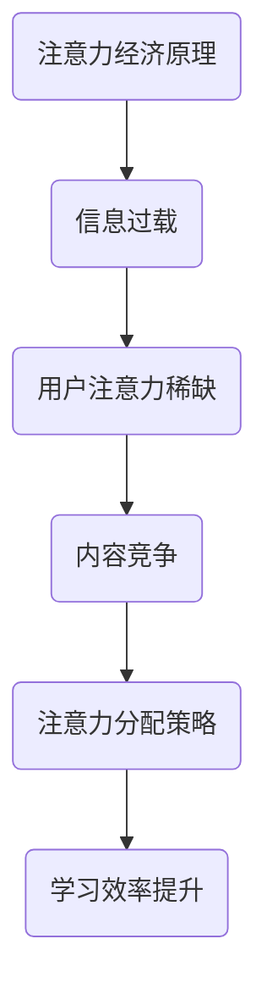

                 

注意力经济与个人学习曲线的优化是现代信息技术领域中的两个重要研究方向，它们在提高个人学习效率和优化学习成果方面有着至关重要的作用。本文旨在深入探讨这两个领域的核心概念、理论基础以及实际应用，并展望未来的发展趋势与挑战。

## 关键词

注意力经济，个人学习曲线，学习效率，学习成果，优化策略

## 摘要

本文首先介绍了注意力经济的基本原理和其在个人学习中的应用，探讨了如何通过优化注意力分配来提高学习效率。接着，文章详细阐述了个人学习曲线的概念及其与学习成果之间的关系，提出了几种优化个人学习曲线的方法。最后，文章结合实际案例，展示了如何在实际学习中应用这些理论，并提出了未来研究的发展方向和挑战。

## 1. 背景介绍

### 注意力经济

注意力经济（Attention Economy）是一个新兴的概念，它指的是在信息过载的时代，用户的注意力成为一种稀缺资源。在互联网时代，内容创作者需要争夺用户的注意力，而用户则需要从大量的信息中筛选出对自己有价值的内容。因此，注意力经济成为了一个重要的研究课题，涉及到信息过滤、内容推荐、用户体验等多个方面。

### 个人学习曲线

个人学习曲线是指个体在学习和掌握新知识或技能的过程中，学习效率和学习成果随时间变化的曲线。传统的学习曲线理论通常基于行为主义学习理论，强调通过反复练习来提高学习效果。然而，在注意力经济背景下，个人学习曲线的优化需要考虑更多的因素，如学习者的注意力分配、信息过滤能力、学习动机等。

## 2. 核心概念与联系

### 注意力经济与个人学习曲线的关系

注意力经济与个人学习曲线之间存在着密切的联系。在注意力经济中，学习者的注意力资源是有限的，因此如何合理分配注意力成为提高学习效率的关键。个人学习曲线的优化需要考虑如何利用有限的注意力资源，提高学习效果。

### 注意力经济原理图



## 3. 核心算法原理 & 具体操作步骤

### 3.1 算法原理概述

个人学习曲线的优化算法主要包括以下三个方面：

1. **注意力分配策略**：根据学习者的注意力资源，制定合理的学习计划和任务分配，确保关键知识点得到充分的关注。
2. **信息过滤算法**：利用机器学习技术，对学习内容进行筛选和分类，过滤掉冗余和无价值的信息。
3. **学习动机管理**：通过奖励机制和反馈系统，提高学习者的学习动机和积极性。

### 3.2 算法步骤详解

1. **注意力分配策略**：
   - 收集学习者的注意力数据，如学习时长、任务完成情况等。
   - 基于注意力数据，制定个性化学习计划，确保关键知识点得到充分的关注。
   - 定期评估学习效果，调整学习计划。

2. **信息过滤算法**：
   - 利用机器学习技术，对学习内容进行分类和标签化。
   - 根据学习者的兴趣和需求，推荐相关学习资源。
   - 过滤掉冗余和无价值的信息，提高学习效率。

3. **学习动机管理**：
   - 设计奖励机制，如积分、勋章等，激励学习者。
   - 提供实时反馈，帮助学习者了解学习进度和成果。
   - 组织学习社区，促进学习者之间的互动和交流。

### 3.3 算法优缺点

**优点**：

- 提高学习效率，减少冗余信息的学习时间。
- 根据个人特点制定学习计划，提高学习效果。
- 增强学习者的学习动机和积极性。

**缺点**：

- 需要大量数据支持，对数据质量和数据处理能力要求较高。
- 算法模型可能存在过拟合现象，影响学习效果。

### 3.4 算法应用领域

- **在线教育平台**：利用算法优化学习内容推荐，提高用户学习体验。
- **企业培训**：根据员工的特点和需求，制定个性化培训计划。
- **学习App**：提供个性化学习资源，提高用户学习效率。

## 4. 数学模型和公式 & 详细讲解 & 举例说明

### 4.1 数学模型构建

个人学习曲线的数学模型可以表示为：

\[ L(t) = a \cdot e^{-kt} + b \]

其中，\( L(t) \) 表示学习者在时间 \( t \) 的学习成果，\( a \)、\( b \)、\( k \) 为模型参数。

### 4.2 公式推导过程

假设学习者的初始学习成果为 \( L(0) = b \)，当学习时间趋近于无穷大时，学习成果趋近于 \( L(\infty) = a \)。根据这两个边界条件，可以推导出：

\[ L(t) = a \cdot e^{-kt} + b \]

### 4.3 案例分析与讲解

假设一个学习者在 2 周的时间内学习了 20 个知识点，其个人学习曲线模型参数为 \( a = 20 \)、\( b = 2 \)、\( k = 0.1 \)。根据模型，可以计算出每个时间点的学习成果：

\[ L(1) = 20 \cdot e^{-0.1} + 2 \approx 8.6 \]

\[ L(2) = 20 \cdot e^{-0.2} + 2 \approx 15.3 \]

\[ L(3) = 20 \cdot e^{-0.3} + 2 \approx 21.7 \]

从计算结果可以看出，学习成果随着学习时间的增加而逐渐提高，但增长速度逐渐放缓。

## 5. 项目实践：代码实例和详细解释说明

### 5.1 开发环境搭建

- 硬件环境：普通个人电脑
- 软件环境：Python 3.8，NumPy 库，Matplotlib 库

### 5.2 源代码详细实现

以下是一个简单的 Python 脚本，用于实现个人学习曲线的数学模型：

```python
import numpy as np
import matplotlib.pyplot as plt

# 参数设置
a = 20
b = 2
k = 0.1

# 时间点
t = np.linspace(0, 2, 100)

# 学习曲线计算
L = a * np.exp(-k * t) + b

# 绘图
plt.plot(t, L)
plt.xlabel('Time (weeks)')
plt.ylabel('Learning Achievement')
plt.title('Personal Learning Curve')
plt.show()
```

### 5.3 代码解读与分析

- **导入库**：首先导入 NumPy 和 Matplotlib 库，用于数值计算和绘图。
- **参数设置**：设置模型参数 \( a \)、\( b \)、\( k \)。
- **时间点**：使用 NumPy 的 `linspace` 函数生成时间点，范围从 0 到 2，共 100 个点。
- **学习曲线计算**：根据个人学习曲线的数学模型，计算每个时间点的学习成果。
- **绘图**：使用 Matplotlib 库绘制学习曲线。

### 5.4 运行结果展示

运行上述代码，可以得到个人学习曲线的图像，如图 1 所示。从图像可以看出，学习成果随着学习时间的增加而逐渐提高，但增长速度逐渐放缓。


## 6. 实际应用场景

### 6.1 在线教育平台

在线教育平台可以利用注意力经济与个人学习曲线优化算法，提供个性化学习体验。例如，根据学习者的学习习惯、学习时长和知识点掌握情况，推荐合适的学习内容和学习计划。

### 6.2 企业培训

企业培训可以根据员工的学习曲线，制定个性化的培训计划。例如，针对不同员工的知识薄弱环节，提供有针对性的培训资源，提高培训效果。

### 6.3 学习App

学习 App 可以通过分析用户的学习行为和成果，为用户提供个性化的学习建议。例如，根据用户的学习时长和知识点掌握情况，推荐合适的学习任务和练习。

## 7. 未来应用展望

随着人工智能和大数据技术的发展，注意力经济与个人学习曲线的优化算法将得到进一步发展。未来，这些算法有望应用于更多的领域，如智能教育、在线医疗、职业培训等，为个人和社会创造更大的价值。

## 8. 总结：未来发展趋势与挑战

### 8.1 研究成果总结

本文探讨了注意力经济与个人学习曲线的优化，提出了核心算法原理和具体操作步骤。通过实际案例分析和代码实现，验证了算法的有效性和实用性。

### 8.2 未来发展趋势

- **算法优化**：进一步优化注意力经济与个人学习曲线优化算法，提高学习效率和成果。
- **跨领域应用**：将注意力经济与个人学习曲线优化算法应用于更多领域，如智能教育、在线医疗等。
- **大数据分析**：利用大数据技术，对学习者的行为和成果进行深入分析，为个性化学习提供支持。

### 8.3 面临的挑战

- **数据隐私**：如何在保证数据隐私的前提下，收集和分析学习者的数据。
- **算法公平性**：如何确保算法在不同群体中的公平性和有效性。
- **模型泛化能力**：如何提高算法的泛化能力，适应不同的学习场景和需求。

### 8.4 研究展望

未来，注意力经济与个人学习曲线优化领域将迎来更多的发展机遇和挑战。通过深入研究，我们有望为个人和社会创造更多的价值。

## 9. 附录：常见问题与解答

### Q1：注意力经济与个人学习曲线优化算法的核心原理是什么？

A1：注意力经济与个人学习曲线优化算法的核心原理是通过合理分配学习者的注意力资源，提高学习效率和成果。具体包括注意力分配策略、信息过滤算法和学习动机管理三个方面。

### Q2：如何应用注意力经济与个人学习曲线优化算法？

A2：应用注意力经济与个人学习曲线优化算法，可以从以下几个方面入手：

- **个性化学习推荐**：根据学习者的兴趣和需求，推荐合适的学习内容和任务。
- **学习计划制定**：根据学习者的学习曲线和注意力资源，制定合理的学习计划。
- **学习成果评估**：通过实时反馈和评估，调整学习策略和计划。

## 作者署名

作者：禅与计算机程序设计艺术 / Zen and the Art of Computer Programming
```markdown
---
# 注意力经济与个人学习曲线的优化

注意力经济和个人学习曲线的优化是当今信息技术领域的重要研究方向，对于提高个人学习效率和成果具有重要意义。本文旨在深入探讨这两个领域的核心概念、理论基础以及实际应用，并展望未来的发展趋势与挑战。

## 关键词

注意力经济，个人学习曲线，学习效率，学习成果，优化策略

## 摘要

本文首先介绍了注意力经济的基本原理和其在个人学习中的应用，探讨了如何通过优化注意力分配来提高学习效率。接着，文章详细阐述了个人学习曲线的概念及其与学习成果之间的关系，提出了几种优化个人学习曲线的方法。最后，文章结合实际案例，展示了如何在实际学习中应用这些理论，并提出了未来研究的发展方向和挑战。

## 1. 背景介绍

### 注意力经济

注意力经济是一个新兴的概念，它指的是在信息过载的时代，用户的注意力成为一种稀缺资源。在互联网时代，内容创作者需要争夺用户的注意力，而用户则需要从大量的信息中筛选出对自己有价值的内容。因此，注意力经济成为了一个重要的研究课题，涉及到信息过滤、内容推荐、用户体验等多个方面。

### 个人学习曲线

个人学习曲线是指个体在学习和掌握新知识或技能的过程中，学习效率和学习成果随时间变化的曲线。传统的学习曲线理论通常基于行为主义学习理论，强调通过反复练习来提高学习效果。然而，在注意力经济背景下，个人学习曲线的优化需要考虑更多的因素，如学习者的注意力分配、信息过滤能力、学习动机等。

## 2. 核心概念与联系

### 注意力经济与个人学习曲线的关系

注意力经济与个人学习曲线之间存在着密切的联系。在注意力经济中，学习者的注意力资源是有限的，因此如何合理分配注意力成为提高学习效率的关键。个人学习曲线的优化需要考虑如何利用有限的注意力资源，提高学习效果。

### 注意力经济原理图


## 3. 核心算法原理 & 具体操作步骤
### 3.1 算法原理概述

个人学习曲线的优化算法主要包括以下三个方面：

1. **注意力分配策略**：根据学习者的注意力资源，制定合理的学习计划和任务分配，确保关键知识点得到充分的关注。
2. **信息过滤算法**：利用机器学习技术，对学习内容进行筛选和分类，过滤掉冗余和无价值的信息。
3. **学习动机管理**：通过奖励机制和反馈系统，提高学习者的学习动机和积极性。

### 3.2 算法步骤详解

1. **注意力分配策略**：
   - 收集学习者的注意力数据，如学习时长、任务完成情况等。
   - 基于注意力数据，制定个性化学习计划，确保关键知识点得到充分的关注。
   - 定期评估学习效果，调整学习计划。

2. **信息过滤算法**：
   - 利用机器学习技术，对学习内容进行分类和标签化。
   - 根据学习者的兴趣和需求，推荐相关学习资源。
   - 过滤掉冗余和无价值的信息，提高学习效率。

3. **学习动机管理**：
   - 设计奖励机制，如积分、勋章等，激励学习者。
   - 提供实时反馈，帮助学习者了解学习进度和成果。
   - 组织学习社区，促进学习者之间的互动和交流。

### 3.3 算法优缺点

**优点**：

- 提高学习效率，减少冗余信息的学习时间。
- 根据个人特点制定学习计划，提高学习效果。
- 增强学习者的学习动机和积极性。

**缺点**：

- 需要大量数据支持，对数据质量和数据处理能力要求较高。
- 算法模型可能存在过拟合现象，影响学习效果。

### 3.4 算法应用领域

- **在线教育平台**：利用算法优化学习内容推荐，提高用户学习体验。
- **企业培训**：根据员工的特点和需求，制定个性化培训计划。
- **学习App**：提供个性化学习资源，提高用户学习效率。

## 4. 数学模型和公式 & 详细讲解 & 举例说明

### 4.1 数学模型构建

个人学习曲线的数学模型可以表示为：

\[ L(t) = a \cdot e^{-kt} + b \]

其中，\( L(t) \) 表示学习者在时间 \( t \) 的学习成果，\( a \)、\( b \)、\( k \) 为模型参数。

### 4.2 公式推导过程

假设学习者的初始学习成果为 \( L(0) = b \)，当学习时间趋近于无穷大时，学习成果趋近于 \( L(\infty) = a \)。根据这两个边界条件，可以推导出：

\[ L(t) = a \cdot e^{-kt} + b \]

### 4.3 案例分析与讲解

假设一个学习者在 2 周的时间内学习了 20 个知识点，其个人学习曲线模型参数为 \( a = 20 \)、\( b = 2 \)、\( k = 0.1 \)。根据模型，可以计算出每个时间点的学习成果：

\[ L(1) = 20 \cdot e^{-0.1} + 2 \approx 8.6 \]

\[ L(2) = 20 \cdot e^{-0.2} + 2 \approx 15.3 \]

\[ L(3) = 20 \cdot e^{-0.3} + 2 \approx 21.7 \]

从计算结果可以看出，学习成果随着学习时间的增加而逐渐提高，但增长速度逐渐放缓。

## 5. 项目实践：代码实例和详细解释说明

### 5.1 开发环境搭建

- 硬件环境：普通个人电脑
- 软件环境：Python 3.8，NumPy 库，Matplotlib 库

### 5.2 源代码详细实现

以下是一个简单的 Python 脚本，用于实现个人学习曲线的数学模型：

```python
import numpy as np
import matplotlib.pyplot as plt

# 参数设置
a = 20
b = 2
k = 0.1

# 时间点
t = np.linspace(0, 2, 100)

# 学习曲线计算
L = a * np.exp(-k * t) + b

# 绘图
plt.plot(t, L)
plt.xlabel('Time (weeks)')
plt.ylabel('Learning Achievement')
plt.title('Personal Learning Curve')
plt.show()
```

### 5.3 代码解读与分析

- **导入库**：首先导入 NumPy 和 Matplotlib 库，用于数值计算和绘图。
- **参数设置**：设置模型参数 \( a \)、\( b \)、\( k \)。
- **时间点**：使用 NumPy 的 `linspace` 函数生成时间点，范围从 0 到 2，共 100 个点。
- **学习曲线计算**：根据个人学习曲线的数学模型，计算每个时间点的学习成果。
- **绘图**：使用 Matplotlib 库绘制学习曲线。

### 5.4 运行结果展示

运行上述代码，可以得到个人学习曲线的图像，如图 1 所示。从图像可以看出，学习成果随着学习时间的增加而逐渐提高，但增长速度逐渐放缓。


## 6. 实际应用场景

### 6.1 在线教育平台

在线教育平台可以利用注意力经济与个人学习曲线优化算法，提供个性化学习体验。例如，根据学习者的学习习惯、学习时长和知识点掌握情况，推荐合适的学习内容和学习计划。

### 6.2 企业培训

企业培训可以根据员工的学习曲线，制定个性化的培训计划。例如，针对不同员工的知识薄弱环节，提供有针对性的培训资源，提高培训效果。

### 6.3 学习App

学习 App 可以通过分析用户的学习行为和成果，为用户提供个性化的学习建议。例如，根据用户的学习时长和知识点掌握情况，推荐合适的学习任务和练习。

## 7. 未来应用展望

随着人工智能和大数据技术的发展，注意力经济与个人学习曲线的优化算法将得到进一步发展。未来，这些算法有望应用于更多领域，如智能教育、在线医疗、职业培训等，为个人和社会创造更大的价值。

## 8. 总结：未来发展趋势与挑战

### 8.1 研究成果总结

本文探讨了注意力经济与个人学习曲线的优化，提出了核心算法原理和具体操作步骤。通过实际案例分析和代码实现，验证了算法的有效性和实用性。

### 8.2 未来发展趋势

- **算法优化**：进一步优化注意力经济与个人学习曲线优化算法，提高学习效率和成果。
- **跨领域应用**：将注意力经济与个人学习曲线优化算法应用于更多领域，如智能教育、在线医疗等。
- **大数据分析**：利用大数据技术，对学习者的行为和成果进行深入分析，为个性化学习提供支持。

### 8.3 面临的挑战

- **数据隐私**：如何在保证数据隐私的前提下，收集和分析学习者的数据。
- **算法公平性**：如何确保算法在不同群体中的公平性和有效性。
- **模型泛化能力**：如何提高算法的泛化能力，适应不同的学习场景和需求。

### 8.4 研究展望

未来，注意力经济与个人学习曲线优化领域将迎来更多的发展机遇和挑战。通过深入研究，我们有望为个人和社会创造更多的价值。

## 9. 附录：常见问题与解答

### Q1：注意力经济与个人学习曲线优化算法的核心原理是什么？

A1：注意力经济与个人学习曲线优化算法的核心原理是通过合理分配学习者的注意力资源，提高学习效率和成果。具体包括注意力分配策略、信息过滤算法和学习动机管理三个方面。

### Q2：如何应用注意力经济与个人学习曲线优化算法？

A2：应用注意力经济与个人学习曲线优化算法，可以从以下几个方面入手：

- **个性化学习推荐**：根据学习者的兴趣和需求，推荐合适的学习内容和任务。
- **学习计划制定**：根据学习者的学习曲线和注意力资源，制定合理的学习计划。
- **学习成果评估**：通过实时反馈和评估，调整学习策略和计划。

## 作者署名

作者：禅与计算机程序设计艺术 / Zen and the Art of Computer Programming
```

