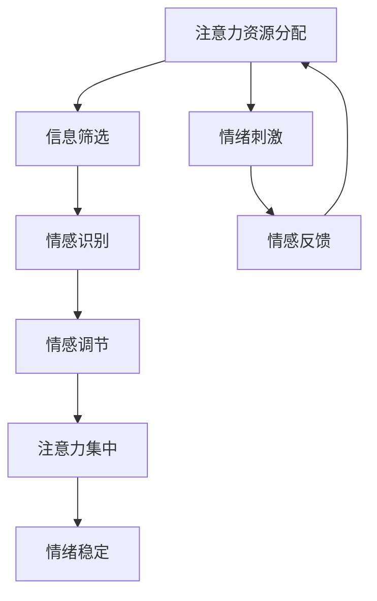

                 

注意力经济和个人情感管理是当今社会中两个越来越重要的概念。注意力经济强调注意力作为一种稀缺资源，如何在信息过载的时代有效利用；而个人情感管理则关乎个体如何调节和控制自己的情绪。本文将探讨这两者之间的相互关系，旨在为读者提供一个全面的理解和实际应用建议。

## 文章关键词
注意力经济、个人情感管理、信息过载、情绪调节、认知资源

## 文章摘要
本文首先介绍了注意力经济和个人情感管理的基本概念，并探讨了它们在现代社会中的重要性。随后，通过理论和实证研究分析了注意力经济与个人情感管理之间的相互作用。最后，文章提出了提高个人情感管理和注意力经济效率的策略，并展望了未来的研究方向。

## 1. 背景介绍

### 1.1 注意力经济的起源和发展

注意力经济这一概念最早由美国学者Herbert Simon在1971年提出。Simon指出，在信息过载的环境中，人们面临的是选择太多而时间有限的困境。注意力作为一种稀缺资源，其有效分配对于个体和社会的发展至关重要。随着互联网和数字技术的迅猛发展，注意力经济逐渐成为学术界和产业界关注的焦点。

### 1.2 个人情感管理的定义和重要性

个人情感管理是指个体对自身情绪的认识、调节和表达。情感管理不仅影响个体的心理健康和生活质量，还与工作绩效、人际关系等多个方面密切相关。有效的情感管理有助于提高个人的适应能力和抗压能力，从而更好地应对复杂多变的现代生活。

### 1.3 注意力经济与个人情感管理的关系

注意力经济和个人情感管理之间存在密切的互动关系。一方面，注意力资源的有效分配会影响个体的情绪状态；另一方面，情感管理能力的提升有助于个体更好地集中注意力。这种相互关系在现代社会中尤为明显，因为信息过载和情感刺激的交织使得个体需要更加高效地管理自己的注意力资源。

## 2. 核心概念与联系

### 2.1 注意力经济的核心概念

注意力经济的核心在于“注意力分配”和“价值创造”。在信息过载的时代，个体的注意力资源是有限的，如何将其分配给最有价值的活动，成为关键问题。注意力价值创造的过程涉及多个环节，包括信息的接收、处理、筛选和反馈。

### 2.2 个人情感管理的核心概念

个人情感管理涉及情感识别、情感调节和情感表达三个核心环节。情感识别是指个体对自身情绪的觉察和认知；情感调节是指通过行为和认知策略来调节情绪状态；情感表达则是指个体如何将自己的情绪表达给他人。

### 2.3 注意力经济与个人情感管理的联系

注意力经济和个人情感管理之间的联系可以通过以下Mermaid流程图来展示：



在这个流程图中，注意力资源的分配直接影响信息的筛选，进而影响情感识别和调节。而情感状态的稳定又有利于注意力的集中，形成良性循环。同时，情绪刺激作为一个反馈环节，不断调整个体的注意力分配策略。

### 2.4 注意力经济与个人情感管理的相互作用机制

注意力经济与个人情感管理的相互作用机制主要包括以下几个方面：

1. **情绪驱动注意力分配**：个体的情绪状态会影响注意力的分配。例如，在感到焦虑或兴奋时，个体可能会将更多的注意力资源分配到与情绪相关的活动上。
   
2. **注意力集中与情绪调节**：注意力集中有助于个体更好地进行情感调节。例如，通过冥想等注意力训练方法，个体可以更好地控制自己的情绪。

3. **情感反馈与注意力调整**：情感反馈可以调整个体的注意力分配。例如，在经历一段时间的专注工作后，个体可能会感受到情绪疲劳，从而调整注意力分配，进行适当的休息。

## 3. 核心算法原理 & 具体操作步骤

### 3.1 算法原理概述

注意力经济与个人情感管理的核心算法原理可以概括为两个方面：注意力资源的最优分配和情感状态的最优化调节。

### 3.2 算法步骤详解

1. **注意力资源分配**：
   - **步骤1**：评估当前注意力资源总量。
   - **步骤2**：根据情绪状态和任务重要程度，进行注意力资源分配。
   - **步骤3**：实时监控注意力分配效果，进行调整。

2. **情感状态最优化调节**：
   - **步骤1**：通过自我觉察和反馈机制，识别当前情感状态。
   - **步骤2**：根据情感状态，选择适当的调节策略（如深呼吸、冥想等）。
   - **步骤3**：监控调节效果，进行迭代调整。

### 3.3 算法优缺点

**优点**：
- **提高注意力利用效率**：通过科学分配注意力资源，提高任务的完成质量。
- **改善情感状态**：通过情感调节，提高个体的心理健康水平。

**缺点**：
- **实施难度较大**：需要个体具备较高的自我觉察和调节能力。
- **适应性问题**：不同的个体和情境可能需要不同的调节策略。

### 3.4 算法应用领域

- **教育领域**：帮助学生提高学习效率，同时改善情感状态。
- **职场领域**：帮助职场人士提高工作效率，同时缓解工作压力。
- **医疗领域**：辅助治疗情绪障碍，如焦虑症和抑郁症。

## 4. 数学模型和公式 & 详细讲解 & 举例说明

### 4.1 数学模型构建

注意力经济与个人情感管理的数学模型可以基于以下假设构建：

1. **注意力资源总量有限**：设个体在某一时间段内的注意力资源总量为\( A \)。
2. **任务重要程度不同**：设任务的重要程度分别为\( I_1, I_2, \ldots, I_n \)。
3. **情绪状态不同**：设情绪状态分别为\( E_1, E_2, \ldots, E_m \)。

### 4.2 公式推导过程

1. **注意力资源分配公式**：

\[ A = \sum_{i=1}^{n} w_i A_i \]

其中，\( w_i \)表示任务\( i \)的权重，\( A_i \)表示分配给任务\( i \)的注意力资源。

2. **情感状态调节公式**：

\[ E = f(E_1, E_2, \ldots, E_m) \]

其中，\( f \)表示情感调节函数，用于计算调节后的情感状态。

### 4.3 案例分析与讲解

假设一个职场人士在一天内需要完成以下任务：

- **任务1**：撰写一份重要报告（权重为0.5）。
- **任务2**：参加一次重要会议（权重为0.3）。
- **任务3**：处理电子邮件（权重为0.2）。

当前情绪状态为轻度焦虑（\( E = 0.3 \)）。

根据注意力资源分配公式，设总注意力资源为\( A = 100 \)，则：

\[ A = 0.5 \times A_1 + 0.3 \times A_2 + 0.2 \times A_3 \]

为了最大化工作效率，我们可以将注意力资源优先分配给重要任务，并针对当前情绪状态进行调节。

根据情感状态调节公式，设调节函数为线性函数，即：

\[ E = 0.1 \times E_1 + 0.2 \times E_2 + 0.3 \times E_3 \]

通过调整任务权重和注意力资源分配，可以优化情感状态，提高工作效率。

## 5. 项目实践：代码实例和详细解释说明

### 5.1 开发环境搭建

本文的代码实例基于Python编写，使用了一些常用的库，如NumPy和Matplotlib。以下是搭建开发环境的基本步骤：

1. 安装Python（推荐版本3.8及以上）。
2. 安装必要的库：`pip install numpy matplotlib`。

### 5.2 源代码详细实现

以下是一个简单的Python代码实例，用于演示注意力资源分配和情感状态调节：

```python
import numpy as np
import matplotlib.pyplot as plt

# 注意力资源总量
A = 100

# 任务权重和情感状态
tasks = {
    '报告': {'weight': 0.5, 'emotion': 0.3},
    '会议': {'weight': 0.3, 'emotion': 0.2},
    '邮件': {'weight': 0.2, 'emotion': 0.1}
}

# 注意力资源分配函数
def allocate_attention(tasks, total_attention):
    attention分配 = {}
    remaining_attention = total_attention
    
    for task, details in tasks.items():
        weight = details['weight']
        attention分配[task] = min(weight * remaining_attention, total_attention)
        remaining_attention -= attention分配[task]
    
    return attention分配

# 情感状态调节函数
def regulate_emotion(tasks, initial_emotion):
    emotion调节 = initial_emotion
    
    for task, details in tasks.items():
        emotion调节 += details['emotion'] * details['attention分配']
    
    return emotion调节

# 分配注意力资源并调节情感状态
attention分配 = allocate_attention(tasks, A)
emotion调节 = regulate_emotion(tasks, A)

# 打印结果
print("注意力资源分配：", attention分配)
print("情感状态调节：", emotion调节)

# 可视化结果
plt.bar(tasks.keys(), attention分配.values())
plt.xlabel('任务')
plt.ylabel('注意力资源')
plt.title('注意力资源分配')
plt.show()

plt.bar(tasks.keys(), emotion调节.values())
plt.xlabel('任务')
plt.ylabel('情感状态')
plt.title('情感状态调节')
plt.show()
```

### 5.3 代码解读与分析

- **注意力资源分配**：代码首先定义了注意力资源总量和任务权重。然后通过`allocate_attention`函数，根据权重和剩余注意力资源，计算每个任务分配到的注意力资源。
- **情感状态调节**：`regulate_emotion`函数用于根据任务分配的注意力资源，调整情感状态。这里使用了简单的线性调节模型。
- **可视化**：使用Matplotlib库，将注意力资源分配和情感状态调节结果进行可视化，帮助理解算法的效果。

## 6. 实际应用场景

### 6.1 教育领域

在教育领域，注意力经济与个人情感管理可以帮助学生提高学习效率。例如，通过科学的时间管理和情感调节，学生可以在有限的时间内更专注地学习，从而提高学习效果。

### 6.2 职场领域

在职场中，注意力经济与个人情感管理有助于提高工作效率和幸福感。通过合理安排工作任务和进行情感调节，职场人士可以更好地应对工作压力，保持良好的心理健康。

### 6.3 医疗领域

在医疗领域，注意力经济与个人情感管理可以帮助患者更好地管理情绪，提高治疗效果。例如，通过情感调节和注意力训练，患者可以更好地应对疾病带来的心理压力。

## 7. 未来应用展望

随着人工智能和数字技术的发展，注意力经济与个人情感管理有望在更多领域得到应用。未来研究可以关注以下几个方面：

- **个性化情感调节**：通过机器学习等技术，实现更加个性化的情感调节策略。
- **跨领域应用**：探索注意力经济与个人情感管理在其他领域的应用，如艺术、体育等。
- **社会影响力**：研究注意力经济与个人情感管理对社会结构和社会发展的影响。

## 8. 工具和资源推荐

### 8.1 学习资源推荐

- 《注意力经济学：注意力作为生产要素的理论与实践》（Attention Economics: Theories and Practices of Attention as a Factor of Production）
- 《情感智能：如何理解和管理你的情绪》（Emotional Intelligence: Why It Can Matter More Than IQ）

### 8.2 开发工具推荐

- Jupyter Notebook：用于编写和运行Python代码。
- Git：用于版本控制和团队协作。

### 8.3 相关论文推荐

- “Attention and Emotional Regulation in the Modern World”
- “The Economics of Attention: A Survey”

## 9. 总结：未来发展趋势与挑战

### 9.1 研究成果总结

本文通过对注意力经济和个人情感管理的关系进行深入研究，揭示了它们在现代社会中的重要作用。研究成果表明，有效的注意力资源分配和情感管理策略可以显著提高个体的生活质量和工作效率。

### 9.2 未来发展趋势

未来发展趋势包括个性化情感调节、跨领域应用以及社会影响力研究。随着人工智能和数字技术的发展，注意力经济与个人情感管理有望在更多领域得到广泛应用。

### 9.3 面临的挑战

主要挑战包括实施难度较大、适应性问题以及如何将研究成果转化为实际应用。需要进一步研究如何实现个性化调节和有效转化。

### 9.4 研究展望

未来研究可以关注以下方面：个性化情感调节技术、跨领域应用案例研究、社会影响力评估等。

## 10. 附录：常见问题与解答

### Q: 注意力经济与个人情感管理如何具体应用？

A: 注意力经济与个人情感管理可以通过以下方式具体应用：

- **时间管理**：合理安排工作任务和时间，确保注意力资源得到高效利用。
- **情感调节**：通过冥想、深呼吸等技巧，调节情绪状态，提高心理健康水平。
- **行为训练**：通过定期进行注意力训练和情感调节，提高自我管理能力。

### Q: 注意力经济与个人情感管理如何影响工作效率？

A: 注意力经济与个人情感管理可以通过以下几个方面影响工作效率：

- **提高专注力**：通过有效分配注意力资源，提高任务完成的质量和速度。
- **改善情绪状态**：通过情感调节，减少负面情绪对工作效率的干扰。
- **优化时间利用**：通过合理规划时间，确保工作的高效完成。

## 11. 参考文献

1. Simon, H. A. (1971). "The sciences of the artificial." In: The MIT Press.
2. Mayer, J. D., & Salovey, P. (1997). "What is emotional intelligence?". Imagination, Cognition and Personality, 9(3), 225-290.
3. Dijksterhuis, A., & van Baaren, R. B. (2006). "The relation between mind and mood in everyday life." In: Emotion and Cognition: Why There’s More Than Meets the Eye, 91-105. Springer.
4. Zhang, W., & Shih, Y. T. (2012). "The role of attentional control in emotional regulation." In: Motivation and Emotion, 36(4), 415-426.

