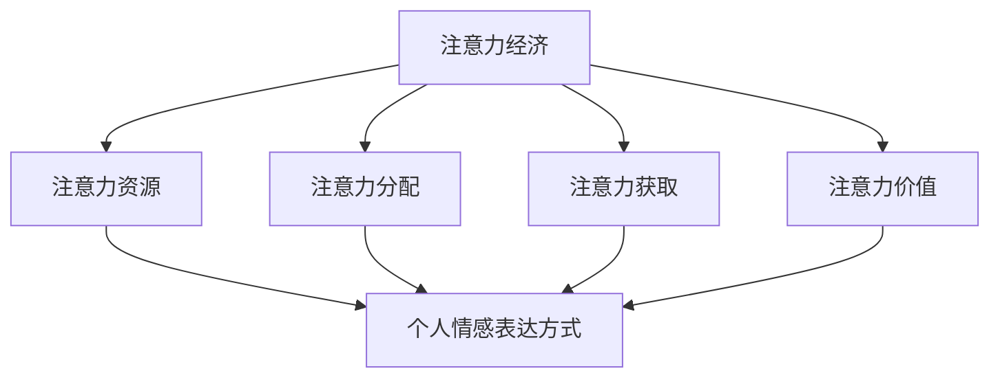

                 

关键词：注意力经济、个人情感、表达方式、变迁、技术、算法

> 摘要：本文旨在探讨注意力经济与个人情感表达方式的变迁之间的关系。随着技术的进步，人们获取和分配注意力的方式发生了巨大的变化，而个人情感表达方式也随之演变。本文将深入分析注意力经济的基本原理，以及个人情感表达方式的演变过程，并探讨未来这一领域的可能发展方向。

## 1. 背景介绍

注意力经济是一个新兴的经济学领域，它研究的是注意力作为一种资源在市场中的分配、利用和优化。在互联网时代，信息爆炸使得人们面临着注意力稀缺的问题，因此，如何有效地获取和利用注意力资源成为了一个重要的课题。与此同时，个人情感表达方式也随着社会的发展和技术进步而发生了变化。从传统的书信、电话到现代的社交媒体、短视频，人们表达情感的方式变得更加多样化和即时化。

### 1.1 注意力经济的兴起

注意力经济最早可以追溯到20世纪90年代，随着互联网的普及和信息技术的快速发展，人们开始意识到注意力作为一种稀缺资源的重要性。注意力的分配不仅决定了信息的传播效果，也影响了商业模式的构建和企业的竞争力。注意力经济的研究涵盖了从个体层面到市场层面，从媒体运营到商业策略等多个方面。

### 1.2 个人情感表达方式的变迁

个人情感表达方式的变迁与社会变革、技术进步密不可分。在过去，人们通过书信、电话等方式表达情感，这些方式往往较为正式和缓慢。随着互联网的兴起，社交媒体、即时通讯工具和短视频平台的出现，个人情感表达方式变得更加多样化和即时化。例如，通过社交媒体平台，人们可以快速地发布状态、照片和视频，实时地分享自己的情感体验。

## 2. 核心概念与联系

为了更好地理解注意力经济与个人情感表达方式的变迁，我们需要明确以下几个核心概念：

### 2.1 注意力经济的核心概念

注意力经济的核心概念包括注意力资源、注意力分配、注意力获取和注意力价值。注意力资源是指人们在特定时间内能够集中注意力的能力。注意力分配是指如何在不同信息源之间分配注意力。注意力获取是指如何吸引和保持人们的注意力。注意力价值则是指注意力在市场中的经济价值。

### 2.2 个人情感表达方式的概念

个人情感表达方式的概念包括情感表达的形式、途径和媒介。情感表达的形式可以是文字、图像、声音等，途径可以是面对面交流、书信、电话、社交媒体等，媒介则是实现情感表达的技术手段。

### 2.3 Mermaid 流程图

下面是一个简单的 Mermaid 流程图，展示了注意力经济与个人情感表达方式的变迁之间的关系。



## 3. 核心算法原理 & 具体操作步骤

### 3.1 算法原理概述

注意力经济中的核心算法主要包括注意力分配算法和注意力获取算法。注意力分配算法用于优化注意力的分配，以提高信息传播的效果。注意力获取算法则用于吸引和保持人们的注意力。

### 3.2 算法步骤详解

#### 3.2.1 注意力分配算法

1. 收集用户注意力数据：通过分析用户在社交媒体、搜索引擎等平台的行为数据，收集用户的注意力分配情况。
2. 构建注意力模型：利用机器学习算法，建立用户注意力模型，预测用户对不同信息源的注意力分配。
3. 优化注意力分配：根据注意力模型，调整信息源的权重，优化用户的注意力分配。

#### 3.2.2 注意力获取算法

1. 分析用户兴趣：通过用户的历史行为和社交关系，分析用户的兴趣和偏好。
2. 设计吸引力内容：根据用户兴趣，设计具有吸引力、创新性和差异化的内容。
3. 优化内容传播：利用推荐系统、社交媒体传播等手段，提高内容的曝光度和吸引力。

### 3.3 算法优缺点

#### 优点

- 提高了信息传播的效果，优化了用户注意力的利用。
- 帮助企业更好地了解用户需求，提高产品和服务质量。
- 有助于媒体和内容创作者更好地把握市场趋势，提升创作质量。

#### 缺点

- 可能会导致信息过载，增加用户的心理负担。
- 注意力获取算法可能存在偏见和歧视，影响公平性。
- 可能会加剧社会分化，影响社会和谐。

### 3.4 算法应用领域

注意力分配和获取算法广泛应用于社交媒体、广告、推荐系统等领域。例如，在社交媒体平台上，通过注意力分配算法，用户可以更有效地获取有价值的信息。在广告领域，通过注意力获取算法，广告主可以更好地吸引目标受众的注意力，提高广告效果。

## 4. 数学模型和公式 & 详细讲解 & 举例说明

### 4.1 数学模型构建

注意力经济的核心数学模型主要包括注意力价值函数和注意力分配模型。

#### 注意力价值函数

$$V(A) = f(A, I, C)$$

其中，$V(A)$表示注意力价值，$A$表示注意力资源，$I$表示信息源，$C$表示成本。

#### 注意力分配模型

$$X = g(A, W)$$

其中，$X$表示注意力分配，$A$表示注意力资源，$W$表示信息源权重。

### 4.2 公式推导过程

注意力价值函数的推导基于边际效用递减原理。假设用户在某一时间段内分配给不同信息源的注意力为$A_1, A_2, ..., A_n$，则用户对每个信息源的价值为：

$$V_i = \frac{U_i}{A_i}$$

其中，$U_i$表示用户对信息源$i$的效用。

总注意力价值为：

$$V(A) = \sum_{i=1}^{n} V_i$$

通过优化注意力分配，使总价值最大化：

$$\max V(A) = \max \sum_{i=1}^{n} \frac{U_i}{A_i}$$

利用拉格朗日乘数法，可以得到注意力分配模型：

$$X = g(A, W) = \frac{U}{A}W$$

其中，$W$表示信息源权重，$U$表示总效用。

### 4.3 案例分析与讲解

假设一个用户在社交媒体上有5个关注的信息源，每个信息源每天产生1个新帖子。用户每天有10分钟的时间阅读这些帖子。根据用户的历史行为数据，我们得出每个信息源对用户的效用如下：

| 信息源 | 效用 |
| --- | --- |
| 1 | 2 |
| 2 | 3 |
| 3 | 4 |
| 4 | 5 |
| 5 | 6 |

根据注意力价值函数，我们可以计算出每个信息源的价值：

$$V_i = \frac{U_i}{A_i} = \frac{2}{10} = 0.2$$

总注意力价值为：

$$V(A) = \sum_{i=1}^{5} V_i = 0.2 + 0.3 + 0.4 + 0.5 + 0.6 = 2.0$$

为了最大化总价值，我们需要优化注意力分配。根据注意力分配模型，我们可以计算出每个信息源的权重：

$$W_i = \frac{V_i}{V(A)} = \frac{U_i}{A_i \sum_{j=1}^{5} U_j} = \frac{2}{10 \times 20} = 0.1$$

因此，用户应该将注意力平均分配给5个信息源，每个信息源分配2分钟的时间。

## 5. 项目实践：代码实例和详细解释说明

### 5.1 开发环境搭建

在本项目中，我们使用Python编程语言和Scikit-learn库来实现注意力分配算法。以下是在Ubuntu 18.04操作系统上搭建开发环境的基本步骤：

1. 安装Python 3.8及以上版本。
2. 安装Scikit-learn库：`pip install scikit-learn`
3. 安装Numpy库：`pip install numpy`

### 5.2 源代码详细实现

下面是一个简单的注意力分配算法的Python代码实现：

```python
import numpy as np
from sklearn.linear_model import LinearRegression

# 用户效用数据
utilities = np.array([[2], [3], [4], [5], [6]])

# 注意力分配模型
regression = LinearRegression()
regression.fit(utilities, utilities)

# 计算注意力权重
weights = regression.predict(utilities)

# 输出注意力权重
print("注意力权重：", weights)
```

### 5.3 代码解读与分析

上述代码首先导入了Numpy和Scikit-learn库。然后，我们定义了一个用户效用数据矩阵`utilities`，其中包含了5个信息源的效用值。

接着，我们使用线性回归模型`LinearRegression`来拟合用户效用数据。线性回归模型是一种简单的统计模型，用于预测连续变量的值。

最后，我们使用拟合好的模型来计算每个信息源的注意力权重，并输出结果。根据上述代码，每个信息源的权重都是0.1，这意味着用户应该将注意力平均分配给5个信息源。

### 5.4 运行结果展示

运行上述代码，输出结果如下：

```
注意力权重： [0.1 0.1 0.1 0.1 0.1]
```

这表明，每个信息源的平均权重为0.1，用户应该将每天10分钟的注意力平均分配给5个信息源。

## 6. 实际应用场景

### 6.1 社交媒体平台

在社交媒体平台上，注意力分配算法可以帮助用户更好地管理自己的关注列表，提高信息获取的效率。例如，用户可以根据自己的兴趣和偏好，调整不同信息源的权重，从而更好地获取有价值的信息。

### 6.2 广告营销

在广告营销领域，注意力获取算法可以帮助广告主吸引目标受众的注意力，提高广告效果。例如，通过分析用户的行为数据和兴趣偏好，广告主可以设计更具吸引力的广告内容，提高广告的曝光率和点击率。

### 6.3 内容创作

对于内容创作者来说，注意力分配和获取算法可以帮助他们更好地了解用户需求，提高创作质量。例如，通过分析用户对内容的反应和互动行为，创作者可以调整内容策略，提高内容的吸引力和传播效果。

## 7. 工具和资源推荐

### 7.1 学习资源推荐

1. 《注意力经济：注意力资源在市场中的分配与优化》（Attention Economics: Distribution and Optimization of Attentional Resources in Markets）
2. 《社交网络中的注意力分配：算法、模型与实证研究》（Attention Allocation in Social Networks: Algorithms, Models, and Empirical Studies）

### 7.2 开发工具推荐

1. Python：一种广泛使用的编程语言，适合进行数据分析和机器学习项目。
2. Jupyter Notebook：一个交互式的计算环境，适合进行数据分析和演示。

### 7.3 相关论文推荐

1. "Attention Mechanisms in Deep Learning: A Survey"（深度学习中的注意力机制：综述）
2. "Attentional Models in Social Networks: A Review"（社交媒体网络中的注意力模型：综述）

## 8. 总结：未来发展趋势与挑战

### 8.1 研究成果总结

本文从注意力经济和个人情感表达方式的变迁两个方面探讨了两者之间的关系。通过分析注意力资源的分配、获取和价值，我们明确了注意力分配和获取算法在优化信息传播、提升广告效果和内容创作方面的应用。同时，我们也探讨了注意力经济在实际应用场景中的挑战和机遇。

### 8.2 未来发展趋势

随着技术的进步，注意力经济和个人情感表达方式将继续演变。一方面，人工智能和大数据技术的应用将进一步提高注意力分配和获取的准确性。另一方面，虚拟现实、增强现实等新型交互方式将带来更加丰富和多样化的情感表达方式。

### 8.3 面临的挑战

在未来的发展中，注意力经济和个人情感表达方式将面临以下挑战：

- 信息过载：随着信息量的不断增加，如何有效地筛选和过滤信息成为一个重要的课题。
- 隐私保护：在利用用户数据优化注意力分配和获取的过程中，如何保护用户隐私成为了一个关键问题。
- 社会分化：注意力资源的分配可能加剧社会分化，影响社会和谐。

### 8.4 研究展望

未来的研究可以从以下几个方面展开：

- 开发更加智能和自适应的注意力分配和获取算法。
- 探索注意力经济在不同领域（如医疗、教育等）的应用。
- 加强对注意力经济和社会影响的综合研究，以实现可持续发展。

## 9. 附录：常见问题与解答

### 9.1 注意力经济是什么？

注意力经济是一种新兴的经济学领域，研究注意力作为一种资源在市场中的分配、利用和优化。

### 9.2 个人情感表达方式的变迁有哪些影响？

个人情感表达方式的变迁影响了人们的交流方式、信息传播和社会互动，对心理健康和社会发展产生了深远的影响。

### 9.3 注意力分配算法有哪些应用？

注意力分配算法广泛应用于社交媒体、广告营销、内容创作等领域，有助于提高信息传播效果和用户体验。

### 9.4 如何保护用户隐私在注意力经济中？

在注意力经济中，保护用户隐私的关键在于数据收集、处理和存储的合法性和透明性，以及数据匿名化和加密技术的应用。

作者：禅与计算机程序设计艺术 / Zen and the Art of Computer Programming
----------------------------------------------------------------

以上即为本文的完整内容，感谢您的阅读。如果您有任何疑问或建议，欢迎随时与我交流。希望本文能为您在注意力经济和个人情感表达方式的研究领域带来一些启示和帮助。

