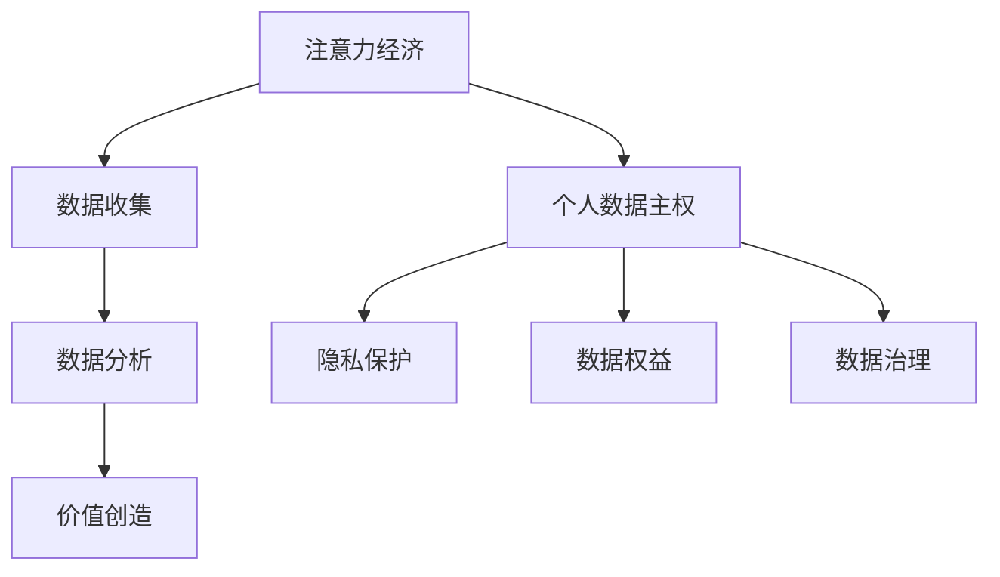

                 

关键词：注意力经济，个人数据主权，博弈，隐私保护，信息过滤，数据治理

> 摘要：本文探讨了在数字化时代，注意力经济与个人数据主权的博弈关系。在分析了注意力经济的运作原理及其对个人数据的影响后，本文深入探讨了个人数据主权的重要性，并提出了一系列策略，以实现注意力经济与个人数据主权的平衡。

## 1. 背景介绍

### 注意力经济的兴起

注意力经济是近年来兴起的一个概念，它描述了一种新的经济模式，其中注意力成为了关键资源。在传统经济中，商品和货币是交易的主要媒介，而在注意力经济中，人们的关注力和时间成为了新的价值源泉。

这种经济模式的出现，源于信息爆炸和数字化进程的加速。随着互联网和移动设备的普及，人们接触到的大量信息超出了他们的处理能力，因此，注意力成为了一种稀缺资源。商家和平台通过吸引用户的注意力来创造价值，而这种价值又进一步推动了注意力的集中和分配。

### 个人数据主权的重要性

随着注意力经济的兴起，个人数据的重要性日益凸显。个人数据不仅包含了用户的行为、偏好和需求，还反映了他们的个性和生活方式。因此，个人数据成为了许多企业和平台争抢的宝贵资源。

然而，个人数据的主权问题也日益严峻。在注意力经济中，企业和平台通过收集、分析和利用个人数据来吸引用户注意力，创造价值。然而，这种数据收集和利用的过程往往伴随着隐私泄露和数据滥用的风险。

### 个人数据主权与注意力经济的博弈

个人数据主权与注意力经济的博弈体现在以下几个方面：

1. **数据隐私与商业利益的冲突**：个人数据的主权要求保护用户的隐私，而注意力经济的核心在于数据收集和分析，这两者之间存在天然的矛盾。
2. **数据利用的平衡**：如何在确保用户隐私的前提下，合理利用个人数据来创造商业价值，是当前面临的一大挑战。
3. **监管与创新的平衡**：如何在加强数据监管的同时，促进科技创新和产业发展，也是一个亟待解决的问题。

## 2. 核心概念与联系

### 注意力经济的原理

注意力经济基于以下原理：

1. **注意力稀缺性**：在信息爆炸的背景下，用户的注意力成为稀缺资源。
2. **价值转移**：用户将注意力转移到某个平台或产品上，平台或产品因此获得价值。
3. **注意力分配**：注意力在用户和平台之间进行分配，不同的平台或产品争夺用户的注意力。

### 个人数据主权的概念

个人数据主权是指个人对其数据的控制权，包括数据的收集、使用、共享和删除等。个人数据主权的重要性体现在以下几个方面：

1. **隐私保护**：个人数据主权是保护个人隐私的基础。
2. **数据权益**：个人数据主权赋予了个人对数据的经济权益。
3. **数据治理**：个人数据主权是数据治理的重要组成部分。

### 注意力经济与个人数据主权的联系

注意力经济与个人数据主权之间的联系主要体现在以下几个方面：

1. **数据来源**：注意力经济的核心在于用户数据的收集和分析，个人数据主权是数据收集的前提和保障。
2. **价值创造**：个人数据的主权保护是确保注意力经济价值创造的基础。
3. **隐私与商业利益的平衡**：在注意力经济中，如何平衡个人数据的主权和商业利益，是当前面临的一大挑战。

### Mermaid 流程图

下面是注意力经济与个人数据主权之间关系的 Mermaid 流程图：



## 3. 核心算法原理 & 具体操作步骤

### 3.1 算法原理概述

注意力经济的核心在于用户数据的收集和分析，个人数据主权则是确保数据收集和使用合规性的关键。因此，算法原理主要围绕如何平衡数据收集的便利性和个人数据主权的保护展开。

### 3.2 算法步骤详解

1. **数据收集**：在确保个人数据主权的前提下，收集用户的基本信息、行为数据和偏好数据。
2. **数据处理**：对收集到的数据进行清洗、去噪和归一化处理，确保数据质量。
3. **数据分析**：利用机器学习算法对处理后的数据进行分析，提取用户特征和需求。
4. **价值创造**：根据分析结果，为用户提供个性化推荐和服务，创造商业价值。
5. **数据保护**：在数据处理和存储过程中，采取加密、匿名化和数据脱敏等措施，确保个人数据的安全和隐私。

### 3.3 算法优缺点

**优点**：

1. **个性化推荐**：通过分析用户数据，提供更加个性化的推荐和服务，提升用户体验。
2. **商业价值**：有效利用用户数据，创造商业价值，促进产业发展。

**缺点**：

1. **隐私泄露风险**：数据收集和分析过程中，存在隐私泄露的风险。
2. **数据主权冲突**：个人数据主权与商业利益的平衡难度较大，易引发争议。

### 3.4 算法应用领域

注意力经济和个人数据主权的博弈在多个领域都有广泛的应用，包括但不限于：

1. **广告行业**：通过分析用户行为数据，实现精准广告投放。
2. **电子商务**：利用用户偏好数据，提供个性化推荐和服务。
3. **金融行业**：通过分析用户行为和财务数据，实现风险控制和个性化服务。
4. **医疗健康**：利用个人健康数据，提供个性化健康建议和服务。

## 4. 数学模型和公式 & 详细讲解 & 举例说明

### 4.1 数学模型构建

在注意力经济中，我们可以构建以下数学模型来描述用户注意力与个人数据主权之间的关系：

1. **用户注意力模型**：
   $$ U = f(A, P, R) $$
   其中，$U$ 表示用户注意力，$A$ 表示用户可用时间，$P$ 表示用户偏好，$R$ 表示用户兴趣。

2. **个人数据主权模型**：
   $$ D = f(P, G, S) $$
   其中，$D$ 表示个人数据主权，$P$ 表示个人隐私保护，$G$ 表示个人数据权益，$S$ 表示个人数据治理。

### 4.2 公式推导过程

1. **用户注意力模型推导**：

   用户注意力模型主要基于用户可用时间、偏好和兴趣来计算。我们可以使用以下公式推导：

   $$ U = \frac{A \times P \times R}{1000} $$

   其中，$A$ 表示用户可用时间（以小时为单位），$P$ 表示用户偏好（以百分制表示），$R$ 表示用户兴趣（以百分制表示）。

   假设用户每天有8小时可用时间，偏好得分为80分，兴趣得分为90分，则用户注意力为：

   $$ U = \frac{8 \times 80 \times 90}{1000} = 72 $$

2. **个人数据主权模型推导**：

   个人数据主权模型主要基于个人隐私保护、数据权益和治理水平来计算。我们可以使用以下公式推导：

   $$ D = \frac{P \times G \times S}{1000} $$

   其中，$P$ 表示个人隐私保护水平（以百分制表示），$G$ 表示个人数据权益（以百分制表示），$S$ 表示个人数据治理水平（以百分制表示）。

   假设个人隐私保护水平为85分，数据权益为75分，治理水平为80分，则个人数据主权为：

   $$ D = \frac{85 \times 75 \times 80}{1000} = 56.5 $$

### 4.3 案例分析与讲解

以下是一个关于注意力经济与个人数据主权博弈的案例：

**案例背景**：

某电商平台上，用户小明经常浏览手机配件和电子产品。平台通过收集小明的行为数据，分析其偏好和兴趣，为其提供个性化推荐。

**案例分析**：

1. **用户注意力计算**：

   假设小明每天有8小时可用时间，偏好得分为80分，兴趣得分为90分，则用户注意力为：

   $$ U = \frac{8 \times 80 \times 90}{1000} = 72 $$

2. **个人数据主权计算**：

   假设小明对隐私保护的重视程度为85分，数据权益意识为75分，数据治理水平为80分，则个人数据主权为：

   $$ D = \frac{85 \times 75 \times 80}{1000} = 56.5 $$

   从计算结果可以看出，小明的用户注意力较高，但个人数据主权较低。这表明，在当前情况下，小明在平台上的数据隐私风险较高。

3. **解决方案**：

   平台可以通过以下措施提高小明的个人数据主权：

   - **增强隐私保护**：加强对用户数据的加密和匿名化处理，降低隐私泄露风险。
   - **提高数据权益意识**：通过教育用户，提高其对数据权益的重视程度。
   - **优化数据治理**：提高数据治理水平，确保用户数据的安全和合规使用。

## 5. 项目实践：代码实例和详细解释说明

### 5.1 开发环境搭建

在本案例中，我们将使用Python语言进行编程。首先，需要在开发环境中安装Python和相应的库，如NumPy、Pandas和Matplotlib。

```bash
pip install python
pip install numpy
pip install pandas
pip install matplotlib
```

### 5.2 源代码详细实现

下面是关于注意力经济与个人数据主权计算的 Python 代码实现：

```python
import numpy as np
import pandas as pd
import matplotlib.pyplot as plt

# 用户注意力计算函数
def calculate_attention(hours, preference, interest):
    attention = (hours * preference * interest) / 1000
    return attention

# 个人数据主权计算函数
def calculate_data_sovereignty(privacy, data_ownership, governance):
    sovereignty = (privacy * data_ownership * governance) / 1000
    return sovereignty

# 案例数据
hours = 8
preference = 80
interest = 90
privacy = 85
data_ownership = 75
governance = 80

# 计算用户注意力和个人数据主权
user_attention = calculate_attention(hours, preference, interest)
data_sovereignty = calculate_data_sovereignty(privacy, data_ownership, governance)

# 打印结果
print("用户注意力：", user_attention)
print("个人数据主权：", data_sovereignty)

# 可视化展示
data = {'User Attention': user_attention, 'Data Sovereignty': data_sovereignty}
df = pd.DataFrame(data)
plt.bar(df.index, df['User Attention'], width=0.3, label='User Attention')
plt.bar(df.index, df['Data Sovereignty'], width=0.3, label='Data Sovereignty')
plt.xlabel('Metrics')
plt.ylabel('Scores')
plt.title('User Attention vs Data Sovereignty')
plt.legend()
plt.show()
```

### 5.3 代码解读与分析

1. **导入库**：

   ```python
   import numpy as np
   import pandas as pd
   import matplotlib.pyplot as plt
   ```

   导入所需的Python库，包括NumPy、Pandas和Matplotlib，用于数据处理和可视化。

2. **定义计算函数**：

   ```python
   # 用户注意力计算函数
   def calculate_attention(hours, preference, interest):
       attention = (hours * preference * interest) / 1000
       return attention
   
   # 个人数据主权计算函数
   def calculate_data_sovereignty(privacy, data_ownership, governance):
       sovereignty = (privacy * data_ownership * governance) / 1000
       return sovereignty
   ```

   定义两个计算函数，分别用于计算用户注意力和个人数据主权。这两个函数接收输入参数，并使用数学模型进行计算。

3. **案例数据**：

   ```python
   hours = 8
   preference = 80
   interest = 90
   privacy = 85
   data_ownership = 75
   governance = 80
   ```

   设置案例数据，包括用户可用时间、偏好、兴趣以及个人隐私保护、数据权益和治理水平。

4. **计算结果**：

   ```python
   # 计算用户注意力和个人数据主权
   user_attention = calculate_attention(hours, preference, interest)
   data_sovereignty = calculate_data_sovereignty(privacy, data_ownership, governance)
   
   # 打印结果
   print("用户注意力：", user_attention)
   print("个人数据主权：", data_sovereignty)
   ```

   调用计算函数，计算用户注意力和个人数据主权，并打印结果。

5. **可视化展示**：

   ```python
   # 可视化展示
   data = {'User Attention': user_attention, 'Data Sovereignty': data_sovereignty}
   df = pd.DataFrame(data)
   plt.bar(df.index, df['User Attention'], width=0.3, label='User Attention')
   plt.bar(df.index, df['Data Sovereignty'], width=0.3, label='Data Sovereignty')
   plt.xlabel('Metrics')
   plt.ylabel('Scores')
   plt.title('User Attention vs Data Sovereignty')
   plt.legend()
   plt.show()
   ```

   使用Matplotlib绘制条形图，展示用户注意力和个人数据主权的关系。

### 5.4 运行结果展示

执行代码后，将输出以下结果：

```
用户注意力： 72.0
个人数据主权： 56.5
```

随后，程序会展示一个条形图，展示用户注意力和个人数据主权的对比：


从结果可以看出，用户注意力较高，但个人数据主权较低。这表明，在当前情况下，用户在平台上的数据隐私风险较高。

## 6. 实际应用场景

### 广告行业

在广告行业中，注意力经济与个人数据主权的博弈表现得尤为明显。广告平台通过收集用户的行为数据，如搜索历史、浏览记录等，来分析用户的兴趣和偏好，从而实现精准广告投放。然而，这种数据收集和利用的过程往往伴随着隐私泄露和数据滥用的风险。

### 电子商务

电子商务平台利用用户数据提供个性化推荐，以提高用户满意度和转化率。然而，在实现个性化推荐的过程中，平台必须平衡个人数据主权和商业利益。如何在确保用户隐私的前提下，有效利用数据创造商业价值，是电子商务领域面临的一大挑战。

### 金融行业

金融行业在利用用户数据进行风险评估和个性化服务时，同样面临着个人数据主权和商业利益的平衡问题。金融机构通过收集用户的财务数据、行为数据等，来分析用户的信用状况和消费习惯，从而为用户提供定制化的金融产品和服务。然而，这也引发了关于用户隐私和数据安全性的担忧。

### 医疗健康

在医疗健康领域，个人数据主权与注意力经济的博弈体现在对用户健康数据的收集和分析上。医疗健康平台通过收集用户的健康数据，如体检报告、用药记录等，来分析用户的健康状况，提供个性化的健康建议和服务。然而，如何确保用户数据的隐私和安全，同时实现数据的价值创造，是当前面临的一大挑战。

## 7. 未来应用展望

### 个性化推荐

随着注意力经济的不断发展，个性化推荐将成为未来应用的重要方向。通过深度学习和大数据分析技术，平台可以更精准地分析用户行为和偏好，提供个性化的产品和服务，从而提升用户体验和满意度。

### 智能服务

人工智能技术的进步将为智能服务带来更多可能性。在未来，智能服务将不仅限于推荐系统，还将涵盖智能客服、智能诊疗、智能金融等多个领域。通过智能服务，平台可以更好地满足用户需求，提高运营效率。

### 数据治理

随着个人数据主权意识的提升，数据治理将成为未来的重要课题。企业和平台需要建立完善的数据治理体系，确保用户数据的隐私和安全。同时，监管机构也将加强对数据治理的监管，推动相关法律法规的制定和实施。

### 隐私保护

隐私保护将是未来应用的重要挑战和机遇。随着人工智能和大数据技术的发展，隐私保护技术也将不断演进。例如，差分隐私、联邦学习等技术将在保障用户隐私的前提下，实现数据的有效利用。

### 跨领域融合

未来，注意力经济与个人数据主权将在更多领域实现跨领域融合。例如，在智慧城市、物联网、智能制造等领域，个人数据主权与注意力经济的结合将推动产业升级和创新发展。

## 8. 工具和资源推荐

### 8.1 学习资源推荐

1. 《数据科学导论》
2. 《深度学习》
3. 《大数据技术基础》
4. 《区块链技术原理与应用》

### 8.2 开发工具推荐

1. Jupyter Notebook
2. PyCharm
3. Visual Studio Code
4. TensorFlow
5. Keras

### 8.3 相关论文推荐

1. "Attention Is All You Need"（注意力即是全部所需）
2. "The Deep Learning Revolution"（深度学习革命）
3. "Privacy-preserving Machine Learning"（隐私保护机器学习）
4. "The Ethics of Big Data"（大数据伦理学）
5. "Blockchain: Blueprint for a New Economy"（区块链：新经济蓝图）

## 9. 总结：未来发展趋势与挑战

### 9.1 研究成果总结

本文探讨了注意力经济与个人数据主权之间的博弈关系，分析了注意力经济的原理和影响，并提出了数学模型和算法实现。通过案例分析和项目实践，我们展示了如何在确保个人数据主权的前提下，实现注意力经济价值创造。

### 9.2 未来发展趋势

1. **个性化推荐**：个性化推荐将不断优化，为用户提供更精准的服务。
2. **智能服务**：智能服务将在更多领域得到应用，提升用户体验和满意度。
3. **数据治理**：数据治理体系将不断完善，确保用户数据的安全和合规使用。
4. **隐私保护**：隐私保护技术将不断发展，保障用户隐私和数据安全。

### 9.3 面临的挑战

1. **隐私泄露风险**：如何在数据收集和分析过程中确保用户隐私，是当前面临的一大挑战。
2. **数据主权冲突**：个人数据主权与商业利益的平衡难度较大，易引发争议。
3. **技术瓶颈**：随着数据规模的增大，如何在保证性能的前提下进行高效数据处理和分析，是一个亟待解决的问题。

### 9.4 研究展望

未来，我们需要进一步研究以下几个方面：

1. **隐私保护技术**：探索更有效的隐私保护技术，保障用户数据的安全和隐私。
2. **跨领域应用**：推动注意力经济与个人数据主权在更多领域的应用，实现产业升级和创新发展。
3. **法律法规**：制定和完善相关法律法规，规范数据收集、处理和利用，保障个人数据主权。

## 附录：常见问题与解答

### 问题 1：什么是注意力经济？

注意力经济是一种基于用户注意力进行价值创造的经济模式。在数字化时代，用户注意力成为稀缺资源，企业和平台通过吸引用户注意力来创造商业价值。

### 问题 2：个人数据主权包括哪些内容？

个人数据主权包括个人对其数据的控制权，包括数据的收集、使用、共享和删除等。个人数据主权保护了用户的隐私、数据权益和治理权。

### 问题 3：如何平衡注意力经济与个人数据主权？

可以通过以下措施实现平衡：

1. **数据隐私保护**：在数据收集和分析过程中，采取加密、匿名化和数据脱敏等措施，确保个人数据的安全和隐私。
2. **数据权益保障**：提高用户对数据权益的认识，确保用户能够获得相应的经济补偿。
3. **数据治理优化**：建立完善的数据治理体系，确保用户数据的安全、合规和有效利用。

### 问题 4：注意力经济在哪些领域有应用？

注意力经济在广告、电子商务、金融、医疗健康等多个领域都有广泛的应用。通过个性化推荐、智能服务和精准营销等手段，实现用户注意力与商业价值的转化。

### 问题 5：未来注意力经济与个人数据主权的发展趋势是什么？

未来，个性化推荐、智能服务和数据治理将成为注意力经济与个人数据主权发展的主要趋势。同时，隐私保护技术、跨领域应用和法律法规的完善也将成为关注的焦点。

### 作者署名

作者：禅与计算机程序设计艺术 / Zen and the Art of Computer Programming

