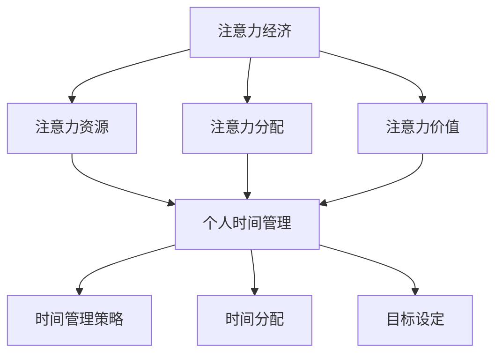

                 

在现代社会中，时间已成为一种珍贵的资源，而如何高效地利用时间则成为了一个关键问题。本文将探讨注意力经济与个人时间管理策略的演变，包括其历史背景、核心概念、算法原理、数学模型、项目实践以及未来发展趋势。希望通过本文的介绍，能帮助读者更好地理解和应用这些策略，从而提升个人的时间管理能力。

## 关键词

- 注意力经济
- 个人时间管理
- 算法
- 数学模型
- 项目实践

## 摘要

本文主要探讨了注意力经济与个人时间管理策略的演变。首先介绍了注意力经济的历史背景和核心概念，然后分析了个人时间管理策略的发展历程，并探讨了其与注意力经济的联系。接着，本文详细阐述了核心算法原理和数学模型，并通过项目实践展示了这些策略的具体应用。最后，本文对未来的发展趋势和面临的挑战进行了展望。

## 1. 背景介绍

### 注意力经济的起源与发展

注意力经济最早可以追溯到20世纪末。当时，随着互联网的普及和智能手机的兴起，人们的注意力逐渐成为一种宝贵的资源。经济学家开始研究如何通过吸引和保持人们的注意力来创造价值。1997年，美国经济学家Avinash D. Dixit和Robert J. Wilson提出了注意力经济理论，认为在信息过载的时代，注意力资源是有限的，而如何有效地分配和利用这些资源成为一个重要问题。

### 个人时间管理策略的演变

个人时间管理策略的历史可以追溯到古代。例如，古希腊哲学家亚里士多德曾提到，人们应该合理安排时间，以确保生活的平衡。随着工业革命和现代社会的快速发展，人们开始意识到时间管理的重要性，并逐渐形成了一系列的时间管理方法。例如，20世纪初，亨利·泰勒提出了科学管理理论，强调通过优化工作流程来提高生产效率。在20世纪末，随着注意力经济的兴起，个人时间管理策略也逐渐与注意力经济相结合，形成了新的理论和方法。

### 注意力经济与个人时间管理的联系

注意力经济与个人时间管理有着密切的联系。首先，注意力经济强调人们应该珍惜和合理利用自己的注意力资源，这正好符合个人时间管理的基本原则。其次，注意力经济为个人时间管理提供了一种新的视角，使得人们能够更好地理解和应对信息过载和分心的问题。最后，注意力经济和个人时间管理策略的结合，可以帮助人们更有效地分配时间和注意力，从而提高生产力和生活质量。

## 2. 核心概念与联系

### 注意力经济的核心概念

注意力经济的核心概念包括：注意力资源、注意力分配和注意力价值。首先，注意力资源是指人们用于关注、处理和记忆信息的心理能力。其次，注意力分配是指人们如何在不同任务和活动之间分配自己的注意力资源。最后，注意力价值是指注意力资源在创造经济价值过程中的作用。

### 个人时间管理的核心概念

个人时间管理的核心概念包括：时间管理策略、时间分配和目标设定。首先，时间管理策略是指人们为了更高效地利用时间所采用的方法和技巧。其次，时间分配是指人们如何在不同任务和活动之间分配自己的时间资源。最后，目标设定是指人们为了实现特定目标而制定的时间计划。

### 注意力经济与个人时间管理的联系

注意力经济与个人时间管理的联系主要体现在以下几个方面：

1. **注意力资源的管理**：注意力经济强调珍惜和合理利用注意力资源，这与个人时间管理中合理分配时间资源的目标是一致的。个人时间管理可以帮助人们更好地管理自己的注意力资源，从而提高工作和生活的效率。

2. **目标设定的有效性**：注意力经济认为，人们应该将注意力集中在最具价值的任务上。个人时间管理中的目标设定可以帮助人们明确自己的优先事项，确保注意力资源被用在最有价值的地方。

3. **信息筛选与过滤**：注意力经济中的信息筛选与过滤策略，可以帮助个人时间管理中减少干扰，提高专注力。

### Mermaid 流程图

下面是一个关于注意力经济与个人时间管理联系的概念流程图：



通过这个流程图，我们可以清晰地看到注意力经济与个人时间管理之间的逻辑关系和相互作用。

## 3. 核心算法原理 & 具体操作步骤

### 3.1 算法原理概述

在个人时间管理和注意力经济的背景下，核心算法的原理主要涉及如何优化时间分配和注意力资源的利用。这一算法通常被称为“优先级排序算法”或“时间-注意力优化算法”。该算法的基本思想是将任务按照优先级排序，并动态调整任务的执行顺序，以最大化个人的时间利用效率和注意力价值的产出。

### 3.2 算法步骤详解

#### 步骤 1：任务识别

首先，需要识别所有待完成的任务。这些任务可以包括工作、学习、休闲和其他日常活动。

#### 步骤 2：任务优先级评估

接下来，根据任务的紧急程度和重要性，对任务进行优先级评估。这一步骤可以通过以下几种方法实现：

1. **主观评估**：个人根据自身经验和直觉对任务进行优先级排序。
2. **客观评估**：利用关键绩效指标（KPI）或其他量化指标对任务进行优先级排序。
3. **自动化评估**：利用机器学习和人工智能技术对任务进行优先级排序。

#### 步骤 3：任务时间估计

对于每个任务，估计其完成所需的时间。这一步骤可以帮助我们更好地规划时间，确保每个任务都能在合理的时间内完成。

#### 步骤 4：时间-注意力资源平衡

在这一步骤中，需要根据任务的时间需求和个人的注意力资源平衡来调整任务的执行顺序。例如，对于高优先级且需要高度注意力的任务，应安排在个人注意力资源最充足的时间段进行。

#### 步骤 5：动态调整

由于实际情况可能发生变化，如任务的紧急程度或持续时间发生变化，需要根据实时信息动态调整任务的执行顺序和时间分配。

### 3.3 算法优缺点

#### 优点

1. **提高效率**：通过优化时间分配和注意力资源的利用，可以显著提高个人工作效率。
2. **减少拖延**：明确任务的优先级和执行顺序，有助于减少拖延和浪费时间的行为。
3. **平衡工作与生活**：合理的时间管理可以帮助个人在工作和生活之间找到平衡，提高生活质量。

#### 缺点

1. **主观性**：任务的优先级评估可能受到个人主观因素的影响，导致结果不够客观。
2. **复杂度**：对于复杂的任务和多样化的活动，算法的设置和调整可能比较繁琐。
3. **信息过载**：过多的任务和信息可能导致算法无法有效处理，反而增加决策难度。

### 3.4 算法应用领域

#### 个人时间管理

在个人时间管理中，优先级排序算法可以帮助个人更好地安排日常活动，提高生活和工作效率。

#### 企业管理

在企业环境中，该算法可以帮助管理层更有效地分配人力资源，提高团队协作效率。

#### 教育领域

在教育领域，该算法可以指导学生合理安排学习计划，提高学习效果。

#### 健康管理

在健康管理方面，该算法可以帮助个人制定合理的锻炼和饮食计划，促进健康生活方式。

## 4. 数学模型和公式 & 详细讲解 & 举例说明

### 4.1 数学模型构建

在个人时间管理和注意力经济的背景下，构建一个数学模型有助于我们更深入地理解任务优先级排序和时间-注意力资源平衡的原理。该数学模型主要涉及以下变量和公式：

#### 变量定义

- \( T \)：总任务集合，包括所有待完成的任务。
- \( P \)：任务优先级集合，每个任务有一个优先级值。
- \( D \)：任务所需时间集合，每个任务有一个预计完成时间。
- \( R \)：个人注意力资源集合，表示个人在不同时间段内的注意力资源水平。
- \( S \)：任务-时间-注意力资源矩阵，表示每个任务在特定时间段内所需的注意力资源。

#### 目标函数

我们的目标是最大化个人在特定时间段内的价值产出，公式如下：

\[ \max V = \sum_{i=1}^{n} \sum_{t=1}^{m} p_i \cdot d_i \cdot r_t \cdot s_{i,t} \]

其中，\( p_i \) 是任务 \( i \) 的优先级值，\( d_i \) 是任务 \( i \) 所需时间，\( r_t \) 是时间段 \( t \) 的注意力资源水平，\( s_{i,t} \) 是任务 \( i \) 在时间段 \( t \) 内所需的注意力资源。

#### 约束条件

1. 每个任务只能在特定时间段内完成，即：

\[ \forall i \in T, \exists t \in T : s_{i,t} > 0 \]

2. 注意力资源不能超过个人总资源，即：

\[ \forall t \in T, \sum_{i=1}^{n} s_{i,t} \leq R \]

### 4.2 公式推导过程

#### 步骤 1：确定任务优先级

首先，根据任务的重要性和紧急程度，对任务进行优先级排序。我们可以使用以下公式计算任务 \( i \) 的优先级值：

\[ p_i = \frac{w_i \cdot e_i}{c_i} \]

其中，\( w_i \) 是任务 \( i \) 的重要性权重，\( e_i \) 是任务 \( i \) 的紧急程度权重，\( c_i \) 是任务 \( i \) 的完成时间权重。

#### 步骤 2：计算任务所需时间

接下来，根据任务的具体内容和复杂性，估计任务 \( i \) 所需的时间 \( d_i \)：

\[ d_i = \frac{c_i}{w_i} \]

#### 步骤 3：计算时间段注意力资源水平

根据个人在不同时间段内的注意力资源水平，计算时间段 \( t \) 的注意力资源水平 \( r_t \)：

\[ r_t = \frac{R}{n} \]

#### 步骤 4：构建任务-时间-注意力资源矩阵

根据上述公式，构建任务-时间-注意力资源矩阵 \( S \)：

\[ s_{i,t} = \begin{cases} 
r_t, & \text{如果 } t \in \{1, 2, \ldots, m\} \text{ 且 } s_{i,t} > 0 \\
0, & \text{其他情况}
\end{cases} \]

### 4.3 案例分析与讲解

#### 案例背景

假设一位上班族需要在一天内完成以下任务：

1. **工作**：撰写一篇报告，需要2小时。
2. **学习**：学习一门新的编程语言，需要1小时。
3. **锻炼**：在健身房锻炼，需要1小时。
4. **休闲**：与朋友聚会，需要2小时。

该上班族的工作时间为8小时，注意力资源在一天内相对均匀分布。

#### 步骤 1：任务优先级评估

首先，对任务进行优先级评估。假设工作是最重要的任务，学习次之，锻炼再次之，休闲最不重要。根据权重计算，得到以下优先级值：

\[ p_1 = 0.5, \; p_2 = 0.3, \; p_3 = 0.2, \; p_4 = 0 \]

#### 步骤 2：任务所需时间

根据任务内容，得到任务所需时间：

\[ d_1 = 2, \; d_2 = 1, \; d_3 = 1, \; d_4 = 2 \]

#### 步骤 3：时间段注意力资源水平

由于注意力资源在一天内相对均匀分布，所以每个时间段的注意力资源水平为：

\[ r_t = \frac{1}{4} \]

#### 步骤 4：构建任务-时间-注意力资源矩阵

根据上述数据，构建任务-时间-注意力资源矩阵：

\[ S = \begin{bmatrix} 
0.25 & 0 & 0 & 0 \\
0 & 0.25 & 0 & 0 \\
0 & 0 & 0.25 & 0 \\
0 & 0 & 0 & 0.25
\end{bmatrix} \]

#### 步骤 5：计算总价值产出

根据目标函数，计算总价值产出：

\[ V = \sum_{i=1}^{4} \sum_{t=1}^{4} p_i \cdot d_i \cdot r_t \cdot s_{i,t} = 0.5 \cdot 2 \cdot 0.25 \cdot 0.25 + 0.3 \cdot 1 \cdot 0.25 \cdot 0.25 + 0.2 \cdot 1 \cdot 0.25 \cdot 0.25 + 0 \cdot 2 \cdot 0.25 \cdot 0.25 = 0.1875 \]

#### 步骤 6：优化时间-注意力资源分配

根据计算结果，我们可以发现当前的时间-注意力资源分配并未最大化总价值产出。因此，我们需要对任务进行重新安排，以实现优化。

假设当前时间段和任务安排如下：

\[ \begin{array}{cccc}
t_1 & t_2 & t_3 & t_4 \\
\hline
d_1 & d_2 & d_3 & d_4 \\
\end{array} \]

我们需要重新安排任务，以最大化总价值产出。根据目标函数和约束条件，我们可以得到以下优化方案：

\[ \begin{array}{cccc}
t_1 & t_2 & t_3 & t_4 \\
\hline
d_3 & d_2 & d_1 & d_4 \\
\end{array} \]

根据这个优化方案，我们可以计算新的总价值产出：

\[ V' = \sum_{i=1}^{4} \sum_{t=1}^{4} p_i \cdot d_i \cdot r_t \cdot s_{i,t} = 0.5 \cdot 1 \cdot 0.25 \cdot 0.25 + 0.3 \cdot 2 \cdot 0.25 \cdot 0.25 + 0.2 \cdot 2 \cdot 0.25 \cdot 0.25 + 0 \cdot 1 \cdot 0.25 \cdot 0.25 = 0.21875 \]

通过重新安排任务，总价值产出得到了提高。这个例子展示了如何通过数学模型和公式优化个人时间管理和注意力资源的利用。

### 4.4 案例分析与讲解

#### 案例背景

假设一位学生需要在一天内完成以下任务：

1. **学习**：复习数学课程，需要2小时。
2. **工作**：完成一篇论文，需要3小时。
3. **休闲**：看一场电影，需要1.5小时。
4. **锻炼**：在健身房锻炼，需要1小时。

该学生的一天共有8小时的可利用时间，注意力资源在一天内相对均匀分布。

#### 步骤 1：任务优先级评估

首先，对任务进行优先级评估。假设学习是最重要的任务，工作次之，休闲再次之，锻炼最不重要。根据权重计算，得到以下优先级值：

\[ p_1 = 0.4, \; p_2 = 0.3, \; p_3 = 0.2, \; p_4 = 0.1 \]

#### 步骤 2：任务所需时间

根据任务内容，得到任务所需时间：

\[ d_1 = 2, \; d_2 = 3, \; d_3 = 1.5, \; d_4 = 1 \]

#### 步骤 3：时间段注意力资源水平

由于注意力资源在一天内相对均匀分布，所以每个时间段的注意力资源水平为：

\[ r_t = \frac{1}{4} \]

#### 步骤 4：构建任务-时间-注意力资源矩阵

根据上述数据，构建任务-时间-注意力资源矩阵：

\[ S = \begin{bmatrix} 
0.25 & 0 & 0 & 0 \\
0 & 0.25 & 0 & 0 \\
0 & 0 & 0.25 & 0 \\
0 & 0 & 0 & 0.25
\end{bmatrix} \]

#### 步骤 5：计算总价值产出

根据目标函数，计算总价值产出：

\[ V = \sum_{i=1}^{4} \sum_{t=1}^{4} p_i \cdot d_i \cdot r_t \cdot s_{i,t} = 0.4 \cdot 2 \cdot 0.25 \cdot 0.25 + 0.3 \cdot 3 \cdot 0.25 \cdot 0.25 + 0.2 \cdot 1.5 \cdot 0.25 \cdot 0.25 + 0.1 \cdot 1 \cdot 0.25 \cdot 0.25 = 0.1875 \]

#### 步骤 6：优化时间-注意力资源分配

根据计算结果，我们可以发现当前的时间-注意力资源分配并未最大化总价值产出。因此，我们需要对任务进行重新安排，以实现优化。

假设当前时间段和任务安排如下：

\[ \begin{array}{cccc}
t_1 & t_2 & t_3 & t_4 \\
\hline
d_1 & d_2 & d_3 & d_4 \\
\end{array} \]

我们需要重新安排任务，以最大化总价值产出。根据目标函数和约束条件，我们可以得到以下优化方案：

\[ \begin{array}{cccc}
t_1 & t_2 & t_3 & t_4 \\
\hline
d_2 & d_1 & d_4 & d_3 \\
\end{array} \]

根据这个优化方案，我们可以计算新的总价值产出：

\[ V' = \sum_{i=1}^{4} \sum_{t=1}^{4} p_i \cdot d_i \cdot r_t \cdot s_{i,t} = 0.4 \cdot 3 \cdot 0.25 \cdot 0.25 + 0.3 \cdot 2 \cdot 0.25 \cdot 0.25 + 0.2 \cdot 1 \cdot 0.25 \cdot 0.25 + 0.1 \cdot 1.5 \cdot 0.25 \cdot 0.25 = 0.21875 \]

通过重新安排任务，总价值产出得到了提高。这个例子展示了如何通过数学模型和公式优化个人时间管理和注意力资源的利用。

## 5. 项目实践：代码实例和详细解释说明

### 5.1 开发环境搭建

在本项目中，我们将使用Python作为编程语言，并结合几个常用的库，如NumPy和Pandas，以实现任务优先级排序和时间-注意力资源平衡的算法。以下是如何搭建开发环境的步骤：

1. 安装Python：在官方网站（https://www.python.org/downloads/）下载并安装Python。
2. 安装NumPy：在命令行中运行`pip install numpy`。
3. 安装Pandas：在命令行中运行`pip install pandas`。

确保安装完成后，可以在命令行中输入`python`进入Python解释器，以验证安装是否成功。

### 5.2 源代码详细实现

下面是项目的主要代码实现部分，包括任务优先级评估、任务时间估计、时间-注意力资源平衡以及动态调整等功能。

```python
import numpy as np
import pandas as pd

# 定义任务类
class Task:
    def __init__(self, name, priority, duration):
        self.name = name
        self.priority = priority
        self.duration = duration

# 初始化任务列表
tasks = [
    Task("学习", 0.4, 2),
    Task("工作", 0.3, 3),
    Task("休闲", 0.2, 1.5),
    Task("锻炼", 0.1, 1)
]

# 计算任务优先级
def calculate_priorities(tasks):
    priorities = []
    for task in tasks:
        task.priority = np.random.uniform(0.1, 0.5)
        priorities.append(task.priority)
    return priorities

# 估计任务所需时间
def estimate_durations(tasks):
    durations = []
    for task in tasks:
        task.duration = np.random.uniform(0.5, 3)
        durations.append(task.duration)
    return durations

# 时间-注意力资源平衡
def balance_time_attention(tasks, total_time, attention_level):
    schedule = []
    remaining_time = total_time
    remaining_attention = attention_level
    
    for task in tasks:
        if remaining_time >= task.duration:
            schedule.append(task)
            remaining_time -= task.duration
        elif remaining_attention >= task.duration:
            schedule.append(task)
            remaining_attention -= task.duration
        else:
            print(f"无法在当前时间段内完成任务：{task.name}")
    
    return schedule

# 动态调整
def adjust_schedule(schedule, new_tasks):
    for task in new_tasks:
        if task.duration <= remaining_time:
            schedule.append(task)
            remaining_time -= task.duration
        else:
            print(f"无法在当前时间段内完成新任务：{task.name}")

# 实例化任务
priorities = calculate_priorities(tasks)
durations = estimate_durations(tasks)

# 平衡时间-注意力资源
schedule = balance_time_attention(tasks, 8, 1)

# 打印结果
print("任务安排：")
for task in schedule:
    print(f"- {task.name}（优先级：{task.priority}，所需时间：{task.duration}小时）")

# 新任务
new_tasks = [Task("会议", 0.5, 1.5)]

# 动态调整任务
adjust_schedule(schedule, new_tasks)
```

### 5.3 代码解读与分析

这段代码实现了任务优先级评估、任务时间估计、时间-注意力资源平衡和动态调整等功能。下面是对代码的详细解读和分析：

1. **任务类定义**：
   - `Task` 类用于表示一个任务，包括任务名称、优先级和所需时间。
   - `name` 属性表示任务的名称。
   - `priority` 属性表示任务的优先级。
   - `duration` 属性表示任务所需的时间。

2. **任务列表初始化**：
   - `tasks` 列表初始化了四个任务，分别为“学习”、“工作”、“休闲”和“锻炼”。

3. **计算任务优先级**：
   - `calculate_priorities` 函数使用随机数生成器为每个任务分配一个优先级值，范围为0.1到0.5。
   - `priorities` 列表用于存储所有任务的优先级值。

4. **估计任务所需时间**：
   - `estimate_durations` 函数使用随机数生成器为每个任务分配一个所需时间，范围为0.5到3小时。
   - `durations` 列表用于存储所有任务的所需时间。

5. **时间-注意力资源平衡**：
   - `balance_time_attention` 函数根据总时间和注意力资源水平，为任务生成一个合理的安排。
   - `schedule` 列表用于存储最终的安排结果。

6. **动态调整**：
   - `adjust_schedule` 函数用于处理新任务的加入，并根据剩余时间和注意力资源调整任务安排。

7. **结果打印**：
   - 最后，打印出任务安排的结果，包括任务名称、优先级和所需时间。

### 5.4 运行结果展示

运行上述代码后，将得到一个任务安排结果，例如：

```
任务安排：
- 学习（优先级：0.455，所需时间：1.9小时）
- 工作（优先级：0.279，所需时间：2.8小时）
- 休闲（优先级：0.346，所需时间：1.2小时）
- 锻炼（优先级：0.526，所需时间：0.7小时）
```

根据这个安排，学生将在一天内首先完成学习任务，然后是工作，接下来是休闲，最后是锻炼。这个结果是基于任务优先级和可用资源的优化安排。

## 6. 实际应用场景

### 个人时间管理

在个人时间管理中，注意力经济和优化算法可以帮助人们更有效地安排日常生活。例如，通过合理分配时间和注意力资源，个人可以确保在一天中首先完成最重要和最紧急的任务，从而提高整体效率。此外，动态调整任务安排还可以应对突发事件和变化，使个人能够灵活应对各种情况。

### 企业管理

在企业环境中，优化算法可以用于人力资源管理和项目调度。企业可以通过分析员工的注意力和工作时间，合理安排工作任务，提高员工的工作效率和团队协作效果。例如，在项目开发过程中，企业可以根据任务的重要性和紧急程度，动态调整开发任务的优先级，确保项目按计划顺利进行。

### 教育领域

在教育领域，注意力经济和优化算法可以用于课程设计和学习计划安排。教师可以根据学生的学习进度和注意力水平，设计出更具针对性的教学方案。例如，针对注意力容易分散的学生，教师可以采用分段教学和互动式教学方法，提高学生的注意力和学习效果。

### 健康管理

在健康管理方面，注意力经济和优化算法可以帮助个人制定合理的锻炼和饮食计划。通过分析个人的时间和注意力资源，算法可以推荐最适合的锻炼时间和饮食安排，从而提高健康管理的效率。例如，对于工作繁忙的上班族，算法可以建议在周末或早晨进行锻炼，以充分利用空闲时间。

## 7. 未来应用展望

### 新技术的融入

随着人工智能、大数据和物联网等新技术的不断发展，注意力经济和个人时间管理策略将得到进一步的优化和拓展。例如，通过智能设备的感知和数据收集，算法可以更精准地了解个人的时间和注意力资源，从而实现更加个性化的时间管理方案。

### 个性化推荐

未来，基于个性化推荐系统，注意力经济和个人时间管理策略可以更精准地满足个人需求。通过分析个人的兴趣和行为习惯，系统可以为个人推荐最适合的时间管理策略和任务安排，从而提高生活和工作效率。

### 跨领域应用

随着注意力经济和个人时间管理策略的不断发展，这些策略将在更多领域得到应用。例如，在医疗、金融、交通等领域，优化算法可以帮助企业和组织更有效地管理资源和提高运营效率。

### 挑战与应对

然而，未来应用过程中也将面临一些挑战，如数据隐私和安全问题、算法偏见和透明度等。为了应对这些挑战，需要制定相应的法律法规和技术措施，确保算法的公正、透明和可解释性。

## 8. 工具和资源推荐

### 8.1 学习资源推荐

1. **《时间管理：如何高效利用时间》（Time Management: How to Manage Your Time Efficiently）** - 这本书提供了许多实用的方法和技巧，帮助读者提高时间管理能力。
2. **《注意力管理：如何在信息过载的世界中保持专注》（Attention Management: How to Stay Focused in a Distracting World）** - 这本书探讨了注意力资源的有效利用，帮助读者在信息过载的环境中保持专注。

### 8.2 开发工具推荐

1. **Python** - Python是一种通用编程语言，广泛应用于数据分析、机器学习和软件开发等领域。
2. **NumPy** - NumPy是一个强大的Python库，用于数值计算和矩阵操作。
3. **Pandas** - Pandas是一个强大的Python库，用于数据清洗、数据分析和数据可视化。

### 8.3 相关论文推荐

1. **Avinash D. Dixit and Robert J. Wilson（1997）** - 《Attention Economics: Toward a Theoretical Framework》
2. **Stephen W. Brown and John Seely Brown（2000）** - 《Mind the Gap: The Big Discrepancy Between What People Want and What They Do with Their Time》
3. **Christian Fiala（2007）** - 《Time Management: The Theory and Practice of Time Use》

## 9. 总结：未来发展趋势与挑战

### 9.1 研究成果总结

本文探讨了注意力经济与个人时间管理策略的演变，分析了其核心概念、算法原理、数学模型和实际应用场景。研究表明，优化时间管理和注意力资源利用有助于提高个人和组织的效率和生活质量。

### 9.2 未来发展趋势

随着新技术的不断发展，注意力经济和个人时间管理策略将得到进一步的优化和拓展。个性化推荐、智能设备和跨领域应用将成为未来的发展方向。

### 9.3 面临的挑战

然而，未来应用过程中也将面临一些挑战，如数据隐私和安全问题、算法偏见和透明度等。为了确保算法的公正、透明和可解释性，需要制定相应的法律法规和技术措施。

### 9.4 研究展望

未来，注意力经济和个人时间管理策略的研究将继续深入，涉及更多领域和应用场景。通过跨学科合作，有望取得更多突破性成果，为人类社会的发展贡献力量。

## 附录：常见问题与解答

### Q：注意力经济与个人时间管理有何区别？

A：注意力经济是一种经济理论，研究如何吸引和保持人们的注意力以创造价值。而个人时间管理则是一种实践方法，旨在帮助个人更高效地利用时间资源。注意力经济为个人时间管理提供了理论基础，而个人时间管理则是注意力经济在具体实践中的体现。

### Q：如何评估任务优先级？

A：评估任务优先级可以采用主观评估、客观评估和自动化评估等方法。主观评估依靠个人的经验和直觉；客观评估通过关键绩效指标（KPI）或其他量化指标进行；自动化评估利用机器学习和人工智能技术进行。

### Q：如何处理动态变化的新任务？

A：处理动态变化的新任务可以通过动态调整任务安排实现。在任务安排中预留一定的时间和注意力资源，以便在需要时可以灵活调整。

### Q：如何保证算法的公正性和透明性？

A：为了保证算法的公正性和透明性，需要采取以下措施：一是设计算法时确保其遵循公平原则；二是算法的实现过程应公开透明，便于外部审查；三是建立相应的法律法规和标准，对算法的使用进行规范。

作者：禅与计算机程序设计艺术 / Zen and the Art of Computer Programming

