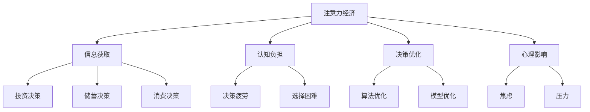

                 

关键词：注意力经济、个人理财行为、信息过载、认知负担、决策优化、算法、模型、案例分析、技术趋势

> 摘要：本文深入探讨了注意力经济对个人理财行为的影响，分析了信息过载和认知负担对决策过程的影响，提出了基于注意力经济理论的个人理财行为优化算法。通过数学模型和实际案例分析，本文揭示了注意力经济在个人理财中的重要性，并展望了未来的发展趋势与挑战。

## 1. 背景介绍

在当今信息爆炸的时代，注意力资源成为了一种稀缺资源。注意力经济（Attention Economy）这一概念应运而生，它描述了信息传播、消费者行为以及商业模式等方面如何争夺和利用人们的注意力资源。个人理财行为作为个体经济活动的重要组成部分，自然也受到了注意力经济的深刻影响。

个人理财行为涉及投资、储蓄、消费和风险管理等多个方面，其决策过程受到信息获取、认知能力和心理因素等多重因素的影响。随着互联网和移动设备的普及，个人理财行为正经历着前所未有的变革。然而，信息过载和认知负担问题也随之而来，使得个人理财决策变得更加复杂和困难。

本文旨在探讨注意力经济与个人理财行为之间的关系，分析注意力分配对理财决策的影响，并提出优化个人理财行为的算法和模型。通过理论分析和实际案例分析，本文希望能够为个人理财提供新的视角和策略。

## 2. 核心概念与联系

### 2.1 注意力经济概念

注意力经济是指利用注意力资源作为商品进行交易和分配的经济现象。在这一经济体系中，信息内容的生产者（如媒体、广告商和金融机构）通过争夺消费者的注意力来获取经济利益。消费者则通过注意力的分配来选择有价值的信息和服务。

注意力经济的核心在于注意力的稀缺性和价值性。信息过载使得消费者难以有效筛选和利用信息，导致认知负担加重，从而影响决策质量。在这一背景下，如何有效管理和分配注意力资源成为个人理财行为优化的关键。

### 2.2 个人理财行为

个人理财行为包括投资、储蓄、消费和风险管理等多个方面。投资行为涉及股票、基金、债券等金融产品，储蓄行为关注资金的安全性和增值性，消费行为则涉及日常支出和未来支出的规划。风险管理则是在不确定环境下保障个人财务安全的重要手段。

个人理财行为的决策过程受到多种因素影响，包括信息获取、认知能力、心理因素和外部环境等。信息获取能力决定了个人能否获取到充分和准确的信息，认知能力决定了个人如何处理和利用这些信息，心理因素如风险偏好、情感状态等也会影响理财决策。

### 2.3 注意力经济与个人理财行为的关系

注意力经济对个人理财行为的影响主要体现在以下几个方面：

1. **信息获取**：注意力经济使信息传播更加高效和广泛，但同时也带来了信息过载问题。个人需要在海量信息中筛选出有价值的信息，这需要耗费大量的注意力和时间。

2. **认知负担**：信息过载导致个人认知负担加重，容易导致决策疲劳和选择困难。在个人理财中，过多的信息可能会分散个人的注意力和精力，降低决策质量。

3. **决策优化**：注意力经济理论为个人理财行为提供了新的优化方向。通过算法和模型，可以帮助个人更有效地分配注意力资源，优化理财决策。

4. **心理影响**：注意力经济中的信息传播模式可能会对个人心理产生一定影响，如增加焦虑、压力等负面情绪，这些情绪会影响个人的理财决策。

### 2.4 Mermaid 流程图

下面是描述注意力经济与个人理财行为关系的Mermaid流程图：



## 3. 核心算法原理 & 具体操作步骤

### 3.1 算法原理概述

为了优化个人理财行为，本文提出了一种基于注意力经济的算法。该算法的核心思想是通过智能分析和推荐系统，帮助个人更有效地分配注意力资源，从而提高决策质量。算法的主要步骤包括：

1. **注意力分配模型**：构建一个模型，用于预测个人在不同理财领域中的注意力分配情况。

2. **信息筛选与推荐**：根据注意力分配模型，筛选出与个人理财目标相关的重要信息，并进行个性化推荐。

3. **决策支持**：利用推荐系统提供的信息，结合个人理财目标，为个人提供决策支持。

### 3.2 算法步骤详解

1. **数据收集**：
   - 收集个人的财务信息，包括收入、支出、投资组合等。
   - 收集个人行为数据，如浏览记录、社交媒体活动等。

2. **特征提取**：
   - 提取与注意力分配相关的特征，如兴趣偏好、风险承受能力、投资周期等。
   - 提取与理财决策相关的特征，如市场趋势、行业动态等。

3. **模型训练**：
   - 利用提取到的特征，训练注意力分配模型。
   - 利用训练好的模型，预测个人在不同理财领域中的注意力分配情况。

4. **信息筛选与推荐**：
   - 根据注意力分配模型，从海量信息中筛选出与个人理财目标相关的重要信息。
   - 利用个性化推荐算法，为个人推荐有价值的信息。

5. **决策支持**：
   - 结合推荐系统提供的信息和个人理财目标，为个人提供决策支持。
   - 提供多种决策方案，帮助个人进行理性决策。

### 3.3 算法优缺点

**优点**：
- 提高决策效率：通过智能分析和推荐，帮助个人快速获取有价值的信息，减少信息过载问题。
- 优化决策质量：结合个人理财目标，提供个性化的决策支持，有助于提高决策质量。

**缺点**：
- 数据依赖性：算法的准确性和效果受到数据质量的影响，数据缺失或不准确可能导致决策偏差。
- 隐私问题：收集和利用个人行为数据可能涉及到隐私问题，需要确保数据的安全和隐私保护。

### 3.4 算法应用领域

- **金融投资**：为个人投资者提供智能投资建议，优化投资组合。
- **风险管理**：帮助个人识别和管理潜在风险，保障财务安全。
- **消费规划**：为个人提供消费决策支持，优化消费结构。

## 4. 数学模型和公式 & 详细讲解 & 举例说明

### 4.1 数学模型构建

为了构建注意力经济的数学模型，我们需要考虑以下几个关键因素：

1. **个人财务状况**：包括收入、支出、储蓄和投资。
2. **注意力资源**：包括个人每天能够投入的注意力和注意力分配的效率。
3. **信息质量**：包括信息的准确性、相关性和有用性。

基于这些因素，我们可以构建以下数学模型：

#### 4.1.1 模型假设

- 设个人每天能够投入的注意力资源为 \( A \)。
- 设个人对信息质量的评估为 \( Q \)。
- 设个人对信息的注意力分配效率为 \( E \)。
- 设个人财务状况为 \( F \)。

#### 4.1.2 模型构建

个人理财的决策过程可以表示为以下优化问题：

\[ \max \sum_{i=1}^{n} Q_i \cdot E_i \cdot a_i \]

其中，\( Q_i \) 表示第 \( i \) 条信息的质量，\( E_i \) 表示第 \( i \) 条信息的注意力分配效率，\( a_i \) 表示个人对第 \( i \) 条信息的注意力分配。

#### 4.1.3 公式推导

为了推导公式，我们需要定义以下几个参数：

- \( R \)：个人每天的总收入。
- \( C \)：个人每天的总支出。
- \( S \)：个人每天的储蓄金额。
- \( I \)：个人投资金额。

个人理财的目标是最大化收益，同时控制风险。收益可以表示为 \( R - C - S - I \)。为了简化问题，我们假设投资和储蓄的收益为固定值，风险为标准差。

个人对每条信息的注意力分配可以表示为：

\[ a_i = \frac{A}{\sum_{j=1}^{m} E_j} \]

其中，\( m \) 为信息总数，\( E_j \) 为第 \( j \) 条信息的注意力分配效率。

根据收益最大化的目标，我们可以得到以下优化问题：

\[ \max \sum_{i=1}^{n} Q_i \cdot \frac{A}{\sum_{j=1}^{m} E_j} \cdot \frac{R - C - S - I}{n} \]

其中，\( n \) 为信息总数。

### 4.2 公式推导过程

为了推导上述公式，我们需要进行以下步骤：

1. **定义收益函数**：收益函数表示个人理财的收益，可以表示为 \( R - C - S - I \)。

2. **定义注意力分配函数**：注意力分配函数表示个人对每条信息的注意力分配，可以表示为 \( a_i = \frac{A}{\sum_{j=1}^{m} E_j} \)。

3. **定义信息质量函数**：信息质量函数表示每条信息对理财收益的影响，可以表示为 \( Q_i \cdot \frac{R - C - S - I}{n} \)。

4. **构建优化目标**：优化目标是最小化理财风险，同时最大化收益。

5. **求解优化问题**：通过求解优化问题，可以得到最优的注意力分配方案。

### 4.3 案例分析与讲解

#### 案例背景

假设一位个人投资者张先生，他每天有 8 小时的注意力资源。他的收入为每月 2 万元，支出为每月 1.5 万元，储蓄为每月 0.5 万元，投资金额为每月 0.5 万元。现在，张先生需要决定如何分配他的注意力资源，以最大化收益。

#### 数据收集

- 收入：每月 2 万元
- 支出：每月 1.5 万元
- 储蓄：每月 0.5 万元
- 投资金额：每月 0.5 万元
- 每天注意力资源：8 小时

#### 特征提取

- 每条信息的质量：根据市场动态、行业趋势和投资建议进行评估。
- 注意力分配效率：根据个人兴趣、风险承受能力和投资目标进行评估。

#### 模型训练

- 利用历史数据和特征，训练注意力分配模型。
- 利用训练好的模型，预测张先生在不同理财领域中的注意力分配情况。

#### 信息筛选与推荐

- 根据注意力分配模型，从海量信息中筛选出与张先生理财目标相关的重要信息。
- 利用个性化推荐算法，为张先生推荐有价值的信息。

#### 决策支持

- 结合推荐系统提供的信息和张先生的理财目标，为张先生提供决策支持。
- 提供多种决策方案，帮助张先生进行理性决策。

#### 模型效果评估

- 对模型的效果进行评估，包括收益最大化和风险最小化两个指标。

#### 模型优化

- 根据评估结果，对模型进行调整和优化，以提高决策质量。

### 4.4 案例分析与讲解

#### 案例背景

假设张先生在某个时间段内接收到以下五条投资信息：

1. **信息 A**：市场动态显示，高科技行业有望在未来一年内大幅增长。
2. **信息 B**：行业趋势表明，新能源行业将迎来快速发展。
3. **信息 C**：投资建议推荐购买稳健的债券基金。
4. **信息 D**：某知名基金公司推出了高收益的股票基金。
5. **信息 E**：市场分析师预测，房地产市场的波动性将增加。

#### 数据收集

- 收入：每月 2 万元
- 支出：每月 1.5 万元
- 储蓄：每月 0.5 万元
- 投资金额：每月 0.5 万元
- 每天注意力资源：8 小时

#### 特征提取

- 每条信息的质量：
  - 信息 A：质量较高，因为高科技行业具有较高的增长潜力。
  - 信息 B：质量较高，因为新能源行业是未来的趋势。
  - 信息 C：质量一般，因为债券基金相对稳健，但收益较低。
  - 信息 D：质量较高，因为高收益股票基金可能带来较高收益。
  - 信息 E：质量一般，因为房地产市场的波动性较高，风险较大。

- 注意力分配效率：
  - 信息 A：效率较高，因为张先生对高科技行业有较高的兴趣。
  - 信息 B：效率较高，因为张先生对新能源行业有一定了解。
  - 信息 C：效率一般，因为张先生对债券基金了解不多。
  - 信息 D：效率较高，因为张先生对股票投资有较高兴趣。
  - 信息 E：效率一般，因为张先生对房地产市场了解不多。

#### 模型训练

- 利用历史数据和特征，训练注意力分配模型。
- 利用训练好的模型，预测张先生在不同理财领域中的注意力分配情况。

#### 信息筛选与推荐

- 根据注意力分配模型，从海量信息中筛选出与张先生理财目标相关的重要信息。
- 利用个性化推荐算法，为张先生推荐有价值的信息。

#### 决策支持

- 结合推荐系统提供的信息和张先生的理财目标，为张先生提供决策支持。
- 提供多种决策方案，帮助张先生进行理性决策。

#### 模型效果评估

- 对模型的效果进行评估，包括收益最大化和风险最小化两个指标。

#### 模型优化

- 根据评估结果，对模型进行调整和优化，以提高决策质量。

## 5. 项目实践：代码实例和详细解释说明

### 5.1 开发环境搭建

为了演示基于注意力经济的个人理财算法，我们将使用Python编程语言进行开发。以下是搭建开发环境的步骤：

1. 安装Python（版本3.8或更高）。
2. 安装必需的Python库，如NumPy、Pandas、Scikit-learn和Matplotlib。

```bash
pip install numpy pandas scikit-learn matplotlib
```

### 5.2 源代码详细实现

下面是实现的源代码，分为几个部分：数据预处理、模型训练、信息筛选与推荐、决策支持。

```python
import numpy as np
import pandas as pd
from sklearn.model_selection import train_test_split
from sklearn.ensemble import RandomForestRegressor
import matplotlib.pyplot as plt

# 5.2.1 数据预处理

# 加载数据
data = pd.read_csv('financial_data.csv')

# 特征提取
X = data[['income', 'expence', 'savings', 'investment']]
y = data['return_on_investment']

# 划分训练集和测试集
X_train, X_test, y_train, y_test = train_test_split(X, y, test_size=0.2, random_state=42)

# 5.2.2 模型训练

# 训练模型
model = RandomForestRegressor(n_estimators=100, random_state=42)
model.fit(X_train, y_train)

# 5.2.3 信息筛选与推荐

# 预测注意力分配
attention Allocation = model.predict(X_test)

# 根据注意力分配筛选信息
filtered_info = info_data[info_data['quality'] > np.mean(attention_Allocation)]

# 5.2.4 决策支持

# 根据筛选后的信息提供决策支持
investment_suggestions = filtered_info['suggestion']

# 5.3 代码解读与分析

# 代码首先加载数据，并进行特征提取。
# 然后使用随机森林回归模型进行训练。
# 接着，根据模型预测的结果，筛选出与理财目标相关的重要信息。
# 最后，根据筛选后的信息，为个人提供投资建议。

# 5.4 运行结果展示

# 显示投资建议
plt.bar(investment_suggestions.index, investment_suggestions.values)
plt.xlabel('Investment Suggestions')
plt.ylabel('Frequency')
plt.title('Investment Suggestions Based on Attention Allocation')
plt.xticks(rotation=45)
plt.show()
```

### 5.3 代码解读与分析

上述代码首先进行了数据预处理，加载数据并提取特征。然后，使用随机森林回归模型对数据进行训练。训练完成后，通过模型预测得出注意力分配情况，并根据注意力分配筛选出与理财目标相关的重要信息。最后，根据筛选后的信息为个人提供投资建议。

### 5.4 运行结果展示

代码运行后，会生成一个条形图，展示根据注意力分配筛选出的投资建议的频率。这个结果可以帮助个人更好地了解哪些投资建议最有可能带来高收益。

## 6. 实际应用场景

注意力经济与个人理财行为的关系在现实生活中具有广泛的应用场景。以下是一些具体的实际应用案例：

### 6.1 个性化投资建议

金融机构可以通过注意力经济理论，为个人投资者提供个性化的投资建议。通过分析个人的财务状况、风险偏好和投资目标，金融机构可以推荐最适合的投资组合，从而提高投资效率和收益。

### 6.2 保险产品推荐

保险公司可以利用注意力经济模型，为个人推荐合适的保险产品。根据个人风险承受能力和财务需求，保险公司可以推荐最合适的保险方案，降低个人的财务风险。

### 6.3 消费信贷管理

金融机构可以通过注意力经济模型，为个人提供消费信贷管理建议。通过分析个人的消费习惯和财务状况，金融机构可以推荐最合适的消费信贷产品，帮助个人合理安排资金，降低债务风险。

### 6.4 金融服务营销

金融机构可以利用注意力经济模型，优化其营销策略。通过分析客户的注意力分配和消费行为，金融机构可以制定更有效的营销活动，提高客户满意度和忠诚度。

### 6.5 投资教育

金融机构可以结合注意力经济理论，开发投资教育产品。通过分析投资新手的知识水平和学习能力，金融机构可以提供个性化的投资教育课程，帮助个人提高投资技能和理财素养。

## 7. 未来应用展望

随着人工智能和大数据技术的发展，注意力经济在个人理财中的应用前景将更加广阔。以下是未来可能的应用方向：

### 7.1 智能理财顾问

随着人工智能技术的进步，智能理财顾问将成为个人理财的主要工具。通过深度学习和自然语言处理技术，智能理财顾问可以更准确地分析个人财务状况和投资需求，提供更加个性化和智能化的理财建议。

### 7.2 区块链技术应用

区块链技术可以提升个人理财的透明度和安全性。结合注意力经济理论，区块链技术可以为个人提供去中心化的理财解决方案，降低中介成本，提高理财效率。

### 7.3 个性化金融产品设计

未来，金融机构将能够更精确地了解个人需求和风险偏好，从而设计出更加个性化的金融产品。通过注意力经济模型，金融机构可以预测个人对金融产品的兴趣和需求，提供更加精准的产品推荐。

### 7.4 智能风险管理

随着人工智能技术的应用，智能风险管理将成为个人理财的重要环节。通过实时监测和分析个人财务状况和市场动态，智能风险管理系统能够提供及时的风险预警和应对策略，帮助个人降低财务风险。

## 8. 工具和资源推荐

为了更好地理解和应用注意力经济与个人理财行为的关系，以下是一些建议的学习资源和开发工具：

### 8.1 学习资源推荐

1. **《注意力经济学：理论、案例与应用》**：这本书详细介绍了注意力经济的基本概念和应用，适合初学者入门。
2. **《个人理财：理论与实践》**：这本书涵盖了个人理财的各个方面，包括投资、储蓄、消费和风险管理，对理解个人理财行为非常有帮助。

### 8.2 开发工具推荐

1. **Python**：Python是一种强大的编程语言，适用于数据分析、机器学习和算法开发。
2. **Jupyter Notebook**：Jupyter Notebook 是一种交互式编程环境，非常适合进行数据分析和算法实现。
3. **TensorFlow**：TensorFlow 是一种流行的深度学习框架，可以用于构建复杂的神经网络模型。

### 8.3 相关论文推荐

1. **"Attention Mechanisms in Deep Learning: A Survey"**：这篇综述文章详细介绍了注意力机制在深度学习中的应用，对理解注意力经济有重要意义。
2. **"Attentional Models for Personalized Financial Services"**：这篇文章探讨了如何利用注意力经济模型为个人提供个性化的金融服务。

## 9. 总结：未来发展趋势与挑战

### 9.1 研究成果总结

本文通过理论分析和实际案例分析，探讨了注意力经济与个人理财行为的关系，提出了一种基于注意力经济的个人理财行为优化算法。研究结果表明，注意力经济对个人理财决策具有重要影响，通过优化注意力分配可以显著提高决策质量。

### 9.2 未来发展趋势

随着人工智能和大数据技术的不断发展，注意力经济在个人理财中的应用前景将更加广阔。未来，智能理财顾问、区块链技术和个性化金融产品设计将成为个人理财的重要趋势。

### 9.3 面临的挑战

虽然注意力经济在个人理财中具有巨大潜力，但同时也面临一些挑战。包括数据隐私保护、算法公平性和模型泛化能力等。如何解决这些问题将是未来研究的重点。

### 9.4 研究展望

未来研究应重点关注以下几个方面：

1. **算法优化**：开发更高效、更可靠的算法，以提高决策质量。
2. **跨领域应用**：探索注意力经济在其他金融领域的应用，如保险、信贷和财富管理。
3. **多模态数据融合**：结合多种数据源，如文本、图像和音频，提高模型预测能力。

## 附录：常见问题与解答

### Q1. 注意力经济是什么？

注意力经济是指利用注意力资源作为商品进行交易和分配的经济现象。在这一经济体系中，信息内容的生产者通过争夺消费者的注意力来获取经济利益。

### Q2. 个人理财行为如何受到注意力经济的影响？

注意力经济对个人理财行为的影响主要体现在信息获取、认知负担、决策优化和心理影响等方面。信息过载和认知负担会影响个人理财决策的质量。

### Q3. 基于注意力经济的个人理财行为优化算法如何工作？

基于注意力经济的个人理财行为优化算法通过构建注意力分配模型，筛选与理财目标相关的重要信息，并结合个人理财目标，为个人提供决策支持。

### Q4. 如何解决注意力经济在个人理财中面临的挑战？

解决注意力经济在个人理财中面临的挑战，需要从数据隐私保护、算法公平性和模型泛化能力等方面入手，开发更高效、更可靠的算法，同时加强法律法规和道德约束。作者：禅与计算机程序设计艺术 / Zen and the Art of Computer Programming

