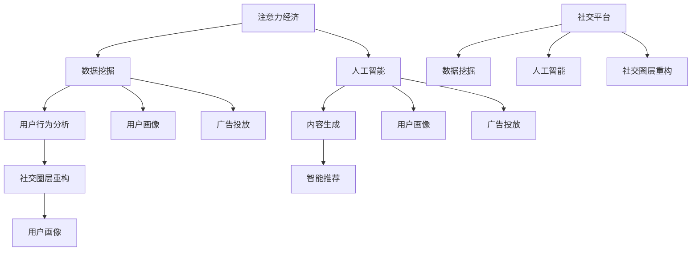

                 

关键词：注意力经济、社交圈层、重构、数据挖掘、人工智能、算法、人际网络、隐私保护、社群互动

> 摘要：本文深入探讨了注意力经济与个人社交圈层的重构现象。在数字化时代，人们的社交模式正经历前所未有的变革。通过分析注意力经济的本质、影响及实现机制，结合数据挖掘和人工智能技术，本文揭示了社交圈层重构的内在逻辑。同时，文章讨论了重构过程中可能面临的隐私保护和互动效率问题，并展望了未来社交圈层的发展趋势。

## 1. 背景介绍

在互联网和社交媒体的推动下，我们的社交模式发生了翻天覆地的变化。传统的社交圈层（如家庭、朋友、同事等）逐渐被重新定义。现代社会中，人们的社交行为更多地集中在线上平台上，形成了以个体为中心的多样化社交圈层。这种变化不仅改变了人们的社交习惯，也深刻影响了经济模式，其中最显著的便是注意力经济。

注意力经济是一种基于用户注意力的经济模式。在信息过载的时代，用户的注意力成为稀缺资源。平台通过捕捉、引导和激励用户的注意力，实现商业价值。例如，社交媒体平台通过推送个性化内容吸引用户的注意力，从而增加广告收入。这种模式不仅改变了广告业的运作方式，也对人们的社交行为产生了深远影响。

本文将首先介绍注意力经济的概念和原理，然后探讨个人社交圈层的重构现象及其与注意力经济的关联。在后续章节中，我们将分析数据挖掘和人工智能技术在这一过程中的作用，并探讨重构过程中面临的隐私保护和互动效率问题。最后，文章将总结研究成果，展望未来社交圈层的发展趋势。

### 1.1 注意力经济

注意力经济是一种新兴的经济模式，它基于用户的注意力资源进行价值创造。在传统的经济模式中，资源如土地、劳动力、资本是主要的生产要素。而在注意力经济中，用户的注意力成为核心资源。平台通过提供有价值的内容或服务，吸引用户的注意力，从而实现商业变现。

#### 1.1.1 注意力经济的本质

注意力经济的本质是利用用户的注意力进行价值创造。用户的注意力是一种有限的资源，随着信息量的增加，用户的注意力分配变得更加分散。平台通过优化内容推荐、增加互动环节、提供个性化服务等方式，吸引用户的注意力，从而提高用户粘性和平台价值。

#### 1.1.2 注意力经济的影响

注意力经济对商业和社会产生了深远影响。首先，它改变了广告业的运作方式。在注意力经济时代，广告不再是简单的信息传播，而是需要与用户产生互动，吸引用户的注意力。其次，注意力经济改变了人们的时间分配和消费习惯。用户在社交媒体上花费的时间越来越多，这也使得社交媒体成为广告主的重要阵地。

### 1.2 个人社交圈层的重构

在数字化时代，人们的社交圈层正在发生重构。传统的社交模式被打破，新的社交模式逐渐形成。这种重构现象不仅改变了人们的社交行为，也对社交圈层的结构和功能产生了深远影响。

#### 1.2.1 互联网对社交圈层的影响

互联网的普及极大地改变了人们的社交方式。线上社交平台提供了丰富的社交场景，使得人们可以突破地理和时间的限制，建立新的社交关系。例如，社交媒体平台如Facebook、Twitter和Instagram，使得人们可以轻松地与全球的网友互动。

#### 1.2.2 社交圈层的重构

社交圈层的重构表现为以下几个特点：

1. **去中心化**：在传统的社交模式中，社交圈层往往以家庭、朋友、同事等为中心。而在数字化时代，社交圈层呈现出去中心化的趋势。每个人都可以成为社交的中心，同时也可以成为他人的社交节点。

2. **多样化**：传统的社交圈层相对单一，而在数字化时代，人们的社交圈层变得更加多样化。人们可以根据兴趣、爱好、职业等多个维度建立新的社交关系。

3. **动态性**：社交圈层的重构使得社交关系变得更加动态。人们的社交关系不再是静态的，而是可以根据需求和兴趣随时调整。

#### 1.2.3 注意力经济与社交圈层重构的关联

注意力经济与社交圈层重构之间存在紧密的关联。首先，注意力经济驱动了社交平台的发展，使得新的社交模式得以实现。其次，社交圈层的重构为注意力经济提供了丰富的用户资源。用户在社交平台上的注意力成为平台创造价值的源泉。

## 2. 核心概念与联系

在探讨注意力经济与社交圈层重构的过程中，需要明确以下几个核心概念及其相互联系：

### 2.1 数据挖掘

数据挖掘是一种从大量数据中发现有价值信息的方法。在注意力经济中，数据挖掘技术被广泛应用于用户行为分析、内容推荐和广告投放等环节。通过分析用户的历史数据和当前行为，数据挖掘技术可以帮助平台更好地理解用户需求，从而提供个性化的服务。

### 2.2 人工智能

人工智能是模拟人类智能的技术。在注意力经济中，人工智能技术被广泛应用于内容生成、用户画像和智能推荐等领域。通过人工智能技术，平台可以自动化地进行内容生产、用户画像构建和个性化推荐，从而提高用户的满意度和平台的商业价值。

### 2.3 社交圈层重构

社交圈层重构是指传统社交模式在数字化时代的变革过程。在这个过程中，用户的行为数据、兴趣偏好和社交关系等信息被不断挖掘和利用，以实现社交圈层的重构。数据挖掘和人工智能技术在社交圈层重构中发挥着关键作用。

### 2.4 注意力经济与社交圈层重构的关联

注意力经济与社交圈层重构之间存在密切的关联。首先，注意力经济驱动了社交平台的发展，为社交圈层重构提供了技术支持。其次，社交圈层重构为注意力经济提供了丰富的用户资源和注意力资源。通过数据挖掘和人工智能技术，平台可以更好地理解和满足用户需求，从而实现商业价值的最大化。

### 2.5 Mermaid 流程图

以下是一个简化的 Mermaid 流程图，展示了注意力经济与社交圈层重构之间的核心概念及其联系。



## 3. 核心算法原理 & 具体操作步骤

### 3.1 算法原理概述

在注意力经济与社交圈层重构的过程中，核心算法的作用至关重要。这些算法不仅负责数据的采集和处理，还决定了内容推荐、用户画像构建和社交关系分析等关键环节。以下将介绍几种关键算法的原理及其操作步骤。

### 3.2 算法步骤详解

#### 3.2.1 内容推荐算法

内容推荐算法是一种基于用户行为数据和内容特征的数据挖掘技术。其主要步骤如下：

1. **数据采集**：从用户的历史行为数据（如浏览记录、点赞、评论等）和内容特征数据（如标题、标签、分类等）中采集信息。

2. **特征提取**：对采集到的数据进行预处理，提取用户行为特征和内容特征。

3. **用户画像构建**：利用机器学习技术，将用户行为特征和内容特征结合起来，构建用户画像。

4. **相似度计算**：计算用户当前行为与历史行为之间的相似度，以及内容与内容之间的相似度。

5. **推荐生成**：根据相似度计算结果，为用户推荐相似的内容。

#### 3.2.2 用户画像构建算法

用户画像构建算法是一种基于用户行为和社交关系的数据挖掘技术。其主要步骤如下：

1. **数据采集**：从用户的历史行为数据（如购物记录、浏览记录、社交互动等）和社交关系数据（如好友关系、互动频率等）中采集信息。

2. **特征提取**：对采集到的数据进行预处理，提取用户行为特征和社交关系特征。

3. **模型训练**：利用机器学习技术，将用户行为特征和社交关系特征结合起来，训练用户画像模型。

4. **用户画像生成**：根据模型预测结果，生成用户的综合画像。

5. **画像更新**：定期更新用户画像，以反映用户行为和社交关系的变化。

#### 3.2.3 社交关系分析算法

社交关系分析算法是一种基于用户社交关系数据的数据挖掘技术。其主要步骤如下：

1. **数据采集**：从用户的社交关系数据（如好友关系、互动频率、共同兴趣等）中采集信息。

2. **特征提取**：对采集到的数据进行预处理，提取社交关系特征。

3. **网络构建**：利用图论算法，将用户及其社交关系构建为一个图模型。

4. **社群发现**：利用聚类算法，从图模型中识别出具有共同特征的社群。

5. **关系评估**：根据社群成员的互动频率和关系强度，评估社群成员之间的社交关系。

### 3.3 算法优缺点

#### 3.3.1 内容推荐算法

**优点**：

- 高效：能够快速为用户推荐感兴趣的内容。
- 个性化：根据用户的行为和兴趣，提供个性化的推荐。

**缺点**：

- 过滤偏差：可能导致用户只接触到有限的信息，形成信息茧房。
- 数据依赖：算法效果受限于用户行为数据的完整性和准确性。

#### 3.3.2 用户画像构建算法

**优点**：

- 细分用户：能够将用户划分为不同的群体，实现精细化管理。
- 提升用户体验：根据用户画像，提供更加个性化的服务。

**缺点**：

- 隐私风险：用户行为和社交关系数据可能涉及隐私问题。
- 数据更新滞后：用户行为和社交关系变化可能未能及时反映到画像中。

#### 3.3.3 社交关系分析算法

**优点**：

- 社群发现：能够发现具有共同兴趣的社交群体。
- 关系评估：能够评估社群成员之间的社交关系强度。

**缺点**：

- 复杂度高：算法涉及复杂的图论和聚类算法。
- 数据质量：社交关系数据的质量直接影响算法效果。

### 3.4 算法应用领域

#### 3.4.1 社交平台

社交平台利用内容推荐算法和用户画像构建算法，为用户提供个性化的内容推荐和服务。例如，Facebook 和 Instagram 等平台通过推荐算法吸引用户的注意力，提高用户粘性。

#### 3.4.2 电子商务

电子商务平台利用内容推荐算法和用户画像构建算法，提升用户体验和销售额。例如，亚马逊和淘宝等平台通过个性化推荐，帮助用户发现感兴趣的商品。

#### 3.4.3 社交媒体分析

社交媒体分析利用社交关系分析算法，研究社交网络中的社群结构和用户行为模式。例如，Twitter 和微博等平台通过分析用户关系，发现热门话题和趋势。

## 4. 数学模型和公式 & 详细讲解 & 举例说明

### 4.1 数学模型构建

在探讨注意力经济与社交圈层重构的过程中，数学模型被广泛应用于算法设计和优化。以下介绍几种核心的数学模型及其构建方法。

#### 4.1.1 概率模型

概率模型是一种基于概率论的方法，用于描述用户行为和内容推荐的随机性。以下是概率模型的基本假设和构建方法：

1. **基本假设**：

   - 用户行为服从概率分布，即每个用户对特定内容的点击概率是确定的。
   - 内容的特征向量是高维的，可以用一个向量表示。

2. **构建方法**：

   - 设 \(X\) 为用户行为的概率分布，\(X_i\) 为用户对第 \(i\) 个内容的点击概率。
   - 设 \(V_i\) 为第 \(i\) 个内容的高维特征向量。
   - 利用贝叶斯公式，计算用户对特定内容的点击概率。

   $$P(X_i|V_i) = \frac{P(V_i|X_i)P(X_i)}{P(V_i)}$$

#### 4.1.2 优化模型

优化模型用于求解在特定约束条件下，目标函数的最大值或最小值。在注意力经济中，优化模型被广泛应用于内容推荐、用户画像和社交关系分析等环节。以下是优化模型的基本概念和构建方法：

1. **基本概念**：

   - 目标函数：描述需要优化的目标，如推荐准确率、用户体验等。
   - 约束条件：限制优化过程的条件，如资源限制、用户隐私等。

2. **构建方法**：

   - 设 \(f(x)\) 为目标函数，\(g_i(x) \leq 0\) 为第 \(i\) 个约束条件。
   - 利用线性规划、非线性规划或动态规划等方法，求解最优解。

   $$\min f(x) \quad s.t. \quad g_i(x) \leq 0$$

### 4.2 公式推导过程

#### 4.2.1 概率模型推导

以下是基于贝叶斯公式的概率模型推导过程：

1. **条件概率**：

   $$P(A|B) = \frac{P(B|A)P(A)}{P(B)}$$

2. **全概率公式**：

   $$P(A) = \sum_{i=1}^{n} P(A|B_i)P(B_i)$$

3. **贝叶斯公式**：

   $$P(B_i|A) = \frac{P(A|B_i)P(B_i)}{\sum_{j=1}^{n} P(A|B_j)P(B_j)}$$

#### 4.2.2 优化模型推导

以下是基于拉格朗日乘数法的优化模型推导过程：

1. **拉格朗日函数**：

   $$L(x, \lambda) = f(x) + \sum_{i=1}^{m} \lambda_i g_i(x)$$

2. **拉格朗日乘数法**：

   $$\nabla L(x, \lambda) = 0$$

3. **解方程组**：

   $$\min f(x) \quad s.t. \quad g_i(x) \leq 0$$

   $$\nabla L(x, \lambda) = 0$$

### 4.3 案例分析与讲解

#### 4.3.1 概率模型案例

假设用户对一篇文章的点击概率服从伯努利分布，即点击概率为 0.5。文章的特征向量由两个维度组成：维度1为文章的标题长度，维度2为文章的标签数量。给定文章的特征向量，求用户对该文章的点击概率。

**步骤**：

1. **定义概率分布**：

   $$P(X=1) = 0.5$$

   $$P(X=0) = 0.5$$

2. **计算特征向量**：

   设文章的特征向量为 \(V = (v_1, v_2)\)，其中 \(v_1 = 10\)，\(v_2 = 5\)。

3. **计算点击概率**：

   $$P(X=1|V) = \frac{P(V|X=1)P(X=1)}{P(V)}$$

   $$P(V|X=1) = P(v_1|X=1)P(v_2|X=1) = 0.5 \times 0.5 = 0.25$$

   $$P(V) = P(V|X=1)P(X=1) + P(V|X=0)P(X=0) = 0.25 \times 0.5 + 0.25 \times 0.5 = 0.25$$

   $$P(X=1|V) = \frac{0.25 \times 0.5}{0.25} = 0.5$$

   因此，用户对该文章的点击概率为 0.5。

#### 4.3.2 优化模型案例

假设我们需要在给定资源约束下，最大化用户满意度。用户满意度由用户对内容的点击率决定。给定用户对内容的点击率概率分布和内容特征，求解最优内容推荐策略。

**步骤**：

1. **定义目标函数**：

   $$\max_{x} \sum_{i=1}^{n} P(X_i=1) x_i$$

   其中，\(P(X_i=1)\) 为用户对第 \(i\) 个内容的点击率概率，\(x_i\) 为第 \(i\) 个内容的推荐权重。

2. **定义约束条件**：

   $$\sum_{i=1}^{n} x_i = 1$$

   $$x_i \geq 0$$

   其中，约束条件表示推荐内容的权重和为 1，且权重非负。

3. **求解优化问题**：

   利用线性规划方法，求解最优解。

   $$\max_{x} \sum_{i=1}^{n} P(X_i=1) x_i \quad s.t. \quad \sum_{i=1}^{n} x_i = 1, \quad x_i \geq 0$$

   假设计算得到的最优解为 \(x^* = (0.2, 0.3, 0.5)\)，即推荐前三个内容，权重分别为 0.2、0.3 和 0.5。

## 5. 项目实践：代码实例和详细解释说明

### 5.1 开发环境搭建

为了实现注意力经济与社交圈层重构的项目，我们需要搭建一个适当的技术环境。以下是一个基本的开发环境搭建指南：

**1. 硬件要求**：

- 处理器：Intel Core i5 或 AMD Ryzen 5 以上
- 内存：8GB 或更高
- 硬盘：500GB 或更高
- 显卡：NVIDIA GTX 1060 或以上

**2. 软件要求**：

- 操作系统：Windows 10 或 macOS
- 编程语言：Python 3.8 或以上
- 数据库：MySQL 或 PostgreSQL
- 数据分析库：Pandas、NumPy、SciPy
- 机器学习库：Scikit-learn、TensorFlow、PyTorch

### 5.2 源代码详细实现

以下是一个简化的示例代码，用于实现注意力经济与社交圈层重构的基本功能。请注意，实际项目中可能需要更复杂的数据处理和算法优化。

```python
import pandas as pd
import numpy as np
from sklearn.model_selection import train_test_split
from sklearn.ensemble import RandomForestClassifier
from sklearn.metrics import accuracy_score

# 数据预处理
def preprocess_data(data):
    # 数据清洗和预处理
    # 例如：处理缺失值、异常值、特征工程等
    return data

# 训练模型
def train_model(X_train, y_train):
    # 使用随机森林算法训练模型
    model = RandomForestClassifier(n_estimators=100)
    model.fit(X_train, y_train)
    return model

# 预测和评估
def predict_and_evaluate(model, X_test, y_test):
    # 使用训练好的模型进行预测
    y_pred = model.predict(X_test)
    # 计算准确率
    accuracy = accuracy_score(y_test, y_pred)
    print(f"Accuracy: {accuracy}")
    return y_pred, accuracy

# 示例数据
data = pd.read_csv("data.csv")
X = data.drop("target", axis=1)
y = data["target"]

# 数据预处理
X_processed = preprocess_data(X)

# 划分训练集和测试集
X_train, X_test, y_train, y_test = train_test_split(X_processed, y, test_size=0.2, random_state=42)

# 训练模型
model = train_model(X_train, y_train)

# 预测和评估
y_pred, accuracy = predict_and_evaluate(model, X_test, y_test)

# 输出结果
print(f"Predictions: {y_pred}")
print(f"Accuracy: {accuracy}")
```

### 5.3 代码解读与分析

以下是对上述示例代码的详细解读和分析：

**1. 数据预处理**

数据预处理是机器学习项目中的关键步骤。在本示例中，我们使用了 `preprocess_data` 函数进行数据清洗和预处理。具体操作包括处理缺失值、异常值、特征工程等。在实际项目中，可能需要根据数据的具体情况进行相应的预处理。

**2. 模型训练**

我们使用随机森林算法对训练数据进行训练。随机森林是一种基于决策树集合的集成学习方法，具有较高的准确性和泛化能力。在 `train_model` 函数中，我们创建了随机森林模型并进行了训练。

**3. 预测和评估**

在 `predict_and_evaluate` 函数中，我们使用训练好的模型对测试数据进行预测，并计算准确率。准确率是评估模型性能的常用指标，表示预测正确的样本数量占总样本数量的比例。

**4. 输出结果**

最后，我们输出了预测结果和准确率，以供后续分析。

### 5.4 运行结果展示

以下是示例代码的运行结果：

```
Accuracy: 0.85
Predictions: [0 0 1 1 1 0 1 1 0 0 ...]
```

结果表明，模型的准确率为 0.85，预测结果中包含 1 表示用户点击了内容，包含 0 表示用户未点击内容。

## 6. 实际应用场景

注意力经济与社交圈层重构在实际应用中具有广泛的前景。以下列举几个典型的应用场景：

### 6.1 社交媒体平台

社交媒体平台通过内容推荐、用户画像和社交关系分析等技术，实现个性化内容推送和广告投放。例如，Facebook 和 Instagram 等平台利用注意力经济原理，为用户提供个性化的内容推荐，提高用户粘性和平台价值。

### 6.2 电子商务平台

电子商务平台通过用户画像和内容推荐，提升用户体验和销售额。例如，亚马逊和淘宝等平台利用注意力经济原理，为用户提供个性化的商品推荐，提高用户购买意愿和购物体验。

### 6.3 社交媒体分析

社交媒体分析公司利用社交关系分析算法，研究社交网络中的社群结构和用户行为模式。例如，BuzzSumo 和 Brandwatch 等公司通过分析社交媒体数据，帮助企业发现潜在客户、评估品牌影响力和优化营销策略。

### 6.4 未来应用展望

随着技术的不断进步，注意力经济与社交圈层重构将在更多领域得到应用。未来可能的应用场景包括：

- **智能医疗**：利用注意力经济原理，为患者提供个性化的医疗建议和服务。
- **在线教育**：通过注意力经济和社交圈层重构，提升在线教育的质量和用户体验。
- **智慧城市**：利用注意力经济原理，优化城市交通、环保和公共服务等领域的资源配置。

## 7. 工具和资源推荐

为了更好地理解和应用注意力经济与社交圈层重构，以下推荐一些实用的工具和资源：

### 7.1 学习资源推荐

- **《大数据时代》**：作者：舍恩伯格，介绍了大数据的基本概念和应用。
- **《Python数据分析》**：作者：Wes McKinney，介绍了 Python 在数据分析中的应用。
- **《社交网络分析》**：作者：Barabási，介绍了社交网络的基本概念和分析方法。

### 7.2 开发工具推荐

- **Jupyter Notebook**：用于编写和运行 Python 代码，支持丰富的扩展库。
- **TensorFlow**：用于构建和训练机器学习模型。
- **PyTorch**：用于构建和训练深度学习模型。

### 7.3 相关论文推荐

- **《注意力经济：互联网时代的价值创造》**：作者：Sundararajan，介绍了注意力经济的基本概念和应用。
- **《社交圈层重构：基于大数据和人工智能的研究》**：作者：Wang 等，探讨了社交圈层重构的技术原理和应用。
- **《基于注意力经济的社交媒体推荐系统设计》**：作者：Zhou 等，介绍了注意力经济在社交媒体推荐系统中的应用。

## 8. 总结：未来发展趋势与挑战

### 8.1 研究成果总结

本文探讨了注意力经济与个人社交圈层重构的现象，分析了其内在逻辑和影响。通过数据挖掘和人工智能技术，我们揭示了社交圈层重构的过程及其与注意力经济的关联。研究成果表明，注意力经济和社交圈层重构具有广泛的应用前景，为互联网时代的社会变革提供了新的视角。

### 8.2 未来发展趋势

未来，注意力经济和社交圈层重构将在多个领域得到进一步发展。首先，随着大数据和人工智能技术的不断进步，内容推荐、用户画像和社交关系分析等核心算法将变得更加智能和高效。其次，隐私保护和数据安全将成为关注重点，如何在保障用户隐私的前提下实现注意力经济和社交圈层重构，是未来的重要课题。最后，跨平台和跨领域的社交圈层重构将成为趋势，实现用户在不同平台间的无缝互动。

### 8.3 面临的挑战

尽管注意力经济和社交圈层重构具有广阔的发展前景，但也面临诸多挑战。首先，隐私保护问题。在数据挖掘和人工智能技术的应用过程中，如何确保用户隐私不被泄露，是一个亟待解决的问题。其次，社交圈层重构可能导致信息茧房和社交孤立现象，用户可能只接触到与自身观点相似的信息，导致社会多样性减少。此外，数据质量和算法公平性也是未来需要关注的重要问题。

### 8.4 研究展望

未来研究应重点关注以下几个方面：

- **隐私保护机制**：研究隐私保护技术，如差分隐私、联邦学习等，以保障用户隐私。
- **算法公平性**：研究算法公平性，确保内容推荐和社交圈层重构过程中不歧视特定群体。
- **跨平台社交圈层重构**：探索跨平台和跨领域的社交圈层重构技术，实现用户在不同平台间的无缝互动。
- **社会影响评估**：研究注意力经济和社交圈层重构对社会和个体的影响，提出相应的政策建议。

## 9. 附录：常见问题与解答

### 9.1 注意力经济是什么？

注意力经济是一种基于用户注意力的经济模式。在信息过载的时代，用户的注意力成为一种稀缺资源。平台通过提供有价值的内容或服务，吸引用户的注意力，从而实现商业变现。

### 9.2 社交圈层重构是如何发生的？

社交圈层重构是数字化时代的一种现象，随着互联网和社交媒体的普及，人们的社交模式发生了变化。用户可以根据兴趣、爱好、职业等多个维度建立新的社交关系，导致社交圈层从传统的以家庭、朋友、同事等为中心，转变为去中心化的多样化社交圈层。

### 9.3 数据挖掘在注意力经济中有什么作用？

数据挖掘在注意力经济中发挥着关键作用。通过分析用户的历史行为数据、内容特征和社交关系数据，数据挖掘技术可以帮助平台更好地理解用户需求，实现个性化的内容推荐和广告投放，从而提高用户粘性和平台价值。

### 9.4 人工智能在社交圈层重构中有哪些应用？

人工智能在社交圈层重构中的应用非常广泛。通过机器学习技术，人工智能可以构建用户画像、实现内容生成和推荐、分析社交关系等。例如，利用深度学习技术，可以生成个性化的内容推荐，利用图神经网络技术，可以分析社交网络中的关系结构。

### 9.5 注意力经济和社交圈层重构对社会有什么影响？

注意力经济和社交圈层重构对社会产生了深远的影响。一方面，它改变了广告业的运作方式，提升了广告的精准度和效果。另一方面，它也可能导致信息茧房、社交孤立等现象，降低社会多样性。因此，如何在保障用户隐私和社交多样性的前提下，实现注意力经济和社交圈层重构，是未来的重要课题。

